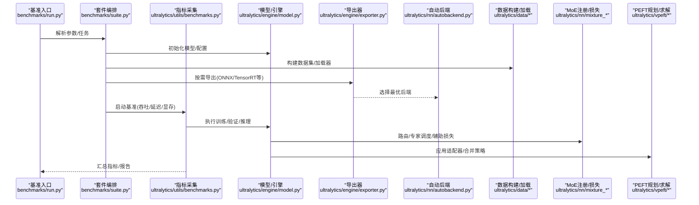
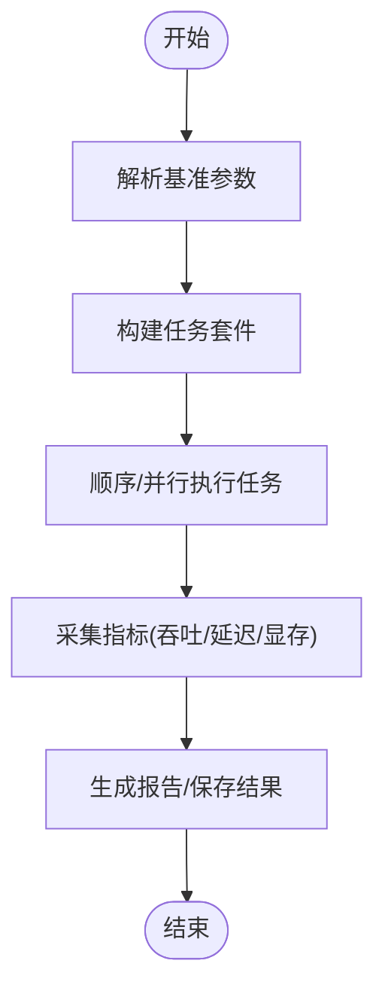
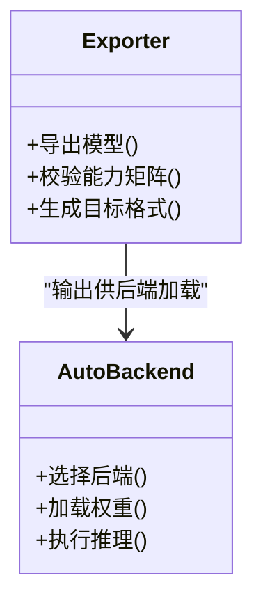
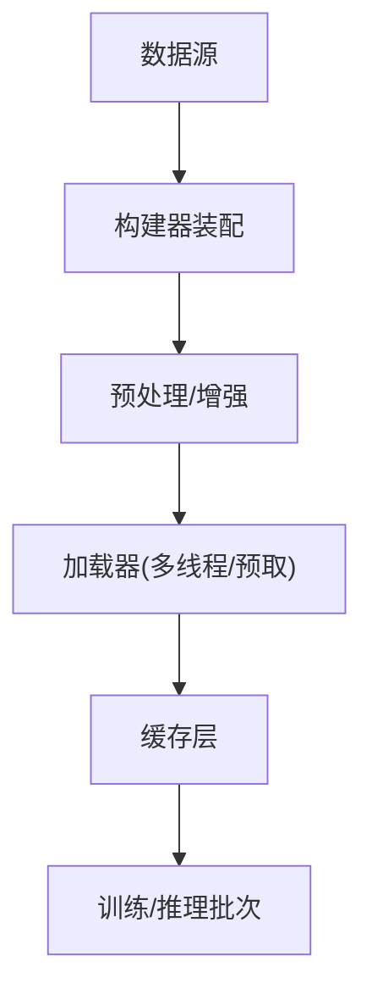
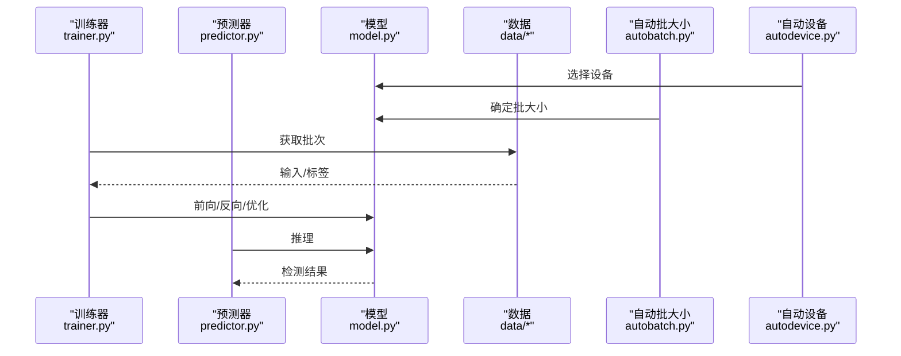
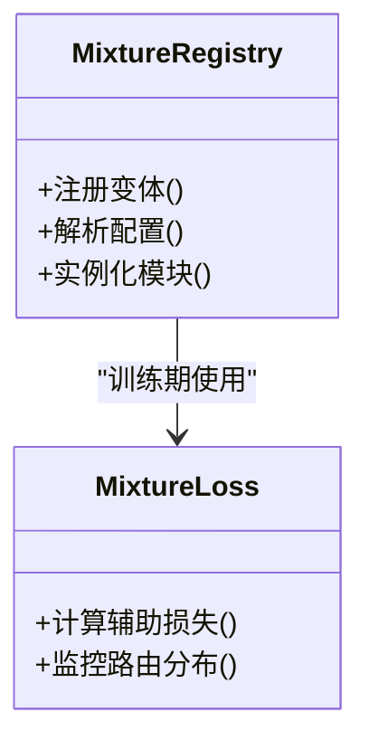
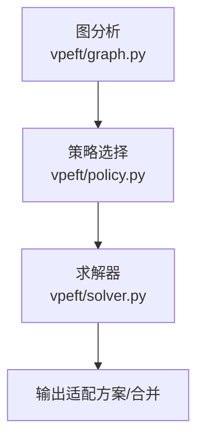
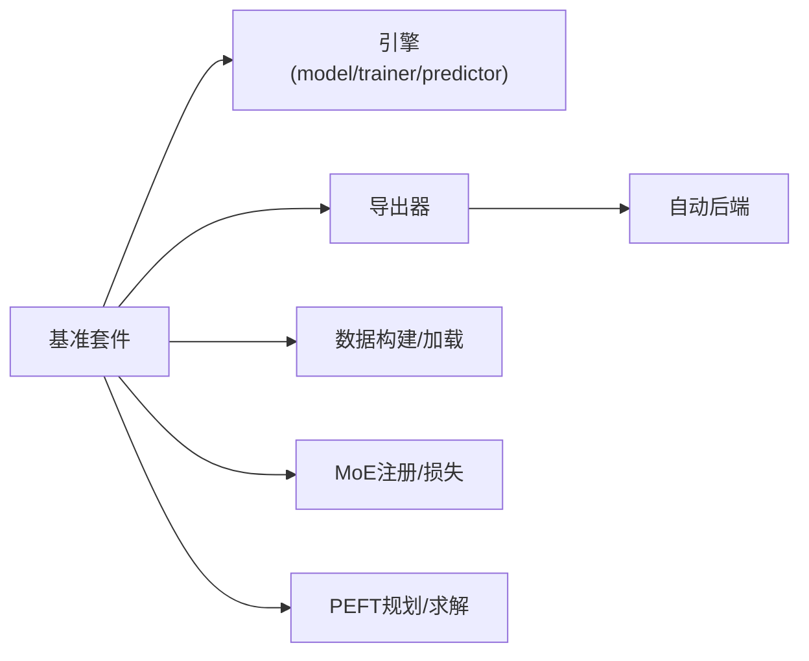

# 性能优化与调优

<cite>
**本文引用的文件**
- [benchmarks/run.py](file://benchmarks/run.py)
- [benchmarks/suite.py](file://benchmarks/suite.py)
- [benchmarks/benchmark_molora_dispatch.py](file://benchmarks/benchmark_molora_dispatch.py)
- [benchmarks/benchmark_mot_dispatch.py](file://benchmarks/benchmark_mot_dispatch.py)
- [ultralytics/utils/benchmarks.py](file://ultralytics/utils/benchmarks.py)
- [ultralytics/engine/exporter.py](file://ultralytics/engine/exporter.py)
- [ultralytics/nn/autobackend.py](file://ultralytics/nn/autobackend.py)
- [ultralytics/utils/autodevice.py](file://ultralytics/utils/autodevice.py)
- [ultralytics/utils/autobatch.py](file://ultralytics/utils/autobatch.py)
- [ultralytics/data/build.py](file://ultralytics/data/build.py)
- [ultralytics/data/dataset.py](file://ultralytics/data/dataset.py)
- [ultralytics/data/loaders.py](file://ultralytics/data/loaders.py)
- [ultralytics/engine/trainer.py](file://ultralytics/engine/trainer.py)
- [ultralytics/engine/predictor.py](file://ultralytics/engine/predictor.py)
- [ultralytics/engine/model.py](file://ultralytics/engine/model.py)
- [ultralytics/nn/mixture_loss.py](file://ultralytics/nn/mixture_loss.py)
- [ultralytics/nn/mixture_registry.py](file://ultralytics/nn/mixture_registry.py)
- [ultralytics/vpeft/graph.py](file://ultralytics/vpeft/graph.py)
- [ultralytics/vpeft/policy.py](file://ultralytics/vpeft/policy.py)
- [ultralytics/vpeft/solver.py](file://ultralytics/vpeft/solver.py)
- [scripts/bench_moe_micro.py](file://scripts/bench_moe_micro.py)
- [scripts/bench_moe_mps.py](file://scripts/bench_moe_mps.py)
- [scripts/eval_moe_peft.py](file://scripts/eval_moe_peft.py)
- [scripts/ablation_suite/full_ablation.py](file://scripts/ablation_suite/full_ablation.py)
- [scripts/ablation_suite/ablation_peft_visualize.py](file://scripts/ablation_suite/ablation_peft_visualize.py)
- [examples/YOLO-Master-Cross-Platform-Edge-Deployment/scripts/export_edge_models.py](file://examples/YOLO-Master-Cross-Platform-Edge-Deployment/scripts/export_edge_models.py)
- [examples/YOLO-Master-Edge-Deployment/export_edge_models.py](file://examples/YOLO-Master-Edge-Deployment/export_edge_models.py)
- [docs/governance/performance-gates.md](file://docs/governance/performance-gates.md)
</cite>

## 目录
1. [引言](#引言)
2. [项目结构](#项目结构)
3. [核心组件](#核心组件)
4. [架构总览](#架构总览)
5. [详细组件分析](#详细组件分析)
6. [依赖关系分析](#依赖关系分析)
7. [性能考量](#性能考量)
8. [故障排查指南](#故障排查指南)
9. [结论](#结论)
10. [附录](#附录)

## 引言
本指南面向在YOLO-Master项目中实现高性能训练与推理的工程团队，聚焦以下目标：
- GPU利用率低下的根因分析与优化路径（显存、计算图、数据加载）
- 推理速度慢的定位与加速策略（量化、剪枝、蒸馏、导出后端）
- 大规模数据处理与训练的内存管理（数据流、缓存、泄漏检测）
- 多硬件平台（CPU/GPU/TPU/边缘设备）的调优技巧
- MoE与PEFT相关模块的性能优化专门指导
- 基准测试工具的使用方法与结果解读

## 项目结构
围绕性能优化的关键代码分布在如下位置：
- 基准套件与脚本：benchmarks、scripts
- 运行时引擎：ultralytics/engine
- 模型与混合专家：ultralytics/nn/mixture_*
- 数据管道：ultralytics/data
- 自动设备/批大小/导出：ultralytics/utils、ultralytics/engine/exporter.py、ultralytics/nn/autobackend.py
- PEFT规划与执行：ultralytics/vpeft
- 边缘部署示例：examples/.../export_edge_models.py

图表来源
- [benchmarks/run.py](file://benchmarks/run.py)
- [benchmarks/suite.py](file://benchmarks/suite.py)
- [benchmarks/benchmark_molora_dispatch.py](file://benchmarks/benchmark_molora_dispatch.py)
- [benchmarks/benchmark_mot_dispatch.py](file://benchmarks/benchmark_mot_dispatch.py)
- [ultralytics/utils/benchmarks.py](file://ultralytics/utils/benchmarks.py)
- [ultralytics/engine/model.py](file://ultralytics/engine/model.py)
- [ultralytics/engine/exporter.py](file://ultralytics/engine/exporter.py)
- [ultralytics/nn/autobackend.py](file://ultralytics/nn/autobackend.py)
- [ultralytics/utils/autodevice.py](file://ultralytics/utils/autodevice.py)
- [ultralytics/utils/autobatch.py](file://ultralytics/utils/autobatch.py)
- [ultralytics/data/build.py](file://ultralytics/data/build.py)
- [ultralytics/data/dataset.py](file://ultralytics/data/dataset.py)
- [ultralytics/data/loaders.py](file://ultralytics/data/loaders.py)
- [ultralytics/nn/mixture_registry.py](file://ultralytics/nn/mixture_registry.py)
- [ultralytics/nn/mixture_loss.py](file://ultralytics/nn/mixture_loss.py)
- [ultralytics/vpeft/graph.py](file://ultralytics/vpeft/graph.py)
- [ultralytics/vpeft/policy.py](file://ultralytics/vpeft/policy.py)
- [ultralytics/vpeft/solver.py](file://ultralytics/vpeft/solver.py)

章节来源
- [benchmarks/run.py](file://benchmarks/run.py)
- [benchmarks/suite.py](file://benchmarks/suite.py)
- [ultralytics/utils/benchmarks.py](file://ultralytics/utils/benchmarks.py)
- [ultralytics/engine/model.py](file://ultralytics/engine/model.py)
- [ultralytics/engine/exporter.py](file://ultralytics/engine/exporter.py)
- [ultralytics/nn/autobackend.py](file://ultralytics/nn/autobackend.py)
- [ultralytics/utils/autodevice.py](file://ultralytics/utils/autodevice.py)
- [ultralytics/utils/autobatch.py](file://ultralytics/utils/autobatch.py)
- [ultralytics/data/build.py](file://ultralytics/data/build.py)
- [ultralytics/data/dataset.py](file://ultralytics/data/dataset.py)
- [ultralytics/data/loaders.py](file://ultralytics/data/loaders.py)
- [ultralytics/nn/mixture_registry.py](file://ultralytics/nn/mixture_registry.py)
- [ultralytics/nn/mixture_loss.py](file://ultralytics/nn/mixture_loss.py)
- [ultralytics/vpeft/graph.py](file://ultralytics/vpeft/graph.py)
- [ultralytics/vpeft/policy.py](file://ultralytics/vpeft/policy.py)
- [ultralytics/vpeft/solver.py](file://ultralytics/vpeft/solver.py)

## 核心组件
- 基准套件与运行器：提供统一入口、任务编排、指标采集与报告生成。
- 导出与自动后端：将模型导出为多种格式并选择最优推理后端。
- 数据构建与加载：负责数据集构建、预处理流水线与I/O吞吐优化。
- 训练与预测引擎：封装训练循环、验证流程与推理管线。
- 混合专家（MoE）注册与损失：支撑MoE路由、专家调度与辅助损失。
- PEFT规划与求解：对LoRA等适配器进行图级规划、策略选择与求解。
- 自动设备与批大小：根据硬件能力自动选择设备与批大小。

章节来源
- [benchmarks/run.py](file://benchmarks/run.py)
- [benchmarks/suite.py](file://benchmarks/suite.py)
- [ultralytics/utils/benchmarks.py](file://ultralytics/utils/benchmarks.py)
- [ultralytics/engine/exporter.py](file://ultralytics/engine/exporter.py)
- [ultralytics/nn/autobackend.py](file://ultralytics/nn/autobackend.py)
- [ultralytics/data/build.py](file://ultralytics/data/build.py)
- [ultralytics/data/dataset.py](file://ultralytics/data/dataset.py)
- [ultralytics/data/loaders.py](file://ultralytics/data/loaders.py)
- [ultralytics/engine/trainer.py](file://ultralytics/engine/trainer.py)
- [ultralytics/engine/predictor.py](file://ultralytics/engine/predictor.py)
- [ultralytics/nn/mixture_registry.py](file://ultralytics/nn/mixture_registry.py)
- [ultralytics/nn/mixture_loss.py](file://ultralytics/nn/mixture_loss.py)
- [ultralytics/vpeft/graph.py](file://ultralytics/vpeft/graph.py)
- [ultralytics/vpeft/policy.py](file://ultralytics/vpeft/policy.py)
- [ultralytics/vpeft/solver.py](file://ultralytics/vpeft/solver.py)
- [ultralytics/utils/autodevice.py](file://ultralytics/utils/autodevice.py)
- [ultralytics/utils/autobatch.py](file://ultralytics/utils/autobatch.py)

## 架构总览
下图展示从基准入口到具体子系统的关键调用链与数据流向。

图表来源
- [benchmarks/run.py](file://benchmarks/run.py)
- [benchmarks/suite.py](file://benchmarks/suite.py)
- [ultralytics/utils/benchmarks.py](file://ultralytics/utils/benchmarks.py)
- [ultralytics/engine/model.py](file://ultralytics/engine/model.py)
- [ultralytics/engine/exporter.py](file://ultralytics/engine/exporter.py)
- [ultralytics/nn/autobackend.py](file://ultralytics/nn/autobackend.py)
- [ultralytics/data/build.py](file://ultralytics/data/build.py)
- [ultralytics/data/dataset.py](file://ultralytics/data/dataset.py)
- [ultralytics/data/loaders.py](file://ultralytics/data/loaders.py)
- [ultralytics/nn/mixture_registry.py](file://ultralytics/nn/mixture_registry.py)
- [ultralytics/nn/mixture_loss.py](file://ultralytics/nn/mixture_loss.py)
- [ultralytics/vpeft/graph.py](file://ultralytics/vpeft/graph.py)
- [ultralytics/vpeft/policy.py](file://ultralytics/vpeft/policy.py)
- [ultralytics/vpeft/solver.py](file://ultralytics/vpeft/solver.py)

## 详细组件分析

### 基准套件与运行器
- 职责：统一参数解析、任务编排、指标采集、结果持久化；支持自定义子套件。
- 关键点：
  - 通过套件定义组合不同场景（训练/验证/推理/导出）。
  - 使用统一的指标采集接口记录吞吐、延迟、显存占用。
  - 可集成外部基准脚本（如MoE微基准、MPS环境基准）。

图表来源
- [benchmarks/run.py](file://benchmarks/run.py)
- [benchmarks/suite.py](file://benchmarks/suite.py)
- [ultralytics/utils/benchmarks.py](file://ultralytics/utils/benchmarks.py)

章节来源
- [benchmarks/run.py](file://benchmarks/run.py)
- [benchmarks/suite.py](file://benchmarks/suite.py)
- [ultralytics/utils/benchmarks.py](file://ultralytics/utils/benchmarks.py)

### 导出与自动后端
- 职责：将PyTorch模型导出为目标格式，并在推理时选择最优后端。
- 关键点：
  - 导出阶段进行算子兼容性与能力矩阵检查。
  - 自动后端根据可用库与硬件特性选择最佳执行引擎。
  - 结合量化/剪枝/蒸馏后的模型提升部署效率。

图表来源
- [ultralytics/engine/exporter.py](file://ultralytics/engine/exporter.py)
- [ultralytics/nn/autobackend.py](file://ultralytics/nn/autobackend.py)

章节来源
- [ultralytics/engine/exporter.py](file://ultralytics/engine/exporter.py)
- [ultralytics/nn/autobackend.py](file://ultralytics/nn/autobackend.py)

### 数据构建与加载
- 职责：构建数据集、预处理、多线程/异步加载、缓存与预取。
- 关键点：
  - 通过构建器组装数据源与增强策略。
  - 使用高效加载器减少I/O瓶颈，配合缓存降低重复读取。
  - 针对大图像/视频流进行分块与预取优化。

图表来源
- [ultralytics/data/build.py](file://ultralytics/data/build.py)
- [ultralytics/data/dataset.py](file://ultralytics/data/dataset.py)
- [ultralytics/data/loaders.py](file://ultralytics/data/loaders.py)

章节来源
- [ultralytics/data/build.py](file://ultralytics/data/build.py)
- [ultralytics/data/dataset.py](file://ultralytics/data/dataset.py)
- [ultralytics/data/loaders.py](file://ultralytics/data/loaders.py)

### 训练与预测引擎
- 职责：封装训练循环、验证流程、推理管线；对接数据与模型。
- 关键点：
  - 训练侧关注梯度同步、EMA、混合精度与分布式通信。
  - 推理侧关注预热、批内并行、后处理优化。
  - 与自动设备/批大小协同，最大化硬件利用率。

图表来源
- [ultralytics/engine/trainer.py](file://ultralytics/engine/trainer.py)
- [ultralytics/engine/predictor.py](file://ultralytics/engine/predictor.py)
- [ultralytics/engine/model.py](file://ultralytics/engine/model.py)
- [ultralytics/utils/autobatch.py](file://ultralytics/utils/autobatch.py)
- [ultralytics/utils/autodevice.py](file://ultralytics/utils/autodevice.py)
- [ultralytics/data/build.py](file://ultralytics/data/build.py)
- [ultralytics/data/dataset.py](file://ultralytics/data/dataset.py)
- [ultralytics/data/loaders.py](file://ultralytics/data/loaders.py)

章节来源
- [ultralytics/engine/trainer.py](file://ultralytics/engine/trainer.py)
- [ultralytics/engine/predictor.py](file://ultralytics/engine/predictor.py)
- [ultralytics/engine/model.py](file://ultralytics/engine/model.py)
- [ultralytics/utils/autobatch.py](file://ultralytics/utils/autobatch.py)
- [ultralytics/utils/autodevice.py](file://ultralytics/utils/autodevice.py)
- [ultralytics/data/build.py](file://ultralytics/data/build.py)
- [ultralytics/data/dataset.py](file://ultralytics/data/dataset.py)
- [ultralytics/data/loaders.py](file://ultralytics/data/loaders.py)

### 混合专家（MoE）注册与损失
- 职责：注册MoE变体、管理路由与专家、计算辅助损失。
- 关键点：
  - 路由策略影响负载均衡与吞吐。
  - 辅助损失用于稳定训练与均衡专家使用。
  - 导出时需保留路由逻辑或进行稀疏化融合。

图表来源
- [ultralytics/nn/mixture_registry.py](file://ultralytics/nn/mixture_registry.py)
- [ultralytics/nn/mixture_loss.py](file://ultralytics/nn/mixture_loss.py)

章节来源
- [ultralytics/nn/mixture_registry.py](file://ultralytics/nn/mixture_registry.py)
- [ultralytics/nn/mixture_loss.py](file://ultralytics/nn/mixture_loss.py)

### PEFT规划与求解
- 职责：对LoRA等适配器进行图级规划、策略选择与求解，兼顾精度与性能。
- 关键点：
  - 图分析识别可插入点与依赖关系。
  - 策略评估权衡参数量、吞吐与精度。
  - 求解器输出最终适配方案并支持合并导出。

图表来源
- [ultralytics/vpeft/graph.py](file://ultralytics/vpeft/graph.py)
- [ultralytics/vpeft/policy.py](file://ultralytics/vpeft/policy.py)
- [ultralytics/vpeft/solver.py](file://ultralytics/vpeft/solver.py)

章节来源
- [ultralytics/vpeft/graph.py](file://ultralytics/vpeft/graph.py)
- [ultralytics/vpeft/policy.py](file://ultralytics/vpeft/policy.py)
- [ultralytics/vpeft/solver.py](file://ultralytics/vpeft/solver.py)

### MoE与PEFT专项优化
- MoE路由与专家调度：
  - 调整路由阈值与专家容量，避免热点专家导致负载不均。
  - 使用辅助损失与动态调度策略平衡专家使用率。
  - 导出时考虑稀疏融合与算子融合以减少开销。
- PEFT（LoRA等）：
  - 选择合适秩与目标层，控制参数量与吞吐折中。
  - 合并适配器以消除运行时分支，提升推理速度。
  - 结合量化/剪枝进一步压缩模型。

章节来源
- [scripts/bench_moe_micro.py](file://scripts/bench_moe_micro.py)
- [scripts/bench_moe_mps.py](file://scripts/bench_moe_mps.py)
- [scripts/eval_moe_peft.py](file://scripts/eval_moe_peft.py)
- [scripts/ablation_suite/full_ablation.py](file://scripts/ablation_suite/full_ablation.py)
- [scripts/ablation_suite/ablation_peft_visualize.py](file://scripts/ablation_suite/ablation_peft_visualize.py)
- [ultralytics/nn/mixture_registry.py](file://ultralytics/nn/mixture_registry.py)
- [ultralytics/nn/mixture_loss.py](file://ultralytics/nn/mixture_loss.py)
- [ultralytics/vpeft/graph.py](file://ultralytics/vpeft/graph.py)
- [ultralytics/vpeft/policy.py](file://ultralytics/vpeft/policy.py)
- [ultralytics/vpeft/solver.py](file://ultralytics/vpeft/solver.py)

### 边缘部署与跨平台导出
- 职责：针对不同边缘平台生成优化模型，确保端到端性能。
- 关键点：
  - 导出脚本按平台需求选择目标格式与优化选项。
  - 结合量化与算子融合降低延迟与功耗。
  - 在目标设备上做端到端验证与回归测试。

章节来源
- [examples/YOLO-Master-Cross-Platform-Edge-Deployment/scripts/export_edge_models.py](file://examples/YOLO-Master-Cross-Platform-Edge-Deployment/scripts/export_edge_models.py)
- [examples/YOLO-Master-Edge-Deployment/export_edge_models.py](file://examples/YOLO-Master-Edge-Deployment/export_edge_models.py)

## 依赖关系分析
- 基准套件依赖引擎、导出器、自动后端、数据构建与加载、MoE与PEFT模块。
- 导出器与自动后端形成“导出-选择”闭环，决定最终推理后端。
- 数据构建与加载直接影响GPU/CPU利用率与吞吐。
- MoE注册与损失贯穿训练期，影响路由稳定性与收敛。
- PEFT规划与求解在训练/导出前后均可介入，影响模型体积与推理性能。

图表来源
- [benchmarks/run.py](file://benchmarks/run.py)
- [benchmarks/suite.py](file://benchmarks/suite.py)
- [ultralytics/engine/model.py](file://ultralytics/engine/model.py)
- [ultralytics/engine/trainer.py](file://ultralytics/engine/trainer.py)
- [ultralytics/engine/predictor.py](file://ultralytics/engine/predictor.py)
- [ultralytics/engine/exporter.py](file://ultralytics/engine/exporter.py)
- [ultralytics/nn/autobackend.py](file://ultralytics/nn/autobackend.py)
- [ultralytics/data/build.py](file://ultralytics/data/build.py)
- [ultralytics/data/dataset.py](file://ultralytics/data/dataset.py)
- [ultralytics/data/loaders.py](file://ultralytics/data/loaders.py)
- [ultralytics/nn/mixture_registry.py](file://ultralytics/nn/mixture_registry.py)
- [ultralytics/nn/mixture_loss.py](file://ultralytics/nn/mixture_loss.py)
- [ultralytics/vpeft/graph.py](file://ultralytics/vpeft/graph.py)
- [ultralytics/vpeft/policy.py](file://ultralytics/vpeft/policy.py)
- [ultralytics/vpeft/solver.py](file://ultralytics/vpeft/solver.py)

章节来源
- [benchmarks/run.py](file://benchmarks/run.py)
- [benchmarks/suite.py](file://benchmarks/suite.py)
- [ultralytics/engine/model.py](file://ultralytics/engine/model.py)
- [ultralytics/engine/trainer.py](file://ultralytics/engine/trainer.py)
- [ultralytics/engine/predictor.py](file://ultralytics/engine/predictor.py)
- [ultralytics/engine/exporter.py](file://ultralytics/engine/exporter.py)
- [ultralytics/nn/autobackend.py](file://ultralytics/nn/autobackend.py)
- [ultralytics/data/build.py](file://ultralytics/data/build.py)
- [ultralytics/data/dataset.py](file://ultralytics/data/dataset.py)
- [ultralytics/data/loaders.py](file://ultralytics/data/loaders.py)
- [ultralytics/nn/mixture_registry.py](file://ultralytics/nn/mixture_registry.py)
- [ultralytics/nn/mixture_loss.py](file://ultralytics/nn/mixture_loss.py)
- [ultralytics/vpeft/graph.py](file://ultralytics/vpeft/graph.py)
- [ultralytics/vpeft/policy.py](file://ultralytics/vpeft/policy.py)
- [ultralytics/vpeft/solver.py](file://ultralytics/vpeft/solver.py)

## 性能考量
- GPU利用率低下常见原因与对策
  - I/O瓶颈：数据加载慢导致GPU空闲。优化方向包括多线程/预取、缓存、磁盘与网络优化。
  - 批大小不当：过小导致并行度不足，过大引发频繁交换或OOM。使用自动批大小工具寻找上限。
  - 计算图碎片化：频繁创建临时张量与Python回调增加开销。尽量使用算子融合与静态图导出。
  - 路由/专家不均衡：MoE热点专家造成拥塞。调整路由阈值与辅助损失权重，必要时剪枝低效专家。
- 显存使用优化
  - 启用混合精度与梯度检查点，减少中间激活占用。
  - 合理设置批大小与序列长度，避免峰值显存溢出。
  - 及时释放不再使用的张量与缓存，避免引用累积。
- 推理速度慢定位与优化
  - 使用基准套件测量端到端延迟与吞吐，定位瓶颈阶段（预处理/推理/后处理）。
  - 导出为高效格式并选择最优后端，结合量化/剪枝/蒸馏。
  - 预热模型与后端，减少冷启动开销。
- 大规模数据处理与训练内存管理
  - 数据流优化：分块读取、预取、缓存命中提升。
  - 内存泄漏检测：定期快照与差异对比，追踪未释放对象。
  - 分布式训练：注意梯度同步与AllReduce开销，合理切分与通信策略。
- 多硬件平台调优
  - CPU：开启线程数与SIMD优化，减少Python开销，使用轻量后端。
  - GPU：利用TensorCore与专用库，选择合适dtype与批大小。
  - TPU：对齐形状与批量，避免动态形状导致的编译开销。
  - 边缘设备：量化至INT8/FP16，裁剪冗余分支，选择最小运行时。
- MoE与PEFT专项
  - MoE：路由校准、专家容量与负载均衡、动态调度与稀疏融合。
  - PEFT：秩选择、目标层筛选、合并导出与量化协同。

[本节为通用指导，无需特定文件来源]

## 故障排查指南
- 基准与诊断
  - 使用基准套件复现实验，固定随机种子与环境，确保可重现。
  - 分别测量数据加载、模型前向、后处理耗时，定位瓶颈。
- 显存问题
  - 观察峰值显存与增长趋势，定位异常分配点。
  - 关闭不必要的日志与可视化，减少额外内存。
- 路由与专家异常
  - 检查路由分布是否极端倾斜，必要时调整辅助损失或路由阈值。
  - 导出后验证路由逻辑一致性，避免稀疏化引入偏差。
- PEFT相关问题
  - 确认适配器已正确注入与合并，导出后权重一致。
  - 对比不同秩与策略的效果，选择性价比最优方案。

章节来源
- [benchmarks/run.py](file://benchmarks/run.py)
- [benchmarks/suite.py](file://benchmarks/suite.py)
- [ultralytics/utils/benchmarks.py](file://ultralytics/utils/benchmarks.py)
- [scripts/bench_moe_micro.py](file://scripts/bench_moe_micro.py)
- [scripts/bench_moe_mps.py](file://scripts/bench_moe_mps.py)
- [scripts/eval_moe_peft.py](file://scripts/eval_moe_peft.py)
- [scripts/ablation_suite/full_ablation.py](file://scripts/ablation_suite/full_ablation.py)
- [scripts/ablation_suite/ablation_peft_visualize.py](file://scripts/ablation_suite/ablation_peft_visualize.py)

## 结论
通过系统化基准、导出与后端选择、数据流优化、MoE/PEFT专项调优以及多硬件平台的适配，可以显著提升YOLO-Master的训练与推理性能。建议将性能门禁纳入持续集成，确保每次变更都通过基准与回归测试。

[本节为总结性内容，无需特定文件来源]

## 附录
- 性能门禁与治理
  - 参考性能门禁文档，建立基线与阈值，自动化回归检测。
- 常用命令与脚本
  - 使用基准套件运行标准任务，结合MoE与PEFT专项脚本进行深度分析。
  - 边缘部署示例脚本用于跨平台导出与验证。

章节来源
- [docs/governance/performance-gates.md](file://docs/governance/performance-gates.md)
- [benchmarks/run.py](file://benchmarks/run.py)
- [benchmarks/suite.py](file://benchmarks/suite.py)
- [scripts/bench_moe_micro.py](file://scripts/bench_moe_micro.py)
- [scripts/bench_moe_mps.py](file://scripts/bench_moe_mps.py)
- [scripts/eval_moe_peft.py](file://scripts/eval_moe_peft.py)
- [examples/YOLO-Master-Cross-Platform-Edge-Deployment/scripts/export_edge_models.py](file://examples/YOLO-Master-Cross-Platform-Edge-Deployment/scripts/export_edge_models.py)
- [examples/YOLO-Master-Edge-Deployment/export_edge_models.py](file://examples/YOLO-Master-Edge-Deployment/export_edge_models.py)