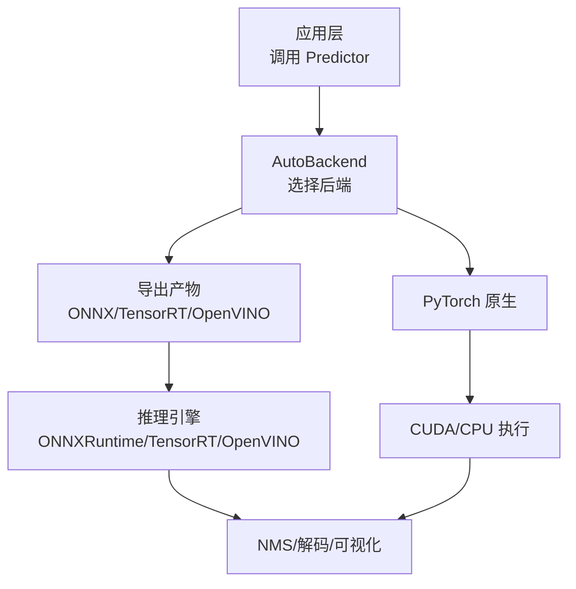
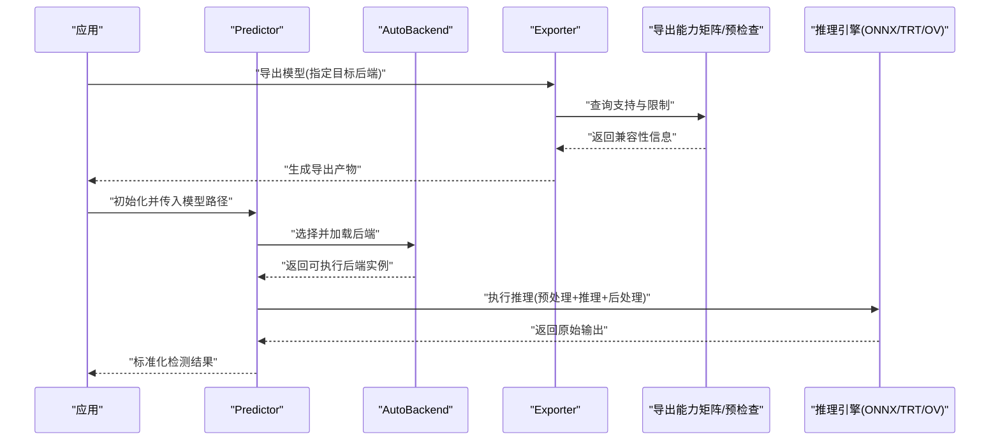
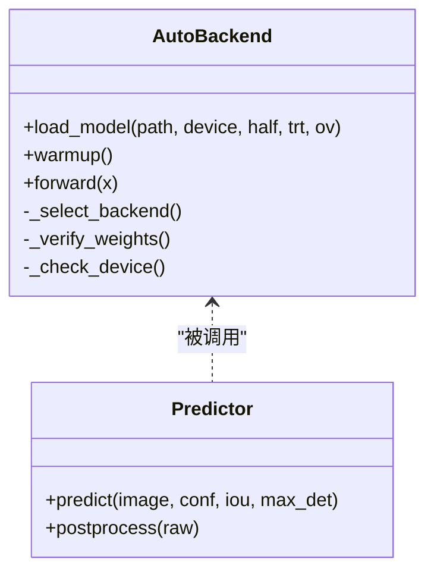
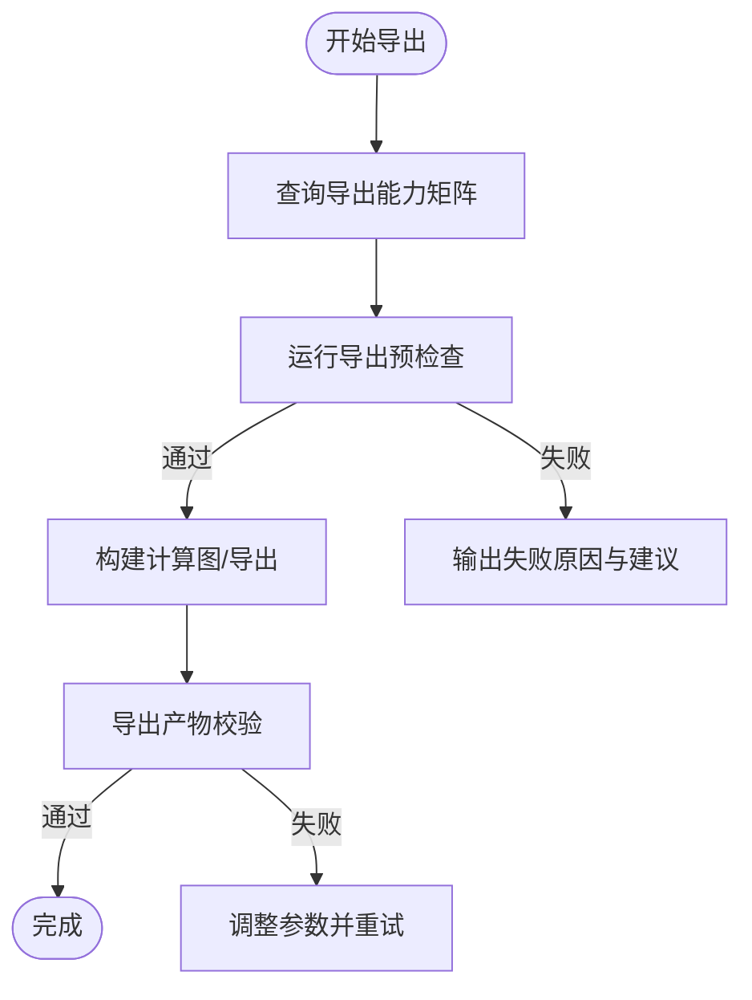
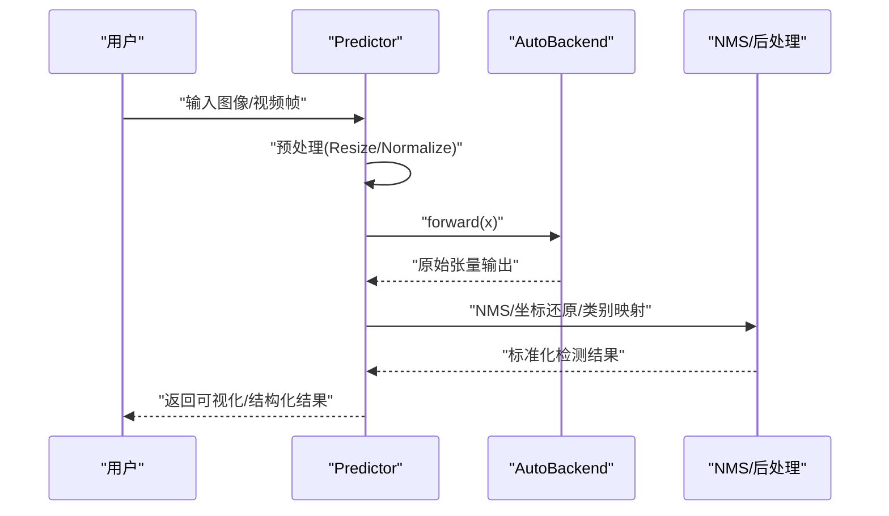
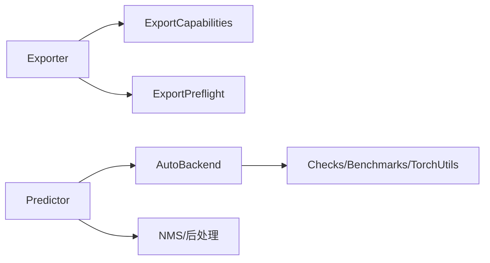
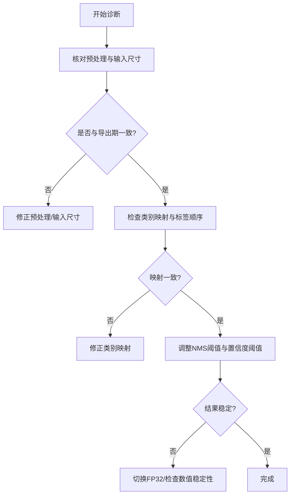

# 推理问题排查

<cite>
**本文引用的文件**
- [README.md](file://README.md)
- [engine/exporter.py](file://ultralytics/engine/exporter.py)
- [engine/predictor.py](file://ultralytics/engine/predictor.py)
- [nn/autobackend.py](file://ultralytics/nn/autobackend.py)
- [utils/export_capabilities.py](file://ultralytics/utils/export_capabilities.py)
- [utils/export_preflight.py](file://ultralytics/utils/export_preflight.py)
- [utils/checks.py](file://ultralytics/utils/checks.py)
- [utils/benchmarks.py](file://ultralytics/utils/benchmarks.py)
- [utils/nms.py](file://ultralytics/utils/nms.py)
- [utils/torch_utils.py](file://ultralytics/utils/torch_utils.py)
- [examples/YOLOv8-ONNXRuntime/main.py](file://examples/YOLOv8-ONNXRuntime/main.py)
- [examples/YOLOv8-OpenVINO-CPP-Inference/inference.cc](file://examples/YOLOv8-OpenVINO-CPP-Inference/inference.cc)
- [examples/YOLO-Master-Edge-Deployment/export_edge_models.py](file://examples/YOLO-Master-Edge-Deployment/export_edge_models.py)
- [examples/YOLO-Master-Edge-Deployment/validate_edge_outputs.py](file://examples/YOLO-Master-Edge-Deployment/validate_edge_outputs.py)
- [tests/test_autobackend_warmup.py](file://tests/test_autobackend_warmup.py)
- [tests/test_export_preflight.py](file://tests/test_export_preflight.py)
- [tests/test_exports.py](file://tests/test_exports.py)
- [tests/test_onnx_export_fix.py](file://tests/test_onnx_export_fix.py)
- [tests/test_engine.py](file://tests/test_engine.py)
</cite>

## 目录
1. [简介](#简介)
2. [项目结构](#项目结构)
3. [核心组件](#核心组件)
4. [架构总览](#架构总览)
5. [详细组件分析](#详细组件分析)
6. [依赖关系分析](#依赖关系分析)
7. [性能考量](#性能考量)
8. [故障排查指南](#故障排查指南)
9. [结论](#结论)
10. [附录](#附录)

## 简介
本指南面向使用 YOLO-Master 进行模型推理与部署的工程师，聚焦“推理问题排查”。内容覆盖：
- 模型加载失败的常见原因（权重损坏、格式不兼容、版本不匹配）
- 推理结果异常的诊断方法（检测框偏移、类别预测错误、置信度异常）
- 不同导出格式的兼容性与注意事项（ONNX、TensorRT、OpenVINO 等）
- 实时推理性能优化建议（批大小、输入尺寸、内存管理）
- 移动端与边缘设备部署的典型问题与解决方案
- 多线程推理与并发处理的常见问题及优化策略

## 项目结构
本项目围绕“训练-导出-推理”的全链路构建。与推理相关的关键路径包括：
- 导出能力矩阵与预检查：用于在导出前校验目标后端支持情况
- AutoBackend：运行时自动选择最优后端（TorchScript/ONNX/TensorRT/OpenVINO 等）
- Predictor：统一推理入口，封装预处理、推理、后处理与可视化
- 示例工程：提供 ONNXRuntime、OpenVINO C++、边缘端导出与验证脚本

图表来源
- [engine/predictor.py](file://ultralytics/engine/predictor.py)
- [nn/autobackend.py](file://ultralytics/nn/autobackend.py)
- [utils/export_capabilities.py](file://ultralytics/utils/export_capabilities.py)

章节来源
- [README.md](file://README.md)
- [engine/exporter.py](file://ultralytics/engine/exporter.py)
- [utils/export_capabilities.py](file://ultralytics/utils/export_capabilities.py)
- [utils/export_preflight.py](file://ultralytics/utils/export_preflight.py)

## 核心组件
- AutoBackend：负责根据可用环境与模型后缀自动选择并加载对应后端，完成权重载入、设备迁移与预热。
- Predictor：统一推理接口，包含数据预处理、模型推理、后处理（NMS/坐标还原）、结果封装与可视化。
- Exporter：将 PyTorch 模型导出为多种格式，并在导出前后进行能力校验与兼容性检查。
- 导出能力矩阵与预检查：维护各后端对模型特性、算子、精度的支持矩阵；在导出前进行可行性评估。
- 工具库：环境检查、基准测试、NMS、数值稳定性辅助等。

章节来源
- [nn/autobackend.py](file://ultralytics/nn/autobackend.py)
- [engine/predictor.py](file://ultralytics/engine/predictor.py)
- [engine/exporter.py](file://ultralytics/engine/exporter.py)
- [utils/export_capabilities.py](file://ultralytics/utils/export_capabilities.py)
- [utils/export_preflight.py](file://ultralytics/utils/export_preflight.py)
- [utils/nms.py](file://ultralytics/utils/nms.py)
- [utils/benchmarks.py](file://ultralytics/utils/benchmarks.py)
- [utils/checks.py](file://ultralytics/utils/checks.py)

## 架构总览
下图展示了从“导出”到“推理”的关键流程与组件交互。

图表来源
- [engine/exporter.py](file://ultralytics/engine/exporter.py)
- [utils/export_capabilities.py](file://ultralytics/utils/export_capabilities.py)
- [utils/export_preflight.py](file://ultralytics/utils/export_preflight.py)
- [nn/autobackend.py](file://ultralytics/nn/autobackend.py)
- [engine/predictor.py](file://ultralytics/engine/predictor.py)

## 详细组件分析

### 组件A：AutoBackend 与模型加载
- 职责：根据模型后缀与环境可用性，自动选择 TorchScript/ONNX/TensorRT/OpenVINO 等后端，完成权重加载、设备绑定与预热。
- 关键点：
  - 权重完整性校验（文件大小、哈希或可读性）
  - 后端能力探测（GPU/驱动/引擎版本）
  - 精度与数据类型一致性（FP32/FP16/INT8）
  - 预热与缓存（避免首次推理抖动）

图表来源
- [nn/autobackend.py](file://ultralytics/nn/autobackend.py)
- [engine/predictor.py](file://ultralytics/engine/predictor.py)

章节来源
- [nn/autobackend.py](file://ultralytics/nn/autobackend.py)
- [tests/test_autobackend_warmup.py](file://tests/test_autobackend_warmup.py)

### 组件B：导出器与能力矩阵
- 职责：将 PyTorch 模型导出为目标后端格式，并在导出前进行能力与兼容性检查。
- 关键点：
  - 导出参数（动态轴、输入尺寸、精度、算子白名单）
  - 能力矩阵（后端是否支持当前模型结构与配置）
  - 预检查（导出前失败快速反馈）
  - 导出产物校验（形状、dtype、关键节点）

图表来源
- [engine/exporter.py](file://ultralytics/engine/exporter.py)
- [utils/export_capabilities.py](file://ultralytics/utils/export_capabilities.py)
- [utils/export_preflight.py](file://ultralytics/utils/export_preflight.py)

章节来源
- [engine/exporter.py](file://ultralytics/engine/exporter.py)
- [utils/export_capabilities.py](file://ultralytics/utils/export_capabilities.py)
- [utils/export_preflight.py](file://ultralytics/utils/export_preflight.py)
- [tests/test_export_preflight.py](file://tests/test_export_preflight.py)
- [tests/test_exports.py](file://tests/test_exports.py)
- [tests/test_onnx_export_fix.py](file://tests/test_onnx_export_fix.py)

### 组件C：推理流水线与后处理
- 职责：统一封装预处理、推理、后处理（NMS、坐标还原、类别映射）与结果可视化。
- 关键点：
  - 输入尺寸与归一化（保持与训练一致）
  - NMS 阈值与最大检测数
  - 坐标还原（缩放回原图尺寸）
  - 类别索引与标签映射一致性

图表来源
- [engine/predictor.py](file://ultralytics/engine/predictor.py)
- [utils/nms.py](file://ultralytics/utils/nms.py)

章节来源
- [engine/predictor.py](file://ultralytics/engine/predictor.py)
- [utils/nms.py](file://ultralytics/utils/nms.py)

## 依赖关系分析
- 导出阶段依赖能力矩阵与预检查，确保目标后端可正确解析模型结构与算子。
- 推理阶段依赖 AutoBackend 选择合适后端，并与 NMS/后处理模块协作。
- 工具库贯穿全流程：环境检查、基准测试、数值稳定与日志记录。

图表来源
- [engine/exporter.py](file://ultralytics/engine/exporter.py)
- [utils/export_capabilities.py](file://ultralytics/utils/export_capabilities.py)
- [utils/export_preflight.py](file://ultralytics/utils/export_preflight.py)
- [engine/predictor.py](file://ultralytics/engine/predictor.py)
- [nn/autobackend.py](file://ultralytics/nn/autobackend.py)
- [utils/nms.py](file://ultralytics/utils/nms.py)
- [utils/checks.py](file://ultralytics/utils/checks.py)
- [utils/benchmarks.py](file://ultralytics/utils/benchmarks.py)
- [utils/torch_utils.py](file://ultralytics/utils/torch_utils.py)

章节来源
- [utils/export_capabilities.py](file://ultralytics/utils/export_capabilities.py)
- [utils/export_preflight.py](file://ultralytics/utils/export_preflight.py)
- [utils/checks.py](file://ultralytics/utils/checks.py)
- [utils/benchmarks.py](file://ultralytics/utils/benchmarks.py)
- [utils/torch_utils.py](file://ultralytics/utils/torch_utils.py)

## 性能考量
- 批处理大小：在 GPU 上适度增大 batch 提升吞吐，但需关注显存占用与延迟权衡。
- 输入尺寸：减小输入分辨率可显著降低计算量，但可能影响小目标召回。
- 精度与量化：FP16/INT8 可加速推理，需校准集与端到端精度验证。
- 内存管理：复用输入缓冲区、减少中间拷贝、避免频繁设备切换。
- 预热与缓存：首次推理预热，固定输入尺寸以减少重编译开销。
- I/O 与解码：视频流解码与预处理并行化，避免阻塞推理线程。

[本节为通用指导，无需具体文件引用]

## 故障排查指南

### 一、模型加载失败
常见原因与定位步骤：
- 权重文件损坏或不完整
  - 现象：加载时报错、断言失败、形状不匹配
  - 排查：核对文件大小/哈希；尝试重新下载；确认路径与权限
  - 参考实现位置：权重校验与设备检查逻辑
- 格式不兼容
  - 现象：后端无法解析模型或算子不支持
  - 排查：查看导出能力矩阵与预检查结果；确认导出参数（动态轴、输入尺寸、精度）
  - 参考实现位置：导出能力矩阵与预检查
- 版本不匹配
  - 现象：运行时依赖版本与导出时不一致导致崩溃
  - 排查：对齐后端引擎版本（如 TensorRT/OpenVINO）与 Python/驱动版本
  - 参考实现位置：环境检查与基准工具

章节来源
- [nn/autobackend.py](file://ultralytics/nn/autobackend.py)
- [utils/export_capabilities.py](file://ultralytics/utils/export_capabilities.py)
- [utils/export_preflight.py](file://ultralytics/utils/export_preflight.py)
- [utils/checks.py](file://ultralytics/utils/checks.py)
- [tests/test_autobackend_warmup.py](file://tests/test_autobackend_warmup.py)

### 二、推理结果异常
- 检测框偏移
  - 可能原因：预处理 Resize/Pad 与后处理坐标还原不一致；输入尺寸与导出期不一致
  - 诊断：打印预处理参数与输入尺寸；对比导出期配置；检查坐标还原缩放比例
  - 参考实现位置：Predictor 预处理与后处理
- 类别预测错误
  - 可能原因：类别索引与标签映射不一致；多任务/多标签配置差异
  - 诊断：核对类别映射表；检查导出期类别数量与推理期标签顺序
  - 参考实现位置：Predictor 结果封装与可视化
- 置信度异常（过高/过低/NaN）
  - 可能原因：NMS 阈值设置不当；数值不稳定；精度转换引入误差
  - 诊断：调整 conf/iou 阈值；启用 FP32 复测；检查 NMS 实现与数值稳定性
  - 参考实现位置：NMS 与数值工具

章节来源
- [engine/predictor.py](file://ultralytics/engine/predictor.py)
- [utils/nms.py](file://ultralytics/utils/nms.py)
- [utils/torch_utils.py](file://ultralytics/utils/torch_utils.py)

### 三、导出格式兼容性与注意事项
- ONNX
  - 注意：动态轴与静态输入尺寸的选择；算子版本与 opset；导出后形状与 dtype 校验
  - 参考：导出能力矩阵、预检查与 ONNX 修复用例
- TensorRT
  - 注意：精度（FP16/INT8）与校准集；引擎版本与 GPU 架构；输入尺寸与批量上限
  - 参考：导出能力矩阵与预检查
- OpenVINO
  - 注意：IR 版本与模型优化选项；CPU/GPU/NPU 后端差异；输入尺寸与数据类型
  - 参考：示例工程与导出能力矩阵

章节来源
- [engine/exporter.py](file://ultralytics/engine/exporter.py)
- [utils/export_capabilities.py](file://ultralytics/utils/export_capabilities.py)
- [utils/export_preflight.py](file://ultralytics/utils/export_preflight.py)
- [tests/test_onnx_export_fix.py](file://tests/test_onnx_export_fix.py)
- [tests/test_exports.py](file://tests/test_exports.py)

### 四、实时推理性能优化
- 批大小与输入尺寸调优：以端到端延迟与吞吐为目标，结合业务场景做折中
- 内存与I/O优化：复用缓冲区、异步解码、零拷贝路径
- 精度与量化：优先 FP16，必要时 INT8 并严格回归验证
- 预热与缓存：固定输入尺寸，避免重复编译；首帧预热
- 监控与基准：使用基准工具采集延迟/吞吐曲线，定位瓶颈

章节来源
- [utils/benchmarks.py](file://ultralytics/utils/benchmarks.py)
- [utils/checks.py](file://ultralytics/utils/checks.py)

### 五、移动端与边缘设备部署
典型问题与解决思路：
- 模型过大或算子不受支持
  - 解决：裁剪模型、选择轻量分支、使用能力矩阵筛选可行方案
- 内存不足或带宽受限
  - 解决：降低输入尺寸、减少 batch、量化与剪枝
- 平台差异（ARM/NPU/GPU）
  - 解决：针对目标平台导出专用格式（如 TFLite/CoreML/RKNN），并进行端到端验证
- 示例与验证
  - 参考：边缘导出脚本与输出验证脚本

章节来源
- [examples/YOLO-Master-Edge-Deployment/export_edge_models.py](file://examples/YOLO-Master-Edge-Deployment/export_edge_models.py)
- [examples/YOLO-Master-Edge-Deployment/validate_edge_outputs.py](file://examples/YOLO-Master-Edge-Deployment/validate_edge_outputs.py)
- [utils/export_capabilities.py](file://ultralytics/utils/export_capabilities.py)

### 六、多线程推理与并发处理
常见问题：
- 资源竞争：同一模型实例在多进程/多线程下访问导致状态污染
- 设备冲突：跨线程切换 CUDA 上下文引发崩溃
- 锁与队列：共享队列未加锁或死锁
优化策略：
- 每线程/每进程独立模型实例
- 固定设备与上下文，避免运行时切换
- 使用线程安全的数据结构与队列
- 合理设置线程池大小与批大小，避免过载

章节来源
- [engine/predictor.py](file://ultralytics/engine/predictor.py)
- [nn/autobackend.py](file://ultralytics/nn/autobackend.py)
- [tests/test_engine.py](file://tests/test_engine.py)

### 七、外部推理引擎集成要点
- ONNXRuntime（Python）
  - 注意：会话创建与输入命名；输入形状与 dtype；NMS 节点是否在导出图中
  - 参考：示例工程
- OpenVINO（C++）
  - 注意：Core API 与 IR 版本；设备选择与插件；输入布局与步长
  - 参考：示例工程

章节来源
- [examples/YOLOv8-ONNXRuntime/main.py](file://examples/YOLOv8-ONNXRuntime/main.py)
- [examples/YOLOv8-OpenVINO-CPP-Inference/inference.cc](file://examples/YOLOv8-OpenVINO-CPP-Inference/inference.cc)

## 结论
推理问题的定位应遵循“导出能力先行、加载环境校验、推理链路分段验证”的原则。通过能力矩阵与预检查规避不可行方案；通过 AutoBackend 与 Predictor 的分层职责隔离问题域；借助基准与工具链持续监控性能与稳定性。对于边缘与移动端，务必以目标平台为导向进行导出与验证，确保端到端一致性与鲁棒性。

## 附录
- 常用命令与脚本路径（示例）
  - 导出与预检查：见导出器与预检查模块
  - 边缘导出与验证：见边缘部署示例
  - 外部引擎集成：见 ONNXRuntime 与 OpenVINO 示例
- 参考文档与测试
  - 导出能力矩阵与预检查用例
  - 引擎与后端相关测试

章节来源
- [engine/exporter.py](file://ultralytics/engine/exporter.py)
- [utils/export_capabilities.py](file://ultralytics/utils/export_capabilities.py)
- [utils/export_preflight.py](file://ultralytics/utils/export_preflight.py)
- [examples/YOLO-Master-Edge-Deployment/export_edge_models.py](file://examples/YOLO-Master-Edge-Deployment/export_edge_models.py)
- [examples/YOLO-Master-Edge-Deployment/validate_edge_outputs.py](file://examples/YOLO-Master-Edge-Deployment/validate_edge_outputs.py)
- [examples/YOLOv8-ONNXRuntime/main.py](file://examples/YOLOv8-ONNXRuntime/main.py)
- [examples/YOLOv8-OpenVINO-CPP-Inference/inference.cc](file://examples/YOLOv8-OpenVINO-CPP-Inference/inference.cc)
- [tests/test_export_preflight.py](file://tests/test_export_preflight.py)
- [tests/test_exports.py](file://tests/test_exports.py)
- [tests/test_onnx_export_fix.py](file://tests/test_onnx_export_fix.py)
- [tests/test_engine.py](file://tests/test_engine.py)