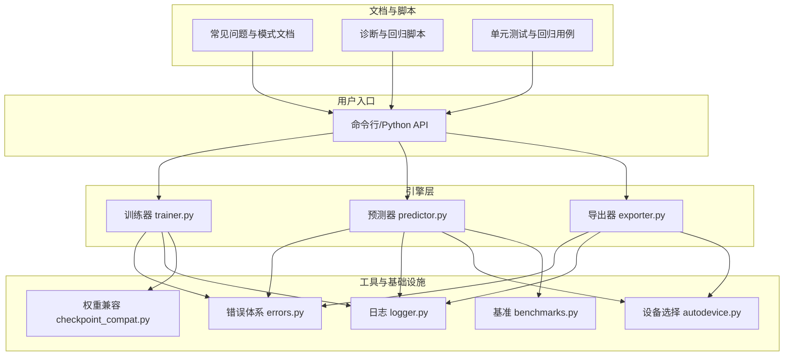
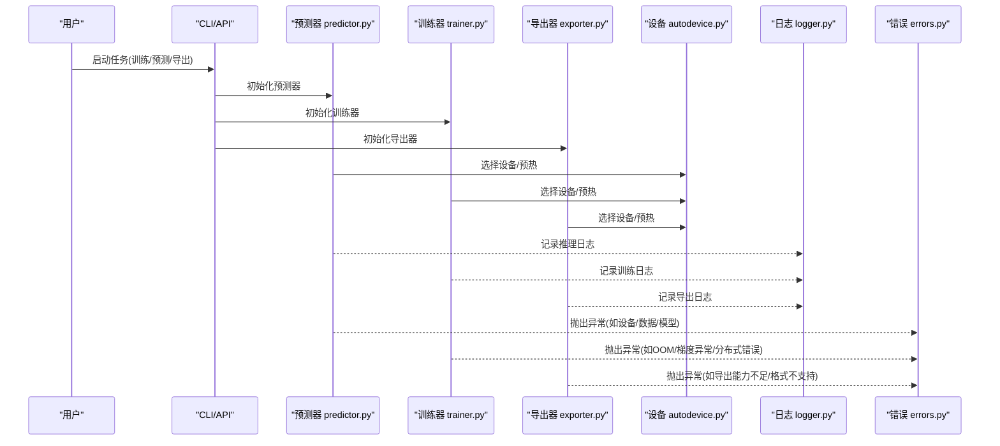
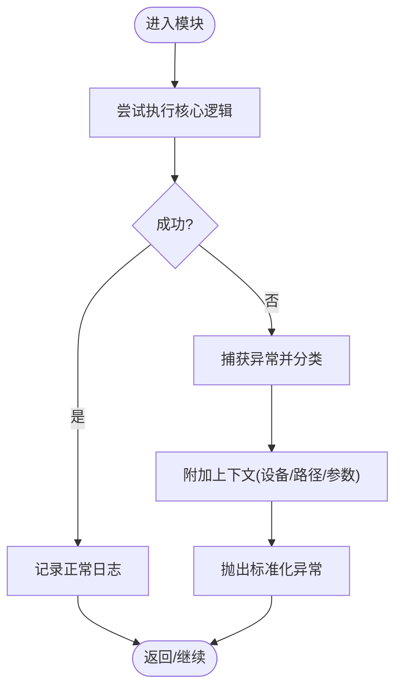
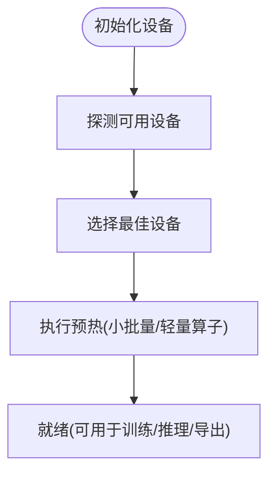
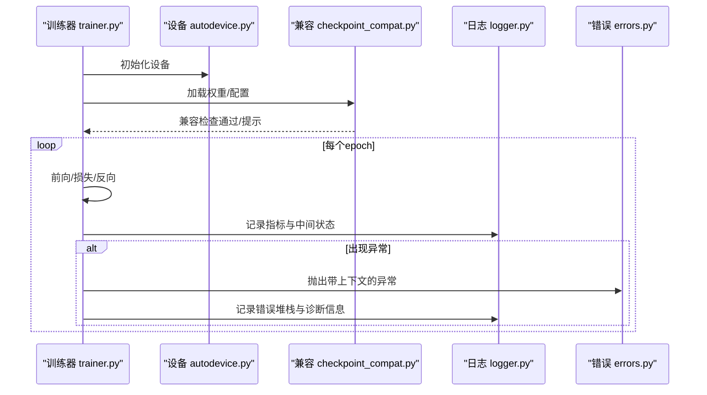
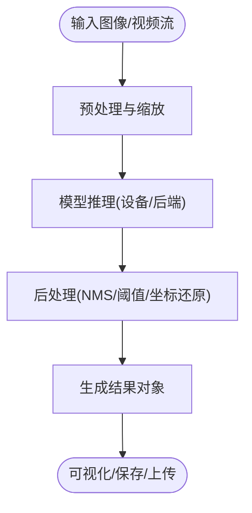
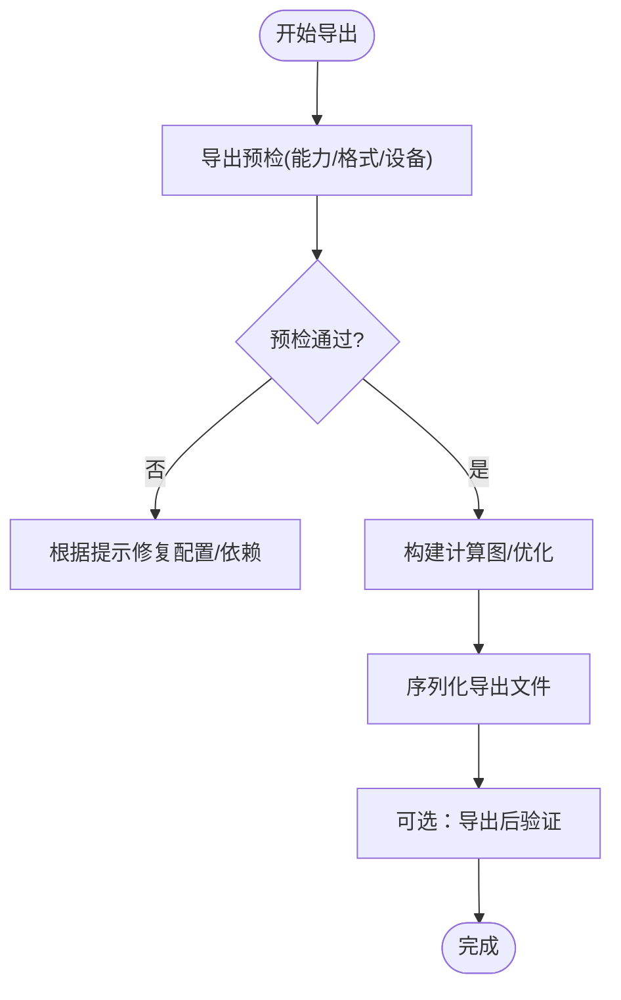
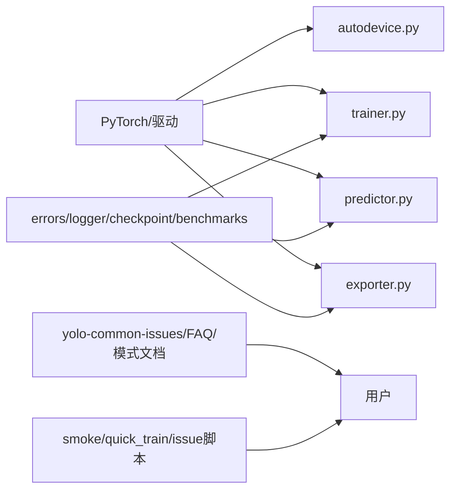

# 故障排除与常见问题

<cite>
**本文引用的文件**
- [README.md](file://README.md)
- [CONTRIBUTING.md](file://CONTRIBUTING.md)
- [pyproject.toml](file://pyproject.toml)
- [docker/Dockerfile](file://docker/Dockerfile)
- [ultralytics/utils/errors.py](file://ultralytics/utils/errors.py)
- [ultralytics/utils/logger.py](file://ultralytics/utils/logger.py)
- [ultralytics/utils/autodevice.py](file://ultralytics/utils/autodevice.py)
- [ultralytics/engine/trainer.py](file://ultralytics/engine/trainer.py)
- [ultralytics/engine/predictor.py](file://ultralytics/engine/predictor.py)
- [ultralytics/engine/exporter.py](file://ultralytics/engine/exporter.py)
- [ultralytics/utils/checkpoint_compat.py](file://ultralytics/utils/checkpoint_compat.py)
- [ultralytics/utils/benchmarks.py](file://ultralytics/utils/benchmarks.py)
- [tests/test_error_hierarchy.py](file://tests/test_error_hierarchy.py)
- [tests/test_autobackend_warmup.py](file://tests/test_autobackend_warmup.py)
- [tests/test_export_preflight.py](file://tests/test_export_preflight.py)
- [tests/test_runtime_state_reset.py](file://tests/test_runtime_state_reset.py)
- [tests/test_ddp_device_hardening.py](file://tests/test_ddp_device硬硬化测试.py)
- [tests/test_ddp_error_propagation_e2e.py](file://tests/test_ddp错误传播端到端测试.py)
- [scripts/smoke_test_coco2017.py](file://scripts/smoke_test_coco2017.py)
- [scripts/quick_train_verify.py](file://scripts/quick_train_verify.py)
- [scripts/issue53/probe_visdrone_batch.py](file://scripts/issue53/probe_visdrone_batch.py)
- [scripts/issue53/train_visdrone_issue53.sh](file://scripts/issue53/train_visdrone_issue53.sh)
- [scripts/issue49/yolo_master_issue_49.py](file://scripts/issue49/yolo_master_issue_49.py)
- [docs/en/guides/yolo-common-issues.md](file://docs/en/guides/yolo-common-issues.md)
- [docs/en/help/FAQ.md](file://docs/en/help/FAQ.md)
- [docs/en/guides/docker-quickstart.md](file://docs/en/guides/docker-quickstart.md)
- [docs/en/guides/nvidia-jetson.md](file://docs/en/guides/nvidia-jetson.md)
- [docs/en/guides/raspberry-pi.md](file://docs/en/guides/raspberry-pi.md)
- [docs/en/guides/model-training-tips.md](file://docs/en/guides/model-training-tips.md)
- [docs/en/guides/hyperparameter-tuning.md](file://docs/en/guides/hyperparameter-tuning.md)
- [docs/en/modes/benchmark.md](file://docs/en/modes/benchmark.md)
- [docs/en/modes/export.md](file://docs/en/modes/export.md)
- [docs/en/modes/train.md](file://docs/en/modes/train.md)
- [docs/en/modes/predict.md](file://docs/en/modes/predict.md)
</cite>

## 目录
1. [简介](#简介)
2. [项目结构](#项目结构)
3. [核心组件](#核心组件)
4. [架构总览](#架构总览)
5. [详细组件分析](#详细组件分析)
6. [依赖关系分析](#依赖关系分析)
7. [性能注意事项](#性能注意事项)
8. [故障排除指南](#故障排除指南)
9. [结论](#结论)
10. [附录](#附录)

## 简介
本指南面向YOLO-Master使用者，聚焦“故障排除与常见问题”。内容覆盖环境配置、模型加载、训练不收敛、推理与导出异常、性能问题（内存溢出、GPU利用率低、推理慢）、调试技巧与工具、版本兼容性与迁移、硬件相关问题、社区反馈与自助诊断、Bug报告规范以及紧急问题应急响应流程。文档以仓库现有实现和文档为依据，提供可操作的定位与修复步骤，并辅以流程图帮助快速排障。

## 项目结构
围绕故障排除相关的关键位置：
- 运行时与引擎：训练、预测、导出等核心路径位于 engine 子包；设备选择与自动后端在 utils 中。
- 日志与错误：统一错误类型与日志输出在 utils 下。
- 兼容性：权重/配置兼容处理在 utils/checkpoint_compat.py。
- 基准与诊断：基准脚本与示例脚本在 scripts 与 tests 中。
- 文档：常见问题、模式使用、平台适配等在 docs 下。

图表来源
- [ultralytics/engine/trainer.py](file://ultralytics/engine/trainer.py)
- [ultralytics/engine/predictor.py](file://ultralytics/engine/predictor.py)
- [ultralytics/engine/exporter.py](file://ultralytics/engine/exporter.py)
- [ultralytics/utils/errors.py](file://ultralytics/utils/errors.py)
- [ultralytics/utils/logger.py](file://ultralytics/utils/logger.py)
- [ultralytics/utils/autodevice.py](file://ultralytics/utils/autodevice.py)
- [ultralytics/utils/checkpoint_compat.py](file://ultralytics/utils/checkpoint_compat.py)
- [ultralytics/utils/benchmarks.py](file://ultralytics/utils/benchmarks.py)
- [docs/en/guides/yolo-common-issues.md](file://docs/en/guides/yolo-common-issues.md)
- [scripts/smoke_test_coco2017.py](file://scripts/smoke_test_coco2017.py)

章节来源
- [README.md](file://README.md)
- [pyproject.toml](file://pyproject.toml)
- [docker/Dockerfile](file://docker/Dockerfile)

## 核心组件
- 错误体系与日志：统一的异常层次结构与日志输出，便于定位问题与上报。
- 设备与后端：自动设备选择与预热，减少首次运行开销与设备误配。
- 训练器：训练流程、断点恢复、EMA、分布式容错与根因上报。
- 预测器：推理路径、批处理、可视化与结果对象。
- 导出器：多格式导出、预检与能力矩阵校验。
- 兼容性：权重与配置版本兼容检测与提示。
- 基准与诊断：基准评测与回归脚本，辅助性能与稳定性验证。

章节来源
- [ultralytics/utils/errors.py](file://ultralytics/utils/errors.py)
- [ultralytics/utils/logger.py](file://ultralytics/utils/logger.py)
- [ultralytics/utils/autodevice.py](file://ultralytics/utils/autodevice.py)
- [ultralytics/engine/trainer.py](file://ultralytics/engine/trainer.py)
- [ultralytics/engine/predictor.py](file://ultralytics/engine/predictor.py)
- [ultralytics/engine/exporter.py](file://ultralytics/engine/exporter.py)
- [ultralytics/utils/checkpoint_compat.py](file://ultralytics/utils/checkpoint_compat.py)
- [ultralytics/utils/benchmarks.py](file://ultralytics/utils/benchmarks.py)

## 架构总览
下图展示从用户调用到引擎执行、再到错误与日志输出的关键路径，有助于理解问题发生的位置与传播方式。

图表来源
- [ultralytics/engine/predictor.py](file://ultralytics/engine/predictor.py)
- [ultralytics/engine/trainer.py](file://ultralytics/engine/trainer.py)
- [ultralytics/engine/exporter.py](file://ultralytics/engine/exporter.py)
- [ultralytics/utils/autodevice.py](file://ultralytics/utils/autodevice.py)
- [ultralytics/utils/logger.py](file://ultralytics/utils/logger.py)
- [ultralytics/utils/errors.py](file://ultralytics/utils/errors.py)

## 详细组件分析

### 错误体系与日志
- 目标：为所有模块提供一致的异常类型与日志接口，确保问题可追溯、可分类、可上报。
- 关键点：
  - 统一错误基类与分层异常，便于上层捕获与转换。
  - 结构化日志输出，包含上下文信息（设备、批次、路径等）。
  - 与分布式训练的错误传播结合，提升根因定位效率。

图表来源
- [ultralytics/utils/errors.py](file://ultralytics/utils/errors.py)
- [ultralytics/utils/logger.py](file://ultralytics/utils/logger.py)

章节来源
- [ultralytics/utils/errors.py](file://ultralytics/utils/errors.py)
- [ultralytics/utils/logger.py](file://ultralytics/utils/logger.py)
- [tests/test_error_hierarchy.py](file://tests/test_error_hierarchy.py)

### 设备选择与预热
- 目标：自动选择可用设备并预热，避免首次运行抖动与显存碎片化。
- 关键点：
  - 自动探测CPU/GPU/MPS等设备可用性。
  - 预热阶段进行最小计算图构建与缓存，降低首帧延迟。
  - 在导出与推理前进行预检，防止运行时失败。

图表来源
- [ultralytics/utils/autodevice.py](file://ultralytics/utils/autodevice.py)
- [tests/test_autobackend_warmup.py](file://tests/test_autobackend_warmup.py)

章节来源
- [ultralytics/utils/autodedevice.py](file://ultralytics/utils/autodevice.py)
- [tests/test_autobackend_warmup.py](file://tests/test_autobackend_warmup.py)

### 训练器与分布式容错
- 目标：提供稳定的训练流程，支持断点恢复、EMA、分布式容错与根因上报。
- 关键点：
  - 训练循环中的异常捕获与上下文收集，便于定位OOM、梯度爆炸、数据损坏等问题。
  - 分布式场景下的错误传播与根因聚合，避免“黑盒”失败。
  - 与权重兼容模块联动，处理旧版权重加载问题。

图表来源
- [ultralytics/engine/trainer.py](file://ultralytics/engine/trainer.py)
- [ultralytics/utils/autodevice.py](file://ultralytics/utils/autodevice.py)
- [ultralytics/utils/checkpoint_compat.py](file://ultralytics/utils/checkpoint_compat.py)
- [ultralytics/utils/logger.py](file://ultralytics/utils/logger.py)
- [ultralytics/utils/errors.py](file://ultralytics/utils/errors.py)

章节来源
- [ultralytics/engine/trainer.py](file://ultralytics/engine/trainer.py)
- [ultralytics/utils/checkpoint_compat.py](file://ultralytics/utils/checkpoint_compat.py)
- [tests/test_ddp_device硬硬化测试.py](file://tests/test_ddp_device硬硬化测试.py)
- [tests/test_ddp错误传播端到端测试.py](file://tests/test_ddp错误传播端到端测试.py)

### 预测器与推理路径
- 目标：稳定高效的推理流程，支持批处理、可视化与结果对象。
- 关键点：
  - 设备预热与输入预处理优化。
  - 结果对象封装，便于后续分析与可视化。
  - 与导出产物对接，确保格式一致。

图表来源
- [ultralytics/engine/predictor.py](file://ultralytics/engine/predictor.py)

章节来源
- [ultralytics/engine/predictor.py](file://ultralytics/engine/predictor.py)

### 导出器与预检
- 目标：将模型导出为多种部署格式，并在导出前进行能力与兼容性预检。
- 关键点：
  - 导出能力矩阵校验，避免不支持的算子或特性。
  - 预检失败时给出明确修复建议（如关闭某特性、降级精度）。
  - 与设备选择联动，确保导出环境与运行环境一致。

图表来源
- [ultralytics/engine/exporter.py](file://ultralytics/engine/exporter.py)
- [tests/test_export_preflight.py](file://tests/test_export_preflight.py)

章节来源
- [ultralytics/engine/exporter.py](file://ultralytics/engine/exporter.py)
- [tests/test_export_preflight.py](file://tests/test_export_preflight.py)

## 依赖关系分析
- 外部依赖与环境：
  - Python与PyTorch版本约束见项目配置文件。
  - Docker镜像用于隔离环境，保证一致性。
- 内部依赖：
  - 引擎层依赖utils提供的错误、日志、设备、兼容与基准工具。
  - 文档与脚本作为用户侧辅助，增强可观测性与可复现性。

图表来源
- [pyproject.toml](file://pyproject.toml)
- [docker/Dockerfile](file://docker/Dockerfile)
- [ultralytics/utils/autodevice.py](file://ultralytics/utils/autodevice.py)
- [ultralytics/engine/trainer.py](file://ultralytics/engine/trainer.py)
- [ultralytics/engine/predictor.py](file://ultralytics/engine/predictor.py)
- [ultralytics/engine/exporter.py](file://ultralytics/engine/exporter.py)
- [ultralytics/utils/errors.py](file://ultralytics/utils/errors.py)
- [ultralytics/utils/logger.py](file://ultralytics/utils/logger.py)
- [ultralytics/utils/checkpoint_compat.py](file://ultralytics/utils/checkpoint_compat.py)
- [ultralytics/utils/benchmarks.py](file://ultralytics/utils/benchmarks.py)
- [docs/en/guides/yolo-common-issues.md](file://docs/en/guides/yolo-common-issues.md)
- [docs/en/help/FAQ.md](file://docs/en/help/FAQ.md)
- [scripts/smoke_test_coco2017.py](file://scripts/smoke_test_coco2017.py)

章节来源
- [pyproject.toml](file://pyproject.toml)
- [docker/Dockerfile](file://docker/Dockerfile)

## 性能注意事项
- 内存溢出（OOM）：
  - 降低batch size、输入分辨率或启用混合精度。
  - 检查数据加载与预处理是否造成额外内存峰值。
  - 使用基准脚本评估不同配置的显存占用。
- GPU利用率低：
  - 增大批大小至设备饱和，但需监控显存。
  - 确认I/O瓶颈（磁盘/网络），必要时使用缓存或并行加载。
  - 使用导出优化与推理后端加速。
- 推理速度慢：
  - 使用导出后的优化格式（如ONNX/TensorRT/OpenVINO等）。
  - 开启预热与批处理，减少首帧延迟。
  - 调整NMS与阈值以减少后处理开销。

章节来源
- [ultralytics/utils/benchmarks.py](file://ultralytics/utils/benchmarks.py)
- [docs/en/modes/benchmark.md](file://docs/en/modes/benchmark.md)
- [docs/en/modes/export.md](file://docs/en/modes/export.md)
- [docs/en/modes/predict.md](file://docs/en/modes/predict.md)

## 故障排除指南

### 环境配置问题
- 症状：导入失败、CUDA不可用、驱动版本不匹配。
- 诊断：
  - 检查Python与PyTorch版本约束。
  - 使用Docker镜像快速搭建一致环境。
  - 查看设备选择与预热日志，确认GPU被正确识别。
- 修复：
  - 升级/降级驱动与CUDA版本，遵循官方要求。
  - 使用容器化方案避免本地环境差异。
  - 参考常见问题与FAQ文档中的环境章节。

章节来源
- [pyproject.toml](file://pyproject.toml)
- [docker/Dockerfile](file://docker/Dockerfile)
- [docs/en/guides/docker-quickstart.md](file://docs/en/guides/docker-quickstart.md)
- [docs/en/guides/yolo-common-issues.md](file://docs/en/guides/yolo-common-issues.md)
- [docs/en/help/FAQ.md](file://docs/en/help/FAQ.md)

### 模型加载错误
- 症状：权重文件无法加载、键名不匹配、形状不一致。
- 诊断：
  - 查看权重兼容模块的提示与回退策略。
  - 核对模型版本与权重来源是否一致。
- 修复：
  - 使用兼容工具或更新权重。
  - 若为自定义权重，确保命名与结构符合当前期望。

章节来源
- [ultralytics/utils/checkpoint_compat.py](file://ultralytics/utils/checkpoint_compat.py)

### 训练不收敛
- 症状：损失震荡、不下降、NaN/Inf。
- 诊断：
  - 检查学习率、批大小与数据质量。
  - 查看训练日志与中间指标，定位异常步。
  - 使用快速训练验证脚本进行最小复现。
- 修复：
  - 调整超参数（学习率、衰减、正则化）。
  - 减小输入分辨率或批大小以避免数值不稳定。
  - 参考训练技巧与调参指南。

章节来源
- [ultralytics/engine/trainer.py](file://ultralytics/engine/trainer.py)
- [scripts/quick_train_verify.py](file://scripts/quick_train_verify.py)
- [docs/en/guides/model-training-tips.md](file://docs/en/guides/model-training-tips.md)
- [docs/en/guides/hyperparameter-tuning.md](file://docs/en/guides/hyperparameter-tuning.md)

### 推理速度慢
- 症状：单帧延迟高、吞吐低。
- 诊断：
  - 使用基准脚本测量不同后端与配置的性能。
  - 检查预处理与后处理耗时占比。
- 修复：
  - 导出为优化格式并启用相应后端。
  - 调整批大小与分辨率，平衡延迟与吞吐。
  - 预热模型与后端，减少冷启动开销。

章节来源
- [ultralytics/utils/benchmarks.py](file://ultralytics/utils/benchmarks.py)
- [docs/en/modes/benchmark.md](file://docs/en/modes/benchmark.md)
- [docs/en/modes/export.md](file://docs/en/modes/export.md)
- [docs/en/modes/predict.md](file://docs/en/modes/predict.md)

### 内存溢出（OOM）
- 症状：进程崩溃、显存耗尽。
- 诊断：
  - 逐步降低批大小与分辨率，观察变化。
  - 检查数据加载与缓存策略。
- 修复：
  - 减小批大小、分辨率或启用混合精度。
  - 清理不必要的中间变量与缓存。
  - 使用导出优化减少运行时开销。

章节来源
- [ultralytics/engine/trainer.py](file://ultralytics/engine/trainer.py)
- [ultralytics/engine/predictor.py](file://ultralytics/engine/predictor.py)

### GPU利用率低
- 症状：GPU占用率低、训练/推理缓慢。
- 诊断：
  - 使用基准脚本对比不同批大小与后端。
  - 检查I/O瓶颈与数据准备速度。
- 修复：
  - 增大批大小直至GPU饱和。
  - 优化数据管道，使用缓存与并行加载。
  - 使用导出优化与专用后端。

章节来源
- [ultralytics/utils/benchmarks.py](file://ultralytics/utils/benchmarks.py)
- [docs/en/modes/benchmark.md](file://docs/en/modes/benchmark.md)

### 导出失败
- 症状：导出中断、格式不支持、算子缺失。
- 诊断：
  - 查看导出预检结果与能力矩阵。
  - 根据提示关闭不支持的特性或降级精度。
- 修复：
  - 调整导出选项，确保与目标后端兼容。
  - 更新依赖与后端版本。

章节来源
- [ultralytics/engine/exporter.py](file://ultralytics/engine/exporter.py)
- [tests/test_export_preflight.py](file://tests/test_export_preflight.py)
- [docs/en/modes/export.md](file://docs/en/modes/export.md)

### 分布式训练错误
- 症状：节点间通信失败、根因不明确。
- 诊断：
  - 查看分布式错误传播与根因上报日志。
  - 检查设备硬化工具与容错机制。
- 修复：
  - 修正网络与设备配置。
  - 使用最小复现实例验证分布式环境。

章节来源
- [tests/test_ddp错误传播端到端测试.py](file://tests/test_ddp错误传播端到端测试.py)
- [tests/test_ddp_device硬硬化测试.py](file://tests/test_ddp_device硬硬化测试.py)

### 运行时状态异常
- 症状：多次推理/训练后状态污染、结果异常。
- 诊断：
  - 使用运行时状态重置测试验证清理逻辑。
- 修复：
  - 在任务间显式重置状态或重启进程。

章节来源
- [tests/test_runtime_state_reset.py](file://tests/test_runtime_state_reset.py)

### 硬件相关问题
- Jetson/Raspberry Pi：
  - 参考平台适配文档，安装对应依赖与后端。
  - 注意内存与算力限制，调整分辨率与批大小。
- 其他边缘设备：
  - 使用导出优化与专用推理后端。
  - 参考边缘部署示例与说明。

章节来源
- [docs/en/guides/nvidia-jetson.md](file://docs/en/guides/nvidia-jetson.md)
- [docs/en/guides/raspberry-pi.md](file://docs/en/guides/raspberry-pi.md)

### 社区反馈与官方回复
- 常见问题与FAQ：
  - 查阅常见问题与FAQ文档，获取已收录问题的解决方案。
- 贡献与反馈渠道：
  - 参考贡献指南了解如何提交问题与建议。

章节来源
- [docs/en/guides/yolo-common-issues.md](file://docs/en/guides/yolo-common-issues.md)
- [docs/en/help/FAQ.md](file://docs/en/help/FAQ.md)
- [CONTRIBUTING.md](file://CONTRIBUTING.md)

### 自助诊断工具与脚本
- 冒烟测试：
  - 使用COCO2017冒烟脚本快速验证环境、数据与模型链路。
- 快速训练验证：
  - 使用快速训练验证脚本进行最小复现与收敛性检查。
- 问题复现脚本：
  - issue49与issue53相关脚本用于特定问题的复现与定位。
- 基准评测：
  - 使用基准脚本评估不同配置的性能与资源占用。

章节来源
- [scripts/smoke_test_coco2017.py](file://scripts/smoke_test_coco2017.py)
- [scripts/quick_train_verify.py](file://scripts/quick_train_verify.py)
- [scripts/issue49/yolo_master_issue_49.py](file://scripts/issue49/yolo_master_issue_49.py)
- [scripts/issue53/probe_visdrone_batch.py](file://scripts/issue53/probe_visdrone_batch.py)
- [scripts/issue53/train_visdrone_issue53.sh](file://scripts/issue53/train_visdrone_issue53.sh)
- [ultralytics/utils/benchmarks.py](file://ultralytics/utils/benchmarks.py)

### 提交有效的Bug报告与问题反馈
- 必备信息：
  - 环境信息（操作系统、Python/PyTorch版本、驱动/后端）。
  - 复现步骤与最小代码片段。
  - 完整日志与错误堆栈。
  - 数据集与模型版本信息。
- 提交渠道：
  - 参考贡献指南中的问题反馈流程。

章节来源
- [CONTRIBUTING.md](file://CONTRIBUTING.md)

### 紧急问题应急响应流程
- 快速止损：
  - 回滚到已知稳定版本或权重。
  - 切换至备用后端或降级配置。
- 定位与修复：
  - 使用冒烟与快速训练验证脚本确认问题范围。
  - 查看错误与日志，定位根因。
- 复盘与改进：
  - 补充回归测试与预检规则。
  - 更新文档与FAQ，避免重复问题。

章节来源
- [scripts/smoke_test_coco2017.py](file://scripts/smoke_test_coco2017.py)
- [scripts/quick_train_verify.py](file://scripts/quick_train_verify.py)
- [ultralytics/utils/errors.py](file://ultralytics/utils/errors.py)
- [ultralytics/utils/logger.py](file://ultralytics/utils/logger.py)

## 结论
通过统一的错误与日志体系、设备预热与预检、分布式容错与根因上报、以及完善的文档与脚本，YOLO-Master提供了强大的故障排除能力。建议在日常使用中优先借助基准与冒烟脚本进行健康检查，遇到问题时按本文步骤逐步定位与修复，并及时反馈至社区以完善知识库。

## 附录
- 常用命令与路径：
  - 训练模式文档：[训练模式](file://docs/en/modes/train.md)
  - 预测模式文档：[预测模式](file://docs/en/modes/predict.md)
  - 导出模式文档：[导出模式](file://docs/en/modes/export.md)
  - 基准模式文档：[基准模式](file://docs/en/modes/benchmark.md)
- 平台适配：
  - Docker快速开始：[Docker快速开始](file://docs/en/guides/docker-quickstart.md)
  - Jetson适配：[Jetson](file://docs/en/guides/nvidia-jetson.md)
  - Raspberry Pi适配：[Raspberry Pi](file://docs/en/guides/raspberry-pi.md)