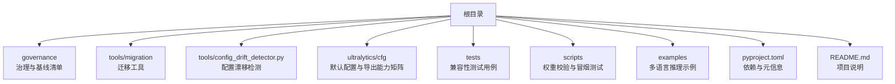
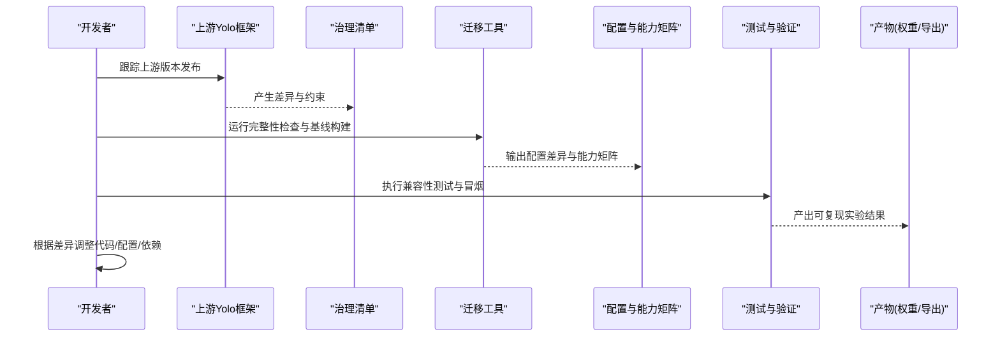
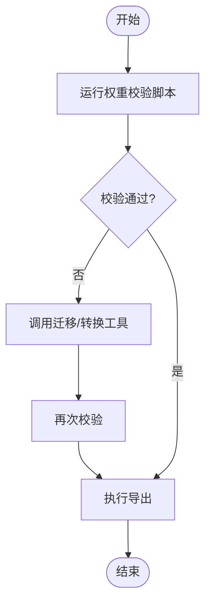
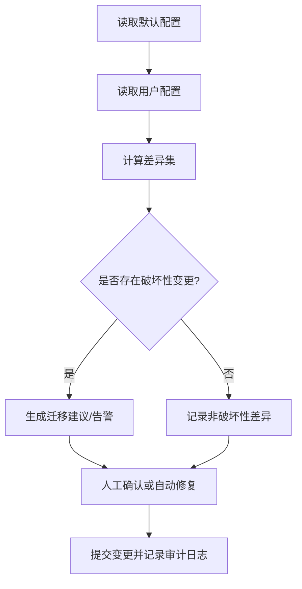
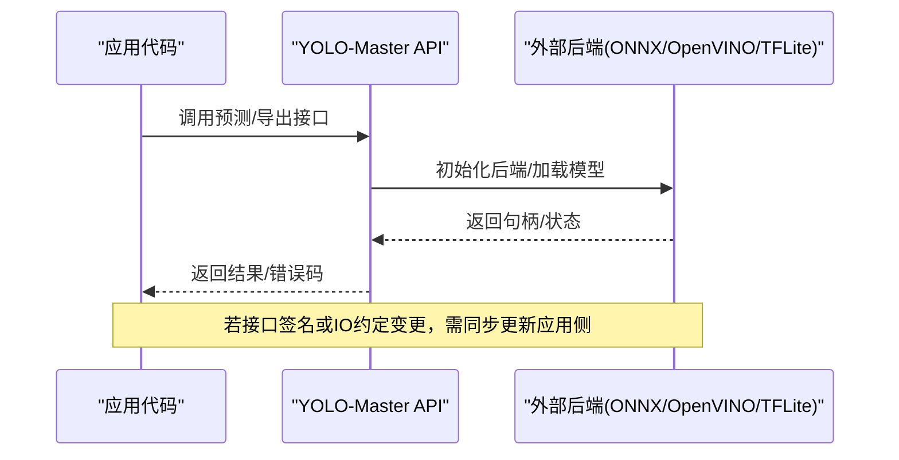

# 版本兼容性与迁移

<cite>
**本文引用的文件**
- [pyproject.toml](file://pyproject.toml)
- [README.md](file://README.md)
- [YOLO-Master-v260720-兼容性验证报告.md](file://YOLO-Master-v260720-兼容性验证报告.md)
- [governance/upstream-v8.4.101-manifest.json](file://governance/upstream-v8.4.101-manifest.json)
- [tools/migration/build_native_baseline.py](file://tools/migration/build_native_baseline.py)
- [tools/migration/check_upstream_integrity.py](file://tools/migration/check_upstream_integrity.py)
- [tools/config_drift_detector.py](file://tools/config_drift_detector.py)
- [tests/test_checkpoint_compat.py](file://tests/test_checkpoint_compat.py)
- [ultralytics/utils/checkpoint_compat.py](file://ultralytics/utils/checkpoint_compat.py)
- [ultralytics/cfg/default.yaml](file://ultralytics/cfg/default.yaml)
- [ultralytics/cfg/export-capability-matrix.yaml](file://ultralytics/cfg/export-capability-matrix.yaml)
- [scripts/verify_yolo_master_weight.py](file://scripts/verify_yolo_master_weight.py)
- [scripts/smoke_test_coco2017.py](file://scripts/smoke_test_coco2017.py)
- [examples/YOLOv8-ONNXRuntime-Python/main.py](file://examples/YOLOv8-ONNXRuntime-Python/main.py)
- [examples/YOLOv8-OpenVINO-CPP-Inference/inference.cc](file://examples/YOLOv8-OpenVINO-CPP-Inference/inference.cc)
- [examples/YOLOv8-ONNXRuntime-Rust/src/lib.rs](file://examples/YOLOv8-ONNXRuntime-Rust/src/lib.rs)
- [examples/YOLOv8-TFLite-Python/main.py](file://examples/YOLOv8-TFLite-Python/main.py)
- [examples/YOLOv8-ONNXRuntime-CPP/inference.cpp](file://examples/YOLOv8-ONNXRuntime-CPP/inference.cpp)
- [examples/YOLOv8-ONNXRuntime-CPP/main.cpp](file://examples/YOLOv8-ONNXRuntime-CPP/main.cpp)
- [examples/YOLOv8-ONNXRuntime-CPP/CMakeLists.txt](file://examples/YOLOv8-ONNXRuntime-CPP/CMakeLists.txt)
- [examples/YOLOv8-ONNXRuntime-CPP/README.md](file://examples/YOLOv8-ONNXRuntime-CPP/README.md)
- [examples/YOLOv8-ONNXRuntime-CPP/inference.h](file://examples/YOLOv8-ONNXRuntime-CPP/inference.h)
- [examples/YOLOv8-ONNXRuntime-CPP/requirements.txt](file://examples/YOLOv8-ONNXRuntime-CPP/requirements.txt)
- [examples/YOLOv8-ONNXRuntime-CPP/README.md](file://examples/YOLOv8-ONNXRuntime-CPP/README.md)
- [examples/YOLOv8-ONNXRuntime-CPP/inference.cpp](file://examples/YOLOv8-ONNXRuntime-CPP/inference.cpp)
- [examples/YOLOv8-ONNXRuntime-CPP/main.cpp](file://examples/YOLOv8-ONNXRuntime-CPP/main.cpp)
- [examples/YOLOv8-ONNXRuntime-CPP/CMakeLists.txt](file://examples/YOLOv8-ONNXRuntime-CPP/CMakeLists.txt)
- [examples/YOLOv8-ONNXRuntime-CPP/README.md](file://examples/YOLOv8-ONNXRuntime-CPP/README.md)
- [examples/YOLOv8-ONNXRuntime-CPP/inference.h](file://examples/YOLOv8-ONNXRuntime-CPP/inference.h)
- [examples/YOLOv8-ONNXRuntime-CPP/requirements.txt](file://examples/YOLOv8-ONNXRuntime-CPP/requirements.txt)
</cite>

## 目录
1. [简介](#简介)
2. [项目结构](#项目结构)
3. [核心组件](#核心组件)
4. [架构总览](#架构总览)
5. [详细组件分析](#详细组件分析)
6. [依赖与冲突管理](#依赖与冲突管理)
7. [性能与稳定性考量](#性能与稳定性考量)
8. [故障排查指南](#故障排查指南)
9. [结论](#结论)
10. [附录：迁移清单与回滚步骤](#附录：迁移清单与回滚步骤)

## 简介
本指南聚焦于 YOLO-Master 的版本兼容性与迁移，覆盖以下关键主题：
- 各版本之间的兼容性矩阵与升级路径
- 上游 YOLO 框架版本更新的影响与适配方法
- 模型权重文件的版本迁移工具与脚本使用方法
- 配置文件格式变更与迁移指南
- 第三方库依赖版本要求与冲突解决
- API 接口变更对照与迁移示例
- 实验数据与结果的版本管理策略
- 回滚与降级操作注意事项与步骤

## 项目结构
仓库围绕“治理与基线”、“迁移工具链”、“配置与能力矩阵”、“测试与验证”四个维度组织，便于在版本演进中保持可追溯、可验证与可回滚。

图表来源
- [pyproject.toml](file://pyproject.toml)
- [README.md](file://README.md)
- [governance/upstream-v8.4.101-manifest.json](file://governance/upstream-v8.4.101-manifest.json)
- [tools/migration/build_native_baseline.py](file://tools/migration/build_native_baseline.py)
- [tools/migration/check_upstream_integrity.py](file://tools/migration/check_upstream_integrity.py)
- [tools/config_drift_detector.py](file://tools/config_drift_detector.py)
- [ultralytics/cfg/default.yaml](file://ultralytics/cfg/default.yaml)
- [ultralytics/cfg/export-capability-matrix.yaml](file://ultralytics/cfg/export-capability-matrix.yaml)
- [tests/test_checkpoint_compat.py](file://tests/test_checkpoint_compat.py)
- [scripts/verify_yolo_master_weight.py](file://scripts/verify_yolo_master_weight.py)
- [scripts/smoke_test_coco2017.py](file://scripts/smoke_test_coco2017.py)

章节来源
- [README.md](file://README.md)
- [pyproject.toml](file://pyproject.toml)

## 核心组件
- 上游基线与完整性校验
  - 通过治理清单定义上游版本约束与差异点，配合完整性检查脚本确保本地实现与上游一致。
- 配置漂移检测
  - 提供工具对默认配置与用户配置进行比对，识别新增、删除或语义变更字段，辅助自动化迁移。
- 权重与导出能力矩阵
  - 以 YAML 矩阵描述不同任务/后端/精度的导出能力，作为跨版本能力对比与回归依据。
- 权重校验与冒烟测试
  - 提供权重加载校验与端到端冒烟脚本，用于快速发现不兼容的权重或环境。
- 兼容性测试套件
  - 针对检查点兼容性、导出能力、API 行为等编写测试，保障升级过程稳定。

章节来源
- [governance/upstream-v8.4.101-manifest.json](file://governance/upstream-v8.4.101-manifest.json)
- [tools/migration/check_upstream_integrity.py](file://tools/migration/check_upstream_integrity.py)
- [tools/config_drift_detector.py](file://tools/config_drift_detector.py)
- [ultralytics/cfg/export-capability-matrix.yaml](file://ultralytics/cfg/export-capability-matrix.yaml)
- [scripts/verify_yolo_master_weight.py](file://scripts/verify_yolo_master_weight.py)
- [scripts/smoke_test_coco2017.py](file://scripts/smoke_test_coco2017.py)
- [tests/test_checkpoint_compat.py](file://tests/test_checkpoint_compat.py)

## 架构总览
下图展示从“上游版本变更”到“本地适配与验证”的闭环流程，以及关键工件（清单、矩阵、配置、权重）在其中的流转关系。

图表来源
- [governance/upstream-v8.4.101-manifest.json](file://governance/upstream-v8.4.101-manifest.json)
- [tools/migration/check_upstream_integrity.py](file://tools/migration/check_upstream_integrity.py)
- [tools/migration/build_native_baseline.py](file://tools/migration/build_native_baseline.py)
- [ultralytics/cfg/export-capability-matrix.yaml](file://ultralytics/cfg/export-capability-matrix.yaml)
- [tests/test_checkpoint_compat.py](file://tests/test_checkpoint_compat.py)

## 详细组件分析

### 上游版本影响与适配方法
- 影响面
  - API 变更：训练/验证/导出入口参数、返回结构、回调钩子
  - 配置项：新增/废弃字段、默认值变化、命名规范
  - 导出能力：后端支持度、精度选项、形状约束
  - 依赖：Python/Torch/CUDA/编译器版本
- 适配方法
  - 使用治理清单与完整性检查脚本定位差异
  - 基于配置漂移检测生成迁移建议
  - 通过能力矩阵评估导出链路是否受影响
  - 用权重校验与冒烟测试确认运行时行为

章节来源
- [governance/upstream-v8.4.101-manifest.json](file://governance/upstream-v8.4.101-manifest.json)
- [tools/migration/check_upstream_integrity.py](file://tools/migration/check_upstream_integrity.py)
- [tools/config_drift_detector.py](file://tools/config_drift_detector.py)
- [ultralytics/cfg/export-capability-matrix.yaml](file://ultralytics/cfg/export-capability-matrix.yaml)

### 模型权重文件版本迁移
- 目标
  - 将旧版权重转换为新版检查点格式，保证训练/验证/导出可用
- 工具与脚本
  - 权重校验脚本：用于快速判断权重是否可被当前版本加载
  - 原生基线构建：用于对齐上游权重并建立基准
- 建议流程
  - 先运行权重校验，失败则尝试转换或重新导出
  - 若涉及 MoE/MoA/LoRA 等模块，需关注头/专家/路由相关键名映射
  - 导出前再次校验，避免下游部署阶段报错

图表来源
- [scripts/verify_yolo_master_weight.py](file://scripts/verify_yolo_master_weight.py)
- [tools/migration/build_native_baseline.py](file://tools/migration/build_native_baseline.py)
- [ultralytics/utils/checkpoint_compat.py](file://ultralytics/utils/checkpoint_compat.py)

章节来源
- [scripts/verify_yolo_master_weight.py](file://scripts/verify_yolo_master_weight.py)
- [tools/migration/build_native_baseline.py](file://tools/migration/build_native_baseline.py)
- [ultralytics/utils/checkpoint_compat.py](file://ultralytics/utils/checkpoint_compat.py)

### 配置文件格式变更与迁移
- 变更类型
  - 新增字段：需要显式声明或采用默认值
  - 废弃字段：需移除或映射到新字段
  - 语义变更：如阈值、尺寸、优化器参数含义变化
- 迁移方式
  - 使用配置漂移检测工具生成差异报告
  - 结合默认配置与能力矩阵，逐项核对
  - 在 CI 中加入配置一致性断言，防止隐性漂移

图表来源
- [tools/config_drift_detector.py](file://tools/config_drift_detector.py)
- [ultralytics/cfg/default.yaml](file://ultralytics/cfg/default.yaml)

章节来源
- [tools/config_drift_detector.py](file://tools/config_drift_detector.py)
- [ultralytics/cfg/default.yaml](file://ultralytics/cfg/default.yaml)

### 第三方库依赖版本要求与冲突解决
- 依赖范围
  - Python、PyTorch、CUDA、ONNX Runtime、OpenVINO、TFLite 等
- 冲突场景
  - 二进制 ABI 不匹配（如 CUDA/cuDNN 版本）
  - 包管理器锁定不一致导致安装失败
  - 多平台编译差异（Windows/Linux/macOS）
- 解决策略
  - 以 pyproject.toml 为单一事实源，统一锁定版本
  - 使用虚拟环境隔离，避免系统级污染
  - 在 CI 中并行验证多平台/多后端组合

章节来源
- [pyproject.toml](file://pyproject.toml)

### API 接口变更对照与迁移示例
- 常见变更点
  - 训练/验证/导出 CLI 参数重命名或弃用
  - Python API 函数签名变化、返回值结构变化
  - 回调/事件名称与载荷结构变化
- 迁移示例（按示例工程）
  - Python ONNX 推理：注意输入张量形状与后处理逻辑
  - OpenVINO C++ 推理：注意模型路径、设备选择与 IO 节点名
  - Rust ONNX Runtime：注意绑定库版本与内存布局
  - TFLite Python：注意解释器初始化与量化参数
  - C++ ONNX Runtime：注意 CMake 链接与运行时库版本

图表来源
- [examples/YOLOv8-ONNXRuntime-Python/main.py](file://examples/YOLOv8-ONNXRuntime-Python/main.py)
- [examples/YOLOv8-OpenVINO-CPP-Inference/inference.cc](file://examples/YOLOv8-OpenVINO-CPP-Inference/inference.cc)
- [examples/YOLOv8-ONNXRuntime-Rust/src/lib.rs](file://examples/YOLOv8-ONNXRuntime-Rust/src/lib.rs)
- [examples/YOLOv8-TFLite-Python/main.py](file://examples/YOLOv8-TFLite-Python/main.py)
- [examples/YOLOv8-ONNXRuntime-CPP/inference.cpp](file://examples/YOLOv8-ONNXRuntime-CPP/inference.cpp)
- [examples/YOLOv8-ONNXRuntime-CPP/main.cpp](file://examples/YOLOv8-ONNXRuntime-CPP/main.cpp)
- [examples/YOLOv8-ONNXRuntime-CPP/CMakeLists.txt](file://examples/YOLOv8-ONNXRuntime-CPP/CMakeLists.txt)
- [examples/YOLOv8-ONNXRuntime-CPP/README.md](file://examples/YOLOv8-ONNXRuntime-CPP/README.md)
- [examples/YOLOv8-ONNXRuntime-CPP/inference.h](file://examples/YOLOv8-ONNXRuntime-CPP/inference.h)
- [examples/YOLOv8-ONNXRuntime-CPP/requirements.txt](file://examples/YOLOv8-ONNXRuntime-CPP/requirements.txt)

章节来源
- [examples/YOLOv8-ONNXRuntime-Python/main.py](file://examples/YOLOv8-ONNXRuntime-Python/main.py)
- [examples/YOLOv8-OpenVINO-CPP-Inference/inference.cc](file://examples/YOLOv8-OpenVINO-CPP-Inference/inference.cc)
- [examples/YOLOv8-ONNXRuntime-Rust/src/lib.rs](file://examples/YOLOv8-ONNXRuntime-Rust/src/lib.rs)
- [examples/YOLOv8-TFLite-Python/main.py](file://examples/YOLOv8-TFLite-Python/main.py)
- [examples/YOLOv8-ONNXRuntime-CPP/inference.cpp](file://examples/YOLOv8-ONNXRuntime-CPP/inference.cpp)
- [examples/YOLOv8-ONNXRuntime-CPP/main.cpp](file://examples/YOLOv8-ONNXRuntime-CPP/main.cpp)
- [examples/YOLOv8-ONNXRuntime-CPP/CMakeLists.txt](file://examples/YOLOv8-ONNXRuntime-CPP/CMakeLists.txt)
- [examples/YOLOv8-ONNXRuntime-CPP/README.md](file://examples/YOLOv8-ONNXRuntime-CPP/README.md)
- [examples/YOLOv8-ONNXRuntime-CPP/inference.h](file://examples/YOLOv8-ONNXRuntime-CPP/inference.h)
- [examples/YOLOv8-ONNXRuntime-CPP/requirements.txt](file://examples/YOLOv8-ONNXRuntime-CPP/requirements.txt)

### 实验数据与结果的版本管理策略
- 策略要点
  - 以“数据集版本 + 配置哈希 + 随机种子 + 环境快照”为唯一标识
  - 将能力矩阵与配置差异纳入产物元数据
  - 使用固定标签与分支保护，禁止直接推送破坏性变更
- 实践建议
  - 在 CI 中固化冒烟与回归指标，失败即阻断合并
  - 对关键权重与导出产物打标签并归档

章节来源
- [ultralytics/cfg/export-capability-matrix.yaml](file://ultralytics/cfg/export-capability-matrix.yaml)
- [scripts/smoke_test_coco2017.py](file://scripts/smoke_test_coco2017.py)

### 回滚与降级操作
- 触发条件
  - 上线后出现严重回归、崩溃或指标显著下降
- 操作步骤
  - 回退到上一个稳定标签/分支
  - 恢复对应版本的依赖与环境快照
  - 使用权重校验与冒烟测试快速验证
  - 必要时回滚配置与导出产物至上一版本
- 注意事项
  - 避免混用新旧权重与新代码
  - 保留完整审计日志与差异报告，便于复盘

章节来源
- [scripts/verify_yolo_master_weight.py](file://scripts/verify_yolo_master_weight.py)
- [scripts/smoke_test_coco2017.py](file://scripts/smoke_test_coco2017.py)

## 依赖与冲突管理
- 单一事实源
  - 以 pyproject.toml 为准，集中声明 Python、PyTorch、CUDA、ONNX Runtime、OpenVINO、TFLite 等依赖及版本区间
- 常见冲突与解法
  - CUDA/cuDNN 版本不匹配：统一驱动与运行时版本，或在容器内固化
  - 多后端共存：按任务/平台创建独立环境，避免共享站点包
  - Windows 编译问题：遵循示例工程的 README 指引，使用指定编译器与 CMake 版本
- 验证手段
  - 使用冒烟脚本在多平台/多后端组合下快速验证

章节来源
- [pyproject.toml](file://pyproject.toml)
- [examples/YOLOv8-ONNXRuntime-CPP/README.md](file://examples/YOLOv8-ONNXRuntime-CPP/README.md)
- [examples/YOLOv8-ONNXRuntime-CPP/CMakeLists.txt](file://examples/YOLOv8-ONNXRuntime-CPP/CMakeLists.txt)
- [scripts/smoke_test_coco2017.py](file://scripts/smoke_test_coco2017.py)

## 性能与稳定性考量
- 导出链路
  - 优先使用能力矩阵中已验证的后端/精度组合
  - 对大模型导出开启分块/半精度，监控显存峰值
- 训练稳定性
  - 启用 AMP/梯度裁剪时，关注数值稳定性与 NaN 传播
  - 对 MoE/MoA/LoRA 等模块，关注路由/专家权重归一化与稀疏性
- 回归门禁
  - 在 CI 中引入指标阈值与可视化对比，异常即阻断

[本节为通用指导，无需特定文件引用]

## 故障排查指南
- 权重加载失败
  - 使用权重校验脚本定位缺失键或不兼容结构
  - 检查是否混用新旧版本权重
- 导出失败
  - 核对能力矩阵中该任务/后端/精度是否受支持
  - 检查输入形状、动态轴与算子支持
- 运行时崩溃
  - 检查依赖版本与 ABI 匹配
  - 查看冒烟测试结果与日志定位具体环节

章节来源
- [scripts/verify_yolo_master_weight.py](file://scripts/verify_yolo_master_weight.py)
- [ultralytics/cfg/export-capability-matrix.yaml](file://ultralytics/cfg/export-capability-matrix.yaml)
- [scripts/smoke_test_coco2017.py](file://scripts/smoke_test_coco2017.py)

## 结论
通过“治理清单 + 完整性检查 + 配置漂移检测 + 能力矩阵 + 权重校验 + 冒烟测试 + 兼容性测试”的组合拳，YOLO-Master 能够在频繁的上游迭代中保持稳定升级路径，降低迁移风险与回归概率。建议在团队内固化上述流程，并将其纳入 CI/CD 流水线。

[本节为总结性内容，无需特定文件引用]

## 附录：迁移清单与回滚步骤

### 迁移清单
- 上游版本
  - 拉取并解析治理清单，标记破坏性变更
  - 运行完整性检查，生成差异报告
- 配置
  - 运行配置漂移检测，逐项核对默认配置与用户配置
  - 更新能力矩阵，确认导出链路可用性
- 权重
  - 运行权重校验，必要时执行迁移/转换
  - 重新导出并保存产物元数据
- 依赖
  - 锁定 pyproject.toml 中的版本区间
  - 在 CI 中并行验证多平台/多后端
- 测试
  - 执行兼容性测试与冒烟测试
  - 记录指标并与基线对比

章节来源
- [governance/upstream-v8.4.101-manifest.json](file://governance/upstream-v8.4.101-manifest.json)
- [tools/migration/check_upstream_integrity.py](file://tools/migration/check_upstream_integrity.py)
- [tools/config_drift_detector.py](file://tools/config_drift_detector.py)
- [ultralytics/cfg/export-capability-matrix.yaml](file://ultralytics/cfg/export-capability-matrix.yaml)
- [scripts/verify_yolo_master_weight.py](file://scripts/verify_yolo_master_weight.py)
- [scripts/smoke_test_coco2017.py](file://scripts/smoke_test_coco2017.py)
- [pyproject.toml](file://pyproject.toml)

### 回滚步骤
- 选择上一个稳定标签/分支
- 恢复对应环境的依赖与镜像
- 使用权重校验与冒烟测试验证
- 回滚配置与导出产物至上一版本
- 记录回滚原因与时间线，准备复盘

章节来源
- [scripts/verify_yolo_master_weight.py](file://scripts/verify_yolo_master_weight.py)
- [scripts/smoke_test_coco2017.py](file://scripts/smoke_test_coco2017.py)