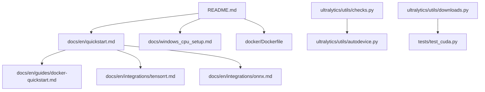
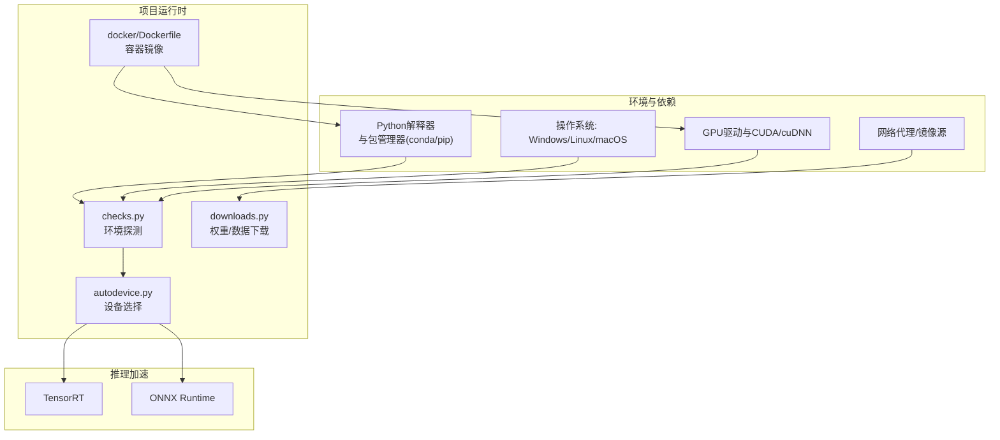
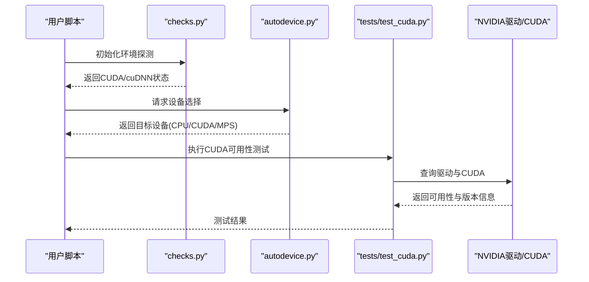
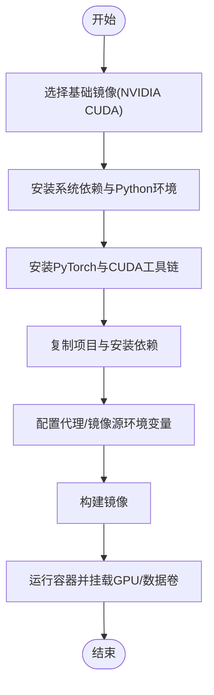
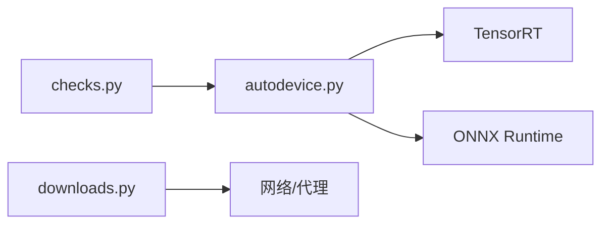

# 环境问题与配置

<cite>
**本文引用的文件**
- [README.md](file://README.md)
- [pyproject.toml](file://pyproject.toml)
- [docker/Dockerfile](file://docker/Dockerfile)
- [docs/en/quickstart.md](file://docs/en/quickstart.md)
- [docs/en/guides/docker-quickstart.md](file://docs/en/guides/docker-quickstart.md)
- [docs/en/integrations/tensorrt.md](file://docs/en/integrations/tensorrt.md)
- [docs/en/integrations/onnx.md](file://docs/en/integrations/onnx.md)
- [docs/en/guides/yolo-common-issues.md](file://docs/en/guides/yolo-common-issues.md)
- [docs/windows_cpu_setup.md](file://docs/windows_cpu_setup.md)
- [ultralytics/utils/checks.py](file://ultralytics/utils/checks.py)
- [ultralytics/utils/autodevice.py](file://ultralytics/utils/autodevice.py)
- [ultralytics/utils/downloads.py](file://ultralytics/utils/downloads.py)
- [tests/test_cuda.py](file://tests/test_cuda.py)
</cite>

## 目录
1. [简介](#简介)
2. [项目结构](#项目结构)
3. [核心组件](#核心组件)
4. [架构总览](#架构总览)
5. [详细组件分析](#详细组件分析)
6. [依赖关系分析](#依赖关系分析)
7. [性能考虑](#性能考虑)
8. [故障排除指南](#故障排除指南)
9. [结论](#结论)
10. [附录](#附录)

## 简介
本文件聚焦于环境安装与配置问题，覆盖Python版本兼容性、依赖包冲突、CUDA/cuDNN配置、GPU驱动与推理引擎（NVIDIA驱动、TensorRT、ONNX Runtime）验证、跨平台（Windows/Linux/macOS）特定问题、虚拟环境最佳实践、网络代理与镜像源、Docker容器化部署、环境变量与路径设置等。目标是帮助读者快速定位并解决常见环境问题，确保训练与推理稳定运行。

## 项目结构
本项目在仓库根目录提供多语言文档与示例，其中与环境相关的关键位置包括：
- 顶层说明与入口：README.md、pyproject.toml
- 官方文档：docs/en/quickstart.md、docs/en/guides/docker-quickstart.md、docs/en/integrations/*.md
- Windows CPU环境说明：docs/windows_cpu_setup.md
- Docker镜像构建：docker/Dockerfile
- 运行时环境检查与设备选择：ultralytics/utils/checks.py、ultralytics/utils/autodevice.py
- 下载与网络相关：ultralytics/utils/downloads.py
- CUDA可用性测试用例：tests/test_cuda.py

图表来源
- [README.md](file://README.md)
- [docs/en/quickstart.md](file://docs/en/quickstart.md)
- [docs/en/guides/docker-quickstart.md](file://docs/en/guides/docker-quickstart.md)
- [docs/en/integrations/tensorrt.md](file://docs/en/integrations/tensorrt.md)
- [docs/en/integrations/onnx.md](file://docs/en/integrations/onnx.md)
- [docs/windows_cpu_setup.md](file://docs/windows_cpu_setup.md)
- [docker/Dockerfile](file://docker/Dockerfile)
- [ultralytics/utils/checks.py](file://ultralytics/utils/checks.py)
- [ultralytics/utils/autodevice.py](file://ultralytics/utils/autodevice.py)
- [ultralytics/utils/downloads.py](file://ultralytics/utils/downloads.py)
- [tests/test_cuda.py](file://tests/test_cuda.py)

章节来源
- [README.md](file://README.md)
- [docs/en/quickstart.md](file://docs/en/quickstart.md)
- [docs/en/guides/docker-quickstart.md](file://docs/en/guides/docker-quickstart.md)
- [docs/en/integrations/tensorrt.md](file://docs/en/integrations/tensorrt.md)
- [docs/en/integrations/onnx.md](file://docs/en/integrations/onnx.md)
- [docs/windows_cpu_setup.md](file://docs/windows_cpu_setup.md)
- [docker/Dockerfile](file://docker/Dockerfile)
- [ultralytics/utils/checks.py](file://ultralytics/utils/checks.py)
- [ultralytics/utils/autodevice.py](file://ultralytics/utils/autodevice.py)
- [ultralytics/utils/downloads.py](file://ultralytics/utils/downloads.py)
- [tests/test_cuda.py](file://tests/test_cuda.py)

## 核心组件
- Python与依赖管理
  - 通过pyproject.toml声明依赖与构建配置，建议结合conda/pip使用，避免系统级污染。
- 设备与后端检测
  - checks.py负责环境能力探测（如CUDA、cuDNN、可用设备），autodevice.py根据检测结果选择最优设备（CPU/CUDA/MPS）。
- 下载与网络
  - downloads.py封装模型权重与数据集的下载逻辑，支持代理与镜像源配置。
- 文档与示例
  - quickstart.md提供快速开始；docker-quickstart.md给出容器化流程；tensorrt.md与onnx.md分别介绍推理加速集成；windows_cpu_setup.md针对Windows CPU环境给出注意事项。
- 测试
  - tests/test_cuda.py用于验证CUDA可用性，便于回归与环境自检。

章节来源
- [pyproject.toml](file://pyproject.toml)
- [ultralytics/utils/checks.py](file://ultralytics/utils/checks.py)
- [ultralytics/utils/autodevice.py](file://ultralytics/utils/autodevice.py)
- [ultralytics/utils/downloads.py](file://ultralytics/utils/downloads.py)
- [docs/en/quickstart.md](file://docs/en/quickstart.md)
- [docs/en/guides/docker-quickstart.md](file://docs/en/guides/docker-quickstart.md)
- [docs/en/integrations/tensorrt.md](file://docs/en/integrations/tensorrt.md)
- [docs/en/integrations/onnx.md](file://docs/en/integrations/onnx.md)
- [docs/windows_cpu_setup.md](file://docs/windows_cpu_setup.md)
- [tests/test_cuda.py](file://tests/test_cuda.py)

## 架构总览
下图展示从“环境准备”到“设备选择与推理/训练”的关键路径，以及外部依赖（CUDA/TensorRT/ONNX）的接入点。

图表来源
- [ultralytics/utils/checks.py](file://ultralytics/utils/checks.py)
- [ultralytics/utils/autodevice.py](file://ultralytics/utils/autodevice.py)
- [ultralytics/utils/downloads.py](file://ultralytics/utils/downloads.py)
- [docker/Dockerfile](file://docker/Dockerfile)
- [docs/en/integrations/tensorrt.md](file://docs/en/integrations/tensorrt.md)
- [docs/en/integrations/onnx.md](file://docs/en/integrations/onnx.md)

## 详细组件分析

### Python版本与依赖冲突
- 版本约束
  - pyproject.toml中定义依赖与构建要求，建议遵循其推荐的Python版本范围，避免ABI不兼容。
- 常见冲突
  - numpy/pytorch/cuda-toolkit版本组合不当会导致导入失败或运行时崩溃。
  - 不同包对OpenSSL、libstdc++等系统库存在差异，建议在隔离环境中安装。
- 排查步骤
  - 使用conda创建干净环境，按pyproject.toml顺序安装依赖。
  - 若出现ABI错误，优先对齐PyTorch与CUDA工具链版本。
  - 使用pip列表与依赖解析工具定位冲突包。

章节来源
- [pyproject.toml](file://pyproject.toml)

### CUDA/cuDNN配置与验证
- 驱动与CUDA
  - NVIDIA驱动需满足当前CUDA版本的最低要求；CUDA Toolkit与cuDNN版本需匹配PyTorch预编译二进制。
- 验证方法
  - 使用tests/test_cuda.py进行CUDA可用性测试。
  - 在Python中调用设备探测逻辑（checks.py/autodevice.py）确认是否识别到GPU。
- 常见问题
  - “找不到CUDA”：检查nvidia-smi输出与CUDA版本一致性；确认PATH/LD_LIBRARY_PATH包含正确路径。
  - cuDNN缺失或版本不匹配：安装与PyTorch匹配的cuDNN版本。
  - 多卡环境：确保进程可见性（CUDA_VISIBLE_DEVICES）与权限正确。

图表来源
- [ultralytics/utils/checks.py](file://ultralytics/utils/checks.py)
- [ultralytics/utils/autodevice.py](file://ultralytics/utils/autodevice.py)
- [tests/test_cuda.py](file://tests/test_cuda.py)

章节来源
- [ultralytics/utils/checks.py](file://ultralytics/utils/checks.py)
- [ultralytics/utils/autodevice.py](file://ultralytics/utils/autodevice.py)
- [tests/test_cuda.py](file://tests/test_cuda.py)

### 跨平台特定问题与解决方案
- Windows
  - CPU环境：参考docs/windows_cpu_setup.md，注意Visual Studio Build Tools、OpenCV依赖与路径设置。
  - GPU环境：确保安装与CUDA版本一致的NVIDIA驱动；避免同时安装多个CUDA Toolkit导致冲突。
- Linux
  - 内核头文件与gcc版本需匹配驱动安装需求；容器内需挂载nvidia驱动与CUDA库。
  - 使用ldconfig更新动态链接库缓存。
- macOS
  - MPS后端：Apple Silicon上启用MPS以获得较好性能；Metal驱动由系统管理。
  - 避免混用Homebrew与系统Python，建议使用conda。

章节来源
- [docs/windows_cpu_setup.md](file://docs/windows_cpu_setup.md)

### GPU驱动与推理引擎配置
- NVIDIA驱动
  - 使用nvidia-smi查看驱动版本与支持的CUDA上限；按需升级驱动以支持更高CUDA。
- TensorRT
  - 参考docs/en/integrations/tensorrt.md，确保TensorRT与CUDA版本匹配；导出为TensorRT引擎前完成预检。
- ONNX Runtime
  - 参考docs/en/integrations/onnx.md，安装对应GPU版ORT；导出ONNX后在目标设备上验证推理。

章节来源
- [docs/en/integrations/tensorrt.md](file://docs/en/integrations/tensorrt.md)
- [docs/en/integrations/onnx.md](file://docs/en/integrations/onnx.md)

### 虚拟环境管理最佳实践
- conda
  - 推荐用于科学计算栈隔离；创建独立环境并按顺序安装PyTorch、CUDA工具链与第三方库。
  - 使用conda-forge获取更广泛的预编译包。
- pip
  - 在conda环境内使用pip安装纯Python包；必要时指定--no-build-isolation以避免构建冲突。
- 通用建议
  - 固定依赖版本；记录环境快照；避免全局安装。

章节来源
- [docs/en/quickstart.md](file://docs/en/quickstart.md)

### 网络代理与镜像源配置
- 代理设置
  - 在downloads.py中处理网络请求时，可读取HTTP_PROXY/HTTPS_PROXY等环境变量；企业网络建议统一配置。
- 镜像源
  - 为pip/conda配置国内镜像源以提升下载速度；对于权重与数据集，可在相应配置项中替换为镜像地址。
- 常见问题
  - SSL证书错误：配置信任CA或使用公司代理；超时重试：调整超时参数与重试策略。

章节来源
- [ultralytics/utils/downloads.py](file://ultralytics/utils/downloads.py)

### Docker容器化部署
- 镜像构建
  - docker/Dockerfile定义了基础镜像、CUDA与依赖安装流程；建议基于官方NVIDIA CUDA镜像以减少驱动依赖。
- 运行与挂载
  - 使用nvidia-container-toolkit将宿主GPU暴露给容器；挂载数据卷与模型权重目录。
- 网络与代理
  - 在镜像构建阶段配置代理与镜像源，或在运行时通过环境变量注入。

图表来源
- [docker/Dockerfile](file://docker/Dockerfile)
- [docs/en/guides/docker-quickstart.md](file://docs/en/guides/docker-quickstart.md)

章节来源
- [docker/Dockerfile](file://docker/Dockerfile)
- [docs/en/guides/docker-quickstart.md](file://docs/en/guides/docker-quickstart.md)

### 环境变量与路径设置
- 常用变量
  - CUDA_VISIBLE_DEVICES：控制可见GPU；NCCL_*：分布式通信；OMP_NUM_THREADS：线程数。
  - HTTP_PROXY/HTTPS_PROXY：代理；PIP_INDEX_URL/CONDA_DEFAULTS：镜像源。
- 路径设置
  - PATH/LD_LIBRARY_PATH：确保CUDA与驱动库可被找到；Windows下注意系统路径与PowerShell/命令提示符差异。
- 验证
  - 使用autodevice.py与checks.py确认环境变量生效；在容器中打印环境变量进行调试。

章节来源
- [ultralytics/utils/autodevice.py](file://ultralytics/utils/autodevice.py)
- [ultralytics/utils/checks.py](file://ultralytics/utils/checks.py)

## 依赖关系分析
- 内部模块耦合
  - checks.py与autodevice.py紧密协作：前者探测能力，后者做决策。
  - downloads.py与网络层解耦，便于代理与镜像源切换。
- 外部依赖
  - PyTorch与CUDA/cuDNN：强耦合，版本需严格匹配。
  - TensorRT/ONNX Runtime：可选加速后端，需与CUDA版本一致。
- 潜在循环依赖
  - 当前设计无直接循环依赖；设备选择与下载逻辑相互独立。

图表来源
- [ultralytics/utils/checks.py](file://ultralytics/utils/checks.py)
- [ultralytics/utils/autodevice.py](file://ultralytics/utils/autodevice.py)
- [ultralytics/utils/downloads.py](file://ultralytics/utils/downloads.py)
- [docs/en/integrations/tensorrt.md](file://docs/en/integrations/tensorrt.md)
- [docs/en/integrations/onnx.md](file://docs/en/integrations/onnx.md)

章节来源
- [ultralytics/utils/checks.py](file://ultralytics/utils/checks.py)
- [ultralytics/utils/autodevice.py](file://ultralytics/utils/autodevice.py)
- [ultralytics/utils/downloads.py](file://ultralytics/utils/downloads.py)
- [docs/en/integrations/tensorrt.md](file://docs/en/integrations/tensorrt.md)
- [docs/en/integrations/onnx.md](file://docs/en/integrations/onnx.md)

## 性能考虑
- 合理批大小与内存占用：根据GPU显存调整batch size，避免OOM。
- 混合精度与编译优化：在支持的设备上启用AMP与后端优化（如TensorRT）。
- 多线程与I/O：调节线程数与数据加载并行度，避免CPU瓶颈。
- 监控与诊断：利用日志与测试用例持续验证性能回归。

[本节为通用指导，无需引用具体文件]

## 故障排除指南
- 无法识别GPU
  - 检查驱动与CUDA版本匹配；使用tests/test_cuda.py与checks.py/autodevice.py进行诊断。
- 导入失败或ABI错误
  - 重新安装PyTorch与CUDA工具链；清理旧缓存；使用conda隔离环境。
- 下载失败或超时
  - 配置代理与镜像源；检查防火墙与DNS；增大超时与重试次数。
- 容器内无GPU
  - 确认nvidia-container-toolkit安装；运行容器时添加--gpus all；检查宿主机驱动。
- Windows CPU环境异常
  - 参考docs/windows_cpu_setup.md，检查Visual Studio工具链与OpenCV依赖。

章节来源
- [tests/test_cuda.py](file://tests/test_cuda.py)
- [ultralytics/utils/checks.py](file://ultralytics/utils/checks.py)
- [ultralytics/utils/autodevice.py](file://ultralytics/utils/autodevice.py)
- [ultralytics/utils/downloads.py](file://ultralytics/utils/downloads.py)
- [docs/windows_cpu_setup.md](file://docs/windows_cpu_setup.md)

## 结论
通过严格的Python与依赖版本管理、正确的CUDA/cuDNN配置、合理的网络与镜像源设置、规范的虚拟环境与容器化部署，可以显著降低环境问题概率。结合项目内置的环境探测与测试用例，能够快速定位并修复问题，保障训练与推理的稳定性和性能。

[本节为总结，无需引用具体文件]

## 附录
- 快速参考
  - 快速开始：docs/en/quickstart.md
  - Docker快速上手：docs/en/guides/docker-quickstart.md
  - TensorRT集成：docs/en/integrations/tensorrt.md
  - ONNX集成：docs/en/integrations/onnx.md
  - Windows CPU设置：docs/windows_cpu_setup.md
  - 常见问题汇总：docs/en/guides/yolo-common-issues.md

章节来源
- [docs/en/quickstart.md](file://docs/en/quickstart.md)
- [docs/en/guides/docker-quickstart.md](file://docs/en/guides/docker-quickstart.md)
- [docs/en/integrations/tensorrt.md](file://docs/en/integrations/tensorrt.md)
- [docs/en/integrations/onnx.md](file://docs/en/integrations/onnx.md)
- [docs/windows_cpu_setup.md](file://docs/windows_cpu_setup.md)
- [docs/en/guides/yolo-common-issues.md](file://docs/en/guides/yolo-common-issues.md)