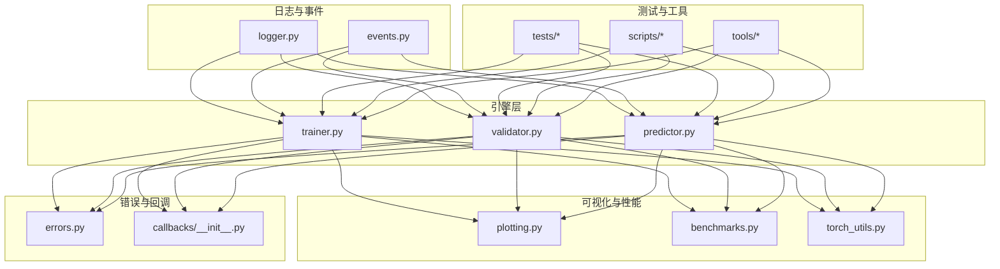
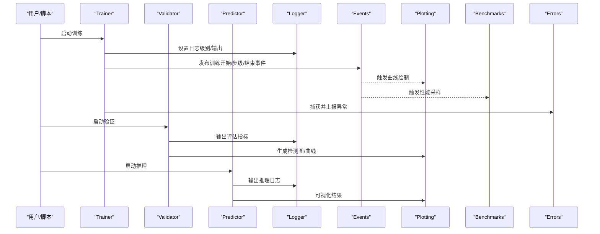
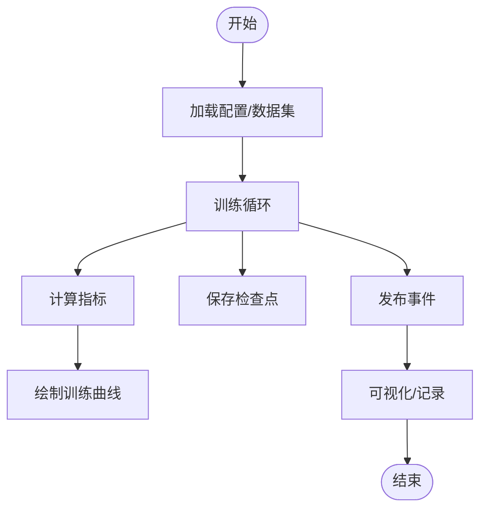
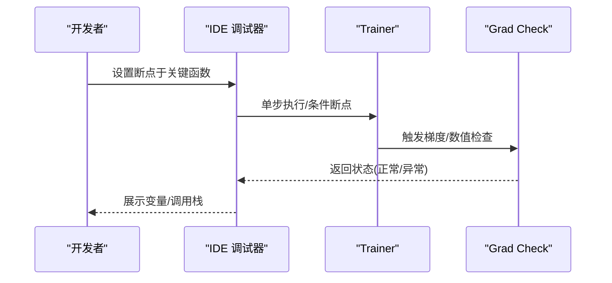
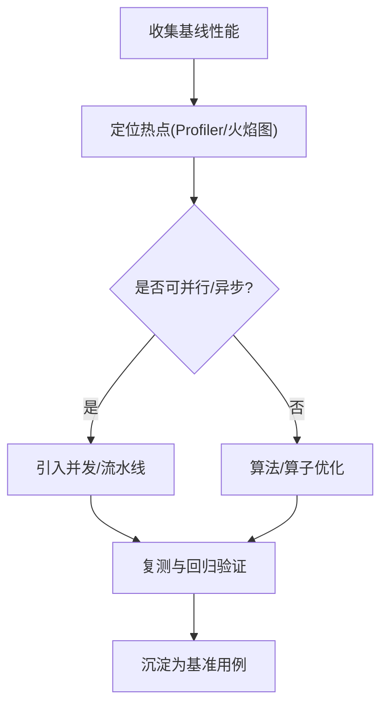
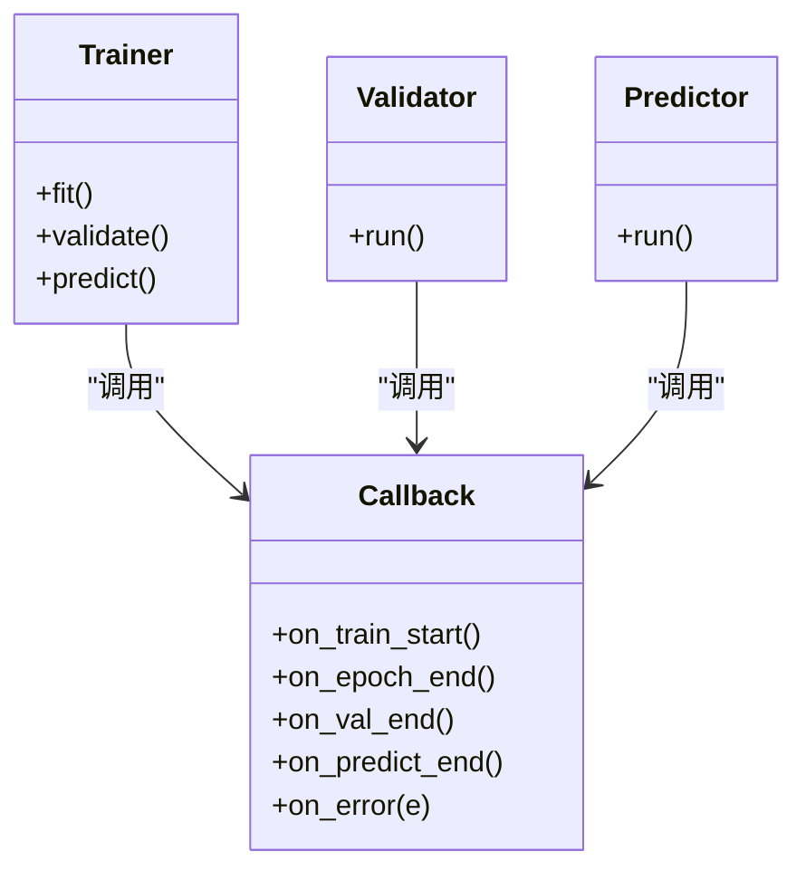
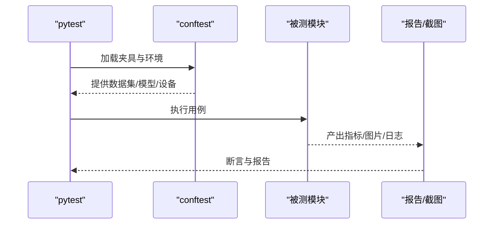
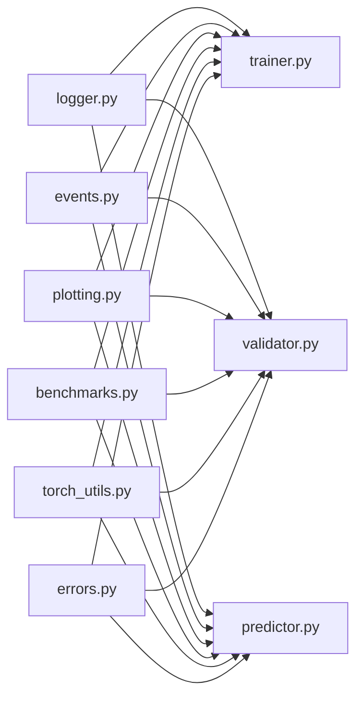

# 调试工具与方法

<cite>
**本文引用的文件**
- [logger.py](file://ultralytics/utils/logger.py)
- [events.py](file://ultralytics/utils/events.py)
- [trainer.py](file://ultralytics/engine/trainer.py)
- [validator.py](file://ultralytics/engine/validator.py)
- [predictor.py](file://ultralytics/engine/predictor.py)
- [plotting.py](file://ultralytics/utils/plotting.py)
- [benchmarks.py](file://ultralytics/utils/benchmarks.py)
- [torch_utils.py](file://ultralytics/utils/torch_utils.py)
- [errors.py](file://ultralytics/utils/errors.py)
- [callbacks/__init__.py](file://ultralytics/utils/callbacks/__init__.py)
- [test_cli.py](file://tests/test_cli.py)
- [conftest.py](file://tests/conftest.py)
- [test_engine.py](file://tests/test_engine.py)
- [test_moe_validation_collectives.py](file://tests/test_moe_validation_collectives.py)
- [test_ddp_error_propagation_e2e.py](file://tests/test_ddp_error_propagation_e2e.py)
- [scripts/smoke_test_coco2017.py](file://scripts/smoke_test_coco2017.py)
- [scripts/analyze_mot_routing.py](file://scripts/analyze_mot_routing.py)
- [scripts/diagnose_mot_routing.py](file://scripts/diagnose_mot_routing.py)
- [tools/routing_interpreter.py](file://tools/routing_interpreter.py)
</cite>

## 目录
1. [简介](#简介)
2. [项目结构](#项目结构)
3. [核心组件](#核心组件)
4. [架构总览](#架构总览)
5. [详细组件分析](#详细组件分析)
6. [依赖关系分析](#依赖关系分析)
7. [性能考量](#性能考量)
8. [故障排查指南](#故障排查指南)
9. [结论](#结论)
10. [附录](#附录)

## 简介
本指南面向在 YOLO-Master 项目中开展训练、推理与评估的工程师，聚焦“如何高效定位问题并快速恢复”。内容覆盖：
- 内置日志系统的使用与配置（级别、输出、关键信息提取）
- 可视化诊断（训练曲线、检测结果、路由分布等）
- 断点调试与代码追踪（PyTorch 调试器、IDE 配置、核心模块切入点）
- 性能剖析（内存分析、GPU profiling、热点识别）
- 自定义回调的编写与调试
- 自动化测试与回归测试的调试方法

## 项目结构
围绕调试与诊断的关键位置如下：
- 日志与事件：utils/logger.py、utils/events.py
- 训练/验证/预测主流程：engine/trainer.py、engine/validator.py、engine/predictor.py
- 可视化：utils/plotting.py
- 基准与性能：utils/benchmarks.py、utils/torch_utils.py
- 错误体系：utils/errors.py
- 回调框架：utils/callbacks/__init__.py
- 测试与脚本：tests/*、scripts/*、tools/*

图表来源
- [logger.py](file://ultralytics/utils/logger.py)
- [events.py](file://ultralytics/utils/events.py)
- [trainer.py](file://ultralytics/engine/trainer.py)
- [validator.py](file://ultralytics/engine/validator.py)
- [predictor.py](file://ultralytics/engine/predictor.py)
- [plotting.py](file://ultralytics/utils/plotting.py)
- [benchmarks.py](file://ultralytics/utils/benchmarks.py)
- [torch_utils.py](file://ultralytics/utils/torch_utils.py)
- [errors.py](file://ultralytics/utils/errors.py)
- [callbacks/__init__.py](file://ultralytics/utils/callbacks/__init__.py)

章节来源
- [logger.py](file://ultralytics/utils/logger.py)
- [events.py](file://ultralytics/utils/events.py)
- [trainer.py](file://ultralytics/engine/trainer.py)
- [validator.py](file://ultralytics/engine/validator.py)
- [predictor.py](file://ultralytics/engine/predictor.py)
- [plotting.py](file://ultralytics/utils/plotting.py)
- [benchmarks.py](file://ultralytics/utils/benchmarks.py)
- [torch_utils.py](file://ultralytics/utils/torch_utils.py)
- [errors.py](file://ultralytics/utils/errors.py)
- [callbacks/__init__.py](file://ultralytics/utils/callbacks/__init__.py)

## 核心组件
- 日志子系统
  - 统一入口与级别控制：通过 logger 模块提供 info/warning/error/debug 等能力，便于在不同阶段按需开启或关闭。
  - 事件总线：events 模块将训练/验证/预测过程中的关键节点以事件形式广播，供回调和可视化订阅。
- 引擎主流程
  - trainer：负责训练循环、指标记录、模型保存、回调触发。
  - validator：负责验证/评估循环、指标汇总、结果可视化。
  - predictor：负责推理流水线、结果后处理与可视化。
- 可视化与性能
  - plotting：绘制训练曲线、混淆矩阵、PR 曲线、检测结果图等。
  - benchmarks：吞吐/延迟基准、设备利用率统计。
  - torch_utils：张量/设备相关辅助，含梯度检查、内存监控等常用能力。
- 错误与回调
  - errors：统一的异常层次与错误码，便于定位问题域。
  - callbacks：训练/验证/预测生命周期钩子，支持插入自定义逻辑。

章节来源
- [logger.py](file://ultralytics/utils/logger.py)
- [events.py](file://ultralytics/utils/events.py)
- [trainer.py](file://ultralytics/engine/trainer.py)
- [validator.py](file://ultralytics/engine/validator.py)
- [predictor.py](file://ultralytics/engine/predictor.py)
- [plotting.py](file://ultralytics/utils/plotting.py)
- [benchmarks.py](file://ultralytics/utils/benchmarks.py)
- [torch_utils.py](file://ultralytics/utils/torch_utils.py)
- [errors.py](file://ultralytics/utils/errors.py)
- [callbacks/__init__.py](file://ultralytics/utils/callbacks/__init__.py)

## 架构总览
下图展示从用户调用到日志、事件、可视化与性能采集的整体链路。

图表来源
- [trainer.py](file://ultralytics/engine/trainer.py)
- [validator.py](file://ultralytics/engine/validator.py)
- [predictor.py](file://ultralytics/engine/predictor.py)
- [logger.py](file://ultralytics/utils/logger.py)
- [events.py](file://ultralytics/utils/events.py)
- [plotting.py](file://ultralytics/utils/plotting.py)
- [benchmarks.py](file://ultralytics/utils/benchmarks.py)
- [errors.py](file://ultralytics/utils/errors.py)

## 详细组件分析

### 日志系统与问题诊断
- 日志级别与输出
  - 建议在开发阶段使用更详细的级别，生产环境降低冗余输出。
  - 针对分布式场景，注意仅主进程输出关键日志，避免刷屏。
- 关键信息提取
  - 训练：损失收敛、学习率变化、梯度范数、NaN/Inf 检测。
  - 验证：mAP、精度/召回、类别维度指标、混淆矩阵。
  - 推理：耗时、吞吐、NMS 参数影响、失败样本路径。
- 分析方法
  - 结合 events 订阅关键节点，将指标写入统一存储（如 TensorBoard/CSV）。
  - 对异常堆栈进行分层定位，优先关注最近一次变更的模块。

章节来源
- [logger.py](file://ultralytics/utils/logger.py)
- [events.py](file://ultralytics/utils/events.py)
- [trainer.py](file://ultralytics/engine/trainer.py)
- [validator.py](file://ultralytics/engine/validator.py)
- [predictor.py](file://ultralytics/engine/predictor.py)
- [errors.py](file://ultralytics/utils/errors.py)

### 可视化诊断
- 训练曲线
  - 通过 plotting 模块绘制 loss、mAP、PR 曲线，观察过拟合/欠拟合。
- 检测结果可视化
  - 在验证/推理阶段输出带框/掩码/轨迹的图片，用于直观核对标注与模型行为。
- 路由分布分析（MoE/MoA）
  - 使用 tools/routing_interpreter.py 与 scripts/analyze_mot_routing.py、diagnose_mot_routing.py 分析专家选择、负载不均衡等问题。

图表来源
- [plotting.py](file://ultralytics/utils/plotting.py)
- [trainer.py](file://ultralytics/engine/trainer.py)
- [events.py](file://ultralytics/utils/events.py)
- [analyze_mot_routing.py](file://scripts/analyze_mot_routing.py)
- [diagnose_mot_routing.py](file://scripts/diagnose_mot_routing.py)
- [routing_interpreter.py](file://tools/routing_interpreter.py)

章节来源
- [plotting.py](file://ultralytics/utils/plotting.py)
- [analyze_mot_routing.py](file://scripts/analyze_mot_routing.py)
- [diagnose_mot_routing.py](file://scripts/diagnose_mot_routing.py)
- [routing_interpreter.py](file://tools/routing_interpreter.py)

### 断点调试与代码追踪
- PyTorch 调试器
  - 在关键算子前后插入断点，检查输入形状、数值范围、梯度是否有效。
  - 使用梯度检查工具定位 NaN/Inf 的来源层。
- IDE 调试配置
  - 为训练/验证/预测入口分别创建运行配置，附加环境变量以便控制日志级别与输出路径。
- 核心模块切入
  - 训练：trainer 的主循环、优化器 step、EMA 更新。
  - 验证：validator 的指标聚合、可视化输出。
  - 推理：predictor 的数据预处理、模型前向、后处理与 NMS。

图表来源
- [trainer.py](file://ultralytics/engine/trainer.py)
- [torch_utils.py](file://ultralytics/utils/torch_utils.py)

章节来源
- [trainer.py](file://ultralytics/engine/trainer.py)
- [validator.py](file://ultralytics/engine/validator.py)
- [predictor.py](file://ultralytics/engine/predictor.py)
- [torch_utils.py](file://ultralytics/utils/torch_utils.py)

### 性能剖析与优化
- 内存分析
  - 监控显存峰值与碎片，定位大对象与未释放引用。
  - 在数据加载与增强环节减少不必要的拷贝。
- GPU Profiling
  - 使用 CUDA profiler 或集成工具分析 kernel 耗时、通信开销（DDP）。
- 热点代码识别
  - 结合 benchmarks 模块与事件埋点，对比不同批大小、混合精度、编译选项的影响。

图表来源
- [benchmarks.py](file://ultralytics/utils/benchmarks.py)
- [torch_utils.py](file://ultralytics/utils/torch_utils.py)

章节来源
- [benchmarks.py](file://ultralytics/utils/benchmarks.py)
- [torch_utils.py](file://ultralytics/utils/torch_utils.py)

### 自定义回调的编写与调试
- 生命周期钩子
  - 在训练/验证/预测各阶段注册回调，实现指标记录、早停、动态调度、可视化等。
- 调试技巧
  - 在回调中打印关键中间态；对异常进行捕获与上报，避免中断主流程。
  - 使用事件总线确保回调顺序与幂等性。

图表来源
- [callbacks/__init__.py](file://ultralytics/utils/callbacks/__init__.py)
- [trainer.py](file://ultralytics/engine/trainer.py)
- [validator.py](file://ultralytics/engine/validator.py)
- [predictor.py](file://ultralytics/engine/predictor.py)

章节来源
- [callbacks/__init__.py](file://ultralytics/utils/callbacks/__init__.py)
- [trainer.py](file://ultralytics/engine/trainer.py)
- [validator.py](file://ultralytics/engine/validator.py)
- [predictor.py](file://ultralytics/engine/predictor.py)

### 自动化测试与回归测试的调试
- 单元测试与冒烟测试
  - 使用 pytest 组织用例，结合 conftest 管理共享 fixture。
  - 针对 CLI 与引擎接口编写最小化用例，快速验证改动。
- 回归测试
  - 固定随机种子与输入，比较指标阈值与输出一致性。
  - 对分布式/多卡场景增加专门用例，覆盖 collectives 与错误传播。

图表来源
- [conftest.py](file://tests/conftest.py)
- [test_cli.py](file://tests/test_cli.py)
- [test_engine.py](file://tests/test_engine.py)
- [test_moe_validation_collectives.py](file://tests/test_moe_validation_collectives.py)
- [test_ddp_error_propagation_e2e.py](file://tests/test_ddp_error_propagation_e2e.py)

章节来源
- [test_cli.py](file://tests/test_cli.py)
- [conftest.py](file://tests/conftest.py)
- [test_engine.py](file://tests/test_engine.py)
- [test_moe_validation_collectives.py](file://tests/test_moe_validation_collectives.py)
- [test_ddp_error_propagation_e2e.py](file://tests/test_ddp_error_propagation_e2e.py)

## 依赖关系分析
- 低耦合高内聚
  - 日志与事件作为横切关注点，被训练/验证/预测共同依赖，但彼此解耦。
  - 可视化与性能模块通过事件与回调接入，不影响主流程。
- 外部依赖
  - PyTorch 生态（CUDA、NCCL）、可视化工具（TensorBoard 等）、测试框架（pytest）。

图表来源
- [logger.py](file://ultralytics/utils/logger.py)
- [events.py](file://ultralytics/utils/events.py)
- [trainer.py](file://ultralytics/engine/trainer.py)
- [validator.py](file://ultralytics/engine/validator.py)
- [predictor.py](file://ultralytics/engine/predictor.py)
- [plotting.py](file://ultralytics/utils/plotting.py)
- [benchmarks.py](file://ultralytics/utils/benchmarks.py)
- [torch_utils.py](file://ultralytics/utils/torch_utils.py)
- [errors.py](file://ultralytics/utils/errors.py)

章节来源
- [logger.py](file://ultralytics/utils/logger.py)
- [events.py](file://ultralytics/utils/events.py)
- [trainer.py](file://ultralytics/engine/trainer.py)
- [validator.py](file://ultralytics/engine/validator.py)
- [predictor.py](file://ultralytics/engine/predictor.py)
- [plotting.py](file://ultralytics/utils/plotting.py)
- [benchmarks.py](file://ultralytics/utils/benchmarks.py)
- [torch_utils.py](file://ultralytics/utils/torch_utils.py)
- [errors.py](file://ultralytics/utils/errors.py)

## 性能考量
- 批大小与混合精度
  - 在相同算力下平衡吞吐与稳定性，必要时回退精度或减小 batch。
- I/O 与数据增强
  - 使用缓存、预取与并行加载，避免 CPU 瓶颈。
- 通信与同步
  - 分布式训练中关注 allreduce 频率与梯度累积策略。
- 编译与后端
  - 根据平台选择合适的加速后端与编译选项，并进行回归验证。

[本节为通用指导，无需特定文件来源]

## 故障排查指南
- 常见问题定位
  - 训练不收敛：检查学习率、损失爆炸、标签质量与数据增强强度。
  - 验证指标异常：核对类别映射、阈值、NMS 参数与可视化结果。
  - 推理崩溃：检查输入尺寸、通道顺序、设备一致性与内存占用。
- 错误体系与上报
  - 利用统一错误类型与堆栈信息，快速归因到模块层级。
- 快速复现
  - 使用 smoke test 脚本与最小数据集快速验证改动。

章节来源
- [errors.py](file://ultralytics/utils/errors.py)
- [smoke_test_coco2017.py](file://scripts/smoke_test_coco2017.py)

## 结论
通过统一的日志与事件机制、完善的可视化与性能工具、以及系统的测试与回归手段，可以在 YOLO-Master 项目中高效完成问题定位与性能调优。建议在日常工作中：
- 始终开启结构化日志与关键事件埋点
- 用可视化辅助判断模型行为
- 以基准用例保障改动正确性
- 借助 Profiler 与内存工具持续优化

[本节为总结性内容，无需特定文件来源]

## 附录
- 实用命令与路径
  - 训练/验证/预测入口参考 engine 模块
  - 可视化产物参考 utils/plotting.py
  - 路由诊断参考 tools/routing_interpreter.py 与 scripts/analyze_mot_routing.py、diagnose_mot_routing.py
  - 冒烟测试参考 scripts/smoke_test_coco2017.py

[本节为索引性内容，无需特定文件来源]