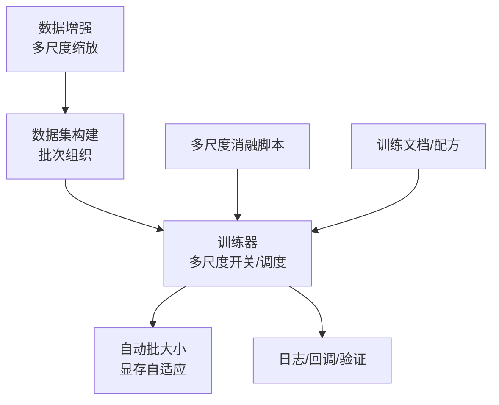
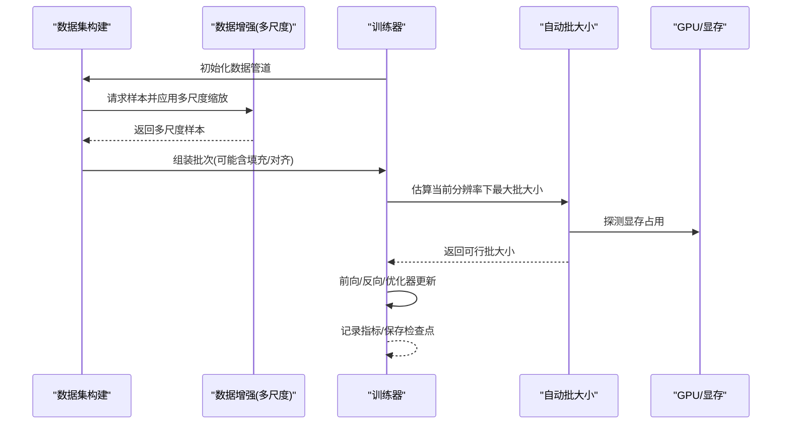
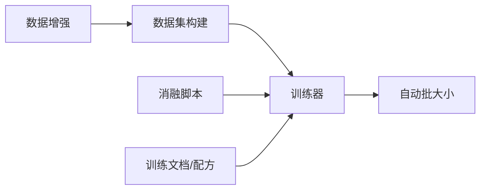

# 多尺度训练

<cite>
**本文引用的文件**
- [ultralytics/data/augment.py](file://ultralytics/data/augment.py)
- [ultralytics/data/build.py](file://ultralytics/data/build.py)
- [ultralytics/engine/trainer.py](file://ultralytics/engine/trainer.py)
- [ultralytics/utils/autobatch.py](file://ultralytics/utils/autobatch.py)
- [scripts/ablation_suite/full_ablation_multiscale.py](file://scripts/ablation_suite/full_ablation_multiscale.py)
- [docs/en/guides/yolo26-training-recipe.md](file://docs/en/guides/yolo26-training-recipe.md)
- [docs/en/modes/train.md](file://docs/en/modes/train.md)
</cite>

## 目录
1. [简介](#简介)
2. [项目结构](#项目结构)
3. [核心组件](#核心组件)
4. [架构总览](#架构总览)
5. [详细组件分析](#详细组件分析)
6. [依赖关系分析](#依赖关系分析)
7. [性能考量](#性能考量)
8. [故障排查指南](#故障排查指南)
9. [结论](#结论)
10. [附录](#附录)

## 简介
本技术文档聚焦于YOLO-Master的多尺度训练系统，系统性阐述其原理、优势与实现细节。内容涵盖：
- 多尺度训练的原理与收益：提升模型对不同目标尺度的鲁棒性与泛化能力
- 尺度采样算法与动态尺度调整机制
- 内存管理与计算优化策略（自动批大小、数据加载流水线）
- 不同任务（检测、分割、姿态估计）在多尺度下的差异与适配
- 配置参数与调优方法
- 基准测试思路与对比分析方法
- 最佳实践与常见问题解决方案
- 与其他训练技术（如混合精度、分布式训练、数据增强等）的结合使用

## 项目结构
多尺度训练在YOLO-Master中由数据增强、数据构建、训练器与自动批大小管理等模块协同完成。关键位置如下：
- 数据增强与多尺度缩放：位于数据增强模块
- 数据集构建与批次组织：位于数据构建模块
- 训练主循环与多尺度开关：位于训练器
- 自动批大小与显存自适应：位于自动批大小工具
- 多尺度消融脚本与示例：位于脚本目录
- 官方文档与训练配方：位于文档目录

图表来源
- [ultralytics/data/augment.py](file://ultralytics/data/augment.py)
- [ultralytics/data/build.py](file://ultralytics/data/build.py)
- [ultralytics/engine/trainer.py](file://ultralytics/engine/trainer.py)
- [ultralytics/utils/autobatch.py](file://ultralytics/utils/autobatch.py)
- [scripts/ablation_suite/full_ablation_multiscale.py](file://scripts/ablation_suite/full_ablation_multiscale.py)
- [docs/en/guides/yolo26-training-recipe.md](file://docs/en/guides/yolo26-training-recipe.md)
- [docs/en/modes/train.md](file://docs/en/modes/train.md)

章节来源
- [ultralytics/data/augment.py](file://ultralytics/data/augment.py)
- [ultralytics/data/build.py](file://ultralytics/data/build.py)
- [ultralytics/engine/trainer.py](file://ultralytics/engine/trainer.py)
- [ultralytics/utils/autobatch.py](file://ultralytics/utils/autobatch.py)
- [scripts/ablation_suite/full_ablation_multiscale.py](file://scripts/ablation_suite/full_ablation_multiscale.py)
- [docs/en/guides/yolo26-training-recipe.md](file://docs/en/guides/yolo26-training-recipe.md)
- [docs/en/modes/train.md](file://docs/en/modes/train.md)

## 核心组件
- 数据增强与多尺度缩放
  - 负责在训练阶段对输入图像进行随机分辨率的缩放与裁剪，以覆盖更丰富的尺度分布
  - 通常与Mosaic、MixUp、随机翻转、色彩抖动等增强组合使用
- 数据集构建与批次组织
  - 将多尺度样本按批次打包，必要时进行填充或对齐以满足模型输入要求
  - 控制每步采样的目标分辨率集合与权重
- 训练器与多尺度调度
  - 管理多尺度开关、学习率预热、梯度累积、EMA等
  - 根据训练进度动态调整尺度范围或采样概率
- 自动批大小与显存自适应
  - 依据可用显存与硬件特性自动选择最大可行批大小，避免OOM
  - 与多尺度结合时，需考虑不同分辨率带来的显存波动

章节来源
- [ultralytics/data/augment.py](file://ultralytics/data/augment.py)
- [ultralytics/data/build.py](file://ultralytics/data/build.py)
- [ultralytics/engine/trainer.py](file://ultralytics/engine/trainer.py)
- [ultralytics/utils/autobatch.py](file://ultralytics/utils/autobatch.py)

## 架构总览
下图展示了多尺度训练在主流程中的调用关系与数据流向：从数据增强到数据构建，再到训练器的多尺度调度与自动批大小管理。

图表来源
- [ultralytics/data/build.py](file://ultralytics/data/build.py)
- [ultralytics/data/augment.py](file://ultralytics/data/augment.py)
- [ultralytics/engine/trainer.py](file://ultralytics/engine/trainer.py)
- [ultralytics/utils/autobatch.py](file://ultralytics/utils/autobatch.py)

## 详细组件分析

### 数据增强与多尺度缩放
- 功能要点
  - 在训练阶段随机选择目标分辨率，对图像进行缩放与裁剪，使模型在不同尺度上获得充分训练
  - 与多种几何与颜色增强组合，提高小目标与复杂场景的鲁棒性
- 复杂度与性能
  - 多尺度缩放引入额外的插值与重排开销，但可通过异步数据加载与缓存缓解
- 可配置项
  - 目标分辨率集合、缩放比例范围、是否启用特定增强、随机种子等

章节来源
- [ultralytics/data/augment.py](file://ultralytics/data/augment.py)

### 数据集构建与批次组织
- 功能要点
  - 将多尺度样本按批次聚合，处理不同分辨率导致的形状不一致问题（如填充、对齐）
  - 支持按任务类型（检测、分割、姿态）生成对应的标签格式
- 性能优化
  - 预取、并行I/O、批内最小化填充以降低无效计算
- 可配置项
  - 批大小、填充策略、标签格式、数据预处理流水线顺序

章节来源
- [ultralytics/data/build.py](file://ultralytics/data/build.py)

### 训练器与多尺度调度
- 功能要点
  - 控制多尺度训练的开启与关闭，管理训练轮次、学习率策略、EMA、梯度累积等
  - 可在训练过程中动态调整尺度范围或采样权重，以实现“渐进式”多尺度训练
- 与自动批大小协作
  - 根据当前分辨率估算显存占用，动态调整批大小以避免溢出
- 可配置项
  - 多尺度开关、初始/最终分辨率、动态调整策略、学习率与优化器参数

章节来源
- [ultralytics/engine/trainer.py](file://ultralytics/engine/trainer.py)

### 自动批大小与显存自适应
- 功能要点
  - 基于硬件显存容量与当前输入分辨率，估算最大可行批大小
  - 在多尺度训练中，随分辨率变化动态调整批大小，保持吞吐与稳定性
- 性能影响
  - 合理设置可显著提升训练效率；过小导致吞吐下降，过大引发OOM
- 可配置项
  - 显存阈值、批大小上下限、安全余量、设备类型

章节来源
- [ultralytics/utils/autobatch.py](file://ultralytics/utils/autobatch.py)

### 多尺度消融与实验脚本
- 功能要点
  - 提供多尺度训练的可复现实验脚本，便于进行消融研究与参数扫描
  - 支持批量运行不同配置，输出结果汇总与可视化
- 使用建议
  - 固定随机种子、统一数据版本、记录超参与环境信息，确保可复现

章节来源
- [scripts/ablation_suite/full_ablation_multiscale.py](file://scripts/ablation_suite/full_ablation_multiscale.py)

### 文档与训练配方
- 功能要点
  - 提供多尺度训练的配置说明、推荐参数与最佳实践
  - 包含端到端训练流程、验证与导出步骤
- 参考路径
  - 训练模式文档、YOLO26训练配方等

章节来源
- [docs/en/modes/train.md](file://docs/en/modes/train.md)
- [docs/en/guides/yolo26-training-recipe.md](file://docs/en/guides/yolo26-training-recipe.md)

## 依赖关系分析
多尺度训练的关键依赖关系如下：
- 数据增强为数据构建提供多尺度样本
- 数据构建为训练器提供批次化的多尺度数据
- 训练器协调自动批大小，确保在不同分辨率下的稳定训练
- 消融脚本驱动训练器执行不同配置，产出对比结果

图表来源
- [ultralytics/data/augment.py](file://ultralytics/data/augment.py)
- [ultralytics/data/build.py](file://ultralytics/data/build.py)
- [ultralytics/engine/trainer.py](file://ultralytics/engine/trainer.py)
- [ultralytics/utils/autobatch.py](file://ultralytics/utils/autobatch.py)
- [scripts/ablation_suite/full_ablation_multiscale.py](file://scripts/ablation_suite/full_ablation_multiscale.py)
- [docs/en/guides/yolo26-training-recipe.md](file://docs/en/guides/yolo26-training-recipe.md)
- [docs/en/modes/train.md](file://docs/en/modes/train.md)

章节来源
- [ultralytics/data/augment.py](file://ultralytics/data/augment.py)
- [ultralytics/data/build.py](file://ultralytics/data/build.py)
- [ultralytics/engine/trainer.py](file://ultralytics/engine/trainer.py)
- [ultralytics/utils/autobatch.py](file://ultralytics/utils/autobatch.py)
- [scripts/ablation_suite/full_ablation_multiscale.py](file://scripts/ablation_suite/full_ablation_multiscale.py)
- [docs/en/guides/yolo26-training-recipe.md](file://docs/en/guides/yolo26-training-recipe.md)
- [docs/en/modes/train.md](file://docs/en/modes/train.md)

## 性能考量
- 吞吐与延迟平衡
  - 多尺度会引入额外计算与内存波动，需通过自动批大小与数据预取优化吞吐
- 显存管理
  - 大分辨率与小分辨率交替出现时，建议设置合理的显存安全余量，避免频繁扩容/缩容
- I/O瓶颈
  - 高并发读取与压缩解码是常见瓶颈，建议使用并行I/O与缓存策略
- 数值稳定性
  - 多尺度可能导致梯度尺度差异，配合学习率预热与EMA可提升稳定性

[本节为通用指导，不直接分析具体文件]

## 故障排查指南
- 常见问题
  - OOM：降低批大小或分辨率上限，增加安全余量
  - 训练不稳定：启用学习率预热、EMA，检查梯度裁剪与数值范围
  - 吞吐低：检查数据加载并行度、磁盘I/O与网络存储
- 定位方法
  - 记录每个阶段的耗时与显存占用，定位瓶颈
  - 使用消融脚本逐步关闭多尺度或其他增强，观察性能变化

章节来源
- [ultralytics/utils/autobatch.py](file://ultralytics/utils/autobatch.py)
- [scripts/ablation_suite/full_ablation_multiscale.py](file://scripts/ablation_suite/full_ablation_multiscale.py)

## 结论
多尺度训练在YOLO-Master中通过数据增强、数据构建、训练器与自动批大小的协同工作，有效提升了模型对不同目标尺度的鲁棒性与泛化能力。合理配置与调优可显著改善训练稳定性与吞吐表现。建议结合消融实验与基准评测，持续优化多尺度策略与相关超参。

[本节为总结性内容，不直接分析具体文件]

## 附录

### 多尺度训练的原理与优势
- 原理
  - 在训练阶段随机选择目标分辨率，使模型学习到跨尺度的特征表示
- 优势
  - 提升小目标检测与复杂场景的鲁棒性
  - 增强模型的尺度不变性与泛化能力

[本节为概念性内容，不直接分析具体文件]

### 尺度采样算法与动态尺度调整
- 尺度采样
  - 从预设的分辨率集合中按概率采样，可均匀或加权
- 动态调整
  - 随训练进度扩大或缩小分辨率范围，实现渐进式训练
- 实现位置
  - 数据增强与训练器共同协作完成采样与调度

章节来源
- [ultralytics/data/augment.py](file://ultralytics/data/augment.py)
- [ultralytics/engine/trainer.py](file://ultralytics/engine/trainer.py)

### 内存管理与计算优化策略
- 自动批大小
  - 根据显存与分辨率动态调整批大小
- 数据预取与并行I/O
  - 减少CPU-GPU等待时间，提升吞吐
- 填充与对齐
  - 最小化无效计算，提高矩阵运算效率

章节来源
- [ultralytics/utils/autobatch.py](file://ultralytics/utils/autobatch.py)
- [ultralytics/data/build.py](file://ultralytics/data/build.py)

### 不同任务的多尺度实现差异
- 检测
  - 关注边界框在不同尺度的回归稳定性
- 分割
  - 需要高分辨率以保持掩码细节，注意显存压力
- 姿态估计
  - 关键点坐标需随分辨率同步缩放，保证标注一致性

章节来源
- [ultralytics/data/build.py](file://ultralytics/data/build.py)

### 配置参数与调优方法
- 关键参数
  - 多尺度开关、分辨率集合、采样权重、动态调整策略
  - 批大小、学习率、预热步数、EMA系数
- 调优建议
  - 从小范围分辨率开始，逐步扩展
  - 结合消融实验确定最优配置

章节来源
- [docs/en/guides/yolo26-training-recipe.md](file://docs/en/guides/yolo26-training-recipe.md)
- [docs/en/modes/train.md](file://docs/en/modes/train.md)

### 基准测试与对比分析
- 测试维度
  - mAP、推理延迟、训练吞吐、显存占用
- 对比方法
  - 固定随机种子与数据版本，仅改变多尺度配置
  - 使用消融脚本批量运行，汇总结果

章节来源
- [scripts/ablation_suite/full_ablation_multiscale.py](file://scripts/ablation_suite/full_ablation_multiscale.py)

### 最佳实践与常见问题
- 最佳实践
  - 启用学习率预热与EMA
  - 合理设置自动批大小与安全余量
  - 使用并行I/O与数据缓存
- 常见问题
  - OOM、训练不稳定、吞吐低等问题的定位与解决

章节来源
- [ultralytics/utils/autobatch.py](file://ultralytics/utils/autobatch.py)
- [ultralytics/engine/trainer.py](file://ultralytics/engine/trainer.py)

### 与其他训练技术的结合
- 混合精度
  - 降低显存占用，提升吞吐
- 分布式训练
  - 多卡或多机并行，加速训练
- 数据增强
  - 与Mosaic、MixUp等组合，进一步提升鲁棒性

章节来源
- [docs/en/guides/yolo26-training-recipe.md](file://docs/en/guides/yolo26-training-recipe.md)
- [docs/en/modes/train.md](file://docs/en/modes/train.md)