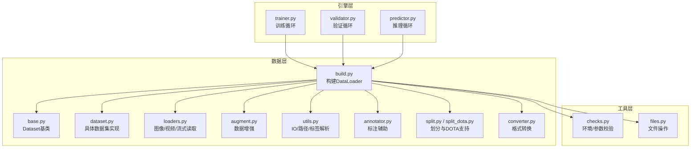
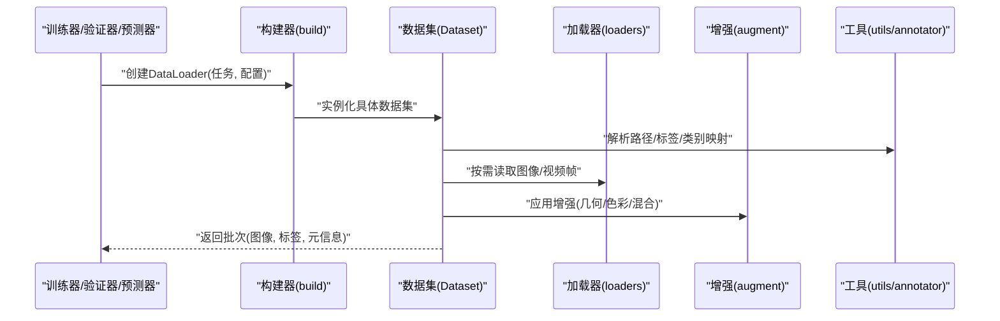
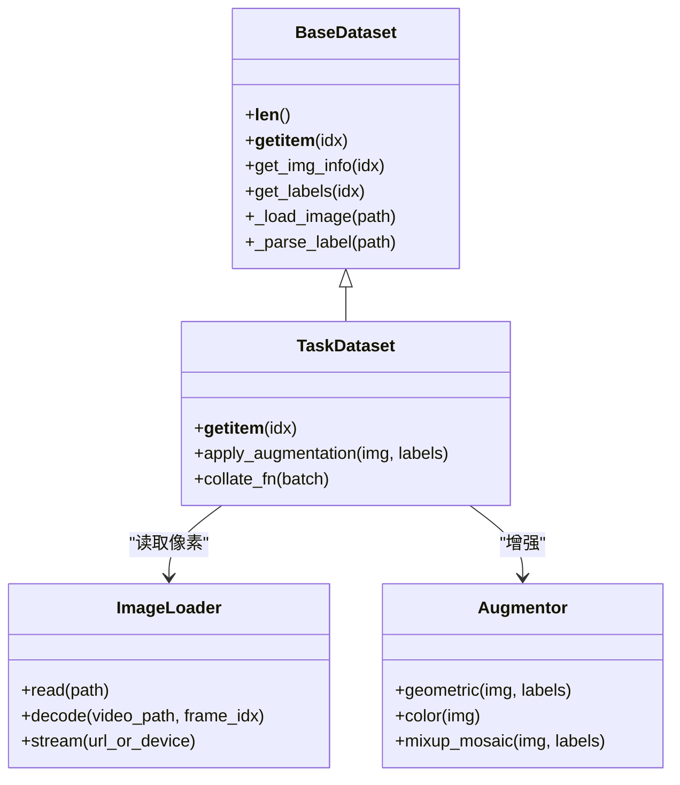
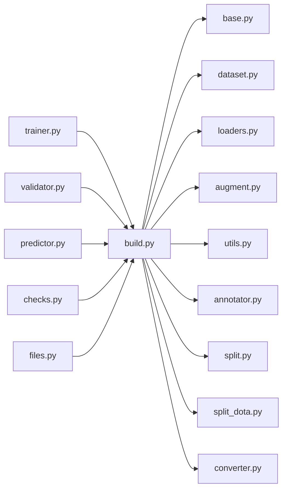

# 数据加载器

<cite>
**本文引用的文件**
- [ultralytics/data/__init__.py](file://ultralytics/data/__init__.py)
- [ultralytics/data/base.py](file://ultralytics/data/base.py)
- [ultralytics/data/build.py](file://ultralytics/data/build.py)
- [ultralytics/data/dataset.py](file://ultralytics/data/dataset.py)
- [ultralytics/data/loaders.py](file://ultralytics/data/loaders.py)
- [ultralytics/data/augment.py](file://ultralytics/data/augment.py)
- [ultralytics/data/utils.py](file://ultralytics/data/utils.py)
- [ultralytics/data/annotator.py](file://ultralytics/data/annotator.py)
- [ultralytics/data/split.py](file://ultralytics/data/split.py)
- [ultralytics/data/split_dota.py](file://ultralytics/data/split_dota.py)
- [ultralytics/data/converter.py](file://ultralytics/data/converter.py)
- [ultralytics/engine/trainer.py](file://ultralytics/engine/trainer.py)
- [ultralytics/engine/validator.py](file://ultralytics/engine/validator.py)
- [ultralytics/engine/predictor.py](file://ultralytics/engine/predictor.py)
- [ultralytics/utils/checks.py](file://ultralytics/utils/checks.py)
- [ultralytics/utils/files.py](file://ultralytics/utils/files.py)
</cite>

## 目录
1. [简介](#简介)
2. [项目结构](#项目结构)
3. [核心组件](#核心组件)
4. [架构总览](#架构总览)
5. [详细组件分析](#详细组件分析)
6. [依赖关系分析](#依赖关系分析)
7. [性能考虑](#性能考虑)
8. [故障排查指南](#故障排查指南)
9. [结论](#结论)
10. [附录](#附录)

## 简介
本技术文档聚焦于 YOLO-Master 的数据加载器系统，系统性阐述 DataLoader 的架构设计、异步与多进程加载、批处理策略、内存管理、数据集缓存与预取、自动识别与加载主流格式（YOLO、COCO、VOC、ImageNet 等）、自定义数据加载器的开发接口与最佳实践、数据验证与质量检查机制，以及面向大数据集的性能优化技巧与常见问题诊断方案。目标是帮助读者在不深入源码细节的前提下，也能高效配置、扩展与调优数据管线。

## 项目结构
数据加载相关代码集中在 ultralytics/data 包中，并与训练/验证/预测引擎紧密集成：
- 入口与构建：data/__init__.py、data/build.py
- 数据集抽象与实现：data/base.py、data/dataset.py
- 数据源读取：data/loaders.py
- 增强与工具：data/augment.py、data/utils.py、data/annotator.py
- 分割与转换：data/split.py、data/split_dota.py、data/converter.py
- 上层调用方：engine/trainer.py、engine/validator.py、engine/predictor.py
- 通用校验与文件工具：utils/checks.py、utils/files.py

图表来源
- [ultralytics/data/build.py](file://ultralytics/data/build.py)
- [ultralytics/data/base.py](file://ultralytics/data/base.py)
- [ultralytics/data/dataset.py](file://ultralytics/data/dataset.py)
- [ultralytics/data/loaders.py](file://ultralytics/data/loaders.py)
- [ultralytics/data/augment.py](file://ultralytics/data/augment.py)
- [ultralytics/data/utils.py](file://ultralytics/data/utils.py)
- [ultralytics/data/annotator.py](file://ultralytics/data/annotator.py)
- [ultralytics/data/split.py](file://ultralytics/data/split.py)
- [ultralytics/data/split_dota.py](file://ultralytics/data/split_dota.py)
- [ultralytics/data/converter.py](file://ultralytics/data/converter.py)
- [ultralytics/engine/trainer.py](file://ultralytics/engine/trainer.py)
- [ultralytics/engine/validator.py](file://ultralytics/engine/validator.py)
- [ultralytics/engine/predictor.py](file://ultralytics/engine/predictor.py)
- [ultralytics/utils/checks.py](file://ultralytics/utils/checks.py)
- [ultralytics/utils/files.py](file://ultralytics/utils/files.py)

章节来源
- [ultralytics/data/__init__.py](file://ultralytics/data/__init__.py)
- [ultralytics/data/build.py](file://ultralytics/data/build.py)
- [ultralytics/data/base.py](file://ultralytics/data/base.py)
- [ultralytics/data/dataset.py](file://ultralytics/data/dataset.py)
- [ultralytics/data/loaders.py](file://ultralytics/data/loaders.py)
- [ultralytics/data/augment.py](file://ultralytics/data/augment.py)
- [ultralytics/data/utils.py](file://ultralytics/data/utils.py)
- [ultralytics/data/annotator.py](file://ultralytics/data/annotator.py)
- [ultralytics/data/split.py](file://ultralytics/data/split.py)
- [ultralytics/data/split_dota.py](file://ultralytics/data/split_dota.py)
- [ultralytics/data/converter.py](file://ultralytics/data/converter.py)
- [ultralytics/engine/trainer.py](file://ultralytics/engine/trainer.py)
- [ultralytics/engine/validator.py](file://ultralytics/engine/validator.py)
- [ultralytics/engine/predictor.py](file://ultralytics/engine/predictor.py)
- [ultralytics/utils/checks.py](file://ultralytics/utils/checks.py)
- [ultralytics/utils/files.py](file://ultralytics/utils/files.py)

## 核心组件
- 构建器（Build）
  - 负责根据任务类型与数据配置创建合适的 Dataset 与 DataLoader，统一封装多进程、缓冲、打乱、裁剪与填充等策略。
- 数据集抽象（Base/Dataset）
  - 定义统一的索引访问、元信息获取、标签解析与增强流水线接口；具体数据集实现继承该抽象以适配不同格式。
- 数据源读取（Loaders）
  - 提供图像、视频、摄像头、网络流等多种输入源的解码与预处理能力，并输出模型所需的张量或中间表示。
- 增强与工具（Augment/Utils/Annotator）
  - 封装常用几何与色彩增强、边界框/掩码/关键点变换一致性保证、路径与标签解析、统计与可视化辅助。
- 划分与转换（Split/Converter）
  - 提供数据集切分（含 DOTA 等旋转目标场景）与格式互转（如 COCO↔YOLO），便于统一训练流程。
- 引擎集成（Trainer/Validator/Predictor）
  - 在训练、验证、推理阶段按需创建 DataLoader，控制 epoch 内迭代、批调度与进度上报。

章节来源
- [ultralytics/data/build.py](file://ultralytics/data/build.py)
- [ultralytics/data/base.py](file://ultralytics/data/base.py)
- [ultralytics/data/dataset.py](file://ultralytics/data/dataset.py)
- [ultralytics/data/loaders.py](file://ultralytics/data/loaders.py)
- [ultralytics/data/augment.py](file://ultralytics/data/augment.py)
- [ultralytics/data/utils.py](file://ultralytics/data/utils.py)
- [ultralytics/data/annotator.py](file://ultralytics/data/annotator.py)
- [ultralytics/data/split.py](file://ultralytics/data/split.py)
- [ultralytics/data/split_dota.py](file://ultralytics/data/split_dota.py)
- [ultralytics/data/converter.py](file://ultralytics/data/converter.py)
- [ultralytics/engine/trainer.py](file://ultralytics/engine/trainer.py)
- [ultralytics/engine/validator.py](file://ultralytics/engine/validator.py)
- [ultralytics/engine/predictor.py](file://ultralytics/engine/predictor.py)

## 架构总览
下图展示了从上层引擎到数据加载各层的调用关系与职责分工。

图表来源
- [ultralytics/engine/trainer.py](file://ultralytics/engine/trainer.py)
- [ultralytics/engine/validator.py](file://ultralytics/engine/validator.py)
- [ultralytics/engine/predictor.py](file://ultralytics/engine/predictor.py)
- [ultralytics/data/build.py](file://ultralytics/data/build.py)
- [ultralytics/data/dataset.py](file://ultralytics/data/dataset.py)
- [ultralytics/data/loaders.py](file://ultralytics/data/loaders.py)
- [ultralytics/data/augment.py](file://ultralytics/data/augment.py)
- [ultralytics/data/utils.py](file://ultralytics/data/utils.py)
- [ultralytics/data/annotator.py](file://ultralytics/data/annotator.py)

## 详细组件分析

### 构建器与 DataLoader 装配
- 职责
  - 根据任务（检测/分割/姿态/分类/跟踪等）和数据配置选择合适的数据集实现。
  - 组装 DataLoader：设置 batch_size、num_workers、prefetch_factor、drop_last、shuffle、pin_memory 等关键参数。
  - 为验证/测试阶段关闭随机增强与打乱，确保可重复性。
- 关键要点
  - 多进程 worker 数量需结合 CPU 核数、磁盘吞吐与 GPU 显存综合权衡。
  - prefetch_factor 与 pin_memory 对 GPU 训练吞吐影响显著。
  - 对于大分辨率或多尺度训练，建议启用动态尺寸批处理与 padding 策略以减少无效计算。

章节来源
- [ultralytics/data/build.py](file://ultralytics/data/build.py)
- [ultralytics/engine/trainer.py](file://ultralytics/engine/trainer.py)
- [ultralytics/engine/validator.py](file://ultralytics/engine/validator.py)
- [ultralytics/engine/predictor.py](file://ultralytics/engine/predictor.py)

### 数据集抽象与具体实现
- 抽象基类
  - 定义 __len__、__getitem__、get_img_info、get_labels 等标准接口，屏蔽底层差异。
  - 维护样本索引、类别映射、标签归一化与坐标体系转换。
- 具体实现
  - 针对 YOLO、COCO、VOC、ImageNet 等格式提供解析逻辑，统一输出内部表示。
  - 支持多种任务标签：边界框、多边形/掩码、关键点、轨迹 ID 等。
- 索引与缓存
  - 通过索引列表避免重复 IO；可选将高频元信息（如类别统计、尺寸分布）缓存至本地以提升启动速度。

图表来源
- [ultralytics/data/base.py](file://ultralytics/data/base.py)
- [ultralytics/data/dataset.py](file://ultralytics/data/dataset.py)
- [ultralytics/data/loaders.py](file://ultralytics/data/loaders.py)
- [ultralytics/data/augment.py](file://ultralytics/data/augment.py)

章节来源
- [ultralytics/data/base.py](file://ultralytics/data/base.py)
- [ultralytics/data/dataset.py](file://ultralytics/data/dataset.py)
- [ultralytics/data/loaders.py](file://ultralytics/data/loaders.py)
- [ultralytics/data/augment.py](file://ultralytics/data/augment.py)

### 数据源读取与解码
- 支持的输入
  - 单图、批量图片、视频文件、摄像头设备、网络流（HTTP/RTSP）。
- 解码与预处理
  - 使用高效解码库进行 JPEG/PNG/H264 等格式解码；必要时进行颜色空间转换、缩放与归一化。
  - 视频按帧采样或按时间戳读取，保持时序一致性（适用于跟踪任务）。
- 错误恢复
  - 对损坏文件或不可用设备提供降级策略（跳过、重试、告警）。

章节来源
- [ultralytics/data/loaders.py](file://ultralytics/data/loaders.py)
- [ultralytics/utils/files.py](file://ultralytics/utils/files.py)

### 数据增强与一致性变换
- 几何增强
  - 随机裁剪、翻转、仿射、马赛克、MixUp/CutMix 等，同时更新边界框、掩码、关键点坐标。
- 色彩增强
  - 亮度、对比度、饱和度、色调抖动，提升鲁棒性。
- 一致性保障
  - 所有变换对图像与标签同步应用，确保坐标与像素对齐。
- 任务感知
  - 针对不同任务（检测/分割/姿态）采用差异化增强组合，避免破坏语义。

章节来源
- [ultralytics/data/augment.py](file://ultralytics/data/augment.py)
- [ultralytics/data/annotator.py](file://ultralytics/data/annotator.py)

### 标签解析与格式自动识别
- 自动识别
  - 依据目录结构与配置文件推断数据集格式（YOLO、COCO、VOC、ImageNet 等）。
- 标签归一化
  - 将不同格式的坐标、类别、可见性等统一转换为内部表示，供后续增强与损失计算使用。
- 转换工具
  - 提供 COCO↔YOLO 等格式互转脚本，便于迁移与复用。

章节来源
- [ultralytics/data/utils.py](file://ultralytics/data/utils.py)
- [ultralytics/data/converter.py](file://ultralytics/data/converter.py)

### 数据集划分与 DOTA 支持
- 常规划分
  - 按比例或分层抽样生成 train/val/test 子集，保证类别分布均衡。
- DOTA 旋转目标
  - 提供专用划分与标签处理，支持任意方向矩形框与多边形标注。

章节来源
- [ultralytics/data/split.py](file://ultralytics/data/split.py)
- [ultralytics/data/split_dota.py](file://ultralytics/data/split_dota.py)

### 引擎集成与生命周期
- 训练
  - 开启 shuffle 与增强，按 epoch 迭代，支持早停与断点续训。
- 验证/评估
  - 关闭随机增强与打乱，固定顺序以保证指标可比性。
- 推理
  - 支持单图/批量/流式输入，按需调整批大小与预取深度。

章节来源
- [ultralytics/engine/trainer.py](file://ultralytics/engine/trainer.py)
- [ultralytics/engine/validator.py](file://ultralytics/engine/validator.py)
- [ultralytics/engine/predictor.py](file://ultralytics/engine/predictor.py)

## 依赖关系分析
- 耦合与内聚
  - build.py 作为装配中心，低耦合地组合 dataset、loader、augment 等模块。
  - dataset 与 loader/augment 之间通过明确接口交互，便于替换与扩展。
- 外部依赖
  - 文件与路径操作由 utils/files.py 提供；环境与参数校验由 utils/checks.py 负责。
- 潜在环路
  - 当前分层清晰，未见直接循环导入风险；新增模块应遵循“上层依赖下层”的原则。

图表来源
- [ultralytics/data/build.py](file://ultralytics/data/build.py)
- [ultralytics/data/base.py](file://ultralytics/data/base.py)
- [ultralytics/data/dataset.py](file://ultralytics/data/dataset.py)
- [ultralytics/data/loaders.py](file://ultralytics/data/loaders.py)
- [ultralytics/data/augment.py](file://ultralytics/data/augment.py)
- [ultralytics/data/utils.py](file://ultralytics/data/utils.py)
- [ultralytics/data/annotator.py](file://ultralytics/data/annotator.py)
- [ultralytics/data/split.py](file://ultralytics/data/split.py)
- [ultralytics/data/split_dota.py](file://ultralytics/data/split_dota.py)
- [ultralytics/data/converter.py](file://ultralytics/data/converter.py)
- [ultralytics/engine/trainer.py](file://ultralytics/engine/trainer.py)
- [ultralytics/engine/validator.py](file://ultralytics/engine/validator.py)
- [ultralytics/engine/predictor.py](file://ultralytics/engine/predictor.py)
- [ultralytics/utils/checks.py](file://ultralytics/utils/checks.py)
- [ultralytics/utils/files.py](file://ultralytics/utils/files.py)

## 性能考虑
- 多进程与预取
  - num_workers：受限于 CPU 核数与磁盘并发读写能力；I/O 密集场景可适当提高。
  - prefetch_factor：增大可减少 GPU 空闲等待，但会占用更多内存。
  - pin_memory：GPU 训练时建议开启，加速主机到设备传输。
- 批处理策略
  - 动态尺寸批处理与 padding：减少无效计算，提升吞吐。
  - drop_last：在训练阶段丢弃不足一批的样本，稳定统计与梯度更新。
- 缓存与预读
  - 元信息缓存：类别统计、尺寸分布、索引列表等可持久化，缩短冷启动时间。
  - 图像缓存：小数据集可在内存缓存图像，避免重复解码；大数据集慎用以免 OOM。
- 增强开销
  - 复杂增强（Mosaic/MixUp）在训练初期收益高，后期可逐步降低频率或强度。
  - 将 CPU 增强与 GPU 训练并行化，避免阻塞主线程。
- 存储与文件系统
  - 使用 SSD/NVMe 或分布式文件系统（如 Lustre/GPFS）提升随机读取性能。
  - 合理组织目录结构，避免单目录下文件过多导致遍历缓慢。

[本节为通用指导，不直接分析具体文件]

## 故障排查指南
- 常见症状
  - 训练卡顿/吞吐低：检查 num_workers、prefetch_factor、pin_memory 与磁盘 I/O。
  - 内存溢出：减小 batch_size、worker 数或关闭图像缓存；确认 pin_memory 是否必要。
  - 标签错位/形状异常：核对坐标体系与增强一致性；检查类别映射与标签格式。
  - 无法读取视频/网络流：确认解码库安装、网络连通性与设备权限。
- 定位步骤
  - 打印 DataLoader 配置与样本元信息，验证路径与标签解析正确。
  - 使用最小复现集（如 coco8）验证环境，再逐步扩大规模。
  - 监控 CPU/GPU/磁盘利用率，定位瓶颈环节。
- 修复建议
  - 调整 worker 与预取参数；启用/禁用 pin_memory 对比效果。
  - 对损坏样本进行过滤或修复；对不一致标签进行清洗。
  - 升级解码库或切换后端（CPU/GPU 解码）以改善稳定性。

章节来源
- [ultralytics/utils/checks.py](file://ultralytics/utils/checks.py)
- [ultralytics/utils/files.py](file://ultralytics/utils/files.py)
- [ultralytics/data/utils.py](file://ultralytics/data/utils.py)
- [ultralytics/data/loaders.py](file://ultralytics/data/loaders.py)

## 结论
YOLO-Master 的数据加载器系统通过清晰的层次划分与模块化设计，实现了多格式、多任务、多输入源的高性能数据管线。借助多进程、预取、缓存与增强流水线，系统在大规模数据集上仍能保持良好吞吐与可扩展性。遵循本文的配置与优化建议，并结合实际硬件与数据特征进行调参，可获得稳定的端到端训练与推理体验。

## 附录

### 自定义数据加载器开发接口与最佳实践
- 继承基类
  - 继承 BaseDataset，实现 __getitem__、get_img_info、get_labels 等接口。
- 标签与坐标
  - 统一坐标体系与归一化规则，确保增强一致性。
- 增强与批处理
  - 在 __getitem__ 中应用任务相关的增强；在 collate_fn 中完成变长序列与 padding。
- 错误处理
  - 对缺失文件、损坏标注进行容错与日志记录，避免中断整个训练。
- 性能建议
  - 优先在 worker 中进行 I/O 与轻量预处理；将重型计算移至 GPU 或离线预处理。
  - 合理使用缓存与预取，平衡内存与吞吐。

章节来源
- [ultralytics/data/base.py](file://ultralytics/data/base.py)
- [ultralytics/data/dataset.py](file://ultralytics/data/dataset.py)
- [ultralytics/data/augment.py](file://ultralytics/data/augment.py)
- [ultralytics/data/utils.py](file://ultralytics/data/utils.py)

### 数据验证与质量检查机制
- 路径与存在性校验
  - 检查图像/视频路径是否存在、可读。
- 标签完整性
  - 校验类别范围、坐标有效性、掩码/关键点维度一致性。
- 统计与分布
  - 统计类别频次、尺寸分布，发现长尾与异常样本。
- 自动化报告
  - 生成数据质量报告，辅助人工复核与清洗。

章节来源
- [ultralytics/utils/checks.py](file://ultralytics/utils/checks.py)
- [ultralytics/data/utils.py](file://ultralytics/data/utils.py)
- [ultralytics/data/annotator.py](file://ultralytics/data/annotator.py)

### 不同场景下的优化技巧
- 小规模快速实验
  - 较小 num_workers、关闭复杂增强、启用图像缓存。
- 大规模在线训练
  - 较大 num_workers、适度 prefetch_factor、动态尺寸批处理、SSD 存储。
- 视频/流式推理
  - 逐帧解码、固定步长采样、GPU 解码后端、限制队列长度。
- 边缘部署
  - 减少增强、静态尺寸、量化与导出优化，降低内存与延迟。

[本节为通用指导，不直接分析具体文件]