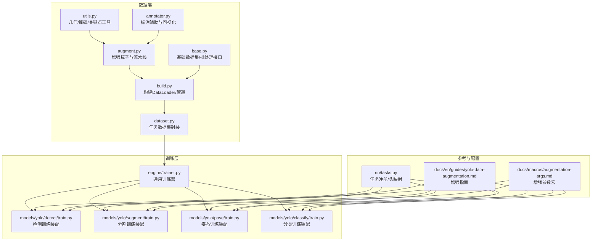
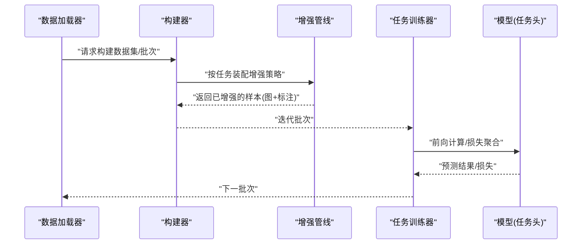
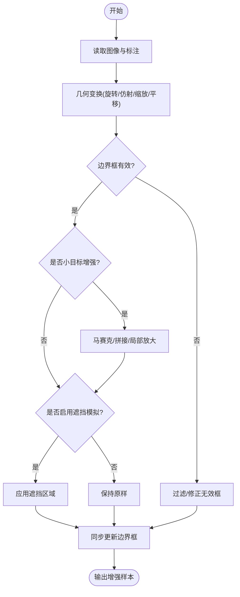
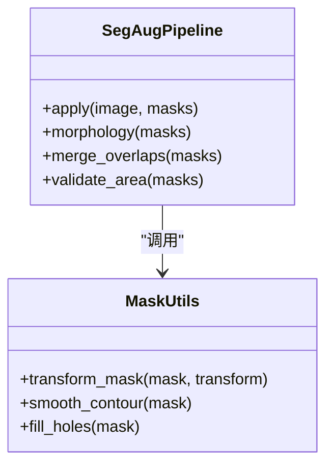
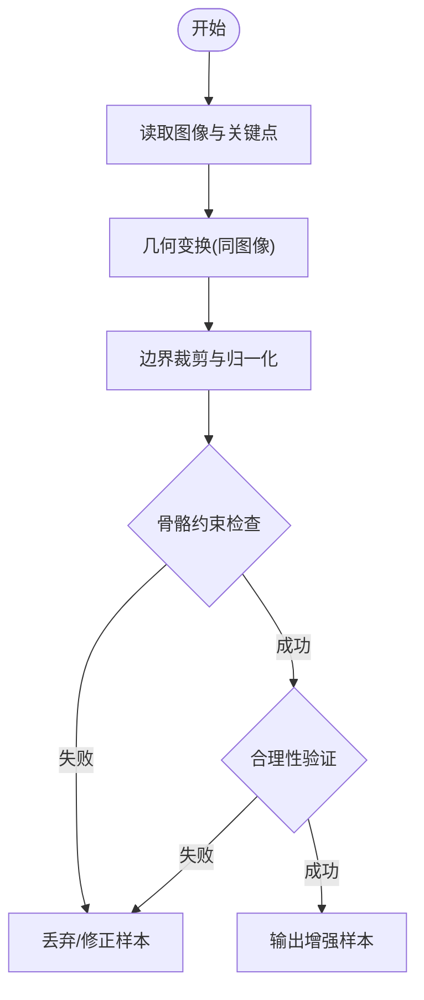
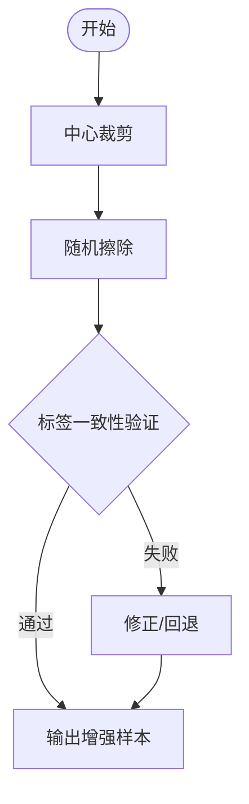
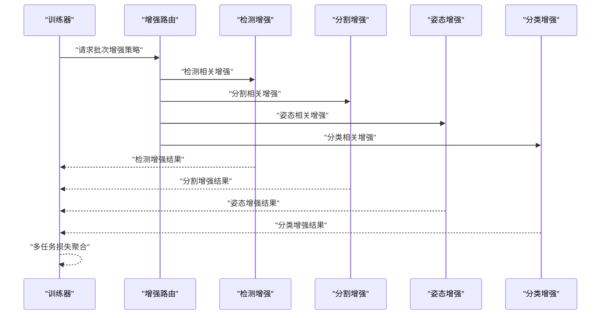
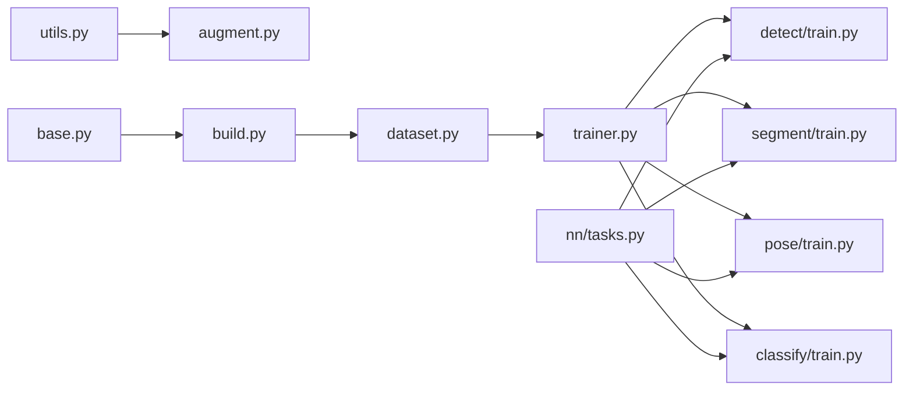

# 任务专用增强

<cite>
**本文引用的文件**
- [ultralytics/data/augment.py](file://ultralytics/data/augment.py)
- [ultralytics/data/base.py](file://ultralytics/data/base.py)
- [ultralytics/data/build.py](file://ultralytics/data/build.py)
- [ultralytics/data/dataset.py](file://ultralytics/data/dataset.py)
- [ultralytics/data/annotator.py](file://ultralytics/data/annotator.py)
- [ultralytics/data/utils.py](file://ultralytics/data/utils.py)
- [ultralytics/models/yolo/detect/train.py](file://ultralytics/models/yolo/detect/train.py)
- [ultralytics/models/yolo/segment/train.py](file://ultralytics/models/yolo/segment/train.py)
- [ultralytics/models/yolo/pose/train.py](file://ultralytics/models/yolo/pose/train.py)
- [ultralytics/models/yolo/classify/train.py](file://ultralytics/models/yolo/classify/train.py)
- [ultralytics/engine/trainer.py](file://ultralytics/engine/trainer.py)
- [ultralytics/nn/tasks.py](file://ultralytics/nn/tasks.py)
- [docs/en/guides/yolo-data-augmentation.md](file://docs/en/guides/yolo-data-augmentation.md)
- [docs/macros/augmentation-args.md](file://docs/macros/augmentation-args.md)
</cite>

## 目录
1. [简介](#简介)
2. [项目结构](#项目结构)
3. [核心组件](#核心组件)
4. [架构总览](#架构总览)
5. [详细组件分析](#详细组件分析)
6. [依赖分析](#依赖分析)
7. [性能考量](#性能考量)
8. [故障排查指南](#故障排查指南)
9. [结论](#结论)
10. [附录](#附录)

## 简介
本技术文档聚焦于YOLO-Master中面向不同任务的“专用数据增强”能力，覆盖目标检测、实例分割、姿态估计与分类四大任务。文档从系统架构、关键实现路径、数据流与控制流出发，解释：
- 目标检测的边界框约束几何变换、小目标增强、遮挡模拟等策略；
- 实例分割的掩码同步变换、轮廓保持操作与像素级标注一致性保证；
- 姿态估计的关键点坐标变换、骨骼结构约束与人体姿态合理性验证；
- 分类任务的中心裁剪、随机擦除与标签一致性；
- 多任务学习中的增强协调机制与冲突解决策略；
- 典型场景（医疗影像、卫星图像、工业检测）的定制化增强方案建议；
- 实验设计与基准测试方法，帮助读者复现并对比不同增强组合的效果。

## 项目结构
本项目将数据加载与增强集中在 data 模块，训练器在各任务模型目录下进行装配与调度，文档与宏定义提供参数说明与使用指引。

图表来源
- [ultralytics/data/augment.py](file://ultralytics/data/augment.py)
- [ultralytics/data/base.py](file://ultralytics/data/base.py)
- [ultralytics/data/build.py](file://ultralytics/data/build.py)
- [ultralytics/data/dataset.py](file://ultralytics/data/dataset.py)
- [ultralytics/data/utils.py](file://ultralytics/data/utils.py)
- [ultralytics/data/annotator.py](file://ultralytics/data/annotator.py)
- [ultralytics/engine/trainer.py](file://ultralytics/engine/trainer.py)
- [ultralytics/models/yolo/detect/train.py](file://ultralytics/models/yolo/detect/train.py)
- [ultralytics/models/yolo/segment/train.py](file://ultralytics/models/yolo/segment/train.py)
- [ultralytics/models/yolo/pose/train.py](file://ultralytics/models/yolo/pose/train.py)
- [ultralytics/models/yolo/classify/train.py](file://ultralytics/models/yolo/classify/train.py)
- [ultralytics/nn/tasks.py](file://ultralytics/nn/tasks.py)
- [docs/en/guides/yolo-data-augmentation.md](file://docs/en/guides/yolo-data-augmentation.md)
- [docs/macros/augmentation-args.md](file://docs/macros/augmentation-args.md)

章节来源
- [ultralytics/data/augment.py](file://ultralytics/data/augment.py)
- [ultralytics/data/build.py](file://ultralytics/data/build.py)
- [ultralytics/engine/trainer.py](file://ultralytics/engine/trainer.py)
- [docs/en/guides/yolo-data-augmentation.md](file://docs/en/guides/yolo-data-augmentation.md)
- [docs/macros/augmentation-args.md](file://docs/macros/augmentation-args.md)

## 核心组件
- 增强管线与算子
  - 统一在增强模块中定义各类几何、颜色、合成类算子，并提供按任务筛选与组合的能力。
  - 支持对图像、边界框、掩码、关键点等多模态标注进行同步变换，确保标注一致性。
- 数据集与构建器
  - 基础数据集接口负责样本读取、元信息解析与批组装；构建器根据任务类型装配相应增强流水线。
- 训练器与任务装配
  - 通用训练器驱动训练循环；各任务训练脚本在初始化阶段注入任务特定的增强策略与后处理逻辑。
- 工具与标注辅助
  - 几何与掩码工具用于坐标/掩码/关键点变换与有效性校验；标注辅助用于可视化与调试。

章节来源
- [ultralytics/data/augment.py](file://ultralytics/data/augment.py)
- [ultralytics/data/base.py](file://ultralytics/data/base.py)
- [ultralytics/data/build.py](file://ultralytics/data/build.py)
- [ultralytics/data/dataset.py](file://ultralytics/data/dataset.py)
- [ultralytics/data/utils.py](file://ultralytics/data/utils.py)
- [ultralytics/data/annotator.py](file://ultralytics/data/annotator.py)
- [ultralytics/engine/trainer.py](file://ultralytics/engine/trainer.py)

## 架构总览
下图展示从数据加载到任务训练的端到端流程，强调增强管线在不同任务中的差异化装配与执行顺序。

图表来源
- [ultralytics/data/build.py](file://ultralytics/data/build.py)
- [ultralytics/data/augment.py](file://ultralytics/data/augment.py)
- [ultralytics/engine/trainer.py](file://ultralytics/engine/trainer.py)
- [ultralytics/models/yolo/detect/train.py](file://ultralytics/models/yolo/detect/train.py)
- [ultralytics/models/yolo/segment/train.py](file://ultralytics/models/yolo/segment/train.py)
- [ultralytics/models/yolo/pose/train.py](file://ultralytics/models/yolo/pose/train.py)
- [ultralytics/models/yolo/classify/train.py](file://ultralytics/models/yolo/classify/train.py)

## 详细组件分析

### 目标检测：边界框约束几何变换、小目标增强、遮挡模拟
- 边界框约束的几何变换
  - 旋转、仿射、缩放、平移等操作需严格限制边界框范围，避免越界或退化；对极小/极大比例变化进行阈值控制。
  - 对长宽比异常、面积过小或过大的框进行过滤或重采样，保证训练稳定性。
- 小目标增强
  - 通过马赛克/拼接、尺度抖动、局部放大等方式提升小目标可见性；结合自适应裁剪与重叠区域保留策略。
- 遮挡模拟
  - 引入随机遮挡块、模糊区域或背景纹理替换，提高模型对部分遮挡的鲁棒性。
- 标注一致性
  - 所有几何变换必须同步更新边界框坐标与类别标签，确保输入与标注严格对齐。

图表来源
- [ultralytics/data/augment.py](file://ultralytics/data/augment.py)
- [ultralytics/data/utils.py](file://ultralytics/data/utils.py)
- [ultralytics/models/yolo/detect/train.py](file://ultralytics/models/yolo/detect/train.py)

章节来源
- [ultralytics/data/augment.py](file://ultralytics/data/augment.py)
- [ultralytics/data/utils.py](file://ultralytics/data/utils.py)
- [ultralytics/models/yolo/detect/train.py](file://ultralytics/models/yolo/detect/train.py)

### 实例分割：掩码同步变换、轮廓保持、像素级标注一致性
- 掩码同步变换
  - 对掩码执行与图像相同的几何变换，确保像素级标注与图像空间一致。
- 轮廓保持的几何操作
  - 对掩码进行形态学平滑、孔洞填充与边缘细化，减少离散化误差导致的轮廓失真。
- 像素级标注一致性保证
  - 对重叠掩码进行优先级或权重融合，避免同一像素被重复分配；对超小掩码进行面积阈值过滤。
- 训练适配
  - 在分割头前对掩码进行归一化与通道扩展，配合损失函数进行像素级优化。

图表来源
- [ultralytics/data/augment.py](file://ultralytics/data/augment.py)
- [ultralytics/data/utils.py](file://ultralytics/data/utils.py)
- [ultralytics/models/yolo/segment/train.py](file://ultralytics/models/yolo/segment/train.py)

章节来源
- [ultralytics/data/augment.py](file://ultralytics/data/augment.py)
- [ultralytics/data/utils.py](file://ultralytics/data/utils.py)
- [ultralytics/models/yolo/segment/train.py](file://ultralytics/models/yolo/segment/train.py)

### 姿态估计：关键点坐标变换、骨骼结构约束、人体姿态合理性验证
- 关键点坐标变换
  - 对关键点执行与图像一致的几何变换，并进行边界裁剪与坐标归一化。
- 骨骼结构约束
  - 依据预定义骨骼连接关系检查关节相对位置，剔除不合理姿态（如关节反转、跨度过大）。
- 人体姿态合理性验证
  - 基于人体先验（如对称性、常见角度范围）进行二次校验，必要时回退或修正关键点。
- 训练适配
  - 关键点热力图或向量表示与图像同步生成，配合姿态损失进行优化。

图表来源
- [ultralytics/data/augment.py](file://ultralytics/data/augment.py)
- [ultralytics/data/utils.py](file://ultralytics/data/utils.py)
- [ultralytics/models/yolo/pose/train.py](file://ultralytics/models/yolo/pose/train.py)

章节来源
- [ultralytics/data/augment.py](file://ultralytics/data/augment.py)
- [ultralytics/data/utils.py](file://ultralytics/data/utils.py)
- [ultralytics/models/yolo/pose/train.py](file://ultralytics/models/yolo/pose/train.py)

### 分类：中心裁剪、随机擦除、标签一致性
- 中心裁剪
  - 以图像中心为基准进行固定比例裁剪，保持主体完整性，适用于主体居中分布的数据集。
- 随机擦除
  - 在图像内随机选择区域进行擦除或噪声注入，提升模型对缺失信息的鲁棒性。
- 标签一致性
  - 确保裁剪与擦除不改变类别语义；对多标签或多任务场景，保持标签集合不变。
- 训练适配
  - 分类头直接接收增强后的图像特征，配合交叉熵或加权损失进行优化。

图表来源
- [ultralytics/data/augment.py](file://ultralytics/data/augment.py)
- [ultralytics/models/yolo/classify/train.py](file://ultralytics/models/yolo/classify/train.py)

章节来源
- [ultralytics/data/augment.py](file://ultralytics/data/augment.py)
- [ultralytics/models/yolo/classify/train.py](file://ultralytics/models/yolo/classify/train.py)

### 多任务学习：增强协调机制与冲突解决策略
- 增强协调
  - 在多任务共享数据流中，按任务需求动态选择增强算子；对共享增强（如颜色抖动）与任务专属增强（如掩码同步）进行分层管理。
- 冲突解决
  - 当不同任务的增强策略产生冲突（例如某增强破坏掩码连续性），采用任务优先级或条件开关进行仲裁；必要时引入可学习的增强路由。
- 训练编排
  - 训练器在批次级别协调多任务增强，确保每个任务获得与其头匹配的输入与标注。

图表来源
- [ultralytics/engine/trainer.py](file://ultralytics/engine/trainer.py)
- [ultralytics/data/augment.py](file://ultralytics/data/augment.py)
- [ultralytics/models/yolo/detect/train.py](file://ultralytics/models/yolo/detect/train.py)
- [ultralytics/models/yolo/segment/train.py](file://ultralytics/models/yolo/segment/train.py)
- [ultralytics/models/yolo/pose/train.py](file://ultralytics/models/yolo/pose/train.py)
- [ultralytics/models/yolo/classify/train.py](file://ultralytics/models/yolo/classify/train.py)

章节来源
- [ultralytics/engine/trainer.py](file://ultralytics/engine/trainer.py)
- [ultralytics/data/augment.py](file://ultralytics/data/augment.py)
- [ultralytics/models/yolo/detect/train.py](file://ultralytics/models/yolo/detect/train.py)
- [ultralytics/models/yolo/segment/train.py](file://ultralytics/models/yolo/segment/train.py)
- [ultralytics/models/yolo/pose/train.py](file://ultralytics/models/yolo/pose/train.py)
- [ultralytics/models/yolo/classify/train.py](file://ultralytics/models/yolo/classify/train.py)

## 依赖分析
- 组件耦合
  - 增强模块依赖几何与掩码工具；数据集构建器依赖增强模块；训练器依赖数据集与任务训练脚本。
- 外部依赖
  - 图像处理库（如OpenCV）、数值计算库（如NumPy/Torch）用于高效实现几何变换与掩码操作。
- 潜在循环依赖
  - 通过分层设计（data→engine→models）避免循环；任务头注册在nn.tasks中，供训练装配引用。

图表来源
- [ultralytics/data/utils.py](file://ultralytics/data/utils.py)
- [ultralytics/data/augment.py](file://ultralytics/data/augment.py)
- [ultralytics/data/base.py](file://ultralytics/data/base.py)
- [ultralytics/data/build.py](file://ultralytics/data/build.py)
- [ultralytics/data/dataset.py](file://ultralytics/data/dataset.py)
- [ultralytics/engine/trainer.py](file://ultralytics/engine/trainer.py)
- [ultralytics/models/yolo/detect/train.py](file://ultralytics/models/yolo/detect/train.py)
- [ultralytics/models/yolo/segment/train.py](file://ultralytics/models/yolo/segment/train.py)
- [ultralytics/models/yolo/pose/train.py](file://ultralytics/models/yolo/pose/train.py)
- [ultralytics/models/yolo/classify/train.py](file://ultralytics/models/yolo/classify/train.py)
- [ultralytics/nn/tasks.py](file://ultralytics/nn/tasks.py)

章节来源
- [ultralytics/data/augment.py](file://ultralytics/data/augment.py)
- [ultralytics/data/build.py](file://ultralytics/data/build.py)
- [ultralytics/engine/trainer.py](file://ultralytics/engine/trainer.py)
- [ultralytics/nn/tasks.py](file://ultralytics/nn/tasks.py)

## 性能考量
- 并行与I/O
  - 使用多线程/多进程数据加载与缓存策略，降低磁盘I/O瓶颈；对大规模数据集采用分片与懒加载。
- 内存与显存
  - 掩码与关键点数据占用较大，应进行按需加载与压缩存储；批大小与分辨率需平衡显存占用。
- 算子效率
  - 优先使用向量化与GPU加速的几何变换；对形态学操作进行批处理与内核复用。
- 训练稳定性
  - 对小目标与遮挡增强进行强度控制，避免过度扰动导致梯度不稳定；引入早停与学习率调度。

[本节为通用指导，无需特定文件来源]

## 故障排查指南
- 标注不一致
  - 现象：训练时损失震荡或指标异常。
  - 排查：检查增强管线对边界框/掩码/关键点的同步更新逻辑；确认几何变换参数与坐标变换矩阵一致。
- 掩码失真
  - 现象：分割IoU下降。
  - 排查：验证掩码形态学操作与重叠合并策略；调整面积阈值与平滑强度。
- 关键点不合理
  - 现象：姿态损失发散。
  - 排查：检查骨骼约束与合理性验证规则；必要时放宽阈值或增加正则项。
- 多任务冲突
  - 现象：某一任务指标显著下降。
  - 排查：审查增强路由与任务优先级；尝试关闭冲突增强或引入可学习路由。

章节来源
- [ultralytics/data/augment.py](file://ultralytics/data/augment.py)
- [ultralytics/data/utils.py](file://ultralytics/data/utils.py)
- [ultralytics/engine/trainer.py](file://ultralytics/engine/trainer.py)

## 结论
YOLO-Master的任务专用增强体系通过统一的增强管线与任务适配的训练装配，实现了检测、分割、姿态与分类四类任务的精细化数据增强。其核心在于：
- 严格的标注一致性保障；
- 针对任务特性的增强策略与约束；
- 多任务下的增强协调与冲突解决；
- 可扩展的工具与配置体系，便于场景定制与实验对比。

[本节为总结，无需特定文件来源]

## 附录

### 实验设计与基准测试方法
- 基线设置
  - 使用默认增强作为基线；记录mAP、mIoU、PCKh、Top-1准确率等指标。
- 消融实验
  - 逐项启用/禁用增强（如小目标增强、遮挡模拟、掩码同步、关键点约束），观察指标变化。
- 场景定制
  - 医疗影像：低对比度增强、组织先验约束；
  - 卫星图像：多尺度与方向增强、地物先验；
  - 工业检测：缺陷模拟、纹理替换、高精度掩码保持。
- 报告与复现
  - 使用统一配置文件与随机种子；记录增强参数与训练日志，便于复现实验。

章节来源
- [docs/en/guides/yolo-data-augmentation.md](file://docs/en/guides/yolo-data-augmentation.md)
- [docs/macros/augmentation-args.md](file://docs/macros/augmentation-args.md)