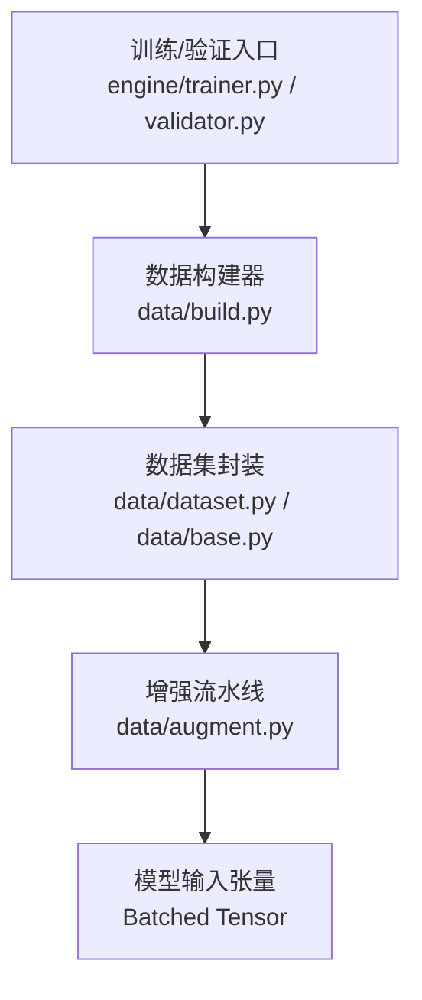
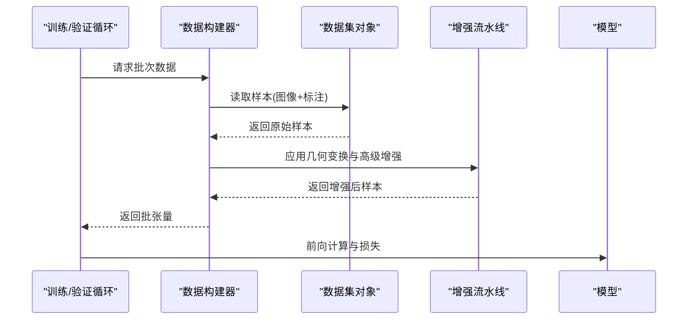
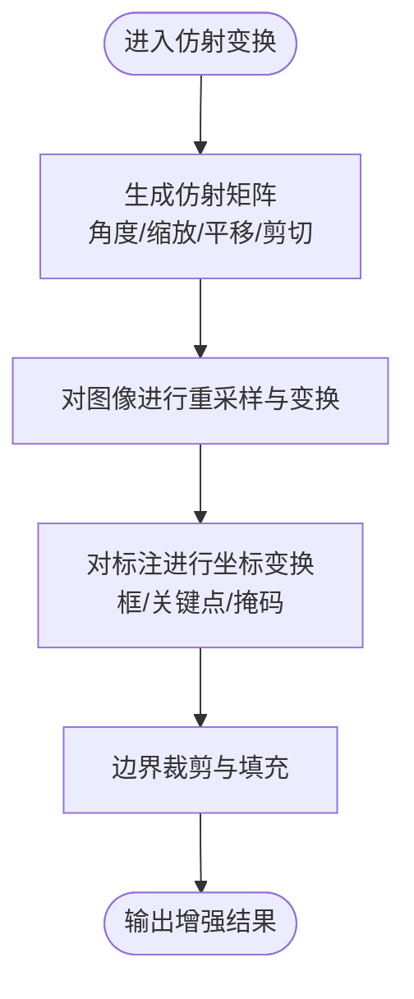
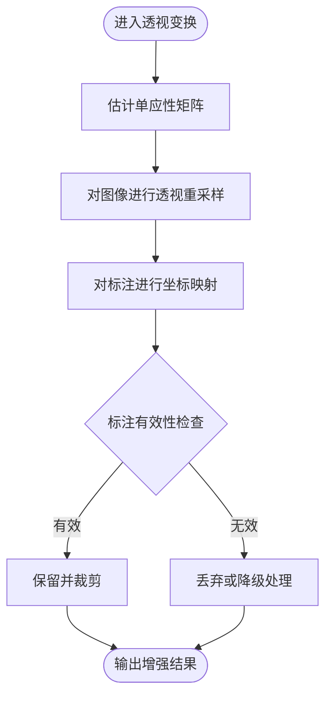
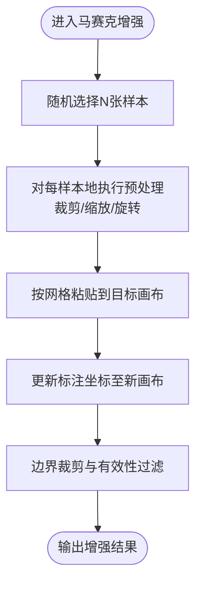
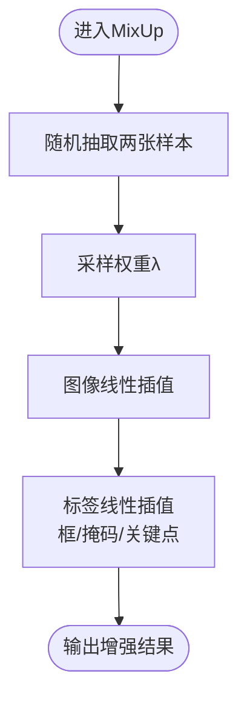
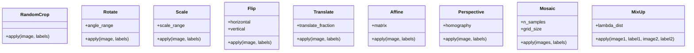
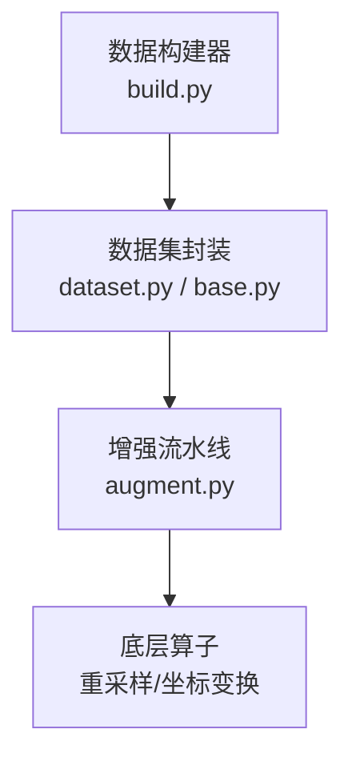

# 几何变换增强

<cite>
**本文引用的文件**
- [augment.py](file://ultralytics/data/augment.py)
- [base.py](file://ultralytics/data/base.py)
- [dataset.py](file://ultralytics/data/dataset.py)
- [build.py](file://ultralytics/data/build.py)
- [yolo-data-augmentation.md](file://docs/en/guides/yolo-data-augmentation.md)
</cite>

## 目录
1. [简介](#简介)
2. [项目结构](#项目结构)
3. [核心组件](#核心组件)
4. [架构总览](#架构总览)
5. [详细组件分析](#详细组件分析)
6. [依赖关系分析](#依赖关系分析)
7. [性能考量](#性能考量)
8. [故障排查指南](#故障排查指南)
9. [结论](#结论)
10. [附录](#附录)

## 简介
本技术文档聚焦于YOLO-Master的几何变换增强能力，系统梳理随机裁剪、旋转、缩放、翻转、平移等基础几何变换，深入解析仿射变换（Affine）的参数控制与实现原理，阐述透视变换（Perspective）在目标检测中的适用场景，解释马赛克增强（Mosaic）的算法流程与数据融合机制，并说明混合增强（MixUp）的数学原理及其对梯度传播的影响。文档同时提供参数配置示例、效果对比思路、性能影响分析与针对不同任务（检测、分割、姿态估计）的策略建议，帮助读者在实际工程中高效使用与调优。

## 项目结构
几何变换增强主要位于数据处理管线中，关键位置如下：
- 增强算子定义与组合：ultralytics/data/augment.py
- 数据集基类与加载流程：ultralytics/data/base.py、ultralytics/data/dataset.py
- 构建器与流水线装配：ultralytics/data/build.py
- 官方增强文档与用法参考：docs/en/guides/yolo-data-augmentation.md

图表来源
- [build.py](file://ultralytics/data/build.py)
- [dataset.py](file://ultralytics/data/dataset.py)
- [base.py](file://ultralytics/data/base.py)
- [augment.py](file://ultralytics/data/augment.py)

章节来源
- [augment.py](file://ultralytics/data/augment.py)
- [base.py](file://ultralytics/data/base.py)
- [dataset.py](file://ultralytics/data/dataset.py)
- [build.py](file://ultralytics/data/build.py)

## 核心组件
- 基础几何变换
  - 随机裁剪（RandomCrop）：在图像内随机选择子区域进行裁剪，常用于提升小目标鲁棒性与定位精度。
  - 旋转（Rotate）：围绕中心或指定点旋转图像，配合边界处理策略保持标注一致性。
  - 缩放（Scale）：按比例放大或缩小图像，改变目标尺度分布，有助于多尺度学习。
  - 翻转（Flip）：水平/垂直翻转，增加对称性不变性，提高泛化能力。
  - 平移（Translate）：沿X/Y方向平移图像，模拟相机位移，增强位置鲁棒性。
- 复合几何变换
  - 仿射变换（Affine）：由旋转、缩放、平移、剪切等线性变换组合而成，通过矩阵形式统一描述，便于批量计算与可微优化。
  - 透视变换（Perspective）：引入非线性的投影变化，用于模拟相机视角变化与平面外运动，适用于复杂场景下的检测与分割。
- 高级增强
  - 马赛克增强（Mosaic）：将多张样本拼接成一张大图，融合上下文信息，显著提升小目标召回与检测稳定性。
  - 混合增强（MixUp）：按权重线性插值两张样本的图像与标签，平滑决策边界，改善泛化与校准。

章节来源
- [augment.py](file://ultralytics/data/augment.py)
- [yolo-data-augmentation.md](file://docs/en/guides/yolo-data-augmentation.md)

## 架构总览
下图展示了从数据加载到增强的端到端流程，以及各组件之间的调用关系。

图表来源
- [build.py](file://ultralytics/data/build.py)
- [dataset.py](file://ultralytics/data/dataset.py)
- [augment.py](file://ultralytics/data/augment.py)

## 详细组件分析

### 仿射变换（Affine）
- 实现原理
  - 仿射变换由一个2x3或3x3齐次矩阵表示，包含旋转、缩放、平移与剪切等线性操作。
  - 在批量处理中，通常以张量形式对整批图像与标注同时进行坐标映射，保证效率与一致性。
  - 对于标注框、关键点、掩码等，需分别进行坐标变换与边界裁剪，确保与图像空间一致。
- 参数控制
  - 角度范围：控制旋转幅度，避免过度旋转导致目标不可见。
  - 缩放范围：控制缩放比例，兼顾多尺度覆盖与分辨率限制。
  - 平移范围：控制相对图像的偏移比例，防止目标移出画面。
  - 剪切强度：控制形变程度，适度引入非线性外观变化。
  - 填充策略：对超出边界的像素采用常数、镜像或边缘填充，减少伪影。
- 复杂度与性能
  - 时间复杂度与图像尺寸和批大小线性相关；GPU并行下吞吐较高。
  - 内存占用受输出分辨率与批大小影响，建议结合动态形状与缓存策略。
- 适用场景
  - 通用目标检测、分割、姿态估计的强鲁棒性增强。
  - 需要严格保持几何一致性的任务（如关键点、实例掩码）。

图表来源
- [augment.py](file://ultralytics/data/augment.py)

章节来源
- [augment.py](file://ultralytics/data/augment.py)

### 透视变换（Perspective）
- 应用场景
  - 模拟相机倾斜、俯仰与平面外运动，增强对视角变化的鲁棒性。
  - 适用于复杂背景、道路场景、航拍等具有明显透视效应的任务。
- 实现要点
  - 通过四个角点的映射建立单应性矩阵，对图像与标注进行重采样与坐标变换。
  - 注意标注的可见性判断与裁剪，避免产生无效或越界标注。
- 风险与权衡
  - 过度透视可能导致目标严重变形，降低检测与分割质量。
  - 建议与仿射变换组合使用，控制整体形变幅度。

图表来源
- [augment.py](file://ultralytics/data/augment.py)

章节来源
- [augment.py](file://ultralytics/data/augment.py)

### 马赛克增强（Mosaic）
- 算法流程
  - 随机选取多张样本（通常为4张），按网格布局拼接为一张大图。
  - 对每张子图进行随机裁剪、缩放、旋转等预处理，再拼接到目标画布。
  - 更新所有标注的坐标至新画布空间，并进行边界裁剪与去重。
- 数据融合机制
  - 通过拼接引入跨样本上下文，丰富背景多样性与小目标密度。
  - 标注合并时需考虑重叠与重复检测，避免误报。
- 适用任务
  - 目标检测：显著提升小目标召回与整体mAP。
  - 实例分割：需注意掩码拼接与边界对齐。
  - 姿态估计：关键点坐标需同步变换与裁剪。

图表来源
- [augment.py](file://ultralytics/data/augment.py)

章节来源
- [augment.py](file://ultralytics/data/augment.py)

### 混合增强（MixUp）
- 数学原理
  - 对两张样本的图像与标签按权重λ进行线性插值：I_mix = λ·I1 + (1-λ)·I2，Y_mix = λ·Y1 + (1-λ)·Y2。
  - 标签插值方式因任务而异：检测常用框与类别概率加权，分割用掩码加权，姿态估计用关键点坐标加权。
- 梯度传播特性
  - 由于标签连续化，损失函数对预测的梯度更平滑，有助于缓解过拟合与数值不稳定。
  - 可能降低分类置信度峰值，但提升校准与泛化能力。
- 实践建议
  - 设置合理的λ分布（如Beta分布），避免极端权重。
  - 与几何变换组合使用时，先进行几何变换再进行MixUp，保证空间一致性。

图表来源
- [augment.py](file://ultralytics/data/augment.py)

章节来源
- [augment.py](file://ultralytics/data/augment.py)

### 基础几何变换（RandomCrop/Rotate/Scale/Flip/Translate）
- 随机裁剪（RandomCrop）
  - 随机选择子区域，调整标注坐标并裁剪，适合提升小目标定位能力。
- 旋转（Rotate）
  - 围绕中心或指定点旋转，配合填充策略保持边界完整性。
- 缩放（Scale）
  - 按比例缩放图像与标注，增强多尺度鲁棒性。
- 翻转（Flip）
  - 水平/垂直翻转，简单而有效的数据扩充手段。
- 平移（Translate）
  - 沿X/Y方向平移，模拟相机位移，提升位置鲁棒性。

图表来源
- [augment.py](file://ultralytics/data/augment.py)

章节来源
- [augment.py](file://ultralytics/data/augment.py)

## 依赖关系分析
- 组件耦合
  - 增强流水线（augment.py）依赖数据集对象（dataset.py/base.py）提供的图像与标注格式。
  - 构建器（build.py）负责组装数据管道与增强策略，协调批处理与设备放置。
- 外部依赖
  - 图像处理库（如OpenCV、PIL）与张量运算库（PyTorch）用于重采样与坐标变换。
- 潜在循环依赖
  - 增强模块应避免反向引用数据集构建逻辑，保持单向依赖。

图表来源
- [build.py](file://ultralytics/data/build.py)
- [dataset.py](file://ultralytics/data/dataset.py)
- [base.py](file://ultralytics/data/base.py)
- [augment.py](file://ultralytics/data/augment.py)

章节来源
- [build.py](file://ultralytics/data/build.py)
- [dataset.py](file://ultralytics/data/dataset.py)
- [base.py](file://ultralytics/data/base.py)
- [augment.py](file://ultralytics/data/augment.py)

## 性能考量
- 计算开销
  - 仿射与透视变换涉及重采样，GPU并行下吞吐较高，但高分辨率与大批次会显著增加显存占用。
  - 马赛克增强拼接多张样本，内存与IO压力较大，建议合理设置batch size与线程数。
- I/O瓶颈
  - 大量随机读取与拼接会增加磁盘I/O，建议使用缓存与预取策略。
- 数值稳定性
  - 坐标变换与边界裁剪需保证数值稳定，避免NaN/Inf传播。
- 调优建议
  - 根据任务与硬件资源调整增强强度与频率，优先启用收益高且开销低的变换（如翻转、随机裁剪）。
  - 对Mosaic与MixUp进行消融实验，评估其对mAP与训练时长的影响。

[本节为通用指导，不直接分析具体文件]

## 故障排查指南
- 标注越界或缺失
  - 检查仿射/透视变换后的边界裁剪逻辑，确保标注有效性过滤正确。
- 掩码错位或不完整
  - 确认掩码与图像同空间变换，边界处填充策略一致。
- 关键点漂移
  - 姿态估计的关键点需与图像同步变换，注意人体遮挡与可见性标记。
- 训练不稳定
  - 调整MixUp权重分布与增强强度，避免过度平滑导致收敛缓慢。
- 性能退化
  - 降低高分辨率增强频率，或使用渐进式分辨率训练。

章节来源
- [augment.py](file://ultralytics/data/augment.py)

## 结论
YOLO-Master的几何变换增强体系覆盖了从基础几何到高级融合的全谱系能力。仿射与透视变换提供强大的几何建模，马赛克与MixUp则在数据层面引入丰富的上下文与平滑性。实际应用中，应根据任务特性与资源约束选择合适的增强组合，并通过消融实验与可视化对比持续优化。

[本节为总结性内容，不直接分析具体文件]

## 附录

### 参数配置示例（路径指引）
- 仿射变换参数
  - 角度范围、缩放范围、平移比例、剪切强度、填充策略
  - 参考路径：[augment.py](file://ultralytics/data/augment.py)
- 透视变换参数
  - 单应性矩阵估计方法、角点扰动范围、有效性阈值
  - 参考路径：[augment.py](file://ultralytics/data/augment.py)
- 马赛克增强参数
  - 样本数量、网格尺寸、子图预处理强度
  - 参考路径：[augment.py](file://ultralytics/data/augment.py)
- 混合增强参数
  - 权重分布（如Beta分布参数）、插值顺序
  - 参考路径：[augment.py](file://ultralytics/data/augment.py)

章节来源
- [augment.py](file://ultralytics/data/augment.py)

### 效果对比图（制作建议）
- 对比维度
  - 原图 vs 仿射变换 vs 透视变换 vs 马赛克 vs MixUp
- 指标建议
  - 检测：mAP@0.5、小目标mAP
  - 分割：mIoU、边界F1
  - 姿态估计：AP、关节点误差
- 可视化要点
  - 标注框/掩码/关键点叠加显示，突出变换前后差异

[本节为概念性指导，不直接分析具体文件]

### 不同任务的几何变换策略建议
- 目标检测
  - 推荐：随机裁剪、仿射变换、马赛克增强
  - 谨慎：透视变换（避免过度形变）
- 实例分割
  - 推荐：仿射变换、马赛克增强（注意掩码对齐）
  - 谨慎：透视变换（掩码边界易失真）
- 姿态估计
  - 推荐：仿射变换、随机裁剪、轻微透视
  - 谨慎：大角度旋转与强透视（关键点可见性受影响）

[本节为概念性指导，不直接分析具体文件]