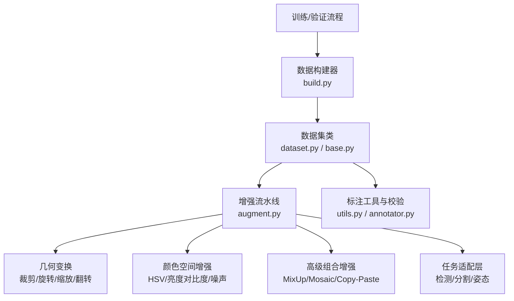
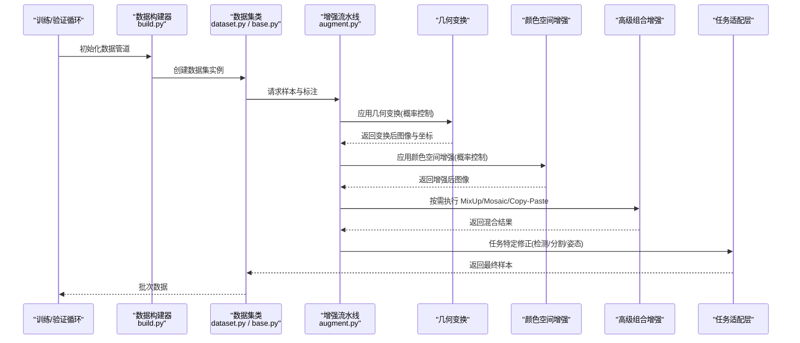
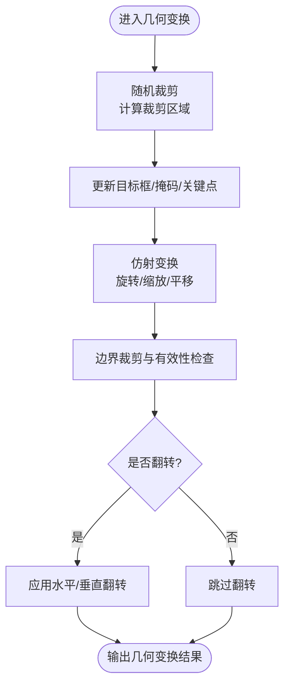
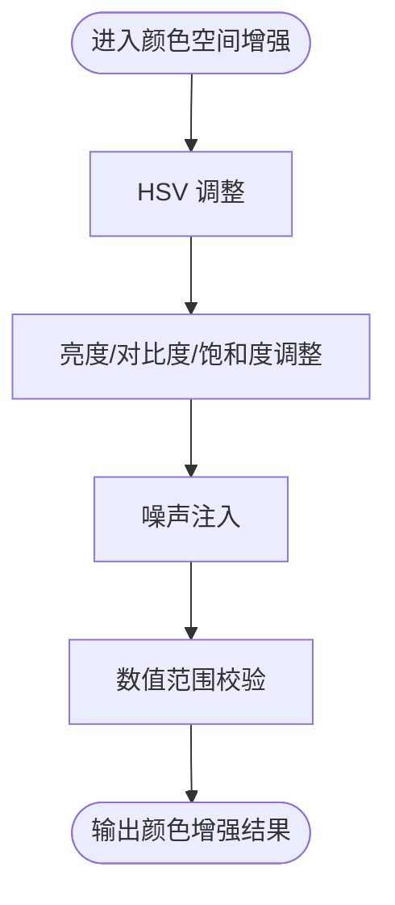
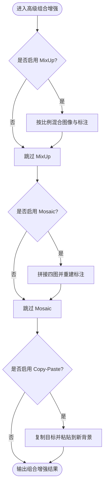
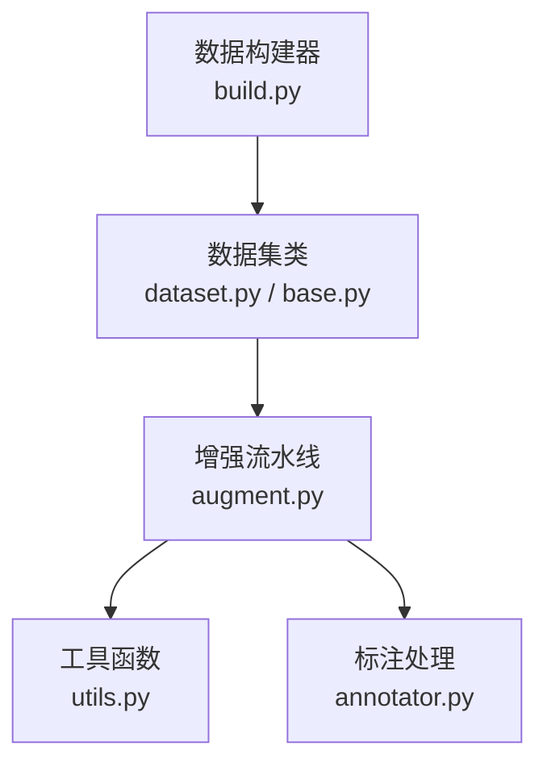

# 数据增强

<cite>
**本文引用的文件**
- [ultralytics/data/augment.py](file://ultralytics/data/augment.py)
- [ultralytics/data/dataset.py](file://ultralytics/data/dataset.py)
- [ultralytics/data/build.py](file://ultralytics/data/build.py)
- [ultralytics/data/base.py](file://ultralytics/data/base.py)
- [ultralytics/data/utils.py](file://ultralytics/data/utils.py)
- [ultralytics/data/annotator.py](file://ultralytics/data/annotator.py)
- [docs/en/guides/yolo-data-augmentation.md](file://docs/en/guides/yolo-data-augmentation.md)
- [docs/macros/augmentation-args.md](file://docs/macros/augmentation-args.md)
</cite>

## 目录
1. [简介](#简介)
2. [项目结构](#项目结构)
3. [核心组件](#核心组件)
4. [架构总览](#架构总览)
5. [详细组件分析](#详细组件分析)
6. [依赖关系分析](#依赖关系分析)
7. [性能考量](#性能考量)
8. [故障排查指南](#故障排查指南)
9. [结论](#结论)
10. [附录](#附录)

## 简介
本技术文档聚焦于 YOLO-Master 的数据增强系统，系统性阐述几何变换、颜色空间增强与高级组合增强（如 MixUp、Mosaic、Copy-Paste）的实现思路与使用方式；解释增强的组合策略与概率控制机制；提供自定义增强算子的开发方法与集成路径；并针对检测、分割、姿态估计等任务给出专用增强策略、参数调优指南、效果评估方法以及最佳实践建议。

## 项目结构
YOLO-Master 的数据增强相关代码主要位于 ultralytics/data 目录下，其中：
- augment.py：集中实现各类图像与标注的增强算子与流水线编排逻辑
- dataset.py / base.py / build.py：数据集加载、批构建与增强流水线的装配入口
- utils.py / annotator.py：辅助工具与标注处理支持
- docs 与 macros：官方增强文档与宏定义，覆盖参数说明与使用示例

图表来源
- [ultralytics/data/build.py](file://ultralytics/data/build.py)
- [ultralytics/data/dataset.py](file://ultralytics/data/dataset.py)
- [ultralytics/data/base.py](file://ultralytics/data/base.py)
- [ultralytics/data/augment.py](file://ultralytics/data/augment.py)
- [ultralytics/data/utils.py](file://ultralytics/data/utils.py)
- [ultralytics/data/annotator.py](file://ultralytics/data/annotator.py)

章节来源
- [ultralytics/data/augment.py](file://ultralytics/data/augment.py)
- [ultralytics/data/dataset.py](file://ultralytics/data/dataset.py)
- [ultralytics/data/build.py](file://ultralytics/data/build.py)
- [ultralytics/data/base.py](file://ultralytics/data/base.py)
- [ultralytics/data/utils.py](file://ultralytics/data/utils.py)
- [ultralytics/data/annotator.py](file://ultralytics/data/annotator.py)
- [docs/en/guides/yolo-data-augmentation.md](file://docs/en/guides/yolo-data-augmentation.md)
- [docs/macros/augmentation-args.md](file://docs/macros/augmentation-args.md)

## 核心组件
- 增强流水线编排：负责按序调用几何、颜色、高级组合等增强模块，并对不同任务类型进行适配与边界条件处理
- 几何变换模块：随机裁剪、仿射变换（旋转/缩放/平移）、水平/垂直翻转等，配套坐标与掩码更新
- 颜色空间增强模块：HSV 调整、亮度/对比度/饱和度修改、噪声注入等
- 高级组合增强模块：MixUp、Mosaic、Copy-Paste 等，用于提升模型鲁棒性与泛化能力
- 任务适配层：根据检测、分割、姿态估计等不同任务的标注格式，对增强后的坐标、多边形、关键点等进行一致性维护
- 配置与宏：通过配置文件与宏定义暴露可调参数，便于统一管理与实验复现

章节来源
- [ultralytics/data/augment.py](file://ultralytics/data/augment.py)
- [docs/macros/augmentation-args.md](file://docs/macros/augmentation-args.md)

## 架构总览
下图展示了从数据构建到增强执行的整体流程，包括增强模块的选择、概率控制与任务适配。

图表来源
- [ultralytics/data/build.py](file://ultralytics/data/build.py)
- [ultralytics/data/dataset.py](file://ultralytics/data/dataset.py)
- [ultralytics/data/base.py](file://ultralytics/data/base.py)
- [ultralytics/data/augment.py](file://ultralytics/data/augment.py)

## 详细组件分析

### 几何变换增强
- 随机裁剪：在图像内随机选择区域进行裁剪，需同步更新目标框、掩码或关键点坐标
- 仿射变换：包含旋转、缩放、平移的组合，保持标注几何一致性
- 翻转：水平/垂直翻转，适用于对称场景与类别不变性假设
- 关键要点：所有几何操作必须严格维护标注坐标系的一致性，避免越界与退化

图表来源
- [ultralytics/data/augment.py](file://ultralytics/data/augment.py)

章节来源
- [ultralytics/data/augment.py](file://ultralytics/data/augment.py)

### 颜色空间增强
- HSV 调整：调节色调、饱和度、明度，模拟光照与色彩变化
- 亮度/对比度/饱和度：独立或联合调整，增强对不同曝光条件的鲁棒性
- 噪声添加：高斯噪声、椒盐噪声等，提升抗噪能力
- 注意事项：颜色增强通常不改变标注位置，但需注意数值范围与溢出处理

图表来源
- [ultralytics/data/augment.py](file://ultralytics/data/augment.py)

章节来源
- [ultralytics/data/augment.py](file://ultralytics/data/augment.py)

### 高级组合增强
- MixUp：将两张图像及其标注按比例线性混合，常用于分类与检测任务
- Mosaic：拼接四张图像为一张大图，丰富上下文与小目标分布
- Copy-Paste：将目标对象复制粘贴至新背景，增强小目标与遮挡鲁棒性
- 概率控制：通过配置参数控制各增强是否启用及强度，避免破坏标注质量

图表来源
- [ultralytics/data/augment.py](file://ultralytics/data/augment.py)

章节来源
- [ultralytics/data/augment.py](file://ultralytics/data/augment.py)

### 任务专用增强策略
- 检测任务：重点维护目标框完整性，避免过小或退化的框；Mosaic 对小目标有益
- 分割任务：掩码需与几何变换严格对齐，注意边界像素与空洞填充
- 姿态估计：关键点需随仿射变换一致更新，确保关节相对位置合理
- 通用原则：任何增强不得破坏标注语义一致性；必要时引入后处理修复

章节来源
- [ultralytics/data/augment.py](file://ultralytics/data/augment.py)
- [ultralytics/data/utils.py](file://ultralytics/data/utils.py)
- [ultralytics/data/annotator.py](file://ultralytics/data/annotator.py)

### 组合策略与概率控制
- 概率开关：每个增强可配置启用概率，避免过度增强导致标注失真
- 强度范围：通过上下限参数控制增强幅度，结合任务特性进行约束
- 顺序编排：几何→颜色→组合的顺序有助于保持标注一致性
- 可观测性：记录增强日志与统计信息，便于分析与回溯

章节来源
- [docs/macros/augmentation-args.md](file://docs/macros/augmentation-args.md)
- [docs/en/guides/yolo-data-augmentation.md](file://docs/en/guides/yolo-data-augmentation.md)

### 自定义增强算子开发与集成
- 接口约定：遵循统一的输入输出契约（图像与标注），保证与现有流水线兼容
- 注册机制：在增强工厂或配置中注册自定义算子，支持动态加载
- 测试验证：编写单元测试覆盖边界情况与数值稳定性
- 集成步骤：在增强流水线中插入自定义算子，并通过配置控制其概率与强度

章节来源
- [ultralytics/data/augment.py](file://ultralytics/data/augment.py)
- [docs/en/guides/yolo-data-augmentation.md](file://docs/en/guides/yolo-data-augmentation.md)

## 依赖关系分析
增强模块与数据集、工具库之间的依赖关系如下：

图表来源
- [ultralytics/data/augment.py](file://ultralytics/data/augment.py)
- [ultralytics/data/dataset.py](file://ultralytics/data/dataset.py)
- [ultralytics/data/base.py](file://ultralytics/data/base.py)
- [ultralytics/data/build.py](file://ultralytics/data/build.py)
- [ultralytics/data/utils.py](file://ultralytics/data/utils.py)
- [ultralytics/data/annotator.py](file://ultralytics/data/annotator.py)

章节来源
- [ultralytics/data/augment.py](file://ultralytics/data/augment.py)
- [ultralytics/data/dataset.py](file://ultralytics/data/dataset.py)
- [ultralytics/data/build.py](file://ultralytics/data/build.py)
- [ultralytics/data/base.py](file://ultralytics/data/base.py)
- [ultralytics/data/utils.py](file://ultralytics/data/utils.py)
- [ultralytics/data/annotator.py](file://ultralytics/data/annotator.py)

## 性能考量
- 并行与缓存：利用数据加载并行与磁盘缓存减少 IO 瓶颈
- 向量化与内存：尽量使用向量化操作与内存复用，降低拷贝开销
- 增强复杂度：高级组合增强（如 Mosaic）计算成本较高，应结合硬件资源与训练时长权衡
- 精度与稳定性：颜色与噪声增强可能影响数值稳定性，需关注梯度异常与 NaN 传播

[本节为通用指导，无需具体文件引用]

## 故障排查指南
- 标注不一致：检查几何变换后的坐标更新逻辑与边界裁剪是否正确
- 掩码断裂：分割任务中掩码边缘可能出现伪影，需检查插值与填充策略
- 关键点错位：姿态估计的关键点需严格跟随仿射变换，避免关节拓扑错误
- 增强过强：若出现性能下降，逐步关闭高级组合增强以定位问题
- 日志与可视化：开启增强日志与可视化输出，快速定位异常样本

章节来源
- [ultralytics/data/augment.py](file://ultralytics/data/augment.py)
- [ultralytics/data/utils.py](file://ultralytics/data/utils.py)
- [ultralytics/data/annotator.py](file://ultralytics/data/annotator.py)

## 结论
YOLO-Master 的数据增强系统通过模块化设计与任务适配层，提供了灵活且强大的增强能力。合理使用几何变换、颜色空间增强与高级组合增强，并结合概率控制与参数调优，可显著提升模型的鲁棒性与泛化能力。建议在实验中系统化地评估不同增强策略的效果，并依据任务特性制定最佳实践。

[本节为总结性内容，无需具体文件引用]

## 附录
- 官方增强文档：参考 yolo-data-augmentation.md 获取使用指南与示例
- 增强参数宏：参考 augmentation-args.md 了解可调参数与默认值

章节来源
- [docs/en/guides/yolo-data-augmentation.md](file://docs/en/guides/yolo-data-augmentation.md)
- [docs/macros/augmentation-args.md](file://docs/macros/augmentation-args.md)