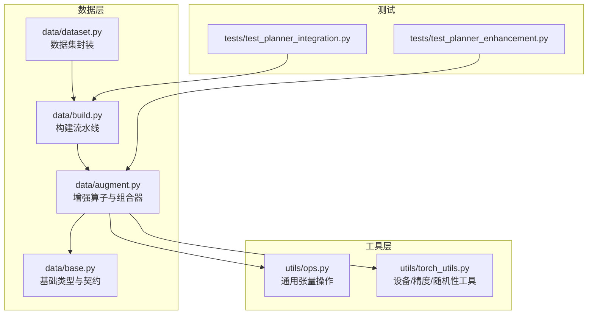
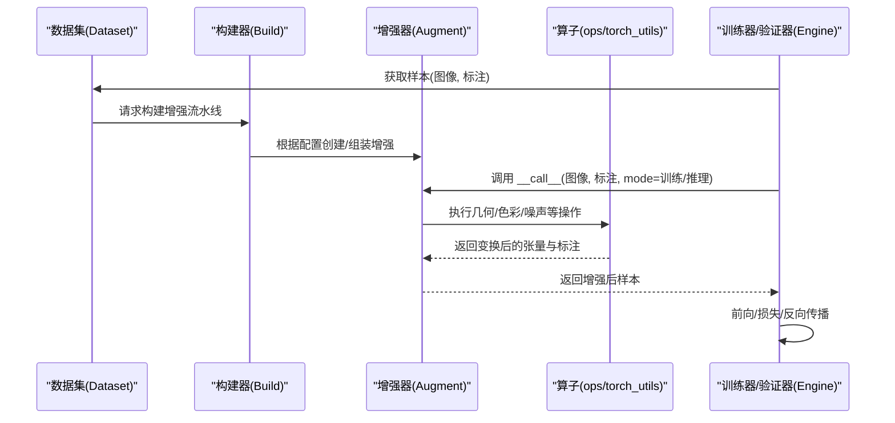
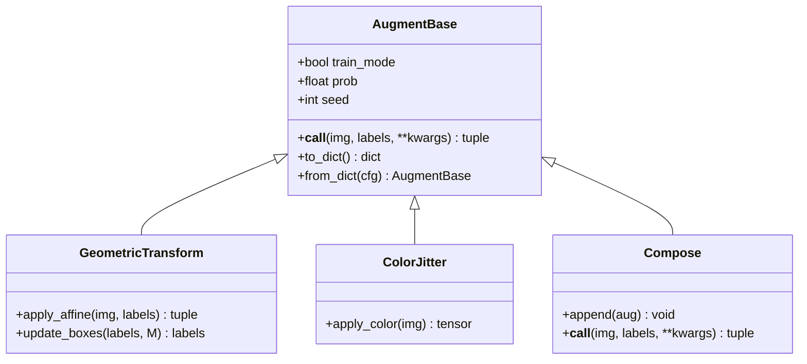
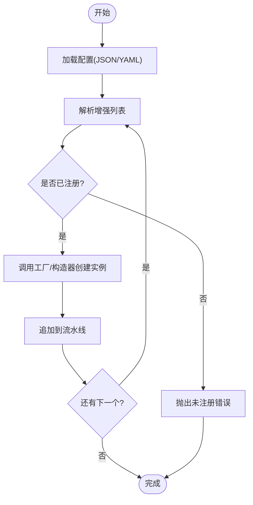
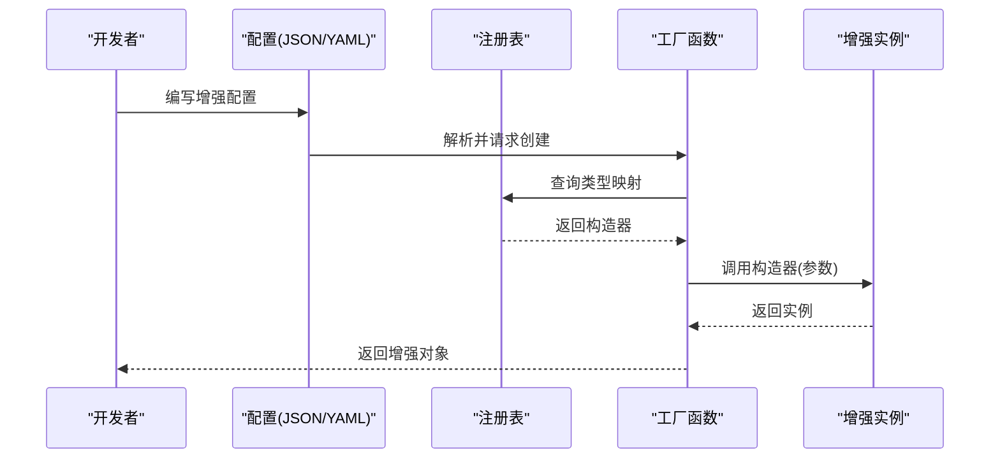
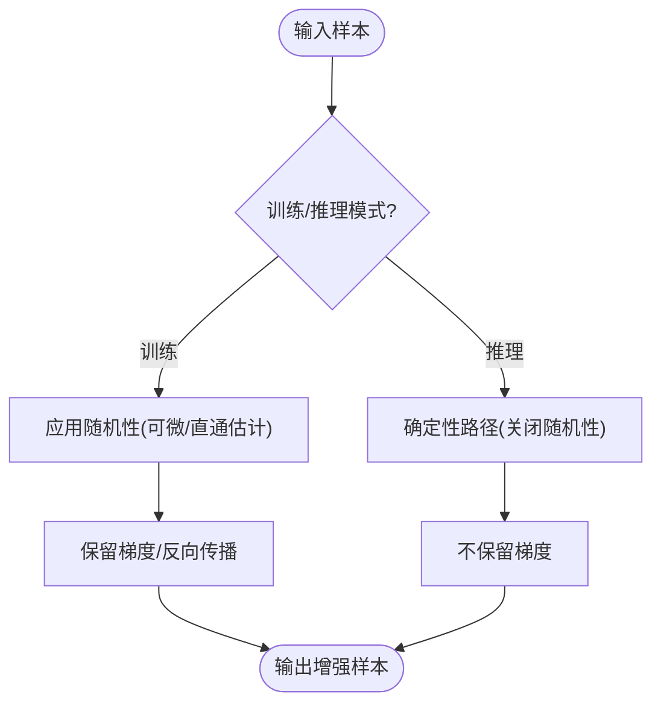
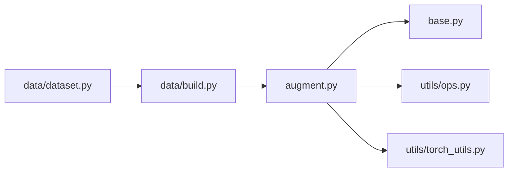

# 自定义增强开发

<cite>
**本文引用的文件**
- [ultralytics/data/augment.py](file://ultralytics/data/augment.py)
- [ultralytics/data/base.py](file://ultralytics/data/base.py)
- [ultralytics/data/build.py](file://ultralytics/data/build.py)
- [ultralytics/data/dataset.py](file://ultralytics/data/dataset.py)
- [ultralytics/data/__init__.py](file://ultralytics/data/__init__.py)
- [ultralytics/utils/ops.py](file://ultralytics/utils/ops.py)
- [ultralytics/utils/torch_utils.py](file://ultralytics/utils/torch_utils.py)
- [tests/test_planner_enhancement.py](file://tests/test_planner_enhancement.py)
- [tests/test_planner_integration.py](file://tests/test_planner_integration.py)
</cite>

## 目录
1. [简介](#简介)
2. [项目结构](#项目结构)
3. [核心组件](#核心组件)
4. [架构总览](#架构总览)
5. [详细组件分析](#详细组件分析)
6. [依赖分析](#依赖分析)
7. [性能考虑](#性能考虑)
8. [故障排查指南](#故障排查指南)
9. [结论](#结论)
10. [附录](#附录)

## 简介
本指南面向希望在 YOLO-Master 中扩展数据增强的开发者，围绕“自定义增强”的接口规范、基类设计、注册与发现机制、参数序列化、可微分性与梯度传播、单元测试与质量评估、调试工具与常见问题进行系统化说明。文档以代码仓库中的增强实现为依据，提供从简单几何变换到复杂多模态增强的完整开发路径与最佳实践。

## 项目结构
YOLO-Master 的数据增强相关代码集中在 data 子包中，核心包括：
- 增强算子与组合器定义（augment.py）
- 数据加载与构建流程（build.py、dataset.py）
- 基础类型与契约（base.py）
- 公共算子与张量操作（utils/ops.py）
- 训练/验证管线集成点（engine/trainer.py、engine/validator.py 等）

图表来源
- [ultralytics/data/augment.py](file://ultralytics/data/augment.py)
- [ultralytics/data/base.py](file://ultralytics/data/base.py)
- [ultralytics/data/build.py](file://ultralytics/data/build.py)
- [ultralytics/data/dataset.py](file://ultralytics/data/dataset.py)
- [ultralytics/utils/ops.py](file://ultralytics/utils/ops.py)
- [ultralytics/utils/torch_utils.py](file://ultralytics/utils/torch_utils.py)
- [tests/test_planner_enhancement.py](file://tests/test_planner_enhancement.py)
- [tests/test_planner_integration.py](file://tests/test_planner_integration.py)

章节来源
- [ultralytics/data/augment.py](file://ultralytics/data/augment.py)
- [ultralytics/data/base.py](file://ultralytics/data/base.py)
- [ultralytics/data/build.py](file://ultralytics/data/build.py)
- [ultralytics/data/dataset.py](file://ultralytics/data/dataset.py)
- [ultralytics/utils/ops.py](file://ultralytics/utils/ops.py)
- [ultralytics/utils/torch_utils.py](file://ultralytics/utils/torch_utils.py)
- [tests/test_planner_enhancement.py](file://tests/test_planner_enhancement.py)
- [tests/test_planner_integration.py](file://tests/test_planner_integration.py)

## 核心组件
- 增强算子基类与契约
  - 所有增强应遵循统一的输入输出契约：输入为图像与标注元组的批次，输出为同构结构的变换结果；支持在训练模式下启用随机性，在推理模式下保持确定性。
  - __call__ 方法需保证：
    - 输入校验与形状广播
    - 标注一致性更新（框、关键点、掩码、类别等）
    - 可微分支保留梯度（若需要）
    - 状态管理（如随机种子、概率开关、内部缓存）
- 组合器与流水线
  - 组合器负责将多个增强按顺序或条件执行，并维护整体随机状态与批内一致性。
- 构建与注册
  - 通过工厂函数或装饰器将自定义增强注册到全局映射表，供配置解析时动态实例化。
- 参数序列化
  - 增强类需提供 to_dict/from_dict 或等价接口，确保 JSON/YAML 配置可被正确反序列化为增强实例。
- 可微分性
  - 对需要梯度的增强（如可微仿射、颜色抖动），使用 torch 原生算子并保持计算图连通；对不可微部分（如离散采样）应在训练/推理模式间切换或使用直通估计器。

章节来源
- [ultralytics/data/augment.py](file://ultralytics/data/augment.py)
- [ultralytics/data/base.py](file://ultralytics/data/base.py)
- [ultralytics/data/build.py](file://ultralytics/data/build.py)
- [ultralytics/data/dataset.py](file://ultralytics/data/dataset.py)
- [ultralytics/utils/ops.py](file://ultralytics/utils/ops.py)
- [ultralytics/utils/torch_utils.py](file://ultralytics/utils/torch_utils.py)

## 架构总览
下图展示了增强在数据加载与训练/验证管线中的位置与交互关系。

图表来源
- [ultralytics/data/dataset.py](file://ultralytics/data/dataset.py)
- [ultralytics/data/build.py](file://ultralytics/data/build.py)
- [ultralytics/data/augment.py](file://ultralytics/data/augment.py)
- [ultralytics/utils/ops.py](file://ultralytics/utils/ops.py)
- [ultralytics/utils/torch_utils.py](file://ultralytics/utils/torch_utils.py)

## 详细组件分析

### 增强基类与 __call__ 契约
- 输入约定
  - 图像：通常为 NCHW 或 NHWC 的浮点张量，范围归一化至 [0,1] 或 [-1,1]（由具体增强决定）。
  - 标注：包含边界框、类别、关键点、掩码等字段，维度与图像批次对齐。
- 输出约定
  - 与输入同构的 (图像, 标注) 元组；批维保持一致；标注字段需随几何变换同步更新。
- 状态管理
  - 随机种子、概率阈值、内部缓存（如中间矩阵）需在 __init__ 初始化并在 __call__ 中安全读取/写入。
- 可微分支
  - 若增强参与反向传播，必须使用可微算子并保持梯度流；否则在训练模式下禁用梯度或采用直通估计。

图表来源
- [ultralytics/data/augment.py](file://ultralytics/data/augment.py)
- [ultralytics/data/base.py](file://ultralytics/data/base.py)

章节来源
- [ultralytics/data/augment.py](file://ultralytics/data/augment.py)
- [ultralytics/data/base.py](file://ultralytics/data/base.py)

### 注册与发现机制
- 装饰器注册
  - 通过装饰器将自定义增强类名映射到构造器，便于配置驱动实例化。
- 工厂函数
  - 统一入口根据配置字典查找已注册的增强类型并创建实例。
- 配置文件集成
  - YAML/JSON 中声明增强名称与参数，构建器解析后自动装配流水线。

图表来源
- [ultralytics/data/build.py](file://ultralytics/data/build.py)
- [ultralytics/data/augment.py](file://ultralytics/data/augment.py)

章节来源
- [ultralytics/data/build.py](file://ultralytics/data/build.py)
- [ultralytics/data/augment.py](file://ultralytics/data/augment.py)

### 参数序列化与反序列化
- 序列化
  - 将增强类的超参数字典化，确保键名与默认值一致，避免运行时歧义。
- 反序列化
  - 工厂函数依据类型名查找注册表，传入参数字典构造实例。
- 兼容性
  - 新增字段需设置默认值；废弃字段需兼容旧配置。

图表来源
- [ultralytics/data/build.py](file://ultralytics/data/build.py)
- [ultralytics/data/augment.py](file://ultralytics/data/augment.py)

章节来源
- [ultralytics/data/build.py](file://ultralytics/data/build.py)
- [ultralytics/data/augment.py](file://ultralytics/data/augment.py)

### 可微分性与梯度传播
- 可微增强
  - 使用 torch 原生算子（如仿射变换、插值、颜色空间转换）以保持梯度。
- 不可微增强
  - 离散选择（如随机裁剪索引）在训练模式下可通过直通估计或停止梯度策略处理。
- 模式切换
  - 训练模式允许随机性与梯度；推理模式关闭随机性并优化路径。

图表来源
- [ultralytics/data/augment.py](file://ultralytics/data/augment.py)
- [ultralytics/utils/torch_utils.py](file://ultralytics/utils/torch_utils.py)

章节来源
- [ultralytics/data/augment.py](file://ultralytics/data/augment.py)
- [ultralytics/utils/torch_utils.py](file://ultralytics/utils/torch_utils.py)

### 自定义增强开发示例

#### 示例一：简单几何变换（仿射+旋转）
- 步骤
  - 继承增强基类，实现 __call__ 与标注更新逻辑。
  - 使用 utils/ops 提供的仿射矩阵与坐标变换工具。
  - 在 to_dict/from_dict 中暴露角度、缩放、平移等参数。
- 关键要点
  - 批维一致性；标注框与关键点同步更新；随机种子可控。

章节来源
- [ultralytics/data/augment.py](file://ultralytics/data/augment.py)
- [ultralytics/utils/ops.py](file://ultralytics/utils/ops.py)

#### 示例二：复杂多模态增强（图像+文本提示）
- 步骤
  - 在 __call__ 中同时处理图像与文本提示（如随机替换同义词、扰动描述）。
  - 保持文本与图像的对应关系；必要时引入可微文本嵌入扰动。
- 关键要点
  - 多模态一致性；文本扰动不影响图像标注；可微嵌入需稳定梯度。

章节来源
- [ultralytics/data/augment.py](file://ultralytics/data/augment.py)

#### 示例三：组合增强流水线
- 步骤
  - 使用组合器串联多个增强；按概率或条件分支执行。
  - 在组合器中维护整体随机状态，确保批内一致性。
- 关键要点
  - 顺序敏感；概率控制；可配置化。

章节来源
- [ultralytics/data/augment.py](file://ultralytics/data/augment.py)

### 单元测试编写方法与质量评估标准
- 单元覆盖
  - 形状与类型断言；标注一致性检查；随机性可复现性验证。
- 回归测试
  - 固定种子下对比前后版本输出差异；数值稳定性检验。
- 性能基准
  - 单步耗时、内存占用、GPU利用率；批量规模变化下的吞吐。
- 参考用例
  - 参考现有增强测试文件组织方式与断言风格。

章节来源
- [tests/test_planner_enhancement.py](file://tests/test_planner_enhancement.py)
- [tests/test_planner_integration.py](file://tests/test_planner_integration.py)

### 调试工具与常见问题
- 调试建议
  - 打印中间张量形状与统计量；可视化变换前后图像与标注；记录随机种子。
- 常见问题
  - 标注越界：检查仿射矩阵与坐标变换公式；边界裁剪策略。
  - 梯度消失：确认可微路径未被 stop_gradient 阻断；检查数据类型与范围。
  - 配置解析失败：核对注册表键名与参数默认值；确保 JSON/YAML 格式正确。

章节来源
- [ultralytics/data/augment.py](file://ultralytics/data/augment.py)
- [ultralytics/data/build.py](file://ultralytics/data/build.py)

## 依赖分析
增强模块依赖关系如下：

图表来源
- [ultralytics/data/augment.py](file://ultralytics/data/augment.py)
- [ultralytics/data/base.py](file://ultralytics/data/base.py)
- [ultralytics/data/build.py](file://ultralytics/data/build.py)
- [ultralytics/data/dataset.py](file://ultralytics/data/dataset.py)
- [ultralytics/utils/ops.py](file://ultralytics/utils/ops.py)
- [ultralytics/utils/torch_utils.py](file://ultralytics/utils/torch_utils.py)

章节来源
- [ultralytics/data/augment.py](file://ultralytics/data/augment.py)
- [ultralytics/data/base.py](file://ultralytics/data/base.py)
- [ultralytics/data/build.py](file://ultralytics/data/build.py)
- [ultralytics/data/dataset.py](file://ultralytics/data/dataset.py)
- [ultralytics/utils/ops.py](file://ultralytics/utils/ops.py)
- [ultralytics/utils/torch_utils.py](file://ultralytics/utils/torch_utils.py)

## 性能考虑
- 向量化计算
  - 优先使用 batched 张量操作，避免 Python 循环；利用 ops 提供的批量仿射与插值。
- 内存管理
  - 复用中间缓冲区；及时释放临时张量；注意 dtype 与 device 一致性。
- 并行处理
  - 结合 DataLoader 的多进程预取；在 GPU 上执行增强以减少拷贝开销。
- 随机性控制
  - 合理设置种子与概率，避免不必要的重计算；在推理模式关闭随机性以提升吞吐。

[本节为通用指导，无需特定文件引用]

## 故障排查指南
- 常见错误定位
  - 注册表缺失：检查装饰器是否正确注册；工厂函数是否能找到类型映射。
  - 标注不一致：验证几何变换对框、关键点、掩码的更新逻辑；边界处理策略。
  - 梯度异常：检查可微分支是否被中断；dtype 与范围是否符合模型期望。
- 诊断手段
  - 启用日志与可视化；固定种子复现实例；逐步注释增强块定位问题。

章节来源
- [ultralytics/data/build.py](file://ultralytics/data/build.py)
- [ultralytics/data/augment.py](file://ultralytics/data/augment.py)

## 结论
通过遵循统一的增强基类契约、完善的注册与序列化机制、严谨的可微分设计与测试体系，开发者可以高效地在 YOLO-Master 中扩展自定义增强。结合向量化、内存与并行优化，可在保证质量的同时显著提升训练与推理效率。

[本节为总结性内容，无需特定文件引用]

## 附录
- 快速上手清单
  - 定义增强类并实现 __call__/to_dict/from_dict
  - 使用装饰器注册到全局映射
  - 在 YAML/JSON 中声明增强与参数
  - 编写单元测试与性能基准
  - 在训练/验证管线中集成并验证

[本节为补充信息，无需特定文件引用]