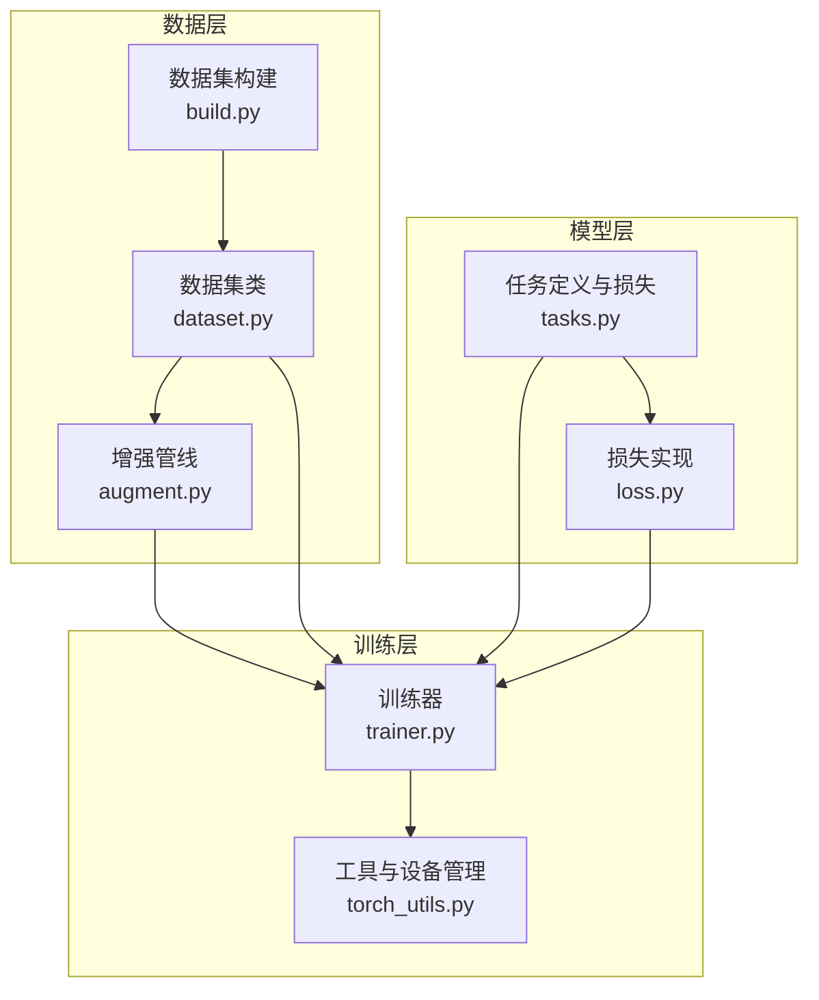
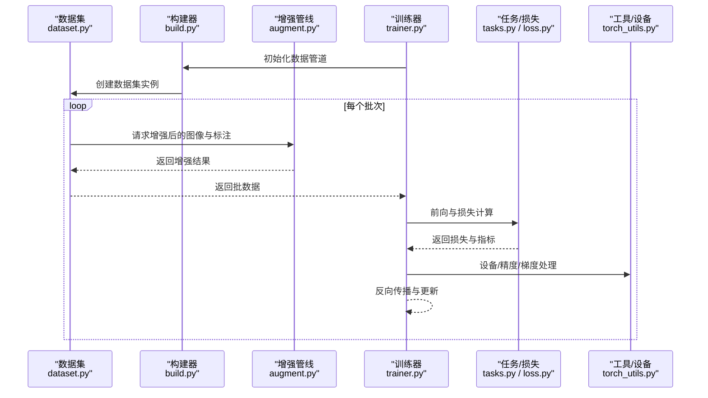
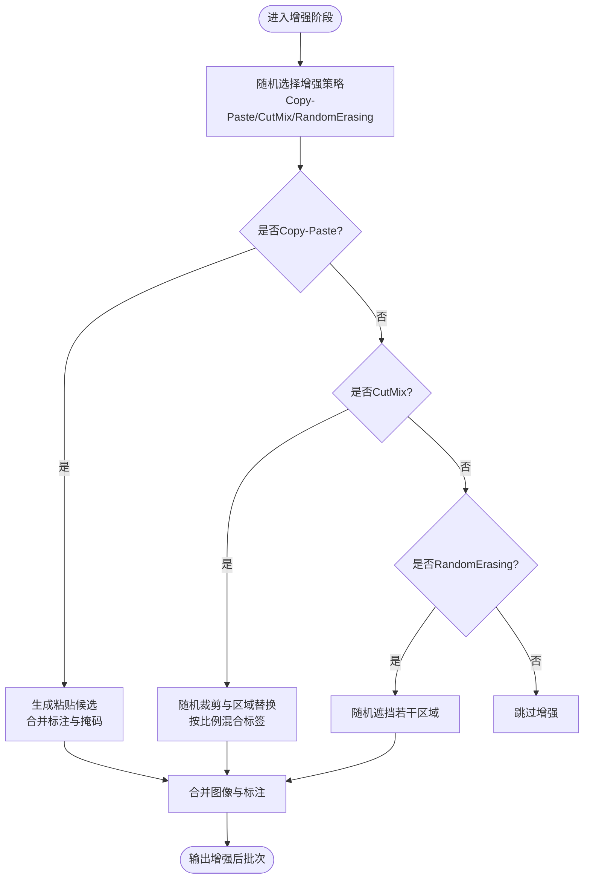
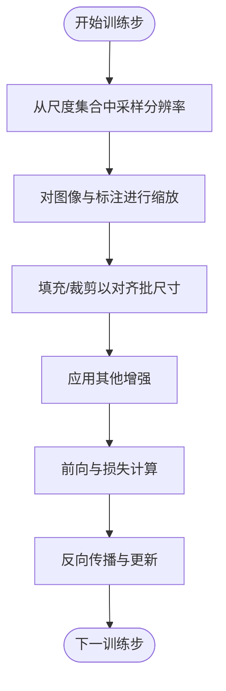
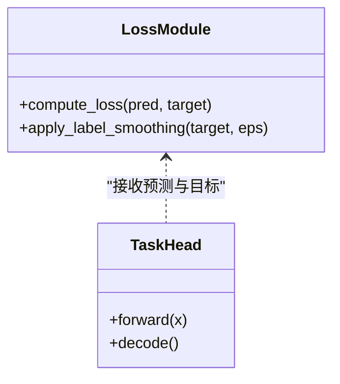
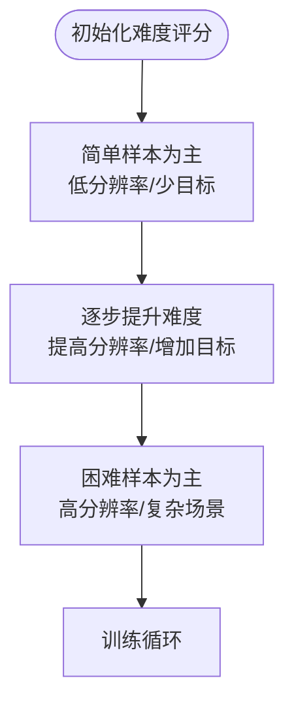
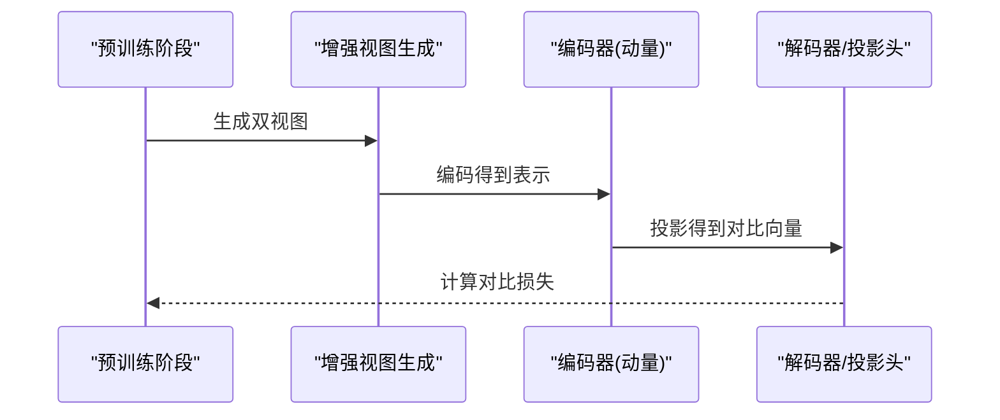
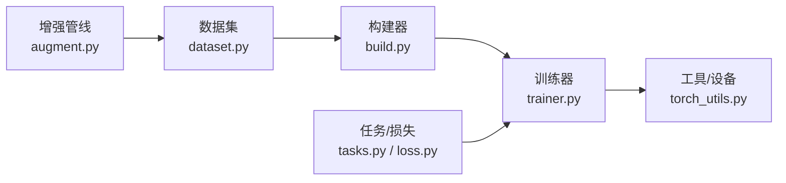

# 高级增强算法

<cite>
**本文引用的文件**
- [ultralytics/data/augment.py](file://ultralytics/data/augment.py)
- [ultralytics/data/dataset.py](file://ultralytics/data/dataset.py)
- [ultralytics/data/build.py](file://ultralytics/data/build.py)
- [ultralytics/nn/tasks.py](file://ultralytics/nn/tasks.py)
- [ultralytics/engine/trainer.py](file://ultralytics/engine/trainer.py)
- [ultralytics/utils/loss.py](file://ultralytics/utils/loss.py)
- [ultralytics/utils/torch_utils.py](file://ultralytics/utils/torch_utils.py)
- [scripts/full_ablation_multiscale.py](file://scripts/full_ablation_multiscale.py)
- [docs/en/guides/yolo-data-augmentation.md](file://docs/en/guides/yolo-data-augmentation.md)
</cite>

## 目录
1. [简介](#简介)
2. [项目结构](#项目结构)
3. [核心组件](#核心组件)
4. [架构总览](#架构总览)
5. [详细组件分析](#详细组件分析)
6. [依赖关系分析](#依赖关系分析)
7. [性能考量](#性能考量)
8. [故障排查指南](#故障排查指南)
9. [结论](#结论)
10. [附录](#附录)

## 简介
本技术文档聚焦于YOLO-Master的高级数据增强与训练策略，系统阐述以下主题：
- 现代深度学习中的先进增强技术：Copy-Paste、CutMix、RandomErasing等
- 多尺度训练（Multi-scale Training）的实现原理与动态分辨率调整策略
- 标签平滑（Label Smoothing）的正则化效果与超参数调优方法
- 课程学习（Curriculum Learning）的数据难度排序与渐进式训练策略
- 自监督预训练中的对比学习增强（SimCLR、MoCo）在检测任务中的适配思路
- 高级增强的组合使用策略与性能优化技巧
- 不同算法的计算复杂度分析与内存占用评估

## 项目结构
本项目将数据增强与训练流程解耦为“数据加载与增强管线”和“模型训练与损失计算”两大模块。关键路径如下：
- 数据层：负责图像与标注的读取、增强、批构建与多尺度采样
- 模型层：封装任务头与损失函数，支持标签平滑等正则化
- 训练层：组织训练循环、回调、日志与配置解析

图表来源
- [ultralytics/data/build.py](file://ultralytics/data/build.py)
- [ultralytics/data/dataset.py](file://ultralytics/data/dataset.py)
- [ultralytics/data/augment.py](file://ultralytics/data/augment.py)
- [ultralytics/nn/tasks.py](file://ultralytics/nn/tasks.py)
- [ultralytics/utils/loss.py](file://ultralytics/utils/loss.py)
- [ultralytics/engine/trainer.py](file://ultralytics/engine/trainer.py)
- [ultralytics/utils/torch_utils.py](file://ultralytics/utils/torch_utils.py)

章节来源
- [ultralytics/data/build.py](file://ultralytics/data/build.py)
- [ultralytics/data/dataset.py](file://ultralytics/data/dataset.py)
- [ultralytics/data/augment.py](file://ultralytics/data/augment.py)
- [ultralytics/nn/tasks.py](file://ultralytics/nn/tasks.py)
- [ultralytics/utils/loss.py](file://ultralytics/utils/loss.py)
- [ultralytics/engine/trainer.py](file://ultralytics/engine/trainer.py)
- [ultralytics/utils/torch_utils.py](file://ultralytics/utils/torch_utils.py)

## 核心组件
- 数据增强管线（augment.py）
  - 提供几何变换、色彩扰动、遮挡替换、区域混合等增强算子
  - 支持按概率与强度随机应用，便于与多尺度训练协同
- 数据集与批构建（dataset.py, build.py）
  - 负责样本索引、标注解析、批量打包与多尺度采样调度
  - 与增强管线对接，形成端到端的数据流
- 任务与损失（tasks.py, loss.py）
  - 封装检测任务输出与损失计算，支持标签平滑等正则化选项
- 训练器（trainer.py）
  - 编排训练循环、优化器、调度器、日志与回调
  - 集成多尺度训练、课程学习策略与增强开关

章节来源
- [ultralytics/data/augment.py](file://ultralytics/data/augment.py)
- [ultralytics/data/dataset.py](file://ultralytics/data/dataset.py)
- [ultralytics/data/build.py](file://ultralytics/data/build.py)
- [ultralytics/nn/tasks.py](file://ultralytics/nn/tasks.py)
- [ultralytics/utils/loss.py](file://ultralytics/utils/loss.py)
- [ultralytics/engine/trainer.py](file://ultralytics/engine/trainer.py)

## 架构总览
下图展示从数据到训练的完整调用链，以及增强、多尺度与损失之间的交互关系。

图表来源
- [ultralytics/data/dataset.py](file://ultralytics/data/dataset.py)
- [ultralytics/data/build.py](file://ultralytics/data/build.py)
- [ultralytics/data/augment.py](file://ultralytics/data/augment.py)
- [ultralytics/engine/trainer.py](file://ultralytics/engine/trainer.py)
- [ultralytics/nn/tasks.py](file://ultralytics/nn/tasks.py)
- [ultralytics/utils/loss.py](file://ultralytics/utils/loss.py)
- [ultralytics/utils/torch_utils.py](file://ultralytics/utils/torch_utils.py)

## 详细组件分析

### 组件一：高级增强技术（Copy-Paste、CutMix、RandomErasing）
- Copy-Paste增强
  - 机制：从同一类别或跨类别样本中复制目标对象掩码与边界框，粘贴至当前图像背景，并融合标注
  - 适用场景：小目标、长尾类别、遮挡鲁棒性提升
  - 复杂度与内存：时间复杂度近似O(N_obj + N_paste)，空间复杂度受粘贴数量与图像尺寸影响；建议控制粘贴密度与尺寸上限
- CutMix增强
  - 机制：随机裁剪一块矩形区域，用另一张图像的对应区域替换，同时按比例混合标签
  - 适用场景：提升模型对局部特征的泛化能力，缓解过拟合
  - 复杂度与内存：时间复杂度O(HW)，空间复杂度取决于批大小与图像尺寸；注意比例采样分布
- RandomErasing增强
  - 机制：在图像上随机选择若干矩形区域进行遮挡（填充均值/噪声），模拟遮挡与缺失
  - 适用场景：提高鲁棒性与域外泛化
  - 复杂度与内存：时间复杂度O(k·HW)，k为遮挡块数；建议限制最大面积占比以避免破坏语义

图表来源
- [ultralytics/data/augment.py](file://ultralytics/data/augment.py)

章节来源
- [ultralytics/data/augment.py](file://ultralytics/data/augment.py)

### 组件二：多尺度训练（Multi-scale Training）
- 实现原理
  - 在训练过程中动态调整输入分辨率，以增强模型对不同尺度的鲁棒性
  - 通常通过随机缩放与自适应填充实现，并在批内对齐尺寸
- 动态分辨率调整策略
  - 每步或每轮从预设尺度集合中采样，结合数据增强顺序（先缩放后裁剪/填充）
  - 与批构建器协作，确保批内一致性
- 复杂度与内存
  - 时间复杂度随分辨率平方增长；高分辨率批次会显著增加显存占用
  - 建议采用阶梯式尺度与早停策略，平衡收敛速度与资源消耗

图表来源
- [ultralytics/data/build.py](file://ultralytics/data/build.py)
- [ultralytics/data/dataset.py](file://ultralytics/data/dataset.py)
- [scripts/full_ablation_multiscale.py](file://scripts/full_ablation_multiscale.py)

章节来源
- [ultralytics/data/build.py](file://ultralytics/data/build.py)
- [ultralytics/data/dataset.py](file://ultralytics/data/dataset.py)
- [scripts/full_ablation_multiscale.py](file://scripts/full_ablation_multiscale.py)

### 组件三：标签平滑（Label Smoothing）
- 正则化效果
  - 通过将硬标签软化为更均匀的分布，降低置信度峰值，缓解过拟合
  - 在检测任务中常用于分类分支与辅助头
- 超参数调优
  - 平滑系数ε是关键超参，典型范围[0.01, 0.2]
  - 与学习率、权重衰减、增强强度联合调优，避免过度平滑导致判别力下降
- 实现位置
  - 损失计算模块中引入平滑项，或在任务定义处注入标签转换逻辑

图表来源
- [ultralytics/nn/tasks.py](file://ultralytics/nn/tasks.py)
- [ultralytics/utils/loss.py](file://ultralytics/utils/loss.py)

章节来源
- [ultralytics/nn/tasks.py](file://ultralytics/nn/tasks.py)
- [ultralytics/utils/loss.py](file://ultralytics/utils/loss.py)

### 组件四：课程学习（Curriculum Learning）
- 数据难度排序
  - 基于目标密度、遮挡程度、尺度分布、类别频率等指标构造难度分数
  - 训练初期优先简单样本，逐步引入困难样本
- 渐进式训练策略
  - 可结合多尺度训练，先在低分辨率与少目标场景下预热，再过渡到高分辨率与复杂场景
  - 可通过训练器回调动态调整采样权重或切换数据子集
- 复杂度与内存
  - 难度评分可在预处理阶段离线计算，在线阶段仅做加权采样，开销可控

图表来源
- [ultralytics/engine/trainer.py](file://ultralytics/engine/trainer.py)
- [ultralytics/data/dataset.py](file://ultralytics/data/dataset.py)

章节来源
- [ultralytics/engine/trainer.py](file://ultralytics/engine/trainer.py)
- [ultralytics/data/dataset.py](file://ultralytics/data/dataset.py)

### 组件五：自监督预训练中的增强（SimCLR、MoCo）
- SimCLR风格增强
  - 强增强（颜色抖动、随机裁剪、模糊、对比度/亮度变化）用于同一图像的两份视图，最大化互信息
  - 在检测任务中可将增强应用于特征提取主干，再进行下游微调
- MoCo风格增强
  - 使用队列与动量编码器，保持正负样本对的稳定性；增强策略与SimCLR类似但强调时序一致性
- 适配建议
  - 在YOLO检测任务中，可采用两阶段策略：先用自监督预训练主干，再用标准检测损失微调
  - 增强强度需与下游任务匹配，避免破坏定位信号

图表来源
- [ultralytics/nn/tasks.py](file://ultralytics/nn/tasks.py)
- [ultralytics/utils/loss.py](file://ultralytics/utils/loss.py)

章节来源
- [ultralytics/nn/tasks.py](file://ultralytics/nn/tasks.py)
- [ultralytics/utils/loss.py](file://ultralytics/utils/loss.py)

### 组件六：高级增强的组合使用策略
- 组合原则
  - 互补性：几何+色彩+遮挡的组合能覆盖更多不变性
  - 强度控制：避免过度增强破坏定位与分割信号
  - 任务相关：检测任务需保留边界与相对位置信息
- 推荐策略
  - 基础增强（翻转、旋转、缩放）+ 随机遮挡（RandomErasing）+ 区域混合（CutMix）
  - 针对小目标与长尾类别加入Copy-Paste
  - 在多尺度训练中穿插上述增强，提升鲁棒性
- 验证与回退
  - 通过消融实验评估各增强贡献，必要时关闭某项以稳定训练

章节来源
- [ultralytics/data/augment.py](file://ultralytics/data/augment.py)
- [docs/en/guides/yolo-data-augmentation.md](file://docs/en/guides/yolo-data-augmentation.md)

## 依赖关系分析
- 耦合与内聚
  - 增强管线与数据集高内聚，训练器通过构建器间接依赖增强
  - 任务与损失模块独立，便于替换与扩展
- 外部依赖
  - 设备与精度管理由工具模块提供，训练器统一调度
- 潜在循环依赖
  - 数据层与训练层单向依赖，未见循环导入迹象

图表来源
- [ultralytics/data/augment.py](file://ultralytics/data/augment.py)
- [ultralytics/data/dataset.py](file://ultralytics/data/dataset.py)
- [ultralytics/data/build.py](file://ultralytics/data/build.py)
- [ultralytics/nn/tasks.py](file://ultralytics/nn/tasks.py)
- [ultralytics/utils/loss.py](file://ultralytics/utils/loss.py)
- [ultralytics/engine/trainer.py](file://ultralytics/engine/trainer.py)
- [ultralytics/utils/torch_utils.py](file://ultralytics/utils/torch_utils.py)

章节来源
- [ultralytics/data/augment.py](file://ultralytics/data/augment.py)
- [ultralytics/data/dataset.py](file://ultralytics/data/dataset.py)
- [ultralytics/data/build.py](file://ultralytics/data/build.py)
- [ultralytics/nn/tasks.py](file://ultralytics/nn/tasks.py)
- [ultralytics/utils/loss.py](file://ultralytics/utils/loss.py)
- [ultralytics/engine/trainer.py](file://ultralytics/engine/trainer.py)
- [ultralytics/utils/torch_utils.py](file://ultralytics/utils/torch_utils.py)

## 性能考量
- 计算复杂度
  - 增强操作多为像素级或区域级，时间复杂度与图像尺寸和目标数量相关
  - 多尺度训练使每步计算量波动，需监控平均FLOPs与吞吐
- 内存占用
  - 高分辨率与大批次显著提升显存占用；建议根据GPU容量调整batch size与尺度集合
  - Copy-Paste与CutMix会增加中间张量与标注结构的临时内存
- 优化技巧
  - 使用异步数据加载与缓存
  - 合理设置增强概率与强度，避免无意义计算
  - 利用半精度与梯度累积提升吞吐

## 故障排查指南
- 常见问题
  - 增强后标注越界或重叠异常：检查坐标归一化与边界裁剪逻辑
  - 多尺度训练不稳定：确认批内尺寸对齐与填充策略
  - 标签平滑导致收敛缓慢：降低ε或配合更大的学习率
  - 课程学习难以收敛：调整难度阈值与过渡速率
- 诊断步骤
  - 可视化增强前后图像与标注
  - 记录每步的平均分辨率与目标密度
  - 分阶段关闭增强以定位问题源

章节来源
- [ultralytics/data/augment.py](file://ultralytics/data/augment.py)
- [ultralytics/data/dataset.py](file://ultralytics/data/dataset.py)
- [ultralytics/engine/trainer.py](file://ultralytics/engine/trainer.py)

## 结论
YOLO-Master的数据增强与训练体系提供了灵活且可扩展的高级增强能力。通过合理组合Copy-Paste、CutMix与RandomErasing，并结合多尺度训练、标签平滑与课程学习，可以在保证效率的同时显著提升模型的鲁棒性与泛化能力。建议在具体任务中进行系统化消融与调参，以获得最佳性能与资源平衡。

## 附录
- 参考文档
  - YOLO数据增强指南：[yolo-data-augmentation.md](file://docs/en/guides/yolo-data-augmentation.md)
  - 多尺度训练脚本示例：[full_ablation_multiscale.py](file://scripts/full_ablation_multiscale.py)