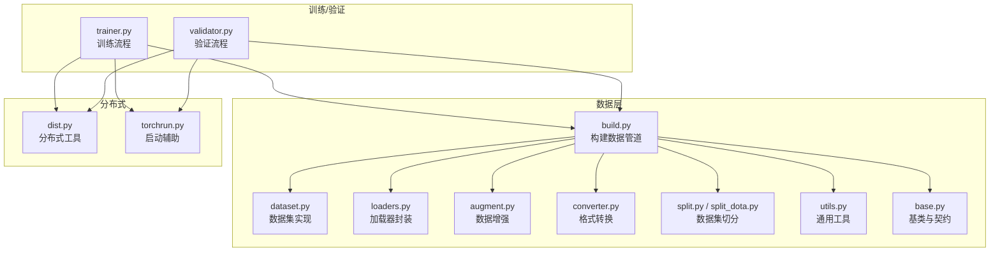
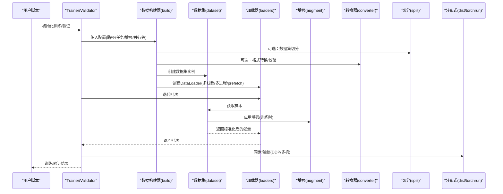
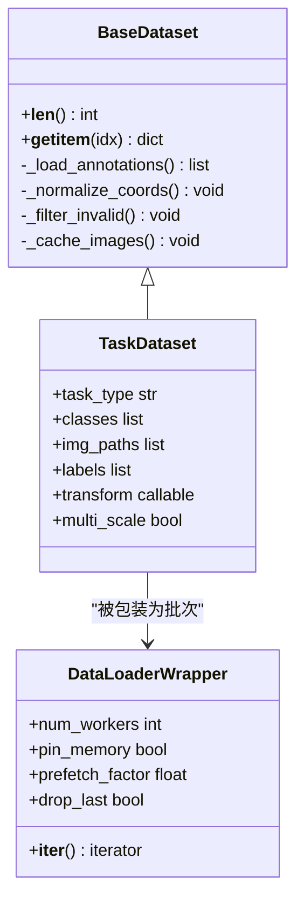
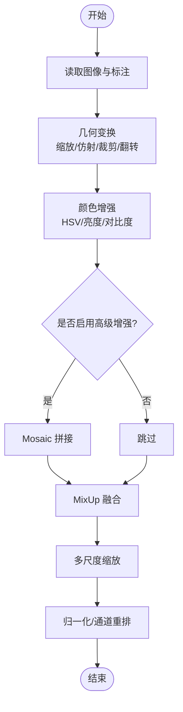
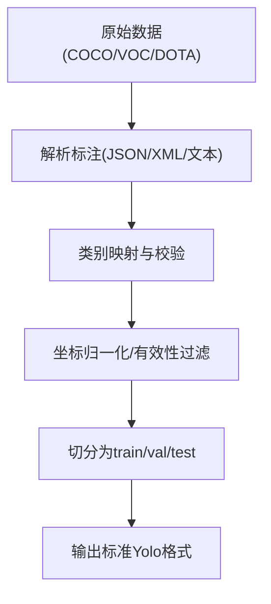
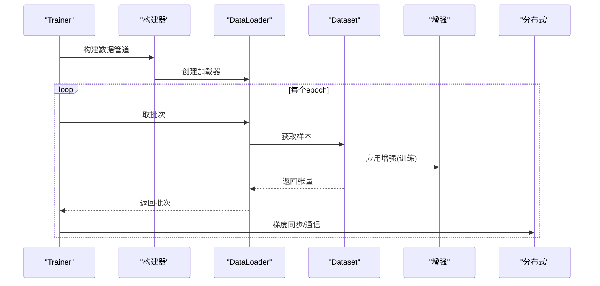
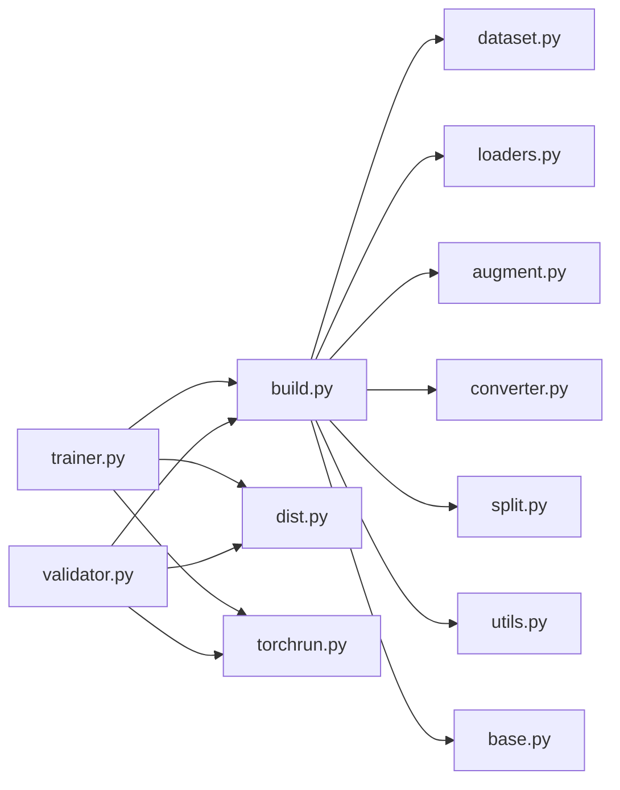

# 数据处理系统

<cite>
**本文引用的文件**
- [ultralytics/data/__init__.py](file://ultralytics/data/__init__.py)
- [ultralytics/data/base.py](file://ultralytics/data/base.py)
- [ultralytics/data/build.py](file://ultralytics/data/build.py)
- [ultralytics/data/dataset.py](file://ultralytics/data/dataset.py)
- [ultralytics/data/loaders.py](file://ultralytics/data/loaders.py)
- [ultralytics/data/augment.py](file://ultralytics/data/augment.py)
- [ultralytics/data/converter.py](file://ultralytics/data/converter.py)
- [ultralytics/data/utils.py](file://ultralytics/data/utils.py)
- [ultralytics/data/split.py](file://ultralytics/data/split.py)
- [ultralytics/data/split_dota.py](file://ultralytics/data/split_dota.py)
- [ultralytics/engine/trainer.py](file://ultralytics/engine/trainer.py)
- [ultralytics/engine/validator.py](file://ultralytics/engine/validator.py)
- [ultralytics/utils/dist.py](file://ultralytics/utils/dist.py)
- [ultralytics/utils/torchrun.py](file://ultralytics/utils/torchrun.py)
- [ultralytics/utils/checks.py](file://ultralytics/utils/checks.py)
- [scripts/coco2017.yaml](file://scripts/coco2017.yaml)
- [scripts/VOC_sub.yaml](file://scripts/VOC_sub.yaml)
</cite>

## 目录
1. [简介](#简介)
2. [项目结构](#项目结构)
3. [核心组件](#核心组件)
4. [架构总览](#架构总览)
5. [详细组件分析](#详细组件分析)
6. [依赖关系分析](#依赖关系分析)
7. [性能考虑](#性能考虑)
8. [故障排查指南](#故障排查指南)
9. [结论](#结论)
10. [附录](#附录)

## 简介
本技术文档聚焦于 YOLO-Master 的数据处理系统，围绕数据加载管道、缓存与内存管理、多格式数据集支持（YOLO/COCO/VOC 等）、数据增强体系（几何变换、颜色增强、MixUp、Mosaic 等）、自定义数据加载器开发、数据验证与质量检查、多尺度训练与采样策略、数据并行与分布式加载、大数据集优化与内存管理、预处理/后处理工具链、数据版本管理与实验复现、以及常见问题诊断与解决方案进行系统化阐述。目标是帮助读者从架构到实现细节全面理解并高效使用该系统。

## 项目结构
数据处理子系统位于 ultralytics/data 目录下，按职责划分为：
- 构建与装配：负责根据配置构建 Dataset、DataLoader、Transform 流水线
- 数据集抽象与实现：统一接口、索引、标签解析、图像读取
- 数据增强：几何、颜色、高级组合增强（Mosaic/MixUp 等）
- 格式转换与分割：COCO/YOLO/VOC/DOTA 等格式互转与切分
- 工具函数：路径、IO、校验、统计等通用能力
- 训练/验证集成：在 Trainer/Validator 中装配数据管道

图表来源
- [ultralytics/data/build.py](file://ultralytics/data/build.py)
- [ultralytics/data/dataset.py](file://ultralytics/data/dataset.py)
- [ultralytics/data/loaders.py](file://ultralytics/data/loaders.py)
- [ultralytics/data/augment.py](file://ultralytics/data/augment.py)
- [ultralytics/data/converter.py](file://ultralytics/data/converter.py)
- [ultralytics/data/split.py](file://ultralytics/data/split.py)
- [ultralytics/data/split_dota.py](file://ultralytics/data/split_dota.py)
- [ultralytics/data/utils.py](file://ultralytics/data/utils.py)
- [ultralytics/data/base.py](file://ultralytics/data/base.py)
- [ultralytics/engine/trainer.py](file://ultralytics/engine/trainer.py)
- [ultralytics/engine/validator.py](file://ultralytics/engine/validator.py)
- [ultralytics/utils/dist.py](file://ultralytics/utils/dist.py)
- [ultralytics/utils/torchrun.py](file://ultralytics/utils/torchrun.py)

章节来源
- [ultralytics/data/build.py](file://ultralytics/data/build.py)
- [ultralytics/data/dataset.py](file://ultralytics/data/dataset.py)
- [ultralytics/data/augment.py](file://ultralytics/data/augment.py)
- [ultralytics/data/converter.py](file://ultralytics/data/converter.py)
- [ultralytics/data/split.py](file://ultralytics/data/split.py)
- [ultralytics/data/split_dota.py](file://ultralytics/data/split_dota.py)
- [ultralytics/data/utils.py](file://ultralytics/data/utils.py)
- [ultralytics/data/base.py](file://ultralytics/data/base.py)
- [ultralytics/engine/trainer.py](file://ultralytics/engine/trainer.py)
- [ultralytics/engine/validator.py](file://ultralytics/engine/validator.py)
- [ultralytics/utils/dist.py](file://ultralytics/utils/dist.py)
- [ultralytics/utils/torchrun.py](file://ultralytics/utils/torchrun.py)

## 核心组件
- 数据构建器（build）：根据 YAML/字典配置解析任务类型、根路径、类别映射、增强参数、批大小、工作进程数、多尺度策略等，组装 Dataset 与 DataLoader。
- 数据集抽象（base/dataset）：定义统一的 __getitem__/__len__ 契约，封装图像读取、标注解析、坐标归一化、类别映射、缓存与索引。
- 加载器封装（loaders）：对 PyTorch DataLoader 的封装，提供线程/进程并行、prefetch、pin_memory、drop_last 等选项，适配训练/验证不同需求。
- 数据增强（augment）：几何变换（缩放、仿射、翻转、裁剪）、颜色空间增强（HSV、亮度、对比度、饱和度）、高级组合（Mosaic、MixUp、Copy-Paste 等）。
- 格式转换（converter）：COCO/YOLO/VOC/DOTA 等格式的相互转换与规范化，确保标注一致性。
- 切分工具（split/split_dota）：将原始数据切分为 train/val/test，支持随机/分层/时间序列切分，DOTA 支持瓦片切分。
- 工具函数（utils）：路径解析、文件扫描、JSON/YAML 读写、统计信息、校验与日志。
- 训练/验证集成（trainer/validator）：在训练/验证循环中调用数据构建器，注入多尺度、混合精度、梯度累积等上下文。

章节来源
- [ultralytics/data/build.py](file://ultralytics/data/build.py)
- [ultralytics/data/base.py](file://ultralytics/data/base.py)
- [ultralytics/data/dataset.py](file://ultralytics/data/dataset.py)
- [ultralytics/data/loaders.py](file://ultralytics/data/loaders.py)
- [ultralytics/data/augment.py](file://ultralytics/data/augment.py)
- [ultralytics/data/converter.py](file://ultralytics/data/converter.py)
- [ultralytics/data/split.py](file://ultralytics/data/split.py)
- [ultralytics/data/split_dota.py](file://ultralytics/data/split_dota.py)
- [ultralytics/data/utils.py](file://ultralytics/data/utils.py)
- [ultralytics/engine/trainer.py](file://ultralytics/engine/trainer.py)
- [ultralytics/engine/validator.py](file://ultralytics/engine/validator.py)

## 架构总览
数据流从配置到模型训练/验证的整体时序如下：

图表来源
- [ultralytics/engine/trainer.py](file://ultralytics/engine/trainer.py)
- [ultralytics/engine/validator.py](file://ultralytics/engine/validator.py)
- [ultralytics/data/build.py](file://ultralytics/data/build.py)
- [ultralytics/data/dataset.py](file://ultralytics/data/dataset.py)
- [ultralytics/data/loaders.py](file://ultralytics/data/loaders.py)
- [ultralytics/data/augment.py](file://ultralytics/data/augment.py)
- [ultralytics/data/converter.py](file://ultralytics/data/converter.py)
- [ultralytics/data/split.py](file://ultralytics/data/split.py)
- [ultralytics/utils/dist.py](file://ultralytics/utils/dist.py)
- [ultralytics/utils/torchrun.py](file://ultralytics/utils/torchrun.py)

## 详细组件分析

### 数据构建器与装配（build）
- 功能要点
  - 解析任务类型（检测/分割/姿态/跟踪等），选择对应数据集实现
  - 合并默认配置与用户配置，生成最终超参（batch_size、workers、multi_scale、mosaic_mixup 等）
  - 构造 DataLoader，设置 num_workers、pin_memory、persistent_workers、prefetch_factor 等
  - 在多卡环境下，依据 rank/world_size 划分数据子集
- 关键交互
  - 与 trainer/validator 协作，按需启用/禁用增强与多尺度
  - 与 dist/torchrun 协作，完成分布式采样与广播

章节来源
- [ultralytics/data/build.py](file://ultralytics/data/build.py)
- [ultralytics/engine/trainer.py](file://ultralytics/engine/trainer.py)
- [ultralytics/engine/validator.py](file://ultralytics/engine/validator.py)
- [ultralytics/utils/dist.py](file://ultralytics/utils/dist.py)
- [ultralytics/utils/torchrun.py](file://ultralytics/utils/torchrun.py)

### 数据集抽象与实现（base/dataset）
- 设计模式
  - 基于基类契约（__getitem__/__len__），统一输入输出规范
  - 内部维护索引表、类别映射、路径缓存、标注缓存
- 数据读取与解析
  - 支持 YOLO 文本标注、COCO JSON、VOC XML、DOTA 等
  - 坐标归一化、边界框过滤、无效样本剔除
- 缓存机制
  - 图像/标注缓存（内存或磁盘），减少重复 IO
  - 可配置缓存大小与过期策略
- 多尺度与采样
  - 训练时动态分辨率、随机尺度；验证时固定尺度或滑动窗口
  - 分层采样、类别权重采样、难例优先（可选）

图表来源
- [ultralytics/data/base.py](file://ultralytics/data/base.py)
- [ultralytics/data/dataset.py](file://ultralytics/data/dataset.py)
- [ultralytics/data/loaders.py](file://ultralytics/data/loaders.py)

章节来源
- [ultralytics/data/base.py](file://ultralytics/data/base.py)
- [ultralytics/data/dataset.py](file://ultralytics/data/dataset.py)
- [ultralytics/data/loaders.py](file://ultralytics/data/loaders.py)

### 数据增强体系（augment）
- 几何变换
  - 缩放、仿射、旋转、平移、裁剪、翻转、随机擦除
- 颜色增强
  - HSV 空间扰动、亮度/对比度/饱和度调整、随机模糊
- 高级组合
  - Mosaic：四图拼接，提升小目标与上下文感知
  - MixUp：线性插值融合两张图与标签
  - Copy-Paste：复制粘贴目标到新背景
- 增强管线
  - 顺序/概率控制、条件增强（如仅训练阶段启用）
  - 与多尺度联动，先增强再缩放或反之的策略

图表来源
- [ultralytics/data/augment.py](file://ultralytics/data/augment.py)

章节来源
- [ultralytics/data/augment.py](file://ultralytics/data/augment.py)

### 格式转换与切分（converter/split）
- 格式转换
  - COCO JSON → YOLO TXT：类别映射、坐标归一化、文件组织
  - VOC XML → YOLO TXT：XML 解析、边界框提取、归一化
  - DOTA → YOLO/OBB：旋转框处理、瓦片切分
- 数据集切分
  - 随机/分层/时间序列切分，保证类别分布均衡
  - 支持预定义比例与种子控制，便于复现实验

图表来源
- [ultralytics/data/converter.py](file://ultralytics/data/converter.py)
- [ultralytics/data/split.py](file://ultralytics/data/split.py)
- [ultralytics/data/split_dota.py](file://ultralytics/data/split_dota.py)

章节来源
- [ultralytics/data/converter.py](file://ultralytics/data/converter.py)
- [ultralytics/data/split.py](file://ultralytics/data/split.py)
- [ultralytics/data/split_dota.py](file://ultralytics/data/split_dota.py)

### 训练/验证集成（trainer/validator）
- 训练阶段
  - 启用增强、多尺度、混合精度、梯度累积
  - 根据 batch_size 与 workers 调节吞吐
- 验证阶段
  - 关闭增强，固定尺度，必要时开启滑动窗口/SAHI
  - 指标计算与可视化
- 分布式
  - 基于 torchrun 启动，利用 dist 工具进行 rank/world_size 管理、数据子集划分、AllReduce 同步

图表来源
- [ultralytics/engine/trainer.py](file://ultralytics/engine/trainer.py)
- [ultralytics/engine/validator.py](file://ultralytics/engine/validator.py)
- [ultralytics/data/build.py](file://ultralytics/data/build.py)
- [ultralytics/data/dataset.py](file://ultralytics/data/dataset.py)
- [ultralytics/data/augment.py](file://ultralytics/data/augment.py)
- [ultralytics/utils/dist.py](file://ultralytics/utils/dist.py)

章节来源
- [ultralytics/engine/trainer.py](file://ultralytics/engine/trainer.py)
- [ultralytics/engine/validator.py](file://ultralytics/engine/validator.py)
- [ultralytics/data/build.py](file://ultralytics/data/build.py)
- [ultralytics/data/dataset.py](file://ultralytics/data/dataset.py)
- [ultralytics/data/augment.py](file://ultralytics/data/augment.py)
- [ultralytics/utils/dist.py](file://ultralytics/utils/dist.py)

### 自定义数据加载器开发方法与最佳实践
- 步骤建议
  - 继承基类，实现 __getitem__/__len__，遵循统一输入输出契约
  - 实现标注解析与坐标归一化，加入无效样本过滤
  - 引入缓存（内存/磁盘），避免重复 IO
  - 在 build 中注册新数据集类型，或在配置中指定
- 最佳实践
  - 保持 transform 无副作用，易于调试与替换
  - 合理设置 num_workers 与 prefetch_factor，避免 CPU/GPU 瓶颈
  - 使用 pin_memory 加速 GPU 传输
  - 针对大对象（分割掩码/关键点）采用懒加载与按需解码

章节来源
- [ultralytics/data/base.py](file://ultralytics/data/base.py)
- [ultralytics/data/dataset.py](file://ultralytics/data/dataset.py)
- [ultralytics/data/build.py](file://ultralytics/data/build.py)
- [ultralytics/data/loaders.py](file://ultralytics/data/loaders.py)

### 数据验证与质量检查机制
- 路径与文件完整性校验
- 标注格式与范围校验（类别越界、坐标越界、空框）
- 统计信息收集（类别分布、尺寸分布、缺失率）
- 断言与异常上报，失败即中止以避免污染训练

章节来源
- [ultralytics/data/utils.py](file://ultralytics/data/utils.py)
- [ultralytics/data/dataset.py](file://ultralytics/data/dataset.py)
- [ultralytics/utils/checks.py](file://ultralytics/utils/checks.py)

### 多尺度训练与数据采样策略
- 多尺度
  - 训练时随机尺度，提高模型鲁棒性；验证时固定尺度或滑动窗口
  - 与增强管线协同，先增强后缩放或先缩放后增强
- 采样策略
  - 均匀采样、类别权重采样、难例优先（可选）
  - 分层抽样保证验证集类别分布一致

章节来源
- [ultralytics/data/dataset.py](file://ultralytics/data/dataset.py)
- [ultralytics/data/augment.py](file://ultralytics/data/augment.py)
- [ultralytics/data/build.py](file://ultralytics/data/build.py)

### 数据并行与分布式数据加载
- 基于 torchrun 启动，自动设置环境变量与端口
- 使用 dist 工具进行 rank/world_size 管理、数据子集划分
- DataLoader 在每个进程中独立运行，避免共享状态冲突
- 梯度 AllReduce 与同步屏障保障一致性

章节来源
- [ultralytics/utils/torchrun.py](file://ultralytics/utils/torchrun.py)
- [ultralytics/utils/dist.py](file://ultralytics/utils/dist.py)
- [ultralytics/data/loaders.py](file://ultralytics/data/loaders.py)

### 大数据集处理优化与内存管理
- 缓存策略
  - 图像/标注缓存，限制最大缓存条目，LRU 淘汰
  - 磁盘缓存用于超大图像或高分辨率掩码
- I/O 优化
  - 多进程读取、异步队列、prefetch_factor 调优
  - 使用 pin_memory 与持久化 worker
- 内存控制
  - 延迟解码、按需加载、释放中间变量
  - 监控峰值内存，动态降低 batch_size 或 workers

章节来源
- [ultralytics/data/dataset.py](file://ultralytics/data/dataset.py)
- [ultralytics/data/loaders.py](file://ultralytics/data/loaders.py)
- [ultralytics/data/utils.py](file://ultralytics/data/utils.py)

### 数据预处理与后处理工具链
- 预处理
  - 格式转换、切分、去重、清洗、统计报告
- 后处理
  - 预测结果回写、可视化、评估指标汇总
- 工具脚本
  - 批量转换、批量切分、质量检查、导出标准 YAML

章节来源
- [ultralytics/data/converter.py](file://ultralytics/data/converter.py)
- [ultralytics/data/split.py](file://ultralytics/data/split.py)
- [ultralytics/data/utils.py](file://ultralytics/data/utils.py)

### 数据版本管理与实验复现
- 版本化
  - 记录数据集哈希、类别映射、切分方案、增强参数
  - 使用配置文件锁定版本（YAML）
- 复现
  - 固定随机种子、记录环境依赖、保存中间产物
  - 通过脚本一键复现实验

章节来源
- [scripts/coco2017.yaml](file://scripts/coco2017.yaml)
- [scripts/VOC_sub.yaml](file://scripts/VOC_sub.yaml)
- [ultralytics/data/utils.py](file://ultralytics/data/utils.py)

## 依赖关系分析
- 模块耦合
  - build 依赖 dataset/loaders/augment/converter/split/utils/base
  - trainer/validator 依赖 build 与 dist/torchrun
- 外部依赖
  - PyTorch DataLoader、NumPy、OpenCV/PIL、JSON/XML 解析库
- 潜在循环依赖
  - 通过抽象基类与工厂模式解耦，避免直接循环导入

图表来源
- [ultralytics/data/build.py](file://ultralytics/data/build.py)
- [ultralytics/data/dataset.py](file://ultralytics/data/dataset.py)
- [ultralytics/data/loaders.py](file://ultralytics/data/loaders.py)
- [ultralytics/data/augment.py](file://ultralytics/data/augment.py)
- [ultralytics/data/converter.py](file://ultralytics/data/converter.py)
- [ultralytics/data/split.py](file://ultralytics/data/split.py)
- [ultralytics/data/utils.py](file://ultralytics/data/utils.py)
- [ultralytics/data/base.py](file://ultralytics/data/base.py)
- [ultralytics/engine/trainer.py](file://ultralytics/engine/trainer.py)
- [ultralytics/engine/validator.py](file://ultralytics/engine/validator.py)
- [ultralytics/utils/dist.py](file://ultralytics/utils/dist.py)
- [ultralytics/utils/torchrun.py](file://ultralytics/utils/torchrun.py)

章节来源
- [ultralytics/data/build.py](file://ultralytics/data/build.py)
- [ultralytics/data/dataset.py](file://ultralytics/data/dataset.py)
- [ultralytics/data/loaders.py](file://ultralytics/data/loaders.py)
- [ultralytics/data/augment.py](file://ultralytics/data/augment.py)
- [ultralytics/data/converter.py](file://ultralytics/data/converter.py)
- [ultralytics/data/split.py](file://ultralytics/data/split.py)
- [ultralytics/data/utils.py](file://ultralytics/data/utils.py)
- [ultralytics/data/base.py](file://ultralytics/data/base.py)
- [ultralytics/engine/trainer.py](file://ultralytics/engine/trainer.py)
- [ultralytics/engine/validator.py](file://ultralytics/engine/validator.py)
- [ultralytics/utils/dist.py](file://ultralytics/utils/dist.py)
- [ultralytics/utils/torchrun.py](file://ultralytics/utils/torchrun.py)

## 性能考虑
- I/O 吞吐
  - 合理设置 num_workers、prefetch_factor、pin_memory
  - 使用持久化 worker 减少进程重建开销
- 内存占用
  - 控制缓存上限，避免 OOM
  - 对大图/掩码采用懒加载与分块处理
- GPU 利用率
  - 平衡 batch_size 与 workers，避免 GPU 等待
  - 混合精度与梯度累积提升吞吐
- 多尺度与增强
  - 仅在训练阶段启用，验证阶段关闭
  - 根据硬件能力调整增强强度与数量

[本节为通用指导，不直接分析具体文件]

## 故障排查指南
- 常见错误
  - 路径不存在/权限不足：检查根路径与文件扫描逻辑
  - 标注格式错误：类别越界、坐标越界、空框
  - 内存溢出：增大缓存上限或降低 batch_size/workers
  - 分布式通信失败：检查端口、防火墙、rank/world_size 设置
- 诊断方法
  - 启用详细日志与断言，定位失败样本
  - 打印统计信息（类别分布、尺寸分布）
  - 逐步禁用增强/多尺度，隔离问题

章节来源
- [ultralytics/data/utils.py](file://ultralytics/data/utils.py)
- [ultralytics/data/dataset.py](file://ultralytics/data/dataset.py)
- [ultralytics/utils/checks.py](file://ultralytics/utils/checks.py)
- [ultralytics/utils/dist.py](file://ultralytics/utils/dist.py)

## 结论
YOLO-Master 的数据处理系统以模块化与可扩展为核心，通过统一的抽象契约、灵活的增强管线、完善的格式支持与分布式适配，实现了高吞吐、低延迟、易扩展的数据管道。结合缓存与内存管理策略、多尺度与采样技巧，可在大规模数据集上稳定高效地训练与验证模型。建议在生产环境中严格进行数据质量检查与版本化管理，确保实验可复现与结果可追溯。

[本节为总结性内容，不直接分析具体文件]

## 附录
- 示例配置
  - COCO2017 配置参考：[scripts/coco2017.yaml](file://scripts/coco2017.yaml)
  - VOC 子集配置参考：[scripts/VOC_sub.yaml](file://scripts/VOC_sub.yaml)
- 快速上手
  - 使用内置脚本进行格式转换与切分
  - 通过 YAML 配置驱动训练/验证流程

章节来源
- [scripts/coco2017.yaml](file://scripts/coco2017.yaml)
- [scripts/VOC_sub.yaml](file://scripts/VOC_sub.yaml)