# 数据验证与质量检查

<cite>
**本文引用的文件**
- [ultralytics/data/base.py](file://ultralytics/data/base.py)
- [ultralytics/data/build.py](file://ultralytics/data/build.py)
- [ultralytics/data/dataset.py](file://ultralytics/data/dataset.py)
- [ultralytics/data/loaders.py](file://ultralytics/data/loaders.py)
- [ultralytics/data/split.py](file://ultralytics/data/split.py)
- [ultralytics/data/utils.py](file://ultralytics/data/utils.py)
- [ultralytics/engine/validator.py](file://ultralytics/engine/validator.py)
- [ultralytics/utils/metrics.py](file://ultralytics/utils/metrics.py)
- [ultralytics/utils/plotting.py](file://ultralytics/utils/plotting.py)
- [tests/test_validator_helpers.py](file://tests/test_validator_helpers.py)
</cite>

## 目录
1. [简介](#简介)
2. [项目结构](#项目结构)
3. [核心组件](#核心组件)
4. [架构总览](#架构总览)
5. [详细组件分析](#详细组件分析)
6. [依赖关系分析](#依赖关系分析)
7. [性能考量](#性能考量)
8. [故障排查指南](#故障排查指南)
9. [结论](#结论)
10. [附录](#附录)

## 简介
本技术文档聚焦于YOLO-Master的数据验证与质量检查体系，围绕以下目标展开：
- 数据完整性检查机制：文件存在性、标签格式、坐标范围等校验。
- 数据质量评估指标：标注一致性、类别平衡性、边界框质量等。
- 数据分割策略：训练集、验证集、测试集的划分方法与比例控制。
- 去重与重复检测：基于图像指纹或路径的重复识别与处理。
- 清洗工具与异常值处理：常见异常定位与修复建议。
- 报告生成与可视化：统计指标、图表输出与可追溯性。
- 配置与扩展：验证规则的配置项与自定义检查规则的接入方式。
- 常见问题与修复流程：从发现到闭环的处理步骤。

## 项目结构
数据验证与质量检查相关代码主要分布在以下模块：
- 数据加载与基础抽象：ultralytics/data/base.py、ultralytics/data/dataset.py、ultralytics/data/loaders.py
- 数据集构建与预处理：ultralytics/data/build.py、ultralytics/data/utils.py
- 数据分割：ultralytics/data/split.py
- 验证器与指标：ultralytics/engine/validator.py、ultralytics/utils/metrics.py
- 可视化：ultralytics/utils/plotting.py
- 单元测试：tests/test_validator_helpers.py

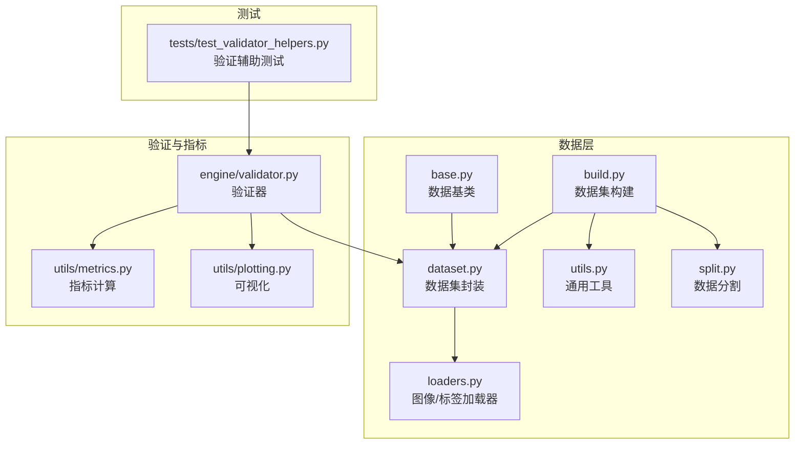

图示来源
- [ultralytics/data/base.py](file://ultralytics/data/base.py)
- [ultralytics/data/dataset.py](file://ultralytics/data/dataset.py)
- [ultralytics/data/loaders.py](file://ultralytics/data/loaders.py)
- [ultralytics/data/build.py](file://ultralytics/data/build.py)
- [ultralytics/data/utils.py](file://ultralytics/data/utils.py)
- [ultralytics/data/split.py](file://ultralytics/data/split.py)
- [ultralytics/engine/validator.py](file://ultralytics/engine/validator.py)
- [ultralytics/utils/metrics.py](file://ultralytics/utils/metrics.py)
- [ultralytics/utils/plotting.py](file://ultralytics/utils/plotting.py)
- [tests/test_validator_helpers.py](file://tests/test_validator_helpers.py)

章节来源
- [ultralytics/data/base.py](file://ultralytics/data/base.py)
- [ultralytics/data/dataset.py](file://ultralytics/data/dataset.py)
- [ultralytics/data/loaders.py](file://ultralytics/data/loaders.py)
- [ultralytics/data/build.py](file://ultralytics/data/build.py)
- [ultralytics/data/utils.py](file://ultralytics/data/utils.py)
- [ultralytics/data/split.py](file://ultralytics/data/split.py)
- [ultralytics/engine/validator.py](file://ultralytics/engine/validator.py)
- [ultralytics/utils/metrics.py](file://ultralytics/utils/metrics.py)
- [ultralytics/utils/plotting.py](file://ultralytics/utils/plotting.py)
- [tests/test_validator_helpers.py](file://tests/test_validator_helpers.py)

## 核心组件
- 数据基类与数据集封装：提供统一的样本访问接口、元数据管理与批量迭代能力，为验证与质量检查提供稳定输入。
- 加载器：负责图像与标签文件的读取、解析与基本格式校验（如尺寸、通道数、标签行结构）。
- 数据集构建器：整合路径、配置文件与分割策略，完成数据集装配与索引。
- 验证器：在验证阶段执行数据质量扫描、指标计算与结果汇总。
- 指标模块：实现类别分布、边界框几何质量、重叠度等统计。
- 可视化：将统计结果以图表形式输出，便于快速诊断。
- 分割工具：支持按文件列表或随机策略进行训练/验证/测试集划分。

章节来源
- [ultralytics/data/base.py](file://ultralytics/data/base.py)
- [ultralytics/data/dataset.py](file://ultralytics/data/dataset.py)
- [ultralytics/data/loaders.py](file://ultralytics/data/loaders.py)
- [ultralytics/data/build.py](file://ultralytics/data/build.py)
- [ultralytics/engine/validator.py](file://ultralytics/engine/validator.py)
- [ultralytics/utils/metrics.py](file://ultralytics/utils/metrics.py)
- [ultralytics/utils/plotting.py](file://ultralytics/utils/plotting.py)
- [ultralytics/data/split.py](file://ultralytics/data/split.py)

## 架构总览
数据验证与质量检查的整体流程如下：
- 构建阶段：通过构建器加载配置与路径，调用加载器解析图像与标签，执行基础完整性检查。
- 分割阶段：根据策略生成训练/验证/测试子集索引。
- 验证阶段：遍历数据集，执行更严格的质量检查与指标计算，并输出报告与可视化。

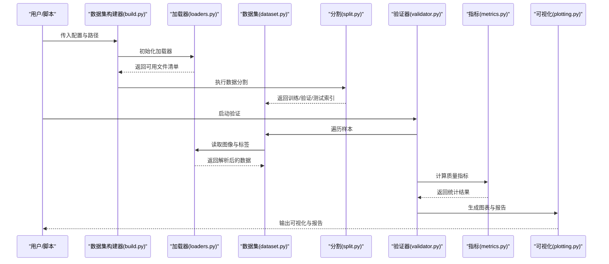

图示来源
- [ultralytics/data/build.py](file://ultralytics/data/build.py)
- [ultralytics/data/loaders.py](file://ultralytics/data/loaders.py)
- [ultralytics/data/dataset.py](file://ultralytics/data/dataset.py)
- [ultralytics/data/split.py](file://ultralytics/data/split.py)
- [ultralytics/engine/validator.py](file://ultralytics/engine/validator.py)
- [ultralytics/utils/metrics.py](file://ultralytics/utils/metrics.py)
- [ultralytics/utils/plotting.py](file://ultralytics/utils/plotting.py)

## 详细组件分析

### 数据完整性检查机制
- 文件存在性验证
  - 图像与标签路径有效性检查，缺失或不可读文件记录并跳过。
  - 目录结构与命名规范校验，确保构建器能正确索引。
- 标签格式检查
  - 每行标签字段数量、类别ID合法性、归一化范围检查。
  - 多任务标签（如关键点、多边形）的结构一致性校验。
- 坐标范围与几何约束
  - 边界框坐标是否在[0,1]范围内，是否满足宽高为正且不超过图像尺寸。
  - 重叠度与包含关系的合理性检查（可选）。

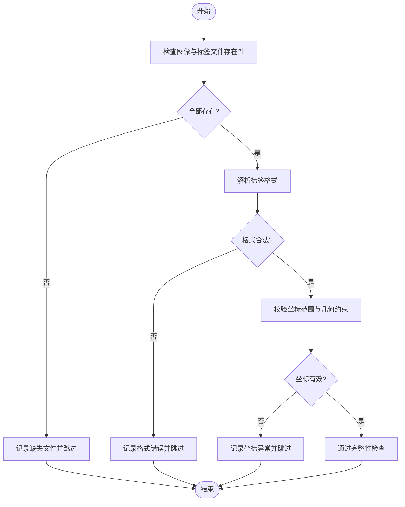

图示来源
- [ultralytics/data/loaders.py](file://ultralytics/data/loaders.py)
- [ultralytics/data/utils.py](file://ultralytics/data/utils.py)
- [ultralytics/data/dataset.py](file://ultralytics/data/dataset.py)

章节来源
- [ultralytics/data/loaders.py](file://ultralytics/data/loaders.py)
- [ultralytics/data/utils.py](file://ultralytics/data/utils.py)
- [ultralytics/data/dataset.py](file://ultralytics/data/dataset.py)

### 数据质量评估指标
- 标注一致性
  - 同一图像内重复标注、冲突类别、越界标注的检测。
  - 跨批次的一致性统计，用于发现系统性问题。
- 类别平衡性
  - 各类别样本计数与占比，长尾分布识别。
  - 不平衡阈值告警与采样建议。
- 边界框质量
  - 面积分布、纵横比分布、过小/过大框比例。
  - 重叠度与NMS友好性评估。

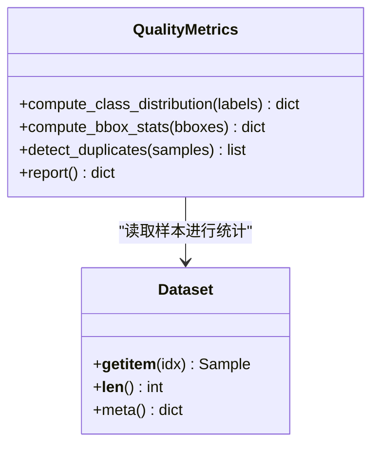

图示来源
- [ultralytics/utils/metrics.py](file://ultralytics/utils/metrics.py)
- [ultralytics/data/dataset.py](file://ultralytics/data/dataset.py)

章节来源
- [ultralytics/utils/metrics.py](file://ultralytics/utils/metrics.py)
- [ultralytics/data/dataset.py](file://ultralytics/data/dataset.py)

### 数据分割策略
- 划分方法
  - 基于文件列表的确定性划分，保证可复现。
  - 随机划分策略，支持固定种子以保证可复现实验。
- 比例控制
  - 训练/验证/测试比例可调，支持留一法或分层抽样（按类别）。
- 交叉验证
  - K折交叉验证支持，便于模型稳定性评估。

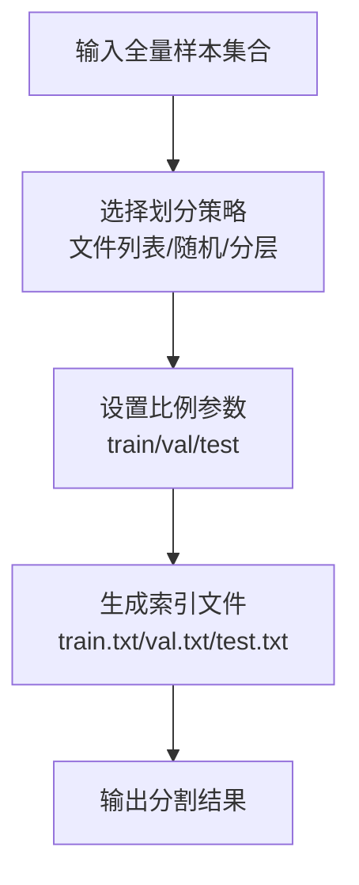

图示来源
- [ultralytics/data/split.py](file://ultralytics/data/split.py)

章节来源
- [ultralytics/data/split.py](file://ultralytics/data/split.py)

### 数据去重与重复检测
- 路径级去重
  - 基于绝对路径或相对路径的唯一性检查，避免重复索引。
- 内容级去重
  - 基于图像哈希或指纹的相似度检测，识别视觉重复样本。
- 标签级去重
  - 相同图像+相同标签组合的去重，防止数据泄露。

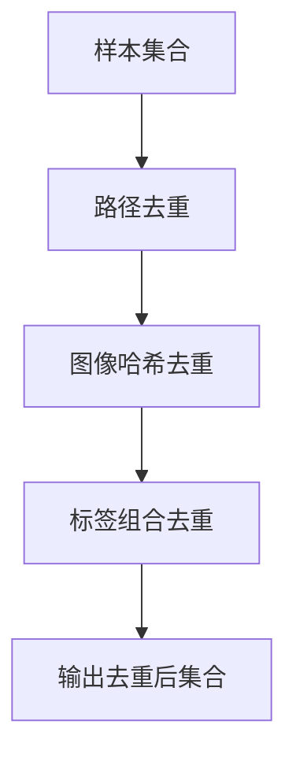

图示来源
- [ultralytics/data/utils.py](file://ultralytics/data/utils.py)
- [ultralytics/data/dataset.py](file://ultralytics/data/dataset.py)

章节来源
- [ultralytics/data/utils.py](file://ultralytics/data/utils.py)
- [ultralytics/data/dataset.py](file://ultralytics/data/dataset.py)

### 数据清洗工具与异常值处理
- 异常类型
  - 损坏图像、空标签、非法类别ID、越界坐标、极端纵横比。
- 处理策略
  - 自动过滤与记录，保留审计日志以便回溯。
  - 可选修复：裁剪无效区域、修正归一化、合并相邻小框。
- 批处理与并行
  - 支持多线程/多进程加速清洗流程。

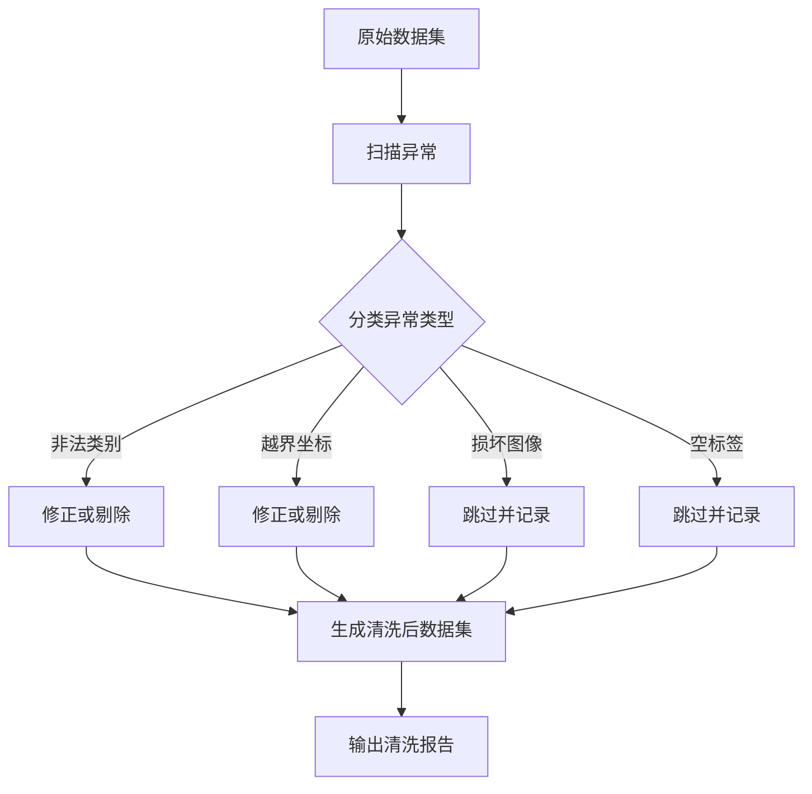

图示来源
- [ultralytics/data/loaders.py](file://ultralytics/data/loaders.py)
- [ultralytics/data/utils.py](file://ultralytics/data/utils.py)

章节来源
- [ultralytics/data/loaders.py](file://ultralytics/data/loaders.py)
- [ultralytics/data/utils.py](file://ultralytics/data/utils.py)

### 数据质量报告与可视化
- 报告内容
  - 完整性检查结果、质量指标统计、异常明细与修复建议。
- 可视化
  - 类别分布直方图、边界框面积/纵横比分布、重复率趋势。
- 输出格式
  - JSON/CSV结构化报告，PNG/SVG图表文件。

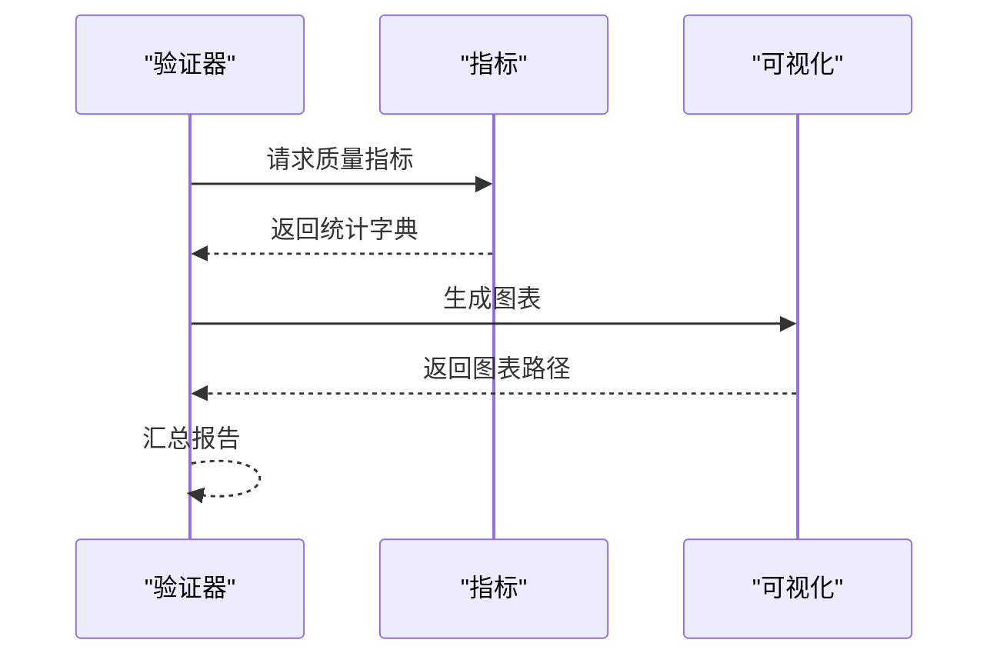

图示来源
- [ultralytics/engine/validator.py](file://ultralytics/engine/validator.py)
- [ultralytics/utils/metrics.py](file://ultralytics/utils/metrics.py)
- [ultralytics/utils/plotting.py](file://ultralytics/utils/plotting.py)

章节来源
- [ultralytics/engine/validator.py](file://ultralytics/engine/validator.py)
- [ultralytics/utils/metrics.py](file://ultralytics/utils/metrics.py)
- [ultralytics/utils/plotting.py](file://ultralytics/utils/plotting.py)

### 配置选项与自定义检查规则扩展
- 配置项
  - 数据路径、分割比例、去重阈值、异常容忍度、报告输出目录。
- 扩展点
  - 自定义加载器：继承基础加载器，注入特定格式的解析逻辑。
  - 自定义检查器：注册新的完整性或质量检查规则，并在验证流程中启用。
  - 自定义指标：实现新的统计函数，集成到指标模块。
- 测试支撑
  - 使用测试用例验证自定义规则的正确性与鲁棒性。

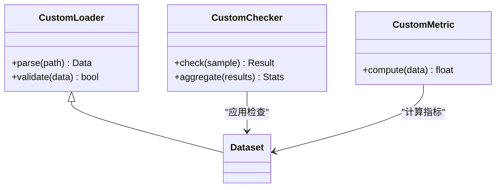

图示来源
- [ultralytics/data/loaders.py](file://ultralytics/data/loaders.py)
- [ultralytics/data/dataset.py](file://ultralytics/data/dataset.py)
- [ultralytics/utils/metrics.py](file://ultralytics/utils/metrics.py)
- [tests/test_validator_helpers.py](file://tests/test_validator_helpers.py)

章节来源
- [ultralytics/data/loaders.py](file://ultralytics/data/loaders.py)
- [ultralytics/data/dataset.py](file://ultralytics/data/dataset.py)
- [ultralytics/utils/metrics.py](file://ultralytics/utils/metrics.py)
- [tests/test_validator_helpers.py](file://tests/test_validator_helpers.py)

### 常见数据质量问题与修复流程
- 问题类型
  - 缺失文件、标签格式不一致、类别ID越界、坐标越界、重复样本。
- 检测流程
  - 完整性检查→质量指标→异常明细→报告输出。
- 修复建议
  - 补全缺失文件、统一标签格式、修正类别映射、裁剪或剔除异常框、去重。
- 回归验证
  - 修复后重新运行验证，确认问题已解决且未引入新问题。

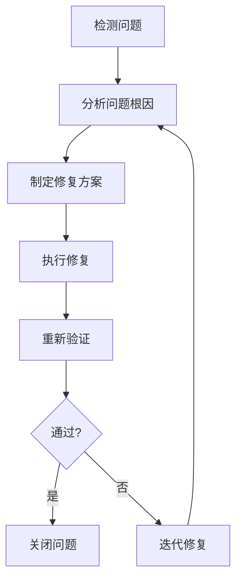

章节来源
- [ultralytics/engine/validator.py](file://ultralytics/engine/validator.py)
- [ultralytics/utils/metrics.py](file://ultralytics/utils/metrics.py)

## 依赖关系分析
- 组件耦合
  - 验证器依赖数据集与指标模块；数据集依赖加载器与工具；可视化独立但被验证器调用。
- 外部依赖
  - 图像处理库、数值计算库、绘图库等（由底层模块间接引入）。
- 循环依赖
  - 当前设计避免循环依赖，职责清晰分离。

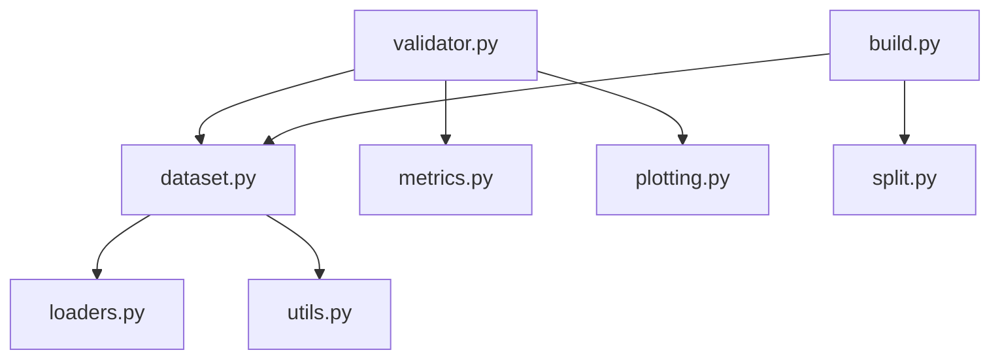

图示来源
- [ultralytics/engine/validator.py](file://ultralytics/engine/validator.py)
- [ultralytics/data/dataset.py](file://ultralytics/data/dataset.py)
- [ultralytics/data/loaders.py](file://ultralytics/data/loaders.py)
- [ultralytics/data/utils.py](file://ultralytics/data/utils.py)
- [ultralytics/data/build.py](file://ultralytics/data/build.py)
- [ultralytics/data/split.py](file://ultralytics/data/split.py)
- [ultralytics/utils/metrics.py](file://ultralytics/utils/metrics.py)
- [ultralytics/utils/plotting.py](file://ultralytics/utils/plotting.py)

章节来源
- [ultralytics/engine/validator.py](file://ultralytics/engine/validator.py)
- [ultralytics/data/dataset.py](file://ultralytics/data/dataset.py)
- [ultralytics/data/loaders.py](file://ultralytics/data/loaders.py)
- [ultralytics/data/utils.py](file://ultralytics/data/utils.py)
- [ultralytics/data/build.py](file://ultralytics/data/build.py)
- [ultralytics/data/split.py](file://ultralytics/data/split.py)
- [ultralytics/utils/metrics.py](file://ultralytics/utils/metrics.py)
- [ultralytics/utils/plotting.py](file://ultralytics/utils/plotting.py)

## 性能考量
- 并行加载与校验：利用多线程/多进程提升I/O与解析效率。
- 增量检查：仅对变更样本执行检查，减少重复开销。
- 内存管理：按需加载与缓存策略，避免一次性载入全量数据。
- 指标计算优化：向量化操作与分块统计，降低CPU/GPU压力。

## 故障排查指南
- 常见问题
  - 路径错误或权限不足导致无法读取文件。
  - 标签格式不匹配引发解析失败。
  - 坐标越界导致后续训练不稳定。
- 定位步骤
  - 查看完整性检查日志与异常明细。
  - 使用可视化图表快速定位异常分布。
  - 通过测试用例复现与隔离问题。
- 修复与回归
  - 依据报告建议进行修复，重新运行验证确保问题解决。

章节来源
- [tests/test_validator_helpers.py](file://tests/test_validator_helpers.py)
- [ultralytics/engine/validator.py](file://ultralytics/engine/validator.py)

## 结论
YOLO-Master的数据验证与质量检查系统提供了从完整性校验、质量评估、分割策略到去重清洗与报告可视化的完整闭环。通过模块化设计与可扩展的检查规则，用户可根据具体场景定制验证流程，保障数据质量与训练稳定性。

## 附录
- 术语表
  - 完整性检查：确保数据文件与标签格式符合预期。
  - 质量指标：衡量数据一致性与分布特征的统计量。
  - 分割策略：将全量数据划分为训练/验证/测试子集的方法。
  - 去重：识别并移除重复样本的过程。
  - 异常值：偏离正常范围的样本或标注。