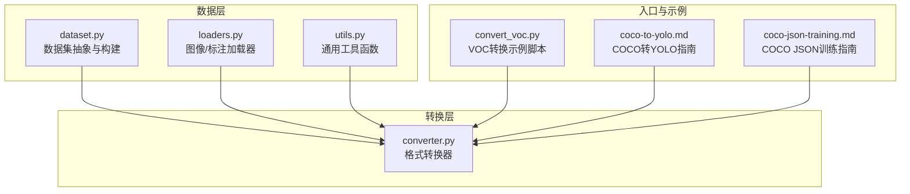
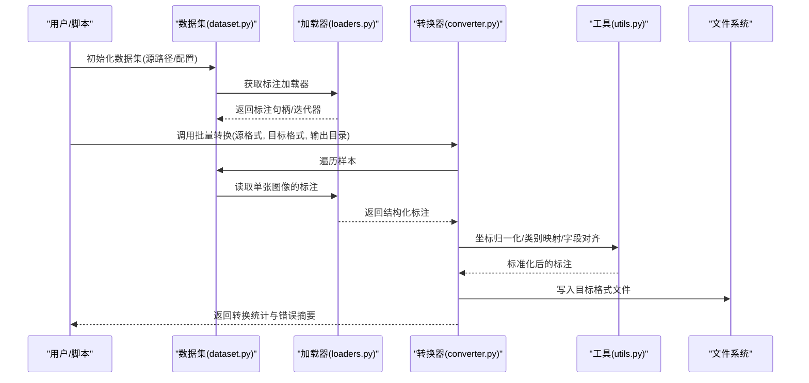
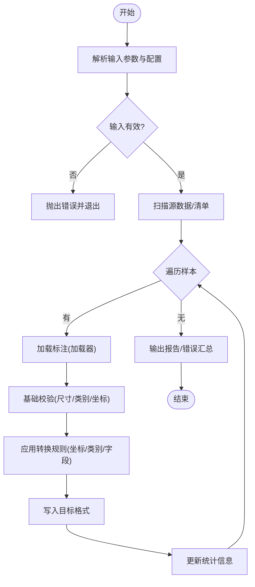
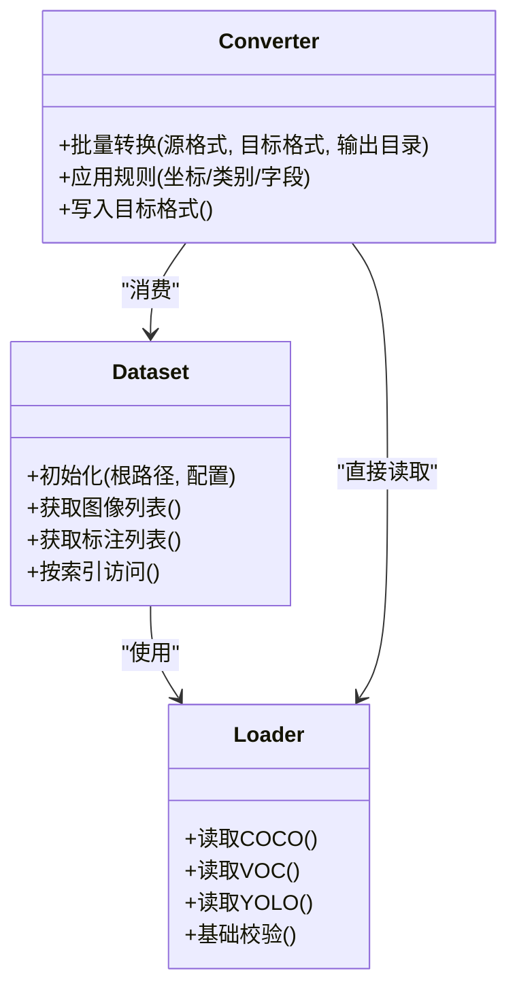
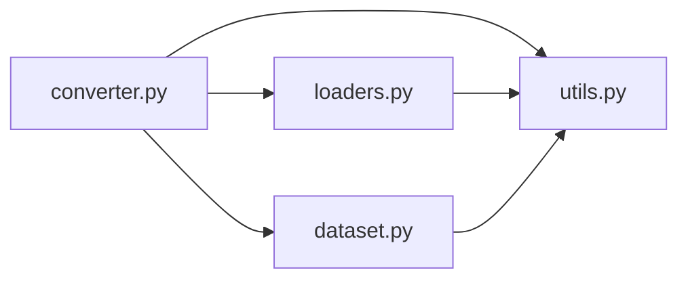

# 格式转换工具

<cite>
**本文引用的文件**
- [ultralytics/data/converter.py](file://ultralytics/data/converter.py)
- [ultralytics/data/dataset.py](file://ultralytics/data/dataset.py)
- [ultralytics/data/loaders.py](file://ultralytics/data/loaders.py)
- [ultralytics/data/utils.py](file://ultralytics/data/utils.py)
- [scripts/convert_voc.py](file://scripts/convert_voc.py)
- [docs/en/guides/coco-to-yolo.md](file://docs/en/guides/coco-to-yolo.md)
- [docs/en/guides/coco-json-training.md](file://docs/en/guides/coco-json-training.md)
</cite>

## 目录
1. [简介](#简介)
2. [项目结构](#项目结构)
3. [核心组件](#核心组件)
4. [架构总览](#架构总览)
5. [详细组件分析](#详细组件分析)
6. [依赖关系分析](#依赖关系分析)
7. [性能考虑](#性能考虑)
8. [故障排查指南](#故障排查指南)
9. [结论](#结论)
10. [附录](#附录)

## 简介
本文件面向YOLO-Master的格式转换工具，系统性说明支持的输入输出格式（YOLO、COCO、VOC/Pascal VOC、ImageNet等）、标签结构与坐标系统差异、批量转换的命令行与Python API用法、自定义格式定义与转换规则配置、数据验证与错误处理机制、常见问题解决方案与调试技巧、性能优化建议与最佳实践，以及兼容性矩阵与版本迁移指南。文档以仓库现有实现为依据，力求准确、可操作且易于理解。

## 项目结构
与格式转换相关的代码主要位于以下位置：
- 核心转换逻辑与通用工具：ultralytics/data/converter.py、ultralytics/data/utils.py
- 数据集加载与解析：ultralytics/data/dataset.py、ultralytics/data/loaders.py
- 示例脚本：scripts/convert_voc.py
- 官方指南：docs/en/guides/coco-to-yolo.md、docs/en/guides/coco-json-training.md

图表来源
- [ultralytics/data/converter.py](file://ultralytics/data/converter.py)
- [ultralytics/data/dataset.py](file://ultralytics/data/dataset.py)
- [ultralytics/data/loaders.py](file://ultralytics/data/loaders.py)
- [ultralytics/data/utils.py](file://ultralytics/data/utils.py)
- [scripts/convert_voc.py](file://scripts/convert_voc.py)
- [docs/en/guides/coco-to-yolo.md](file://docs/en/guides/coco-to-yolo.md)
- [docs/en/guides/coco-json-training.md](file://docs/en/guides/coco-json-training.md)

章节来源
- [ultralytics/data/converter.py](file://ultralytics/data/converter.py)
- [ultralytics/data/dataset.py](file://ultralytics/data/dataset.py)
- [ultralytics/data/loaders.py](file://ultralytics/data/loaders.py)
- [ultralytics/data/utils.py](file://ultralytics/data/utils.py)
- [scripts/convert_voc.py](file://scripts/convert_voc.py)
- [docs/en/guides/coco-to-yolo.md](file://docs/en/guides/coco-to-yolo.md)
- [docs/en/guides/coco-json-training.md](file://docs/en/guides/coco-json-training.md)

## 核心组件
- 转换器（converter.py）
  - 提供统一的格式转换接口，支持多源到目标格式的映射与写入。
  - 负责读取不同格式的标注，进行坐标归一化/反归一化、类别映射、边界框/关键点/分割掩码等结构的对齐。
  - 暴露批量转换能力，支持目录扫描、并发控制与进度反馈。
- 数据集与加载器（dataset.py、loaders.py）
  - dataset.py：封装数据集对象，统一访问图像路径与标注信息，为转换流程提供稳定输入。
  - loaders.py：实现具体格式的读取器（如COCO JSON、VOC XML、YOLO txt），并做基础校验与容错。
- 工具库（utils.py）
  - 提供坐标变换、尺寸计算、路径解析、IO辅助、日志与异常包装等通用能力。
- 示例脚本（convert_voc.py）
  - 演示如何调用转换器完成VOC到YOLO的批量转换，包括参数设置与输出组织。
- 官方指南（coco-to-yolo.md、coco-json-training.md）
  - 给出COCO到YOLO的完整工作流、注意事项与最佳实践。

章节来源
- [ultralytics/data/converter.py](file://ultralytics/data/converter.py)
- [ultralytics/data/dataset.py](file://ultralytics/data/dataset.py)
- [ultralytics/data/loaders.py](file://ultralytics/data/loaders.py)
- [ultralytics/data/utils.py](file://ultralytics/data/utils.py)
- [scripts/convert_voc.py](file://scripts/convert_voc.py)
- [docs/en/guides/coco-to-yolo.md](file://docs/en/guides/coco-to-yolo.md)
- [docs/en/guides/coco-json-training.md](file://docs/en/guides/coco-json-training.md)

## 架构总览
下图展示了从原始标注到目标格式的端到端转换流程，涵盖读取、校验、转换、写入与结果统计。

图表来源
- [ultralytics/data/dataset.py](file://ultralytics/data/dataset.py)
- [ultralytics/data/loaders.py](file://ultralytics/data/loaders.py)
- [ultralytics/data/converter.py](file://ultralytics/data/converter.py)
- [ultralytics/data/utils.py](file://ultralytics/data/utils.py)

## 详细组件分析

### 转换器（converter.py）
- 职责
  - 统一入口：接收“源格式→目标格式”的配置，执行批量转换。
  - 格式适配：将不同标注结构转换为内部统一表示，再序列化为目标格式。
  - 批处理：支持按目录或清单批量处理，具备并发与进度提示。
- 关键流程
  - 解析输入：校验源目录/清单、目标目录、类别表、坐标系统等。
  - 读取标注：通过加载器逐条读取，进行基础合法性检查。
  - 转换规则：应用坐标缩放/归一化、类别ID映射、缺失字段填充。
  - 写入输出：按目标格式规范生成文件，记录统计信息。
- 扩展点
  - 新增格式：在加载器中注册新的读取器，并在转换器中补充对应写入器。
  - 自定义规则：通过配置注入类别映射、坐标系统、字段别名等。

图表来源
- [ultralytics/data/converter.py](file://ultralytics/data/converter.py)
- [ultralytics/data/loaders.py](file://ultralytics/data/loaders.py)
- [ultralytics/data/utils.py](file://ultralytics/data/utils.py)

章节来源
- [ultralytics/data/converter.py](file://ultralytics/data/converter.py)

### 数据集与加载器（dataset.py、loaders.py）
- dataset.py
  - 提供数据集抽象，统一图像与标注的访问方式，便于转换器复用。
  - 负责路径解析、索引构建、元数据缓存等。
- loaders.py
  - 实现各格式的读取器（例如COCO JSON、VOC XML、YOLO TXT）。
  - 对每条标注进行基础校验（如类别存在性、坐标范围、文件可达性）。
  - 返回标准化的数据结构供转换器使用。

图表来源
- [ultralytics/data/dataset.py](file://ultralytics/data/dataset.py)
- [ultralytics/data/loaders.py](file://ultralytics/data/loaders.py)
- [ultralytics/data/converter.py](file://ultralytics/data/converter.py)

章节来源
- [ultralytics/data/dataset.py](file://ultralytics/data/dataset.py)
- [ultralytics/data/loaders.py](file://ultralytics/data/loaders.py)

### 工具库（utils.py）
- 坐标系统转换
  - 绝对坐标↔相对坐标（[0,1]）互转，支持宽高归一化。
  - 旋转框、关键点、多边形掩码的坐标规范化。
- 类别映射
  - 名称→ID、ID→名称的双向映射，支持别名与去重。
- IO与路径
  - 安全路径拼接、目录创建、文件存在性检查。
- 日志与异常
  - 结构化日志输出、异常包装与上下文附加。

章节来源
- [ultralytics/data/utils.py](file://ultralytics/data/utils.py)

### 示例脚本（convert_voc.py）
- 功能
  - 演示如何将Pascal VOC数据集批量转换为YOLO格式。
  - 展示命令行参数（输入目录、输出目录、类别文件、是否包含验证集等）。
- 使用要点
  - 确保VOC目录结构符合预期（JPEGImages、Annotations等）。
  - 指定类别文件以建立名称与ID的映射。
  - 转换完成后检查输出目录中的txt标注与图片组织。

章节来源
- [scripts/convert_voc.py](file://scripts/convert_voc.py)

### 官方指南（coco-to-yolo.md、coco-json-training.md）
- coco-to-yolo.md
  - 详细说明COCO JSON到YOLO TXT的转换步骤、注意事项与常见坑。
  - 强调坐标系统与类别映射的一致性。
- coco-json-training.md
  - 介绍如何在训练中使用COCO JSON，以及何时需要转换为YOLO格式。
  - 提供数据准备与验证的最佳实践。

章节来源
- [docs/en/guides/coco-to-yolo.md](file://docs/en/guides/coco-to-yolo.md)
- [docs/en/guides/coco-json-training.md](file://docs/en/guides/coco-json-training.md)

## 依赖关系分析
- 模块耦合
  - converter.py强依赖dataset.py与loaders.py提供的数据访问能力。
  - utils.py被converter.py与loaders.py共同复用，降低重复实现。
- 外部依赖
  - 标准库（JSON/XML/路径/IO）用于读写各类标注。
  - 可选第三方库（如图像处理库）用于尺寸检测与校验。
- 潜在循环依赖
  - 当前设计通过分层（数据层/转换层/工具层）避免循环依赖。

图表来源
- [ultralytics/data/converter.py](file://ultralytics/data/converter.py)
- [ultralytics/data/dataset.py](file://ultralytics/data/dataset.py)
- [ultralytics/data/loaders.py](file://ultralytics/data/loaders.py)
- [ultralytics/data/utils.py](file://ultralytics/data/utils.py)

章节来源
- [ultralytics/data/converter.py](file://ultralytics/data/converter.py)
- [ultralytics/data/dataset.py](file://ultralytics/data/dataset.py)
- [ultralytics/data/loaders.py](file://ultralytics/data/loaders.py)
- [ultralytics/data/utils.py](file://ultralytics/data/utils.py)

## 性能考虑
- I/O优化
  - 使用并行读取与写入，合理设置并发度以避免磁盘瓶颈。
  - 预分配输出目录结构，减少运行时创建开销。
- 内存管理
  - 采用流式处理，避免一次性加载全部标注到内存。
  - 及时释放中间对象，防止大对象驻留。
- 计算优化
  - 批量坐标变换与类别映射，减少重复计算。
  - 利用缓存（如类别映射表、路径索引）提升二次运行速度。
- 监控与诊断
  - 输出详细的转换统计（成功/失败数量、耗时、错误类型分布）。
  - 提供断点续转能力，支持中断后继续处理。

## 故障排查指南
- 常见问题
  - 坐标越界或负值：检查图像尺寸与标注一致性，确认归一化是否正确。
  - 类别缺失或ID不连续：核对类别文件，确保名称与ID一一对应。
  - 文件路径错误：确认源目录结构、符号链接与权限。
  - 格式不一致：严格遵循目标格式规范（字段名、顺序、小数精度）。
- 定位方法
  - 启用详细日志，查看具体失败的样本与原因。
  - 使用最小复现集快速验证问题。
  - 对比参考输出（如官方示例）定位差异。
- 恢复策略
  - 跳过错误样本并记录，保证整体任务完成。
  - 提供重试机制与幂等写入，避免重复处理。

章节来源
- [ultralytics/data/converter.py](file://ultralytics/data/converter.py)
- [ultralytics/data/loaders.py](file://ultralytics/data/loaders.py)
- [ultralytics/data/utils.py](file://ultralytics/data/utils.py)

## 结论
YOLO-Master的格式转换工具通过清晰的分层设计与可扩展的加载器/写入器体系，提供了稳定高效的跨格式转换能力。配合官方指南与示例脚本，用户可以快速完成COCO、VOC、YOLO等主流格式的互转，并通过配置化规则支持自定义格式。建议在大规模数据转换时关注I/O与内存占用，结合日志与统计信息进行持续优化。

## 附录

### 支持的输入输出格式与坐标系统
- YOLO
  - 文本标注，每行一个目标；字段通常为类别ID与归一化中心x、y、宽、高。
  - 坐标系统：相对坐标[0,1]，基于图像宽高归一化。
- COCO
  - JSON结构，包含图像信息与目标列表；bbox为[x,y,w,h]绝对坐标。
  - 坐标系统：绝对像素坐标，左上角原点。
- Pascal VOC
  - XML标注，包含图像尺寸与多个目标；bbox为xmin,xmax,ymin,ymax绝对坐标。
  - 坐标系统：绝对像素坐标，左上角原点。
- ImageNet
  - 分类任务为主，通常不包含边界框；若涉及检测需额外标注。
  - 坐标系统：不适用（分类场景）。

注意：不同格式间的关键差异在于坐标系统（绝对vs相对）与字段命名/顺序。转换时需进行严格的归一化/反归一化与字段对齐。

章节来源
- [docs/en/guides/coco-to-yolo.md](file://docs/en/guides/coco-to-yolo.md)
- [docs/en/guides/coco-json-training.md](file://docs/en/guides/coco-json-training.md)

### 命令行接口与Python API
- 命令行
  - 典型参数：输入目录、输出目录、源格式、目标格式、类别文件、并发数、是否覆盖输出。
  - 示例脚本：scripts/convert_voc.py演示了VOC→YOLO的常用用法。
- Python API
  - 通过导入转换器模块，实例化并调用批量转换方法。
  - 支持传入配置字典（类别映射、坐标系统、字段别名等）。
  - 返回统计信息（成功/失败计数、耗时、错误列表）。

章节来源
- [scripts/convert_voc.py](file://scripts/convert_voc.py)
- [ultralytics/data/converter.py](file://ultralytics/data/converter.py)

### 自定义格式定义与转换规则配置
- 自定义格式
  - 在加载器中注册新的读取器，实现字段解析与基础校验。
  - 在转换器中补充对应的写入器，确保输出符合目标规范。
- 转换规则
  - 类别映射：名称→ID、ID→名称、别名合并。
  - 坐标系统：绝对↔相对、原点与方向约定。
  - 字段别名：兼容历史字段名，自动映射到新结构。
- 配置方式
  - 通过配置文件或参数传入，支持局部覆盖默认规则。

章节来源
- [ultralytics/data/loaders.py](file://ultralytics/data/loaders.py)
- [ultralytics/data/converter.py](file://ultralytics/data/converter.py)
- [ultralytics/data/utils.py](file://ultralytics/data/utils.py)

### 数据验证与错误处理机制
- 数据验证
  - 图像可达性与尺寸一致性检查。
  - 标注完整性（必填字段、数值范围、类别有效性）。
  - 格式合规性（键名、顺序、数据类型）。
- 错误处理
  - 捕获并记录异常，附带上下文（文件路径、样本索引、错误类型）。
  - 支持跳过错误样本、重试与断点续转。
  - 输出错误摘要与修复建议。

章节来源
- [ultralytics/data/loaders.py](file://ultralytics/data/loaders.py)
- [ultralytics/data/utils.py](file://ultralytics/data/utils.py)
- [ultralytics/data/converter.py](file://ultralytics/data/converter.py)

### 兼容性矩阵与版本迁移指南
- 兼容性矩阵
  - 列出各版本对COCO/VOC/YOLO的支持情况与已知限制。
  - 标注坐标系统差异与字段变更。
- 迁移指南
  - 从旧版COCO结构迁移至新版：字段重命名、新增必填项。
  - 从VOC旧版XML迁移：属性调整、命名空间变化。
  - 从YOLO旧版txt迁移：字段顺序、归一化约定。
- 回滚策略
  - 保留原始数据与转换日志，便于回溯与对比。
  - 提供一键回退脚本，恢复上一版本输出。

章节来源
- [docs/en/guides/coco-to-yolo.md](file://docs/en/guides/coco-to-yolo.md)
- [docs/en/guides/coco-json-training.md](file://docs/en/guides/coco-json-training.md)