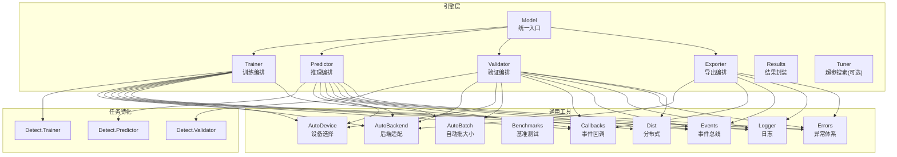
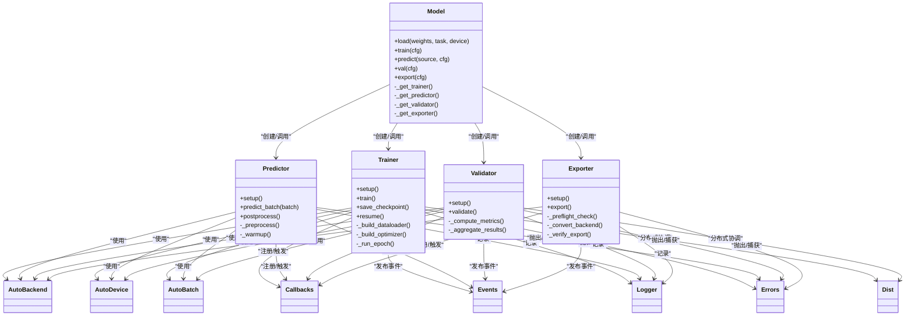
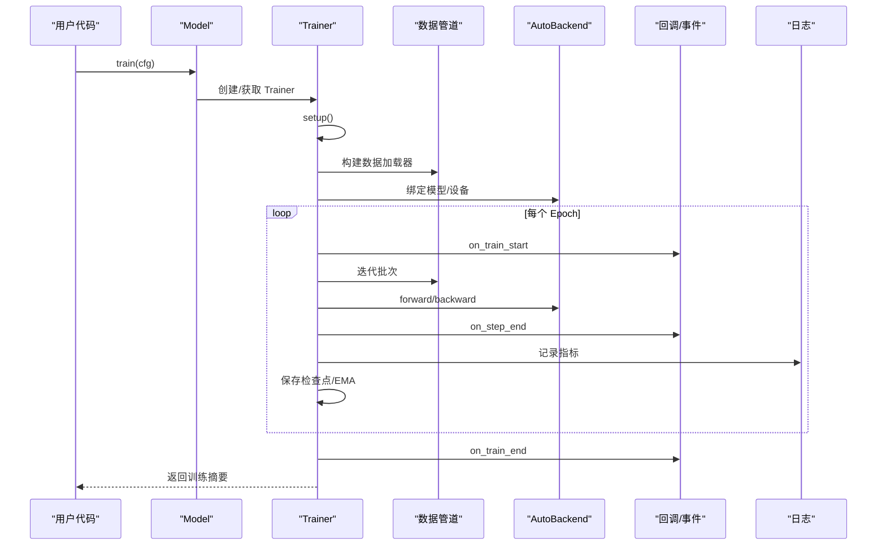
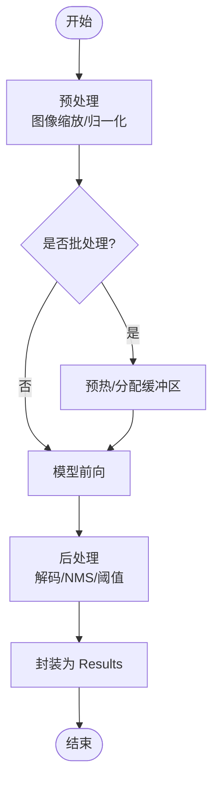
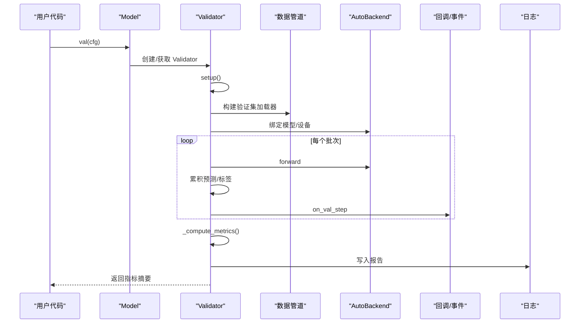
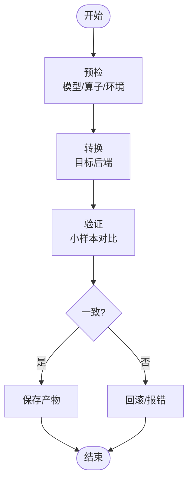
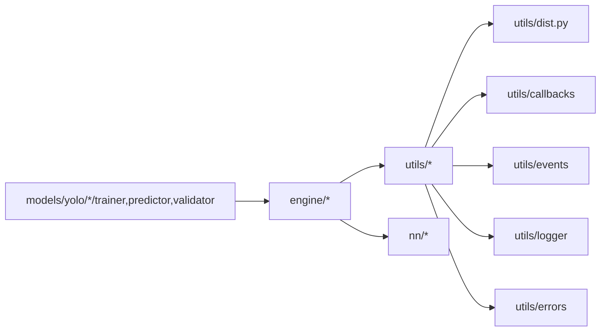

# 引擎层设计

<cite>
**本文引用的文件**
- [engine/__init__.py](file://ultralytics/engine/__init__.py)
- [engine/model.py](file://ultralytics/engine/model.py)
- [engine/trainer.py](file://ultralytics/engine/trainer.py)
- [engine/predictor.py](file://ultralytics/engine/predictor.py)
- [engine/validator.py](file://ultralytics/engine/validator.py)
- [engine/exporter.py](file://ultralytics/engine/exporter.py)
- [engine/results.py](file://ultralytics/engine/results.py)
- [engine/tuner.py](file://ultralytics/engine/tuner.py)
- [utils/autobackend.py](file://ultralytics/utils/autobackend.py)
- [utils/autodevice.py](file://ultralytics/utils/autodevice.py)
- [utils/autobatch.py](file://ultralytics/utils/autobatch.py)
- [utils/benchmarks.py](file://ultralytics/utils/benchmarks.py)
- [utils/callbacks/__init__.py](file://ultralytics/utils/callbacks/__init__.py)
- [utils/events.py](file://ultralytics/utils/events.py)
- [utils/logger.py](file://ultralytics/utils/logger.py)
- [utils/errors.py](file://ultralytics/utils/errors.py)
- [utils/dist.py](file://ultralytics/utils/dist.py)
- [models/yolo/detect/trainer.py](file://ultralytics/models/yolo/detect/trainer.py)
- [models/yolo/detect/predictor.py](file://ultralytics/models/yolo/detect/predictor.py)
- [models/yolo/detect/validator.py](file://ultralytics/models/yolo/detect/validator.py)
- [nn/autobackend.py](file://ultralytics/nn/autobackend.py)
</cite>

## 目录
1. [简介](#简介)
2. [项目结构](#项目结构)
3. [核心组件](#核心组件)
4. [架构总览](#架构总览)
5. [详细组件分析](#详细组件分析)
6. [依赖关系分析](#依赖关系分析)
7. [性能考量](#性能考量)
8. [故障排查指南](#故障排查指南)
9. [结论](#结论)
10. [附录：使用示例与最佳实践](#附录使用示例与最佳实践)

## 简介
本文件聚焦于 YOLO-Master 框架的“引擎层”设计与实现，围绕 Model、Trainer、Predictor、Validator、Exporter 等核心组件的职责边界、协作机制、生命周期管理、状态维护与错误处理策略展开。文档同时给出训练、推理、验证、导出四大流程的控制流说明，并补充内存管理、GPU 资源调度与并发处理的实现要点，以及性能优化建议与最佳实践。

## 项目结构
引擎层位于 ultralytics/engine 目录下，提供统一的模型封装与任务编排能力；具体任务的 Trainer/Predictor/Validator 在 models/yolo/<task>/ 下以任务特化形式存在；通用工具（设备、后端、批大小、基准、回调、日志、分布式）位于 utils/ 与 nn/ 子包中。

图表来源
- [engine/model.py:1-200](file://ultralytics/engine/model.py#L1-L200)
- [engine/trainer.py:1-200](file://ultralytics/engine/trainer.py#L1-L200)
- [engine/predictor.py:1-200](file://ultralytics/engine/predictor.py#L1-L200)
- [engine/validator.py:1-200](file://ultralytics/engine/validator.py#L1-L200)
- [engine/exporter.py:1-200](file://ultralytics/engine/exporter.py#L1-L200)
- [engine/results.py:1-200](file://ultralytics/engine/results.py#L1-L200)
- [engine/tuner.py:1-200](file://ultralytics/engine/tuner.py#L1-L200)
- [utils/autobackend.py:1-200](file://ultralytics/utils/autobackend.py#L1-L200)
- [utils/autodevice.py:1-200](file://ultralytics/utils/autodevice.py#L1-L200)
- [utils/autobatch.py:1-200](file://ultralytics/utils/autobatch.py#L1-L200)
- [utils/benchmarks.py:1-200](file://ultralytics/utils/benchmarks.py#L1-L200)
- [utils/callbacks/__init__.py:1-200](file://ultralytics/utils/callbacks/__init__.py#L1-L200)
- [utils/events.py:1-200](file://ultralytics/utils/events.py#L1-L200)
- [utils/logger.py:1-200](file://ultralytics/utils/logger.py#L1-L200)
- [utils/errors.py:1-200](file://ultralytics/utils/errors.py#L1-L200)
- [utils/dist.py:1-200](file://ultralytics/utils/dist.py#L1-L200)
- [models/yolo/detect/trainer.py:1-200](file://ultralytics/models/yolo/detect/trainer.py#L1-L200)
- [models/yolo/detect/predictor.py:1-200](file://ultralytics/models/yolo/detect/predictor.py#L1-L200)
- [models/yolo/detect/validator.py:1-200](file://ultralytics/models/yolo/detect/validator.py#L1-L200)
- [nn/autobackend.py:1-200](file://ultralytics/nn/autobackend.py#L1-L200)

章节来源
- [engine/__init__.py:1-200](file://ultralytics/engine/__init__.py#L1-L200)
- [engine/model.py:1-200](file://ultralytics/engine/model.py#L1-L200)

## 核心组件
- Model：统一入口，负责加载权重、构建或装载模型、分发到不同模式（train/predict/val/export），并提供高层 API。内部持有对应模式的实例（Trainer/Predictor/Validator/Exporter）。
- Trainer：训练编排器，负责数据加载、优化器/学习率调度、损失计算、EMA、检查点、日志与回调、分布式协调等。
- Predictor：推理编排器，负责预处理、批量推理、后处理（NMS/解码）、可视化与结果封装。
- Validator：验证编排器，负责数据集遍历、指标统计、混淆矩阵/AP 计算、结果汇总与报告生成。
- Exporter：导出编排器，负责将 PyTorch 模型转换为 ONNX/TensorRT/OpenVINO/CoreML 等目标格式，并进行导出前校验与导出后验证。
- Results：推理/验证结果的统一数据结构，便于序列化、可视化与下游消费。
- Tuner（可选）：基于回调与事件系统的超参数搜索与实验管理。

职责分离原则
- 输入/输出契约清晰：各组件通过配置对象与结果对象交互，避免直接耦合。
- 关注点分离：Model 只做路由与装配；Trainer/Predictor/Validator/Exporter 各自专注单一任务的生命周期。
- 可扩展性：通过继承与组合扩展任务特化逻辑，并通过回调/事件系统注入横切关注点（日志、监控、断点续训等）。

章节来源
- [engine/model.py:1-200](file://ultralytics/engine/model.py#L1-L200)
- [engine/trainer.py:1-200](file://ultralytics/engine/trainer.py#L1-L200)
- [engine/predictor.py:1-200](file://ultralytics/engine/predictor.py#L1-L200)
- [engine/validator.py:1-200](file://ultralytics/engine/validator.py#L1-L200)
- [engine/exporter.py:1-200](file://ultralytics/engine/exporter.py#L1-L200)
- [engine/results.py:1-200](file://ultralytics/engine/results.py#L1-L200)
- [engine/tuner.py:1-200](file://ultralytics/engine/tuner.py#L1-L200)

## 架构总览
下图展示引擎层与任务特化、通用工具之间的交互关系，体现“统一入口 + 多模式编排 + 工具复用”的设计。

图表来源
- [engine/model.py:1-200](file://ultralytics/engine/model.py#L1-L200)
- [engine/trainer.py:1-200](file://ultralytics/engine/trainer.py#L1-L200)
- [engine/predictor.py:1-200](file://ultralytics/engine/predictor.py#L1-L200)
- [engine/validator.py:1-200](file://ultralytics/engine/validator.py#L1-L200)
- [engine/exporter.py:1-200](file://ultralytics/engine/exporter.py#L1-L200)
- [utils/autobackend.py:1-200](file://ultralytics/utils/autobackend.py#L1-L200)
- [utils/autodevice.py:1-200](file://ultralytics/utils/autodevice.py#L1-L200)
- [utils/autobatch.py:1-200](file://ultralytics/utils/autobatch.py#L1-L200)
- [utils/callbacks/__init__.py:1-200](file://ultralytics/utils/callbacks/__init__.py#L1-L200)
- [utils/events.py:1-200](file://ultralytics/utils/events.py#L1-L200)
- [utils/logger.py:1-200](file://ultralytics/utils/logger.py#L1-L200)
- [utils/errors.py:1-200](file://ultralytics/utils/errors.py#L1-L200)
- [utils/dist.py:1-200](file://ultralytics/utils/dist.py#L1-L200)

## 详细组件分析

### Model 组件
- 设计理念：作为用户可见的统一入口，屏蔽底层差异（任务类型、设备、后端），根据方法名动态选择并初始化相应编排器。
- 关键职责：
  - 加载权重与配置，解析任务类型。
  - 按需创建 Trainer/Predictor/Validator/Exporter 实例。
  - 转发高层 API 调用至对应编排器。
- 生命周期：
  - 构造时完成基础配置与设备探测。
  - 首次调用某模式时懒加载对应编排器，减少启动开销。
  - 支持显式释放资源（如关闭缓存、清理临时文件）。
- 错误处理：
  - 对权重路径、任务不匹配、设备不可用等情况进行前置校验，抛出结构化异常。
  - 在分发调用前后记录上下文信息，便于定位问题。

章节来源
- [engine/model.py:1-200](file://ultralytics/engine/model.py#L1-L200)

### Trainer 组件
- 设计理念：将训练过程抽象为可插拔的阶段（准备、循环、评估、保存、恢复），通过回调与事件贯穿横切逻辑。
- 关键职责：
  - 构建数据管道、模型、优化器、学习率调度器、损失函数。
  - 执行 epoch/step 循环，更新 EMA、记录指标、保存检查点。
  - 支持断点续训与分布式训练协调。
- 状态维护：
  - 保存/恢复训练状态（epoch、步数、优化器状态、随机种子等）。
  - 维护运行期指标与日志。
- 错误处理：
  - 针对数据加载失败、梯度爆炸/NaN、OOM 等场景进行捕获与上报。
  - 在分布式环境下聚合错误并终止所有进程。

图表来源
- [engine/trainer.py:1-200](file://ultralytics/engine/trainer.py#L1-L200)
- [utils/autobackend.py:1-200](file://ultralytics/utils/autobackend.py#L1-L200)
- [utils/callbacks/__init__.py:1-200](file://ultralytics/utils/callbacks/__init__.py#L1-L200)
- [utils/events.py:1-200](file://ultralytics/utils/events.py#L1-L200)
- [utils/logger.py:1-200](file://ultralytics/utils/logger.py#L1-L200)

章节来源
- [engine/trainer.py:1-200](file://ultralytics/engine/trainer.py#L1-L200)
- [models/yolo/detect/trainer.py:1-200](file://ultralytics/models/yolo/detect/trainer.py#L1-L200)

### Predictor 组件
- 设计理念：将推理过程标准化为预处理、模型前向、后处理与结果封装四阶段，支持批处理与热启动。
- 关键职责：
  - 预处理（缩放、归一化、通道转换）。
  - 模型前向（支持多后端）。
  - 后处理（解码、置信度阈值、NMS）。
  - 结果封装（Results）与可视化辅助。
- 并发与资源：
  - 支持多线程/多进程并行推理（按平台与后端能力）。
  - 自动批大小与 GPU 内存自适应。
- 错误处理：
  - 输入尺寸/格式校验、后端不可用降级、推理超时保护。

图表来源
- [engine/predictor.py:1-200](file://ultralytics/engine/predictor.py#L1-L200)
- [utils/autobackend.py:1-200](file://ultralytics/utils/autobackend.py#L1-L200)
- [utils/autobatch.py:1-200](file://ultralytics/utils/autobatch.py#L1-L200)

章节来源
- [engine/predictor.py:1-200](file://ultralytics/engine/predictor.py#L1-L200)
- [models/yolo/detect/predictor.py:1-200](file://ultralytics/models/yolo/detect/predictor.py#L1-L200)

### Validator 组件
- 设计理念：以数据集为单位进行遍历与指标聚合，确保跨设备/分布式的一致性。
- 关键职责：
  - 构建验证集加载器。
  - 执行前向与后处理，累积预测与标签。
  - 计算 AP/mAP、混淆矩阵、PR 曲线等指标。
  - 生成报告与可视化。
- 分布式：
  - 同步各进程的中间结果，保证全局一致性。
- 错误处理：
  - 标签缺失/格式错误、类别不一致、空预测等异常路径处理。

图表来源
- [engine/validator.py:1-200](file://ultralytics/engine/validator.py#L1-L200)
- [utils/autobackend.py:1-200](file://ultralytics/utils/autobackend.py#L1-L200)
- [utils/callbacks/__init__.py:1-200](file://ultralytics/utils/callbacks/__init__.py#L1-L200)
- [utils/logger.py:1-200](file://ultralytics/utils/logger.py#L1-L200)

章节来源
- [engine/validator.py:1-200](file://ultralytics/engine/validator.py#L1-L200)
- [models/yolo/detect/validator.py:1-200](file://ultralytics/models/yolo/detect/validator.py#L1-L200)

### Exporter 组件
- 设计理念：将导出流程标准化为预检、转换、验证三阶段，支持多种后端与目标格式。
- 关键职责：
  - 预检：图结构、算子兼容性、输入形状、精度要求。
  - 转换：调用对应后端转换器（ONNX/TensorRT/OpenVINO/CoreML 等）。
  - 验证：导出后小样本推理对比，确保数值一致性。
- 错误处理：
  - 算子不支持、版本不兼容、磁盘空间不足等异常路径处理与回滚。

图表来源
- [engine/exporter.py:1-200](file://ultralytics/engine/exporter.py#L1-L200)
- [utils/autobackend.py:1-200](file://ultralytics/utils/autobackend.py#L1-L200)

章节来源
- [engine/exporter.py:1-200](file://ultralytics/engine/exporter.py#L1-L200)

### Results 组件
- 设计理念：统一封装推理/验证结果，提供便捷访问接口与序列化能力。
- 关键职责：
  - 存储检测框、掩码、关键点、分类概率等。
  - 提供过滤、排序、可视化辅助方法。
  - 与日志/回调系统集成，用于导出与展示。

章节来源
- [engine/results.py:1-200](file://ultralytics/engine/results.py#L1-L200)

## 依赖关系分析
- 组件内聚与耦合：
  - Model 仅负责装配与分发，低耦合高内聚。
  - Trainer/Predictor/Validator/Exporter 均依赖 AutoBackend/AutoDevice/AutoBatch，形成稳定的工具依赖面。
- 外部依赖与集成点：
  - 分布式通信（utils/dist.py）在训练与验证中使用。
  - 回调与事件系统（utils/callbacks、utils/events）贯穿全链路。
  - 日志与错误体系（utils/logger、utils/errors）提供一致的观测与诊断能力。
- 潜在循环依赖：
  - 通过分层与接口隔离避免循环导入；若新增模块，应优先置于 utils/ 或 nn/ 层。

图表来源
- [engine/model.py:1-200](file://ultralytics/engine/model.py#L1-L200)
- [engine/trainer.py:1-200](file://ultralytics/engine/trainer.py#L1-L200)
- [engine/predictor.py:1-200](file://ultralytics/engine/predictor.py#L1-L200)
- [engine/validator.py:1-200](file://ultralytics/engine/validator.py#L1-L200)
- [engine/exporter.py:1-200](file://ultralytics/engine/exporter.py#L1-L200)
- [utils/dist.py:1-200](file://ultralytics/utils/dist.py#L1-L200)
- [utils/callbacks/__init__.py:1-200](file://ultralytics/utils/callbacks/__init__.py#L1-L200)
- [utils/events.py:1-200](file://ultralytics/utils/events.py#L1-L200)
- [utils/logger.py:1-200](file://ultralytics/utils/logger.py#L1-L200)
- [utils/errors.py:1-200](file://ultralytics/utils/errors.py#L1-L200)

章节来源
- [engine/__init__.py:1-200](file://ultralytics/engine/__init__.py#L1-L200)
- [utils/autobackend.py:1-200](file://ultralytics/utils/autobackend.py#L1-L200)
- [utils/autodevice.py:1-200](file://ultralytics/utils/autodevice.py#L1-L200)
- [utils/autobatch.py:1-200](file://ultralytics/utils/autobatch.py#L1-L200)
- [utils/benchmarks.py:1-200](file://ultralytics/utils/benchmarks.py#L1-L200)

## 性能考量
- 内存管理
  - 使用 AutoBatch 动态调整批大小，避免 OOM。
  - 在 Predictor 中启用缓冲复用与预热，降低频繁分配开销。
  - 及时释放中间张量与缓存，结合垃圾回收策略。
- GPU 资源调度
  - AutoDevice 自动选择最优设备，支持多卡切换与显存感知。
  - 训练时合理设置梯度累积与混合精度，提升吞吐。
- 并发处理
  - 推理侧采用线程池/进程池并行预处理与后处理，注意 GIL 与 I/O 瓶颈。
  - 分布式训练使用 utils/dist 进行梯度同步与集合通信。
- 基准与回归
  - 使用 utils/benchmarks 进行端到端延迟/吞吐测量，建立性能门禁。

[本节为通用指导，无需特定文件引用]

## 故障排查指南
- 常见问题定位
  - 设备/后端不可用：检查 AutoDevice/AutoBackend 初始化日志与错误信息。
  - 数据加载失败：确认路径、权限、格式与类别映射一致性。
  - 导出失败：查看预检阶段的算子兼容性报告与版本约束。
- 日志与事件
  - 通过 Logger 与 Events 订阅关键节点，定位慢点与异常。
  - 利用回调钩子打印中间状态（如每步 loss、显存占用）。
- 分布式问题
  - 使用 Dist 提供的诊断工具检查进程存活、通信超时与死锁。
  - 在根进程集中收集错误堆栈与上下文。

章节来源
- [utils/logger.py:1-200](file://ultralytics/utils/logger.py#L1-L200)
- [utils/events.py:1-200](file://ultralytics/utils/events.py#L1-L200)
- [utils/errors.py:1-200](file://ultralytics/utils/errors.py#L1-L200)
- [utils/dist.py:1-200](file://ultralytics/utils/dist.py#L1-L200)

## 结论
YOLO-Master 引擎层通过 Model 统一入口与 Trainer/Predictor/Validator/Exporter 的任务编排，实现了清晰的职责分离与良好的可扩展性。借助 AutoBackend/AutoDevice/AutoBatch 等通用工具，以及回调/事件/日志/错误体系，系统在易用性、稳定性与性能之间取得平衡。遵循本文档的最佳实践，可在不同任务与部署场景中高效复用与扩展。

[本节为总结，无需特定文件引用]

## 附录：使用示例与最佳实践
- 训练流程
  - 使用 Model.train(cfg) 启动训练，配置数据路径、模型、优化器、回调与日志。
  - 推荐开启 EMA、检查点与早停策略，配合回调记录指标。
- 推理流程
  - 使用 Model.predict(source, cfg) 进行单图/视频/批量推理，设置阈值、NMS 与可视化选项。
  - 生产环境建议预热模型、固定输入尺寸、开启自动批大小。
- 验证流程
  - 使用 Model.val(cfg) 计算 mAP 等指标，输出报告与可视化。
  - 分布式验证需确保类别顺序与标签格式一致。
- 导出流程
  - 使用 Model.export(cfg) 指定目标格式与优化级别，完成后进行小样本验证。
  - 遇到算子不支持时，参考预检报告调整模型或后端版本。

章节来源
- [engine/model.py:1-200](file://ultralytics/engine/model.py#L1-L200)
- [engine/trainer.py:1-200](file://ultralytics/engine/trainer.py#L1-L200)
- [engine/predictor.py:1-200](file://ultralytics/engine/predictor.py#L1-L200)
- [engine/validator.py:1-200](file://ultralytics/engine/validator.py#L1-L200)
- [engine/exporter.py:1-200](file://ultralytics/engine/exporter.py#L1-L200)