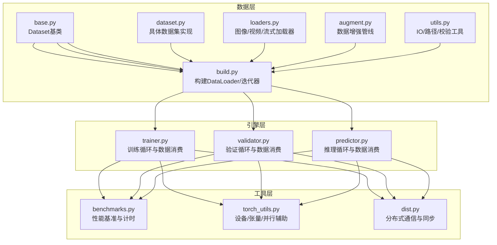
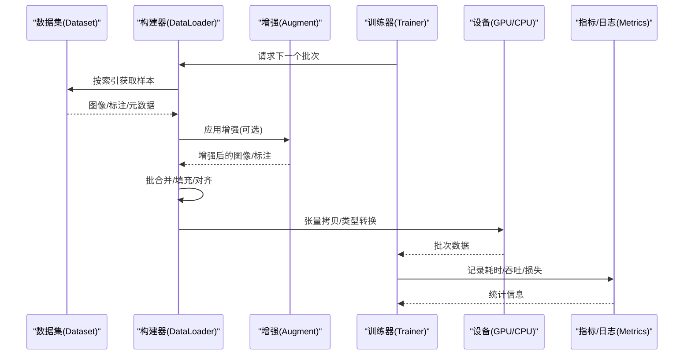
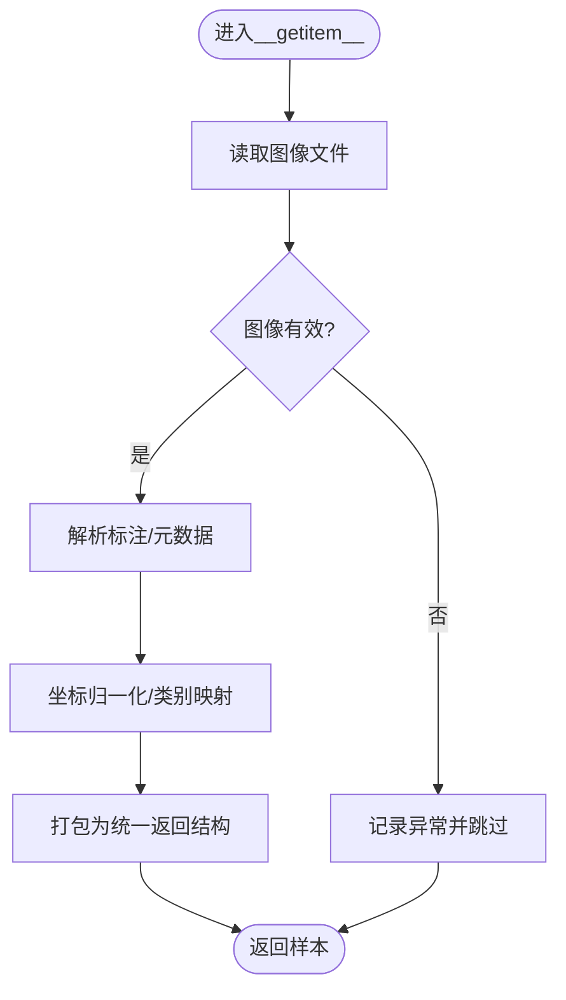
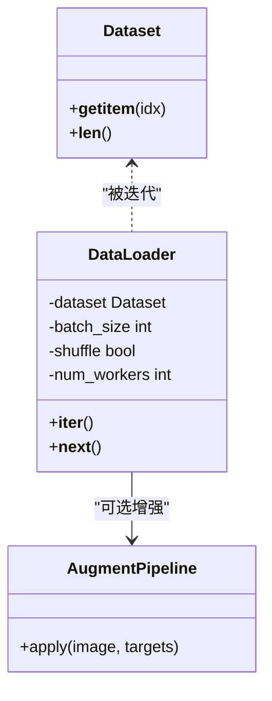
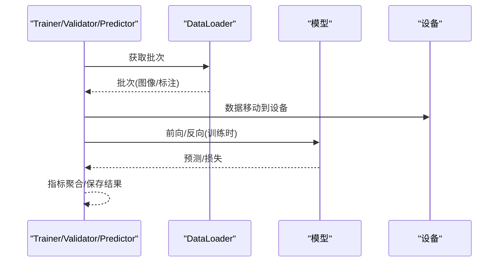
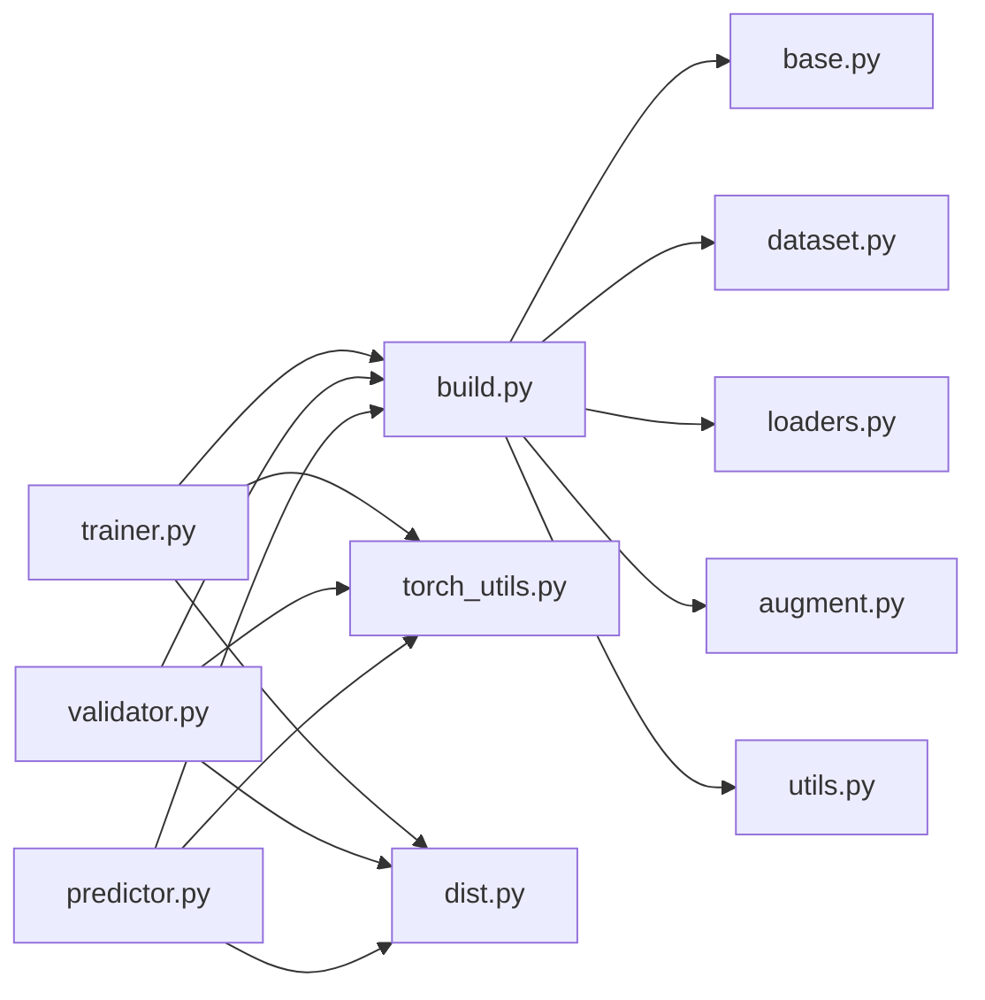

# 数据流控制

<cite>
**本文引用的文件**
- [ultralytics/data/base.py](file://ultralytics/data/base.py)
- [ultralytics/data/build.py](file://ultralytics/data/build.py)
- [ultralytics/data/dataset.py](file://ultralytics/data/dataset.py)
- [ultralytics/data/loaders.py](file://ultralytics/data/loaders.py)
- [ultralytics/data/augment.py](file://ultralytics/data/augment.py)
- [ultralytics/data/utils.py](file://ultralytics/data/utils.py)
- [ultralytics/engine/trainer.py](file://ultralytics/engine/trainer.py)
- [ultralytics/engine/validator.py](file://ultralytics/engine/validator.py)
- [ultralytics/engine/predictor.py](file://ultralytics/engine/predictor.py)
- [ultralytics/utils/benchmarks.py](file://ultralytics/utils/benchmarks.py)
- [ultralytics/utils/torch_utils.py](file://ultralytics/utils/torch_utils.py)
- [ultralytics/utils/dist.py](file://ultralytics/utils/dist.py)
</cite>

## 目录
1. [简介](#简介)
2. [项目结构](#项目结构)
3. [核心组件](#核心组件)
4. [架构总览](#架构总览)
5. [详细组件分析](#详细组件分析)
6. [依赖关系分析](#依赖关系分析)
7. [性能考虑](#性能考虑)
8. [故障排查指南](#故障排查指南)
9. [结论](#结论)
10. [附录](#附录)

## 简介
本技术文档聚焦于YOLO-Master框架的数据流控制系统，系统性地阐述从数据输入到结果输出的完整流转过程，覆盖数据预处理、增强、批处理与后处理等关键环节。文档同时解释数据管道的设计模式（生成器、流水线、并行）、多类型数据（图像、标注、元数据）的处理流程与格式转换、缓存与内存管理、I/O优化策略、数据验证与容错机制、分布式数据处理与负载均衡、性能监控与瓶颈分析方法，以及数据安全与隐私保护要点。读者可据此构建自定义数据处理管道并实现高效稳定的训练、验证与推理数据流。

## 项目结构
数据流相关代码主要位于以下模块：
- 数据加载与数据集抽象：ultralytics/data/*
- 训练/验证/推理引擎入口：ultralytics/engine/*
- 工具与性能：ultralytics/utils/*

图表来源
- [ultralytics/data/base.py](file://ultralytics/data/base.py)
- [ultralytics/data/build.py](file://ultralytics/data/build.py)
- [ultralytics/data/dataset.py](file://ultralytics/data/dataset.py)
- [ultralytics/data/loaders.py](file://ultralytics/data/loaders.py)
- [ultralytics/data/augment.py](file://ultralytics/data/augment.py)
- [ultralytics/data/utils.py](file://ultralytics/data/utils.py)
- [ultralytics/engine/trainer.py](file://ultralytics/engine/trainer.py)
- [ultralytics/engine/validator.py](file://ultralytics/engine/validator.py)
- [ultralytics/engine/predictor.py](file://ultralytics/engine/predictor.py)
- [ultralytics/utils/benchmarks.py](file://ultralytics/utils/benchmarks.py)
- [ultralytics/utils/torch_utils.py](file://ultralytics/utils/torch_utils.py)
- [ultralytics/utils/dist.py](file://ultralytics/utils/dist.py)

章节来源
- [ultralytics/data/base.py](file://ultralytics/data/base.py)
- [ultralytics/data/build.py](file://ultralytics/data/build.py)
- [ultralytics/data/dataset.py](file://ultralytics/data/dataset.py)
- [ultralytics/data/loaders.py](file://ultralytics/data/loaders.py)
- [ultralytics/data/augment.py](file://ultralytics/data/augment.py)
- [ultralytics/data/utils.py](file://ultralytics/data/utils.py)
- [ultralytics/engine/trainer.py](file://ultralytics/engine/trainer.py)
- [ultralytics/engine/validator.py](file://ultralytics/engine/validator.py)
- [ultralytics/engine/predictor.py](file://ultralytics/engine/predictor.py)
- [ultralytics/utils/benchmarks.py](file://ultralytics/utils/benchmarks.py)
- [ultralytics/utils/torch_utils.py](file://ultralytics/utils/torch_utils.py)
- [ultralytics/utils/dist.py](file://ultralytics/utils/dist.py)

## 核心组件
- 数据集抽象与索引访问
  - 提供统一的__getitem__/__len__接口，封装图像读取、标注解析、元数据组装与返回格式标准化。
  - 支持多种任务类型的标签结构与坐标归一化约定。
- 数据构建与批处理
  - 将数据集包装为可迭代的DataLoader，负责采样、打乱、批合并、填充对齐、多线程预取与GPU传输。
- 数据增强管线
  - 组合式增强算子（几何变换、色彩扰动、马赛克、MixUp/CutMix等），在CPU侧执行，支持随机概率与参数范围。
- 加载器
  - 面向图像、视频、摄像头与网络流的统一加载接口，包含解码、缩放、格式转换与错误恢复。
- 工具与校验
  - 路径解析、文件存在性检查、标注格式校验、异常捕获与降级策略。
- 引擎集成
  - 训练/验证/推理循环通过统一的迭代协议消费批次数据，并在不同模式下调整数据行为（如是否增强、是否打乱）。

章节来源
- [ultralytics/data/base.py](file://ultralytics/data/base.py)
- [ultralytics/data/build.py](file://ultralytics/data/build.py)
- [ultralytics/data/dataset.py](file://ultralytics/data/dataset.py)
- [ultralytics/data/loaders.py](file://ultralytics/data/loaders.py)
- [ultralytics/data/augment.py](file://ultralytics/data/augment.py)
- [ultralytics/data/utils.py](file://ultralytics/data/utils.py)
- [ultralytics/engine/trainer.py](file://ultralytics/engine/trainer.py)
- [ultralytics/engine/validator.py](file://ultralytics/engine/validator.py)
- [ultralytics/engine/predictor.py](file://ultralytics/engine/predictor.py)

## 架构总览
下图展示从磁盘/流到模型训练的端到端数据流，包括预处理、增强、批处理、设备迁移与后处理阶段。

图表来源
- [ultralytics/data/base.py](file://ultralytics/data/base.py)
- [ultralytics/data/build.py](file://ultralytics/data/build.py)
- [ultralytics/data/augment.py](file://ultralytics/data/augment.py)
- [ultralytics/engine/trainer.py](file://ultralytics/engine/trainer.py)
- [ultralytics/utils/benchmarks.py](file://ultralytics/utils/benchmarks.py)

## 详细组件分析

### 数据集与索引访问（生成器模式）
- 设计要点
  - __getitem__作为“生成器”节点，按需读取单一样本，完成图像解码、标注解析、坐标归一化、类别映射与元数据拼装。
  - __len__暴露数据集规模，供外部调度使用。
  - 支持懒加载与缓存键（如路径哈希），减少重复I/O。
- 数据结构与复杂度
  - 单次样本访问的时间复杂度受图像尺寸与标注数量影响；空间复杂度随图像与标注的内存占用线性增长。
- 优化机会
  - 引入LRU或对象池缓存高频样本；对大图像采用分块或延迟解码；对标注进行索引加速（如R-tree）。
- 错误处理
  - 针对损坏图像/缺失标注进行异常捕获与跳过，记录失败样本ID以便审计。

图表来源
- [ultralytics/data/base.py](file://ultralytics/data/base.py)
- [ultralytics/data/dataset.py](file://ultralytics/data/dataset.py)
- [ultralytics/data/utils.py](file://ultralytics/data/utils.py)

章节来源
- [ultralytics/data/base.py](file://ultralytics/data/base.py)
- [ultralytics/data/dataset.py](file://ultralytics/data/dataset.py)
- [ultralytics/data/utils.py](file://ultralytics/data/utils.py)

### 数据构建与批处理（流水线模式）
- 设计要点
  - DataLoader负责将多个样本组织为批次，执行打乱、排序、填充与形状对齐，确保模型输入维度一致。
  - 支持多线程预取与异步I/O，隐藏磁盘/网络延迟。
  - 在批次级别进行裁剪/缩放/归一化，提升吞吐。
- 并行与并发
  - 使用多进程/线程进行数据预取；注意GIL与CPU密集型增强的权衡。
- 内存管理
  - 控制队列长度与worker数量，避免内存峰值过高；及时释放中间张量。
- 性能特征
  - 吞吐= min{I/O带宽, CPU增强算力, GPU计算能力}；需根据硬件调优prefetch与batch_size。

图表来源
- [ultralytics/data/build.py](file://ultralytics/data/build.py)
- [ultralytics/data/base.py](file://ultralytics/data/base.py)
- [ultralytics/data/augment.py](file://ultralytics/data/augment.py)

章节来源
- [ultralytics/data/build.py](file://ultralytics/data/build.py)
- [ultralytics/data/base.py](file://ultralytics/data/base.py)
- [ultralytics/data/augment.py](file://ultratypes/data/augment.py)

### 数据增强管线（组合模式）
- 设计要点
  - 每个增强算子实现统一接口，支持随机概率与参数分布；通过组合方式串联形成复杂增强序列。
  - 保持标注与图像的几何一致性（仿射、透视、缩放等）。
- 常见算子
  - 几何：旋转、翻转、仿射、Mosaic、CutMix、MixUp。
  - 色彩：亮度、对比度、饱和度、色调、噪声。
- 性能建议
  - 将CPU密集型增强放在独立worker中；对大图先缩放再增强以减少计算量。

图表来源
- [ultralytics/data/augment.py](file://ultralytics/data/augment.py)

章节来源
- [ultralytics/data/augment.py](file://ultralytics/data/augment.py)

### 加载器（图像/视频/流）
- 职责
  - 统一读取图像、视频帧、摄像头与网络流；进行解码、颜色空间转换、尺寸调整与格式标准化。
- 容错
  - 对损坏帧/丢包进行重试或跳过；记录不可用样本位置。
- 适配
  - 与数据集接口对接，使上层无需关心底层介质差异。

章节来源
- [ultralytics/data/loaders.py](file://ultralytics/data/loaders.py)
- [ultralytics/data/utils.py](file://ultralytics/data/utils.py)

### 引擎集成（训练/验证/推理）
- 训练循环
  - 从DataLoader拉取批次，送入模型前向/反向传播，更新参数，记录损失与指标。
- 验证循环
  - 禁用增强与梯度，评估mAP等指标，汇总结果。
- 推理循环
  - 支持单图/批量/视频流；输出检测结果并进行NMS、阈值过滤与可视化。
- 设备与并行
  - 自动选择设备，跨卡复制与同步；在分布式场景下广播/规约梯度与状态。

图表来源
- [ultralytics/engine/trainer.py](file://ultralytics/engine/trainer.py)
- [ultralytics/engine/validator.py](file://ultralytics/engine/validator.py)
- [ultralytics/engine/predictor.py](file://ultralytics/engine/predictor.py)
- [ultralytics/utils/torch_utils.py](file://ultralytics/utils/torch_utils.py)

章节来源
- [ultralytics/engine/trainer.py](file://ultralytics/engine/trainer.py)
- [ultralytics/engine/validator.py](file://ultralytics/engine/validator.py)
- [ultralytics/engine/predictor.py](file://ultralytics/engine/predictor.py)
- [ultralytics/utils/torch_utils.py](file://ultralytics/utils/torch_utils.py)

### 数据验证与质量检查
- 路径与权限
  - 校验文件存在性与可读性，避免启动期崩溃。
- 标注完整性
  - 检查类别ID范围、坐标合法性、边界框面积与重叠率异常。
- 图像健康度
  - 检测空图像、全黑/全白、分辨率过低、通道数异常。
- 容错策略
  - 记录坏样本清单，支持跳过/修复/替换；提供统计报告用于数据治理。

章节来源
- [ultralytics/data/utils.py](file://ultralytics/data/utils.py)
- [ultralytics/data/base.py](file://ultralytics/data/base.py)

### 缓存、内存管理与I/O优化
- 缓存
  - 图像解码缓存、增强结果缓存、频繁访问样本的LRU缓存。
- 内存
  - 控制worker队列长度，限制最大批大小；及时释放中间变量；使用共享内存减少拷贝。
- I/O
  - 启用异步I/O、预读、顺序读取；对SSD/NVMe进行分区与NUMA亲和设置；对网络存储使用CDN/边缘缓存。

章节来源
- [ultralytics/data/build.py](file://ultralytics/data/build.py)
- [ultralytics/data/utils.py](file://ultralytics/data/utils.py)
- [ultralytics/utils/torch_utils.py](file://ultralytics/utils/torch_utils.py)

### 分布式数据处理与负载均衡
- 数据并行
  - 多进程/多卡环境下，每个rank持有独立DataLoader副本，按全局索引划分数据，避免重复。
- 同步与规约
  - 使用分布式通信库进行梯度规约与状态同步；保证epoch级数据划分的一致性。
- 负载均衡
  - 动态调整worker数量与batch size以匹配各节点资源；监控长尾样本导致的负载不均。

章节来源
- [ultralytics/utils/dist.py](file://ultralytics/utils/dist.py)
- [ultralytics/utils/torch_utils.py](file://ultralytics/utils/torch_utils.py)
- [ultralytics/engine/trainer.py](file://ultralytics/engine/trainer.py)

### 性能监控与瓶颈分析
- 指标采集
  - 记录I/O耗时、增强耗时、批构建耗时、设备传输耗时、模型计算耗时与吞吐。
- 工具与方法
  - 使用基准模块进行端到端计时；结合系统工具（如nvprof、perf、iostat）定位热点。
- 优化闭环
  - 基于监控结果调整prefetch、workers、batch size、增强强度与数据布局。

章节来源
- [ultralytics/utils/benchmarks.py](file://ultralytics/utils/benchmarks.py)
- [ultralytics/utils/torch_utils.py](file://ultralytics/utils/torch_utils.py)

### 数据安全与隐私保护
- 数据脱敏
  - 对人脸、车牌、文本等敏感信息进行模糊化或遮挡。
- 访问控制
  - 最小权限原则，加密存储与传输；审计日志记录访问轨迹。
- 合规与留存
  - 遵循数据保留策略，定期清理临时文件与缓存；提供数据删除接口。

[本节为通用指导，不直接分析具体文件]

## 依赖关系分析
- 低耦合高内聚
  - 数据集与加载器解耦，增强管线可插拔，引擎仅依赖迭代协议。
- 关键依赖链
  - trainer/validator/predictor → build → dataset/augment/loaders → utils
  - 分布式通信由dist与torch_utils支撑。

图表来源
- [ultralytics/engine/trainer.py](file://ultralytics/engine/trainer.py)
- [ultralytics/engine/validator.py](file://ultralytics/engine/validator.py)
- [ultralytics/engine/predictor.py](file://ultralytics/engine/predictor.py)
- [ultralytics/data/build.py](file://ultralytics/data/build.py)
- [ultralytics/data/base.py](file://ultralytics/data/base.py)
- [ultralytics/data/dataset.py](file://ultralytics/data/dataset.py)
- [ultralytics/data/loaders.py](file://ultralytics/data/loaders.py)
- [ultralytics/data/augment.py](file://ultralytics/data/augment.py)
- [ultralytics/data/utils.py](file://ultralytics/data/utils.py)
- [ultralytics/utils/torch_utils.py](file://ultralytics/utils/torch_utils.py)
- [ultralytics/utils/dist.py](file://ultralytics/utils/dist.py)

章节来源
- [ultralytics/engine/trainer.py](file://ultralytics/engine/trainer.py)
- [ultralytics/engine/validator.py](file://ultralytics/engine/validator.py)
- [ultralytics/engine/predictor.py](file://ultralytics/engine/predictor.py)
- [ultralytics/data/build.py](file://ultralytics/data/build.py)
- [ultralytics/data/base.py](file://ultralytics/data/base.py)
- [ultralytics/data/dataset.py](file://ultralytics/data/dataset.py)
- [ultralytics/data/loaders.py](file://ultralytics/data/loaders.py)
- [ultralytics/data/augment.py](file://ultralytics/data/augment.py)
- [ultralytics/data/utils.py](file://ultralytics/data/utils.py)
- [ultralytics/utils/torch_utils.py](file://ultralytics/utils/torch_utils.py)
- [ultralytics/utils/dist.py](file://ultralytics/utils/dist.py)

## 性能考虑
- 吞吐瓶颈识别
  - I/O受限：增大prefetch、开启异步I/O、使用高速存储。
  - CPU增强受限：降低增强强度、增加workers、使用SIMD/并行库。
  - GPU计算受限：增大batch size、混合精度、编译优化。
- 内存峰值控制
  - 限制队列长度、及时释放中间张量、避免不必要的深拷贝。
- 设备迁移成本
  - 尽量在CPU侧完成形状对齐与类型转换，减少GPU侧开销。
- 分布式扩展
  - 合理划分数据，避免重复与倾斜；监控各rank的I/O与计算均衡。

[本节为通用指导，不直接分析具体文件]

## 故障排查指南
- 常见问题
  - 图像损坏/缺失：检查路径与权限，启用跳过与异常记录。
  - 标注越界/类别非法：校验类别ID范围与坐标有效性，必要时裁剪或丢弃。
  - 内存溢出：降低batch size、workers与队列长度；启用共享内存。
  - 分布式死锁：确认数据划分无重复，检查通信屏障与同步点。
- 诊断步骤
  - 使用基准模块记录各阶段耗时；导出失败样本清单；逐步关闭增强与预取定位问题。
- 恢复策略
  - 断点续训、增量重建索引、回滚到上一版本配置。

章节来源
- [ultralytics/data/utils.py](file://ultralytics/data/utils.py)
- [ultralytics/utils/benchmarks.py](file://ultralytics/utils/benchmarks.py)
- [ultralytics/utils/dist.py](file://ultralytics/utils/dist.py)

## 结论
YOLO-Master的数据流控制系统以清晰的分层与模块化设计实现了高效、可扩展且健壮的数据管道。通过生成器与流水线的组合、灵活的增强管线、完善的校验与容错机制，以及分布式与性能监控支持，系统能够在多种硬件与数据规模下稳定运行。建议在生产环境中结合监控指标持续调优I/O、增强与批处理参数，并落实数据安全与隐私保护措施。

## 附录
- 构建自定义数据处理管道的实践要点
  - 定义数据集类：实现__getitem__/__len__，统一返回结构，加入校验与异常处理。
  - 组装增强管线：选择必要算子，设置随机概率，确保标注一致性。
  - 配置DataLoader：根据硬件调整batch size、workers、prefetch与pin_memory。
  - 接入引擎：在训练/验证/推理循环中消费批次，记录指标与日志。
  - 监控与优化：使用基准模块与系统工具定位瓶颈，迭代优化。

[本节为通用指导，不直接分析具体文件]