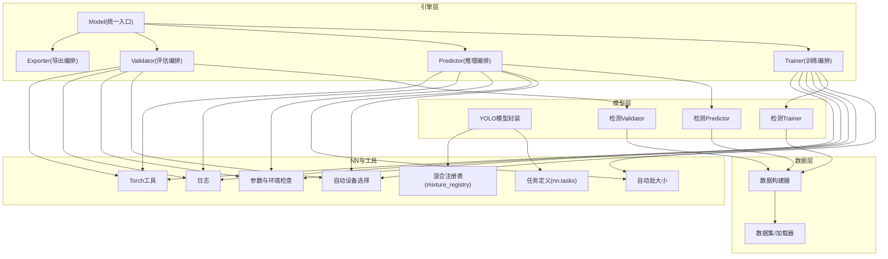
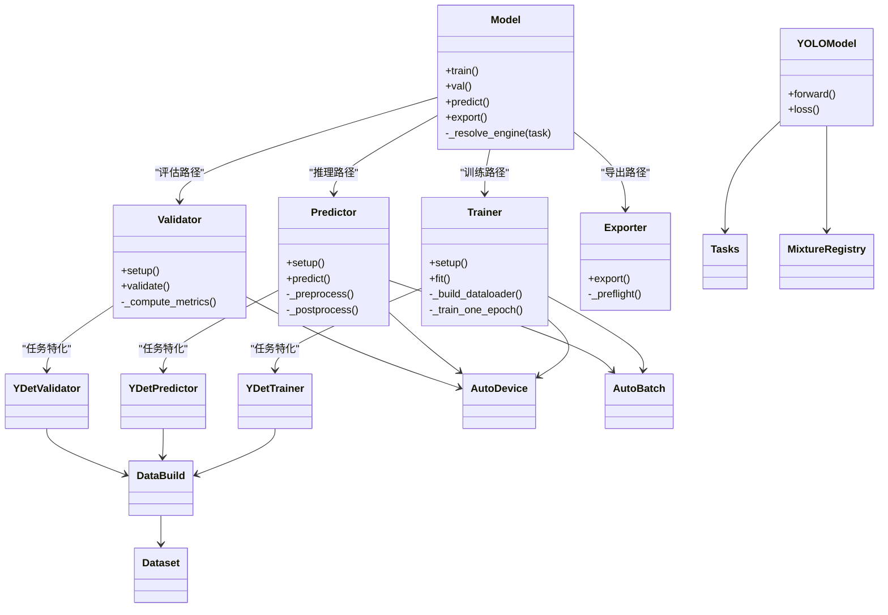
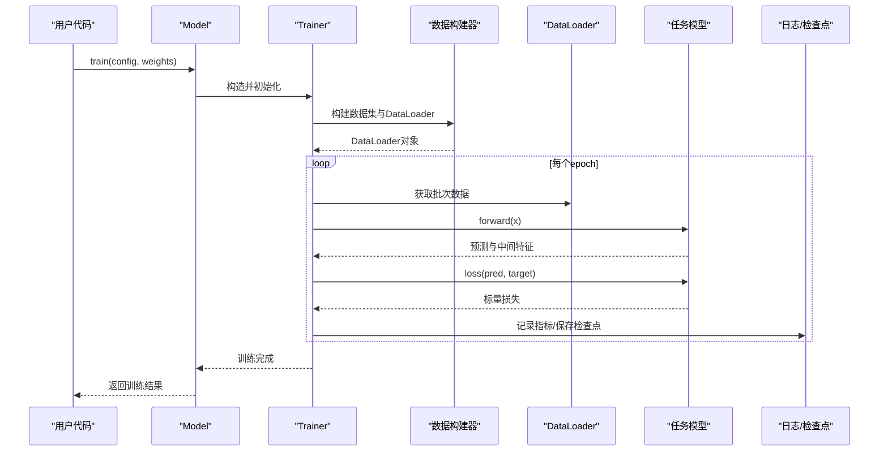
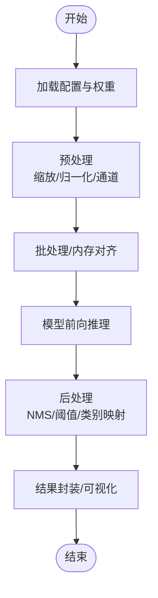
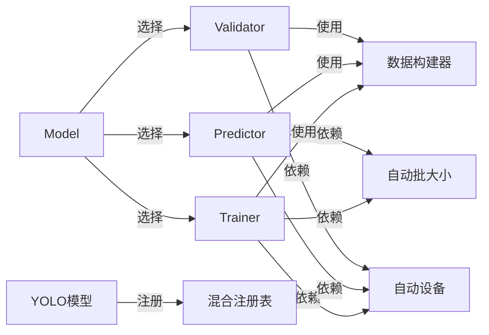

# 核心架构

<cite>
**本文引用的文件**
- [ultralytics/engine/model.py](file://ultralytics/engine/model.py)
- [ultralytics/engine/trainer.py](file://ultralytics/engine/trainer.py)
- [ultralytics/engine/predictor.py](file://ultralytics/engine/predictor.py)
- [ultralytics/engine/validator.py](file://ultralytics/engine/validator.py)
- [ultralytics/engine/exporter.py](file://ultralytics/engine/exporter.py)
- [ultralytics/models/yolo/model.py](file://ultralytics/models/yolo/model.py)
- [ultralytics/models/yolo/detect/trainer.py](file://ultralytics/models/yolo/detect/trainer.py)
- [ultralytics/models/yolo/detect/predictor.py](file://ultralytics/models/yolo/detect/predictor.py)
- [ultralytics/models/yolo/detect/validator.py](file://ultralytics/models/yolo/detect/validator.py)
- [ultralytics/data/build.py](file://ultralytics/data/build.py)
- [ultralytics/data/dataset.py](file://ultralytics/data/dataset.py)
- [ultralytics/utils/autodevice.py](file://ultralytics/utils/autodevice.py)
- [ultralytics/utils/autobatch.py](file://ultralytics/utils/autobatch.py)
- [ultralytics/utils/checks.py](file://ultralytics/utils/checks.py)
- [ultralytics/utils/logger.py](file://ultralytics/utils/logger.py)
- [ultralytics/utils/torch_utils.py](file://ultralytics/utils/torch_utils.py)
- [ultralytics/nn/tasks.py](file://ultralytics/nn/tasks.py)
- [ultralytics/nn/mixture_registry.py](file://ultralytics/nn/mixture_registry.py)
- [ultralytics/cfg/default.yaml](file://ultralytics/cfg/default.yaml)
</cite>

## 目录
1. [简介](#简介)
2. [项目结构](#项目结构)
3. [核心组件](#核心组件)
4. [架构总览](#架构总览)
5. [详细组件分析](#详细组件分析)
6. [依赖关系分析](#依赖关系分析)
7. [性能考虑](#性能考虑)
8. [故障排查指南](#故障排查指南)
9. [结论](#结论)
10. [附录](#附录)

## 简介
本文件面向YOLO-Master框架的核心引擎层与系统边界，系统性阐述高层设计模式、组件职责分离与协作机制，覆盖从输入处理到结果输出的完整数据流与控制流。文档重点解释Model、Trainer、Predictor、Validator等关键组件的职责边界与交互方式，说明模块化架构中的插件系统、工厂模式与策略模式的应用，并给出配置管理系统的层次结构与解析机制。同时提供系统架构图与组件关系图，讨论技术决策、权衡与约束条件，以及可扩展性、性能优化与内存管理机制。

## 项目结构
YOLO-Master采用分层与按功能域组织相结合的结构：
- 引擎层（engine）：统一编排训练、验证、预测与导出流程，定义抽象基类与通用控制流。
- 模型层（models）：任务级实现（如检测），继承引擎抽象并提供具体策略。
- 数据层（data）：数据集构建、加载与增强管线。
- 神经网络模块（nn）：网络任务定义、混合专家注册表、后端适配等。
- 工具层（utils）：设备选择、批大小自适应、日志、检查、导出能力矩阵等。
- 配置（cfg）：默认配置与任务相关配置。

图表来源
- [ultralytics/engine/model.py](file://ultralytics/engine/model.py)
- [ultralytics/engine/trainer.py](file://ultralytics/engine/trainer.py)
- [ultralytics/engine/predictor.py](file://ultralytics/engine/predictor.py)
- [ultralytics/engine/validator.py](file://ultralytics/engine/validator.py)
- [ultralytics/engine/exporter.py](file://ultralytics/engine/exporter.py)
- [ultralytics/models/yolo/model.py](file://ultralytics/models/yolo/model.py)
- [ultralytics/models/yolo/detect/trainer.py](file://ultralytics/models/yolo/detect/trainer.py)
- [ultralytics/models/yolo/detect/predictor.py](file://ultralytics/models/yolo/detect/predictor.py)
- [ultralytics/models/yolo/detect/validator.py](file://ultralytics/models/yolo/detect/validator.py)
- [ultralytics/data/build.py](file://ultralytics/data/build.py)
- [ultralytics/data/dataset.py](file://ultralytics/data/dataset.py)
- [ultralytics/utils/autodevice.py](file://ultralytics/utils/autodevice.py)
- [ultralytics/utils/autobatch.py](file://ultralytics/utils/autobatch.py)
- [ultralytics/utils/checks.py](file://ultralytics/utils/checks.py)
- [ultralytics/utils/logger.py](file://ultralytics/utils/logger.py)
- [ultralytics/utils/torch_utils.py](file://ultralytics/utils/torch_utils.py)
- [ultralytics/nn/tasks.py](file://ultralytics/nn/tasks.py)
- [ultralytics/nn/mixture_registry.py](file://ultralytics/nn/mixture_registry.py)

章节来源
- [ultralytics/engine/model.py](file://ultralytics/engine/model.py)
- [ultralytics/engine/trainer.py](file://ultralytics/engine/trainer.py)
- [ultralytics/engine/predictor.py](file://ultralytics/engine/predictor.py)
- [ultralytics/engine/validator.py](file://ultralytics/engine/validator.py)
- [ultralytics/engine/exporter.py](file://ultralytics/engine/exporter.py)
- [ultralytics/models/yolo/model.py](file://ultralytics/models/yolo/model.py)
- [ultralytics/models/yolo/detect/trainer.py](file://ultralytics/models/yolo/detect/trainer.py)
- [ultralytics/models/yolo/detect/predictor.py](file://ultralytics/models/yolo/detect/predictor.py)
- [ultralytics/models/yolo/detect/validator.py](file://ultralytics/models/yolo/detect/validator.py)
- [ultralytics/data/build.py](file://ultralytics/data/build.py)
- [ultralytics/data/dataset.py](file://ultralytics/data/dataset.py)
- [ultralytics/utils/autodevice.py](file://ultralytics/utils/autodevice.py)
- [ultralytics/utils/autobatch.py](file://ultralytics/utils/autobatch.py)
- [ultralytics/utils/checks.py](file://ultralytics/utils/checks.py)
- [ultralytics/utils/logger.py](file://ultralytics/utils/logger.py)
- [ultralytics/utils/torch_utils.py](file://ultralytics/utils/torch_utils.py)
- [ultralytics/nn/tasks.py](file://ultralytics/nn/tasks.py)
- [ultralytics/nn/mixture_registry.py](file://ultralytics/nn/mixture_registry.py)

## 核心组件
- Model（统一入口）
  - 职责：对外暴露train/val/predict/export等高层API；负责加载权重、初始化任务模型、分发到对应Engine实例；维护生命周期与状态。
  - 关键点：通过工厂或注册表根据任务类型创建具体Trainer/Predictor/Validator；对设备与批大小进行统一调度。
- Trainer（训练编排）
  - 职责：训练循环、损失计算、优化器与调度器装配、EMA、日志与回调、分布式协调、检查点保存。
  - 关键点：与数据构建器协作生成DataLoader；使用自动设备与自动批大小；调用任务模型的forward与loss。
- Predictor（推理编排）
  - 职责：预处理、批量推理、后处理（NMS/阈值过滤）、可视化与结果封装。
  - 关键点：支持多源输入（图像/视频/摄像头）；缓存模型与设备上下文；可插拔的后处理策略。
- Validator（评估编排）
  - 职责：在验证集上执行前向与指标统计；支持类别映射、混淆矩阵、PR曲线等。
  - 关键点：复用训练时的模型与数据管道；与Trainer共享部分逻辑以减少重复。
- Exporter（导出编排）
  - 职责：将PyTorch模型导出为ONNX/TensorRT/OpenVINO等格式；进行导出预检与能力矩阵校验。
  - 关键点：与autobackend集成；输出元数据与兼容性信息。

章节来源
- [ultralytics/engine/model.py](file://ultralytics/engine/model.py)
- [ultralytics/engine/trainer.py](file://ultralytics/engine/trainer.py)
- [ultralytics/engine/predictor.py](file://ultralytics/engine/predictor.py)
- [ultralytics/engine/validator.py](file://ultralytics/engine/validator.py)
- [ultralytics/engine/exporter.py](file://ultralytics/engine/exporter.py)

## 架构总览
整体采用“统一入口 + 任务特定实现”的分层架构：
- 统一入口（Model）屏蔽任务差异，内部通过工厂/注册表选择具体实现。
- 任务层（如YOLO检测）继承引擎抽象，注入任务特定的数据、损失与后处理策略。
- 数据层以构建器为中心，统一组装Dataset与DataLoader，支持增强与多源输入。
- 工具层提供设备、批大小、日志、检查等横切关注点。

图表来源
- [ultralytics/engine/model.py](file://ultralytics/engine/model.py)
- [ultralytics/engine/trainer.py](file://ultralytics/engine/trainer.py)
- [ultralytics/engine/predictor.py](file://ultralytics/engine/predictor.py)
- [ultralytics/engine/validator.py](file://ultralytics/engine/validator.py)
- [ultralytics/engine/exporter.py](file://ultralytics/engine/exporter.py)
- [ultralytics/models/yolo/model.py](file://ultralytics/models/yolo/model.py)
- [ultralytics/models/yolo/detect/trainer.py](file://ultralytics/models/yolo/detect/trainer.py)
- [ultralytics/models/yolo/detect/predictor.py](file://ultralytics/models/yolo/detect/predictor.py)
- [ultralytics/models/yolo/detect/validator.py](file://ultralytics/models/yolo/detect/validator.py)
- [ultralytics/data/build.py](file://ultralytics/data/build.py)
- [ultralytics/data/dataset.py](file://ultralytics/data/dataset.py)
- [ultralytics/utils/autodevice.py](file://ultralytics/utils/autodevice.py)
- [ultralytics/utils/autobatch.py](file://ultralytics/utils/autobatch.py)
- [ultralytics/nn/tasks.py](file://ultralytics/nn/tasks.py)
- [ultralytics/nn/mixture_registry.py](file://ultralytics/nn/mixture_registry.py)

## 详细组件分析

### 统一入口 Model
- 设计要点
  - 作为用户可见的单一入口，隐藏任务差异与底层细节。
  - 通过任务标识或配置解析，选择对应的Engine子类（Trainer/Predictor/Validator）。
  - 统一管理模型权重加载、设备迁移、批大小与精度设置。
- 控制流
  - 调用train/val/predict/export时，先完成环境自检与配置合并，再构造相应Engine实例并委派执行。
- 扩展点
  - 新增任务可通过注册表或工厂函数接入，无需修改Model主流程。

章节来源
- [ultralytics/engine/model.py](file://ultralytics/engine/model.py)

### 训练编排 Trainer
- 设计要点
  - 封装训练生命周期：准备阶段（构建数据、优化器、调度器、EMA）、训练循环、日志记录、检查点保存与恢复。
  - 与任务模型解耦，仅约定forward/loss接口。
- 数据流
  - 通过数据构建器生成DataLoader，逐批送入模型，计算损失并更新参数。
- 错误处理
  - 捕获异常并上报，确保分布式场景下的错误传播与诊断信息。
- 性能
  - 结合自动批大小与自动设备选择，最大化硬件利用率。

图表来源
- [ultralytics/engine/trainer.py](file://ultralytics/engine/trainer.py)
- [ultralytics/data/build.py](file://ultralytics/data/build.py)
- [ultralytics/models/yolo/detect/trainer.py](file://ultralytics/models/yolo/detect/trainer.py)
- [ultralytics/models/yolo/model.py](file://ultralytics/models/yolo/model.py)

章节来源
- [ultralytics/engine/trainer.py](file://ultralytics/engine/trainer.py)
- [ultralytics/models/yolo/detect/trainer.py](file://ultralytics/models/yolo/detect/trainer.py)

### 推理编排 Predictor
- 设计要点
  - 标准化预处理（缩放、归一化、通道转换）、批量推理、后处理（NMS、置信度阈值、类别映射）。
  - 支持多种输入源（单图、文件夹、视频、摄像头流）。
- 控制流
  - 初始化模型与设备上下文，预热缓存，循环读取输入并产出检测结果。
- 策略模式
  - 后处理策略可替换（如不同NMS实现或阈值策略），便于实验对比与部署优化。

图表来源
- [ultralytics/engine/predictor.py](file://ultralytics/engine/predictor.py)
- [ultralytics/models/yolo/detect/predictor.py](file://ultralytics/models/yolo/detect/predictor.py)

章节来源
- [ultralytics/engine/predictor.py](file://ultralytics/engine/predictor.py)
- [ultralytics/models/yolo/detect/predictor.py](file://ultralytics/models/yolo/detect/predictor.py)

### 评估编排 Validator
- 设计要点
  - 复用训练的数据管道与模型，专注于指标统计与报告生成。
  - 支持类别一致性校验、混淆矩阵、PR/AUC曲线等。
- 数据流
  - 遍历验证集，累积预测与真实标签，计算mAP等指标。
- 与Trainer的关系
  - 共享基础逻辑，避免重复实现；差异集中在指标计算与输出格式。

章节来源
- [ultralytics/engine/validator.py](file://ultralytics/engine/validator.py)
- [ultralytics/models/yolo/detect/validator.py](file://ultralytics/models/yolo/detect/validator.py)

### 导出编排 Exporter
- 设计要点
  - 统一导出入口，支持多种后端格式；导出前进行能力矩阵与预检。
  - 输出元数据（模型版本、输入形状、精度、设备信息等）。
- 控制流
  - 解析目标格式 -> 预检 -> 导出 -> 验证导出产物 -> 保存。

章节来源
- [ultralytics/engine/exporter.py](file://ultralytics/engine/exporter.py)

### 任务模型与NN模块
- 任务模型（YOLO）
  - 封装前向与损失计算，支持混合专家（MoE/MoA）与PEFT适配器。
  - 通过任务定义（tasks）与混合注册表（mixture_registry）动态组合子模块。
- 混合注册表
  - 提供运行时选择与切换混合策略的能力，便于实验与生产部署。

章节来源
- [ultralytics/models/yolo/model.py](file://ultralytics/models/yolo/model.py)
- [ultralytics/nn/tasks.py](file://ultralytics/nn/tasks.py)
- [ultralytics/nn/mixture_registry.py](file://ultralytics/nn/mixture_registry.py)

### 数据层
- 数据构建器
  - 根据配置解析数据集路径、类别、增强策略，构建DataLoader。
- 数据集与加载器
  - 支持多格式标注与多源输入；提供迭代式读取与并行加载。

章节来源
- [ultralytics/data/build.py](file://ultralytics/data/build.py)
- [ultralytics/data/dataset.py](file://ultralytics/data/dataset.py)

### 工具层
- 自动设备选择
  - 基于可用GPU/CPU资源选择最优设备，处理多卡与回退策略。
- 自动批大小
  - 根据显存与硬件特性动态调整批大小，提升吞吐与稳定性。
- 检查与日志
  - 参数合法性检查、环境依赖校验；结构化日志输出便于追踪。
- Torch工具
  - 张量操作、精度转换、梯度与内存管理辅助。

章节来源
- [ultralytics/utils/autodevice.py](file://ultralytics/utils/autodevice.py)
- [ultralytics/utils/autobatch.py](file://ultralytics/utils/autobatch.py)
- [ultralytics/utils/checks.py](file://ultralytics/utils/checks.py)
- [ultralytics/utils/logger.py](file://ultralytics/utils/logger.py)
- [ultralytics/utils/torch_utils.py](file://ultralytics/utils/torch_utils.py)

## 依赖关系分析
- 耦合与内聚
  - Model与Engine之间松耦合，通过接口与注册表降低直接依赖。
  - 任务层与引擎层通过约定好的forward/loss接口解耦，提高可替换性。
- 外部依赖
  - PyTorch生态（张量、优化器、分布式）；第三方导出后端（ONNX/TensorRT/OpenVINO）。
- 潜在循环依赖
  - 通过注册表与工厂模式避免循环导入；任务层不反向依赖Model。
- 接口契约
  - Engine抽象定义统一的setup/execute生命周期；任务实现遵循该契约。

图表来源
- [ultralytics/engine/model.py](file://ultralytics/engine/model.py)
- [ultralytics/engine/trainer.py](file://ultralytics/engine/trainer.py)
- [ultralytics/engine/predictor.py](file://ultralytics/engine/predictor.py)
- [ultralytics/engine/validator.py](file://ultralytics/engine/validator.py)
- [ultralytics/data/build.py](file://ultralytics/data/build.py)
- [ultralytics/utils/autodevice.py](file://ultralytics/utils/autodevice.py)
- [ultralytics/utils/autobatch.py](file://ultralytics/utils/autobatch.py)
- [ultralytics/models/yolo/model.py](file://ultralytics/models/yolo/model.py)
- [ultralytics/nn/mixture_registry.py](file://ultralytics/nn/mixture_registry.py)

章节来源
- [ultralytics/engine/model.py](file://ultralytics/engine/model.py)
- [ultralytics/engine/trainer.py](file://ultralytics/engine/trainer.py)
- [ultralytics/engine/predictor.py](file://ultralytics/engine/predictor.py)
- [ultralytics/engine/validator.py](file://ultralytics/engine/validator.py)
- [ultralytics/data/build.py](file://ultralytics/data/build.py)
- [ultralytics/utils/autodevice.py](file://ultralytics/utils/autodevice.py)
- [ultralytics/utils/autobatch.py](file://ultralytics/utils/autobatch.py)
- [ultralytics/models/yolo/model.py](file://ultralytics/models/yolo/model.py)
- [ultralytics/nn/mixture_registry.py](file://ultralytics/nn/mixture_registry.py)

## 性能考虑
- 自动批大小与设备选择
  - 依据显存与硬件特性动态调整批大小，减少OOM风险并提升吞吐。
- 数据管道优化
  - 并行加载、内存映射、预取与缓存，降低I/O瓶颈。
- 推理优化
  - 批处理、半精度推理、算子融合与后端加速（TensorRT/OpenVINO）。
- 训练稳定性
  - EMA平滑、梯度裁剪、数值稳定技巧与监控日志。
- 内存管理
  - 及时释放中间张量、避免不必要的副本、合理分配设备内存。

[本节为通用指导，不涉及具体文件分析]

## 故障排查指南
- 常见问题定位
  - 设备与驱动问题：检查自动设备选择与CUDA可用性。
  - 批大小过大导致OOM：启用自动批大小或手动调小。
  - 数据路径或标注格式错误：使用检查工具验证数据集与配置文件。
  - 导出失败：查看导出能力矩阵与预检日志，确认后端支持。
- 日志与诊断
  - 开启结构化日志，记录关键步骤与异常堆栈。
  - 利用检查点与中间指标回溯训练过程。

章节来源
- [ultralytics/utils/checks.py](file://ultralytics/utils/checks.py)
- [ultralytics/utils/logger.py](file://ultralytics/utils/logger.py)
- [ultralytics/utils/autodevice.py](file://ultralytics/utils/autodevice.py)
- [ultralytics/utils/autobatch.py](file://ultralytics/utils/autobatch.py)

## 结论
YOLO-Master通过统一入口与任务特化实现的清晰分层，结合工厂/注册表与策略模式，实现了高内聚、低耦合的可扩展架构。数据流与控制流在各组件间明确传递，工具层提供稳定的横切能力。系统在性能、稳定性与可移植性方面具备良好平衡，适合多任务、多后端与大规模实验与生产部署。

[本节为总结，不涉及具体文件分析]

## 附录

### 配置管理系统
- 层次结构
  - 默认配置（default.yaml）提供全局默认值。
  - 任务配置（如检测）覆盖默认值，指定数据、模型与超参。
  - 运行时参数进一步覆盖任务配置，形成最终生效配置。
- 解析机制
  - 递归合并字典，保留未覆盖字段；类型校验与缺省值填充。
  - 支持环境变量与命令行参数注入，便于容器化与自动化。

章节来源
- [ultralytics/cfg/default.yaml](file://ultralytics/cfg/default.yaml)

### 设计原则与模式
- 插件系统
  - 通过注册表与工厂函数注册新任务/策略，零侵入扩展。
- 工厂模式
  - Model内部根据任务标识创建具体Engine实例，屏蔽创建细节。
- 策略模式
  - 后处理、损失计算、路由策略等可替换，便于实验与优化。

章节来源
- [ultralytics/engine/model.py](file://ultralytics/engine/model.py)
- [ultralytics/nn/mixture_registry.py](file://ultralytics/nn/mixture_registry.py)