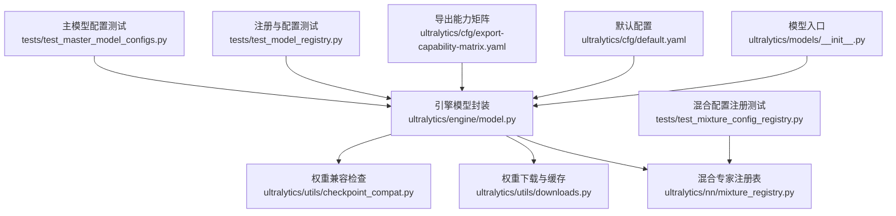
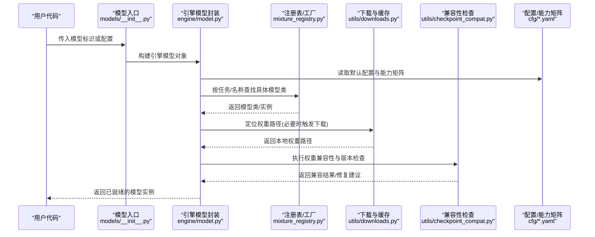
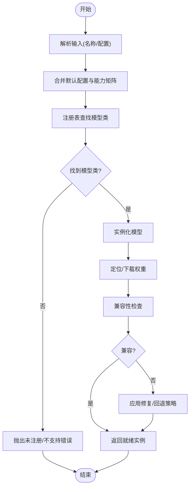
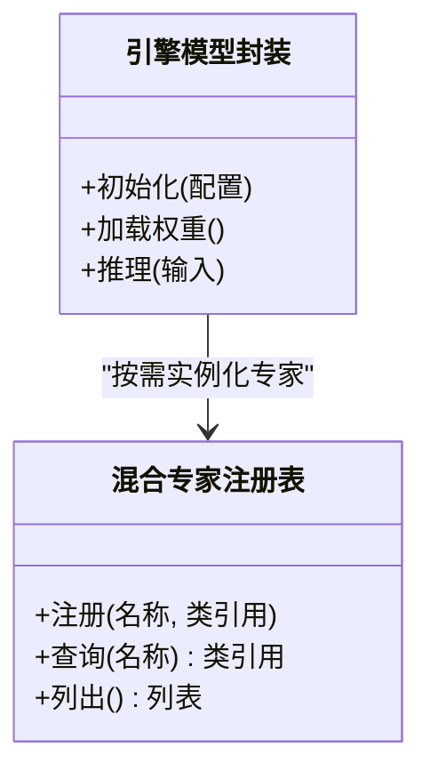
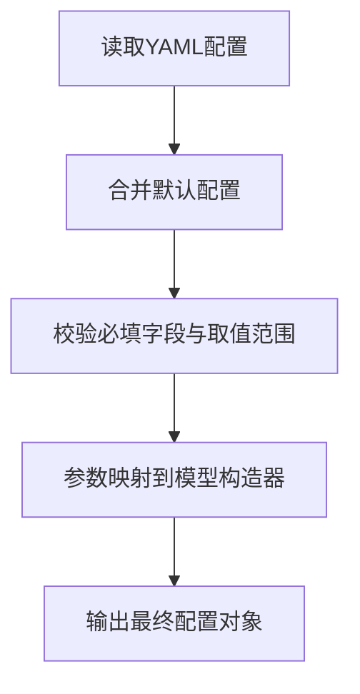
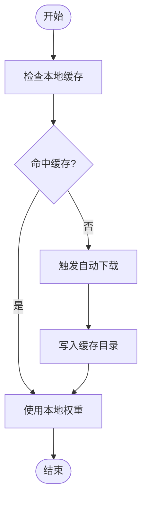
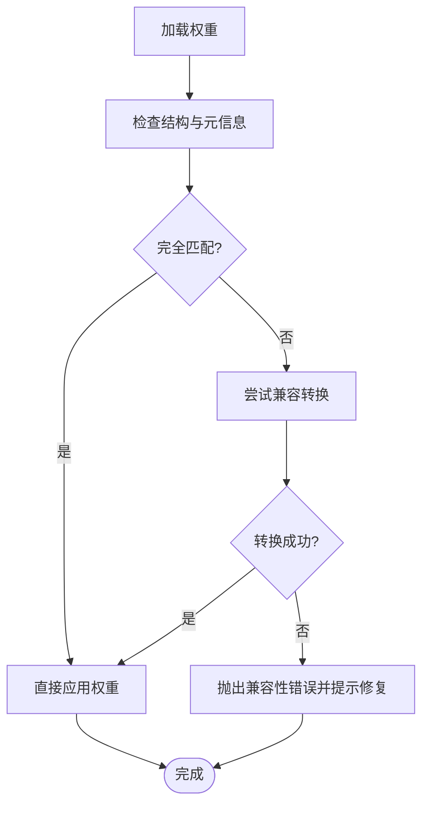
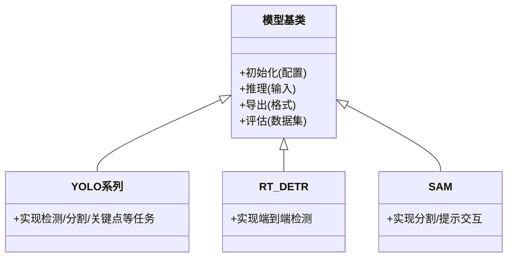
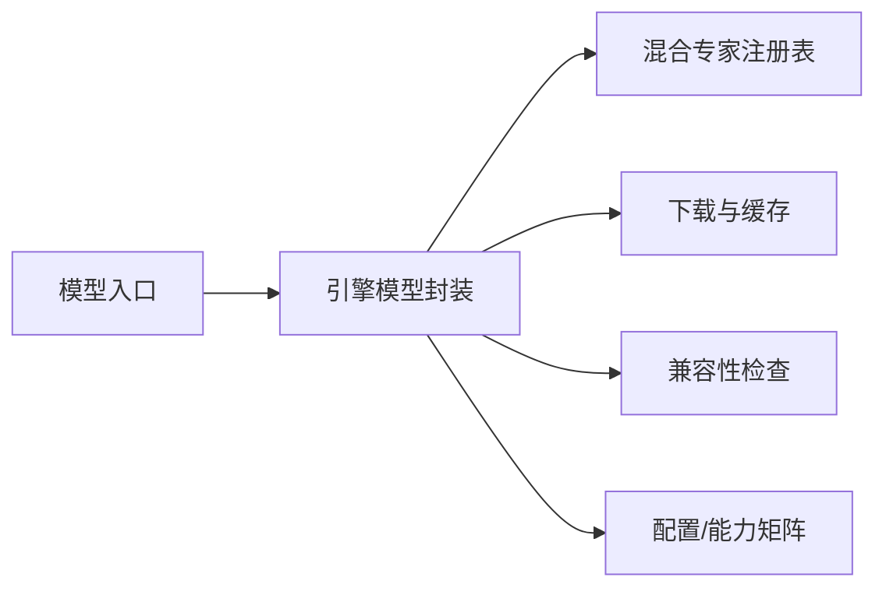

# 模型注册系统

<cite>
**本文引用的文件**
- [ultralytics/models/__init__.py](file://ultralytics/models/__init__.py)
- [ultralytics/engine/model.py](file://ultralytics/engine/model.py)
- [ultralytics/nn/mixture_registry.py](file://ultralytics/nn/mixture_registry.py)
- [ultralytics/utils/checkpoint_compat.py](file://ultralytics/utils/checkpoint_compat.py)
- [ultralytics/utils/downloads.py](file://ultralytics/utils/downloads.py)
- [tests/test_model_registry.py](file://tests/test_model_registry.py)
- [tests/test_mixture_config_registry.py](file://tests/test_mixture_config_registry.py)
- [tests/test_master_model_configs.py](file://tests/test_master_model_configs.py)
- [ultralytics/cfg/default.yaml](file://ultralytics/cfg/default.yaml)
- [ultralytics/cfg/export-capability-matrix.yaml](file://ultralytics/cfg/export-capability-matrix.yaml)
</cite>

## 目录
1. [简介](#简介)
2. [项目结构](#项目结构)
3. [核心组件](#核心组件)
4. [架构总览](#架构总览)
5. [详细组件分析](#详细组件分析)
6. [依赖关系分析](#依赖关系分析)
7. [性能考量](#性能考量)
8. [故障排查指南](#故障排查指南)
9. [结论](#结论)
10. [附录](#附录)

## 简介
本文件面向YOLO-Master框架的“模型注册系统”，系统性阐述其动态加载、工厂模式与配置驱动的实现原理，覆盖YOLO系列、RT-DETR、SAM等模型的注册方式与继承层次；说明YAML配置的解析与校验、参数映射机制；给出自定义模型集成步骤与接口要求；解释版本管理与兼容性检查；并补充缓存与预训练权重自动下载逻辑、扩展开发最佳实践与常见问题解决方案。文档以代码级事实为依据，辅以可视化图示，帮助读者快速理解并安全扩展模型生态。

## 项目结构
围绕模型注册与实例化，关键路径集中在以下模块：
- 模型入口与工厂：负责按名称或配置创建具体模型实例
- 混合专家注册表：集中管理可组合的专家/子模块注册与解析
- 配置与能力矩阵：提供默认配置与导出能力约束
- 兼容性与下载：处理权重加载、版本兼容与自动下载
- 测试用例：验证注册、配置解析与兼容性行为

图表来源
- [ultralytics/models/__init__.py](file://ultralytics/models/__init__.py)
- [ultralytics/engine/model.py](file://ultralytics/engine/model.py)
- [ultralytics/nn/mixture_registry.py](file://ultralytics/nn/mixture_registry.py)
- [ultralytics/utils/downloads.py](file://ultralytics/utils/downloads.py)
- [ultralytics/utils/checkpoint_compat.py](file://ultralytics/utils/checkpoint_compat.py)
- [ultralytics/cfg/default.yaml](file://ultralytics/cfg/default.yaml)
- [ultralytics/cfg/export-capability-matrix.yaml](file://ultralytics/cfg/export-capability-matrix.yaml)
- [tests/test_model_registry.py](file://tests/test_model_registry.py)
- [tests/test_mixture_config_registry.py](file://tests/test_mixture_config_registry.py)
- [tests/test_master_model_configs.py](file://tests/test_master_model_configs.py)

章节来源
- [ultralytics/models/__init__.py](file://ultralytics/models/__init__.py)
- [ultralytics/engine/model.py](file://ultralytics/engine/model.py)
- [ultralytics/nn/mixture_registry.py](file://ultralytics/nn/mixture_registry.py)
- [ultralytics/utils/downloads.py](file://ultralytics/utils/downloads.py)
- [ultralytics/utils/checkpoint_compat.py](file://ultralytics/utils/checkpoint_compat.py)
- [ultralytics/cfg/default.yaml](file://ultralytics/cfg/default.yaml)
- [ultralytics/cfg/export-capability-matrix.yaml](file://ultralytics/cfg/export-capability-matrix.yaml)
- [tests/test_model_registry.py](file://tests/test_model_registry.py)
- [tests/test_mixture_config_registry.py](file://tests/test_mixture_config_registry.py)
- [tests/test_master_model_configs.py](file://tests/test_master_model_configs.py)

## 核心组件
- 模型工厂与动态加载
  - 通过统一入口根据模型标识（如名称、任务类型）选择并实例化具体模型类，支持从配置或字符串名构造。
  - 结合任务路由与能力矩阵，确保不同模型（检测、分割、关键点、跟踪、语义分割等）在相同API下可用。
- 混合专家注册表
  - 维护可插拔的专家/子模块集合，支持运行时选择与组合，便于实现MoE/MoA等高级特性。
- 配置与能力矩阵
  - 默认配置提供通用超参与数据路径；导出能力矩阵约束各模型在不同后端下的导出选项。
- 兼容性与下载
  - 权重加载前进行版本与结构校验，失败时触发回退策略；支持自动下载与本地缓存。
- 测试保障
  - 针对注册、配置解析、兼容性等关键路径提供单测，保证扩展稳定性。

章节来源
- [ultralytics/engine/model.py](file://ultralytics/engine/model.py)
- [ultralytics/nn/mixture_registry.py](file://ultralytics/nn/mixture_registry.py)
- [ultralytics/cfg/default.yaml](file://ultralytics/cfg/default.yaml)
- [ultralytics/cfg/export-capability-matrix.yaml](file://ultralytics/cfg/export-capability-matrix.yaml)
- [ultralytics/utils/checkpoint_compat.py](file://ultralytics/utils/checkpoint_compat.py)
- [ultralytics/utils/downloads.py](file://ultralytics/utils/downloads.py)
- [tests/test_model_registry.py](file://tests/test_model_registry.py)
- [tests/test_mixture_config_registry.py](file://tests/test_mixture_config_registry.py)
- [tests/test_master_model_configs.py](file://tests/test_master_model_configs.py)

## 架构总览
下图展示从用户调用到模型实例化的端到端流程，包括配置解析、注册表查找、权重加载与兼容性检查。

图表来源
- [ultralytics/models/__init__.py](file://ultralytics/models/__init__.py)
- [ultralytics/engine/model.py](file://ultralytics/engine/model.py)
- [ultralytics/nn/mixture_registry.py](file://ultralytics/nn/mixture_registry.py)
- [ultralytics/utils/downloads.py](file://ultralytics/utils/downloads.py)
- [ultralytics/utils/checkpoint_compat.py](file://ultralytics/utils/checkpoint_compat.py)
- [ultralytics/cfg/default.yaml](file://ultralytics/cfg/default.yaml)
- [ultralytics/cfg/export-capability-matrix.yaml](file://ultralytics/cfg/export-capability-matrix.yaml)

## 详细组件分析

### 模型工厂与动态加载（模型入口与引擎封装）
- 设计要点
  - 统一入口接收字符串名或配置字典，内部委托引擎模型封装完成实例化。
  - 基于任务类型与能力矩阵决定可用的模型族与导出选项。
  - 对缺失的权重文件，优先使用本地缓存，否则触发自动下载。
- 关键流程
  - 解析输入（名称/配置）→ 合并默认配置 → 查询注册表获取模型类 → 初始化模型 → 加载权重 → 兼容性校验 → 返回实例。
- 错误处理
  - 当注册表中无匹配项或能力矩阵不支持当前任务时，抛出明确错误并提示可用列表。
  - 权重不兼容时，给出修复建议或回退策略。

图表来源
- [ultralytics/models/__init__.py](file://ultralytics/models/__init__.py)
- [ultralytics/engine/model.py](file://ultralytics/engine/model.py)
- [ultralytics/cfg/export-capability-matrix.yaml](file://ultralytics/cfg/export-capability-matrix.yaml)

章节来源
- [ultralytics/models/__init__.py](file://ultralytics/models/__init__.py)
- [ultralytics/engine/model.py](file://ultralytics/engine/model.py)
- [ultralytics/cfg/export-capability-matrix.yaml](file://ultralytics/cfg/export-capability-matrix.yaml)

### 混合专家注册表（可插拔子模块与组合）
- 设计要点
  - 提供统一的注册/查询接口，支持按名称或标签检索专家/子模块。
  - 与引擎模型协作，实现按需加载与组合，降低耦合度。
- 数据结构与复杂度
  - 通常采用哈希映射存储键值对，插入/查询时间复杂度为O(1)。
- 典型用法
  - 新增专家：在注册表中登记名称与类引用；在配置中指定专家ID；运行时由注册表解析并实例化。

图表来源
- [ultralytics/nn/mixture_registry.py](file://ultralytics/nn/mixture_registry.py)
- [ultralytics/engine/model.py](file://ultralytics/engine/model.py)

章节来源
- [ultralytics/nn/mixture_registry.py](file://ultralytics/nn/mixture_registry.py)
- [tests/test_mixture_config_registry.py](file://tests/test_mixture_config_registry.py)

### 配置解析与验证（YAML结构与参数映射）
- 配置文件
  - 默认配置提供通用超参与数据路径；导出能力矩阵定义各模型在不同后端的导出选项。
- 解析流程
  - 读取YAML → 合并默认配置 → 校验必填字段与取值范围 → 生成最终配置对象供模型使用。
- 参数映射
  - 将高层配置键映射到模型构造函数参数，确保一致性与可读性。

图表来源
- [ultralytics/cfg/default.yaml](file://ultralytics/cfg/default.yaml)
- [ultralytics/cfg/export-capability-matrix.yaml](file://ultralytics/cfg/export-capability-matrix.yaml)

章节来源
- [ultralytics/cfg/default.yaml](file://ultralytics/cfg/default.yaml)
- [ultralytics/cfg/export-capability-matrix.yaml](file://ultralytics/cfg/export-capability-matrix.yaml)
- [tests/test_master_model_configs.py](file://tests/test_master_model_configs.py)

### 权重加载、缓存与自动下载
- 缓存策略
  - 优先使用本地缓存路径；若不存在且允许网络访问，则触发自动下载并写入缓存。
- 下载逻辑
  - 根据模型标识计算目标URL与本地路径；断点续传与完整性校验（如有）。
- 异常处理
  - 网络不可用或权限不足时，给出清晰错误信息并提供离线方案。

图表来源
- [ultralytics/utils/downloads.py](file://ultralytics/utils/downloads.py)

章节来源
- [ultralytics/utils/downloads.py](file://ultralytics/utils/downloads.py)

### 版本管理与兼容性检查
- 检查内容
  - 权重结构、键名、张量形状与dtype、任务头是否匹配当前模型定义。
- 修复策略
  - 提供向后兼容的映射与转换函数；在不兼容时给出明确的升级指引。
- 测试保障
  - 通过单测覆盖常见迁移场景与边界条件。

图表来源
- [ultralytics/utils/checkpoint_compat.py](file://ultralytics/utils/checkpoint_compat.py)

章节来源
- [ultralytics/utils/checkpoint_compat.py](file://ultralytics/utils/checkpoint_compat.py)
- [tests/test_checkpoint_compat.py](file://tests/test_checkpoint_compat.py)

### 不同模型类型的注册方式与继承层次
- 模型族
  - YOLO系列、RT-DETR、SAM等均通过统一入口注册，遵循相同的实例化契约。
- 继承层次
  - 基类提供通用能力（如任务路由、导出、评估），具体模型族在派生类中实现差异逻辑。
- 注册方式
  - 在注册表中登记模型名与类引用；或在配置中声明任务与模型族，由工厂自动解析。

图表来源
- [ultralytics/engine/model.py](file://ultralytics/engine/model.py)
- [ultralytics/models/__init__.py](file://ultralytics/models/__init__.py)

章节来源
- [ultralytics/engine/model.py](file://ultralytics/engine/model.py)
- [ultralytics/models/__init__.py](file://ultralytics/models/__init__.py)
- [tests/test_model_registry.py](file://tests/test_model_registry.py)

### 自定义模型集成方法（注册步骤与接口要求）
- 步骤概览
  - 实现模型类并继承基类，满足推理/导出/评估接口契约。
  - 在注册表中登记新模型名称与类引用。
  - 在配置中声明任务与模型族，或通过工厂直接按名称实例化。
  - 编写单测验证注册、配置解析与兼容性。
- 接口要求
  - 统一的初始化签名、推理输入输出规范、导出格式支持与评估指标对接。
- 示例路径
  - 参考现有测试与注册用例，了解最小可行实现与约定。

章节来源
- [tests/test_model_registry.py](file://tests/test_model_registry.py)
- [ultralytics/engine/model.py](file://ultralytics/engine/model.py)
- [ultralytics/nn/mixture_registry.py](file://ultralytics/nn/mixture_registry.py)

## 依赖关系分析
- 组件耦合
  - 模型入口与引擎模型封装强耦合；注册表与引擎弱耦合（通过名称/任务键）。
  - 下载与兼容性检查被引擎模型封装间接依赖，避免侵入业务逻辑。
- 外部依赖
  - YAML解析库、网络请求与文件系统I/O。
- 循环依赖
  - 通过注册表解耦，避免直接相互导入导致的循环依赖。

图表来源
- [ultralytics/models/__init__.py](file://ultralytics/models/__init__.py)
- [ultralytics/engine/model.py](file://ultralytics/engine/model.py)
- [ultralytics/nn/mixture_registry.py](file://ultralytics/nn/mixture_registry.py)
- [ultralytics/utils/downloads.py](file://ultralytics/utils/downloads.py)
- [ultralytics/utils/checkpoint_compat.py](file://ultralytics/utils/checkpoint_compat.py)
- [ultralytics/cfg/default.yaml](file://ultralytics/cfg/default.yaml)
- [ultralytics/cfg/export-capability-matrix.yaml](file://ultralytics/cfg/export-capability-matrix.yaml)

章节来源
- [ultralytics/models/__init__.py](file://ultralytics/models/__init__.py)
- [ultralytics/engine/model.py](file://ultralytics/engine/model.py)
- [ultralytics/nn/mixture_registry.py](file://ultralytics/nn/mixture_registry.py)
- [ultralytics/utils/downloads.py](file://ultralytics/utils/downloads.py)
- [ultralytics/utils/checkpoint_compat.py](file://ultralytics/utils/checkpoint_compat.py)
- [ultralytics/cfg/default.yaml](file://ultralytics/cfg/default.yaml)
- [ultralytics/cfg/export-capability-matrix.yaml](file://ultralytics/cfg/export-capability-matrix.yaml)

## 性能考量
- 注册表查询应为O(1)，避免在热路径中进行线性扫描。
- 权重加载与兼容性检查应尽可能缓存中间结果，减少重复计算。
- 自动下载需支持并发与断点续传，提升大权重获取效率。
- 配置解析应在启动阶段完成，避免在推理路径中重复解析。

[本节为通用指导，无需特定文件来源]

## 故障排查指南
- 无法找到模型
  - 确认模型名称已在注册表中登记；检查任务与能力矩阵是否支持该模型。
- 权重不兼容
  - 查看兼容性检查日志，依据提示进行权重转换或升级模型定义。
- 下载失败
  - 检查网络连通性与磁盘权限；必要时手动放置权重至缓存目录。
- 配置错误
  - 核对YAML必填字段与取值范围；参考默认配置与能力矩阵修正。

章节来源
- [ultralytics/utils/checkpoint_compat.py](file://ultralytics/utils/checkpoint_compat.py)
- [ultralytics/utils/downloads.py](file://ultralytics/utils/downloads.py)
- [ultralytics/cfg/default.yaml](file://ultralytics/cfg/default.yaml)
- [ultralytics/cfg/export-capability-matrix.yaml](file://ultralytics/cfg/export-capability-matrix.yaml)
- [tests/test_model_registry.py](file://tests/test_model_registry.py)

## 结论
YOLO-Master的模型注册系统通过工厂模式与注册表实现了高内聚、低耦合的动态加载机制；配合配置驱动与能力矩阵，使多模型族在同一API下无缝切换；借助兼容性检查与自动下载，提升了易用性与鲁棒性。遵循本文的最佳实践与接口约定，开发者可以高效地扩展新的模型类型并保持生态一致性。

[本节为总结性内容，无需特定文件来源]

## 附录
- 常用命令与示例路径
  - 注册与使用自定义模型：参考测试用例中的最小实现与调用方式。
  - 配置与能力矩阵：参考默认配置与导出能力矩阵文件。
- 相关测试
  - 注册与配置解析：见测试文件清单。

章节来源
- [tests/test_model_registry.py](file://tests/test_model_registry.py)
- [tests/test_mixture_config_registry.py](file://tests/test_mixture_config_registry.py)
- [tests/test_master_model_configs.py](file://tests/test_master_model_configs.py)
- [ultralytics/cfg/default.yaml](file://ultralytics/cfg/default.yaml)
- [ultralytics/cfg/export-capability-matrix.yaml](file://ultralytics/cfg/export-capability-matrix.yaml)