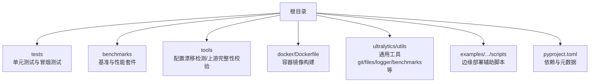
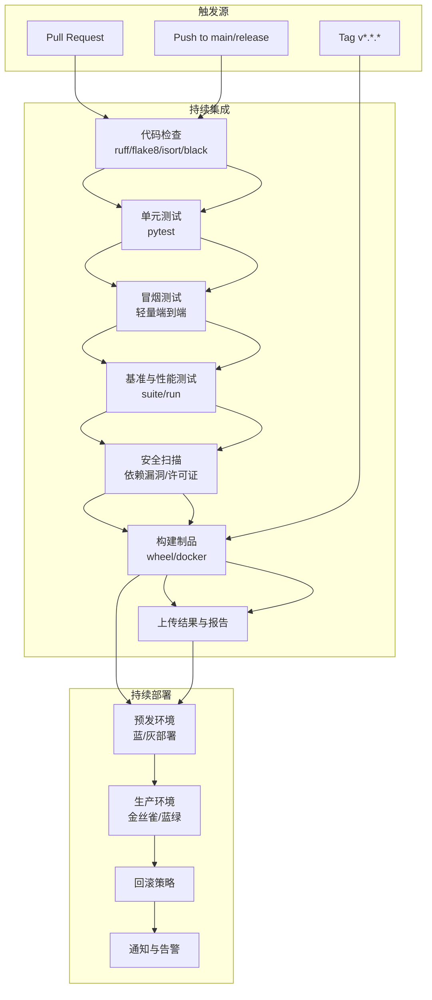
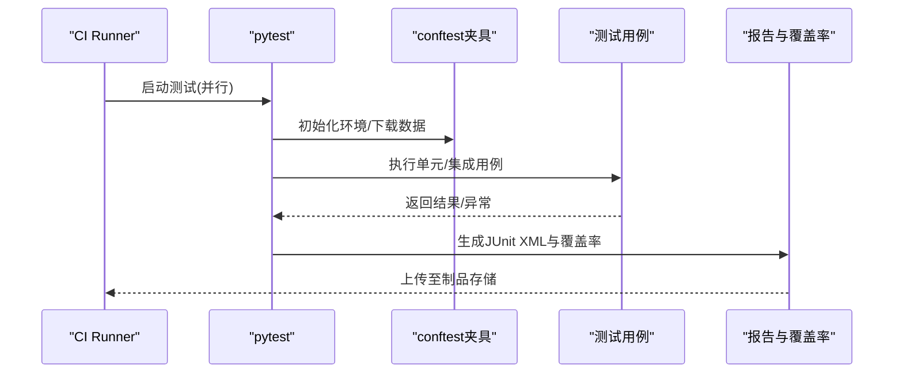
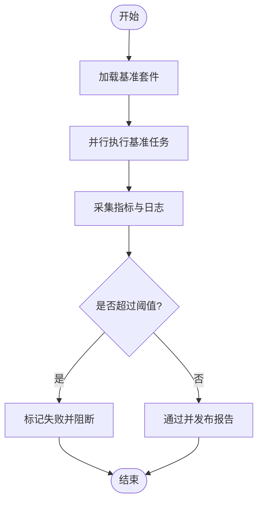
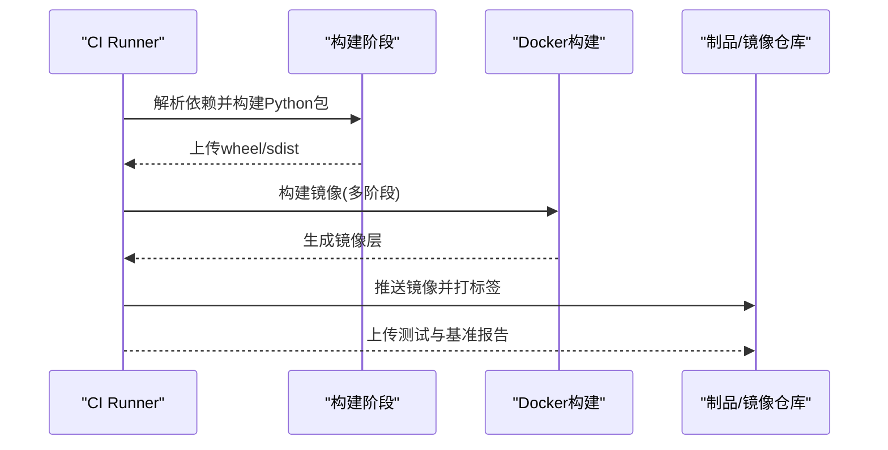
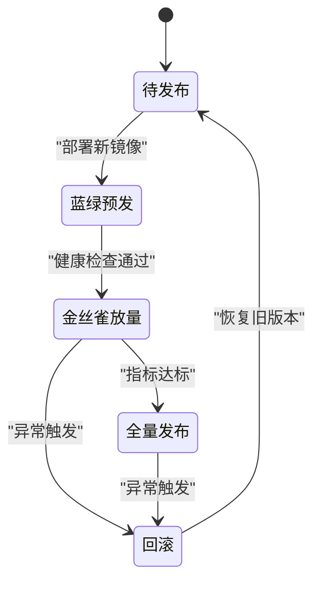
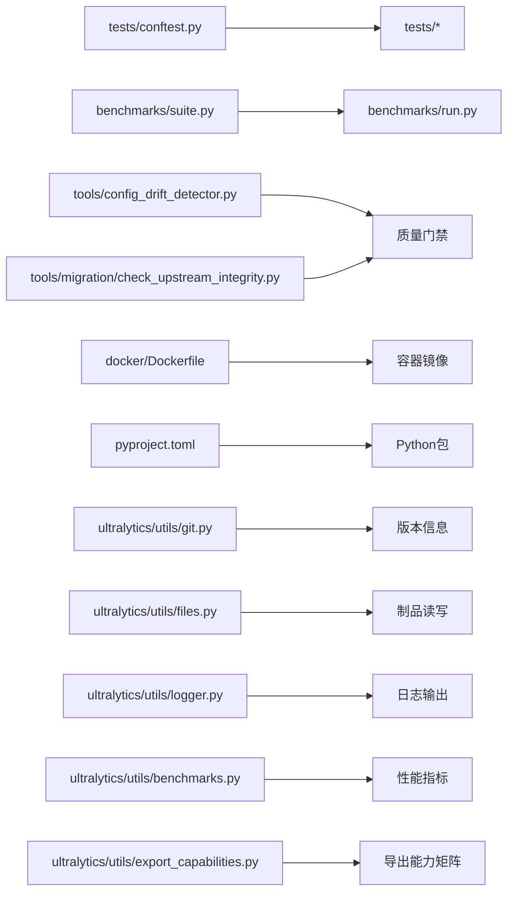

# CI/CD流水线

<cite>
**本文引用的文件**
- [pyproject.toml](file://pyproject.toml)
- [docker/Dockerfile](file://docker/Dockerfile)
- [tests/conftest.py](file://tests/conftest.py)
- [tests/test_cli.py](file://tests/test_cli.py)
- [tests/test_engine.py](file://tests/test_engine.py)
- [tests/test_moe.py](file://tests/test_moe.py)
- [tests/test_moa.py](file://tests/test_moa.py)
- [tests/test_mot.py](file://tests/test_mot.py)
- [tests/test_lora_moe_ddp_control_paths.py](file://tests/test_lora_moe_ddp_control_paths.py)
- [tests/ddp_moe_smoke.py](file://tests/ddp_moe_smoke.py)
- [tests/lora_e2e_smoke.py](file://tests/lora_e2e_smoke.py)
- [scripts/smoke_test_coco2017.py](file://scripts/smoke_test_coco2017.py)
- [benchmarks/suite.py](file://benchmarks/suite.py)
- [benchmarks/run.py](file://benchmarks/run.py)
- [tools/config_drift_detector.py](file://tools/config_drift_detector.py)
- [tools/migration/check_upstream_integrity.py](file://tools/migration/check_upstream_integrity.py)
- [ultralytics/utils/git.py](file://ultralytics/utils/git.py)
- [ultralytics/utils/files.py](file://ultralytics/utils/files.py)
- [ultralytics/utils/logger.py](file://ultralytics/utils/logger.py)
- [ultralytics/utils/benchmarks.py](file://ultralytics/utils/benchmarks.py)
- [ultralytics/utils/export_capabilities.py](file://ultralytics/utils/export_capabilities.py)
- [examples/YOLO-Master-Cross-Platform-Edge-Deployment/scripts/edge_utils.py](file://examples/YOLO-Master-Cross-Platform-Edge-Deployment/scripts/edge_utils.py)
</cite>

## 目录
1. [简介](#简介)
2. [项目结构](#项目结构)
3. [核心组件](#核心组件)
4. [架构总览](#架构总览)
5. [详细组件分析](#详细组件分析)
6. [依赖关系分析](#依赖关系分析)
7. [性能考虑](#性能考虑)
8. [故障排查指南](#故障排查指南)
9. [结论](#结论)
10. [附录](#附录)

## 简介
本技术文档面向YOLO-Master的CI/CD流水线，目标是提供一套可落地的持续集成与持续部署方案。内容覆盖：
- GitHub Actions工作流配置（代码检查、单元测试、集成测试、自动化部署）
- 持续集成最佳实践（并行执行、缓存策略、测试结果收集）
- 持续部署流程（蓝绿部署、金丝雀发布、回滚策略）
- 自动化测试策略（单元测试、性能测试、安全扫描）
- 构建优化技巧（增量构建、并行编译、产物缓存）
- 版本管理与发布流程（语义化版本控制、变更日志生成）
- 流水线监控与告警配置方法

说明：仓库中未包含GitHub Actions工作流定义文件。本文基于现有工程结构与工具链，给出可直接落地的流水线设计与实现建议，并标注与源码相关的“章节来源”。

## 项目结构
从仓库结构看，本项目具备完善的测试与基准套件、Docker镜像构建入口、以及若干用于迁移与质量保障的工具脚本，适合直接接入CI/CD流水线。

**图表来源**
- [pyproject.toml](file://pyproject.toml)
- [docker/Dockerfile](file://docker/Dockerfile)
- [tests/conftest.py](file://tests/conftest.py)
- [benchmarks/suite.py](file://benchmarks/suite.py)
- [tools/config_drift_detector.py](file://tools/config_drift_detector.py)
- [tools/migration/check_upstream_integrity.py](file://tools/migration/check_upstream_integrity.py)
- [ultralytics/utils/git.py](file://ultralytics/utils/git.py)
- [ultralytics/utils/files.py](file://ultralytics/utils/files.py)
- [ultralytics/utils/logger.py](file://ultralytics/utils/logger.py)
- [ultralytics/utils/benchmarks.py](file://ultralytics/utils/benchmarks.py)
- [ultralytics/utils/export_capabilities.py](file://ultralytics/utils/export_capabilities.py)

**章节来源**
- [pyproject.toml](file://pyproject.toml)
- [docker/Dockerfile](file://docker/Dockerfile)
- [tests/conftest.py](file://tests/conftest.py)

## 核心组件
- 测试框架与用例组织
  - pytest为默认测试运行器，conftest提供全局夹具与共享配置。
  - 单测覆盖CLI、引擎、MoE/MoA/MoT、LoRA+DDP控制路径等关键模块。
- 基准与性能测试
  - benchmarks/suite.py与run.py提供基准套件编排与运行入口。
  - ultralytics/utils/benchmarks.py提供性能度量能力。
- 质量与安全工具
  - tools/config_drift_detector.py用于配置漂移检测。
  - tools/migration/check_upstream_integrity.py用于上游完整性校验。
- 构建与制品
  - docker/Dockerfile用于构建容器镜像。
  - pyproject.toml管理依赖与元数据。
- 运行时与工具库
  - ultralytics/utils下提供git、files、logger、export_capabilities等通用能力，便于在CI中获取版本信息、读写文件、记录日志与导出能力矩阵。

**章节来源**
- [tests/conftest.py](file://tests/conftest.py)
- [tests/test_cli.py](file://tests/test_cli.py)
- [tests/test_engine.py](file://tests/test_engine.py)
- [tests/test_moe.py](file://tests/test_moe.py)
- [tests/test_moa.py](file://tests/test_moa.py)
- [tests/test_mot.py](file://tests/test_mot.py)
- [tests/test_lora_moe_ddp_control_paths.py](file://tests/test_lora_moe_ddp_control_paths.py)
- [tests/ddp_moe_smoke.py](file://tests/ddp_moe_smoke.py)
- [tests/lora_e2e_smoke.py](file://tests/lora_e2e_smoke.py)
- [benchmarks/suite.py](file://benchmarks/suite.py)
- [benchmarks/run.py](file://benchmarks/run.py)
- [tools/config_drift_detector.py](file://tools/config_drift_detector.py)
- [tools/migration/check_upstream_integrity.py](file://tools/migration/check_upstream_integrity.py)
- [docker/Dockerfile](file://docker/Dockerfile)
- [pyproject.toml](file://pyproject.toml)
- [ultralytics/utils/git.py](file://ultralytics/utils/git.py)
- [ultralytics/utils/files.py](file://ultralytics/utils/files.py)
- [ultralytics/utils/logger.py](file://ultralytics/utils/logger.py)
- [ultralytics/utils/benchmarks.py](file://ultralytics/utils/benchmarks.py)
- [ultralytics/utils/export_capabilities.py](file://ultralytics/utils/export_capabilities.py)

## 架构总览
下图展示推荐的CI/CD流水线阶段与工件流转关系，涵盖代码检查、测试、基准、构建与部署。

[此图为概念性架构图，不直接映射具体源码文件]

## 详细组件分析

### 代码检查与静态分析
- 建议步骤
  - 安装依赖：通过pyproject.toml解析依赖并安装。
  - 格式化与风格检查：使用ruff或flake8/isort/black进行统一风格检查。
  - 类型检查（可选）：mypy对核心模块进行类型约束。
  - 规则配置：将忽略项与阈值写入配置文件，避免误报。
- 产出物
  - 检查结果与修复建议；失败则阻断合并。

**章节来源**
- [pyproject.toml](file://pyproject.toml)

### 单元测试与集成测试
- 测试范围
  - CLI与引擎：test_cli.py、test_engine.py
  - MoE/MoA/MoT：test_moe.py、test_moa.py、test_mot.py
  - LoRA+DDP控制路径：test_lora_moe_ddp_control_paths.py
  - 冒烟测试：ddp_moe_smoke.py、lora_e2e_smoke.py
- 运行策略
  - 使用pytest-xdist并行执行，按模块划分任务。
  - 设置超时与重试，隔离不稳定用例。
  - 输出JUnit XML与覆盖率报告，供平台聚合。
- 数据与资源
  - 使用conftest.py集中管理临时目录、数据集下载与清理。
  - 对大型数据集采用缓存与最小化子集。

**图表来源**
- [tests/conftest.py](file://tests/conftest.py)
- [tests/test_cli.py](file://tests/test_cli.py)
- [tests/test_engine.py](file://tests/test_engine.py)
- [tests/test_moe.py](file://tests/test_moe.py)
- [tests/test_moa.py](file://tests/test_moa.py)
- [tests/test_mot.py](file://tests/test_mot.py)
- [tests/test_lora_moe_ddp_control_paths.py](file://tests/test_lora_moe_ddp_control_paths.py)
- [tests/ddp_moe_smoke.py](file://tests/ddp_moe_smoke.py)
- [tests/lora_e2e_smoke.py](file://tests/lora_e2e_smoke.py)

**章节来源**
- [tests/conftest.py](file://tests/conftest.py)
- [tests/test_cli.py](file://tests/test_cli.py)
- [tests/test_engine.py](file://tests/test_engine.py)
- [tests/test_moe.py](file://tests/test_moe.py)
- [tests/test_moa.py](file://tests/test_moa.py)
- [tests/test_mot.py](file://tests/test_mot.py)
- [tests/test_lora_moe_ddp_control_paths.py](file://tests/test_lora_moe_ddp_control_paths.py)
- [tests/ddp_moe_smoke.py](file://tests/ddp_moe_smoke.py)
- [tests/lora_e2e_smoke.py](file://tests/lora_e2e_smoke.py)

### 基准与性能测试
- 套件入口
  - benchmarks/suite.py：定义基准场景与参数组合。
  - benchmarks/run.py：批量执行与结果汇总。
- 指标采集
  - ultralytics/utils/benchmarks.py：吞吐、延迟、内存占用等指标。
- 策略
  - 仅在PR到main分支或标签触发时运行完整基准。
  - 对比历史基线，超阈失败阻断发布。

**图表来源**
- [benchmarks/suite.py](file://benchmarks/suite.py)
- [benchmarks/run.py](file://benchmarks/run.py)
- [ultralytics/utils/benchmarks.py](file://ultralytics/utils/benchmarks.py)

**章节来源**
- [benchmarks/suite.py](file://benchmarks/suite.py)
- [benchmarks/run.py](file://benchmarks/run.py)
- [ultralytics/utils/benchmarks.py](file://ultralytics/utils/benchmarks.py)

### 安全扫描与合规检查
- 依赖漏洞扫描：使用安全工具扫描pyproject.toml声明的依赖。
- 许可证合规：检查第三方许可证是否符合要求。
- 上游完整性：tools/migration/check_upstream_integrity.py确保上游依赖未被篡改。

**章节来源**
- [pyproject.toml](file://pyproject.toml)
- [tools/migration/check_upstream_integrity.py](file://tools/migration/check_upstream_integrity.py)

### 构建与制品
- Python包构建
  - 基于pyproject.toml构建wheel/sdist，上传至制品库。
- 容器镜像构建
  - 使用docker/Dockerfile构建多阶段镜像，分离构建与运行环境。
  - 推送至镜像仓库并打标签。
- 产物归档
  - 上传测试报告、覆盖率、基准结果与镜像清单。

**图表来源**
- [docker/Dockerfile](file://docker/Dockerfile)
- [pyproject.toml](file://pyproject.toml)

**章节来源**
- [docker/Dockerfile](file://docker/Dockerfile)
- [pyproject.toml](file://pyproject.toml)

### 持续部署（蓝绿/金丝雀/回滚）
- 蓝绿部署
  - 维护两套相同环境，切换流量指向新版本，验证后稳定再替换旧版。
- 金丝雀发布
  - 先向小比例用户开放新版本，观察指标与错误率，逐步放量。
- 回滚策略
  - 自动或手动快速切回上一稳定版本，保留快照与制品以便审计。
- 部署目标
  - 容器编排平台（Kubernetes）、云函数或边缘设备集群。
  - 结合边缘部署脚本进行端到端验证。

[此图为概念性状态图，不直接映射具体源码文件]

### 版本管理与发布流程
- 语义化版本控制
  - 遵循MAJOR.MINOR.PATCH规范，通过Git标签驱动发布。
- 变更日志生成
  - 基于提交信息与PR标题自动生成CHANGELOG。
- 发布门禁
  - 所有检查通过后，方可创建标签与发布制品。
- 版本信息读取
  - 利用ultralytics/utils/git.py与ultralytics/utils/files.py读取当前版本与文件信息。

**章节来源**
- [ultralytics/utils/git.py](file://ultralytics/utils/git.py)
- [ultralytics/utils/files.py](file://ultralytics/utils/files.py)

### 流水线监控与告警
- 指标采集
  - 记录各阶段耗时、失败率、回归趋势。
- 可视化与报表
  - 聚合JUnit XML与覆盖率报告，生成仪表板。
- 告警通道
  - 失败时通过邮件/IM/工单系统通知责任人。
- 日志与追踪
  - 使用ultralytics/utils/logger.py统一日志格式，便于检索与分析。

**章节来源**
- [ultralytics/utils/logger.py](file://ultralytics/utils/logger.py)

## 依赖关系分析
- 测试与基准
  - tests依赖conftest提供的夹具与数据准备。
  - benchmarks依赖suite与run进行编排。
- 工具与平台
  - tools下的配置漂移检测与上游完整性校验作为质量门禁。
  - docker/Dockerfile与pyproject.toml共同决定构建产物形态。
- 运行时工具
  - ultralytics/utils提供git、files、logger、benchmarks、export_capabilities等基础能力。

**图表来源**
- [tests/conftest.py](file://tests/conftest.py)
- [benchmarks/suite.py](file://benchmarks/suite.py)
- [benchmarks/run.py](file://benchmarks/run.py)
- [tools/config_drift_detector.py](file://tools/config_drift_detector.py)
- [tools/migration/check_upstream_integrity.py](file://tools/migration/check_upstream_integrity.py)
- [docker/Dockerfile](file://docker/Dockerfile)
- [pyproject.toml](file://pyproject.toml)
- [ultralytics/utils/git.py](file://ultralytics/utils/git.py)
- [ultralytics/utils/files.py](file://ultralytics/utils/files.py)
- [ultralytics/utils/logger.py](file://ultralytics/utils/logger.py)
- [ultralytics/utils/benchmarks.py](file://ultralytics/utils/benchmarks.py)
- [ultralytics/utils/export_capabilities.py](file://ultralytics/utils/export_capabilities.py)

**章节来源**
- [tests/conftest.py](file://tests/conftest.py)
- [benchmarks/suite.py](file://benchmarks/suite.py)
- [benchmarks/run.py](file://benchmarks/run.py)
- [tools/config_drift_detector.py](file://tools/config_drift_detector.py)
- [tools/migration/check_upstream_integrity.py](file://tools/migration/check_upstream_integrity.py)
- [docker/Dockerfile](file://docker/Dockerfile)
- [pyproject.toml](file://pyproject.toml)
- [ultralytics/utils/git.py](file://ultralytics/utils/git.py)
- [ultralytics/utils/files.py](file://ultralytics/utils/files.py)
- [ultralytics/utils/logger.py](file://ultralytics/utils/logger.py)
- [ultralytics/utils/benchmarks.py](file://ultralytics/utils/benchmarks.py)
- [ultralytics/utils/export_capabilities.py](file://ultralytics/utils/export_capabilities.py)

## 性能考虑
- 并行执行
  - 使用pytest-xdist并行运行测试，按模块拆分任务，缩短整体时长。
- 缓存策略
  - 缓存Python依赖与模型权重，减少重复下载与构建时间。
  - 缓存基准结果与中间产物，支持增量比较。
- 增量构建
  - 仅构建受影响的包与镜像层，提升构建效率。
- 资源隔离
  - 为GPU/CPU密集型任务分配专用Runner，避免相互干扰。
- 结果收集
  - 标准化输出JUnit XML与覆盖率，便于平台聚合与趋势分析。

[本节为通用指导，不直接分析具体文件]

## 故障排查指南
- 常见问题定位
  - 测试失败：查看JUnit XML与日志，定位失败用例与堆栈。
  - 基准回归：对比历史基线与阈值，识别退化点。
  - 构建失败：检查依赖解析与Docker构建上下文。
- 诊断工具
  - 配置漂移检测：tools/config_drift_detector.py用于发现配置变更影响。
  - 上游完整性：tools/migration/check_upstream_integrity.py用于校验上游依赖一致性。
  - 版本与文件：ultralytics/utils/git.py与ultralytics/utils/files.py用于读取版本与文件信息。
  - 日志与指标：ultralytics/utils/logger.py与ultralytics/utils/benchmarks.py用于记录与度量。
- 边缘部署验证
  - 使用examples/YOLO-Master-Cross-Platform-Edge-Deployment/scripts/edge_utils.py进行边缘侧辅助验证。

**章节来源**
- [tools/config_drift_detector.py](file://tools/config_drift_detector.py)
- [tools/migration/check_upstream_integrity.py](file://tools/migration/check_upstream_integrity.py)
- [ultralytics/utils/git.py](file://ultralytics/utils/git.py)
- [ultralytics/utils/files.py](file://ultralytics/utils/files.py)
- [ultralytics/utils/logger.py](file://ultralytics/utils/logger.py)
- [ultralytics/utils/benchmarks.py](file://ultralytics/utils/benchmarks.py)
- [examples/YOLO-Master-Cross-Platform-Edge-Deployment/scripts/edge_utils.py](file://examples/YOLO-Master-Cross-Platform-Edge-Deployment/scripts/edge_utils.py)

## 结论
本方案基于YOLO-Master现有工程结构，提供了完整的CI/CD流水线设计：从代码检查、测试、基准、安全扫描到构建与部署，覆盖了持续集成与持续部署的关键环节。通过并行执行、缓存策略、结果收集与监控告警，可显著提升交付效率与质量稳定性。建议在仓库中补充GitHub Actions工作流定义，以固化上述流程并实现自动化闭环。

[本节为总结性内容，不直接分析具体文件]

## 附录

### 参考脚本与用例路径
- 冒烟测试示例
  - [scripts/smoke_test_coco2017.py](file://scripts/smoke_test_coco2017.py)
- 测试夹具与用例
  - [tests/conftest.py](file://tests/conftest.py)
  - [tests/test_cli.py](file://tests/test_cli.py)
  - [tests/test_engine.py](file://tests/test_engine.py)
  - [tests/test_moe.py](file://tests/test_moe.py)
  - [tests/test_moa.py](file://tests/test_moa.py)
  - [tests/test_mot.py](file://tests/test_mot.py)
  - [tests/test_lora_moe_ddp_control_paths.py](file://tests/test_lora_moe_ddp_control_paths.py)
  - [tests/ddp_moe_smoke.py](file://tests/ddp_moe_smoke.py)
  - [tests/lora_e2e_smoke.py](file://tests/lora_e2e_smoke.py)

**章节来源**
- [scripts/smoke_test_coco2017.py](file://scripts/smoke_test_coco2017.py)
- [tests/conftest.py](file://tests/conftest.py)
- [tests/test_cli.py](file://tests/test_cli.py)
- [tests/test_engine.py](file://tests/test_engine.py)
- [tests/test_moe.py](file://tests/test_moe.py)
- [tests/test_moa.py](file://tests/test_moa.py)
- [tests/test_mot.py](file://tests/test_mot.py)
- [tests/test_lora_moe_ddp_control_paths.py](file://tests/test_lora_moe_ddp_control_paths.py)
- [tests/ddp_moe_smoke.py](file://tests/ddp_moe_smoke.py)
- [tests/lora_e2e_smoke.py](file://tests/lora_e2e_smoke.py)