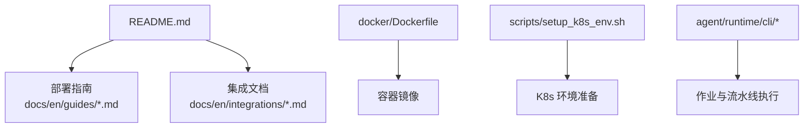
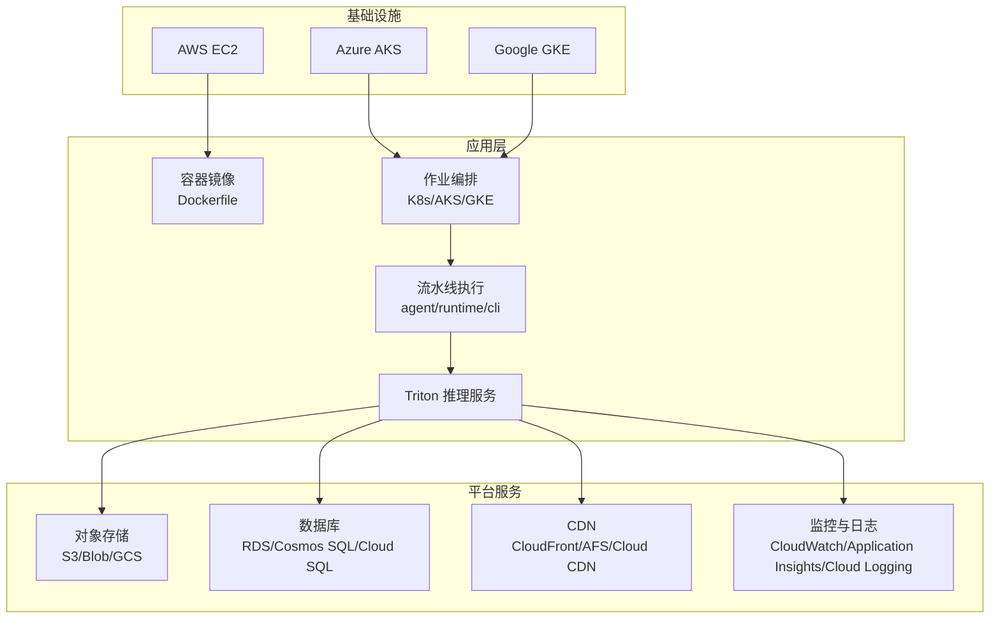
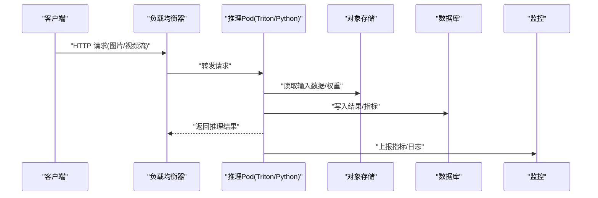
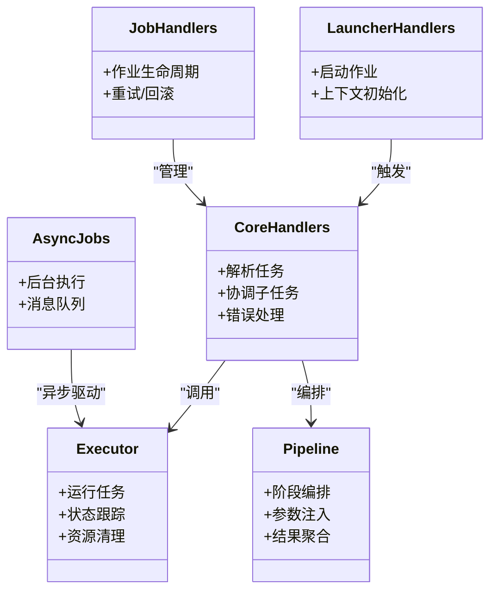
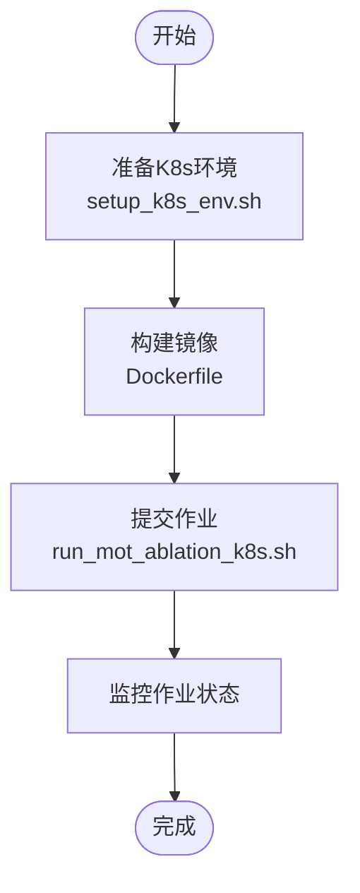
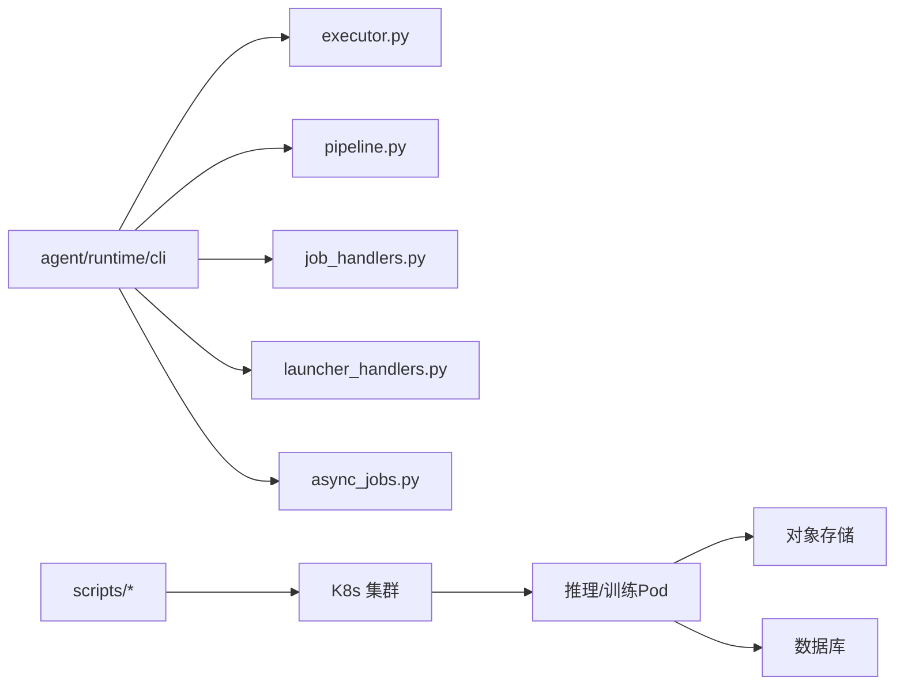

# 云平台部署

<cite>
**本文引用的文件**
- [README.md](file://README.md)
- [Dockerfile](file://docker/Dockerfile)
- [mkdocs.yml](file://mkdocs.yml)
- [azureml-quickstart.md](file://docs/en/guides/azureml-quickstart.md)
- [vertex-ai-deployment-with-docker.md](file://docs/en/guides/vertex-ai-deployment-with-docker.md)
- [amazon-sagemaker.md](file://docs/en/integrations/amazon-sagemaker.md)
- [model-deployment-options.md](file://docs/en/guides/model-deployment-options.md)
- [triton-inference-server.md](file://docs/en/guides/triton-inference-server.md)
- [run_yolo_master_skill.py](file://agent/scripts/run_yolo_master_skill.py)
- [core_handlers.py](file://agent/runtime/cli/core_handlers.py)
- [executor.py](file://agent/runtime/cli/executor.py)
- [pipeline.py](file://agent/runtime/cli/pipeline.py)
- [launcher_handlers.py](file://agent/runtime/cli/launcher_handlers.py)
- [job_handlers.py](file://agent/runtime/cli/job_handlers.py)
- [async_jobs.py](file://agent/runtime/cli/async_jobs.py)
- [setup_k8s_env.sh](file://scripts/setup_k8s_env.sh)
- [run_mot_ablation_k8s.sh](file://scripts/run_mot_ablation_k8s.sh)
</cite>

## 目录
1. [简介](#简介)
2. [项目结构](#项目结构)
3. [核心组件](#核心组件)
4. [架构总览](#架构总览)
5. [详细组件分析](#详细组件分析)
6. [依赖关系分析](#依赖关系分析)
7. [性能与弹性伸缩](#性能与弹性伸缩)
8. [成本优化策略](#成本优化策略)
9. [云安全配置](#云安全配置)
10. [多云与混合云方案](#多云与混合云方案)
11. [故障排查指南](#故障排查指南)
12. [结论](#结论)

## 简介
本文件面向在主流云平台（AWS、Azure、GCP）上部署 YOLO-Master 的工程团队，提供从容器化镜像构建、推理服务编排到弹性扩缩容、监控与安全的端到端实践。文档结合仓库中已有的部署指南与脚本，给出可操作的步骤与最佳实践，并补充多云与混合云架构建议。

## 项目结构
仓库包含多份与部署相关的文档与脚本：
- 部署指南：Azure ML 快速开始、Vertex AI + Docker 部署、Amazon SageMaker 集成、模型部署选项、Triton 推理服务器等
- 容器镜像：Dockerfile 用于构建推理或训练环境
- 编排与自动化：Kubernetes 环境准备与示例作业脚本
- Agent 运行时：CLI 入口、任务调度、作业管理、异步执行等模块，便于在云端以作业形式运行训练/推理流水线

图表来源
- [README.md](file://README.md)
- [Dockerfile](file://docker/Dockerfile)
- [setup_k8s_env.sh](file://scripts/setup_k8s_env.sh)
- [core_handlers.py](file://agent/runtime/cli/core_handlers.py)
- [executor.py](file://agent/runtime/cli/executor.py)
- [pipeline.py](file://agent/runtime/cli/pipeline.py)

章节来源
- [README.md](file://README.md)
- [Dockerfile](file://docker/Dockerfile)
- [setup_k8s_env.sh](file://scripts/setup_k8s_env.sh)

## 核心组件
- 容器镜像与打包
  - 使用 docker/Dockerfile 构建统一镜像，封装推理/训练依赖与环境，确保跨云一致性
- 部署指南与集成
  - Azure ML 快速开始：适合在 AKS 上托管的批处理/在线推理工作负载
  - Vertex AI + Docker：在 GKE 上以托管方式运行自定义容器
  - Amazon SageMaker：在 AWS 上以托管训练/推理服务交付
  - Triton Inference Server：高性能多框架推理后端，适合高并发场景
- 作业与流水线执行
  - agent/runtime/cli 下的 CLI 与处理器负责解析任务、编排执行、管理作业生命周期
  - 通过脚本将训练/推理任务抽象为“作业”，便于在 K8s/AKS/GKE 上以 Pod 形式运行

章节来源
- [Dockerfile](file://docker/Dockerfile)
- [azureml-quickstart.md](file://docs/en/guides/azureml-quickstart.md)
- [vertex-ai-deployment-with-docker.md](file://docs/en/guides/vertex-ai-deployment-with-docker.md)
- [amazon-sagemaker.md](file://docs/en/integrations/amazon-sagemaker.md)
- [triton-inference-server.md](file://docs/en/guides/triton-inference-server.md)
- [core_handlers.py](file://agent/runtime/cli/core_handlers.py)
- [executor.py](file://agent/runtime/cli/executor.py)
- [pipeline.py](file://agent/runtime/cli/pipeline.py)

## 架构总览
下图展示在云上部署 YOLO-Master 的典型分层：IaaS/PaaS 层（EC2/AKS/GKE）、平台服务（对象存储、数据库、CDN、监控）、应用层（容器化推理/训练服务），以及统一的作业编排与流水线执行。

图表来源
- [Dockerfile](file://docker/Dockerfile)
- [triton-inference-server.md](file://docs/en/guides/triton-inference-server.md)
- [setup_k8s_env.sh](file://scripts/setup_k8s_env.sh)
- [core_handlers.py](file://agent/runtime/cli/core_handlers.py)
- [executor.py](file://agent/runtime/cli/executor.py)
- [pipeline.py](file://agent/runtime/cli/pipeline.py)

## 详细组件分析

### 组件一：容器镜像与推理服务
- 目标
  - 基于 docker/Dockerfile 构建可移植镜像，支持 CPU/GPU 两种运行模式
  - 在 AKS/GKE 中以 Deployment/Service 暴露推理服务；或在 EC2 上以进程方式运行
- 关键要点
  - 镜像内安装推理依赖（如 ONNX/TensorRT/OpenVINO 等，视导出格式而定）
  - 启动命令指向推理入口（例如 Triton 或自研 Python 服务）
  - 健康检查探针就绪/存活探测，配合负载均衡器进行流量分发

图表来源
- [Dockerfile](file://docker/Dockerfile)
- [triton-inference-server.md](file://docs/en/guides/triton-inference-server.md)

章节来源
- [Dockerfile](file://docker/Dockerfile)
- [triton-inference-server.md](file://docs/en/guides/triton-inference-server.md)

### 组件二：作业与流水线执行（Agent Runtime）
- 职责
  - 解析任务定义、加载配置、驱动执行器、管理作业生命周期
  - 提供异步作业能力，便于在云端队列/消息系统中解耦生产与消费
- 关键模块
  - core_handlers.py：核心处理器，协调各子任务
  - executor.py：执行器，负责具体任务的运行与状态跟踪
  - pipeline.py：流水线编排，串联多个阶段（预处理、推理、后处理、评估）
  - launcher_handlers.py / job_handlers.py：作业启动与管理
  - async_jobs.py：异步作业机制，支持后台执行与重试

图表来源
- [core_handlers.py](file://agent/runtime/cli/core_handlers.py)
- [executor.py](file://agent/runtime/cli/executor.py)
- [pipeline.py](file://agent/runtime/cli/pipeline.py)
- [launcher_handlers.py](file://agent/runtime/cli/launcher_handlers.py)
- [job_handlers.py](file://agent/runtime/cli/job_handlers.py)
- [async_jobs.py](file://agent/runtime/cli/async_jobs.py)

章节来源
- [core_handlers.py](file://agent/runtime/cli/core_handlers.py)
- [executor.py](file://agent/runtime/cli/executor.py)
- [pipeline.py](file://agent/runtime/cli/pipeline.py)
- [launcher_handlers.py](file://agent/runtime/cli/launcher_handlers.py)
- [job_handlers.py](file://agent/runtime/cli/job_handlers.py)
- [async_jobs.py](file://agent/runtime/cli/async_jobs.py)

### 组件三：Kubernetes 环境准备与示例作业
- setup_k8s_env.sh：用于在本地或 CI 环境中准备 K8s 集群访问、命名空间、RBAC 等基础设置
- run_mot_ablation_k8s.sh：示例脚本，演示如何在 K8s 上提交作业（可用于训练/推理/评估）

图表来源
- [setup_k8s_env.sh](file://scripts/setup_k8s_env.sh)
- [run_mot_ablation_k8s.sh](file://scripts/run_mot_ablation_k8s.sh)
- [Dockerfile](file://docker/Dockerfile)

章节来源
- [setup_k8s_env.sh](file://scripts/setup_k8s_env.sh)
- [run_mot_ablation_k8s.sh](file://scripts/run_mot_ablation_k8s.sh)

### 组件四：云平台部署指南（Azure、GCP、AWS）
- Azure ML 快速开始：适用于在 AKS 上托管的训练/推理作业，提供一键式体验与资源管理
- Vertex AI + Docker：在 GKE 上以托管方式运行自定义容器，简化运维
- Amazon SageMaker：在 AWS 上以托管训练/推理服务交付，适合企业级流水线
- 模型部署选项与 Triton：提供多种推理后端选择，满足低延迟与高吞吐需求

章节来源
- [azureml-quickstart.md](file://docs/en/guides/azureml-quickstart.md)
- [vertex-ai-deployment-with-docker.md](file://docs/en/guides/vertex-ai-deployment-with-docker.md)
- [amazon-sagemaker.md](file://docs/en/integrations/amazon-sagemaker.md)
- [model-deployment-options.md](file://docs/en/guides/model-deployment-options.md)
- [triton-inference-server.md](file://docs/en/guides/triton-inference-server.md)

## 依赖关系分析
- 外部依赖
  - 容器运行时（Docker）
  - Kubernetes 集群（AKS/GKE/EKS）
  - 云平台对象存储（S3/Blob/GCS）
  - 云平台数据库（RDS/Cosmos SQL/Cloud SQL）
  - 监控与日志（CloudWatch/Application Insights/Cloud Logging）
- 内部依赖
  - agent/runtime/cli 模块之间通过处理器与执行器协作，形成清晰的职责边界
  - 作业脚本与 K8s 环境准备脚本为上层编排提供基础能力

图表来源
- [core_handlers.py](file://agent/runtime/cli/core_handlers.py)
- [executor.py](file://agent/runtime/cli/executor.py)
- [pipeline.py](file://agent/runtime/cli/pipeline.py)
- [job_handlers.py](file://agent/runtime/cli/job_handlers.py)
- [launcher_handlers.py](file://agent/runtime/cli/launcher_handlers.py)
- [async_jobs.py](file://agent/runtime/cli/async_jobs.py)
- [setup_k8s_env.sh](file://scripts/setup_k8s_env.sh)
- [run_mot_ablation_k8s.sh](file://scripts/run_mot_ablation_k8s.sh)

章节来源
- [core_handlers.py](file://agent/runtime/cli/core_handlers.py)
- [executor.py](file://agent/runtime/cli/executor.py)
- [pipeline.py](file://agent/runtime/cli/pipeline.py)
- [job_handlers.py](file://agent/runtime/cli/job_handlers.py)
- [launcher_handlers.py](file://agent/runtime/cli/launcher_handlers.py)
- [async_jobs.py](file://agent/runtime/cli/async_jobs.py)
- [setup_k8s_env.sh](file://scripts/setup_k8s_env.sh)
- [run_mot_ablation_k8s.sh](file://scripts/run_mot_ablation_k8s.sh)

## 性能与弹性伸缩
- 自动扩缩容
  - 在 AKS/GKE 上使用 Horizontal Pod Autoscaler（HPA），基于 CPU/GPU 利用率或自定义指标（QPS、延迟）进行扩缩容
  - 在 EC2 上使用 Auto Scaling Group，结合 ALB/NLB 的健康检查进行实例扩缩
- 负载均衡与健康检查
  - 为推理服务配置就绪/存活探针，确保流量仅路由到健康实例
  - 使用云负载均衡器（ALB/AFS/Cloud Load Balancing）进行流量分发与熔断
- 推理后端优化
  - 采用 Triton Inference Server 提升吞吐与并发能力
  - 根据模型导出格式选择合适的后端（ONNX/TensorRT/OpenVINO），减少推理延迟

章节来源
- [triton-inference-server.md](file://docs/en/guides/triton-inference-server.md)
- [model-deployment-options.md](file://docs/en/guides/model-deployment-options.md)

## 成本优化策略
- 实例类型选择
  - 推理：优先选择性价比高的 GPU 实例（如 T4/L4），CPU 推理可使用通用型实例
  - 训练：选择高内存/高带宽实例，结合多机多卡并行
- 预留实例与竞价实例
  - 对稳定基线负载使用预留实例降低单位成本
  - 对批处理/弹性负载使用竞价实例，注意容错与重试机制
- 资源隔离与配额
  - 在 K8s 中使用 ResourceQuota/LimitRange 限制命名空间资源使用，避免资源争用
- 缓存与CDN
  - 将静态资源与模型权重缓存至对象存储+CDN，减少重复下载与网络开销

[本节为通用指导，不直接分析具体文件]

## 云安全配置
- IAM 权限管理
  - 遵循最小权限原则，为作业与服务账号分配必要的最小权限
  - 在 K8s 中使用 RBAC 控制 Pod 对 API 对象的访问
- 网络安全组
  - 在 VPC/子网层面限制入站/出站流量，仅开放必要的端口
  - 使用私有子网与 NAT 网关访问外部资源
- 密钥管理
  - 使用云平台密钥管理服务（Secret Manager/KMS）管理敏感信息
  - 在 K8s 中使用 Secret 与 ConfigMap 注入配置与凭据
- 审计与合规
  - 开启云平台的审计日志（CloudTrail/Activity Log/Cloud Audit Logs）
  - 定期审查权限与网络策略，确保安全基线

[本节为通用指导，不直接分析具体文件]

## 多云与混合云方案
- 多云架构
  - 在 AWS/Azure/GCP 分别部署推理服务，通过全局负载均衡（如 Cloudflare/Route 53/Global Traffic Manager）进行流量调度
  - 使用对象存储的多区域复制实现数据就近访问
- 混合云架构
  - 云端集中训练与模型注册，边缘节点（EC2/AKS/GKE 上的节点池）进行推理
  - 通过消息队列/事件总线实现训练结果与推理任务的解耦
- 统一编排
  - 使用 K8s 作为统一编排层，结合 GitOps（ArgoCD/Flux）实现多集群一致部署

[本节为通用指导，不直接分析具体文件]

## 故障排查指南
- 常见问题定位
  - 镜像构建失败：检查 Dockerfile 依赖与网络代理
  - 作业启动失败：查看 K8s 事件与 Pod 日志，确认资源配额与镜像拉取策略
  - 推理延迟升高：检查 GPU 利用率、内存占用与网络带宽
- 日志与监控
  - 启用云平台日志收集（CloudWatch/Application Insights/Cloud Logging）
  - 在推理服务中输出结构化日志与指标，接入 Prometheus/Grafana 可视化
- 回滚与恢复
  - 使用版本化镜像与蓝绿/金丝雀发布策略，确保快速回滚
  - 对作业引入重试与幂等性设计，避免重复执行导致的数据不一致

章节来源
- [setup_k8s_env.sh](file://scripts/setup_k8s_env.sh)
- [run_mot_ablation_k8s.sh](file://scripts/run_mot_ablation_k8s.sh)
- [triton-inference-server.md](file://docs/en/guides/triton-inference-server.md)

## 结论
通过在容器化基础上结合云平台托管服务与 K8s 编排，YOLO-Master 可在 AWS/Azure/GCP 上实现高效、可扩展且安全的部署。借助作业与流水线执行模块，工程团队可将训练与推理流程标准化，并通过弹性伸缩、监控与安全策略保障稳定性与成本可控。多云与混合云方案进一步提升了业务韧性与全球服务能力。