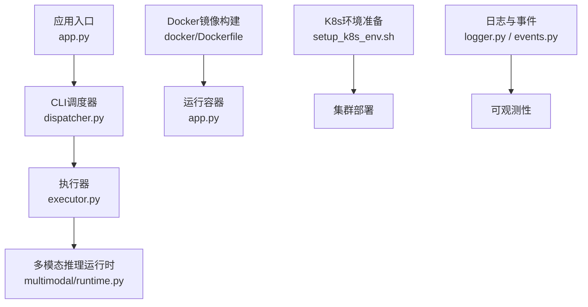
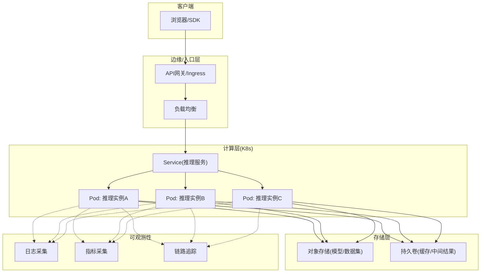
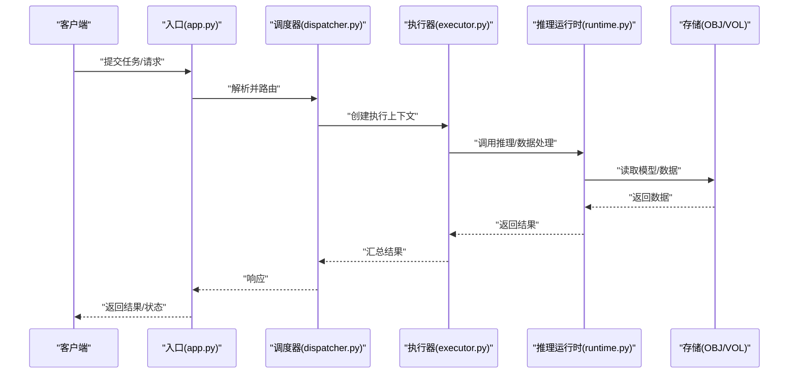
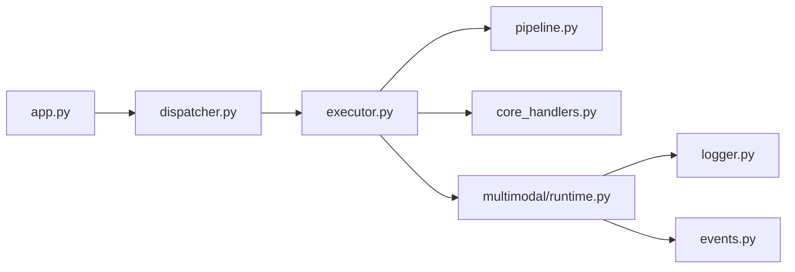

# 云服务部署

<cite>
**本文引用的文件**
- [Dockerfile](file://docker/Dockerfile)
- [.dockerignore](file://.dockerignore)
- [app.py](file://app.py)
- [pyproject.toml](file://pyproject.toml)
- [mkdocs.yml](file://mkdocs.yml)
- [README.md](file://README.md)
- [docs/en/guides/docker-quickstart.md](file://docs/en/guides/docker-quickstart.md)
- [docs/en/guides/model-deployment-options.md](file://docs/en/guides/model-deployment-options.md)
- [docs/en/guides/triton-inference-server.md](file://docs/en/guides/triton-inference-server.md)
- [docs/en/integrations/amazon-sagemaker.md](file://docs/en/integrations/amazon-sagemaker.md)
- [docs/en/guides/vertex-ai-deployment-with-docker.md](file://docs/en/guides/vertex-ai-deployment-with-docker.md)
- [docs/en/guides/azureml-quickstart.md](file://docs/en/guides/azureml-quickstart.md)
- [scripts/setup_k8s_env.sh](file://scripts/setup_k8s_env.sh)
- [scripts/run_yolo_master_skill.py](file://agent/scripts/run_yolo_master_skill.py)
- [agent/runtime/cli/core_handlers.py](file://agent/runtime/cli/core_handlers.py)
- [agent/runtime/cli/dispatcher.py](file://agent/runtime/cli/dispatcher.py)
- [agent/runtime/cli/executor.py](file://agent/runtime/cli/executor.py)
- [agent/runtime/cli/pipeline.py](file://agent/runtime/cli/pipeline.py)
- [agent/runtime/multimodal/runtime.py](file://agent/runtime/multimodal/runtime.py)
- [ultralytics/utils/logger.py](file://ultralytics/utils/logger.py)
- [ultralytics/utils/events.py](file://ultralytics/utils/events.py)
</cite>

## 目录
1. [简介](#简介)
2. [项目结构](#项目结构)
3. [核心组件](#核心组件)
4. [架构总览](#架构总览)
5. [详细组件分析](#详细组件分析)
6. [依赖关系分析](#依赖关系分析)
7. [性能与伸缩性](#性能与伸缩性)
8. [CI/CD流水线](#cicd流水线)
9. [监控与日志](#监控与日志)
10. [安全加固与访问控制](#安全加固与访问控制)
11. [成本优化与资源管理](#成本优化与资源管理)
12. [高可用与灾难恢复](#高可用与灾难恢复)
13. [故障排查指南](#故障排查指南)
14. [结论](#结论)

## 简介
本技术文档面向YOLO-Master的云服务部署，围绕容器化、微服务架构、云平台落地、弹性伸缩、CI/CD、云原生可观测性、安全与合规、成本优化以及高可用与灾备等主题，提供从镜像构建到生产运行的完整实践路径。文档同时结合仓库中已有的Dockerfile、应用入口、CLI调度器与推理运行时等代码资产，给出可落地的架构图与流程说明。

## 项目结构
仓库中与云服务部署直接相关的核心资产包括：
- 容器镜像定义与忽略规则：docker/Dockerfile、.dockerignore
- 应用入口与依赖声明：app.py、pyproject.toml
- 文档与平台集成指引：docs/en/guides/*、docs/en/integrations/*
- Kubernetes环境准备脚本：scripts/setup_k8s_env.sh
- 任务编排与推理运行时：agent/runtime/cli/*、agent/runtime/multimodal/runtime.py
- 日志与事件基础设施：ultralytics/utils/logger.py、ultralytics/utils/events.py

图示来源
- [app.py](file://app.py)
- [dispatcher.py](file://agent/runtime/cli/dispatcher.py)
- [executor.py](file://agent/runtime/cli/executor.py)
- [runtime.py](file://agent/runtime/multimodal/runtime.py)
- [Dockerfile](file://docker/Dockerfile)
- [setup_k8s_env.sh](file://scripts/setup_k8s_env.sh)
- [logger.py](file://ultralytics/utils/logger.py)
- [events.py](file://ultralytics/utils/events.py)

章节来源
- [Dockerfile](file://docker/Dockerfile)
- [.dockerignore](file://.dockerignore)
- [app.py](file://app.py)
- [pyproject.toml](file://pyproject.toml)
- [setup_k8s_env.sh](file://scripts/setup_k8s_env.sh)
- [dispatcher.py](file://agent/runtime/cli/dispatcher.py)
- [executor.py](file://agent/runtime/cli/executor.py)
- [runtime.py](file://agent/runtime/multimodal/runtime.py)
- [logger.py](file://ultralytics/utils/logger.py)
- [events.py](file://ultralytics/utils/events.py)

## 核心组件
- 容器镜像层
  - Dockerfile负责构建推理与服务运行所需的基础镜像，包含Python环境、依赖安装与入口配置。
  - .dockerignore用于排除无关文件，减小镜像体积并提升构建速度。
- 应用入口与依赖
  - app.py作为服务启动入口，承载HTTP或进程内API暴露能力（具体协议以实现为准）。
  - pyproject.toml声明项目依赖与打包元数据，确保构建一致性与可重现性。
- CLI与任务编排
  - dispatcher.py负责请求分发与路由；executor.py负责具体任务执行；pipeline.py串联多阶段处理。
  - run_yolo_master_skill.py为技能化任务的统一入口，便于在容器或K8s中以Job/Pod形式运行。
- 推理运行时
  - multimodal/runtime.py封装多模态推理能力，供上层调用。
- 可观测性
  - logger.py与events.py提供结构化日志与事件上报能力，便于接入外部监控系统。

章节来源
- [Dockerfile](file://docker/Dockerfile)
- [.dockerignore](file://.dockerignore)
- [app.py](file://app.py)
- [pyproject.toml](file://pyproject.toml)
- [run_yolo_master_skill.py](file://agent/scripts/run_yolo_master_skill.py)
- [core_handlers.py](file://agent/runtime/cli/core_handlers.py)
- [dispatcher.py](file://agent/runtime/cli/dispatcher.py)
- [executor.py](file://agent/runtime/cli/executor.py)
- [pipeline.py](file://agent/runtime/cli/pipeline.py)
- [runtime.py](file://agent/runtime/multimodal/runtime.py)
- [logger.py](file://ultralytics/utils/logger.py)
- [events.py](file://ultralytics/utils/events.py)

## 架构总览
下图展示基于容器的微服务部署参考架构：API网关对外暴露统一入口，后端由多个无状态推理Pod组成，通过Kubernetes Service进行负载均衡与发现；持久化数据与模型权重挂载至共享存储；日志与指标通过Sidecar或DaemonSet收集。

[此图为概念性架构图，不直接映射具体源码文件]

## 详细组件分析

### 容器镜像与构建优化
- 多阶段构建建议
  - 构建阶段：安装编译型依赖、下载大体积模型权重、生成导出产物。
  - 运行阶段：仅保留最小运行依赖与必要二进制，显著降低镜像体积。
- 镜像分层与缓存
  - 将频繁变更的代码与稳定依赖分层，利用Docker缓存加速增量构建。
- 安全基线
  - 使用非root用户运行容器；定期扫描镜像漏洞；最小权限原则。
- 参考实现位置
  - 镜像构建定义位于docker/Dockerfile；忽略规则位于.dockerignore。

章节来源
- [Dockerfile](file://docker/Dockerfile)
- [.dockerignore](file://.dockerignore)

### 应用入口与依赖管理
- 入口职责
  - app.py作为服务启动点，负责初始化依赖、加载模型、暴露接口与优雅关停。
- 依赖声明
  - pyproject.toml集中声明运行时依赖与可选特性，保证跨环境一致性。
- 最佳实践
  - 使用虚拟环境隔离；锁定依赖版本；按需启用GPU/CPU后端。

章节来源
- [app.py](file://app.py)
- [pyproject.toml](file://pyproject.toml)

### CLI调度与任务编排
- 组件职责
  - dispatcher.py：接收任务、解析参数、选择执行策略。
  - executor.py：执行具体推理或训练任务，管理生命周期与错误回退。
  - pipeline.py：组合多个步骤形成端到端流水线。
  - core_handlers.py：通用处理器，如输入校验、输出格式化。
- 编排模式
  - 支持同步/异步任务；具备重试、超时与熔断机制。
- 参考实现位置
  - agent/runtime/cli/dispatcher.py、executor.py、pipeline.py、core_handlers.py

图示来源
- [app.py](file://app.py)
- [dispatcher.py](file://agent/runtime/cli/dispatcher.py)
- [executor.py](file://agent/runtime/cli/executor.py)
- [runtime.py](file://agent/runtime/multimodal/runtime.py)

章节来源
- [dispatcher.py](file://agent/runtime/cli/dispatcher.py)
- [executor.py](file://agent/runtime/cli/executor.py)
- [pipeline.py](file://agent/runtime/cli/pipeline.py)
- [core_handlers.py](file://agent/runtime/cli/core_handlers.py)

### 多模态推理运行时
- 功能要点
  - 统一封装图像/文本等多模态输入预处理、模型加载、推理与后处理。
  - 支持动态批处理、设备选择与内存复用。
- 扩展点
  - 通过适配器模式接入不同后端（ONNX/TensorRT/OpenVINO等）。
- 参考实现位置
  - agent/runtime/multimodal/runtime.py

章节来源
- [runtime.py](file://agent/runtime/multimodal/runtime.py)

### 云平台部署参考
- Amazon SageMaker
  - 使用容器镜像部署自定义推理端点；结合SageMaker Model Registry管理模型版本。
  - 参考：docs/en/integrations/amazon-sagemaker.md
- Google Vertex AI
  - 通过Vertex AI Endpoint部署Docker镜像；配合自动扩缩容与灰度发布。
  - 参考：docs/en/guides/vertex-ai-deployment-with-docker.md
- Azure ML
  - 使用Azure ML实时推理端点或批推理作业；结合Managed Identity与密钥管理。
  - 参考：docs/en/guides/azureml-quickstart.md
- Triton Inference Server
  - 对多框架模型进行统一服务化，适合大规模并发场景。
  - 参考：docs/en/guides/triton-inference-server.md
- Docker快速开始
  - 本地验证与容器化部署基础步骤。
  - 参考：docs/en/guides/docker-quickstart.md

章节来源
- [amazon-sagemaker.md](file://docs/en/integrations/amazon-sagemaker.md)
- [vertex-ai-deployment-with-docker.md](file://docs/en/guides/vertex-ai-deployment-with-docker.md)
- [azureml-quickstart.md](file://docs/en/guides/azureml-quickstart.md)
- [triton-inference-server.md](file://docs/en/guides/triton-inference-server.md)
- [docker-quickstart.md](file://docs/en/guides/docker-quickstart.md)

### Kubernetes环境准备与部署
- 环境准备
  - setup_k8s_env.sh用于初始化命名空间、RBAC、ConfigMap/Secret、存储类与Ingress等基础资源。
- 部署建议
  - Deployment+HPA实现水平扩缩容；Service暴露内部流量；Ingress/Gateway暴露外部流量。
  - 使用StatefulSet管理有状态工作负载（如缓存、索引）。
- 参考实现位置
  - scripts/setup_k8s_env.sh

章节来源
- [setup_k8s_env.sh](file://scripts/setup_k8s_env.sh)

## 依赖关系分析
- 模块耦合
  - app.py依赖CLI调度器与执行器；执行器依赖推理运行时；运行时依赖底层模型后端。
- 外部依赖
  - 云平台SDK、对象存储SDK、日志/指标采集Agent。
- 潜在风险
  - 循环依赖需避免；第三方库升级需回归测试；大模型权重加载需预热与缓存。

图示来源
- [app.py](file://app.py)
- [dispatcher.py](file://agent/runtime/cli/dispatcher.py)
- [executor.py](file://agent/runtime/cli/executor.py)
- [pipeline.py](file://agent/runtime/cli/pipeline.py)
- [core_handlers.py](file://agent/runtime/cli/core_handlers.py)
- [runtime.py](file://agent/runtime/multimodal/runtime.py)
- [logger.py](file://ultralytics/utils/logger.py)
- [events.py](file://ultralytics/utils/events.py)

章节来源
- [app.py](file://app.py)
- [dispatcher.py](file://agent/runtime/cli/dispatcher.py)
- [executor.py](file://agent/runtime/cli/executor.py)
- [pipeline.py](file://agent/runtime/cli/pipeline.py)
- [core_handlers.py](file://agent/runtime/cli/core_handlers.py)
- [runtime.py](file://agent/runtime/multimodal/runtime.py)
- [logger.py](file://ultralytics/utils/logger.py)
- [events.py](file://ultralytics/utils/events.py)

## 性能与伸缩性
- 推理性能
  - 使用量化与图优化（TensorRT/ONNX Runtime）；合理设置batch size与并发度；启用GPU内存池。
- 弹性伸缩
  - 基于CPU/GPU利用率、队列长度与P99延迟的HPA策略；冷启动优化（模型预热、懒加载）。
- 资源隔离
  - 通过K8s Limit/Request与节点亲和/反亲和保障稳定性。
- 参考文档
  - docs/en/guides/model-deployment-options.md

章节来源
- [model-deployment-options.md](file://docs/en/guides/model-deployment-options.md)

## CI/CD流水线
- 推荐流程
  - 代码提交触发静态检查与单元测试；构建镜像并推送镜像仓库；在预发环境进行冒烟测试；灰度发布与回滚策略。
- 关键工件
  - Docker镜像、模型权重包、配置清单（Helm/Kustomize）、制品库中的可追溯版本。
- 自动化部署
  - 使用Argo CD/Flux进行GitOps；蓝绿/金丝雀发布；健康检查与探针。
- 参考入口
  - agent/scripts/run_yolo_master_skill.py可作为CI中批量任务或Job的入口。

章节来源
- [run_yolo_master_skill.py](file://agent/scripts/run_yolo_master_skill.py)

## 监控与日志
- 日志规范
  - 结构化JSON格式；包含trace_id、task_id、耗时、资源占用等字段。
- 指标采集
  - 暴露Prometheus指标；采集QPS、延迟分位、错误率、GPU利用率、显存占用。
- 链路追踪
  - 集成OpenTelemetry，贯穿网关、服务与推理运行时。
- 参考实现位置
  - ultralytics/utils/logger.py、ultralytics/utils/events.py

章节来源
- [logger.py](file://ultralytics/utils/logger.py)
- [events.py](file://ultralytics/utils/events.py)

## 安全加固与访问控制
- 镜像安全
  - 最小镜像、非root运行、定期漏洞扫描与签名校验。
- 运行时安全
  - 网络策略限制入出站；Secret与KMS管理敏感信息；只读根文件系统。
- 访问控制
  - 网关鉴权（JWT/OAuth2）；细粒度RBAC；审计日志。
- 合规与治理
  - 数据脱敏与加密传输；模型水印与溯源；变更审批与基线对比。

[本节为通用实践指导，不直接分析具体文件]

## 成本优化与资源管理
- 资源规划
  - 根据峰值与长尾需求选择机型；合理使用Spot实例与抢占式资源。
- 模型与推理优化
  - 模型压缩与蒸馏；动态批处理；缓存热点结果。
- 存储与带宽
  - 冷热分层存储；就近读取与CDN加速。
- 参考文档
  - README.md、docs/en/guides/model-deployment-options.md

章节来源
- [README.md](file://README.md)
- [model-deployment-options.md](file://docs/en/guides/model-deployment-options.md)

## 高可用与灾难恢复
- 多可用区部署
  - 跨AZ分布Pod与数据库；失败域隔离。
- 备份与恢复
  - 定期快照与异地复制；演练恢复流程与RTO/RPO目标。
- 降级与熔断
  - 限流与熔断保护；降级策略（返回缓存或近似结果）。
- 参考脚本
  - scripts/setup_k8s_env.sh可用于初始化高可用相关的基础资源。

章节来源
- [setup_k8s_env.sh](file://scripts/setup_k8s_env.sh)

## 故障排查指南
- 常见问题定位
  - 启动失败：检查入口app.py与依赖；查看容器日志与事件。
  - 推理异常：核对输入格式、模型版本与设备可用性；关注执行器与运行时日志。
  - 性能退化：观察指标与慢查询；评估批大小与并发度。
- 工具与技巧
  - 使用kubectl logs/exec/port-forward；开启调试日志；复现最小用例。
- 参考实现位置
  - app.py、dispatcher.py、executor.py、runtime.py、logger.py、events.py

章节来源
- [app.py](file://app.py)
- [dispatcher.py](file://agent/runtime/cli/dispatcher.py)
- [executor.py](file://agent/runtime/cli/executor.py)
- [runtime.py](file://agent/runtime/multimodal/runtime.py)
- [logger.py](file://ultralytics/utils/logger.py)
- [events.py](file://ultralytics/utils/events.py)

## 结论
通过将YOLO-Master的服务与推理能力容器化，并结合Kubernetes与主流云平台能力，可实现高可用、可扩展、可观测且安全的云端部署。建议在CI/CD中固化镜像构建与发布流程，完善监控告警与容量规划，持续进行安全加固与成本优化，从而在生产环境中获得稳定高效的推理服务体验。