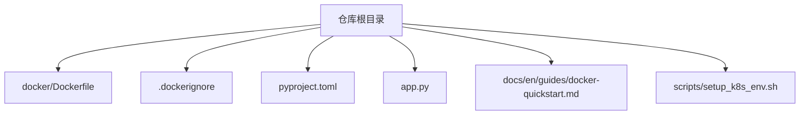
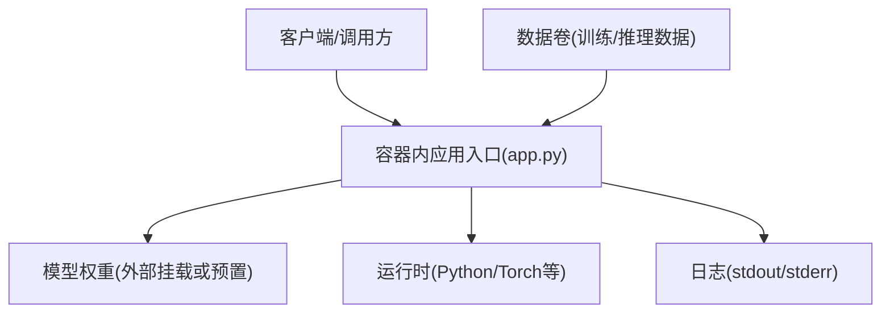
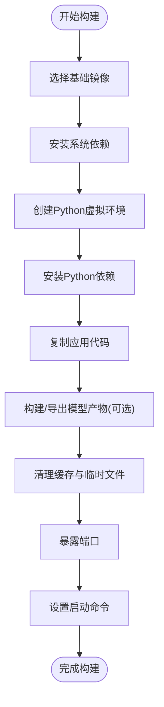
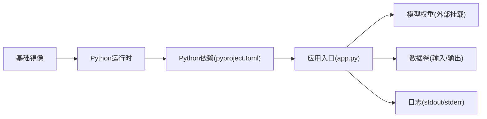

# 容器化部署

<cite>
**本文引用的文件**
- [docker/Dockerfile](file://docker/Dockerfile)
- [.dockerignore](file://.dockerignore)
- [pyproject.toml](file://pyproject.toml)
- [app.py](file://app.py)
- [docs/en/guides/docker-quickstart.md](file://docs/en/guides/docker-quickstart.md)
- [scripts/setup_k8s_env.sh](file://scripts/setup_k8s_env.sh)
</cite>

## 目录
1. [简介](#简介)
2. [项目结构](#项目结构)
3. [核心组件](#核心组件)
4. [架构总览](#架构总览)
5. [详细组件分析](#详细组件分析)
6. [依赖分析](#依赖分析)
7. [性能考虑](#性能考虑)
8. [故障排查指南](#故障排查指南)
9. [结论](#结论)
10. [附录](#附录)

## 简介
本技术文档面向YOLO-Master的容器化部署，聚焦Docker镜像构建与优化、多环境策略、编排集成（Docker Compose与Kubernetes）、安全加固、网络配置以及性能监控与资源限制。文档基于仓库中现有的Dockerfile、忽略规则、应用入口与相关脚本进行系统化说明，并提供可操作的实践建议与图示，帮助读者在不同环境中稳定、高效地运行YOLO-Master服务。

## 项目结构
与容器化直接相关的顶层文件与目录如下：
- docker/Dockerfile：镜像构建定义
- .dockerignore：构建上下文过滤，减少镜像体积与构建时间
- pyproject.toml：Python工程元数据与依赖声明（供镜像内安装使用）
- app.py：应用入口（用于容器启动命令或CMD/ENTRYPOINT）
- docs/en/guides/docker-quickstart.md：官方快速开始文档（含容器使用说明）
- scripts/setup_k8s_env.sh：Kubernetes环境准备脚本（辅助编排集成）

**图表来源**
- [docker/Dockerfile](file://docker/Dockerfile)
- [.dockerignore](file://.dockerignore)
- [pyproject.toml](file://pyproject.toml)
- [app.py](file://app.py)
- [docs/en/guides/docker-quickstart.md](file://docs/en/guides/docker-quickstart.md)
- [scripts/setup_k8s_env.sh](file://scripts/setup_k8s_env.sh)

**章节来源**
- [docker/Dockerfile](file://docker/Dockerfile)
- [.dockerignore](file://.dockerignore)
- [pyproject.toml](file://pyproject.toml)
- [app.py](file://app.py)
- [docs/en/guides/docker-quickstart.md](file://docs/en/guides/docker-quickstart.md)
- [scripts/setup_k8s_env.sh](file://scripts/setup_k8s_env.sh)

## 核心组件
- Dockerfile：定义基础镜像、系统依赖、Python环境与包安装、工作目录、端口暴露与启动命令等。
- .dockerignore：排除不必要的构建上下文文件，提升缓存命中与镜像瘦身效果。
- pyproject.toml：声明项目依赖与版本约束，便于在镜像中统一安装。
- app.py：容器进程入口，负责加载模型、提供服务或执行推理任务。
- docker-quickstart.md：提供容器快速上手步骤与环境变量说明。
- setup_k8s_env.sh：Kubernetes集群环境初始化与常用配置脚本。

**章节来源**
- [docker/Dockerfile](file://docker/Dockerfile)
- [.dockerignore](file://.dockerignore)
- [pyproject.toml](file://pyproject.toml)
- [app.py](file://app.py)
- [docs/en/guides/docker-quickstart.md](file://docs/en/guides/docker-quickstart.md)
- [scripts/setup_k8s_env.sh](file://scripts/setup_k8s_env.sh)

## 架构总览
下图展示容器化后YOLO-Master服务的典型运行架构：外部请求进入容器，由应用入口加载模型并执行推理；持久化数据通过卷挂载到容器内部路径；日志输出到标准输出以便采集。

[此图为概念性架构图，不直接映射具体源码文件]

## 详细组件分析

### Dockerfile 构建与优化
- 基础镜像选择
  - 建议使用轻量且稳定的基础镜像（如Python slim或特定CUDA版本镜像），以减小体积并确保GPU驱动兼容。
  - 若需GPU加速，应选用包含对应CUDA/cuDNN版本的镜像，并在容器内正确设置环境变量。
- 依赖安装
  - 优先使用系统包管理器安装编译型依赖，再使用pip安装Python依赖，避免重复下载与编译。
  - 将频繁变更的依赖安装步骤放在较后层，以提升缓存命中率。
- 环境变量配置
  - 设置必要的运行时环境变量（如设备选择、日志级别、模型路径等）。
  - 避免在镜像中硬编码敏感信息，使用运行时注入。
- 端口暴露
  - 明确EXPOSE端口号，确保与服务发现或编排工具一致。
- 启动命令
  - 使用exec形式的ENTRYPOINT/CMD，保证信号传递与优雅关闭。
- 多阶段构建策略
  - 构建阶段：安装编译工具链与依赖，完成模型导出或预处理。
  - 运行阶段：仅复制必要产物与最小运行时，显著降低镜像体积。
- 镜像分层优化与缓存利用
  - 将不变的系统依赖与变化的应用代码分层放置，最大化Docker缓存复用。
  - 合并RUN指令以减少层数，但需平衡可读性与缓存效率。
- 体积压缩技术
  - 清理包管理器缓存、临时文件与未使用的库。
  - 使用.dockerignore排除大文件或无关目录。
  - 可选：启用BuildKit多平台构建与镜像压缩选项。

**图表来源**
- [docker/Dockerfile](file://docker/Dockerfile)

**章节来源**
- [docker/Dockerfile](file://docker/Dockerfile)
- [.dockerignore](file://.dockerignore)

### .dockerignore 构建上下文过滤
- 目的：排除大型数据集、构建中间产物、本地缓存与IDE配置文件，减少构建上下文大小，提高构建速度与镜像体积。
- 建议排除项：
  - 大型数据目录与结果目录
  - 本地缓存与临时文件
  - IDE与编辑器配置
  - 测试与示例数据（除非需要）
- 影响：显著提升缓存命中率与构建稳定性。

**章节来源**
- [.dockerignore](file://.dockerignore)

### pyproject.toml 依赖管理
- 作用：集中声明项目依赖与版本约束，便于在镜像中统一安装。
- 最佳实践：
  - 锁定依赖版本，确保构建可重现。
  - 分离开发依赖与生产依赖，仅在构建阶段安装开发依赖。
  - 使用requirements或等价机制在镜像中安装生产依赖。

**章节来源**
- [pyproject.toml](file://pyproject.toml)

### app.py 应用入口
- 职责：加载模型、初始化运行时、处理请求或执行推理任务。
- 容器化要点：
  - 使用非root用户运行，提升安全性。
  - 合理设置线程/进程池，避免资源争用。
  - 健康检查端点与优雅关闭逻辑。
  - 日志输出到stdout/stderr，便于容器日志采集。

**章节来源**
- [app.py](file://app.py)

### docker-quickstart.md 快速开始
- 内容：提供容器拉取、运行、环境变量配置与端口映射的基本步骤。
- 适用场景：本地开发与快速验证。
- 注意事项：
  - 确认主机GPU驱动与容器CUDA版本匹配。
  - 根据需求调整内存与显存限制。

**章节来源**
- [docs/en/guides/docker-quickstart.md](file://docs/en/guides/docker-quickstart.md)

### setup_k8s_env.sh Kubernetes环境准备
- 功能：初始化Kubernetes集群所需的基础配置（如命名空间、存储类、网络插件等）。
- 使用方式：在部署前执行脚本，确保集群满足YOLO-Master的运行要求。
- 扩展：结合Helm或Kustomize实现参数化部署。

**章节来源**
- [scripts/setup_k8s_env.sh](file://scripts/setup_k8s_env.sh)

## 依赖分析
容器内主要依赖关系如下：
- 基础镜像提供操作系统与运行时环境
- Python依赖由pyproject.toml声明并通过镜像安装
- 应用入口依赖模型权重与数据卷
- 日志与监控通过标准输出与外部采集器对接

**图表来源**
- [docker/Dockerfile](file://docker/Dockerfile)
- [pyproject.toml](file://pyproject.toml)
- [app.py](file://app.py)

**章节来源**
- [docker/Dockerfile](file://docker/Dockerfile)
- [pyproject.toml](file://pyproject.toml)
- [app.py](file://app.py)

## 性能考虑
- GPU加速
  - 使用带CUDA/cuDNN的基础镜像，确保驱动版本兼容。
  - 在容器内设置正确的CUDA_VISIBLE_DEVICES与NVIDIA_VISIBLE_DEVICES。
- 资源限制
  - 为CPU与内存设置requests与limits，防止资源争用。
  - 对GPU实例设置显存上限，避免OOM。
- I/O优化
  - 使用高性能文件系统与并行读取。
  - 将热数据放入内存盘或高速卷。
- 并发与批处理
  - 合理设置批大小与线程/进程数，平衡吞吐与延迟。
- 缓存与预热
  - 首次请求时进行模型预热，降低冷启动延迟。
  - 利用Docker层缓存与镜像分层优化构建速度。

[本节为通用性能指导，不直接分析具体文件]

## 故障排查指南
- 构建失败
  - 检查.dockerignore是否排除了必要文件。
  - 确认基础镜像与CUDA版本匹配。
  - 查看构建日志定位依赖安装错误。
- 运行时崩溃
  - 检查环境变量是否正确注入。
  - 确认模型权重路径与权限。
  - 查看容器日志与系统指标。
- 性能问题
  - 分析CPU/内存/GPU利用率。
  - 调整批大小与并发度。
  - 检查I/O瓶颈与网络延迟。

**章节来源**
- [.dockerignore](file://.dockerignore)
- [docker/Dockerfile](file://docker/Dockerfile)
- [app.py](file://app.py)

## 结论
通过合理的Dockerfile设计、严格的构建上下文过滤、清晰的依赖管理与安全的运行配置，YOLO-Master可以在不同环境中稳定部署。结合Kubernetes的资源调度与弹性伸缩，可实现高可用与高性能的推理服务。持续优化镜像体积与构建缓存，配合完善的监控与告警体系，是保障生产环境稳定性的关键。

[本节为总结性内容，不直接分析具体文件]

## 附录

### 多环境镜像构建策略
- 开发环境
  - 使用完整依赖与调试工具，便于快速迭代。
  - 开启详细日志与交互式调试。
- 测试环境
  - 精简依赖，固定版本，确保可重现。
  - 引入自动化测试与回归验证。
- 生产环境
  - 最小化镜像，仅包含运行时必需组件。
  - 启用只读文件系统与安全加固。
  - 严格资源限制与健康检查。

[本节为概念性策略说明，不直接分析具体文件]

### 容器编排集成（Docker Compose与Kubernetes）
- Docker Compose
  - 定义服务、网络与卷，简化本地与CI/CD流程。
  - 使用环境变量与配置模板实现差异化部署。
- Kubernetes
  - 使用Deployment、Service、ConfigMap与Secret管理应用生命周期与配置。
  - 结合HPA实现自动扩缩容。
  - 使用Ingress或LoadBalancer暴露服务。

[本节为概念性编排说明，不直接分析具体文件]

### 安全加固与网络配置
- 安全加固
  - 使用非root用户运行容器。
  - 定期扫描镜像漏洞并更新基础镜像。
  - 最小权限原则，仅开放必要端口。
- 网络配置
  - 使用命名空间隔离不同环境。
  - 配置网络安全策略与访问控制列表。
  - 启用TLS加密与认证机制。

[本节为概念性安全与网络说明，不直接分析具体文件]

### 性能监控与资源限制示例
- 监控指标
  - CPU/内存/GPU利用率、请求延迟、吞吐量、错误率。
- 资源限制
  - 设置requests与limits，确保公平调度。
  - 针对GPU实例设置显存上限与超时。
- 采集与可视化
  - 使用Prometheus与Grafana收集与展示指标。
  - 配置告警规则与通知渠道。

[本节为概念性监控与限流说明，不直接分析具体文件]