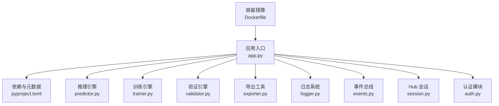
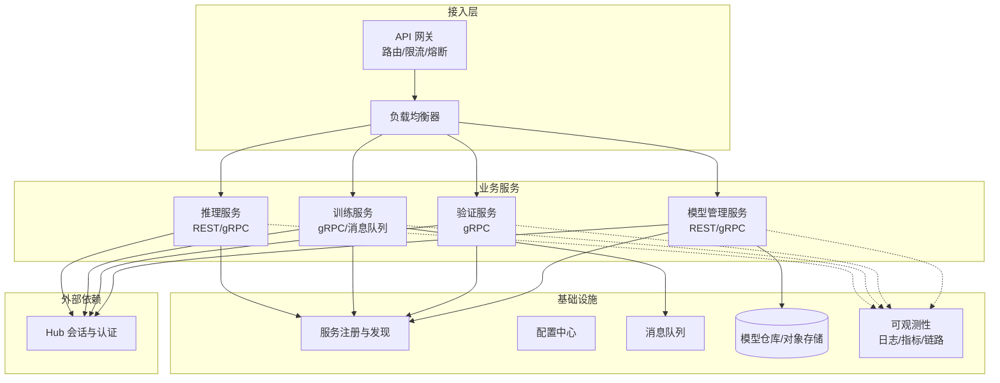
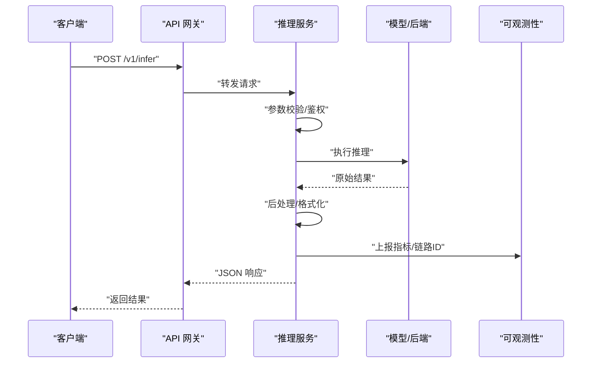
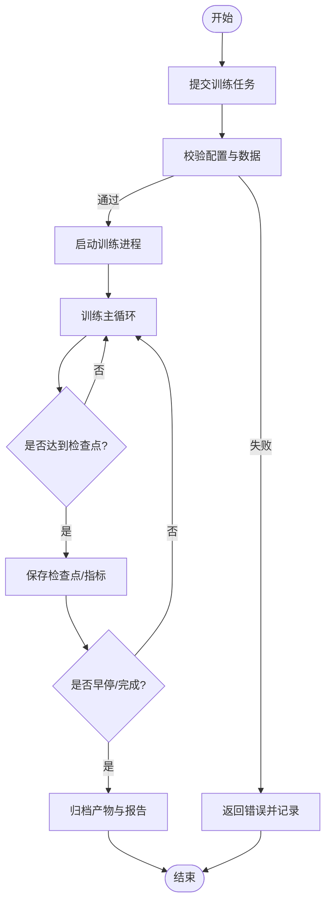
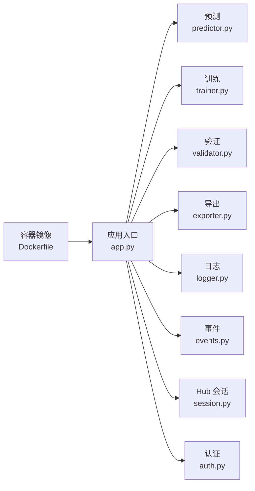

# 微服务架构设计

<cite>
**本文引用的文件**
- [app.py](file://app.py)
- [pyproject.toml](file://pyproject.toml)
- [ultralytics/engine/predictor.py](file://ultralytics/engine/predictor.py)
- [ultralytics/engine/trainer.py](file://ultralytics/engine/trainer.py)
- [ultralytics/engine/validator.py](file://ultralytics/engine/validator.py)
- [ultralytics/engine/exporter.py](file://ultralytics/engine/exporter.py)
- [ultralytics/utils/logger.py](file://ultralytics/utils/logger.py)
- [ultralytics/utils/events.py](file://ultralytics/utils/events.py)
- [ultralytics/hub/session.py](file://ultralytics/hub/session.py)
- [ultralytics/hub/auth.py](file://ultralytics/hub/auth.py)
- [docker/Dockerfile](file://docker/Dockerfile)
</cite>

## 目录
1. [简介](#简介)
2. [项目结构](#项目结构)
3. [核心组件](#核心组件)
4. [架构总览](#架构总览)
5. [详细组件分析](#详细组件分析)
6. [依赖分析](#依赖分析)
7. [性能考虑](#性能考虑)
8. [故障排查指南](#故障排查指南)
9. [结论](#结论)
10. [附录](#附录)

## 简介
本技术文档面向 YOLO-Master 的微服务化演进，围绕“推理服务、训练服务、模型管理服务、服务发现与治理、API 网关、通信协议、分布式事务与一致性、监控日志链路追踪、注册配置中心、扩缩容与故障恢复”等主题，给出可落地的架构设计与实现建议。当前仓库以 Python 包形式提供核心算法与引擎（预测、训练、验证、导出、事件与日志、Hub 会话等），并具备容器化能力。本文在尊重现有代码结构的基础上，提出将上述能力拆分为独立微服务的策略与集成方案，确保可扩展、可观测、高可用。

## 项目结构
从工程视角看，仓库包含以下与微服务相关的关键位置：
- 应用入口与依赖声明：用于定义服务边界、运行环境与外部依赖
- 推理与训练引擎：封装预测、训练、验证、导出等核心流程
- 事件与日志：为微服务可观测性提供基础
- Hub 会话与认证：为云端集成与鉴权提供支撑
- 容器镜像构建：为服务部署与扩缩容提供基础

图示来源
- [app.py:1-200](file://app.py#L1-L200)
- [pyproject.toml:1-200](file://pyproject.toml#L1-L200)
- [ultralytics/engine/predictor.py:1-200](file://ultralytics/engine/predictor.py#L1-L200)
- [ultralytics/engine/trainer.py:1-200](file://ultralytics/engine/trainer.py#L1-L200)
- [ultralytics/engine/validator.py:1-200](file://ultralytics/engine/validator.py#L1-L200)
- [ultralytics/engine/exporter.py:1-200](file://ultralytics/engine/exporter.py#L1-L200)
- [ultralytics/utils/logger.py:1-200](file://ultralytics/utils/logger.py#L1-L200)
- [ultralytics/utils/events.py:1-200](file://ultralytics/utils/events.py#L1-L200)
- [ultralytics/hub/session.py:1-200](file://ultralytics/hub/session.py#L1-L200)
- [ultralytics/hub/auth.py:1-200](file://ultralytics/hub/auth.py#L1-L200)
- [docker/Dockerfile:1-200](file://docker/Dockerfile#L1-L200)

章节来源
- [app.py:1-200](file://app.py#L1-L200)
- [pyproject.toml:1-200](file://pyproject.toml#L1-L200)
- [docker/Dockerfile:1-200](file://docker/Dockerfile#L1-L200)

## 核心组件
- 推理服务（Predictor）：负责加载模型、预处理输入、执行前向推理、后处理输出，适合对外暴露 REST/gRPC 接口进行在线推理
- 训练服务（Trainer）：负责数据集准备、优化器与调度器配置、多卡训练、检查点保存与恢复，适合异步任务编排
- 验证服务（Validator）：负责指标计算、结果汇总与报告生成，可作为训练流水线中的质量门禁
- 模型管理服务（Exporter + Registry）：负责模型导出（ONNX/TensorRT 等）、版本登记、元数据管理、灰度发布与回滚
- 可观测性组件（Logger + Events）：结构化日志、事件上报、指标采集，为监控与链路追踪提供基础
- 云端集成（Hub Session + Auth）：统一认证与会话管理，支持云端资源访问与审计

章节来源
- [ultralytics/engine/predictor.py:1-200](file://ultralytics/engine/predictor.py#L1-L200)
- [ultralytics/engine/trainer.py:1-200](file://ultralytics/engine/trainer.py#L1-L200)
- [ultralytics/engine/validator.py:1-200](file://ultralytics/engine/validator.py#L1-L200)
- [ultralytics/engine/exporter.py:1-200](file://ultralytics/engine/exporter.py#L1-L200)
- [ultralytics/utils/logger.py:1-200](file://ultralytics/utils/logger.py#L1-L200)
- [ultralytics/utils/events.py:1-200](file://ultralytics/utils/events.py#L1-L200)
- [ultralytics/hub/session.py:1-200](file://ultralytics/hub/session.py#L1-L200)
- [ultralytics/hub/auth.py:1-200](file://ultralytics/hub/auth.py#L1-L200)

## 架构总览
下图展示基于现有引擎的推荐微服务拆分与服务间交互方式。API 网关作为统一入口，按路径或协议路由到不同服务；服务通过 gRPC 进行高性能内部调用，REST 暴露给外部客户端；消息队列用于训练任务与导出任务的异步解耦；服务注册与配置中心保障动态扩缩容与热更新；可观测性体系贯穿全链路。

图示来源
- [ultralytics/engine/predictor.py:1-200](file://ultralytics/engine/predictor.py#L1-L200)
- [ultralytics/engine/trainer.py:1-200](file://ultralytics/engine/trainer.py#L1-L200)
- [ultralytics/engine/validator.py:1-200](file://ultralytics/engine/validator.py#L1-L200)
- [ultralytics/engine/exporter.py:1-200](file://ultralytics/engine/exporter.py#L1-L200)
- [ultralytics/hub/session.py:1-200](file://ultralytics/hub/session.py#L1-L200)
- [ultralytics/hub/auth.py:1-200](file://ultralytics/hub/auth.py#L1-L200)

## 详细组件分析

### 推理服务（Predictor）
- 职责
  - 接收请求（图像/视频帧/批量数据）
  - 模型加载与预热（冷启动优化）
  - 预处理、推理、后处理（NMS、阈值过滤）
  - 返回结构化结果（框、类别、置信度、掩码等）
- 关键流程
  - 初始化：加载配置、设备选择、模型权重、后端选择
  - 推理：批处理、并发控制、内存池复用
  - 输出：标准化响应格式、错误码与诊断信息
- 扩展点
  - 插件式后端（ONNXRuntime/TensorRT/OpenVINO 等）
  - 缓存策略（KV 缓存、结果缓存）
  - 自适应批大小与动态形状

图示来源
- [ultralytics/engine/predictor.py:1-200](file://ultralytics/engine/predictor.py#L1-L200)
- [ultralytics/utils/logger.py:1-200](file://ultralytics/utils/logger.py#L1-L200)
- [ultralytics/utils/events.py:1-200](file://ultralytics/utils/events.py#L1-L200)

章节来源
- [ultralytics/engine/predictor.py:1-200](file://ultralytics/engine/predictor.py#L1-L200)
- [ultralytics/utils/logger.py:1-200](file://ultralytics/utils/logger.py#L1-L200)
- [ultralytics/utils/events.py:1-200](file://ultralytics/utils/events.py#L1-L200)

### 训练服务（Trainer）
- 职责
  - 解析训练配置（超参、数据路径、设备拓扑）
  - 启动训练循环（数据加载、前向/反向、优化器步骤）
  - 检查点保存与断点续训
  - 指标记录与回调（早停、学习率调度）
- 关键流程
  - 任务提交：通过消息队列异步触发
  - 训练执行：分布式并行（DDP/多进程）
  - 结果归档：模型权重、日志、评估报告
- 扩展点
  - 弹性扩缩容（Pod 自动伸缩）
  - 任务重试与幂等性保证
  - 训练产物版本化与溯源

图示来源
- [ultralytics/engine/trainer.py:1-200](file://ultralytics/engine/trainer.py#L1-L200)
- [ultralytics/utils/logger.py:1-200](file://ultralytics/utils/logger.py#L1-L200)
- [ultralytics/utils/events.py:1-200](file://ultralytics/utils/events.py#L1-L200)

章节来源
- [ultralytics/engine/trainer.py:1-200](file://ultralytics/engine/trainer.py#L1-L200)
- [ultralytics/utils/logger.py:1-200](file://ultralytics/utils/logger.py#L1-L200)
- [ultralytics/utils/events.py:1-200](file://ultralytics/utils/events.py#L1-L200)

### 验证服务（Validator）
- 职责
  - 加载指定模型与测试集
  - 执行推理与指标计算（mAP、精度、召回等）
  - 生成评估报告与可视化
- 使用场景
  - 训练后的质量门禁
  - 模型对比与回归测试
  - 线上 A/B 实验离线评估

章节来源
- [ultralytics/engine/validator.py:1-200](file://ultralytics/engine/validator.py#L1-L200)

### 模型管理服务（Exporter + Registry）
- 职责
  - 模型导出（多后端、量化、剪枝）
  - 模型注册（版本、元数据、兼容性矩阵）
  - 灰度发布与回滚（流量切换、健康检查）
- 关键流程
  - 导入权重 -> 导出多格式 -> 写入模型仓库 -> 注册元数据 -> 通知下游服务
- 扩展点
  - 自动化 CI/CD 流水线集成
  - 模型指纹与完整性校验

章节来源
- [ultralytics/engine/exporter.py:1-200](file://ultralytics/engine/exporter.py#L1-L200)

### API 网关设计模式
- 请求路由
  - 基于路径/协议/租户维度路由至对应服务
  - 统一鉴权、限流、黑白名单
- 负载均衡
  - 四层/七层负载均衡，支持加权与亲和性
- 熔断降级
  - 基于错误率/延迟阈值的熔断
  - 降级策略：返回缓存、默认值或友好错误
- 可观测性
  - 请求级链路 ID 透传
  - 指标与日志聚合

章节来源
- [ultralytics/utils/logger.py:1-200](file://ultralytics/utils/logger.py#L1-L200)
- [ultralytics/utils/events.py:1-200](file://ultralytics/utils/events.py#L1-L200)

### 服务间通信协议
- REST API
  - 适用：外部客户端、跨语言调用、人类可读
  - 典型：推理查询、模型注册、任务状态查询
- gRPC
  - 适用：内部高性能调用、强类型契约、双向流
  - 典型：训练任务下发、验证流水线、模型分发
- 消息队列
  - 适用：异步任务、削峰填谷、最终一致性
  - 典型：训练任务、导出任务、指标上报

章节来源
- [ultralytics/hub/session.py:1-200](file://ultralytics/hub/session.py#L1-L200)
- [ultralytics/hub/auth.py:1-200](file://ultralytics/hub/auth.py#L1-L200)

### 分布式事务与一致性
- 训练任务
  - 采用“任务队列 + 幂等键 + 补偿动作”的最终一致性方案
  - 检查点持久化，失败重试时从最近检查点恢复
- 模型发布
  - 两阶段提交思想：先写模型仓库，再更新注册表；失败则回滚注册表
- 数据一致性
  - 训练数据版本化与快照，避免脏读
  - 指标与日志写入原子操作，失败重试与去重

章节来源
- [ultralytics/engine/trainer.py:1-200](file://ultralytics/engine/trainer.py#L1-L200)
- [ultralytics/engine/exporter.py:1-200](file://ultralytics/engine/exporter.py#L1-L200)

### 监控、日志与链路追踪
- 日志
  - 结构化 JSON 日志，统一字段（trace_id、service、level、msg）
  - 分级输出（debug/info/warn/error），敏感信息脱敏
- 指标
  - 服务级指标（QPS、延迟、错误率、资源占用）
  - 业务指标（推理耗时、训练收敛曲线、导出成功率）
- 链路追踪
  - 请求级 trace_id 透传，跨服务关联
  - 关键节点埋点（入站、出站、IO、模型加载）

章节来源
- [ultralytics/utils/logger.py:1-200](file://ultralytics/utils/logger.py#L1-L200)
- [ultralytics/utils/events.py:1-200](file://ultralytics/utils/events.py#L1-L200)

### 服务注册与发现、配置中心与服务治理
- 注册与发现
  - 服务启动时注册健康端点与元数据
  - 消费者侧缓存服务列表，定期刷新
- 配置中心
  - 集中化管理运行时配置（超时、阈值、开关）
  - 支持热更新与灰度配置
- 服务治理
  - 限流、熔断、重试、退避、舱壁隔离
  - 健康检查与自动摘除不健康实例

章节来源
- [ultralytics/hub/session.py:1-200](file://ultralytics/hub/session.py#L1-L200)
- [ultralytics/hub/auth.py:1-200](file://ultralytics/hub/auth.py#L1-L200)

### 扩缩容与故障恢复
- 水平扩缩容
  - 基于 CPU/GPU 利用率、队列长度、延迟分位数自动扩容
  - 推理服务无状态化，训练服务有状态需配合检查点
- 故障恢复
  - 训练任务断点续训，导出任务幂等重试
  - 模型加载失败快速失败并告警，启用备用模型或降级策略

章节来源
- [docker/Dockerfile:1-200](file://docker/Dockerfile#L1-L200)
- [ultralytics/engine/trainer.py:1-200](file://ultralytics/engine/trainer.py#L1-L200)
- [ultralytics/engine/exporter.py:1-200](file://ultralytics/engine/exporter.py#L1-L200)

## 依赖分析
- 直接依赖
  - 应用入口依赖各引擎模块（预测、训练、验证、导出）
  - 可观测性依赖日志与事件模块
  - 云端集成依赖 Hub 会话与认证
- 间接依赖
  - 容器镜像依赖操作系统库与运行时环境
  - 外部依赖（如 ONNXRuntime/TensorRT）由导出与推理后端引入

图示来源
- [app.py:1-200](file://app.py#L1-L200)
- [ultralytics/engine/predictor.py:1-200](file://ultralytics/engine/predictor.py#L1-L200)
- [ultralytics/engine/trainer.py:1-200](file://ultralytics/engine/trainer.py#L1-L200)
- [ultralytics/engine/validator.py:1-200](file://ultralytics/engine/validator.py#L1-L200)
- [ultralytics/engine/exporter.py:1-200](file://ultralytics/engine/exporter.py#L1-L200)
- [ultralytics/utils/logger.py:1-200](file://ultralytics/utils/logger.py#L1-L200)
- [ultralytics/utils/events.py:1-200](file://ultralytics/utils/events.py#L1-L200)
- [ultralytics/hub/session.py:1-200](file://ultralytics/hub/session.py#L1-L200)
- [ultralytics/hub/auth.py:1-200](file://ultralytics/hub/auth.py#L1-L200)
- [docker/Dockerfile:1-200](file://docker/Dockerfile#L1-L200)

章节来源
- [app.py:1-200](file://app.py#L1-L200)
- [pyproject.toml:1-200](file://pyproject.toml#L1-L200)

## 性能考虑
- 推理服务
  - 模型预热与常驻内存，减少冷启动延迟
  - 批处理与动态形状优化，提升吞吐
  - 后端选择与编译优化（TensorRT/OpenVINO）
- 训练服务
  - 数据管道并行与缓存，避免 IO 瓶颈
  - 梯度累积与混合精度，平衡显存与速度
  - 分布式通信优化（NCCL/集合通信）
- 模型导出
  - 增量导出与缓存命中，降低重复成本
  - 多目标平台并行导出，缩短交付时间

## 故障排查指南
- 常见问题定位
  - 推理失败：检查模型加载、输入尺寸、后端可用性
  - 训练中断：查看检查点、日志堆栈、资源不足告警
  - 导出异常：确认依赖库版本、权限与磁盘空间
- 可观测性手段
  - 通过 trace_id 串联请求链路
  - 结合指标与日志快速定位热点与异常
  - 使用健康检查与探针判断服务状态

章节来源
- [ultralytics/utils/logger.py:1-200](file://ultralytics/utils/logger.py#L1-L200)
- [ultralytics/utils/events.py:1-200](file://ultralytics/utils/events.py#L1-L200)

## 结论
通过将 YOLO-Master 的核心引擎拆分为推理、训练、验证与模型管理等微服务，并结合 API 网关、服务注册与配置中心、消息队列与可观测性体系，可实现高内聚、低耦合、易扩展的系统架构。建议在落地过程中优先完善可观测性与治理机制，逐步推进服务化改造与自动化运维，确保稳定性与效率并重。

## 附录
- 术语说明
  - API 网关：统一入口，负责路由、鉴权、限流、熔断
  - 服务注册与发现：维护服务实例清单与健康状态
  - 配置中心：集中管理运行时配置与特性开关
  - 消息队列：异步解耦与削峰填谷
  - 可观测性：日志、指标、链路追踪三位一体
- 参考实践
  - 容器化部署与镜像优化
  - 灰度发布与回滚策略
  - 弹性伸缩与容量规划