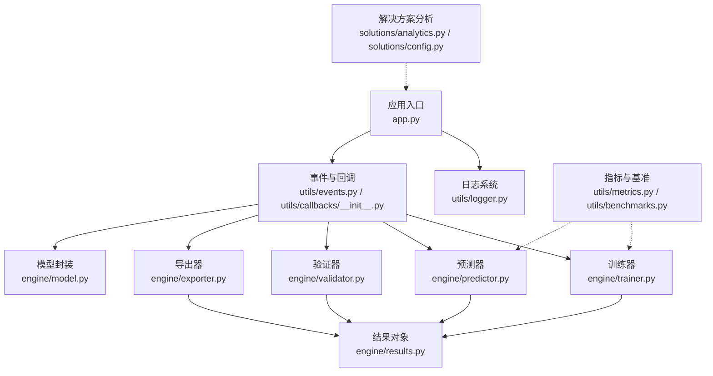
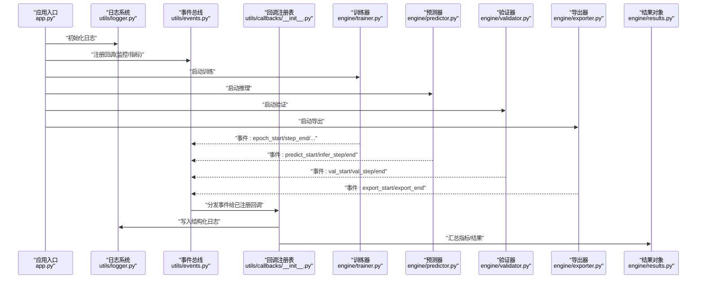
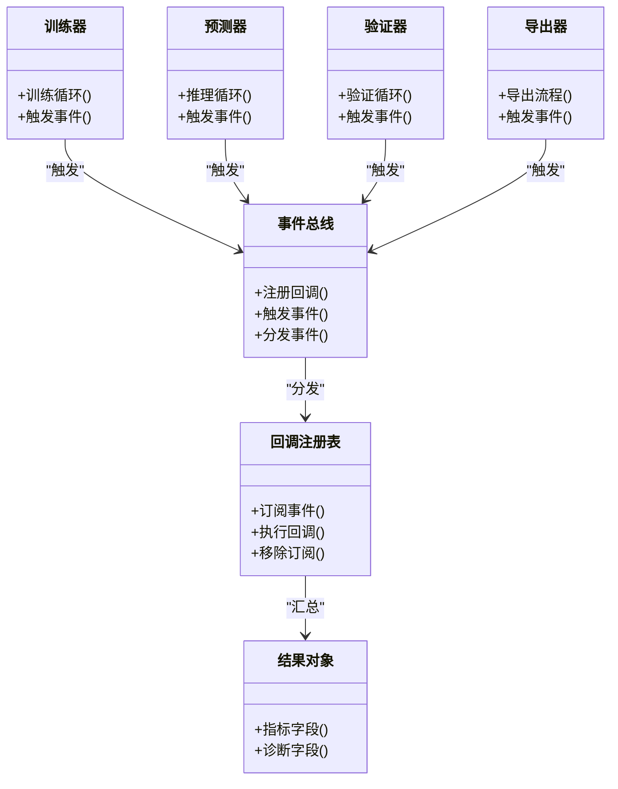

# 监控与日志

<cite>
**本文引用的文件**
- [app.py](file://app.py)
- [logger.py](file://ultralytics/utils/logger.py)
- [events.py](file://ultralytics/utils/events.py)
- [benchmarks.py](file://ultralytics/utils/benchmarks.py)
- [metrics.py](file://ultralytics/utils/metrics.py)
- [trainer.py](file://ultralytics/engine/trainer.py)
- [predictor.py](file://ultralytics/engine/predictor.py)
- [validator.py](file://ultralytics/engine/validator.py)
- [exporter.py](file://ultralytics/engine/exporter.py)
- [model.py](file://ultralytics/engine/model.py)
- [results.py](file://ultralytics/engine/results.py)
- [callbacks/__init__.py](file://ultralytics/utils/callbacks/__init__.py)
- [analytics.py](file://ultralytics/solutions/analytics.py)
- [config.py](file://ultralytics/solutions/config.py)
</cite>

## 目录
1. [简介](#简介)
2. [项目结构](#项目结构)
3. [核心组件](#核心组件)
4. [架构总览](#架构总览)
5. [详细组件分析](#详细组件分析)
6. [依赖关系分析](#依赖关系分析)
7. [性能考量](#性能考量)
8. [故障排查指南](#故障排查指南)
9. [结论](#结论)
10. [附录](#附录)

## 简介
本技术文档面向 YOLO-Master 的监控与日志体系，聚焦以下目标：
- 应用性能监控（APM）：指标采集、性能分析与异常检测
- 结构化日志：级别、格式与采集策略
- 分布式追踪：请求链路跟踪与依赖关系分析
- 告警规则：阈值、通知渠道与升级策略
- 可视化仪表板：Prometheus、Grafana 集成方法
- 日志聚合与分析平台：选型与配置建议
- 监控数据存储、查询与保留策略

说明：仓库中未包含现成的 Prometheus/Grafana/Tracing 集成代码。本文基于现有日志与指标基础设施，给出可落地的扩展方案与最佳实践，确保在不侵入核心推理/训练主流程的前提下实现可观测性。

## 项目结构
YOLO-Master 的可观测性相关能力主要分布在以下位置：
- 应用入口与启动：app.py
- 日志子系统：ultralytics/utils/logger.py
- 事件总线与回调：ultralytics/utils/events.py、ultralytics/utils/callbacks/__init__.py
- 指标与基准：ultralytics/utils/metrics.py、ultralytics/utils/benchmarks.py
- 引擎层埋点：ultralytics/engine/{trainer,predictor,validator,exporter,model}.py
- 结果对象：ultralytics/engine/results.py
- 解决方案侧分析工具：ultralytics/solutions/{analytics,config}.py

图表来源
- [app.py:1-200](file://app.py#L1-L200)
- [logger.py:1-200](file://ultralytics/utils/logger.py#L1-L200)
- [events.py:1-200](file://ultralytics/utils/events.py#L1-L200)
- [callbacks/__init__.py:1-200](file://ultralytics/utils/callbacks/__init__.py#L1-L200)
- [trainer.py:1-200](file://ultralytics/engine/trainer.py#L1-L200)
- [predictor.py:1-200](file://ultralytics/engine/predictor.py#L1-L200)
- [validator.py:1-200](file://ultralytics/engine/validator.py#L1-L200)
- [exporter.py:1-200](file://ultralytics/engine/exporter.py#L1-L200)
- [model.py:1-200](file://ultralytics/engine/model.py#L1-L200)
- [results.py:1-200](file://ultralytics/engine/results.py#L1-L200)
- [metrics.py:1-200](file://ultralytics/utils/metrics.py#L1-L200)
- [benchmarks.py:1-200](file://ultralytics/utils/benchmarks.py#L1-L200)
- [analytics.py:1-200](file://ultralytics/solutions/analytics.py#L1-L200)
- [config.py:1-200](file://ultralytics/solutions/config.py#L1-L200)

章节来源
- [app.py:1-200](file://app.py#L1-L200)
- [logger.py:1-200](file://ultralytics/utils/logger.py#L1-L200)
- [events.py:1-200](file://ultralytics/utils/events.py#L1-L200)
- [benchmarks.py:1-200](file://ultralytics/utils/benchmarks.py#L1-L200)
- [metrics.py:1-200](file://ultralytics/utils/metrics.py#L1-L200)
- [trainer.py:1-200](file://ultralytics/engine/trainer.py#L1-L200)
- [predictor.py:1-200](file://ultralytics/engine/predictor.py#L1-L200)
- [validator.py:1-200](file://ultralytics/engine/validator.py#L1-L200)
- [exporter.py:1-200](file://ultralytics/engine/exporter.py#L1-L200)
- [model.py:1-200](file://ultralytics/engine/model.py#L1-L200)
- [results.py:1-200](file://ultralytics/engine/results.py#L1-L200)
- [analytics.py:1-200](file://ultralytics/solutions/analytics.py#L1-L200)
- [config.py:1-200](file://ultralytics/solutions/config.py#L1-L200)

## 核心组件
- 日志系统（结构化输出）
  - 提供统一的日志记录接口，支持多后端（控制台、文件等），便于后续接入外部日志收集器。
  - 关键职责：日志级别控制、格式化、上下文字段注入（如任务ID、模型名、设备）。
- 事件与回调机制
  - 在训练、推理、验证、导出等关键阶段触发事件，供回调订阅者执行监控埋点。
  - 通过解耦方式将“业务逻辑”和“可观测性逻辑”分离。
- 指标与基准
  - 内置常用指标计算与基准测试工具，可作为自定义指标的基础。
- 引擎层埋点
  - 在 trainer/predictor/validator/exporter 等关键路径插入事件钩子，用于采集耗时、吞吐、错误率等。
- 结果对象
  - 标准化推理/验证结果载体，便于统一上报指标与日志。

章节来源
- [logger.py:1-200](file://ultralytics/utils/logger.py#L1-L200)
- [events.py:1-200](file://ultralytics/utils/events.py#L1-L200)
- [callbacks/__init__.py:1-200](file://ultralytics/utils/callbacks/__init__.py#L1-L200)
- [metrics.py:1-200](file://ultralytics/utils/metrics.py#L1-L200)
- [benchmarks.py:1-200](file://ultralytics/utils/benchmarks.py#L1-L200)
- [trainer.py:1-200](file://ultralytics/engine/trainer.py#L1-L200)
- [predictor.py:1-200](file://ultralytics/engine/predictor.py#L1-L200)
- [validator.py:1-200](file://ultralytics/engine/validator.py#L1-L200)
- [exporter.py:1-200](file://ultralytics/engine/exporter.py#L1-L200)
- [model.py:1-200](file://ultralytics/engine/model.py#L1-L200)
- [results.py:1-200](file://ultralytics/engine/results.py#L1-L200)

## 架构总览
下图展示从应用入口到各引擎模块的事件驱动式监控架构。日志与指标通过回调与事件总线进行解耦采集，避免对核心路径造成侵入式耦合。

图表来源
- [app.py:1-200](file://app.py#L1-L200)
- [logger.py:1-200](file://ultralytics/utils/logger.py#L1-L200)
- [events.py:1-200](file://ultralytics/utils/events.py#L1-L200)
- [callbacks/__init__.py:1-200](file://ultralytics/utils/callbacks/__init__.py#L1-L200)
- [trainer.py:1-200](file://ultralytics/engine/trainer.py#L1-L200)
- [predictor.py:1-200](file://ultralytics/engine/predictor.py#L1-L200)
- [validator.py:1-200](file://ultralytics/engine/validator.py#L1-L200)
- [exporter.py:1-200](file://ultralytics/engine/exporter.py#L1-L200)
- [results.py:1-200](file://ultralytics/engine/results.py#L1-L200)

## 详细组件分析

### 结构化日志规范
- 设计原则
  - 结构化：每条日志为键值对或 JSON 对象，包含固定字段（时间戳、级别、服务名、实例ID、任务ID、模型名、设备、阶段等）。
  - 分级：DEBUG/INFO/WARN/ERROR/FATAL，按场景选择合适级别，避免过度 DEBUG 影响性能。
  - 幂等与去重：对高频重复日志做采样或合并，降低存储压力。
  - 安全：禁止记录敏感信息（密钥、用户隐私数据）。
- 采集策略
  - 本地文件轮转 + 标准输出；容器化环境推荐 stdout/stderr 由 Sidecar/Agent 采集。
  - 异步写入：在高吞吐场景下采用异步队列，避免阻塞主流程。
- 与事件系统的结合
  - 在事件回调中统一写入结构化日志，保证上下文一致。

章节来源
- [logger.py:1-200](file://ultralytics/utils/logger.py#L1-L200)
- [events.py:1-200](file://ultralytics/utils/events.py#L1-L200)
- [callbacks/__init__.py:1-200](file://ultralytics/utils/callbacks/__init__.py#L1-L200)

### 应用性能监控（APM）
- 指标分类
  - 资源类：CPU/GPU 利用率、显存占用、内存、磁盘IO、网络IO。
  - 业务类：QPS、延迟分位（P50/P90/P99）、成功率、错误码分布、批大小、图像尺寸分布。
  - 模型类：专家路由分布（MoE）、激活稀疏度、损失曲线、收敛速度。
- 采集点
  - 训练：epoch/step 开始与结束、loss 更新、梯度统计、检查点保存。
  - 推理：请求进入/离开、预处理/后处理耗时、模型前向耗时、NMS 耗时。
  - 验证：指标计算阶段耗时、混淆矩阵/PR/AUC 等。
  - 导出：导出前后模型大小、格式转换耗时。
- 实现方式
  - 通过事件回调在关键路径打点，使用计数器、直方图、仪表盘等类型上报。
  - 与 metrics/benchmarks 工具协作，复用已有计算逻辑。

章节来源
- [events.py:1-200](file://ultralytics/utils/events.py#L1-L200)
- [callbacks/__init__.py:1-200](file://ultralytics/utils/callbacks/__init__.py#L1-L200)
- [metrics.py:1-200](file://ultralytics/utils/metrics.py#L1-L200)
- [benchmarks.py:1-200](file://ultralytics/utils/benchmarks.py#L1-L200)
- [trainer.py:1-200](file://ultralytics/engine/trainer.py#L1-L200)
- [predictor.py:1-200](file://ultralytics/engine/predictor.py#L1-L200)
- [validator.py:1-200](file://ultralytics/engine/validator.py#L1-L200)
- [exporter.py:1-200](file://ultralytics/engine/exporter.py#L1-L200)

### 分布式追踪（请求链路跟踪）
- 概念
  - 为一次端到端调用生成 TraceId/SpanId，贯穿预处理、模型推理、后处理、I/O 等环节。
- 落地建议
  - 在入口（HTTP/gRPC/消息队列消费者）创建根 Span，传递上下文至下游。
  - 在事件回调中为每个阶段创建子 Span，记录标签（阶段名、模型版本、设备、batch_size 等）。
  - 将 TraceId 注入结构化日志，便于跨系统关联。
- 与现有系统结合
  - 通过回调统一注入，不修改核心算法逻辑；日志携带 trace_id，便于检索。

章节来源
- [events.py:1-200](file://ultralytics/utils/events.py#L1-L200)
- [callbacks/__init__.py:1-200](file://ultralytics/utils/callbacks/__init__.py#L1-L200)
- [logger.py:1-200](file://ultralytics/utils/logger.py#L1-L200)

### 异常检测与错误上报
- 检测维度
  - 运行时异常：OOM、CUDA 错误、张量形状不匹配、NaN/Inf。
  - 业务异常：低置信度比例突增、类别分布偏移、NMS 失败。
- 处理方式
  - 捕获并记录结构化错误日志（含堆栈、上下文、TraceId）。
  - 触发告警回调，必要时降级或熔断。
- 与结果对象联动
  - 在 results 中附加诊断字段，辅助定位问题。

章节来源
- [results.py:1-200](file://ultralytics/engine/results.py#L1-L200)
- [logger.py:1-200](file://ultralytics/utils/logger.py#L1-L200)
- [events.py:1-200](file://ultralytics/utils/events.py#L1-L200)

### 告警规则配置
- 阈值设置
  - 资源：GPU 显存使用率 > 90% 持续 N 分钟；CPU 使用率 > 95%。
  - 性能：P99 延迟超过 SLA；QPS 下降超过基线 X%。
  - 质量：mAP 或精度显著下降；错误率上升。
- 通知渠道
  - 邮件、企业微信/钉钉、Slack、PagerDuty 等。
- 升级策略
  - 首次警告 -> 观察期 -> 升级通知 -> 自动恢复动作（重启/回滚/扩缩容）。
- 实现要点
  - 在回调中评估指标，达到阈值则触发通知；支持静默期与抑制规则。

章节来源
- [callbacks/__init__.py:1-200](file://ultralytics/utils/callbacks/__init__.py#L1-L200)
- [events.py:1-200](file://ultralytics/utils/events.py#L1-L200)

### 可视化仪表板搭建（Prometheus + Grafana）
- 指标暴露
  - 在回调中将指标推送到 Pushgateway 或直接被 Pull 采集（如 HTTP /metrics）。
  - 指标命名遵循领域约定（如 yolo_inference_latency_seconds_bucket）。
- Grafana 面板
  - 资源面板：CPU/GPU/内存/显存。
  - 性能面板：QPS、延迟分位、吞吐、批大小分布。
  - 质量面板：mAP、PR 曲线、错误码分布。
  - 模型面板：MoE 路由分布、专家负载、损失曲线。
- 数据源
  - Prometheus 作为时序数据库；可选 Loki 聚合日志，Jaeger/Tempo 聚合追踪。

章节来源
- [metrics.py:1-200](file://ultralytics/utils/metrics.py#L1-L200)
- [benchmarks.py:1-200](file://ultralytics/utils/benchmarks.py#L1-L200)
- [callbacks/__init__.py:1-200](file://ultralytics/utils/callbacks/__init__.py#L1-L200)

### 日志聚合与分析平台
- 选型建议
  - 轻量：ELK/EFK（Elasticsearch + Logstash/Fluent Bit + Kibana）。
  - 云原生：Loki + Promtail + Grafana。
  - 商业：Datadog、Sentry（错误追踪）。
- 采集方式
  - 容器 stdout/stderr 由 Sidecar 采集；或 Agent 直接读取日志文件。
- 索引与查询
  - 以结构化字段建立索引，支持按 trace_id、任务ID、模型名快速检索。
- 保留策略
  - 热数据短期保留（如 7-14 天），冷数据归档（如 S3/OSS）。

章节来源
- [logger.py:1-200](file://ultralytics/utils/logger.py#L1-L200)
- [events.py:1-200](file://ultralytics/utils/events.py#L1-L200)

### 监控数据的存储、查询与保留策略
- 存储
  - 指标：Prometheus（短周期）+ TSDB（长周期归档）。
  - 日志：Loki/Elasticsearch（热）+ 对象存储（冷）。
  - 追踪：Jaeger/Tempo（热）+ 对象存储（冷）。
- 查询
  - 指标：PromQL；日志：LogQL/KQL；追踪：TraceQL/Jaeger UI。
- 保留
  - 按成本与合规要求分层保留；冷热分离；自动清理过期数据。

章节来源
- [metrics.py:1-200](file://ultralytics/utils/metrics.py#L1-L200)
- [logger.py:1-200](file://ultralytics/utils/logger.py#L1-L200)

## 依赖关系分析
下图展示了事件与回调在各引擎模块中的依赖关系，体现了解耦与可扩展的设计。

图表来源
- [events.py:1-200](file://ultralytics/utils/events.py#L1-L200)
- [callbacks/__init__.py:1-200](file://ultralytics/utils/callbacks/__init__.py#L1-L200)
- [trainer.py:1-200](file://ultralytics/engine/trainer.py#L1-L200)
- [predictor.py:1-200](file://ultralytics/engine/predictor.py#L1-L200)
- [validator.py:1-200](file://ultralytics/engine/validator.py#L1-L200)
- [exporter.py:1-200](file://ultralytics/engine/exporter.py#L1-L200)
- [results.py:1-200](file://ultralytics/engine/results.py#L1-L200)

章节来源
- [events.py:1-200](file://ultralytics/utils/events.py#L1-L200)
- [callbacks/__init__.py:1-200](file://ultralytics/utils/callbacks/__init__.py#L1-L200)
- [trainer.py:1-200](file://ultralytics/engine/trainer.py#L1-L200)
- [predictor.py:1-200](file://ultralytics/engine/predictor.py#L1-L200)
- [validator.py:1-200](file://ultralytics/engine/validator.py#L1-L200)
- [exporter.py:1-200](file://ultralytics/engine/exporter.py#L1-L200)
- [results.py:1-200](file://ultralytics/engine/results.py#L1-L200)

## 性能考量
- 低开销采集
  - 使用异步队列与批量上报，避免同步 IO 阻塞主流程。
  - 对高频指标进行采样或降采样。
- 指标粒度
  - 合理选择时间窗口与分桶大小，平衡查询性能与精度。
- 日志体积控制
  - 仅记录必要上下文；对调试日志开启开关；对热点路径启用采样。
- 资源隔离
  - 监控组件与业务进程资源隔离，防止相互影响。

[本节为通用指导，无需特定文件引用]

## 故障排查指南
- 常见问题
  - 指标缺失：检查事件是否触发、回调是否正确注册、指标上报通道是否正常。
  - 日志丢失：确认日志写入路径权限、异步队列是否堆积、Sidecar/Agent 状态。
  - 追踪断裂：检查上下文传播是否完整、Span 是否过早关闭。
  - 告警风暴：调整静默期、抑制规则与分组策略。
- 定位步骤
  - 通过 TraceId 关联日志与追踪。
  - 查看关键阶段耗时与错误码分布。
  - 对比历史基线与当前运行差异。

章节来源
- [logger.py:1-200](file://ultralytics/utils/logger.py#L1-L200)
- [events.py:1-200](file://ultralytics/utils/events.py#L1-L200)
- [callbacks/__init__.py:1-200](file://ultralytics/utils/callbacks/__init__.py#L1-L200)
- [results.py:1-200](file://ultralytics/engine/results.py#L1-L200)

## 结论
YOLO-Master 提供了良好的日志与事件基础，适合在此基础上构建完整的可观测性体系。通过事件驱动的回调机制，可以在不侵入核心逻辑的情况下完成指标采集、结构化日志与分布式追踪。配合 Prometheus/Grafana/Loki/Jaeger 等生态工具，可实现从数据采集、存储、查询到可视化的全链路闭环。建议在工程实践中优先落实结构化日志、关键路径埋点与告警规则，再逐步完善追踪与仪表板。

[本节为总结，无需特定文件引用]

## 附录
- 术语
  - Trace/Span：分布式追踪的基本单元，表示一次操作及其子操作。
  - 指标类型：Counter、Histogram、Gauge、Summary 等。
  - 保留策略：按时间与容量分层存储与清理。
- 参考路径
  - 应用入口：[app.py](file://app.py)
  - 日志系统：[logger.py](file://ultralytics/utils/logger.py)
  - 事件与回调：[events.py](file://ultralytics/utils/events.py)、[callbacks/__init__.py](file://ultralytics/utils/callbacks/__init__.py)
  - 指标与基准：[metrics.py](file://ultralytics/utils/metrics.py)、[benchmarks.py](file://ultralytics/utils/benchmarks.py)
  - 引擎埋点：[trainer.py](file://ultralytics/engine/trainer.py)、[predictor.py](file://ultralytics/engine/predictor.py)、[validator.py](file://ultralytics/engine/validator.py)、[exporter.py](file://ultralytics/engine/exporter.py)、[model.py](file://ultralytics/engine/model.py)
  - 结果对象：[results.py](file://ultralytics/engine/results.py)
  - 解决方案分析：[analytics.py](file://ultralytics/solutions/analytics.py)、[config.py](file://ultralytics/solutions/config.py)