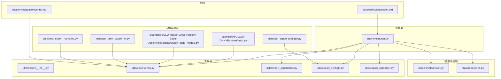
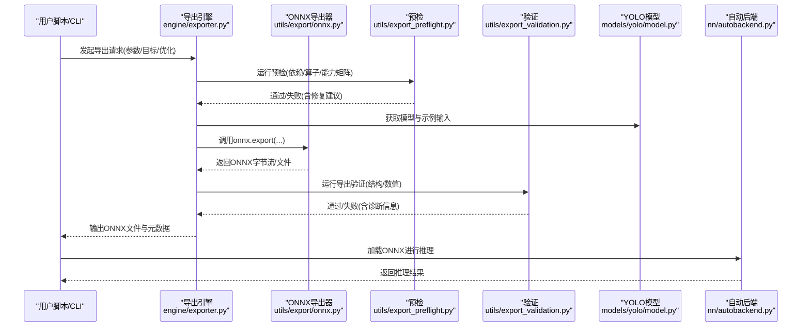
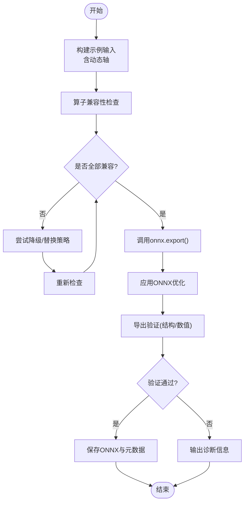
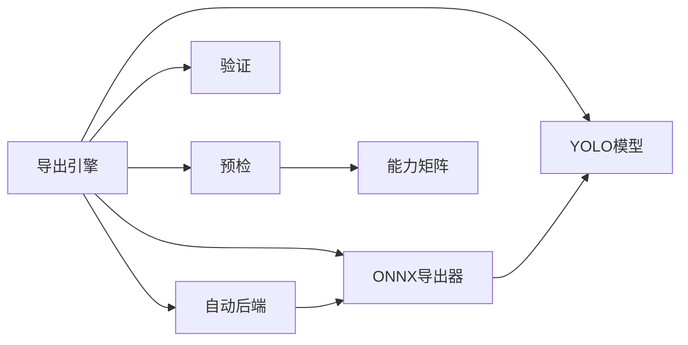

# ONNX格式导出

<cite>
**本文引用的文件**
- [engine/exporter.py](file://ultralytics/engine/exporter.py)
- [utils/export/__init__.py](file://ultralytics/utils/export/__init__.py)
- [utils/export/onnx.py](file://ultralytics/utils/export/onnx.py)
- [utils/export_capabilities.py](file://ultralytics/utils/export_capabilities.py)
- [utils/export_preflight.py](file://ultralytics/utils/export_preflight.py)
- [utils/export_validation.py](file://ultralytics/utils/export_validation.py)
- [models/yolo/model.py](file://ultralytics/models/yolo/model.py)
- [nn/autobackend.py](file://ultralytics/nn/autobackend.py)
- [examples/YOLOv8-ONNXRuntime/main.py](file://examples/YOLOv8-ONNXRuntime/main.py)
- [examples/YOLO-Master-Cross-Platform-Edge-Deployment/scripts/export_edge_models.py](file://examples/YOLO-Master-Cross-Platform-Edge-Deployment/scripts/export_edge_models.py)
- [tests/test_onnx_export_fix.py](file://tests/test_onnx_export_fix.py)
- [tests/test_export_roundtrip.py](file://tests/test_export_roundtrip.py)
- [tests/test_export_preflight.py](file://tests/test_export_preflight.py)
- [docs/en/integrations/onnx.md](file://docs/en/integrations/onnx.md)
- [docs/en/modes/export.md](file://docs/en/modes/export.md)
</cite>

## 目录
1. [简介](#简介)
2. [项目结构](#项目结构)
3. [核心组件](#核心组件)
4. [架构总览](#架构总览)
5. [详细组件分析](#详细组件分析)
6. [依赖关系分析](#依赖关系分析)
7. [性能与优化](#性能与优化)
8. [故障排除指南](#故障排除指南)
9. [结论](#结论)
10. [附录：命令与API速查](#附录命令与api速查)

## 简介
本文件面向YOLO-Master的ONNX模型导出能力，系统性说明从PyTorch到ONNX的转换流程、参数配置与优化选项；解释动态形状支持、算子兼容性检查与版本要求；文档化命令行与Python API的使用方法（输入输出张量定义、优化级别设置与调试技巧）；并提供边缘设备部署、跨平台推理与性能优化的最佳实践。同时给出常见错误处理与排障建议，帮助读者快速定位并解决问题。

## 项目结构
与ONNX导出相关的代码主要分布在以下模块：
- 引擎层：统一导出入口与流程编排
- 工具层：ONNX专用导出逻辑、预检与验证、能力矩阵
- 模型适配：自动后端选择与运行时加载
- 示例与测试：端到端使用样例与回归用例
- 文档：集成与模式使用说明

图表来源
- [engine/exporter.py](file://ultralytics/engine/exporter.py)
- [utils/export/onnx.py](file://ultralytics/utils/export/onnx.py)
- [utils/export_capabilities.py](file://ultralytics/utils/export_capabilities.py)
- [utils/export_preflight.py](file://ultralytics/utils/export_preflight.py)
- [utils/export_validation.py](file://ultralytics/utils/export_validation.py)
- [models/yolo/model.py](file://ultralytics/models/yolo/model.py)
- [nn/autobackend.py](file://ultralytics/nn/autobackend.py)
- [examples/YOLOv8-ONNXRuntime/main.py](file://examples/YOLOv8-ONNXRuntime/main.py)
- [examples/YOLO-Master-Cross-Platform-Edge-Deployment/scripts/export_edge_models.py](file://examples/YOLO-Master-Cross-Platform-Edge-Deployment/scripts/export_edge_models.py)
- [tests/test_onnx_export_fix.py](file://tests/test_onnx_export_fix.py)
- [tests/test_export_roundtrip.py](file://tests/test_export_roundtrip.py)
- [tests/test_export_preflight.py](file://tests/test_export_preflight.py)
- [docs/en/integrations/onnx.md](file://docs/en/integrations/onnx.md)
- [docs/en/modes/export.md](file://docs/en/modes/export.md)

章节来源
- [engine/exporter.py](file://ultralytics/engine/exporter.py)
- [utils/export/onnx.py](file://ultralytics/utils/export/onnx.py)
- [utils/export_capabilities.py](file://ultralytics/utils/export_capabilities.py)
- [utils/export_preflight.py](file://ultralytics/utils/export_preflight.py)
- [utils/export_validation.py](file://ultralytics/utils/export_validation.py)
- [models/yolo/model.py](file://ultralytics/models/yolo/model.py)
- [nn/autobackend.py](file://ultralytics/nn/autobackend.py)
- [examples/YOLOv8-ONNXRuntime/main.py](file://examples/YOLOv8-ONNXRuntime/main.py)
- [examples/YOLO-Master-Cross-Platform-Edge-Deployment/scripts/export_edge_models.py](file://examples/YOLO-Master-Cross-Platform-Edge-Deployment/scripts/export_edge_models.py)
- [tests/test_onnx_export_fix.py](file://tests/test_onnx_export_fix.py)
- [tests/test_export_roundtrip.py](file://tests/test_export_roundtrip.py)
- [tests/test_export_preflight.py](file://tests/test_export_preflight.py)
- [docs/en/integrations/onnx.md](file://docs/en/integrations/onnx.md)
- [docs/en/modes/export.md](file://docs/en/modes/export.md)

## 核心组件
- 导出引擎（engine/exporter.py）
  - 负责统一的导出流程编排：解析参数、构建示例输入、调用具体后端导出器、执行预检与验证、生成元数据与日志。
  - 提供命令行与Python API的统一入口，屏蔽不同后端的差异。
- ONNX导出器（utils/export/onnx.py）
  - 实现PyTorch到ONNX的具体转换逻辑：动态形状处理、算子映射、常量折叠、优化开关、版本控制等。
  - 维护输入/输出张量的签名与类型信息，确保下游推理框架正确消费。
- 能力矩阵（utils/export_capabilities.py）
  - 描述各任务/模型对导出目标的支持度，用于在导出前进行可行性判断与提示。
- 预检与验证（utils/export_preflight.py, utils/export_validation.py）
  - 预检：在导出前检查环境、依赖、模型结构与算子兼容性。
  - 验证：导出后对结果进行数值一致性或结构校验，保障导出质量。
- 自动后端（nn/autobackend.py）
  - 根据目标环境与模型特征选择最优运行时（如ONNX Runtime），并封装推理接口。
- 模型适配（models/yolo/model.py）
  - 提供导出所需的模型实例与示例输入构造方法，保证导出图的可追踪性。

章节来源
- [engine/exporter.py](file://ultralytics/engine/exporter.py)
- [utils/export/onnx.py](file://ultralytics/utils/export/onnx.py)
- [utils/export_capabilities.py](file://ultralytics/utils/export_capabilities.py)
- [utils/export_preflight.py](file://ultralytics/utils/export_preflight.py)
- [utils/export_validation.py](file://ultralytics/utils/export_validation.py)
- [nn/autobackend.py](file://ultralytics/nn/autobackend.py)
- [models/yolo/model.py](file://ultralytics/models/yolo/model.py)

## 架构总览
下图展示了从训练好的PyTorch模型到ONNX文件的完整导出链路，以及后续推理加载的关键路径。

图表来源
- [engine/exporter.py](file://ultralytics/engine/exporter.py)
- [utils/export/onnx.py](file://ultralytics/utils/export/onnx.py)
- [utils/export_preflight.py](file://ultralytics/utils/export_preflight.py)
- [utils/export_validation.py](file://ultralytics/utils/export_validation.py)
- [models/yolo/model.py](file://ultralytics/models/yolo/model.py)
- [nn/autobackend.py](file://ultralytics/nn/autobackend.py)

## 详细组件分析

### 导出引擎（engine/exporter.py）
- 职责
  - 统一接收导出参数（目标格式、优化选项、动态形状、IO签名等）。
  - 协调预检、导出、验证与产物落盘。
  - 为不同任务/模型提供一致的导出体验。
- 关键流程
  - 参数解析与默认值合并
  - 构建示例输入（包含动态维度占位）
  - 调用具体导出器（ONNX/TensorRT等）
  - 执行导出后验证与报告生成
- 与外部交互
  - 暴露命令行接口与Python API
  - 与自动后端协作以完成推理侧加载

章节来源
- [engine/exporter.py](file://ultralytics/engine/exporter.py)

### ONNX导出器（utils/export/onnx.py）
- 职责
  - 将PyTorch模型转换为ONNX图，处理动态形状、算子兼容性与版本约束。
  - 管理输入/输出张量签名（名称、形状、数据类型）。
  - 应用ONNX优化（常量折叠、算子融合、死代码消除等）。
- 动态形状支持
  - 通过示例输入中的动态轴标记，导出可变的批大小或空间尺寸。
  - 针对检测/分割等任务的特殊维度（如候选框数量）进行灵活处理。
- 算子兼容性与版本
  - 依据目标运行时与ONNX版本，选择兼容的opset与算子实现。
  - 对不支持的算子提供降级策略或替换方案。
- 优化选项
  - 常量折叠、图级优化、内存布局优化等，可按场景开启/关闭。
- 调试技巧
  - 启用中间节点导出、打印符号形状、保存简化图以便定位问题。

图表来源
- [utils/export/onnx.py](file://ultralytics/utils/export/onnx.py)

章节来源
- [utils/export/onnx.py](file://ultralytics/utils/export/onnx.py)

### 预检与验证（utils/export_preflight.py, utils/export_validation.py）
- 预检
  - 检查依赖库版本、GPU/CPU可用性、ONNX运行时能力。
  - 基于能力矩阵评估当前模型/任务是否支持目标导出。
- 验证
  - 对比导出前后关键节点的输出一致性。
  - 检查ONNX图的拓扑合法性与IO签名完整性。
- 典型输出
  - 通过/失败状态、警告与建议、失败原因与定位线索。

章节来源
- [utils/export_preflight.py](file://ultralytics/utils/export_preflight.py)
- [utils/export_validation.py](file://ultralytics/utils/export_validation.py)

### 能力矩阵（utils/export_capabilities.py）
- 作用
  - 汇总各任务（检测、分割、姿态等）、模型变体与导出目标的兼容性。
  - 指导用户在导出前选择合适的目标与参数组合。
- 使用方式
  - 在导出前查询能力矩阵，避免无效导出尝试。
  - 结合预检结果给出更明确的失败原因与替代方案。

章节来源
- [utils/export_capabilities.py](file://ultralytics/utils/export_capabilities.py)

### 自动后端（nn/autobackend.py）
- 作用
  - 根据目标环境与模型特征选择最优运行时（如ONNX Runtime）。
  - 封装统一的推理接口，屏蔽后端差异。
- 与导出的关系
  - 导出完成后，自动后端可直接加载生成的ONNX文件进行推理。

章节来源
- [nn/autobackend.py](file://ultralytics/nn/autobackend.py)

### 模型适配（models/yolo/model.py）
- 作用
  - 提供模型实例与示例输入构造方法，确保导出图的可追踪性与稳定性。
  - 针对不同任务调整输出结构，便于ONNX导出器正确处理。

章节来源
- [models/yolo/model.py](file://ultralytics/models/yolo/model.py)

### 示例与测试
- 示例
  - YOLOv8-ONNXRuntime示例展示如何在Python中加载ONNX并进行推理。
  - 跨平台边缘部署示例演示批量导出与部署脚本。
- 测试
  - ONNX导出修复用例、往返一致性测试、预检覆盖测试，保障功能稳定。

章节来源
- [examples/YOLOv8-ONNXRuntime/main.py](file://examples/YOLOv8-ONNXRuntime/main.py)
- [examples/YOLO-Master-Cross-Platform-Edge-Deployment/scripts/export_edge_models.py](file://examples/YOLO-Master-Cross-Platform-Edge-Deployment/scripts/export_edge_models.py)
- [tests/test_onnx_export_fix.py](file://tests/test_onnx_export_fix.py)
- [tests/test_export_roundtrip.py](file://tests/test_export_roundtrip.py)
- [tests/test_export_preflight.py](file://tests/test_export_preflight.py)

## 依赖关系分析
- 内部依赖
  - 导出引擎依赖ONNX导出器、预检与验证模块、模型适配与自动后端。
  - 预检依赖能力矩阵与环境探测。
  - 验证依赖导出后的图与权重资源。
- 外部依赖
  - PyTorch、ONNX、ONNX Runtime（可选）、其他目标运行时（如TensorRT/OpenVINO，视目标而定）。
- 耦合与内聚
  - 导出引擎作为协调者，保持高内聚的流程编排；具体导出逻辑下沉至工具层，降低耦合。
- 潜在循环依赖
  - 通过分层设计避免循环导入；若出现，应引入抽象接口或延迟导入。

图表来源
- [engine/exporter.py](file://ultralytics/engine/exporter.py)
- [utils/export/onnx.py](file://ultralytics/utils/export/onnx.py)
- [utils/export_preflight.py](file://ultralytics/utils/export_preflight.py)
- [utils/export_validation.py](file://ultralytics/utils/export_validation.py)
- [utils/export_capabilities.py](file://ultralytics/utils/export_capabilities.py)
- [models/yolo/model.py](file://ultralytics/models/yolo/model.py)
- [nn/autobackend.py](file://ultralytics/nn/autobackend.py)

章节来源
- [engine/exporter.py](file://ultralytics/engine/exporter.py)
- [utils/export/onnx.py](file://ultralytics/utils/export/onnx.py)
- [utils/export_capabilities.py](file://ultralytics/utils/export_capabilities.py)
- [utils/export_preflight.py](file://ultralytics/utils/export_preflight.py)
- [utils/export_validation.py](file://ultralytics/utils/export_validation.py)
- [models/yolo/model.py](file://ultralytics/models/yolo/model.py)
- [nn/autobackend.py](file://ultralytics/nn/autobackend.py)

## 性能与优化
- 动态形状
  - 合理设置可变维度（如批大小、分辨率），避免过度动态导致运行时无法优化。
  - 在边缘设备上，固定常用分辨率可获得更好性能。
- 算子优化
  - 启用常量折叠与图级优化，减少冗余计算。
  - 对不支持的算子采用等价替换或自定义实现。
- 精度与速度权衡
  - 混合精度或量化可在部分后端获得加速，但需验证精度损失。
- 批处理与缓存
  - 在推理侧启用会话缓存与批处理，提升吞吐。
- 监控与基准
  - 使用内置基准工具对比不同优化配置的延迟与吞吐。

[本节为通用指导，不直接分析具体文件]

## 故障排除指南
- 常见问题
  - 算子不支持：查看预检与能力矩阵，按建议降级或替换算子。
  - 动态形状报错：检查示例输入的形状定义与导出参数的一致性。
  - 数值不一致：启用导出验证，定位差异节点，必要时关闭特定优化。
  - 运行时加载失败：确认ONNX版本与opset匹配，检查IO签名。
- 调试技巧
  - 导出简化图并可视化，观察异常分支。
  - 逐步关闭优化项，定位引发问题的优化。
  - 打印中间张量形状与类型，核对动态轴。
- 参考用例
  - 参考导出修复与往返一致性测试，对照排查自身问题。

章节来源
- [tests/test_onnx_export_fix.py](file://tests/test_onnx_export_fix.py)
- [tests/test_export_roundtrip.py](file://tests/test_export_roundtrip.py)
- [tests/test_export_preflight.py](file://tests/test_export_preflight.py)

## 结论
YOLO-Master的ONNX导出体系通过“引擎+工具+预检/验证”的分层设计，提供了稳定、可扩展且易于调试的导出能力。借助动态形状支持与算子兼容性检查，用户可以在多平台与多后端上高效部署。配合优化选项与调试技巧，能够在性能与精度之间取得良好平衡。

[本节为总结，不直接分析具体文件]

## 附录：命令与API速查
- 命令行导出
  - 基本用法：指定模型与目标格式为ONNX，设置动态形状与优化选项。
  - 参考文档：导出模式与参数说明。
- Python API
  - 通过导出引擎接口传入模型、示例输入与导出参数，获取ONNX文件路径与元数据。
  - 参考示例：ONNX Runtime推理示例与边缘部署脚本。
- 输入输出张量定义
  - 明确输入形状（含动态轴）与输出结构（类别、框、掩码等），确保与下游一致。
- 优化级别设置
  - 根据目标设备与运行时选择合适优化级别，必要时关闭特定优化以保稳定。
- 调试技巧
  - 启用预检与验证的详细日志，导出简化图，逐步缩小问题范围。

章节来源
- [docs/en/modes/export.md](file://docs/en/modes/export.md)
- [docs/en/integrations/onnx.md](file://docs/en/integrations/onnx.md)
- [examples/YOLOv8-ONNXRuntime/main.py](file://examples/YOLOv8-ONNXRuntime/main.py)
- [examples/YOLO-Master-Cross-Platform-Edge-Deployment/scripts/export_edge_models.py](file://examples/YOLO-Master-Cross-Platform-Edge-Deployment/scripts/export_edge_models.py)