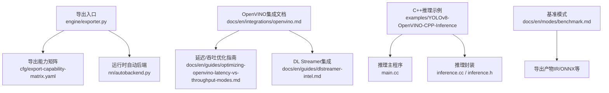
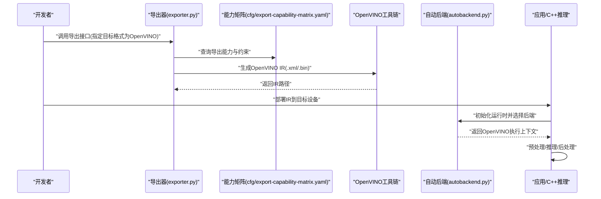
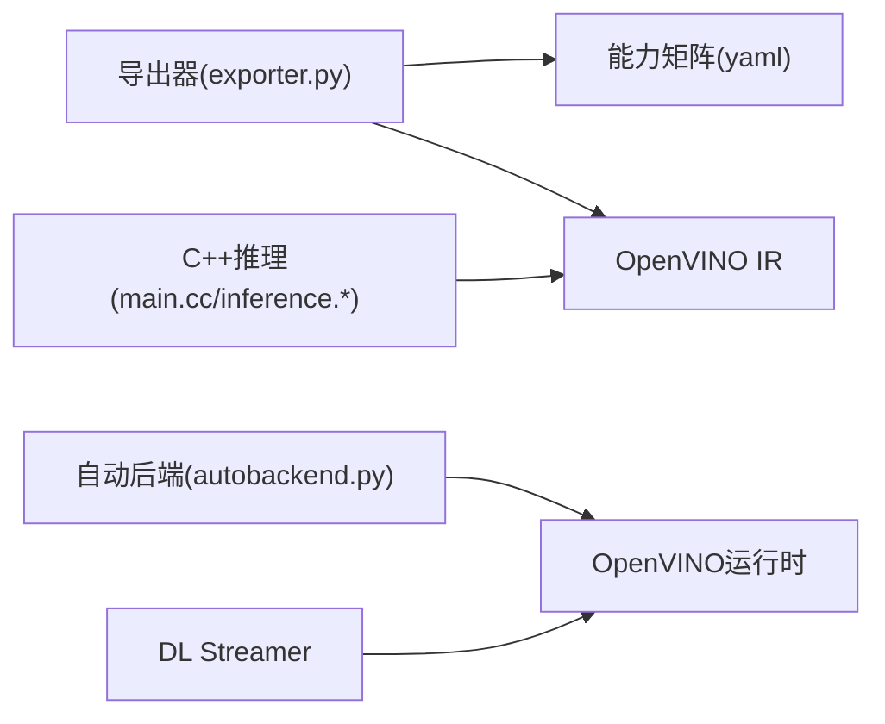
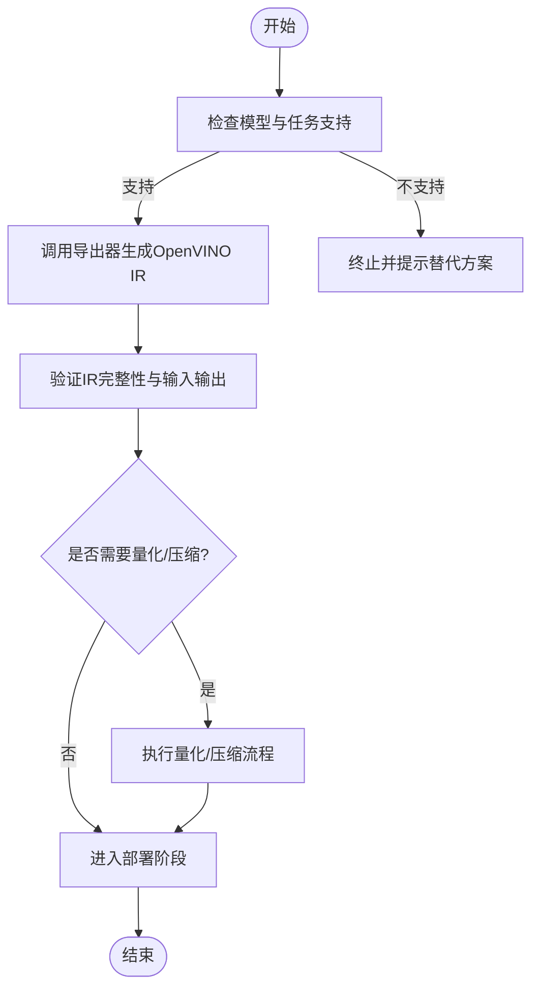

# OpenVINO格式导出

<cite>
**本文引用的文件**
- [exporter.py](file://ultralytics/engine/exporter.py)
- [autobackend.py](file://ultralytics/nn/autobackend.py)
- [openvino.md](file://docs/en/integrations/openvino.md)
- [YOLOv8-OpenVINO-CPP-Inference/main.cc](file://examples/YOLOv8-OpenVINO-CPP-Inference/main.cc)
- [YOLOv8-OpenVINO-CPP-Inference/inference.cc](file://examples/YOLOv8-OpenVINO-CPP-Inference/inference.cc)
- [YOLOv8-OpenVINO-CPP-Inference/inference.h](file://examples/YOLOv8-OpenVINO-CPP-Inference/inference.h)
- [dlstreamer-intel.md](file://docs/en/guides/dlstreamer-intel.md)
- [optimizing-openvino-latency-vs-throughput-modes.md](file://docs/en/guides/optimizing-openvino-latency-vs-throughput-modes.md)
- [model-deployment-options.md](file://docs/en/guides/model-deployment-options.md)
- [yolo-thread-safe-inference.md](file://docs/en/guides/yolo-thread-safe-inference.md)
- [benchmark.md](file://docs/en/modes/benchmark.md)
- [export-capability-matrix.yaml](file://ultralytics/cfg/export-capability-matrix.yaml)
</cite>

## 目录
1. [简介](#简介)
2. [项目结构](#项目结构)
3. [核心组件](#核心组件)
4. [架构总览](#架构总览)
5. [详细组件分析](#详细组件分析)
6. [依赖关系分析](#依赖关系分析)
7. [性能与优化](#性能与优化)
8. [部署示例与实践](#部署示例与实践)
9. [故障排除指南](#故障排除指南)
10. [结论](#结论)

## 简介
本文件面向YOLO-Master的OpenVINO模型导出与部署，系统性说明从PyTorch权重到OpenVINO IR（Intermediate Representation）的转换流程、硬件后端配置（CPU/GPU/VPU）、模型压缩与量化策略、推理服务搭建、批量处理与实时监控方法，以及环境配置与常见问题排查。文档同时提供代码级架构图与流程图，帮助读者快速定位实现位置并落地实践。

## 项目结构
围绕OpenVINO导出与部署的关键路径如下：
- 导出入口与能力矩阵：引擎导出器与导出能力清单
- 运行时自动后端选择：统一设备抽象与后端加载
- 官方集成文档：OpenVINO使用指南、延迟/吞吐模式优化、DL Streamer集成
- C++推理示例：OpenVINO C++推理工程
- 基准测试：导出后性能评估模式

图表来源
- [exporter.py:1-200](file://ultralytics/engine/exporter.py#L1-200)
- [export-capability-matrix.yaml:1-200](file://ultralytics/cfg/export-capability-matrix.yaml#L1-200)
- [autobackend.py:1-200](file://ultralytics/nn/autobackend.py#L1-200)
- [openvino.md:1-200](file://docs/en/integrations/openvino.md#L1-L200)
- [optimizing-openvino-latency-vs-throughput-modes.md:1-200](file://docs/en/guides/optimizing-openvino-latency-vs-throughput-modes.md#L1-L200)
- [dlstreamer-intel.md:1-200](file://docs/en/guides/dlstreamer-intel.md#L1-L200)
- [YOLOv8-OpenVINO-CPP-Inference/main.cc:1-200](file://examples/YOLOv8-OpenVINO-CPP-Inference/main.cc#L1-L200)
- [YOLOv8-OpenVINO-CPP-Inference/inference.cc:1-200](file://examples/YOLOv8-OpenVINO-CPP-Inference/inference.cc#L1-L200)
- [YOLOv8-OpenVINO-CPP-Inference/inference.h:1-200](file://examples/YOLOv8-OpenVINO-CPP-Inference/inference.h#L1-L200)
- [benchmark.md:1-200](file://docs/en/modes/benchmark.md#L1-L200)

章节来源
- [exporter.py:1-200](file://ultralytics/engine/exporter.py#L1-L200)
- [export-capability-matrix.yaml:1-200](file://ultralytics/cfg/export-capability-matrix.yaml#L1-L200)
- [autobackend.py:1-200](file://ultralytics/nn/autobackend.py#L1-L200)
- [openvino.md:1-200](file://docs/en/integrations/openvino.md#L1-L200)
- [YOLOv8-OpenVINO-CPP-Inference/main.cc:1-200](file://examples/YOLOv8-OpenVINO-CPP-Inference/main.cc#L1-L200)
- [YOLOv8-OpenVINO-CPP-Inference/inference.cc:1-200](file://examples/YOLOv8-OpenVINO-CPP-Inference/inference.cc#L1-L200)
- [YOLOv8-OpenVINO-CPP-Inference/inference.h:1-200](file://examples/YOLOv8-OpenVINO-CPP-Inference/inference.h#L1-L200)
- [dlstreamer-intel.md:1-200](file://docs/en/guides/dlstreamer-intel.md#L1-L200)
- [optimizing-openvino-latency-vs-throughput-modes.md:1-200](file://docs/en/guides/optimizing-openvino-latency-vs-throughput-modes.md#L1-L200)
- [benchmark.md:1-200](file://docs/en/modes/benchmark.md#L1-L200)

## 核心组件
- 导出器（Engine Exporter）
  - 负责将训练好的模型转换为多种目标格式，包括OpenVINO IR。
  - 通过能力矩阵控制各任务/模型的导出支持情况。
- 自动后端（AutoBackend）
  - 在推理阶段根据目标设备与可用后端动态选择执行引擎（如OpenVINO）。
- OpenVINO集成文档
  - 提供OpenVINO安装、设备选择、模型转换与优化的官方指引。
- C++推理示例
  - 展示如何在C++中加载OpenVINO IR并进行推理。
- DL Streamer集成
  - 基于Intel Media SDK/DL Streamer的视频流推理流水线参考。
- 基准模式
  - 用于导出后在不同设备上评估延迟与吞吐。

章节来源
- [exporter.py:1-200](file://ultralytics/engine/exporter.py#L1-L200)
- [export-capability-matrix.yaml:1-200](file://ultralytics/cfg/export-capability-matrix.yaml#L1-L200)
- [autobackend.py:1-200](file://ultralytics/nn/autobackend.py#L1-L200)
- [openvino.md:1-200](file://docs/en/integrations/openvino.md#L1-L200)
- [YOLOv8-OpenVINO-CPP-Inference/main.cc:1-200](file://examples/YOLOv8-OpenVINO-CPP-Inference/main.cc#L1-L200)
- [YOLOv8-OpenVINO-CPP-Inference/inference.cc:1-200](file://examples/YOLOv8-OpenVINO-CPP-Inference/inference.cc#L1-L200)
- [YOLOv8-OpenVINO-CPP-Inference/inference.h:1-200](file://examples/YOLOv8-OpenVINO-CPP-Inference/inference.h#L1-L200)
- [dlstreamer-intel.md:1-200](file://docs/en/guides/dlstreamer-intel.md#L1-L200)
- [benchmark.md:1-200](file://docs/en/modes/benchmark.md#L1-L200)

## 架构总览
下图展示了从训练权重到OpenVINO IR导出、再到多端部署的整体流程。

图表来源
- [exporter.py:1-200](file://ultralytics/engine/exporter.py#L1-L200)
- [export-capability-matrix.yaml:1-200](file://ultralytics/cfg/export-capability-matrix.yaml#L1-L200)
- [autobackend.py:1-200](file://ultralytics/nn/autobackend.py#L1-L200)

## 详细组件分析

### 导出器与能力矩阵
- 职责
  - 解析导出参数、校验模型与任务兼容性、调用后端转换器生成目标格式。
  - 针对OpenVINO，输出IR文件（模型描述与权重），并可附带元数据。
- 关键要点
  - 通过能力矩阵决定某模型是否支持OpenVINO导出及可选优化选项。
  - 导出前进行预检（输入形状、算子支持、精度要求等）。
- 建议
  - 在导出前明确目标设备与运行模式（延迟优先或吞吐优先），以便选择合适的优化开关。

章节来源
- [exporter.py:1-200](file://ultralytics/engine/exporter.py#L1-L200)
- [export-capability-matrix.yaml:1-200](file://ultralytics/cfg/export-capability-matrix.yaml#L1-L200)

### 自动后端与设备选择
- 职责
  - 在推理时根据环境变量、设备枚举与可用性，自动选择OpenVINO或其他后端。
  - 管理会话生命周期、输入输出绑定与内存布局。
- 关键要点
  - 对OpenVINO而言，需正确设置设备字符串（如“CPU”、“GPU”、“MYRIAD”等）。
  - 支持热切换与回退策略，提升部署鲁棒性。
- 建议
  - 在生产环境中显式指定设备，避免隐式选择导致的不一致。

章节来源
- [autobackend.py:1-200](file://ultralytics/nn/autobackend.py#L1-L200)

### OpenVINO集成文档与优化指南
- 内容覆盖
  - 安装与环境准备、设备驱动与运行时版本匹配。
  - 模型转换参数、量化与压缩选项、不同设备的最佳实践。
  - 延迟与吞吐模式的权衡与调优。
- 建议
  - 遵循官方文档的设备与驱动版本矩阵，确保稳定性。
  - 针对不同任务（检测/分割/姿态）采用对应的优化策略。

章节来源
- [openvino.md:1-200](file://docs/en/integrations/openvino.md#L1-L200)
- [optimizing-openvino-latency-vs-throughput-modes.md:1-200](file://docs/en/guides/optimizing-openvino-latency-vs-throughput-modes.md#L1-L200)

### C++推理示例（OpenVINO）
- 结构
  - main.cc：程序入口、命令行参数解析、资源加载与循环推理。
  - inference.h/cc：封装OpenVINO模型加载、输入输出张量操作与推理调用。
- 关键点
  - 正确读取IR文件、设置输入形状与数据类型。
  - 处理NMS/解码等后处理逻辑，保证与Python端一致性。
- 建议
  - 使用线程池与批处理提高吞吐；注意锁与内存复用。

章节来源
- [YOLOv8-OpenVINO-CPP-Inference/main.cc:1-200](file://examples/YOLOv8-OpenVINO-CPP-Inference/main.cc#L1-L200)
- [YOLOv8-OpenVINO-CPP-Inference/inference.h:1-200](file://examples/YOLOv8-OpenVINO-CPP-Inference/inference.h#L1-L200)
- [YOLOv8-OpenVINO-CPP-Inference/inference.cc:1-200](file://examples/YOLOv8-OpenVINO-CPP-Inference/inference.cc#L1-L200)

### DL Streamer集成
- 适用场景
  - 基于Intel媒体栈的高性能视频流推理，适合摄像头/RTSP/文件等多源输入。
- 关键点
  - 构建Pipeline：Source→Decoder→Preprocess→Model→Postprocess→Sink。
  - 利用硬件编解码与加速内核降低CPU占用。
- 建议
  - 合理设置队列长度与帧率，避免背压与丢帧。

章节来源
- [dlstreamer-intel.md:1-200](file://docs/en/guides/dlstreamer-intel.md#L1-L200)

### 基准模式
- 用途
  - 在目标设备上评估导出模型的延迟与吞吐，辅助选择最优配置。
- 关键点
  - 固定输入尺寸与批次大小，多次采样取稳定指标。
  - 对比不同设备与优化开关的效果。

章节来源
- [benchmark.md:1-200](file://docs/en/modes/benchmark.md#L1-L200)

## 依赖关系分析
- 模块耦合
  - 导出器依赖能力矩阵进行可行性判断；自动后端依赖运行时库与设备驱动。
  - C++示例直接依赖OpenVINO C API。
- 外部依赖
  - OpenVINO运行时、设备驱动（CPU/GPU/VPU）、媒体栈（DL Streamer）。
- 潜在风险
  - 版本不匹配导致算子不支持或性能退化；设备权限与驱动缺失。

图表来源
- [exporter.py:1-200](file://ultralytics/engine/exporter.py#L1-L200)
- [export-capability-matrix.yaml:1-200](file://ultralytics/cfg/export-capability-matrix.yaml#L1-L200)
- [autobackend.py:1-200](file://ultralytics/nn/autobackend.py#L1-L200)
- [YOLOv8-OpenVINO-CPP-Inference/main.cc:1-200](file://examples/YOLOv8-OpenVINO-CPP-Inference/main.cc#L1-L200)
- [YOLOv8-OpenVINO-CPP-Inference/inference.cc:1-200](file://examples/YOLOv8-OpenVINO-CPP-Inference/inference.cc#L1-L200)
- [YOLOv8-OpenVINO-CPP-Inference/inference.h:1-200](file://examples/YOLOv8-OpenVINO-CPP-Inference/inference.h#L1-L200)

## 性能与优化
- 模型压缩与量化
  - 使用INT8/FP16量化减少体积与提升速度；校准数据集需具代表性。
  - 结合稀疏化与剪枝进一步降低计算量（视任务与设备支持而定）。
- 运行模式
  - 延迟优先：减小批大小、启用低延迟优化；吞吐优先：增大批大小、并行化。
- 设备特性
  - CPU：关注多线程与缓存友好；GPU：关注带宽与并行度；VPU：关注内存与算子映射。
- 监控与回归
  - 建立基线指标，持续监控延迟/吞吐/准确率漂移。

章节来源
- [openvino.md:1-200](file://docs/en/integrations/openvino.md#L1-L200)
- [optimizing-openvino-latency-vs-throughput-modes.md:1-200](file://docs/en/guides/optimizing-openvino-latency-vs-throughput-modes.md#L1-L200)
- [benchmark.md:1-200](file://docs/en/modes/benchmark.md#L1-L200)

## 部署示例与实践

### 环境配置与依赖管理
- 系统要求
  - 操作系统与内核版本、驱动与固件版本需满足OpenVINO矩阵要求。
- Python环境
  - 安装对应版本的OpenVINO Python包与依赖；确认CUDA/ROCm（若使用GPU）兼容。
- C++环境
  - 安装OpenVINO开发包与CMake；链接必要的库与头文件。

章节来源
- [openvino.md:1-200](file://docs/en/integrations/openvino.md#L1-L200)
- [YOLOv8-OpenVINO-CPP-Inference/main.cc:1-200](file://examples/YOLOv8-OpenVINO-CPP-Inference/main.cc#L1-L200)

### 模型导出流程（OpenVINO IR）

图表来源
- [exporter.py:1-200](file://ultralytics/engine/exporter.py#L1-L200)
- [export-capability-matrix.yaml:1-200](file://ultralytics/cfg/export-capability-matrix.yaml#L1-L200)

### 硬件后端配置与使用
- Intel CPU
  - 设备标识通常为“CPU”；可开启多线程与缓存优化。
- Intel GPU
  - 设备标识通常为“GPU”；需安装相应驱动与OpenCL/ICD配置。
- Intel VPU（如Movidius MyriadX）
  - 设备标识通常为“MYRIAD”；需安装USB驱动与权限配置。
- 自动后端选择
  - 通过自动后端按优先级探测可用设备并创建执行上下文。

章节来源
- [autobackend.py:1-200](file://ultralytics/nn/autobackend.py#L1-L200)
- [openvino.md:1-200](file://docs/en/integrations/openvino.md#L1-L200)

### 推理服务搭建（Python/C++）
- Python
  - 使用自动后端加载IR，封装HTTP/gRPC服务；加入请求队列与限流。
- C++
  - 参考示例工程，构建单进程或多进程服务；注意线程安全与内存复用。
- 线程安全
  - 遵循线程安全推理指南，避免共享状态冲突。

章节来源
- [YOLOv8-OpenVINO-CPP-Inference/main.cc:1-200](file://examples/YOLOv8-OpenVINO-CPP-Inference/main.cc#L1-L200)
- [YOLOv8-OpenVINO-CPP-Inference/inference.cc:1-200](file://examples/YOLOv8-OpenVINO-CPP-Inference/inference.cc#L1-L200)
- [YOLOv8-OpenVINO-CPP-Inference/inference.h:1-200](file://examples/YOLOv8-OpenVINO-CPP-Inference/inference.h#L1-L200)
- [yolo-thread-safe-inference.md:1-200](file://docs/en/guides/yolo-thread-safe-inference.md#L1-L200)

### 批量处理与实时流
- 批量处理
  - 合并多帧为批次输入，提升吞吐；注意动态形状与填充策略。
- 实时流
  - 结合DL Streamer构建端到端流水线，降低端到端延迟。
- 监控
  - 采集QPS、P99延迟、丢帧率与错误率，纳入告警与看板。

章节来源
- [dlstreamer-intel.md:1-200](file://docs/en/guides/dlstreamer-intel.md#L1-L200)
- [benchmark.md:1-200](file://docs/en/modes/benchmark.md#L1-L200)

### 最佳实践
- 先离线评估再上线：在目标设备上完成基准测试与回归验证。
- 固定输入尺寸：减少动态形状带来的编译与调度开销。
- 分层优化：数据预处理与后处理尽量向硬件或SIMD靠拢。
- 灰度发布：小流量验证后再全量上线。

章节来源
- [model-deployment-options.md:1-200](file://docs/en/guides/model-deployment-options.md#L1-L200)
- [optimizing-openvino-latency-vs-throughput-modes.md:1-200](file://docs/en/guides/optimizing-openvino-latency-vs-throughput-modes.md#L1-L200)

## 故障排除指南
- 常见错误
  - 设备不可用或权限不足：检查驱动、udev规则与用户组。
  - 算子不支持：查看OpenVINO版本与模型算子集，必要时降级或替换算子。
  - 量化精度下降：调整校准集与量化策略，必要时回退至FP16。
- 诊断步骤
  - 使用基准模式复现问题；对比不同设备与优化开关。
  - 检查IR输入输出维度与数据类型是否与推理端一致。
- 日志与监控
  - 开启详细日志，记录设备信息、模型信息与运行时统计。

章节来源
- [openvino.md:1-200](file://docs/en/integrations/openvino.md#L1-L200)
- [benchmark.md:1-200](file://docs/en/modes/benchmark.md#L1-L200)

## 结论
通过统一的导出器与自动后端机制，YOLO-Master能够高效地将模型转换为OpenVINO IR并在多类Intel硬件上获得良好性能。结合量化压缩、延迟/吞吐模式优化与DL Streamer流水线，可在边缘与云端实现高吞吐、低延迟的部署。建议在上线前完成严格的基准测试与回归验证，并建立持续的监控与告警体系。