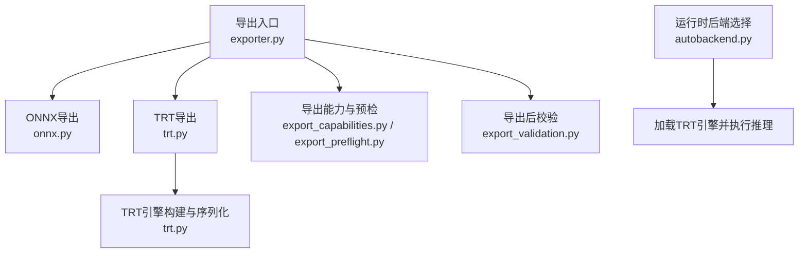
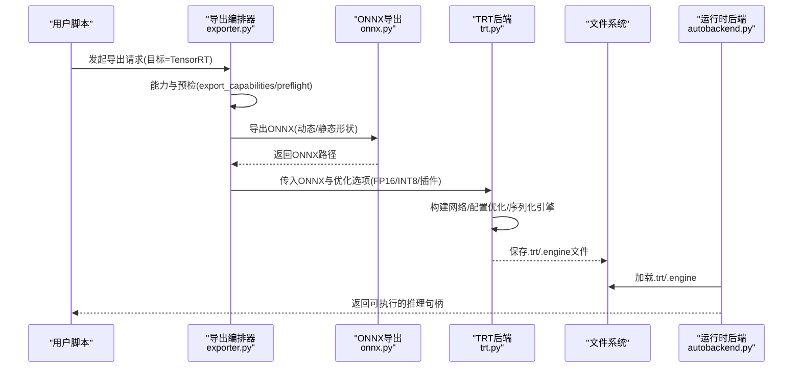

# TensorRT格式导出

<cite>
**本文引用的文件**
- [ultralytics/engine/exporter.py](file://ultralytics/engine/exporter.py)
- [ultralytics/utils/export/__init__.py](file://ultralytics/utils/export/__init__.py)
- [ultralytics/utils/export/trt.py](file://ultralytics/utils/export/trt.py)
- [ultralytics/utils/export/onnx.py](file://ultralytics/utils/export/onnx.py)
- [ultralytics/utils/export_capabilities.py](file://ultralytics/utils/export_capabilities.py)
- [ultralytics/utils/export_preflight.py](file://ultralytics/utils/export_preflight.py)
- [ultralytics/utils/export_validation.py](file://ultralytics/utils/export_validation.py)
- [ultralytics/nn/autobackend.py](file://ultralytics/nn/autobackend.py)
- [tests/test_engine.py](file://tests/test_engine.py)
- [tests/test_export_preflight.py](file://tests/test_export_preflight.py)
- [tests/test_exports.py](file://tests/test_exports.py)
- [docs/en/integrations/tensorrt.md](file://docs/en/integrations/tensorrt.md)
</cite>

## 目录
1. [简介](#简介)
2. [项目结构](#项目结构)
3. [核心组件](#核心组件)
4. [架构总览](#架构总览)
5. [详细组件分析](#详细组件分析)
6. [依赖与版本要求](#依赖与版本要求)
7. [精度优化与量化](#精度优化与量化)
8. [层融合与插件开发](#层融合与插件开发)
9. [GPU内存管理与并发部署](#gpu内存管理与并发部署)
10. [不同GPU架构的优化策略](#不同gpu架构的优化策略)
11. [批量推理与多GPU最佳实践](#批量推理与多gpu最佳实践)
12. [性能分析与调优指南](#性能分析与调优指南)
13. [常见问题诊断](#常见问题诊断)
14. [结论](#结论)
15. [附录](#附录)

## 简介
本技术文档聚焦于YOLO-Master的TensorRT模型导出能力，系统性说明从ONNX到TensorRT引擎的构建流程、精度优化（FP16/INT8）、层融合与插件机制、CUDA/TensorRT环境配置、不同GPU架构优化策略，以及批量推理、并发处理和多GPU部署的最佳实践。同时提供性能分析方法与常见问题排查路径，帮助读者在生产环境中稳定高效地落地TensorRT推理。

## 项目结构
TensorRT导出相关代码主要分布在以下模块：
- 导出入口与编排：engine/exporter.py
- TensorRT后端实现：utils/export/trt.py
- ONNX导出与中间表示：utils/export/onnx.py
- 导出能力矩阵与预检：utils/export_capabilities.py, utils/export_preflight.py
- 导出后校验：utils/export_validation.py
- 运行时自动选择后端：nn/autobackend.py
- 测试用例：tests/test_engine.py, tests/test_export_preflight.py, tests/test_exports.py
- 用户文档：docs/en/integrations/tensorrt.md

图表来源
- [ultralytics/engine/exporter.py](file://ultralytics/engine/exporter.py)
- [ultralytics/utils/export/onnx.py](file://ultralytics/utils/export/onnx.py)
- [ultralytics/utils/export/trt.py](file://ultralytics/utils/export/trt.py)
- [ultralytics/utils/export_capabilities.py](file://ultralytics/utils/export_capabilities.py)
- [ultralytics/utils/export_preflight.py](file://ultralytics/utils/export_preflight.py)
- [ultralytics/utils/export_validation.py](file://ultralytics/utils/export_validation.py)
- [ultralytics/nn/autobackend.py](file://ultralytics/nn/autobackend.py)

章节来源
- [ultralytics/engine/exporter.py](file://ultralytics/engine/exporter.py)
- [ultralytics/utils/export/trt.py](file://ultralytics/utils/export/trt.py)
- [ultralytics/utils/export/onnx.py](file://ultralytics/utils/export/onnx.py)
- [ultralytics/utils/export_capabilities.py](file://ultralytics/utils/export_capabilities.py)
- [ultralytics/utils/export_preflight.py](file://ultralytics/utils/export_preflight.py)
- [ultralytics/utils/export_validation.py](file://ultralytics/utils/export_validation.py)
- [ultralytics/nn/autobackend.py](file://ultralytics/nn/autobackend.py)

## 核心组件
- 导出编排器（exporter.py）
  - 负责统一导出流程：参数解析、目标格式选择、前置检查、调用具体后端、生成元数据与日志。
  - 对TensorRT导出，会先确保存在可用的ONNX模型或动态图导出结果，再进入TRT构建阶段。
- TRT后端（trt.py）
  - 封装TensorRT Python API，完成Builder/Network/Config/Engine的创建、优化选项设置、序列化保存与反序列加载。
  - 支持精度模式切换（FP32/FP16/INT8）、I/O绑定、动态形状与固定形状策略、插件注册等。
- ONNX导出（onnx.py）
  - 将PyTorch模型导出为ONNX，定义输入输出名称、动态轴、算子约束与导出选项，供TRT后续使用。
- 能力矩阵与预检（export_capabilities.py, export_preflight.py）
  - 维护各后端能力矩阵（如是否支持INT8、动态形状、特定算子），在导出前进行环境与模型兼容性检查。
- 导出后校验（export_validation.py）
  - 对比原始模型与导出模型的数值一致性、形状兼容性与关键指标，辅助定位导出问题。
- 自动后端（autobackend.py）
  - 运行时根据可用后端与模型后缀自动选择加载方式；若检测到TRT引擎则优先加载并执行推理。

章节来源
- [ultralytics/engine/exporter.py](file://ultralytics/engine/exporter.py)
- [ultralytics/utils/export/trt.py](file://ultralytics/utils/export/trt.py)
- [ultralytics/utils/export/onnx.py](file://ultralytics/utils/export/onnx.py)
- [ultralytics/utils/export_capabilities.py](file://ultralytics/utils/export_capabilities.py)
- [ultralytics/utils/export_preflight.py](file://ultralytics/utils/export_preflight.py)
- [ultralytics/utils/export_validation.py](file://ultralytics/utils/export_validation.py)
- [ultralytics/nn/autobackend.py](file://ultralytics/nn/autobackend.py)

## 架构总览
下图展示从训练权重到TensorRT引擎的端到端流程，包括导出、构建、序列化与运行时加载。

图表来源
- [ultralytics/engine/exporter.py](file://ultralytics/engine/exporter.py)
- [ultralytics/utils/export/onnx.py](file://ultralytics/utils/export/onnx.py)
- [ultralytics/utils/export/trt.py](file://ultralytics/utils/export/trt.py)
- [ultralytics/nn/autobackend.py](file://ultralytics/nn/autobackend.py)

## 详细组件分析

### 导出编排器（exporter.py）
- 职责
  - 统一导出入口，协调ONNX/TRT/其他后端。
  - 管理导出产物命名、目录组织与元数据记录。
  - 触发预检与能力判断，避免无效构建。
- 关键点
  - 当目标为TensorRT时，优先确保ONNX可用；若未启用显式ONNX导出，可能内部调用ONNX导出逻辑。
  - 传递精度、动态形状、插件等参数至TRT后端。
  - 导出完成后，可触发基础验证（如形状/类型一致性）。

章节来源
- [ultralytics/engine/exporter.py](file://ultralytics/engine/exporter.py)

### TRT后端（trt.py）
- 职责
  - 基于TensorRT Python API完成Builder/Network/Config/Engine生命周期管理。
  - 支持FP16/INT8精度、I/O绑定、动态形状、插件注册、优化标志位。
  - 序列化引擎到磁盘，并在运行时反序列加载。
- 关键流程
  - 读取ONNX模型，构建IR网络。
  - 配置优化目标（精度、最大工作空间、优化级别）。
  - 针对INT8，准备校准数据集与校准表。
  - 构建并序列化引擎，输出.trt/.engine。
  - 运行时加载引擎，分配上下文与缓冲区，执行推理。
- 错误处理
  - 捕获并上报构建失败原因（如不支持的算子、精度不可用、内存不足）。
  - 提供降级建议（回退FP32、关闭某些优化、替换算子）。

章节来源
- [ultralytics/utils/export/trt.py](file://ultralytics/utils/export/trt.py)

### ONNX导出（onnx.py）
- 职责
  - 将PyTorch模型导出为ONNX，定义输入输出名称、动态轴、导出选项。
  - 保证导出图满足TensorRT算子覆盖与形状约束。
- 关键点
  - 动态形状与静态形状的权衡：动态形状提升灵活性但可能影响优化效果。
  - 算子约束：确保所有节点被TensorRT支持或可通过插件实现。

章节来源
- [ultralytics/utils/export/onnx.py](file://ultralytics/utils/export/onnx.py)

### 能力矩阵与预检（export_capabilities.py, export_preflight.py）
- 职责
  - 维护各后端能力矩阵（如INT8、动态形状、插件支持）。
  - 在导出前检查CUDA/TensorRT版本、驱动、设备能力与模型兼容性。
- 关键点
  - 提前拦截不兼容场景，减少无效构建时间。
  - 给出明确的修复建议（升级驱动、调整模型、禁用某项优化）。

章节来源
- [ultralytics/utils/export_capabilities.py](file://ultralytics/utils/export_capabilities.py)
- [ultralytics/utils/export_preflight.py](file://ultralytics/utils/export_preflight.py)

### 导出后校验（export_validation.py）
- 职责
  - 对比原始模型与导出模型的数值一致性与形状兼容性。
  - 输出差异统计与警告，辅助定位导出偏差。
- 关键点
  - 支持逐层/逐张量比对，便于快速定位精度损失来源。
  - 结合日志与可视化，辅助调试。

章节来源
- [ultralytics/utils/export_validation.py](file://ultralytics/utils/export_validation.py)

### 自动后端（autobackend.py）
- 职责
  - 运行时根据模型后缀与环境自动选择后端（如TRT、ONNXRuntime、OpenVINO等）。
  - 若检测到TRT引擎，优先加载并执行推理。
- 关键点
  - 简化部署集成，屏蔽后端差异。
  - 支持热切换与回退策略。

章节来源
- [ultralytics/nn/autobackend.py](file://ultralytics/nn/autobackend.py)

## 依赖与版本要求
- CUDA与驱动
  - 需安装与TensorRT版本匹配的CUDA Toolkit与NVIDIA驱动。
  - 建议使用官方推荐的CUDA/TensorRT组合，避免ABI不兼容。
- TensorRT
  - 通过pip或conda安装对应版本的TensorRT Python包。
  - 确认python bindings可用，并能正确发现CUDA库。
- PyTorch与ONNX
  - 确保PyTorch与ONNX导出工具链版本兼容。
  - 导出ONNX时需满足TensorRT支持的算子集与形状约束。
- 平台与架构
  - 不同GPU架构（如Ampere/Hopper）需要对应的TensorRT优化内核支持。
  - Jetson等平台需使用JetPack内置的TensorRT版本。

章节来源
- [docs/en/integrations/tensorrt.md](file://docs/en/integrations/tensorrt.md)
- [ultralytics/utils/export_capabilities.py](file://ultralytics/utils/export_capabilities.py)
- [ultralytics/utils/export_preflight.py](file://ultralytics/utils/export_preflight.py)

## 精度优化与量化
- FP16优化
  - 在TRT Builder中启用半精度，显著降低显存占用并提升吞吐。
  - 适用于大多数检测任务，精度损失通常可接受。
- INT8量化
  - 需要校准数据集与校准表，确保代表性样本覆盖分布。
  - 校准过程应包含多样场景与边界情况，减少精度退化。
  - 若出现异常值或溢出，可考虑混合精度或回退部分层至FP16/FP32。
- 动态形状与固定形状
  - 动态形状提高灵活性，但可能限制某些优化；固定形状可获得更好性能。
  - 建议在部署前评估业务输入分布，选择合适的形状策略。

章节来源
- [ultralytics/utils/export/trt.py](file://ultralytics/utils/export/trt.py)
- [ultralytics/utils/export/onnx.py](file://ultralytics/utils/export/onnx.py)

## 层融合与插件开发
- 层融合
  - TensorRT默认会对常见算子进行融合（如Conv+BN+Activation），减少内核启动开销。
  - 可通过优化级别控制融合强度，平衡构建时间与运行性能。
- 插件开发
  - 对于不被原生支持的算子，可实现自定义插件以接入TRT。
  - 插件需遵循TensorRT插件接口规范，注意内存布局与线程安全。
  - 在导出前通过能力矩阵与预检识别潜在不兼容算子，提前规划插件方案。

章节来源
- [ultralytics/utils/export/trt.py](file://ultralytics/utils/export/trt.py)
- [ultralytics/utils/export_capabilities.py](file://ultralytics/utils/export_capabilities.py)

## GPU内存管理与并发部署
- 内存管理
  - 合理设置最大工作空间，避免构建阶段OOM。
  - 使用I/O绑定与上下文复用，减少重复分配。
  - 监控显存峰值，必要时拆分批次或降低动态范围。
- 并发与批处理
  - 在同一进程中复用TRT上下文，避免频繁重建。
  - 使用异步流水线与队列，提升吞吐。
  - 多进程部署时，每个进程独立上下文，避免锁竞争。
- 多GPU部署
  - 按实例水平扩展，每卡一个推理服务实例。
  - 使用负载均衡分发请求，避免单卡热点。

章节来源
- [ultralytics/utils/export/trt.py](file://ultralytics/utils/export/trt.py)
- [ultralytics/nn/autobackend.py](file://ultralytics/nn/autobackend.py)

## 不同GPU架构的优化策略
- Ampere（如A100/RTX 30xx）
  - 充分利用TensorRT对Ampere的内核优化，开启FP16/INT8以获得更高吞吐。
  - 关注SM占用与访存带宽，适当调整批大小与形状。
- Hopper（如H100）
  - 利用新一代内核与稀疏计算特性（若模型支持），进一步提升性能。
  - 关注编译器与驱动版本匹配，确保新特性可用。
- Jetson（嵌入式）
  - 使用JetPack内置TensorRT，遵循其推荐配置。
  - 优先固定形状与INT8，兼顾功耗与延迟。

章节来源
- [docs/en/integrations/tensorrt.md](file://docs/en/integrations/tensorrt.md)
- [ultralytics/utils/export_capabilities.py](file://ultralytics/utils/export_capabilities.py)

## 批量推理与多GPU最佳实践
- 批量推理
  - 根据延迟与吞吐目标选择合适批大小，避免过大导致抖动。
  - 动态批处理需权衡灵活性与优化收益。
- 并发处理
  - 使用线程池或进程池管理请求，配合队列限流。
  - 预热引擎与上下文，消除冷启动抖动。
- 多GPU
  - 水平扩展服务实例，结合负载均衡。
  - 跨卡通信最小化，避免同步瓶颈。

章节来源
- [ultralytics/utils/export/trt.py](file://ultralytics/utils/export/trt.py)
- [ultralytics/nn/autobackend.py](file://ultralytics/nn/autobackend.py)

## 性能分析与调优指南
- 构建阶段
  - 记录构建耗时与优化选项，对比不同配置的性能收益。
  - 使用能力矩阵与预检提前规避不兼容配置。
- 运行阶段
  - 采集延迟分布、吞吐、显存占用与CPU/GPU利用率。
  - 分析热点层与算子，针对性优化（如融合、量化、形状调整）。
- 回归与稳定性
  - 定期复现实验，确保优化变更无负向影响。
  - 建立基准套件与门禁，保障上线质量。

章节来源
- [ultralytics/utils/export_validation.py](file://ultralytics/utils/export_validation.py)
- [ultralytics/utils/export_capabilities.py](file://ultralytics/utils/export_capabilities.py)

## 常见问题诊断
- 构建失败
  - 现象：TRT构建报错或崩溃。
  - 排查：检查CUDA/TensorRT版本匹配、驱动版本、算子支持；查看预检报告与能力矩阵。
- 精度下降
  - 现象：INT8后指标明显下滑。
  - 排查：扩大校准集、检查异常值、尝试混合精度或回退部分层。
- 显存不足
  - 现象：构建或推理OOM。
  - 排查：降低批大小、固定形状、减少动态范围、调整工作空间。
- 运行时加载失败
  - 现象：无法加载.trt/.engine。
  - 排查：确认引擎与当前环境（架构、驱动、TRT版本）兼容；检查路径与权限。

章节来源
- [ultralytics/utils/export_preflight.py](file://ultralytics/utils/export_preflight.py)
- [ultralytics/utils/export_trt.py](file://ultralytics/utils/export/trt.py)
- [ultralytics/nn/autobackend.py](file://ultralytics/nn/autobackend.py)

## 结论
YOLO-Master的TensorRT导出链路以导出编排器为核心，串联ONNX导出、TRT构建与运行时加载，提供完善的预检、能力矩阵与导出后校验，帮助在生产环境稳定落地高性能推理。通过合理的精度优化、层融合与插件策略，以及针对不同GPU架构的调优，可在延迟、吞吐与资源占用之间取得良好平衡。建议结合基准套件与持续监控，确保上线后的性能与稳定性。

## 附录
- 参考文档
  - TensorRT集成指南：docs/en/integrations/tensorrt.md
- 测试与验证
  - 引擎与导出相关测试：tests/test_engine.py, tests/test_export_preflight.py, tests/test_exports.py

章节来源
- [docs/en/integrations/tensorrt.md](file://docs/en/integrations/tensorrt.md)
- [tests/test_engine.py](file://tests/test_engine.py)
- [tests/test_export_preflight.py](file://tests/test_export_preflight.py)
- [tests/test_exports.py](file://tests/test_exports.py)