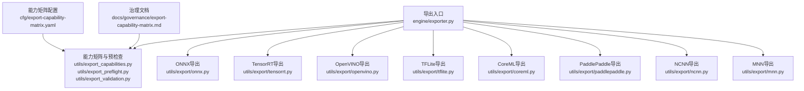
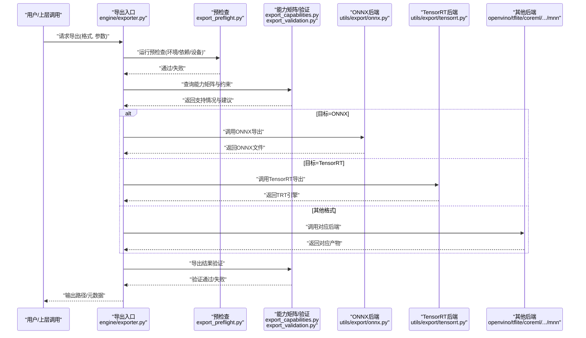
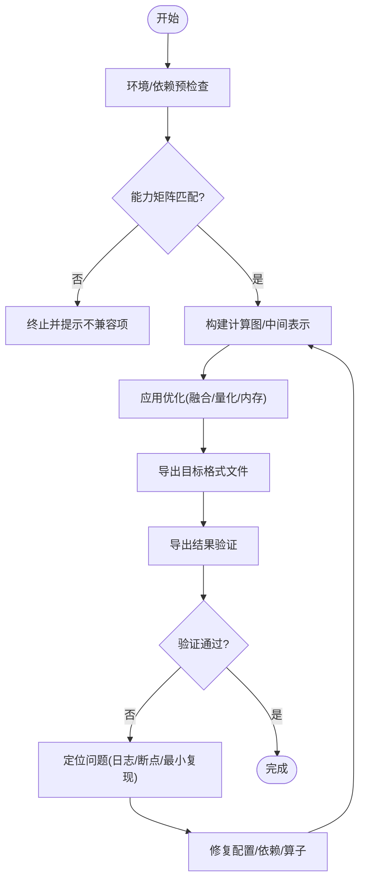
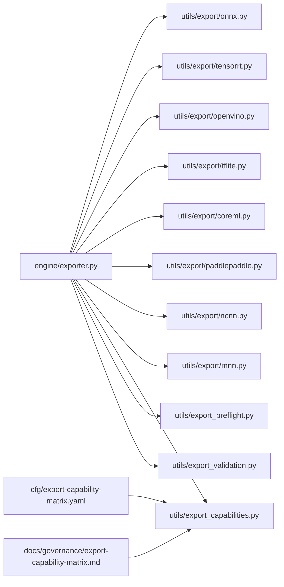

# 导出格式支持

<cite>
**本文引用的文件**
- [ultralytics/engine/exporter.py](file://ultralytics/engine/exporter.py)
- [ultralytics/utils/export/__init__.py](file://ultralytics/utils/export/__init__.py)
- [ultralytics/utils/export/onnx.py](file://ultralytics/utils/export/onnx.py)
- [ultralytics/utils/export/tensorrt.py](file://ultralytics/utils/export/tensorrt.py)
- [ultralytics/utils/export/openvino.py](file://ultralytics/utils/export/openvino.py)
- [ultralytics/utils/export/tflite.py](file://ultralytics/utils/export/tflite.py)
- [ultralytics/utils/export/coreml.py](file://ultralytics/utils/export/coreml.py)
- [ultralytics/utils/export/paddlepaddle.py](file://ultralytics/utils/export/paddlepaddle.py)
- [ultralytics/utils/export/ncnn.py](file://ultralytics/utils/export/ncnn.py)
- [ultralytics/utils/export/mnn.py](file://ultralytics/utils/export/mnn.py)
- [ultralytics/utils/export_capabilities.py](file://ultralytics/utils/export_capabilities.py)
- [ultralytics/utils/export_preflight.py](file://ultralytics/utils/export_preflight.py)
- [ultralytics/utils/export_validation.py](file://ultralytics/utils/export_validation.py)
- [ultralytics/cfg/export-capability-matrix.yaml](file://ultralytics/cfg/export-capability-matrix.yaml)
- [docs/governance/export-capability-matrix.md](file://docs/governance/export-capability-matrix.md)
- [examples/YOLO-Master-Cross-Platform-Edge-Deployment/coreml_export/export_coreml.py](file://examples/YOLO-Master-Cross-Platform-Edge-Deployment/coreml_export/export_coreml.py)
- [examples/YOLO-Master-Edge-Deployment/export_edge_models.py](file://examples/YOLO-Master-Edge-Deployment/export_edge_models.py)
- [tests/test_exports.py](file://tests/test_exports.py)
- [tests/test_export_capability_matrix.py](file://tests/test_export_capability_matrix.py)
- [tests/test_export_preflight.py](file://tests/test_export_preflight.py)
- [tests/test_export_roundtrip.py](file://tests/test_export_roundtrip.py)
</cite>

## 目录
1. [简介](#简介)
2. [项目结构](#项目结构)
3. [核心组件](#核心组件)
4. [架构总览](#架构总览)
5. [详细组件分析](#详细组件分析)
6. [依赖关系分析](#依赖关系分析)
7. [性能与优化](#性能与优化)
8. [故障排查指南](#故障排查指南)
9. [结论](#结论)
10. [附录](#附录)

## 简介
本文件面向YOLO-Master的模型导出子系统，系统化说明支持的导出格式（ONNX、TensorRT、OpenVINO、TFLite、CoreML、PaddlePaddle、NCNN、MNN等）的转换流程、参数配置、适用场景、性能特点与限制条件。文档同时覆盖导出选项与优化工具链（算子融合、量化压缩、内存优化）、不同格式的转换示例与最佳实践、兼容性矩阵与版本要求、错误处理与调试方法，以及自定义导出后端的开发指南。

## 项目结构
导出相关代码主要分布在以下位置：
- 统一导出入口与编排：engine层导出器
- 各后端专用导出实现：utils/export下按格式划分的模块
- 能力矩阵与预检查：export_capabilities、export_preflight、export_validation
- 配置与治理：export-capability-matrix.yaml、governance文档
- 示例与测试：examples与tests中对应脚本与用例

图表来源
- [ultralytics/engine/exporter.py](file://ultralytics/engine/exporter.py)
- [ultralytics/utils/export/onnx.py](file://ultralytics/utils/export/onnx.py)
- [ultralytics/utils/export/tensorrt.py](file://ultralytics/utils/export/tensorrt.py)
- [ultralytics/utils/export/openvino.py](file://ultralytics/utils/export/openvino.py)
- [ultralytics/utils/export/tflite.py](file://ultralytics/utils/export/tflite.py)
- [ultralytics/utils/export/coreml.py](file://ultralytics/utils/export/coreml.py)
- [ultralytics/utils/export/paddlepaddle.py](file://ultralytics/utils/export/paddlepaddle.py)
- [ultralytics/utils/export/ncnn.py](file://ultralytics/utils/export/ncnn.py)
- [ultralytics/utils/export/mnn.py](file://ultralytics/utils/export/mnn.py)
- [ultralytics/utils/export_capabilities.py](file://ultralytics/utils/export_capabilities.py)
- [ultralytics/utils/export_preflight.py](file://ultralytics/utils/export_preflight.py)
- [ultralytics/utils/export_validation.py](file://ultralytics/utils/export_validation.py)
- [ultralytics/cfg/export-capability-matrix.yaml](file://ultralytics/cfg/export-capability-matrix.yaml)
- [docs/governance/export-capability-matrix.md](file://docs/governance/export-capability-matrix.md)

章节来源
- [ultralytics/engine/exporter.py](file://ultralytics/engine/exporter.py)
- [ultralytics/utils/export/__init__.py](file://ultralytics/utils/export/__init__.py)
- [ultralytics/utils/export_capabilities.py](file://ultralytics/utils/export_capabilities.py)
- [ultralytics/utils/export_preflight.py](file://ultralytics/utils/export_preflight.py)
- [ultralytics/utils/export_validation.py](file://ultralytics/utils/export_validation.py)
- [ultralytics/cfg/export-capability-matrix.yaml](file://ultralytics/cfg/export-capability-matrix.yaml)
- [docs/governance/export-capability-matrix.md](file://docs/governance/export-capability-matrix.md)

## 核心组件
- 统一导出入口（engine/exporter.py）
  - 负责解析导出目标格式、调度预检查、调用具体后端实现、输出产物与元数据。
  - 提供统一的参数接口（如动态输入、精度、优化开关），并封装错误与日志。
- 能力矩阵与预检查（export_capabilities.py、export_preflight.py、export_validation.py）
  - export_capabilities：维护各格式的能力清单（是否支持任务类型、动态维度、量化、算子集）。
  - export_preflight：在导出前进行环境、依赖、设备、版本校验与冲突检测。
  - export_validation：对导出结果进行基本一致性验证（形状、数值范围、关键节点存在性）。
- 各格式后端（utils/export/*）
  - onnx.py：构建ONNX图、设置动态轴、导出onnx文件；可配合后续工具链进行优化。
  - tensorrt.py：基于ONNX生成TensorRT引擎，支持FP16/INT8、层融合、内核选择策略。
  - openvino.py：将模型转换为OpenVINO IR（IR+weights或bin），支持I/O优化与CPU/GPU加速。
  - tflite.py：导出为TFLite模型，支持量化（FP16/INT8）、NPU后端选择。
  - coreml.py：导出为CoreML模型，适配iOS/macOS推理，支持Metal后端。
  - paddlepaddle.py：导出为PaddlePaddle静态图，便于Paddle部署生态使用。
  - ncnn.py：导出为NCNN模型，面向移动端/嵌入式高性能推理。
  - mnn.py：导出为MNN模型，面向多平台轻量级部署。

章节来源
- [ultralytics/engine/exporter.py](file://ultralytics/engine/exporter.py)
- [ultralytics/utils/export/onnx.py](file://ultralytics/utils/export/onnx.py)
- [ultralytics/utils/export/tensorrt.py](file://ultralytics/utils/export/tensorrt.py)
- [ultralytics/utils/export/openvino.py](file://ultralytics/utils/export/openvino.py)
- [ultralytics/utils/export/tflite.py](file://ultralytics/utils/export/tflite.py)
- [ultralytics/utils/export/coreml.py](file://ultralytics/utils/export/coreml.py)
- [ultralytics/utils/export/paddlepaddle.py](file://ultralytics/utils/export/paddlepaddle.py)
- [ultralytics/utils/export/ncnn.py](file://ultralytics/utils/export/ncnn.py)
- [ultralytics/utils/export/mnn.py](file://ultralytics/utils/export/mnn.py)
- [ultralytics/utils/export_capabilities.py](file://ultralytics/utils/export_capabilities.py)
- [ultralytics/utils/export_preflight.py](file://ultralytics/utils/export_preflight.py)
- [ultralytics/utils/export_validation.py](file://ultralytics/utils/export_validation.py)

## 架构总览
导出系统采用“前端编排 + 后端插件”的架构。统一入口根据目标格式选择相应后端，并在执行前后插入能力检查与结果验证。

图表来源
- [ultralytics/engine/exporter.py](file://ultralytics/engine/exporter.py)
- [ultralytics/utils/export/onnx.py](file://ultralytics/utils/export/onnx.py)
- [ultralytics/utils/export/tensorrt.py](file://ultralytics/utils/export/tensorrt.py)
- [ultralytics/utils/export/openvino.py](file://ultralytics/utils/export/openvino.py)
- [ultralytics/utils/export/tflite.py](file://ultralytics/utils/export/tflite.py)
- [ultralytics/utils/export/coreml.py](file://ultralytics/utils/export/coreml.py)
- [ultralytics/utils/export/paddlepaddle.py](file://ultralytics/utils/export/paddlepaddle.py)
- [ultralytics/utils/export/ncnn.py](file://ultralytics/utils/export/ncnn.py)
- [ultralytics/utils/export/mnn.py](file://ultralytics/utils/export/mnn.py)
- [ultralytics/utils/export_capabilities.py](file://ultralytics/utils/export_capabilities.py)
- [ultralytics/utils/export_preflight.py](file://ultralytics/utils/export_preflight.py)
- [ultralytics/utils/export_validation.py](file://ultralytics/utils/export_validation.py)

## 详细组件分析

### ONNX导出
- 功能要点
  - 从PyTorch模型导出为ONNX，支持动态输入维度、批量大小、图像尺寸等。
  - 可与外部工具链集成进行进一步优化（如算子融合、常量折叠）。
- 典型参数
  - 动态轴配置、输入形状、导出路径、opset版本、简化/优化开关。
- 适用场景
  - 跨框架通用交换格式，作为中间表示用于TensorRT/OpenVINO/TFLite等二次转换。
- 性能与限制
  - 取决于目标运行时与算子支持；部分复杂算子可能需要自定义或降级。
- 参考实现路径
  - [onnx.py](file://ultralytics/utils/export/onnx.py)

章节来源
- [ultralytics/utils/export/onnx.py](file://ultralytics/utils/export/onnx.py)

### TensorRT导出
- 功能要点
  - 基于ONNX构建TensorRT引擎，支持FP16/INT8量化、层融合、内核自动选择。
  - 可配置最大工作空间、优化级别、目标GPU架构。
- 典型参数
  - 精度模式、校准数据集（INT8）、最大批大小、动态输入、优化级别。
- 适用场景
  - NVIDIA GPU高吞吐低延迟推理，适合服务器端与边缘GPU。
- 性能与限制
  - 需要兼容的CUDA/cuDNN/TRT版本；某些动态特性可能受限。
- 参考实现路径
  - [tensorrt.py](file://ultralytics/utils/export/tensorrt.py)

章节来源
- [ultralytics/utils/export/tensorrt.py](file://ultralytics/utils/export/tensorrt.py)

### OpenVINO导出
- 功能要点
  - 导出为OpenVINO IR（XML+BIN或ONNX直出），支持CPU/GPU/VPU等多后端。
  - 可进行I/O优化、常量传播、算子替换。
- 典型参数
  - 输入形状、动态维度、优化级别、目标设备、IR保存路径。
- 适用场景
  - Intel CPU/核显/Movidius等硬件的高效推理。
- 性能与限制
  - 需安装OpenVINO运行时；部分动态特性受限于IR规格。
- 参考实现路径
  - [openvino.py](file://ultralytics/utils/export/openvino.py)

章节来源
- [ultralytics/utils/export/openvino.py](file://ultralytics/utils/export/openvino.py)

### TFLite导出
- 功能要点
  - 导出为TFLite模型，支持FP16/INT8量化，适配Android/iOS/NPU。
- 典型参数
  - 量化模式、代表数据集（INT8）、输入形状、优化器开关。
- 适用场景
  - 移动端与嵌入式设备，尤其是Google Edge TPU与手机NPU。
- 性能与限制
  - 量化可能带来精度损失；需确保算子被目标NPU支持。
- 参考实现路径
  - [tflite.py](file://ultralytics/utils/export/tflite.py)

章节来源
- [ultralytics/utils/export/tflite.py](file://ultralytics/utils/export/tflite.py)

### CoreML导出
- 功能要点
  - 导出为CoreML模型，适配iOS/macOS推理，支持Metal后端。
- 典型参数
  - 输入形状、动态维度、模型压缩、目标平台版本。
- 适用场景
  - Apple生态设备的高能效推理。
- 性能与限制
  - 依赖macOS与CoreML工具链；动态特性有限制。
- 参考实现路径
  - [coreml.py](file://ultralytics/utils/export/coreml.py)
  - 示例脚本：[export_coreml.py](file://examples/YOLO-Master-Cross-Platform-Edge-Deployment/coreml_export/export_coreml.py)

章节来源
- [ultralytics/utils/export/coreml.py](file://ultralytics/utils/export/coreml.py)
- [examples/YOLO-Master-Cross-Platform-Edge-Deployment/coreml_export/export_coreml.py](file://examples/YOLO-Master-Cross-Platform-Edge-Deployment/coreml_export/export_coreml.py)

### PaddlePaddle导出
- 功能要点
  - 导出为PaddlePaddle静态图，便于Paddle部署生态使用。
- 典型参数
  - 输入形状、动态维度、保存路径。
- 适用场景
  - 使用Paddle Serving/Paddle Lite的部署场景。
- 性能与限制
  - 依赖PaddlePaddle导出工具链；部分动态特性受限。
- 参考实现路径
  - [paddlepaddle.py](file://ultralytics/utils/export/paddlepaddle.py)

章节来源
- [ultralytics/utils/export/paddlepaddle.py](file://ultralytics/utils/export/paddlepaddle.py)

### NCNN导出
- 功能要点
  - 导出为NCNN模型，面向移动端/嵌入式高性能推理。
- 典型参数
  - 输入形状、动态维度、优化开关。
- 适用场景
  - Android/iOS/ARM平台的轻量级部署。
- 性能与限制
  - 依赖NCNN工具链；动态特性有限。
- 参考实现路径
  - [ncnn.py](file://ultralytics/utils/export/ncnn.py)

章节来源
- [ultralytics/utils/export/ncnn.py](file://ultralytics/utils/export/ncnn.py)

### MNN导出
- 功能要点
  - 导出为MNN模型，面向多平台轻量级部署。
- 典型参数
  - 输入形状、动态维度、优化开关。
- 适用场景
  - 阿里生态及多平台移动端部署。
- 性能与限制
  - 依赖MNN工具链；动态特性有限。
- 参考实现路径
  - [mnn.py](file://ultralytics/utils/export/mnn.py)

章节来源
- [ultralytics/utils/export/mnn.py](file://ultralytics/utils/export/mnn.py)

### 导出流程与参数配置（通用）
- 统一入口参数
  - 目标格式、输入形状/动态轴、精度模式、优化开关、输出路径、日志级别。
- 预检查与能力矩阵
  - 环境依赖、设备可用性、版本兼容性、任务类型支持。
- 导出后验证
  - 基本形状/数值范围检查、关键节点存在性、与原始模型对比（可选）。

图表来源
- [ultralytics/engine/exporter.py](file://ultralytics/engine/exporter.py)
- [ultralytics/utils/export_capabilities.py](file://ultralytics/utils/export_capabilities.py)
- [ultralytics/utils/export_preflight.py](file://ultralytics/utils/export_preflight.py)
- [ultralytics/utils/export_validation.py](file://ultralytics/utils/export_validation.py)

章节来源
- [ultralytics/engine/exporter.py](file://ultralytics/engine/exporter.py)
- [ultralytics/utils/export_capabilities.py](file://ultralytics/utils/export_capabilities.py)
- [ultralytics/utils/export_preflight.py](file://ultralytics/utils/export_preflight.py)
- [ultralytics/utils/export_validation.py](file://ultralytics/utils/export_validation.py)

### 示例与最佳实践
- 示例脚本
  - CoreML导出示例：[export_coreml.py](file://examples/YOLO-Master-Cross-Platform-Edge-Deployment/coreml_export/export_coreml.py)
  - 边缘模型批量导出示例：[export_edge_models.py](file://examples/YOLO-Master-Edge-Deployment/export_edge_models.py)
- 最佳实践
  - 先导出ONNX再转目标格式，便于统一调试与优化。
  - 针对目标设备选择合适的精度与量化策略，并进行回归验证。
  - 固定输入形状以最大化优化收益；动态输入仅在必要时启用。
  - 记录导出配置与环境信息，便于复现与审计。

章节来源
- [examples/YOLO-Master-Cross-Platform-Edge-Deployment/coreml_export/export_coreml.py](file://examples/YOLO-Master-Cross-Platform-Edge-Deployment/coreml_export/export_coreml.py)
- [examples/YOLO-Master-Edge-Deployment/export_edge_models.py](file://examples/YOLO-Master-Edge-Deployment/export_edge_models.py)

### 兼容性矩阵与版本要求
- 能力矩阵配置
  - 集中定义各格式的任务支持、动态维度、量化、算子覆盖等信息。
- 治理文档
  - 提供矩阵解读、版本约束与演进策略。
- 建议
  - 在导出前读取能力矩阵，避免不支持的组合；遇到新特性时更新矩阵与预检查逻辑。

章节来源
- [ultralytics/cfg/export-capability-matrix.yaml](file://ultralytics/cfg/export-capability-matrix.yaml)
- [docs/governance/export-capability-matrix.md](file://docs/governance/export-capability-matrix.md)

### 错误处理与调试方法
- 常见错误类别
  - 环境/依赖缺失、版本不兼容、算子不支持、动态维度非法、量化校准失败。
- 调试手段
  - 开启详细日志、最小化输入复现、分阶段导出（先ONNX再目标格式）、逐层验证。
- 自动化验证
  - 使用导出验证模块进行基础一致性检查；结合端到端测试用例。

章节来源
- [ultralytics/utils/export_preflight.py](file://ultralytics/utils/export_preflight.py)
- [ultralytics/utils/export_validation.py](file://ultralytics/utils/export_validation.py)
- [tests/test_export_preflight.py](file://tests/test_export_preflight.py)
- [tests/test_export_roundtrip.py](file://tests/test_export_roundtrip.py)

### 自定义导出后端开发指南
- 步骤概览
  - 新增后端实现文件（如 utils/export/custom_backend.py），遵循统一接口约定。
  - 在导出入口注册新后端，使其能被统一入口识别与调度。
  - 更新能力矩阵与预检查逻辑，声明新后端的支持范围与约束。
  - 编写单元测试与示例脚本，覆盖正常路径与异常分支。
- 接口约定
  - 输入：模型对象、导出参数、输出路径。
  - 输出：目标格式文件路径、元数据（输入形状、精度、优化信息等）。
  - 错误：抛出明确异常并提供上下文信息。
- 参考实现
  - 参考现有后端（onnx/tensorrt/openvino等）的实现风格与错误处理。

章节来源
- [ultralytics/engine/exporter.py](file://ultralytics/engine/exporter.py)
- [ultralytics/utils/export/onnx.py](file://ultralytics/utils/export/onnx.py)
- [ultralytics/utils/export/tensorrt.py](file://ultralytics/utils/export/tensorrt.py)
- [ultralytics/utils/export/openvino.py](file://ultralytics/utils/export/openvino.py)
- [ultralytics/utils/export/tflite.py](file://ultralytics/utils/export/tflite.py)
- [ultralytics/utils/export/coreml.py](file://ultralytics/utils/export/coreml.py)
- [ultralytics/utils/export/paddlepaddle.py](file://ultralytics/utils/export/paddlepaddle.py)
- [ultralytics/utils/export/ncnn.py](file://ultralytics/utils/export/ncnn.py)
- [ultralytics/utils/export/mnn.py](file://ultralytics/utils/export/mnn.py)
- [ultralytics/utils/export_capabilities.py](file://ultralytics/utils/export_capabilities.py)
- [ultralytics/utils/export_preflight.py](file://ultralytics/utils/export_preflight.py)

## 依赖关系分析
导出系统内部依赖关系如下：

图表来源
- [ultralytics/engine/exporter.py](file://ultralytics/engine/exporter.py)
- [ultralytics/utils/export/onnx.py](file://ultralytics/utils/export/onnx.py)
- [ultralytics/utils/export/tensorrt.py](file://ultralytics/utils/export/tensorrt.py)
- [ultralytics/utils/export/openvino.py](file://ultralytics/utils/export/openvino.py)
- [ultralytics/utils/export/tflite.py](file://ultralytics/utils/export/tflite.py)
- [ultralytics/utils/export/coreml.py](file://ultralytics/utils/export/coreml.py)
- [ultralytics/utils/export/paddlepaddle.py](file://ultralytics/utils/export/paddlepaddle.py)
- [ultralytics/utils/export/ncnn.py](file://ultralytics/utils/export/ncnn.py)
- [ultralytics/utils/export/mnn.py](file://ultralytics/utils/export/mnn.py)
- [ultralytics/utils/export_capabilities.py](file://ultralytics/utils/export_capabilities.py)
- [ultralytics/utils/export_preflight.py](file://ultralytics/utils/export_preflight.py)
- [ultralytics/utils/export_validation.py](file://ultralytics/utils/export_validation.py)
- [ultralytics/cfg/export-capability-matrix.yaml](file://ultralytics/cfg/export-capability-matrix.yaml)
- [docs/governance/export-capability-matrix.md](file://docs/governance/export-capability-matrix.md)

章节来源
- [ultralytics/engine/exporter.py](file://ultralytics/engine/exporter.py)
- [ultralytics/utils/export_capabilities.py](file://ultralytics/utils/export_capabilities.py)
- [ultralytics/utils/export_preflight.py](file://ultralytics/utils/export_preflight.py)
- [ultralytics/utils/export_validation.py](file://ultralytics/utils/export_validation.py)
- [ultralytics/cfg/export-capability-matrix.yaml](file://ultralytics/cfg/export-capability-matrix.yaml)
- [docs/governance/export-capability-matrix.md](file://docs/governance/export-capability-matrix.md)

## 性能与优化
- 算子融合
  - 在ONNX阶段或目标运行时启用融合，减少内核启动开销。
- 量化压缩
  - FP16/INT8量化显著降低内存与带宽需求；需校准数据保证精度。
- 内存优化
  - 固定输入形状、禁用不必要的动态特性、裁剪未用分支。
- 运行时选择
  - 根据目标设备选择最优后端（GPU/CPU/NPU/Edge TPU/CoreML）。
- 基准与回归
  - 建立导出前后性能基线，持续监控延迟与吞吐变化。

[本节为通用指导，无需特定文件引用]

## 故障排查指南
- 预检查失败
  - 检查依赖安装、版本匹配、设备可用性与权限。
- 导出失败
  - 确认输入形状合法、动态维度合理、目标格式支持该任务。
- 精度下降
  - 调整量化策略、增加校准样本、回退到更高精度。
- 运行时崩溃
  - 核对运行时版本、算子支持列表、模型输入输出签名。
- 自动化测试
  - 使用导出能力矩阵测试与端到端回归测试快速定位问题。

章节来源
- [tests/test_export_preflight.py](file://tests/test_export_preflight.py)
- [tests/test_export_roundtrip.py](file://tests/test_export_roundtrip.py)
- [tests/test_exports.py](file://tests/test_exports.py)
- [tests/test_export_capability_matrix.py](file://tests/test_export_capability_matrix.py)

## 结论
YOLO-Master的导出系统通过统一入口与模块化后端实现了多格式、多平台的模型导出能力。借助能力矩阵与预检查机制，系统在兼容性、稳定性与可维护性方面具备良好保障。推荐以ONNX为中间表示，结合目标运行时的优化工具链，实现性能与精度的平衡。对于新后端，应遵循统一接口、完善能力矩阵与测试覆盖，确保整体生态的一致性与可扩展性。

[本节为总结性内容，无需特定文件引用]

## 附录
- 示例脚本
  - CoreML导出示例：[export_coreml.py](file://examples/YOLO-Master-Cross-Platform-Edge-Deployment/coreml_export/export_coreml.py)
  - 边缘模型批量导出示例：[export_edge_models.py](file://examples/YOLO-Master-Edge-Deployment/export_edge_models.py)
- 测试用例
  - 导出能力矩阵测试：[test_export_capability_matrix.py](file://tests/test_export_capability_matrix.py)
  - 导出预检查测试：[test_export_preflight.py](file://tests/test_export_preflight.py)
  - 导出端到端测试：[test_export_roundtrip.py](file://tests/test_export_roundtrip.py)
  - 导出综合测试：[test_exports.py](file://tests/test_exports.py)

章节来源
- [examples/YOLO-Master-Cross-Platform-Edge-Deployment/coreml_export/export_coreml.py](file://examples/YOLO-Master-Cross-Platform-Edge-Deployment/coreml_export/export_coreml.py)
- [examples/YOLO-Master-Edge-Deployment/export_edge_models.py](file://examples/YOLO-Master-Edge-Deployment/export_edge_models.py)
- [tests/test_export_capability_matrix.py](file://tests/test_export_capability_matrix.py)
- [tests/test_export_preflight.py](file://tests/test_export_preflight.py)
- [tests/test_export_roundtrip.py](file://tests/test_export_roundtrip.py)
- [tests/test_exports.py](file://tests/test_exports.py)