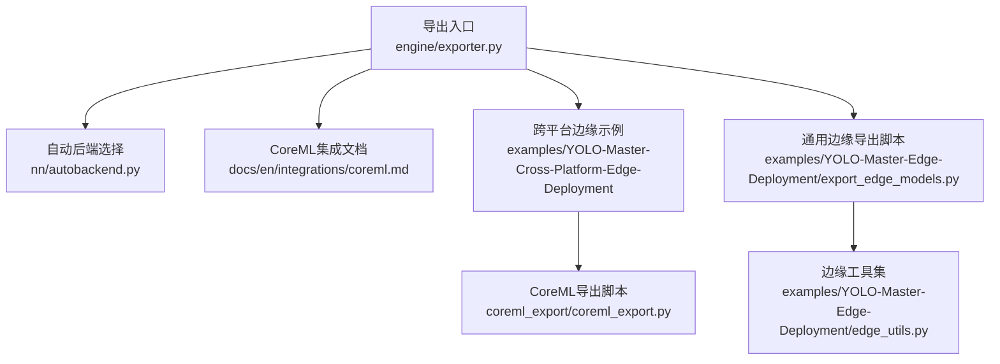
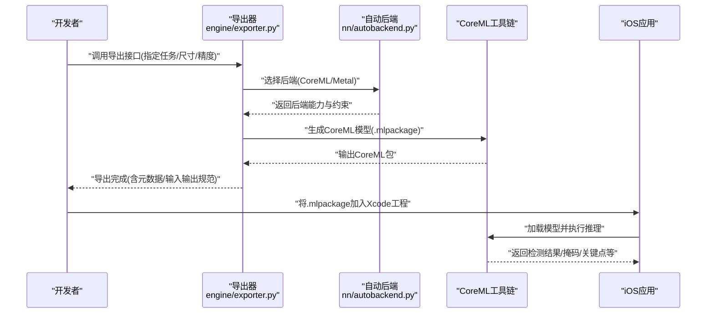
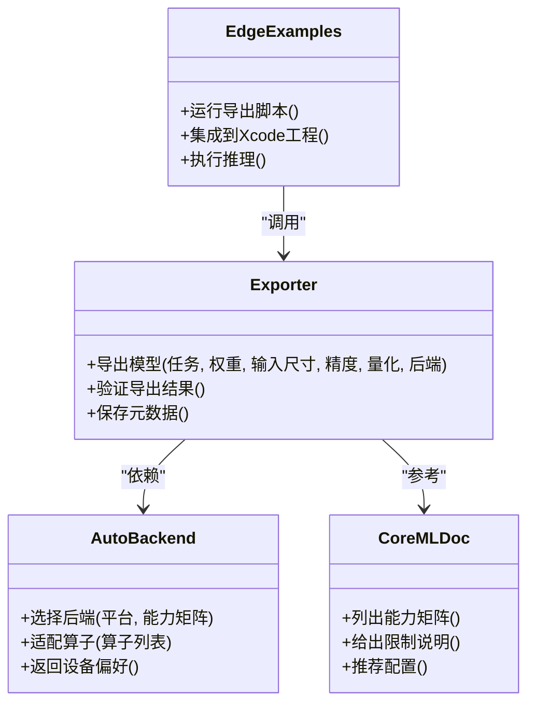
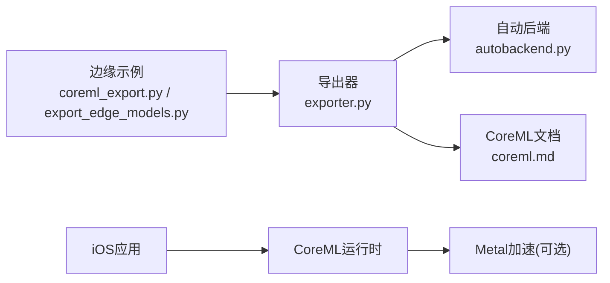

# CoreML移动端导出

<cite>
**本文引用的文件**
- [exporter.py](file://ultralytics/engine/exporter.py)
- [autobackend.py](file://ultralytics/nn/autobackend.py)
- [coreml.md](file://docs/en/integrations/coreml.md)
- [README.md](file://examples/YOLO-Master-Cross-Platform-Edge-Deployment/README.md)
- [TECHNICAL_REPORT.md](file://examples/YOLO-Master-Cross-Platform-Edge-Deployment/TECHNICAL_REPORT.md)
- [coreml_export.py](file://examples/YOLO-Master-Cross-Platform-Edge-Deployment/coreml_export/coreml_export.py)
- [export_edge_models.py](file://examples/YOLO-Master-Edge-Deployment/export_edge_models.py)
- [edge_utils.py](file://examples/YOLO-Master-Edge-Deployment/edge_utils.py)
</cite>

## 目录
1. [简介](#简介)
2. [项目结构](#项目结构)
3. [核心组件](#核心组件)
4. [架构总览](#架构总览)
5. [详细组件分析](#详细组件分析)
6. [依赖关系分析](#依赖关系分析)
7. [性能与优化](#性能与优化)
8. [故障排查指南](#故障排查指南)
9. [结论](#结论)
10. [附录](#附录)

## 简介
本技术文档聚焦于将YOLO模型转换为CoreML格式并在iOS设备上运行的完整流程。内容涵盖：
- CoreML导出的配置选项、量化设置与性能优化参数
- iOS部署环境要求、Xcode集成方法与Metal后端优化
- 模型转换、加载与推理的端到端示例（以代码片段路径形式提供）
- 内存管理策略、实时性能调优与电池使用优化最佳实践
- CoreML框架的限制条件与常见问题解决方案

## 项目结构
与CoreML导出和移动端部署相关的核心位置如下：
- 引擎导出入口：ultralytics/engine/exporter.py
- 自动后端选择：ultralytics/nn/autobackend.py
- 官方集成文档：docs/en/integrations/coreml.md
- 跨平台边缘部署示例：examples/YOLO-Master-Cross-Platform-Edge-Deployment
- 通用边缘导出脚本：examples/YOLO-Master-Edge-Deployment

图表来源
- [exporter.py](file://ultralytics/engine/exporter.py)
- [autobackend.py](file://ultralytics/nn/autobackend.py)
- [coreml.md](file://docs/en/integrations/coreml.md)
- [README.md](file://examples/YOLO-Master-Cross-Platform-Edge-Deployment/README.md)
- [TECHNICAL_REPORT.md](file://examples/YOLO-Master-Cross-Platform-Edge-Deployment/TECHNICAL_REPORT.md)
- [coreml_export.py](file://examples/YOLO-Master-Cross-Platform-Edge-Deployment/coreml_export/coreml_export.py)
- [export_edge_models.py](file://examples/YOLO-Master-Edge-Deployment/export_edge_models.py)
- [edge_utils.py](file://examples/YOLO-Master-Edge-Deployment/edge_utils.py)

章节来源
- [exporter.py](file://ultralytics/engine/exporter.py)
- [autobackend.py](file://ultralytics/nn/autobackend.py)
- [coreml.md](file://docs/en/integrations/coreml.md)
- [README.md](file://examples/YOLO-Master-Cross-Platform-Edge-Deployment/README.md)
- [TECHNICAL_REPORT.md](file://examples/YOLO-Master-Cross-Platform-Edge-Deployment/TECHNICAL_REPORT.md)
- [coreml_export.py](file://examples/YOLO-Master-Cross-Platform-Edge-Deployment/coreml_export/coreml_export.py)
- [export_edge_models.py](file://examples/YOLO-Master-Edge-Deployment/export_edge_models.py)
- [edge_utils.py](file://examples/YOLO-Master-Edge-Deployment/edge_utils.py)

## 核心组件
- 导出入口与流程编排：负责解析导出参数、构建中间表示（如ONNX）、调用目标后端转换器，并输出CoreML包。
- 自动后端选择：根据目标平台与可用运行时动态选择最优后端（CoreML/Metal等）。
- 集成文档与示例：提供CoreML能力矩阵、限制说明以及可复用的导出脚本与工程模板。

章节来源
- [exporter.py](file://ultralytics/engine/exporter.py)
- [autobackend.py](file://ultralytics/nn/autobackend.py)
- [coreml.md](file://docs/en/integrations/coreml.md)

## 架构总览
下图展示了从PyTorch模型到CoreML模型的转换链路，以及iOS端的加载与推理流程。

图表来源
- [exporter.py](file://ultralytics/engine/exporter.py)
- [autobackend.py](file://ultralytics/nn/autobackend.py)
- [coreml.md](file://docs/en/integrations/coreml.md)

## 详细组件分析

### 导出入口与参数体系（engine/exporter.py）
- 职责
  - 统一封装导出流程：接收任务类型（检测/分割/姿态等）、输入尺寸、精度与量化选项，协调中间表示与目标后端。
  - 输出CoreML包，附带输入/输出描述与设备偏好（CPU/GPU/NPU）。
- 关键参数维度（概念性说明）
  - 任务与模型：任务类型、权重路径、类别数、输入形状。
  - 精度与量化：半精度/整型量化、校准数据集或统计信息、算子支持范围。
  - 设备与后端：CoreML后端选择（CPU/GPU/NPU）、Metal加速开关。
  - 后处理：NMS阈值、置信度阈值、最大检测数、坐标归一化方式。
- 典型调用路径
  - 通过命令行或Python API触发导出；内部根据后端能力矩阵决定是否启用量化与特定优化。

章节来源
- [exporter.py](file://ultralytics/engine/exporter.py)

### 自动后端选择（nn/autobackend.py）
- 职责
  - 在运行期或导出期判断可用后端与硬件特性，选择最优执行路径（CoreML+Metal优先）。
  - 为不同后端提供统一的接口契约，屏蔽底层差异。
- 决策要点
  - 平台可用性（macOS/iOS）、CoreML版本、Metal支持情况、内存与算力预算。
  - 针对不支持的算子进行回退或替换策略。

章节来源
- [autobackend.py](file://ultralytics/nn/autobackend.py)

### CoreML集成文档（docs/en/integrations/coreml.md）
- 内容要点
  - CoreML能力矩阵：支持的模型族、任务、输入尺寸、精度与量化选项。
  - 限制与兼容性：不支持的算子、动态形状限制、iOS版本要求。
  - 推荐配置：面向移动端的默认导出参数与优化建议。

章节来源
- [coreml.md](file://docs/en/integrations/coreml.md)

### 跨平台边缘部署示例（examples/YOLO-Master-Cross-Platform-Edge-Deployment）
- 目标
  - 提供可在多平台（含iOS/macOS）复现的导出与推理示例，包含CoreML导出脚本与工程组织。
- 关键文件
  - README：整体说明与环境准备。
  - TECHNICAL_REPORT：技术细节与注意事项。
  - coreml_export/coreml_export.py：CoreML导出脚本，演示如何调用导出器并配置量化与后端。

章节来源
- [README.md](file://examples/YOLO-Master-Cross-Platform-Edge-Deployment/README.md)
- [TECHNICAL_REPORT.md](file://examples/YOLO-Master-Cross-Platform-Edge-Deployment/TECHNICAL_REPORT.md)
- [coreml_export.py](file://examples/YOLO-Master-Cross-Platform-Edge-Deployment/coreml_export/coreml_export.py)

### 通用边缘导出脚本（examples/YOLO-Master-Edge-Deployment）
- 目标
  - 提供一键导出多种边缘格式的脚本，包括CoreML，便于批量实验与回归测试。
- 关键文件
  - export_edge_models.py：统一入口，按配置导出不同后端格式。
  - edge_utils.py：边缘侧工具函数（如IO、路径处理、日志等）。

章节来源
- [export_edge_models.py](file://examples/YOLO-Master-Edge-Deployment/export_edge_models.py)
- [edge_utils.py](file://examples/YOLO-Master-Edge-Deployment/edge_utils.py)

### 类图：导出相关核心类（示意）

图表来源
- [exporter.py](file://ultralytics/engine/exporter.py)
- [autobackend.py](file://ultralytics/nn/autobackend.py)
- [coreml.md](file://docs/en/integrations/coreml.md)
- [coreml_export.py](file://examples/YOLO-Master-Cross-Platform-Edge-Deployment/coreml_export/coreml_export.py)

## 依赖关系分析
- 模块耦合
  - exporter.py 作为中心编排者，依赖 autobackend.py 的后端选择逻辑，并参考 coreml.md 的能力与限制。
  - 示例脚本通过调用导出器完成CoreML导出，随后在iOS工程中加载推理。
- 外部依赖
  - CoreML工具链（macOS上用于转换与验证）
  - iOS CoreML运行时（设备端执行）
  - Metal（可选，用于GPU加速）

图表来源
- [exporter.py](file://ultralytics/engine/exporter.py)
- [autobackend.py](file://ultralytics/nn/autobackend.py)
- [coreml.md](file://docs/en/integrations/coreml.md)
- [coreml_export.py](file://examples/YOLO-Master-Cross-Platform-Edge-Deployment/coreml_export/coreml_export.py)
- [export_edge_models.py](file://examples/YOLO-Master-Edge-Deployment/export_edge_models.py)

章节来源
- [exporter.py](file://ultralytics/engine/exporter.py)
- [autobackend.py](file://ultralytics/nn/autobackend.py)
- [coreml.md](file://docs/en/integrations/coreml.md)
- [coreml_export.py](file://examples/YOLO-Master-Cross-Platform-Edge-Deployment/coreml_export/coreml_export.py)
- [export_edge_models.py](file://examples/YOLO-Master-Edge-Deployment/export_edge_models.py)

## 性能与优化
- 量化与精度
  - 优先尝试半精度（FP16），若算子受限则回退至FP32；在满足精度的前提下评估INT8量化的收益与风险。
  - 使用代表性校准数据或统计信息，避免分布偏移导致的精度损失。
- 输入尺寸与批大小
  - 移动端建议固定输入尺寸，减少动态形状带来的开销；根据场景调整分辨率与批大小平衡吞吐与延迟。
- 后端与设备
  - 优先启用CoreML+Metal组合以获得GPU加速；必要时对比CPU/GPU/NPU在不同机型上的表现。
- 后处理优化
  - 合理设置NMS阈值、置信度阈值与最大检测数，降低不必要的计算。
- 内存与功耗
  - 复用输入缓冲区，避免频繁分配；控制并发推理线程数，避免过热降频。
  - 在后台任务中降低帧率或采用事件驱动推理，延长续航。

[本节为通用指导，不直接分析具体文件]

## 故障排查指南
- 导出失败或报错
  - 检查CoreML工具链版本与macOS/iOS系统版本匹配。
  - 核对模型是否包含CoreML不支持的算子，参考能力矩阵与限制说明。
- 精度异常
  - 确认量化配置与校准数据质量；对比FP32基线定位偏差来源。
  - 检查输入预处理（归一化、通道顺序、尺寸）是否与训练一致。
- 运行时崩溃或卡顿
  - 检查输入形状与数据类型是否符合导出时的约定。
  - 关闭不必要的并发，观察是否由资源竞争导致。
- 电量消耗过高
  - 降低分辨率或帧率；减少后处理复杂度；避免频繁唤醒GPU。

章节来源
- [coreml.md](file://docs/en/integrations/coreml.md)
- [TECHNICAL_REPORT.md](file://examples/YOLO-Master-Cross-Platform-Edge-Deployment/TECHNICAL_REPORT.md)

## 结论
通过将YOLO模型导出为CoreML并结合Metal加速，可以在iOS设备上实现高效的目标检测与相关视觉任务。建议在导出阶段充分评估能力矩阵与限制，结合量化与输入尺寸调优，在精度、延迟与功耗之间取得平衡。利用示例工程快速落地，并在真实设备上持续监控性能与稳定性。

[本节为总结性内容，不直接分析具体文件]

## 附录
- 快速开始（以代码片段路径代替具体代码）
  - 导出CoreML模型：参见 [coreml_export.py](file://examples/YOLO-Master-Cross-Platform-Edge-Deployment/coreml_export/coreml_export.py)
  - 批量导出边缘模型：参见 [export_edge_models.py](file://examples/YOLO-Master-Edge-Deployment/export_edge_models.py)
  - 边缘工具函数：参见 [edge_utils.py](file://examples/YOLO-Master-Edge-Deployment/edge_utils.py)
- Xcode集成要点
  - 将生成的CoreML包添加到工程资源；确保目标设备与最低系统版本满足要求。
  - 在应用中加载CoreML模型，传入符合约定的输入张量，获取检测结果并进行可视化。
- 参考文档
  - CoreML集成文档与能力矩阵：参见 [coreml.md](file://docs/en/integrations/coreml.md)
  - 跨平台边缘部署说明与技术报告：参见 [README.md](file://examples/YOLO-Master-Cross-Platform-Edge-Deployment/README.md)、[TECHNICAL_REPORT.md](file://examples/YOLO-Master-Cross-Platform-Edge-Deployment/TECHNICAL_REPORT.md)