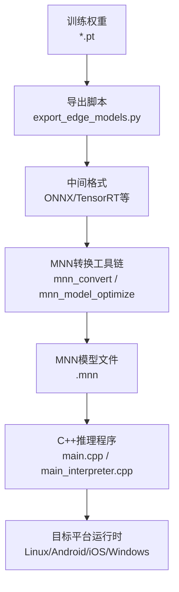
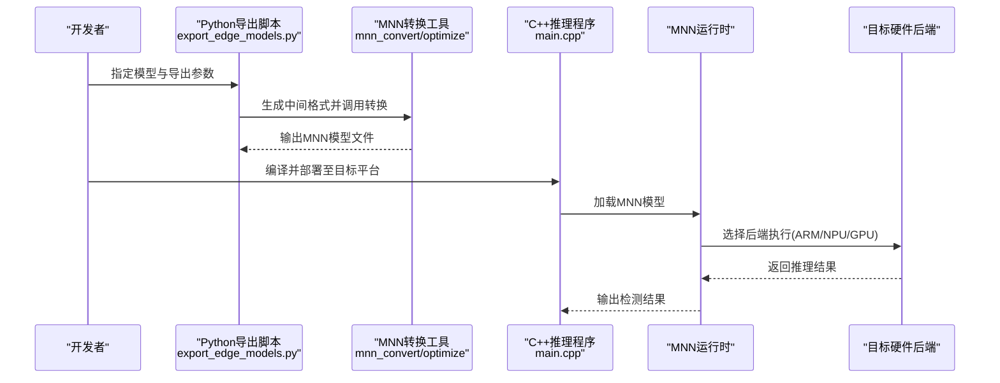
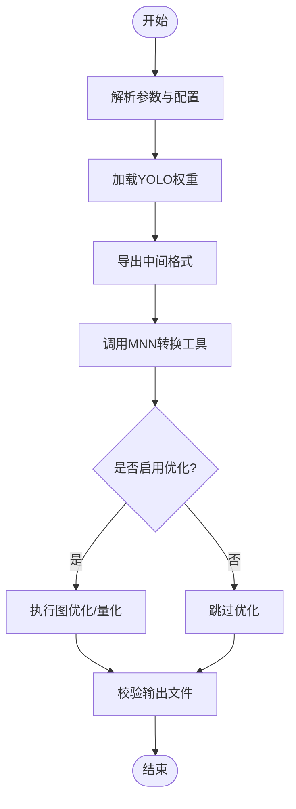
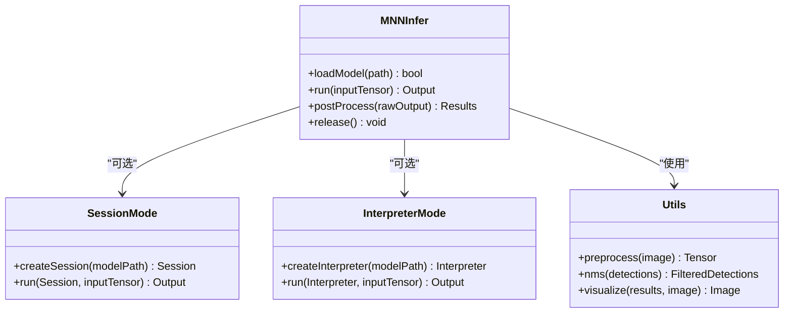
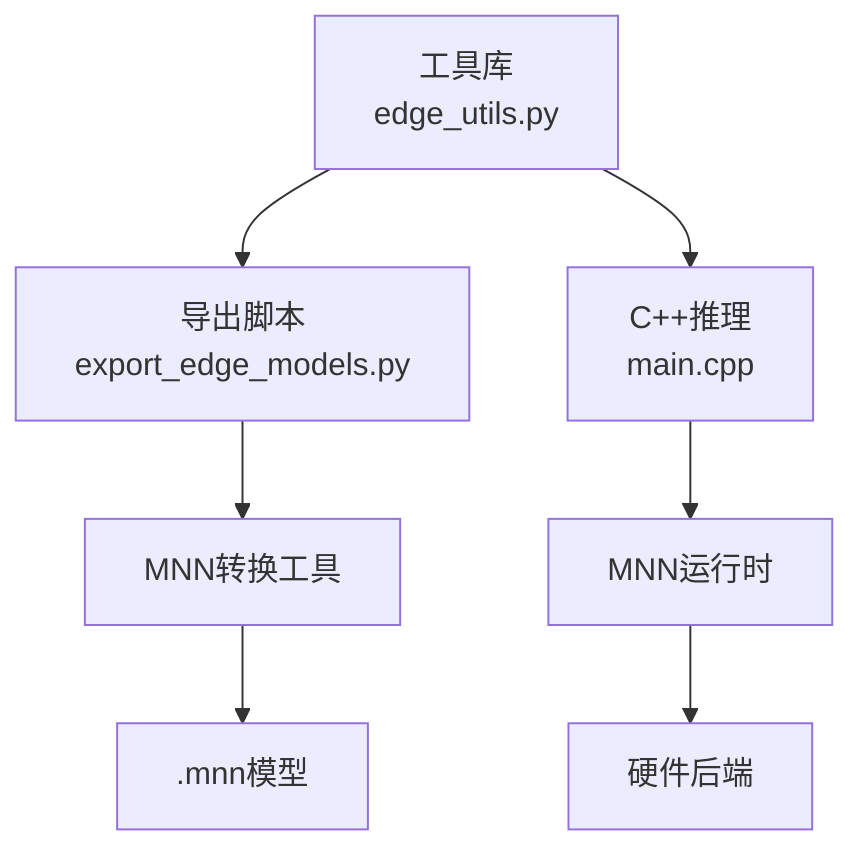

# MNN边缘设备导出

<cite>
**本文引用的文件**
- [mnn.md](file://docs/en/integrations/mnn.md)
- [YOLOv8-MNN-CPP/README.md](file://examples/YOLOv8-MNN-CPP/README.md)
- [YOLOv8-MNN-CPP/main.cpp](file://examples/YOLOv8-MNN-CPP/main.cpp)
- [YOLOv8-MNN-CPP/main_interpreter.cpp](file://examples/YOLOv8-MNN-CPP/main_interpreter.cpp)
- [YOLOv8-MNN-CPP/CMakeLists.txt](file://examples/YOLOv8-MNN-CPP/CMakeLists.txt)
- [export_edge_models.py](file://examples/YOLO-Master-Edge-Deployment/export_edge_models.py)
- [edge_utils.py](file://examples/YOLO-Master-Edge-Deployment/edge_utils.py)
- [CMakeLists.txt](file://examples/YOLO-Master-Edge-Deployment/CMakeLists.txt)
- [inference.cc](file://examples/YOLOv8-OpenVINO-CPP-Inference/inference.cc)
- [inference.h](file://examples/YOLOv8-OpenVINO-CPP-Inference/inference.h)
- [main.cc](file://examples/YOLOv8-OpenVINO-CPP-Inference/main.cc)
</cite>

## 目录
1. [简介](#简介)
2. [项目结构](#项目结构)
3. [核心组件](#核心组件)
4. [架构总览](#架构总览)
5. [详细组件分析](#详细组件分析)
6. [依赖关系分析](#依赖关系分析)
7. [性能考量](#性能考量)
8. [故障排查指南](#故障排查指南)
9. [结论](#结论)
10. [附录](#附录)

## 简介
本技术文档聚焦于将YOLO模型转换为MNN格式并在多种边缘与嵌入式平台上部署的完整流程。内容涵盖：
- 模型转换与导出（从训练权重到MNN）
- 量化策略、图优化与性能调优选项
- 多平台环境要求与跨平台编译配置（Linux、Android、iOS、Windows）
- C++推理示例（加载、预处理、推理、后处理）
- 不同硬件后端对比与内存优化策略
- 实时推理调优最佳实践
- MNN扩展机制、自定义算子开发与生产部署注意事项

## 项目结构
仓库中与MNN相关的资源主要分布在以下位置：
- 集成文档：docs/en/integrations/mnn.md
- C++推理示例：examples/YOLOv8-MNN-CPP
- 边缘部署脚本与工具：examples/YOLO-Master-Edge-Deployment
- 其他框架的C++参考实现（用于对比学习）：examples/YOLOv8-OpenVINO-CPP-Inference

图示来源
- [export_edge_models.py:1-200](file://examples/YOLO-Master-Edge-Deployment/export_edge_models.py#L1-L200)
- [YOLOv8-MNN-CPP/main.cpp:1-200](file://examples/YOLOv8-MNN-CPP/main.cpp#L1-L200)
- [YOLOv8-MNN-CPP/main_interpreter.cpp:1-200](file://examples/YOLOv8-MNN-CPP/main_interpreter.cpp#L1-L200)

章节来源
- [mnn.md:1-200](file://docs/en/integrations/mnn.md#L1-L200)
- [YOLOv8-MNN-CPP/README.md:1-200](file://examples/YOLOv8-MNN-CPP/README.md#L1-L200)
- [export_edge_models.py:1-200](file://examples/YOLO-Master-Edge-Deployment/export_edge_models.py#L1-L200)
- [edge_utils.py:1-200](file://examples/YOLO-Master-Edge-Deployment/edge_utils.py#L1-L200)

## 核心组件
- 导出与转换管线
  - Python侧导出脚本负责生成中间格式，并调用外部转换工具生成MNN模型。
  - 关键入口：export_edge_models.py
- MNN推理示例
  - 提供两种运行方式：基于Interpreter的通用路径与基于Session的优化路径。
  - 关键入口：main.cpp、main_interpreter.cpp
- 构建系统
  - CMakeLists.txt定义跨平台编译选项与链接库。
- 辅助工具
  - edge_utils.py提供数据预处理、NMS、可视化等通用能力。

章节来源
- [export_edge_models.py:1-200](file://examples/YOLO-Master-Edge-Deployment/export_edge_models.py#L1-L200)
- [edge_utils.py:1-200](file://examples/YOLO-Master-Edge-Deployment/edge_utils.py#L1-L200)
- [YOLOv8-MNN-CPP/CMakeLists.txt:1-200](file://examples/YOLOv8-MNN-CPP/CMakeLists.txt#L1-L200)
- [YOLOv8-MNN-CPP/main.cpp:1-200](file://examples/YOLOv8-MNN-CPP/main.cpp#L1-L200)
- [YOLOv8-MNN-CPP/main_interpreter.cpp:1-200](file://examples/YOLOv8-MNN-CPP/main_interpreter.cpp#L1-L200)

## 架构总览
下图展示了从训练权重到边缘设备推理的整体流程，包括导出、转换、部署与推理阶段。

图示来源
- [export_edge_models.py:1-200](file://examples/YOLO-Master-Edge-Deployment/export_edge_models.py#L1-L200)
- [YOLOv8-MNN-CPP/main.cpp:1-200](file://examples/YOLOv8-MNN-CPP/main.cpp#L1-L200)

## 详细组件分析

### 导出与转换管线（Python侧）
- 功能要点
  - 读取训练好的YOLO权重，生成中间格式（如ONNX），再调用MNN转换工具生成.mnn。
  - 支持批量导出与参数化配置（输入尺寸、类别数、任务类型）。
- 关键文件
  - export_edge_models.py：导出主流程
  - edge_utils.py：预处理、NMS、可视化等工具函数
- 典型流程
  - 解析命令行参数与配置文件
  - 加载模型并导出为中间格式
  - 调用外部转换工具进行MNN转换与可选优化
  - 校验输出文件完整性

图示来源
- [export_edge_models.py:1-200](file://examples/YOLO-Master-Edge-Deployment/export_edge_models.py#L1-L200)
- [edge_utils.py:1-200](file://examples/YOLO-Master-Edge-Deployment/edge_utils.py#L1-L200)

章节来源
- [export_edge_models.py:1-200](file://examples/YOLO-Master-Edge-Deployment/export_edge_models.py#L1-L200)
- [edge_utils.py:1-200](file://examples/YOLO-Master-Edge-Deployment/edge_utils.py#L1-L200)

### MNN推理示例（C++侧）
- 运行模式
  - Interpreter模式：便于调试与快速验证，兼容性更好。
  - Session模式：针对特定模型预编译会话，性能更优。
- 关键文件
  - main.cpp：基于Session的推理入口
  - main_interpreter.cpp：基于Interpreter的推理入口
  - CMakeLists.txt：跨平台构建配置
- 典型流程
  - 初始化MNN上下文与后端
  - 加载.mnn模型
  - 准备输入张量（图像预处理、归一化）
  - 执行推理并获取输出
  - 后处理（NMS、坐标还原、置信度阈值过滤）
  - 可视化或保存结果

图示来源
- [YOLOv8-MNN-CPP/main.cpp:1-200](file://examples/YOLOv8-MNN-CPP/main.cpp#L1-L200)
- [YOLOv8-MNN-CPP/main_interpreter.cpp:1-200](file://examples/YOLOv8-MNN-CPP/main_interpreter.cpp#L1-L200)
- [YOLOv8-MNN-CPP/CMakeLists.txt:1-200](file://examples/YOLOv8-MNN-CPP/CMakeLists.txt#L1-L200)

章节来源
- [YOLOv8-MNN-CPP/main.cpp:1-200](file://examples/YOLOv8-MNN-CPP/main.cpp#L1-L200)
- [YOLOv8-MNN-CPP/main_interpreter.cpp:1-200](file://examples/YOLOv8-MNN-CPP/main_interpreter.cpp#L1-L200)
- [YOLOv8-MNN-CPP/CMakeLists.txt:1-200](file://examples/YOLOv8-MNN-CPP/CMakeLists.txt#L1-L200)

### 多平台部署与环境要求
- Linux
  - 安装MNN运行时与开发库；确保编译器与CMake版本满足要求。
  - 通过CMakeLists.txt构建推理程序，链接MNN库。
- Android
  - 使用NDK交叉编译；在CMake中设置ANDROID_ABI与MNN库路径。
  - 将.mnn模型打包进APK或放置于设备可访问路径。
- iOS
  - 使用Xcode与iOS SDK；静态链接MNN.framework或.a。
  - 注意代码签名与沙盒文件访问权限。
- Windows
  - 使用MSVC或MinGW；下载预编译MNN二进制或自行编译。
  - 在CMake中配置MNN头文件与库路径。

章节来源
- [YOLOv8-MNN-CPP/CMakeLists.txt:1-200](file://examples/YOLOv8-MNN-CPP/CMakeLists.txt#L1-L200)
- [YOLOv8-MNN-CPP/README.md:1-200](file://examples/YOLOv8-MNN-CPP/README.md#L1-L200)

### 量化策略、图优化与性能调优
- 量化策略
  - 权重量化（INT8/FP16）：减小模型体积，提升吞吐。
  - 激活量化（动态/静态）：需校准数据集与校准步骤。
- 图优化
  - 算子融合、常量折叠、死代码消除。
  - 针对目标硬件的后端优化（ARM NEON、GPU、NPU）。
- 性能调优选项
  - 批大小与输入分辨率权衡。
  - 线程数与内存池大小配置。
  - 预热与缓存策略减少首帧延迟。

章节来源
- [mnn.md:1-200](file://docs/en/integrations/mnn.md#L1-L200)
- [export_edge_models.py:1-200](file://examples/YOLO-Master-Edge-Deployment/export_edge_models.py#L1-L200)

### 不同硬件后端对比与内存优化
- 后端选择
  - CPU：通用性强，适合低端设备。
  - GPU：高吞吐，适合中高端手机与平板。
  - NPU/AI加速：极致性能，需厂商SDK配合。
- 内存优化
  - 复用输入/输出缓冲区，避免频繁分配。
  - 使用内存池与对象池降低GC压力。
  - 控制中间张量生命周期，及时释放。

章节来源
- [YOLOv8-MNN-CPP/main.cpp:1-200](file://examples/YOLOv8-MNN-CPP/main.cpp#L1-L200)
- [YOLOv8-MNN-CPP/main_interpreter.cpp:1-200](file://examples/YOLOv8-MNN-CPP/main_interpreter.cpp#L1-L200)

### 实时推理调优最佳实践
- 流水线并行：预处理、推理、后处理异步执行。
- 动态分辨率：根据场景复杂度自适应调整输入尺寸。
- 阈值与NMS参数调优：平衡精度与速度。
- 监控与日志：记录耗时分布与异常事件。

章节来源
- [edge_utils.py:1-200](file://examples/YOLO-Master-Edge-Deployment/edge_utils.py#L1-L200)
- [YOLOv8-MNN-CPP/main.cpp:1-200](file://examples/YOLOv8-MNN-CPP/main.cpp#L1-L200)

### MNN扩展机制与自定义算子开发
- 扩展点
  - 注册自定义算子实现与调度器。
  - 在转换阶段将未知算子映射到自定义实现。
- 开发流程
  - 编写算子内核（C/C++或汇编优化）。
  - 注册接口与元信息（输入输出形状、数据类型）。
  - 集成到MNN构建系统并重新编译运行时。
- 生产注意事项
  - 稳定性测试与回归验证。
  - 性能基准与内存占用评估。
  - 文档与示例更新。

章节来源
- [mnn.md:1-200](file://docs/en/integrations/mnn.md#L1-L200)

### 生产环境部署注意事项
- 模型安全与完整性校验（哈希校验、签名验证）。
- 资源隔离与权限控制（文件系统、网络访问）。
- 错误处理与降级策略（回退CPU、降低分辨率）。
- 监控告警与远程诊断（指标上报、日志收集）。

章节来源
- [YOLOv8-MNN-CPP/main.cpp:1-200](file://examples/YOLOv8-MNN-CPP/main.cpp#L1-L200)
- [YOLOv8-MNN-CPP/main_interpreter.cpp:1-200](file://examples/YOLOv8-MNN-CPP/main_interpreter.cpp#L1-L200)

## 依赖关系分析
- 模块耦合
  - 导出脚本依赖MNN转换工具链与中间格式生成器。
  - C++推理程序依赖MNN运行时与目标平台SDK。
- 外部依赖
  - MNN库（头文件与动态/静态库）。
  - 平台相关构建工具（CMake、NDK、Xcode、MSVC）。
- 潜在循环依赖
  - 建议保持导出与推理解耦，通过文件契约（.mnn）交互。

图示来源
- [export_edge_models.py:1-200](file://examples/YOLO-Master-Edge-Deployment/export_edge_models.py#L1-L200)
- [YOLOv8-MNN-CPP/main.cpp:1-200](file://examples/YOLOv8-MNN-CPP/main.cpp#L1-L200)
- [edge_utils.py:1-200](file://examples/YOLO-Master-Edge-Deployment/edge_utils.py#L1-L200)

章节来源
- [export_edge_models.py:1-200](file://examples/YOLO-Master-Edge-Deployment/export_edge_models.py#L1-L200)
- [YOLOv8-MNN-CPP/CMakeLists.txt:1-200](file://examples/YOLOv8-MNN-CPP/CMakeLists.txt#L1-L200)

## 性能考量
- 端到端延迟分解：预处理、推理、后处理各阶段耗时占比。
- 吞吐与延迟权衡：批大小、分辨率、量化位宽对性能的影响。
- 内存带宽瓶颈：大模型与高分辨率输入的内存访问模式优化。
- 热路径优化：热点算子替换、SIMD/NEON指令集利用。

[本节为通用指导，不直接分析具体文件]

## 故障排查指南
- 常见问题
  - 模型加载失败：检查.mnn路径与权限。
  - 推理崩溃：确认输入形状与数据类型匹配。
  - 性能不达预期：检查后端选择与线程配置。
- 定位方法
  - 启用MNN日志与调试开关。
  - 分阶段计时（预处理、推理、后处理）。
  - 对比Interpreter与Session模式的差异。
- 参考实现
  - OpenVINO示例可作为对照，理解常见推理问题与解决思路。

章节来源
- [YOLOv8-MNN-CPP/main.cpp:1-200](file://examples/YOLOv8-MNN-CPP/main.cpp#L1-L200)
- [YOLOv8-MNN-CPP/main_interpreter.cpp:1-200](file://examples/YOLOv8-MNN-CPP/main_interpreter.cpp#L1-L200)
- [inference.cc:1-200](file://examples/YOLOv8-OpenVINO-CPP-Inference/inference.cc#L1-L200)
- [inference.h:1-200](file://examples/YOLOv8-OpenVINO-CPP-Inference/inference.h#L1-L200)
- [main.cc:1-200](file://examples/YOLOv8-OpenVINO-CPP-Inference/main.cc#L1-L200)

## 结论
通过将YOLO模型转换为MNN格式，可在多种边缘与嵌入式平台上实现高效推理。结合量化与图优化，能够显著降低模型体积并提升性能。遵循本文提供的多平台部署指南、C++推理示例与性能调优建议，可有效缩短从训练到生产的落地周期。对于高级需求，可通过MNN扩展机制与自定义算子进一步适配特定硬件与业务场景。

[本节为总结性内容，不直接分析具体文件]

## 附录
- 快速开始
  - 使用export_edge_models.py完成导出与转换。
  - 参考YOLOv8-MNN-CPP示例进行C++推理。
- 参考文档
  - docs/en/integrations/mnn.md提供MNN集成概览与参数说明。
- 构建与运行
  - 依据CMakeLists.txt配置目标平台与依赖。
  - 在不同平台上验证模型正确性与性能表现。

章节来源
- [mnn.md:1-200](file://docs/en/integrations/mnn.md#L1-L200)
- [YOLOv8-MNN-CPP/README.md:1-200](file://examples/YOLOv8-MNN-CPP/README.md#L1-L200)
- [CMakeLists.txt:1-200](file://examples/YOLO-Master-Edge-Deployment/CMakeLists.txt#L1-L200)