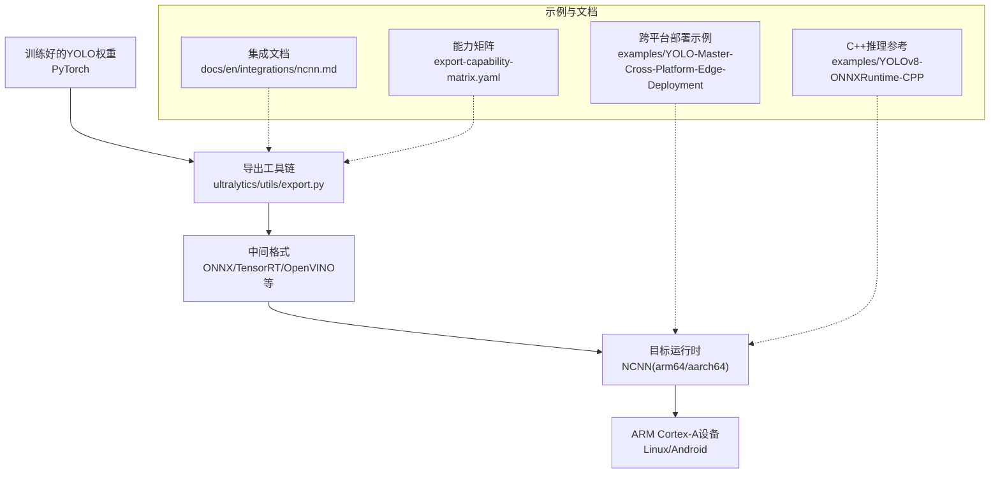
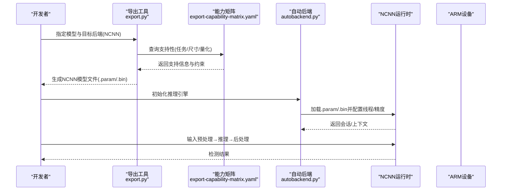
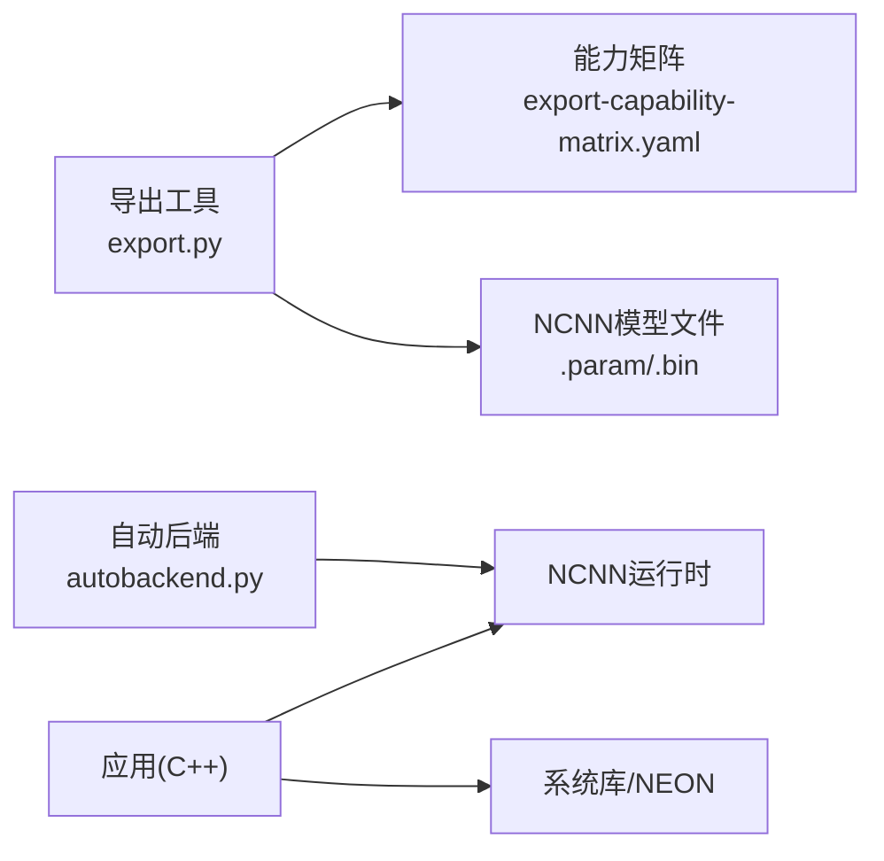

# NCNN边缘设备导出

<cite>
**本文引用的文件**
- [ncnn.md](file://docs/en/integrations/ncnn.md)
- [export-capability-matrix.yaml](file://ultralytics/cfg/export-capability-matrix.yaml)
- [export.py](file://ultralytics/utils/export.py)
- [autobackend.py](file://ultralytics/nn/autobackend.py)
- [README.md](file://examples/YOLO-Master-Cross-Platform-Edge-Deployment/README.md)
- [TECHNICAL_REPORT.md](file://examples/YOLO-Master-Cross-Platform-Edge-Deployment/TECHNICAL_REPORT.md)
- [CMakeLists.txt](file://examples/YOLO-Master-Cross-Platform-Edge-Deployment/cpp/CMakeLists.txt)
- [inference.cpp](file://examples/YOLOv8-ONNXRuntime-CPP/inference.cpp)
- [main.cpp](file://examples/YOLOv8-ONNXRuntime-CPP/main.cpp)
</cite>

## 目录
1. [简介](#简介)
2. [项目结构](#项目结构)
3. [核心组件](#核心组件)
4. [架构总览](#架构总览)
5. [详细组件分析](#详细组件分析)
6. [依赖分析](#依赖分析)
7. [性能考虑](#性能考虑)
8. [故障排查指南](#故障排查指南)
9. [结论](#结论)
10. [附录](#附录)

## 简介
本文件面向在ARM架构的边缘设备上部署YOLO模型的技术人员，聚焦于将YOLO模型转换为NCNN格式并在Cortex-A系列处理器上高效运行的完整流程。内容涵盖：
- NCNN导出的优化选项、算子支持与量化支持
- ARM Cortex-A部署环境要求与交叉编译方法（含NEON SIMD）
- 完整的C++示例路径，展示模型转换、加载与推理过程
- 内存限制处理、实时性能调优与热管理优化最佳实践
- NCNN框架的算子兼容性、量化支持与常见移植问题解决方案

## 项目结构
仓库中与NCNN相关的关键位置包括：
- 集成文档：docs/en/integrations/ncnn.md
- 导出能力矩阵：ultralytics/cfg/export-capability-matrix.yaml
- 导出入口与后端选择：ultralytics/utils/export.py、ultralytics/nn/autobackend.py
- 跨平台边缘部署示例：examples/YOLO-Master-Cross-Platform-Edge-Deployment/*
- C++推理参考实现（ONNX Runtime示例，可作为NCNN推理结构的对照）：examples/YOLOv8-ONNXRuntime-CPP/*

图表来源
- [export.py](file://ultralytics/utils/export.py)
- [autobackend.py](file://ultralytics/nn/autobackend.py)
- [ncnn.md](file://docs/en/integrations/ncnn.md)
- [export-capability-matrix.yaml](file://ultralytics/cfg/export-capability-matrix.yaml)
- [README.md](file://examples/YOLO-Master-Cross-Platform-Edge-Deployment/README.md)
- [TECHNICAL_REPORT.md](file://examples/YOLO-Master-Cross-Platform-Edge-Deployment/TECHNICAL_REPORT.md)
- [inference.cpp](file://examples/YOLOv8-ONNXRuntime-CPP/inference.cpp)
- [main.cpp](file://examples/YOLOv8-ONNXRuntime-CPP/main.cpp)

章节来源
- [ncnn.md](file://docs/en/integrations/ncnn.md)
- [export-capability-matrix.yaml](file://ultralytics/cfg/export-capability-matrix.yaml)
- [export.py](file://ultralytics/utils/export.py)
- [autobackend.py](file://ultralytics/nn/autobackend.py)
- [README.md](file://examples/YOLO-Master-Cross-Platform-Edge-Deployment/README.md)
- [TECHNICAL_REPORT.md](file://examples/YOLO-Master-Cross-Platform-Edge-Deployment/TECHNICAL_REPORT.md)
- [inference.cpp](file://examples/YOLOv8-ONNXRuntime-CPP/inference.cpp)
- [main.cpp](file://examples/YOLOv8-ONNXRuntime-CPP/main.cpp)

## 核心组件
- 导出能力矩阵：集中描述各后端（含NCNN）对任务、模型、输入尺寸、量化等的支持情况，用于快速评估可导出性与约束。
- 导出入口：统一封装导出逻辑，根据目标后端生成对应格式文件，并输出必要的元数据与校验信息。
- 自动后端选择：在推理阶段根据可用环境与模型格式选择最优后端（如NCNN、OpenVINO、TensorRT等）。
- 跨平台部署示例：提供CMake构建、交叉编译脚本与部署清单，便于在ARM设备上落地。
- C++推理参考：以ONNX Runtime为例，展示“加载模型→预处理→推理→后处理”的标准流水线，可作为NCNN实现的参照。

章节来源
- [export-capability-matrix.yaml](file://ultralytics/cfg/export-capability-matrix.yaml)
- [export.py](file://ultralytics/utils/export.py)
- [autobackend.py](file://ultralytics/nn/autobackend.py)
- [README.md](file://examples/YOLO-Master-Cross-Platform-Edge-Deployment/README.md)
- [TECHNICAL_REPORT.md](file://examples/YOLO-Master-Cross-Platform-Edge-Deployment/TECHNICAL_REPORT.md)
- [inference.cpp](file://examples/YOLOv8-ONNXRuntime-CPP/inference.cpp)
- [main.cpp](file://examples/YOLOv8-ONNXRuntime-CPP/main.cpp)

## 架构总览
下图展示了从训练到边缘部署的整体流程，以及NCNN在其中的角色。

图表来源
- [export.py](file://ultralytics/utils/export.py)
- [export-capability-matrix.yaml](file://ultralytics/cfg/export-capability-matrix.yaml)
- [autobackend.py](file://ultralytics/nn/autobackend.py)

## 详细组件分析

### 导出能力矩阵（NCNN）
- 作用：汇总NCNN对YOLO任务、模型变体、输入分辨率、动态形状、量化（INT8/FP16）的支持状态与已知限制。
- 使用方式：在导出前查阅该矩阵，确认目标场景是否受支持；若受限，调整模型或输入策略以满足约束。
- 关键维度：任务类型（检测/分割/姿态）、模型规模（s/m/l/x）、输入尺寸（固定/动态）、量化模式、NMS/后处理支持。

章节来源
- [export-capability-matrix.yaml](file://ultralytics/cfg/export-capability-matrix.yaml)

### 导出入口与后端选择
- 导出入口：统一调用导出流程，解析参数、执行图转换、写出目标格式文件，并输出日志与校验结果。
- 自动后端：在部署端根据设备能力与已导出模型选择最优后端；当NCNN可用时优先使用以提升ARM端性能。
- 典型流程：
  - 解析模型与导出参数
  - 检查能力矩阵与约束
  - 生成NCNN .param/.bin
  - 输出运行期所需元数据（类别数、输入尺寸、归一化参数等）

章节来源
- [export.py](file://ultralytics/utils/export.py)
- [autobackend.py](file://ultralytics/nn/autobackend.py)

### 跨平台边缘部署示例（ARM/Cortex-A）
- 构建系统：通过CMake组织源码与依赖，适配多平台（Linux/Android），并提供交叉编译配置。
- 部署清单：包含模型文件、配置文件、第三方库（NCNN）与运行脚本。
- 建议步骤：
  - 准备宿主机交叉编译工具链（aarch64-linux-gnu）
  - 编译NCNN并启用NEON/FPU优化
  - 使用CMake交叉编译应用二进制
  - 将模型与资源拷贝至设备并运行

章节来源
- [README.md](file://examples/YOLO-Master-Cross-Platform-Edge-Deployment/README.md)
- [TECHNICAL_REPORT.md](file://examples/YOLO-Master-Cross-Platform-Edge-Deployment/TECHNICAL_REPORT.md)
- [CMakeLists.txt](file://examples/YOLO-Master-Cross-Platform-Edge-Deployment/cpp/CMakeLists.txt)

### C++推理参考（ONNX Runtime）
- 目的：为NCNN推理提供标准流水线参考，包括模型加载、预处理、推理、后处理与可视化。
- 参考文件：
  - 推理核心：examples/YOLOv8-ONNXRuntime-CPP/inference.cpp
  - 主程序入口：examples/YOLOv8-ONNXRuntime-CPP/main.cpp
- 迁移要点：
  - 将ONNX Runtime的Session替换为NCNN的Net/Extractor
  - 保持输入预处理（缩放、归一化、通道顺序）一致
  - 后处理（NMS、坐标还原）尽量复用现有逻辑

章节来源
- [inference.cpp](file://examples/YOLOv8-ONNXRuntime-CPP/inference.cpp)
- [main.cpp](file://examples/YOLOv8-ONNXRuntime-CPP/main.cpp)

## 依赖分析
- 导出侧依赖：
  - 导出工具与能力矩阵：决定可导出范围与约束
  - 自动后端：在部署端进行运行时选择
- 部署侧依赖：
  - NCNN运行时（需针对ARM aarch64交叉编译）
  - 系统库（libstdc++、数学库、可选GPU/Vulkan加速）
  - 应用层C++代码（CMake构建）

图表来源
- [export.py](file://ultralytics/utils/export.py)
- [export-capability-matrix.yaml](file://ultralytics/cfg/export-capability-matrix.yaml)
- [autobackend.py](file://ultralytics/nn/autobackend.py)

章节来源
- [export.py](file://ultralytics/utils/export.py)
- [export-capability-matrix.yaml](file://ultralytics/cfg/export-capability-matrix.yaml)
- [autobackend.py](file://ultralytics/nn/autobackend.py)

## 性能考虑
- NEON SIMD优化：确保NCNN在交叉编译时开启ARM NEON与FPU指令集，以获得最佳CPU吞吐。
- 线程与批大小：根据设备核心数设置NCNN线程数；在视频流中合理控制批大小以平衡延迟与吞吐。
- 精度与量化：
  - FP16：在多数ARM CPU上可获得显著加速且精度损失可控
  - INT8：需要校准数据集与量化感知流程，适合极致功耗/体积场景
- 内存与缓存：
  - 预分配输入/输出缓冲区，避免频繁malloc/free
  - 使用内存池减少碎片，降低GC压力（若存在托管层）
- 实时性调优：
  - 降低输入分辨率或使用多尺度裁剪
  - 合并后处理（NMS）到NCNN自定义算子以减少拷贝
  - 预热模型与I/O管线，消除冷启动抖动
- 热管理：
  - 监控温度与频率，动态降频或降低帧率以避免过热降频
  - 在长时间运行场景下采用间歇推理或自适应帧率

[本节为通用指导，不直接分析具体文件]

## 故障排查指南
- 导出失败（不支持的算子/形状）：
  - 核对能力矩阵中的约束，必要时简化模型或固定输入尺寸
  - 查看导出日志，定位不支持的节点并进行等价替换
- 运行时崩溃（段错误/未定义行为）：
  - 检查NCNN版本与ARM ABI匹配（aarch64 vs armhf）
  - 确认模型文件完整性（.param/.bin成对且版本一致）
- 性能不达预期：
  - 确认NEON/FPU开关正确
  - 调整线程数与批大小，避免过度并行导致上下文切换开销
  - 对比FP16/INT8效果，选择合适的量化策略
- 内存不足：
  - 减小输入尺寸或批次
  - 释放不必要的中间缓冲，复用内存区域
  - 关闭调试日志与额外可视化

章节来源
- [export-capability-matrix.yaml](file://ultralytics/cfg/export-capability-matrix.yaml)
- [export.py](file://ultralytics/utils/export.py)
- [autobackend.py](file://ultralytics/nn/autobackend.py)

## 结论
通过将YOLO模型导出为NCNN格式，并结合ARM Cortex-A设备的NEON优化与合理的工程实践，可在边缘端实现高吞吐、低延迟的实时检测。建议在导出前充分评估能力矩阵约束，部署时严格遵循交叉编译与运行时配置规范，并通过量化与内存/线程调优达到目标性能与功耗平衡。

[本节为总结性内容，不直接分析具体文件]

## 附录

### ARM Cortex-A部署环境要求
- 操作系统：Linux（推荐Debian/Ubuntu或嵌入式发行版）或Android
- 架构：aarch64/arm64（部分设备支持armhf）
- 编译器：aarch64-linux-gnu-gcc/g++（宿主机交叉编译）
- 依赖：NCNN（启用NEON/FPU）、标准C++库、可选Vulkan/GPU驱动

章节来源
- [README.md](file://examples/YOLO-Master-Cross-Platform-Edge-Deployment/README.md)
- [TECHNICAL_REPORT.md](file://examples/YOLO-Master-Cross-Platform-Edge-Deployment/TECHNICAL_REPORT.md)
- [CMakeLists.txt](file://examples/YOLO-Master-Cross-Platform-Edge-Deployment/cpp/CMakeLists.txt)

### 交叉编译方法与NEON SIMD优化
- 安装交叉工具链：aarch64-linux-gnu-gcc/g++
- 编译NCNN：
  - 启用NEON与FPU优化选项
  - 按需开启多线程与SIMD加速
- 交叉编译应用：
  - 使用CMake指定交叉编译工具链文件
  - 链接NCNN静态/动态库，确保ABI一致
- 验证：
  - 在设备上运行基准测试，观察CPU利用率与温度
  - 对比不同线程数与精度的性能差异

章节来源
- [README.md](file://examples/YOLO-Master-Cross-Platform-Edge-Deployment/README.md)
- [TECHNICAL_REPORT.md](file://examples/YOLO-Master-Cross-Platform-Edge-Deployment/TECHNICAL_REPORT.md)
- [CMakeLists.txt](file://examples/YOLO-Master-Cross-Platform-Edge-Deployment/cpp/CMakeLists.txt)

### 模型转换、加载与推理的C++示例路径
- 转换（Python侧）：
  - 导出入口：[export.py](file://ultralytics/utils/export.py)
  - 能力矩阵：[export-capability-matrix.yaml](file://ultralytics/cfg/export-capability-matrix.yaml)
- 加载与推理（C++侧，参考ONNX Runtime示例）：
  - 推理核心：[inference.cpp](file://examples/YOLOv8-ONNXRuntime-CPP/inference.cpp)
  - 主程序入口：[main.cpp](file://examples/YOLOv8-ONNXRuntime-CPP/main.cpp)
- 跨平台构建：
  - CMake配置：[CMakeLists.txt](file://examples/YOLO-Master-Cross-Platform-Edge-Deployment/cpp/CMakeLists.txt)

章节来源
- [export.py](file://ultralytics/utils/export.py)
- [export-capability-matrix.yaml](file://ultralytics/cfg/export-capability-matrix.yaml)
- [inference.cpp](file://examples/YOLOv8-ONNXRuntime-CPP/inference.cpp)
- [main.cpp](file://examples/YOLOv8-ONNXRuntime-CPP/main.cpp)
- [CMakeLists.txt](file://examples/YOLO-Master-Cross-Platform-Edge-Deployment/cpp/CMakeLists.txt)

### NCNN算子兼容性与量化支持
- 算子兼容性：
  - 导出前依据能力矩阵确认目标模型所用算子在NCNN中的支持情况
  - 遇到不支持算子时，尝试等价替换或自定义扩展
- 量化支持：
  - FP16：广泛支持，易于启用，性能收益明显
  - INT8：需校准与量化流程，注意数值稳定性与精度回退
- 常见问题：
  - 动态形状受限：固定输入尺寸或采用分块推理
  - NMS后处理：可下沉至NCNN自定义算子或保留在宿主C++层

章节来源
- [export-capability-matrix.yaml](file://ultralytics/cfg/export-capability-matrix.yaml)
- [export.py](file://ultralytics/utils/export.py)