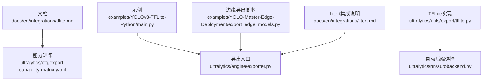
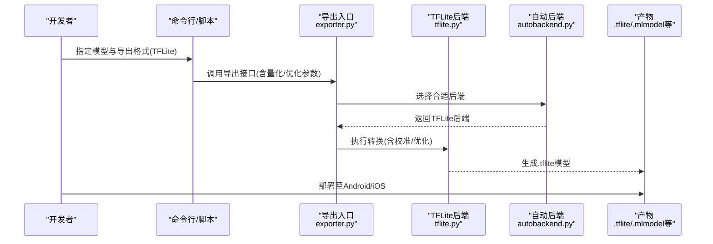
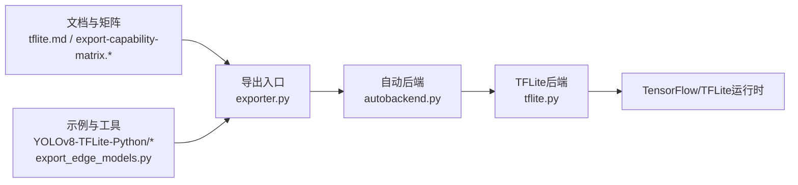

# TFLite移动端导出

<cite>
**本文引用的文件**
- [tflite.md](file://docs/en/integrations/tflite.md)
- [YOLOv8-TFLite-Python/README.md](file://examples/YOLOv8-TFLite-Python/README.md)
- [YOLOv8-TFLite-Python/main.py](file://examples/YOLOv8-TFLite-Python/main.py)
- [export_edge_models.py](file://examples/YOLO-Master-Edge-Deployment/export_edge_models.py)
- [edge_utils.py](file://examples/YOLO-Master-Edge-Deployment/edge_utils.py)
- [validate_edge_outputs.py](file://examples/YOLO-Master-Edge-Deployment/validate_edge_outputs.py)
- [export-capability-matrix.yaml](file://ultralytics/cfg/export-capability-matrix.yaml)
- [export-capability-matrix.md](file://docs/governance/export-capability-matrix.md)
- [exporter.py](file://ultralytics/engine/exporter.py)
- [autobackend.py](file://ultralytics/nn/autobackend.py)
- [tflite.py](file://ultralytics/utils/export/tflite.py)
- [litert.md](file://docs/en/integrations/litert.md)
</cite>

## 目录
1. [简介](#简介)
2. [项目结构](#项目结构)
3. [核心组件](#核心组件)
4. [架构总览](#架构总览)
5. [详细组件分析](#详细组件分析)
6. [依赖关系分析](#依赖关系分析)
7. [性能与功耗优化](#性能与功耗优化)
8. [故障排查指南](#故障排查指南)
9. [结论](#结论)
10. [附录](#附录)

## 简介
本技术文档聚焦于将 YOLO-Master 模型导出为 TensorFlow Lite（TFLite）格式，以在 Android 和 iOS 设备上部署推理。内容涵盖：
- 导出流程与关键参数（量化、优化器、性能调优）
- 移动端环境要求与集成方法（Android NDK、iOS Core ML/TFLite）
- GPU 加速配置与注意事项
- 完整的转换、加载与推理示例路径
- 内存优化、实时性能调优与功耗管理最佳实践
- TFLite 框架限制、兼容性与高版本迁移建议

## 项目结构
围绕 TFLite 导出的相关文件分布在文档、示例与源码三个层面：
- 文档层：TFLite 集成说明与能力矩阵
- 示例层：Python 端 TFLite 推理示例与边缘导出脚本
- 源码层：统一导出入口、后端自动选择与 TFLite 专用实现

图表来源
- [tflite.md](file://docs/en/integrations/tflite.md)
- [export-capability-matrix.yaml](file://ultralytics/cfg/export-capability-matrix.yaml)
- [YOLOv8-TFLite-Python/main.py](file://examples/YOLOv8-TFLite-Python/main.py)
- [export_edge_models.py](file://examples/YOLO-Master-Edge-Deployment/export_edge_models.py)
- [tflite.py](file://ultralytics/utils/export/tflite.py)
- [autobackend.py](file://ultralytics/nn/autobackend.py)
- [litert.md](file://docs/en/integrations/litert.md)

章节来源
- [tflite.md](file://docs/en/integrations/tflite.md)
- [export-capability-matrix.yaml](file://ultralytics/cfg/export-capability-matrix.yaml)
- [YOLOv8-TFLite-Python/README.md](file://examples/YOLOv8-TFLite-Python/README.md)
- [YOLOv8-TFLite-Python/main.py](file://examples/YOLOv8-TFLite-Python/main.py)
- [export_edge_models.py](file://examples/YOLO-Master-Edge-Deployment/export_edge_models.py)
- [edge_utils.py](file://examples/YOLO-Master-Edge-Deployment/edge_utils.py)
- [validate_edge_outputs.py](file://examples/YOLO-Master-Edge-Deployment/validate_edge_outputs.py)
- [export-capability-matrix.md](file://docs/governance/export-capability-matrix.md)
- [exporter.py](file://ultralytics/engine/exporter.py)
- [autobackend.py](file://ultralytics/nn/autobackend.py)
- [tflite.py](file://ultralytics/utils/export/tflite.py)
- [litert.md](file://docs/en/integrations/litert.md)

## 核心组件
- 统一导出入口：提供跨后端的导出能力，包括 TFLite；负责参数解析、预检、调用具体后端实现并生成产物。
- TFLite 后端实现：封装 TensorFlow/TFLite 的转换逻辑，支持量化与优化选项。
- 自动后端选择：根据目标平台与可用运行时，选择合适的执行后端。
- 能力矩阵：定义各任务/模型对导出格式的支持情况，便于快速判断可行性。
- 示例与工具：包含 Python 端 TFLite 推理示例与边缘导出脚本，辅助验证与集成。

章节来源
- [exporter.py](file://ultralytics/engine/exporter.py)
- [tflite.py](file://ultralytics/utils/export/tflite.py)
- [autobackend.py](file://ultralytics/nn/autobackend.py)
- [export-capability-matrix.yaml](file://ultralytics/cfg/export-capability-matrix.yaml)
- [export-capability-matrix.md](file://docs/governance/export-capability-matrix.md)
- [YOLOv8-TFLite-Python/main.py](file://examples/YOLOv8-TFLite-Python/main.py)
- [export_edge_models.py](file://examples/YOLO-Master-Edge-Deployment/export_edge_models.py)
- [edge_utils.py](file://examples/YOLO-Master-Edge-Deployment/edge_utils.py)
- [validate_edge_outputs.py](file://examples/YOLO-Master-Edge-Deployment/validate_edge_outputs.py)

## 架构总览
下图展示了从训练权重到移动端可执行模型的端到端流程，以及关键组件间的交互。

图表来源
- [exporter.py](file://ultralytics/engine/exporter.py)
- [tflite.py](file://ultralytics/utils/export/tflite.py)
- [autobackend.py](file://ultralytics/nn/autobackend.py)

## 详细组件分析

### 导出入口与后端选择
- 职责
  - 接收导出请求（格式、精度、优化开关）
  - 预检查（模型兼容性、依赖可用性）
  - 路由到具体后端（如 TFLite）
  - 输出产物与元数据
- 关键点
  - 参数校验与默认值策略
  - 多后端共存时的优先级与回退机制
  - 日志与错误信息规范化

章节来源
- [exporter.py](file://ultralytics/engine/exporter.py)
- [autobackend.py](file://ultralytics/nn/autobackend.py)

### TFLite 后端实现
- 职责
  - 将 PyTorch/ONNX/SavedModel 转换为 .tflite
  - 支持量化（INT8、FP16）与图优化
  - 处理动态形状与输入约束
- 关键点
  - 量化：需要校准数据集或代表集；注意算子支持与数值稳定性
  - FP16：减少体积与带宽占用，需设备支持
  - 优化：常量折叠、算子融合、死代码消除等
  - 输入/输出张量类型与维度对齐

章节来源
- [tflite.py](file://ultralytics/utils/export/tflite.py)
- [tflite.md](file://docs/en/integrations/tflite.md)

### 能力矩阵与兼容性
- 作用
  - 明确不同任务/模型对 TFLite 的支持范围
  - 指导导出前可行性评估
- 使用方式
  - 通过配置文件或治理文档查询支持矩阵
  - 结合导出预检结果进行决策

章节来源
- [export-capability-matrix.yaml](file://ultralytics/cfg/export-capability-matrix.yaml)
- [export-capability-matrix.md](file://docs/governance/export-capability-matrix.md)

### 示例与工具链
- Python 端 TFLite 推理示例
  - 展示如何加载 .tflite、预处理输入、运行推理与后处理
  - 适用于快速验证与本地调试
- 边缘导出脚本
  - 批量导出多种格式，便于对比与回归测试
  - 集成验证脚本，确保导出前后一致性
- 工具函数
  - 通用预处理/后处理、IO 工具、可视化辅助

章节来源
- [YOLOv8-TFLite-Python/README.md](file://examples/YOLOv8-TFLite-Python/README.md)
- [YOLOv8-TFLite-Python/main.py](file://examples/YOLOv8-TFLite-Python/main.py)
- [export_edge_models.py](file://examples/YOLO-Master-Edge-Deployment/export_edge_models.py)
- [edge_utils.py](file://examples/YOLO-Master-Edge-Deployment/edge_utils.py)
- [validate_edge_outputs.py](file://examples/YOLO-Master-Edge-Deployment/validate_edge_outputs.py)

### Litert 集成说明
- 作用
  - 介绍 litert 作为 TFLite 的轻量级绑定/包装方案
  - 提供在 Python 环境中更便捷的调用方式
- 适用场景
  - 快速原型验证
  - 与现有 Python 工作流集成

章节来源
- [litert.md](file://docs/en/integrations/litert.md)

## 依赖关系分析
- 组件耦合
  - 导出入口依赖自动后端选择与具体后端实现
  - TFLite 后端依赖 TensorFlow/TFLite 运行时与相关工具链
- 外部依赖
  - TensorFlow/TFLite 版本与算子支持
  - 设备端运行时（Android NNAPI、iOS Core ML/TFLite Runtime）
- 潜在循环依赖
  - 通过分层设计避免：入口层不直接依赖后端细节

图表来源
- [exporter.py](file://ultralytics/engine/exporter.py)
- [autobackend.py](file://ultralytics/nn/autobackend.py)
- [tflite.py](file://ultralytics/utils/export/tflite.py)
- [tflite.md](file://docs/en/integrations/tflite.md)
- [export-capability-matrix.yaml](file://ultralytics/cfg/export-capability-matrix.yaml)
- [YOLOv8-TFLite-Python/main.py](file://examples/YOLOv8-TFLite-Python/main.py)
- [export_edge_models.py](file://examples/YOLO-Master-Edge-Deployment/export_edge_models.py)

章节来源
- [exporter.py](file://ultralytics/engine/exporter.py)
- [autobackend.py](file://ultralytics/nn/autobackend.py)
- [tflite.py](file://ultralytics/utils/export/tflite.py)
- [tflite.md](file://docs/en/integrations/tflite.md)
- [export-capability-matrix.yaml](file://ultralytics/cfg/export-capability-matrix.yaml)
- [YOLOv8-TFLite-Python/main.py](file://examples/YOLOv8-TFLite-Python/main.py)
- [export_edge_models.py](file://examples/YOLO-Master-Edge-Deployment/export_edge_models.py)

## 性能与功耗优化
- 量化策略
  - INT8：显著减小模型体积与内存占用，提升吞吐；需准备代表性校准数据，关注精度损失与异常值处理
  - FP16：降低带宽与内存压力，适合支持半精度的设备；精度保持较好，体积适中
- 优化器与图优化
  - 常量折叠、算子融合、死代码消除、输入形状固定化
  - 针对移动端常见算子启用特定优化路径
- 运行时与硬件加速
  - Android：优先启用 NNAPI/GPU Delegate；合理设置线程数与批大小
  - iOS：优先使用 Core ML 或 Metal Performance Shaders；必要时回退 CPU
- 内存与实时性
  - 控制输入分辨率与批大小；复用缓冲区；避免频繁分配
  - 流水线并行：采集-预处理-推理-后处理解耦
- 功耗管理
  - 动态调整帧率与分辨率；利用设备空闲时批量处理
  - 监控温度与功耗，触发降频策略

[本节为通用指导，无需列出具体文件来源]

## 故障排查指南
- 导出失败
  - 检查模型是否被能力矩阵支持
  - 确认 TensorFlow/TFLite 版本与算子兼容性
  - 查看导出预检与日志定位问题
- 量化精度下降
  - 扩大校准集覆盖度；检查极端值与分布偏移
  - 尝试混合精度或回退到 FP16
- 运行时崩溃或卡顿
  - 核对输入维度与数据类型
  - 关闭不必要的优化或降级到 CPU 验证
  - 检查设备驱动与运行时版本
- 回归不一致
  - 使用验证脚本对比导出前后输出差异
  - 固定随机种子与预处理流程

章节来源
- [export-capability-matrix.md](file://docs/governance/export-capability-matrix.md)
- [validate_edge_outputs.py](file://examples/YOLO-Master-Edge-Deployment/validate_edge_outputs.py)
- [YOLOv8-TFLite-Python/main.py](file://examples/YOLOv8-TFLite-Python/main.py)

## 结论
通过将 YOLO-Master 导出为 TFLite，可在 Android 与 iOS 设备上获得良好的推理效率与资源占用表现。建议在导出前依据能力矩阵进行可行性评估，选择合适的量化与优化策略，并在设备端结合硬件加速与运行时调参以获得最佳性能与功耗平衡。遇到兼容性问题时，优先参考文档与示例，逐步缩小问题范围并进行回归验证。

[本节为总结性内容，无需列出具体文件来源]

## 附录
- 完整示例路径
  - Python 端 TFLite 推理示例：[YOLOv8-TFLite-Python/main.py](file://examples/YOLOv8-TFLite-Python/main.py)
  - 边缘导出脚本与验证：[export_edge_models.py](file://examples/YOLO-Master-Edge-Deployment/export_edge_models.py)、[validate_edge_outputs.py](file://examples/YOLO-Master-Edge-Deployment/validate_edge_outputs.py)
- 文档与规范
  - TFLite 集成说明：[tflite.md](file://docs/en/integrations/tflite.md)
  - 能力矩阵（配置与文档）：[export-capability-matrix.yaml](file://ultralytics/cfg/export-capability-matrix.yaml)、[export-capability-matrix.md](file://docs/governance/export-capability-matrix.md)
  - Litert 集成说明：[litert.md](file://docs/en/integrations/litert.md)
- 源码实现
  - 导出入口与自动后端：[exporter.py](file://ultralytics/engine/exporter.py)、[autobackend.py](file://ultralytics/nn/autobackend.py)
  - TFLite 后端实现：[tflite.py](file://ultralytics/utils/export/tflite.py)