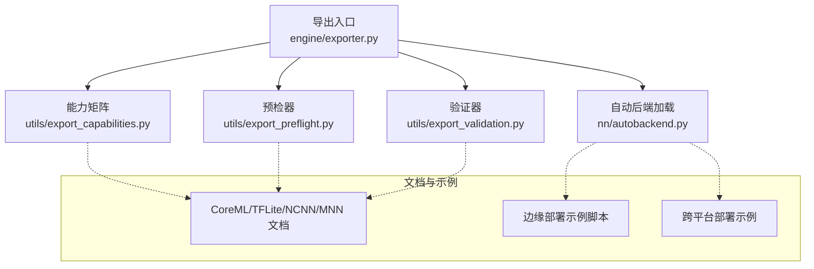
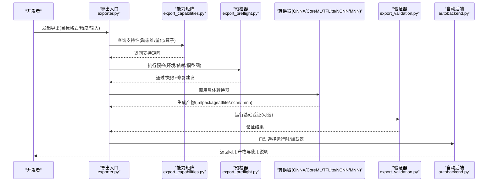
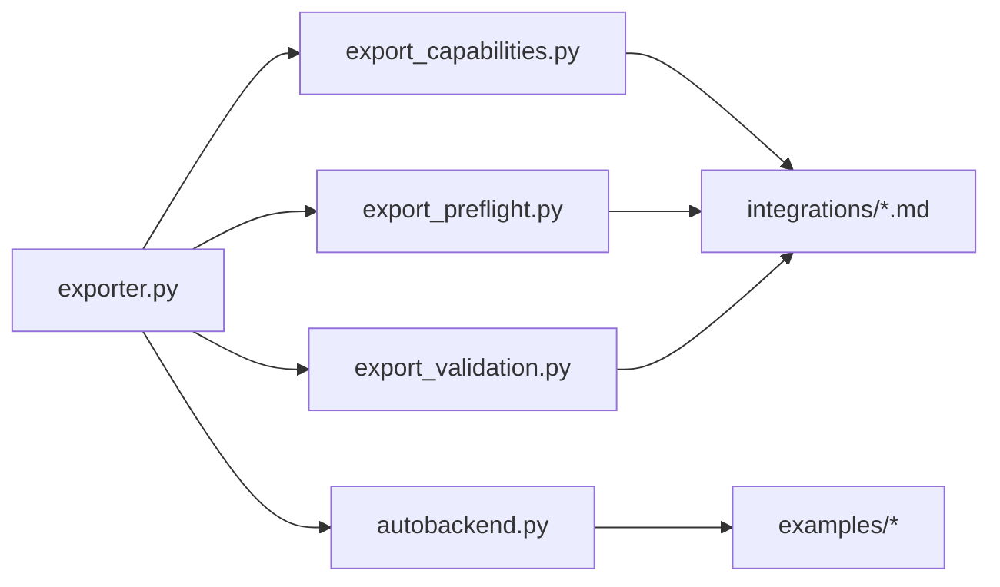

# 移动端和边缘设备导出

<cite>
**本文引用的文件**
- [exporter.py](file://ultralytics/engine/exporter.py)
- [autobackend.py](file://ultralytics/nn/autobackend.py)
- [export_capabilities.py](file://ultralytics/utils/export_capabilities.py)
- [export_preflight.py](file://ultralytics/utils/export_preflight.py)
- [export_validation.py](file://ultralytics/utils/export_validation.py)
- [coreml.md](file://docs/en/integrations/coreml.md)
- [tflite.md](file://docs/en/integrations/tflite.md)
- [ncnn.md](file://docs/en/integrations/ncnn.md)
- [mnn.md](file://docs/en/integrations/mnn.md)
- [model-deployment-options.md](file://docs/en/guides/model-deployment-options.md)
- [model-deployment-practices.md](file://docs/en/guides/model-deployment-practices.md)
- [edge_utils.py](file://examples/YOLO-Master-Edge-Deployment/edge_utils.py)
- [export_edge_models.py](file://examples/YOLO-Master-Edge-Deployment/export_edge_models.py)
- [validate_edge_outputs.py](file://examples/YOLO-Master-Edge-Deployment/validate_edge_outputs.py)
- [README.md](file://examples/YOLO-Master-Cross-Platform-Edge-Deployment/README.md)
- [TECHNICAL_REPORT.md](file://examples/YOLO-Master-Cross-Platform-Edge-Deployment/TECHNICAL_REPORT.md)
- [test_export_capability_matrix.py](file://tests/test_export_capability_matrix.py)
- [test_export_preflight.py](file://tests/test_export_preflight.py)
- [test_export_roundtrip.py](file://tests/test_export_roundtrip.py)
</cite>

## 目录
1. [简介](#简介)
2. [项目结构](#项目结构)
3. [核心组件](#核心组件)
4. [架构总览](#架构总览)
5. [详细组件分析](#详细组件分析)
6. [依赖关系分析](#依赖关系分析)
7. [性能与优化](#性能与优化)
8. [故障排查指南](#故障排查指南)
9. [结论](#结论)
10. [附录](#附录)

## 简介
本技术文档聚焦于 YOLO-Master 的移动端与边缘设备模型导出能力，覆盖 CoreML（iOS）、TFLite（Android）、NCNN、MNN 等主流移动框架的导出流程、量化与压缩策略、内存优化方法、部署要求与性能调优、跨平台兼容性检查与测试方法，以及推理引擎集成、实时性能与电池使用优化的最佳实践。同时总结各框架的限制条件与替代方案，帮助读者在不同目标平台上选择最优路径并落地生产。

## 项目结构
本项目在导出链路中采用“统一导出入口 + 多后端适配”的架构：
- 统一导出入口位于引擎层，负责参数校验、预检、格式转换与产物输出。
- 导出能力矩阵与预检逻辑集中在工具层，用于快速判断某模型在某后端是否可导出及约束。
- 验证与回归测试覆盖导出前后一致性、能力矩阵正确性与预检行为。
- 示例工程提供端到端脚本与跨平台部署参考实现。

图表来源
- [exporter.py:1-200](file://ultralytics/engine/exporter.py#L1-200)
- [export_capabilities.py:1-200](file://ultralytics/utils/export_capabilities.py#L1-200)
- [export_preflight.py:1-200](file://ultralytics/utils/export_preflight.py#L1-200)
- [export_validation.py:1-200](file://ultralytics/utils/export_validation.py#L1-200)
- [autobackend.py:1-200](file://ultralytics/nn/autobackend.py#L1-200)
- [coreml.md:1-200](file://docs/en/integrations/coreml.md#L1-L200)
- [tflite.md:1-200](file://docs/en/integrations/tflite.md#L1-L200)
- [ncnn.md:1-200](file://docs/en/integrations/ncnn.md#L1-L200)
- [mnn.md:1-200](file://docs/en/integrations/mnn.md#L1-L200)
- [edge_utils.py:1-200](file://examples/YOLO-Master-Edge-Deployment/edge_utils.py#L1-L200)
- [export_edge_models.py:1-200](file://examples/YOLO-Master-Edge-Deployment/export_edge_models.py#L1-L200)
- [README.md:1-200](file://examples/YOLO-Master-Cross-Platform-Edge-Deployment/README.md#L1-L200)

章节来源
- [exporter.py:1-200](file://ultralytics/engine/exporter.py#L1-L200)
- [export_capabilities.py:1-200](file://ultralytics/utils/export_capabilities.py#L1-L200)
- [export_preflight.py:1-200](file://ultralytics/utils/export_preflight.py#L1-L200)
- [export_validation.py:1-200](file://ultralytics/utils/export_validation.py#L1-L200)
- [autobackend.py:1-200](file://ultralytics/nn/autobackend.py#L1-L200)
- [coreml.md:1-200](file://docs/en/integrations/coreml.md#L1-L200)
- [tflite.md:1-200](file://docs/en/integrations/tflite.md#L1-L200)
- [ncnn.md:1-200](file://docs/en/integrations/ncnn.md#L1-L200)
- [mnn.md:1-200](file://docs/en/integrations/mnn.md#L1-L200)
- [edge_utils.py:1-200](file://examples/YOLO-Master-Edge-Deployment/edge_utils.py#L1-L200)
- [export_edge_models.py:1-200](file://examples/YOLO-Master-Edge-Deployment/export_edge_models.py#L1-L200)
- [README.md:1-200](file://examples/YOLO-Master-Cross-Platform-Edge-Deployment/README.md#L1-L200)

## 核心组件
- 导出入口（engine/exporter.py）
  - 职责：接收导出任务（目标格式、精度、输入形状、动态维度等），协调预检、转换、后处理与产物落盘；封装不同后端的差异化参数。
  - 关键点：统一接口、错误聚合、日志与进度回调、产物命名与路径管理。
- 能力矩阵（utils/export_capabilities.py）
  - 职责：维护“模型类型 × 导出格式 × 特性支持”的映射，如动态尺寸、量化、特定算子支持情况。
  - 关键点：版本化、可扩展注册表、查询接口。
- 预检器（utils/export_preflight.py）
  - 职责：在导出前进行环境、依赖、模型图、算子与配置合法性检查，提前拦截不可导出场景。
  - 关键点：失败原因分类、修复建议、最小复现提示。
- 验证器（utils/export_validation.py）
  - 职责：对导出产物进行基本完整性与数值一致性校验（可选），辅助定位问题。
  - 关键点：容差阈值、对比基准、断言与报告。
- 自动后端加载（nn/autobackend.py）
  - 职责：根据目标平台与产物自动选择运行时与加载方式，屏蔽差异。
  - 关键点：运行时探测、缓存、降级策略。

章节来源
- [exporter.py:1-200](file://ultralytics/engine/exporter.py#L1-L200)
- [export_capabilities.py:1-200](file://ultralytics/utils/export_capabilities.py#L1-L200)
- [export_preflight.py:1-200](file://ultralytics/utils/export_preflight.py#L1-L200)
- [export_validation.py:1-200](file://ultralytics/utils/export_validation.py#L1-L200)
- [autobackend.py:1-200](file://ultralytics/nn/autobackend.py#L1-L200)

## 架构总览
下图展示从训练好的 PyTorch 模型到移动端/边缘产物的整体流程，包括预检、转换、量化与验证环节。

图表来源
- [exporter.py:1-200](file://ultralytics/engine/exporter.py#L1-L200)
- [export_capabilities.py:1-200](file://ultralytics/utils/export_capabilities.py#L1-L200)
- [export_preflight.py:1-200](file://ultralytics/utils/export_preflight.py#L1-L200)
- [export_validation.py:1-200](file://ultralytics/utils/export_validation.py#L1-L200)
- [autobackend.py:1-200](file://ultralytics/nn/autobackend.py#L1-L200)

## 详细组件分析

### 导出入口与流程控制（engine/exporter.py）
- 设计要点
  - 统一 API：以目标格式为驱动，内部路由至对应转换器。
  - 参数标准化：将用户参数转换为各后端所需的最小必要集。
  - 错误处理：捕获并归类异常，输出可读的诊断信息。
  - 产物管理：统一命名规则、目录结构与元数据写入。
- 关键流程
  - 解析参数 → 查询能力矩阵 → 预检 → 转换 → 验证 → 产物归档。
- 扩展点
  - 新增后端时，仅需在能力矩阵与转换器路由处注册即可复用通用流程。

章节来源
- [exporter.py:1-200](file://ultralytics/engine/exporter.py#L1-L200)

### 能力矩阵与兼容性（utils/export_capabilities.py）
- 设计要点
  - 结构化记录：模型族、任务类型、导出格式、特性开关（动态尺寸、量化、NMS 变体）。
  - 查询接口：按“模型×格式×特性”快速判定是否支持。
  - 演进策略：向后兼容、弃用标记、迁移指引。
- 典型用法
  - 导出前快速过滤不可行组合，避免无效转换。
  - 为文档与 UI 提供“支持度矩阵”数据来源。

章节来源
- [export_capabilities.py:1-200](file://ultralytics/utils/export_capabilities.py#L1-L200)

### 预检器（utils/export_preflight.py）
- 设计要点
  - 环境检查：Python/编译器/SDK 版本、第三方库可用性。
  - 模型检查：输入形状、动态维度、算子覆盖、权重格式。
  - 配置检查：导出选项冲突、不兼容组合。
- 输出
  - 通过/失败状态、失败原因分类、修复建议与最小改动清单。

章节来源
- [export_preflight.py:1-200](file://ultralytics/utils/export_preflight.py#L1-L200)

### 验证器（utils/export_validation.py）
- 设计要点
  - 完整性检查：文件存在、大小范围、元数据字段。
  - 数值一致性：与源模型或中间产物对比，设置合理容差。
  - 报告：汇总通过项与失败项，便于 CI 集成。

章节来源
- [export_validation.py:1-200](file://ultralytics/utils/export_validation.py#L1-L200)

### 自动后端加载（nn/autobackend.py）
- 设计要点
  - 运行时探测：识别目标平台（iOS/Android/Linux/ARM/x86）与可用加速库。
  - 加载策略：优先原生运行时，回退到通用解释器。
  - 资源管理：会话生命周期、内存池、线程数与并行度。

章节来源
- [autobackend.py:1-200](file://ultralytics/nn/autobackend.py#L1-L200)

### 移动端与边缘框架导出详解

#### CoreML（iOS）
- 导出流程
  - 通过导出入口指定目标为 CoreML，内部调用相应转换器生成 .mlpackage。
  - 可在导出前启用量化与静态 shape 以优化 iOS 设备推理。
- 优化策略
  - 量化：INT8/FP16 按需开启，结合校准集提升精度保持。
  - 静态输入：固定分辨率减少运行时开销。
  - NMS 融合：尽量在导出阶段融合以提升吞吐。
- 部署要求
  - Xcode 与 Core ML Tools 版本匹配；iOS 最低版本需满足运行时要求。
- 限制与替代
  - 若遇到不支持算子，考虑 ONNX 中转或替换算子；必要时回退至 TFLite/NCNN。

章节来源
- [coreml.md:1-200](file://docs/en/integrations/coreml.md#L1-L200)
- [exporter.py:1-200](file://ultralytics/engine/exporter.py#L1-L200)

#### TFLite（Android/iOS）
- 导出流程
  - 导出入口选择 TFLite，生成 .tflite 模型；可配合 TensorFlow Lite Converter 完成量化。
- 优化策略
  - 量化：Post-training Quantization（PTQ）或 QAT；优先 INT8，必要时混合精度。
  - 算子白名单：确保所有节点在目标设备上受支持。
  - 输入优化：固定输入尺寸、批量推理。
- 部署要求
  - Android：TensorFlow Lite 运行时；iOS：Core ML 桥接或 TFLite Swift/C++ 运行时。
- 限制与替代
  - 某些自定义算子受限，可尝试 ONNX→TFLite 或改用 NCNN/MNN。

章节来源
- [tflite.md:1-200](file://docs/en/integrations/tflite.md#L1-L200)
- [exporter.py:1-200](file://ultralytics/engine/exporter.py#L1-L200)

#### NCNN（Android/iOS/Linux ARM）
- 导出流程
  - 通过导出入口选择 NCNN，通常经 ONNX 中转生成 ncnn 模型与参数文件。
- 优化策略
  - 量化：INT8 量化与 FP16 混合；利用 NCNN 的算子优化内核。
  - 内存：关闭不必要中间缓冲，调整线程数与内存池。
- 部署要求
  - 交叉编译 NCNN 库；链接目标平台 ABI；注意 SIMD 指令集。
- 限制与替代
  - 若算子缺失，考虑替换或回退至 MNN/TFLite。

章节来源
- [ncnn.md:1-200](file://docs/en/integrations/ncnn.md#L1-L200)
- [exporter.py:1-200](file://ultralytics/engine/exporter.py#L1-L200)

#### MNN（Android/iOS/Linux）
- 导出流程
  - 导出入口选择 MNN，生成 .mnn 模型；可结合 MNN 量化工具链。
- 优化策略
  - 量化：PTQ/QAT；针对 ARM NEON 优化。
  - 图优化：常量折叠、算子融合、死代码消除。
- 部署要求
  - 集成 MNN Runtime；配置线程与内存池；注意平台 ABI。
- 限制与替代
  - 部分新算子支持滞后，可回退至 NCNN/TFLite。

章节来源
- [mnn.md:1-200](file://docs/en/integrations/mnn.md#L1-L200)
- [exporter.py:1-200](file://ultralytics/engine/exporter.py#L1-L200)

### 端到端示例与脚本
- 边缘导出脚本（examples/YOLO-Master-Edge-Deployment）
  - 提供批量导出、参数化配置与自动化验证脚本，适合 CI 流水线。
- 跨平台部署示例（examples/YOLO-Master-Cross-Platform-Edge-Deployment）
  - 包含多平台 README 与技术报告，涵盖构建、部署与性能基线。

章节来源
- [export_edge_models.py:1-200](file://examples/YOLO-Master-Edge-Deployment/export_edge_models.py#L1-L200)
- [edge_utils.py:1-200](file://examples/YOLO-Master-Edge-Deployment/edge_utils.py#L1-L200)
- [README.md:1-200](file://examples/YOLO-Master-Cross-Platform-Edge-Deployment/README.md#L1-L200)
- [TECHNICAL_REPORT.md:1-200](file://examples/YOLO-Master-Cross-Platform-Edge-Deployment/TECHNICAL_REPORT.md#L1-L200)

## 依赖关系分析
导出子系统的关键依赖如下：
- exporter.py 作为编排者，依赖 export_capabilities.py、export_preflight.py、export_validation.py 与 nn/autobackend.py。
- 文档与示例提供平台特定的约束与最佳实践，指导导出参数选择。

图表来源
- [exporter.py:1-200](file://ultralytics/engine/exporter.py#L1-L200)
- [export_capabilities.py:1-200](file://ultralytics/utils/export_capabilities.py#L1-L200)
- [export_preflight.py:1-200](file://ultralytics/utils/export_preflight.py#L1-L200)
- [export_validation.py:1-200](file://ultralytics/utils/export_validation.py#L1-L200)
- [autobackend.py:1-200](file://ultralytics/nn/autobackend.py#L1-L200)
- [coreml.md:1-200](file://docs/en/integrations/coreml.md#L1-L200)
- [tflite.md:1-200](file://docs/en/integrations/tflite.md#L1-L200)
- [ncnn.md:1-200](file://docs/en/integrations/ncnn.md#L1-L200)
- [mnn.md:1-200](file://docs/en/integrations/mnn.md#L1-L200)

章节来源
- [exporter.py:1-200](file://ultralytics/engine/exporter.py#L1-L200)
- [export_capabilities.py:1-200](file://ultralytics/utils/export_capabilities.py#L1-L200)
- [export_preflight.py:1-200](file://ultralytics/utils/export_preflight.py#L1-L200)
- [export_validation.py:1-200](file://ultralytics/utils/export_validation.py#L1-L200)
- [autobackend.py:1-200](file://ultralytics/nn/autobackend.py#L1-L200)

## 性能与优化
- 量化与压缩
  - PTQ/QAT：优先 INT8，必要时混合精度；校准集需覆盖真实分布。
  - 权重压缩：稀疏化与剪枝可与量化联合使用，但需评估精度损失。
- 内存优化
  - 固定输入尺寸、减少动态分支；合并中间张量；合理设置线程与内存池。
- 实时推理
  - 批处理与流水线并行；NMS 融合与后处理 GPU/NEON 加速。
- 电池优化
  - 降低频率与线程数；减少唤醒次数；按需加载模型与预热。
- 平台调优
  - iOS：Core ML 模型优化与 Metal 加速；Android：TFLite NNAPI/Hexagon/NPU；ARM：NCNN/MNN 的 SIMD 优化。

章节来源
- [model-deployment-options.md:1-200](file://docs/en/guides/model-deployment-options.md#L1-L200)
- [model-deployment-practices.md:1-200](file://docs/en/guides/model-deployment-practices.md#L1-L200)

## 故障排查指南
- 常见问题定位
  - 预检失败：检查环境依赖、模型图与导出参数冲突。
  - 转换失败：查看不支持算子列表，尝试替换或回退格式。
  - 精度下降：调整量化策略、校准集与容差阈值。
- 诊断与回归
  - 使用验证器输出对比报告；在 CI 中固化基线与阈值。
- 相关测试
  - 能力矩阵测试、预检行为测试、导出往返一致性测试。

章节来源
- [export_preflight.py:1-200](file://ultralytics/utils/export_preflight.py#L1-L200)
- [export_validation.py:1-200](file://ultralytics/utils/export_validation.py#L1-L200)
- [test_export_capability_matrix.py:1-200](file://tests/test_export_capability_matrix.py#L1-L200)
- [test_export_preflight.py:1-200](file://tests/test_export_preflight.py#L1-L200)
- [test_export_roundtrip.py:1-200](file://tests/test_export_roundtrip.py#L1-L200)

## 结论
YOLO-Master 的导出子系统以统一的入口与清晰的职责划分，实现了面向多移动/边缘平台的稳定导出能力。借助能力矩阵与预检机制，可在早期规避不可行方案；通过量化、内存与运行时优化，能在资源受限设备上获得良好性能与能效。建议在工程中持续完善能力矩阵、强化端到端验证，并结合平台特性进行针对性调优。

## 附录
- 快速开始
  - 使用导出入口指定目标格式与参数，运行预检与转换，随后在目标平台加载推理。
- 推荐工作流
  - 离线导出 → 预检与验证 → 平台打包 → 设备基准测试 → 回归与发布。