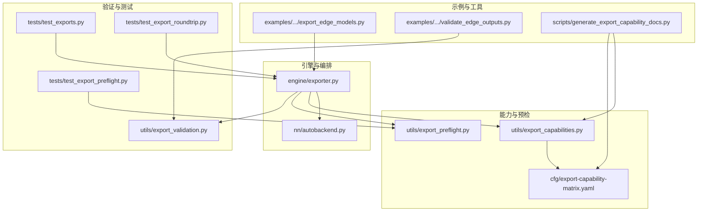
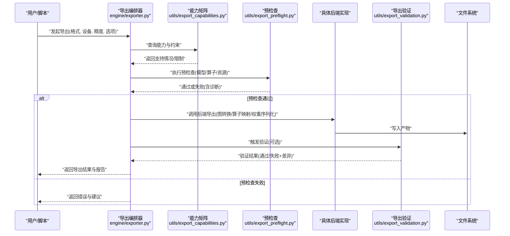
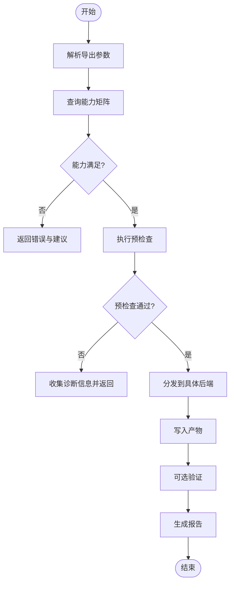
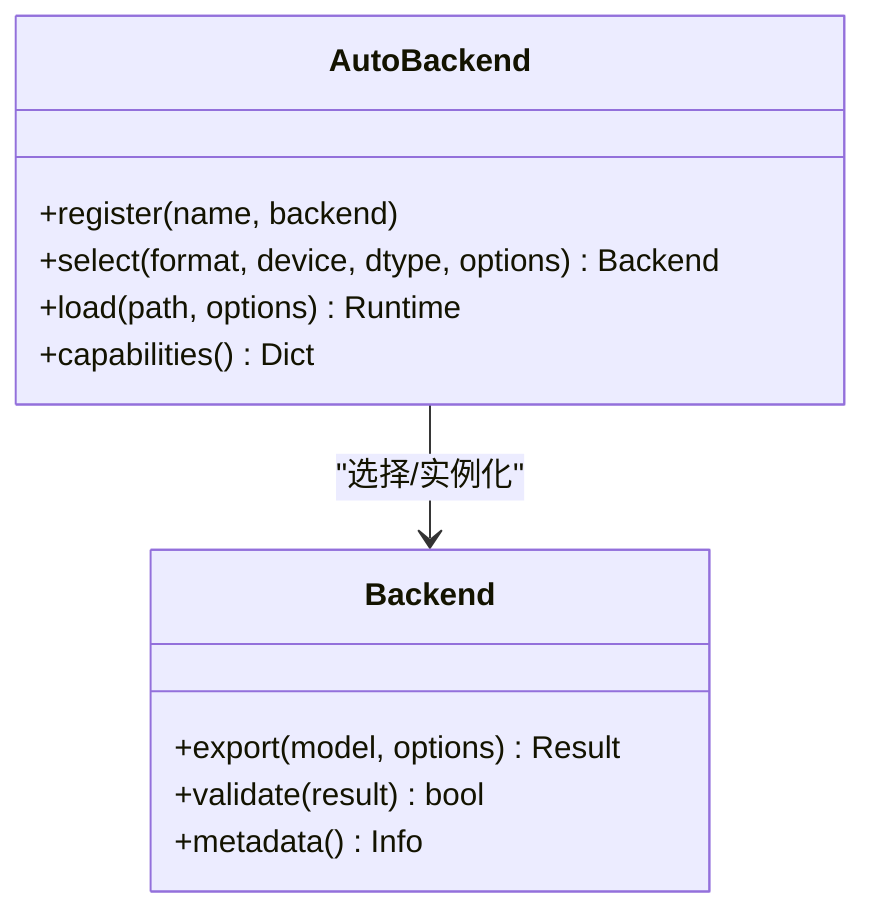
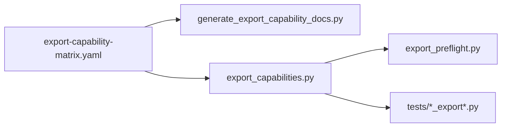
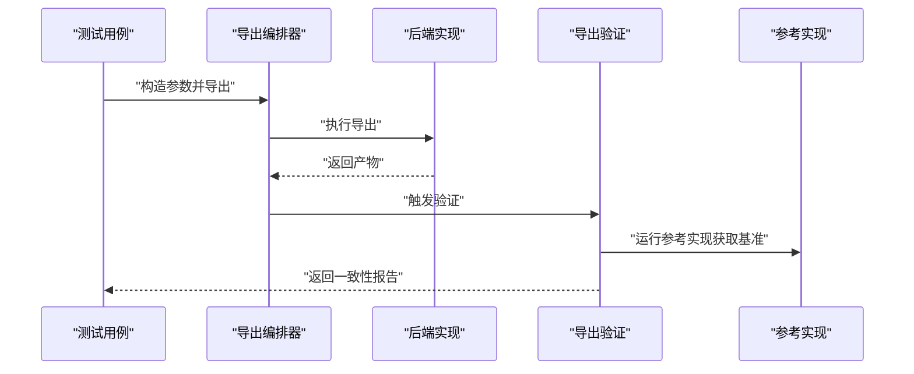
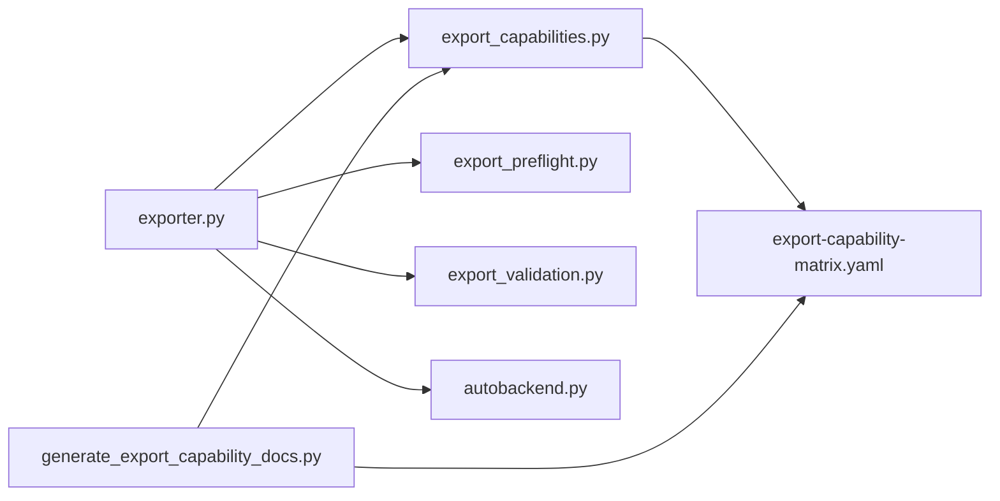

# 自定义导出后端开发

<cite>
**本文引用的文件**
- [exporter.py](file://ultralytics/engine/exporter.py)
- [autobackend.py](file://ultralytics/nn/autobackend.py)
- [export_validation.py](file://ultralytics/utils/export_validation.py)
- [export_preflight.py](file://ultralytics/utils/export_preflight.py)
- [export_capabilities.py](file://ultralytics/utils/export_capabilities.py)
- [test_export_roundtrip.py](file://tests/test_export_roundtrip.py)
- [test_export_preflight.py](file://tests/test_export_preflight.py)
- [test_exports.py](file://tests/test_exports.py)
- [export-capability-matrix.yaml](file://ultralytics/cfg/export-capability-matrix.yaml)
- [generate_export_capability_docs.py](file://scripts/generate_export_capability_docs.py)
- [export_edge_models.py](file://examples/YOLO-Master-Edge-Deployment/export_edge_models.py)
- [validate_edge_outputs.py](file://examples/YOLO-Master-Edge-Deployment/validate_edge_outputs.py)
</cite>

## 目录
1. [简介](#简介)
2. [项目结构](#项目结构)
3. [核心组件](#核心组件)
4. [架构总览](#架构总览)
5. [详细组件分析](#详细组件分析)
6. [依赖关系分析](#依赖关系分析)
7. [性能考量](#性能考量)
8. [故障排查指南](#故障排查指南)
9. [结论](#结论)
10. [附录](#附录)

## 简介
本技术文档面向希望在 YOLO-Master 中实现“自定义导出后端”的开发者，系统阐述导出后端的接口规范、注册机制与生命周期管理；解释模型图转换、算子映射与权重处理的实现要点；文档化导出验证、测试框架与调试工具的使用；并提供完整的自定义后端开发示例（含错误处理、性能监控与资源管理），以及与现有导出系统的集成方法与兼容性要求。最后给出代码审查标准与发布流程指导，帮助高质量地落地新后端。

## 项目结构
YOLO-Master 的导出子系统主要分布在以下位置：
- 引擎层导出入口与编排：engine/exporter.py
- 运行时自动后端选择与适配：nn/autobackend.py
- 导出能力矩阵与预检查：utils/export_capabilities.py、utils/export_preflight.py
- 导出结果校验与一致性对比：utils/export_validation.py
- 导出能力文档生成：scripts/generate_export_capability_docs.py
- 端到端导出测试：tests/test_exports.py、tests/test_export_roundtrip.py、tests/test_export_preflight.py
- 边缘部署示例与验证：examples/YOLO-Master-Edge-Deployment/export_edge_models.py、examples/YOLO-Master-Edge-Deployment/validate_edge_outputs.py
- 导出能力配置清单：ultralytics/cfg/export-capability-matrix.yaml

图表来源
- [exporter.py](file://ultralytics/engine/exporter.py)
- [autobackend.py](file://ultralytics/nn/autobackend.py)
- [export_capabilities.py](file://ultralytics/utils/export_capabilities.py)
- [export_preflight.py](file://ultralytics/utils/export_preflight.py)
- [export-capability-matrix.yaml](file://ultralytics/cfg/export-capability-matrix.yaml)
- [export_validation.py](file://ultralytics/utils/export_validation.py)
- [test_exports.py](file://tests/test_exports.py)
- [test_export_roundtrip.py](file://tests/test_export_roundtrip.py)
- [test_export_preflight.py](file://tests/test_export_preflight.py)
- [export_edge_models.py](file://examples/YOLO-Master-Edge-Deployment/export_edge_models.py)
- [validate_edge_outputs.py](file://examples/YOLO-Master-Edge-Deployment/validate_edge_outputs.py)
- [generate_export_capability_docs.py](file://scripts/generate_export_capability_docs.py)

章节来源
- [exporter.py](file://ultralytics/engine/exporter.py)
- [autobackend.py](file://ultralytics/nn/autobackend.py)
- [export_capabilities.py](file://ultralytics/utils/export_capabilities.py)
- [export_preflight.py](file://ultralytics/utils/export_preflight.py)
- [export_validation.py](file://ultralytics/utils/export_validation.py)
- [test_exports.py](file://tests/test_exports.py)
- [test_export_roundtrip.py](file://tests/test_export_roundtrip.py)
- [test_export_preflight.py](file://tests/test_export_preflight.py)
- [export-capability-matrix.yaml](file://ultralytics/cfg/export-capability-matrix.yaml)
- [generate_export_capability_docs.py](file://scripts/generate_export_capability_docs.py)
- [export_edge_models.py](file://examples/YOLO-Master-Edge-Deployment/export_edge_models.py)
- [validate_edge_outputs.py](file://examples/YOLO-Master-Edge-Deployment/validate_edge_outputs.py)

## 核心组件
- 导出编排器（Engine Exporter）
  - 职责：统一接收导出请求，解析参数，执行预检查，调用具体后端实现，完成权重序列化与产物落盘，并返回标准化结果对象。
  - 关键点：支持多后端并行调度、失败回退、日志与指标上报、资源清理。
- 自动后端选择（AutoBackend）
  - 职责：根据目标格式、设备、精度等约束，从已注册的后端中选择最优实现；在推理阶段负责加载与适配。
  - 关键点：后端发现、能力匹配、版本兼容、热插拔扩展。
- 导出能力矩阵（Export Capability Matrix）
  - 职责：声明各后端支持的模型任务、输入形状、数据类型、优化选项等，用于预检查与文档生成。
  - 关键点：YAML 清单驱动、自动生成文档、CI 门禁。
- 预检查（Export Preflight）
  - 职责：在真正导出前进行静态检查（模型结构、算子支持、内存/磁盘空间、路径权限等）。
  - 关键点：快速失败、可修复建议、诊断信息收集。
- 导出验证（Export Validation）
  - 职责：对导出产物进行数值一致性、形状与类型、边界条件与回归用例验证。
  - 关键点：参考实现对比、容差策略、随机种子固定、覆盖率统计。
- 测试套件
  - 职责：覆盖端到端导出、往返一致性、预检查分支、能力矩阵变更影响面。
  - 关键点：参数化用例、隔离环境、缓存与加速。

章节来源
- [exporter.py](file://ultralytics/engine/exporter.py)
- [autobackend.py](file://ultralytics/nn/autobackend.py)
- [export_capabilities.py](file://ultralytics/utils/export_capabilities.py)
- [export_preflight.py](file://ultralytics/utils/export_preflight.py)
- [export_validation.py](file://ultralytics/utils/export_validation.py)
- [test_exports.py](file://tests/test_exports.py)
- [test_export_roundtrip.py](file://tests/test_export_roundtrip.py)
- [test_export_preflight.py](file://tests/test_export_preflight.py)

## 架构总览
下图展示了从用户调用到后端落盘的完整流程，以及能力矩阵、预检查与验证的协作关系。

图表来源
- [exporter.py](file://ultralytics/engine/exporter.py)
- [export_capabilities.py](file://ultralytics/utils/export_capabilities.py)
- [export_preflight.py](file://ultralytics/utils/export_preflight.py)
- [export_validation.py](file://ultralytics/utils/export_validation.py)

## 详细组件分析

### 导出编排器（Engine Exporter）
- 关键职责
  - 参数解析与规范化
  - 能力查询与冲突检测
  - 预检查与失败快速返回
  - 后端分发与并发控制
  - 产物校验与报告生成
  - 资源管理与异常兜底
- 设计要点
  - 以“能力矩阵 + 预检查”作为前置门控，避免无效计算
  - 将“图转换/算子映射/权重处理”下沉至后端，保持编排器稳定
  - 提供统一的错误码与诊断上下文，便于定位问题
  - 支持导出流水线回调（进度、指标、日志）

图表来源
- [exporter.py](file://ultralytics/engine/exporter.py)
- [export_capabilities.py](file://ultralytics/utils/export_capabilities.py)
- [export_preflight.py](file://ultralytics/utils/export_preflight.py)
- [export_validation.py](file://ultralytics/utils/export_validation.py)

章节来源
- [exporter.py](file://ultralytics/engine/exporter.py)

### 自动后端选择（AutoBackend）
- 关键职责
  - 后端注册与发现
  - 基于约束的最优后端选择
  - 运行时加载与适配
- 设计要点
  - 使用显式注册表，避免隐式耦合
  - 支持按任务、格式、设备、精度等多维筛选
  - 提供降级策略与回退路径

图表来源
- [autobackend.py](file://ultralytics/nn/autobackend.py)

章节来源
- [autobackend.py](file://ultralytics/nn/autobackend.py)

### 导出能力矩阵与文档生成
- 关键职责
  - 以 YAML 声明各后端能力（任务、输入、精度、优化项）
  - 驱动预检查规则与测试用例生成
  - 自动生成对外文档
- 设计要点
  - 单一事实源（SSOT），避免多处维护不一致
  - 变更即文档，减少人工同步成本

图表来源
- [export-capability-matrix.yaml](file://ultralytics/cfg/export-capability-matrix.yaml)
- [generate_export_capability_docs.py](file://scripts/generate_export_capability_docs.py)
- [export_capabilities.py](file://ultralytics/utils/export_capabilities.py)
- [export_preflight.py](file://ultralytics/utils/export_preflight.py)
- [test_exports.py](file://tests/test_exports.py)
- [test_export_roundtrip.py](file://tests/test_export_roundtrip.py)
- [test_export_preflight.py](file://tests/test_export_preflight.py)

章节来源
- [export-capability-matrix.yaml](file://ultralytics/cfg/export-capability-matrix.yaml)
- [generate_export_capability_docs.py](file://scripts/generate_export_capability_docs.py)
- [export_capabilities.py](file://ultralytics/utils/export_capabilities.py)

### 导出验证与测试框架
- 验证维度
  - 数值一致性：与参考实现对比，设置合理容差
  - 形状与类型：输出张量维度、dtype、设备一致
  - 边界条件：极端输入、空批、极小/极大尺寸
  - 回归用例：历史已知用例保证不退化
- 测试组织
  - 端到端导出测试：覆盖常用格式与任务
  - 往返一致性测试：导出再导入推理结果比对
  - 预检查分支测试：覆盖失败路径与诊断信息

图表来源
- [test_exports.py](file://tests/test_exports.py)
- [test_export_roundtrip.py](file://tests/test_export_roundtrip.py)
- [test_export_preflight.py](file://tests/test_export_preflight.py)
- [export_validation.py](file://ultralytics/utils/export_validation.py)

章节来源
- [test_exports.py](file://tests/test_exports.py)
- [test_export_roundtrip.py](file://tests/test_export_roundtrip.py)
- [test_export_preflight.py](file://tests/test_export_preflight.py)
- [export_validation.py](file://ultralytics/utils/export_validation.py)

### 边缘部署示例与验证
- 示例说明
  - 提供一键导出脚本，封装常见边缘场景的参数组合
  - 提供输出验证脚本，确保产物可用性与一致性
- 实践建议
  - 将边缘约束（内存、IO、量化）纳入能力矩阵
  - 在 CI 中增加边缘产物最小集验证

章节来源
- [export_edge_models.py](file://examples/YOLO-Master-Edge-Deployment/export_edge_models.py)
- [validate_edge_outputs.py](file://examples/YOLO-Master-Edge-Deployment/validate_edge_outputs.py)

## 依赖关系分析
- 模块内聚与耦合
  - exporter.py 作为编排中心，低耦合地依赖能力矩阵、预检查与验证模块
  - autobackend.py 仅关注后端注册与选择，避免侵入业务逻辑
  - export_capabilities.py 与 export-capability-matrix.yaml 形成“配置即代码”的闭环
- 外部依赖与集成点
  - 具体后端实现需遵循统一接口契约（导出、验证、元数据）
  - 测试与文档生成工具链依赖能力矩阵，确保一致性

图表来源
- [exporter.py](file://ultralytics/engine/exporter.py)
- [autobackend.py](file://ultralytics/nn/autobackend.py)
- [export_capabilities.py](file://ultralytics/utils/export_capabilities.py)
- [export_preflight.py](file://ultralytics/utils/export_preflight.py)
- [export_validation.py](file://ultralytics/utils/export_validation.py)
- [export-capability-matrix.yaml](file://ultralytics/cfg/export-capability-matrix.yaml)
- [generate_export_capability_docs.py](file://scripts/generate_export_capability_docs.py)

章节来源
- [exporter.py](file://ultralytics/engine/exporter.py)
- [autobackend.py](file://ultralytics/nn/autobackend.py)
- [export_capabilities.py](file://ultralytics/utils/export_capabilities.py)
- [export_preflight.py](file://ultralytics/utils/export_preflight.py)
- [export_validation.py](file://ultralytics/utils/export_validation.py)
- [export-capability-matrix.yaml](file://ultralytics/cfg/export-capability-matrix.yaml)
- [generate_export_capability_docs.py](file://scripts/generate_export_capability_docs.py)

## 性能考量
- 导出阶段
  - 图转换与常量折叠：尽量在导出期完成，减少运行时开销
  - 算子融合与重排：针对目标后端特性进行融合，降低内核启动次数
  - 权重压缩与量化：按需启用，结合能力矩阵中的精度选项
- 验证阶段
  - 采样策略：对大规模模型采用代表性样本集，平衡覆盖率与耗时
  - 并行与缓存：复用中间产物，避免重复计算
- 资源管理
  - 显存/内存峰值控制：分批导出、及时释放中间张量
  - I/O 吞吐：合并写入、异步落盘、断点续写（大模型）

[本节为通用指导，无需特定文件引用]

## 故障排查指南
- 常见问题定位
  - 预检查失败：查看诊断信息与修复建议，确认能力矩阵是否更新
  - 数值不一致：检查容差设置、随机种子、浮点精度与后端优化开关
  - 运行时崩溃：捕获堆栈与上下文，复现最小用例
- 调试工具
  - 导出日志：开启详细日志，记录关键步骤与耗时
  - 中间产物：保存中间图/权重快照，辅助对比
  - 单元测试：优先用最小用例复现问题，逐步扩大范围

章节来源
- [export_preflight.py](file://ultralytics/utils/export_preflight.py)
- [export_validation.py](file://ultralytics/utils/export_validation.py)
- [test_export_preflight.py](file://tests/test_export_preflight.py)
- [test_export_roundtrip.py](file://tests/test_export_roundtrip.py)

## 结论
通过“能力矩阵 + 预检查 + 验证”的前置门控与后置保障，配合稳定的编排器与自动后端选择机制，YOLO-Master 的导出子系统具备良好的可扩展性与可维护性。新增自定义后端时，只需遵循统一接口契约、完善能力矩阵条目与测试用例，即可无缝集成到现有体系，并获得一致的体验与质量保障。

[本节为总结性内容，无需特定文件引用]

## 附录

### 自定义后端接口规范（摘要）
- 必须实现的接口
  - 导出函数：接收模型与导出选项，返回标准化产物与元数据
  - 验证函数：对产物进行基本正确性检查（可选但推荐）
  - 元数据：描述后端名称、版本、支持的任务/格式/精度等
- 约定与约束
  - 幂等性：相同输入应产生相同输出（固定随机种子）
  - 错误语义：明确错误码与消息，便于上层统一处理
  - 资源清理：确保临时文件与句柄释放

[本节为概念性说明，无需特定文件引用]

### 注册机制与生命周期管理（摘要）
- 注册机制
  - 显式注册表：后端在初始化时向 AutoBackend 注册自身能力
  - 动态发现：支持包/插件形式的后端发现（可选）
- 生命周期
  - 初始化：加载依赖、预热缓存
  - 导出：执行图转换、算子映射、权重序列化
  - 销毁：释放资源、清理临时文件

[本节为概念性说明，无需特定文件引用]

### 模型图转换、算子映射与权重处理（摘要）
- 图转换
  - 静态图构建：冻结训练态节点，确定输入/输出签名
  - 常量折叠：提前计算常量子图，减小运行时负担
- 算子映射
  - 算子等价替换：将不支持的算子映射为目标后端原生算子
  - 融合策略：相邻算子融合以减少内存与内核启动
- 权重处理
  - 权重布局转换：对齐目标后端的数据布局
  - 量化与压缩：按后端能力进行量化/打包

[本节为概念性说明，无需特定文件引用]

### 导出验证与测试框架（摘要）
- 验证维度
  - 数值一致性、形状与类型、边界条件、回归用例
- 测试组织
  - 端到端导出、往返一致性、预检查分支
- 最佳实践
  - 固定随机种子、分层容差、增量回归

[本节为概念性说明，无需特定文件引用]

### 调试工具与日志（摘要）
- 日志分级：INFO/WARN/ERROR 区分
- 诊断信息：包含模型签名、输入形状、后端选项、错误堆栈
- 中间产物：保存中间图/权重快照，便于离线分析

[本节为概念性说明，无需特定文件引用]

### 错误处理、性能监控与资源管理（摘要）
- 错误处理
  - 结构化错误对象，携带上下文与修复建议
- 性能监控
  - 导出耗时、峰值内存、I/O 吞吐
- 资源管理
  - 显存/内存回收、临时文件清理、超时与中断保护

[本节为概念性说明，无需特定文件引用]

### 与现有导出系统集成与兼容性要求（摘要）
- 集成方式
  - 通过 AutoBackend 注册，参与能力矩阵与预检查
- 兼容性
  - 向后兼容：新版本不应破坏旧产物的读取
  - 向前兼容：旧版本能忽略未知字段并给出警告

[本节为概念性说明，无需特定文件引用]

### 代码审查标准与发布流程（摘要）
- 代码审查
  - 接口契约一致性、错误处理完备性、测试覆盖率、文档同步
- 发布流程
  - 能力矩阵更新、文档自动生成、CI 全量回归、灰度发布

[本节为概念性说明，无需特定文件引用]