# 模型导出与部署

<cite>
**本文引用的文件**
- [engine/exporter.py](file://ultralytics/engine/exporter.py)
- [utils/export/__init__.py](file://ultralytics/utils/export/__init__.py)
- [utils/export/onnx.py](file://ultralytics/utils/export/onnx.py)
- [utils/export/tensorrt.py](file://ultralytics/utils/export/tensorrt.py)
- [utils/export/openvino.py](file://ultralytics/utils/export/openvino.py)
- [utils/export/tflite.py](file://ultralytics/utils/export/tflite.py)
- [utils/export/coreml.py](file://ultralytics/utils/export/coreml.py)
- [utils/export_capabilities.py](file://ultralytics/utils/export_capabilities.py)
- [utils/export_preflight.py](file://ultralytics/utils/export_preflight.py)
- [utils/export_validation.py](file://ultralytics/utils/export_validation.py)
- [nn/autobackend.py](file://ultralytics/nn/autobackend.py)
- [examples/YOLO-Master-Cross-Platform-Edge-Deployment/TECHNICAL_REPORT.md](file://examples/YOLO-Master-Cross-Platform-Edge-Deployment/TECHNICAL_REPORT.md)
- [examples/YOLO-Master-Cross-Platform-Edge-Deployment/cpp/main.cpp](file://examples/YOLO-Master-Cross-Platform-Edge-Deployment/cpp/main.cpp)
- [examples/YOLO-Master-Cross-Platform-Edge-Deployment/cpp/inference.h](file://examples/YOLO-Master-Cross-Platform-Edge-Deployment/cpp/inference.h)
- [examples/YOLO-Master-Cross-Platform-Edge-Deployment/cpp/CMakeLists.txt](file://examples/YOLO-Master-Cross-Platform-Edge-Deployment/cpp/CMakeLists.txt)
- [examples/YOLO-Master-Cross-Platform-Edge-Deployment/mac/main.mm](file://examples/YOLO-Master-Cross-Platform-Edge-Deployment/mac/main.mm)
- [examples/YOLO-Master-Cross-Platform-Edge-Deployment/jetson/build.sh](file://examples/YOLO-Master-Cross-Platform-Edge-Deployment/jetson/build.sh)
- [examples/YOLO-Master-Edge-Deployment/export_edge_models.py](file://examples/YOLO-Master-Edge-Deployment/export_edge_models.py)
- [examples/YOLO-Master-Edge-Deployment/edge_utils.py](file://examples/YOLO-Master-Edge-Deployment/edge_utils.py)
- [examples/YOLO-Master-Edge-Deployment/validate_edge_outputs.py](file://examples/YOLO-Master-Edge-Deployment/validate_edge_outputs.py)
- [examples/YOLOv8-ONNXRuntime-CPP/main.cpp](file://examples/YOLOv8-ONNXRuntime-CPP/main.cpp)
- [examples/YOLOv8-OpenVINO-CPP-Inference/main.cc](file://examples/YOLOv8-OpenVINO-CPP-Inference/main.cc)
- [examples/YOLO11-Triton-CPP/main.cpp](file://examples/YOLO11-Triton-CPP/main.cpp)
- [docker/Dockerfile](file://docker/Dockerfile)
- [benchmarks/run.py](file://benchmarks/run.py)
- [benchmarks/suite.py](file://benchmarks/suite.py)
- [tests/test_export_roundtrip.py](file://tests/test_export_roundtrip.py)
- [tests/test_exports.py](file://tests/test_exports.py)
- [tests/test_autobackend_warmup.py](file://tests/test_autobackend_warmup.py)
- [tests/test_export_capability_matrix.py](file://tests/test_export_capability_matrix.py)
- [tests/test_export_preflight.py](file://tests/test_export_preflight.py)
- [docs/en/guides/model-deployment-options.md](file://docs/en/guides/model-deployment-options.md)
- [docs/en/guides/model-deployment-practices.md](file://docs/en/guides/model-deployment-practices.md)
- [docs/en/guides/triton-inference-server.md](file://docs/en/guides/triton-inference-server.md)
- [docs/en/guides/nvidia-jetson.md](file://docs/en/guides/nvidia-jetson.md)
- [docs/en/guides/raspberry-pi.md](file://docs/en/guides/raspberry-pi.md)
- [docs/en/integrations/onnx.md](file://docs/en/integrations/onnx.md)
- [docs/en/integrations/tensorrt.md](file://docs/en/integrations/tensorrt.md)
- [docs/en/integrations/openvino.md](file://docs/en/integrations/openvino.md)
- [docs/en/integrations/tflite.md](file://docs/en/integrations/tflite.md)
- [docs/en/integrations/coreml.md](file://docs/en/integrations/coreml.md)
</cite>

## 目录
1. [简介](#简介)
2. [项目结构](#项目结构)
3. [核心组件](#核心组件)
4. [架构总览](#架构总览)
5. [详细组件分析](#详细组件分析)
6. [依赖关系分析](#依赖关系分析)
7. [性能考量](#性能考量)
8. [故障排除指南](#故障排除指南)
9. [结论](#结论)
10. [附录](#附录)

## 简介
本技术文档围绕 YOLO-Master 的“模型导出与部署”能力，系统化梳理支持的导出格式（ONNX、TensorRT、OpenVINO、TFLite、CoreML 等）、转换流程与优化选项；覆盖边缘设备 C++ 推理引擎构建与集成、移动端（iOS/Android）适配策略、云服务容器化与微服务最佳实践；并给出量化压缩（INT8、稀疏化）、编译优化（算子融合、内存优化）、多硬件后端（GPU/NPU/FPGA）部署指南，以及部署后监控维护、性能基准与回归测试方法、故障排查与调试工具使用建议。

## 项目结构
与导出和部署相关的代码主要分布在以下位置：
- 导出核心与预检/校验：ultralytics/engine/exporter.py、ultralytics/utils/export_*、ultralytics/utils/export_capabilities.py
- 各后端导出实现：ultralytics/utils/export/{onnx,tensorrt,openvino,tflite,coreml}.py
- 自动后端加载：ultralytics/nn/autobackend.py
- 跨平台边缘示例：examples/YOLO-Master-Cross-Platform-Edge-Deployment、examples/YOLO-Master-Edge-Deployment
- 云服务与推理服务器示例：examples/YOLO11-Triton-CPP、docs 中 Triton 指南
- 基准与回归测试：benchmarks/*、tests/test_export*、tests/test_autobackend_warmup.py
- 文档与集成说明：docs/en/guides/*、docs/en/integrations/*

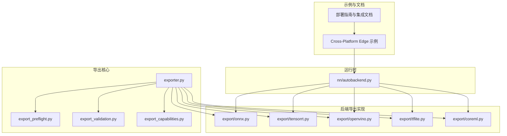

图表来源
- [engine/exporter.py](file://ultralytics/engine/exporter.py)
- [utils/export/onnx.py](file://ultralytics/utils/export/onnx.py)
- [utils/export/tensorrt.py](file://ultralytics/utils/export/tensorrt.py)
- [utils/export/openvino.py](file://ultralytics/utils/export/openvino.py)
- [utils/export/tflite.py](file://ultralytics/utils/export/tflite.py)
- [utils/export/coreml.py](file://ultralytics/utils/export/coreml.py)
- [utils/export_preflight.py](file://ultralytics/utils/export_preflight.py)
- [utils/export_validation.py](file://ultralytics/utils/export_validation.py)
- [utils/export_capabilities.py](file://ultralytics/utils/export_capabilities.py)
- [nn/autobackend.py](file://ultralytics/nn/autobackend.py)
- [examples/YOLO-Master-Cross-Platform-Edge-Deployment/TECHNICAL_REPORT.md](file://examples/YOLO-Master-Cross-Platform-Edge-Deployment/TECHNICAL_REPORT.md)
- [docs/en/guides/model-deployment-options.md](file://docs/en/guides/model-deployment-options.md)

章节来源
- [engine/exporter.py](file://ultralytics/engine/exporter.py)
- [utils/export/onnx.py](file://ultralytics/utils/export/onnx.py)
- [utils/export/tensorrt.py](file://ultralytics/utils/export/tensorrt.py)
- [utils/export/openvino.py](file://ultralytics/utils/export/openvino.py)
- [utils/export/tflite.py](file://ultralytics/utils/export/tflite.py)
- [utils/export/coreml.py](file://ultralytics/utils/export/coreml.py)
- [utils/export_capabilities.py](file://ultralytics/utils/export_capabilities.py)
- [utils/export_preflight.py](file://ultralytics/utils/export_preflight.py)
- [utils/export_validation.py](file://ultralytics/utils/export_validation.py)
- [nn/autobackend.py](file://ultralytics/nn/autobackend.py)
- [examples/YOLO-Master-Cross-Platform-Edge-Deployment/TECHNICAL_REPORT.md](file://examples/YOLO-Master-Cross-Platform-Edge-Deployment/TECHNICAL_REPORT.md)
- [docs/en/guides/model-deployment-options.md](file://docs/en/guides/model-deployment-options.md)

## 核心组件
- 导出编排器：负责统一入口、参数解析、预检、调用具体后端导出器、输出产物与元数据管理。
- 预检查模块：在导出前验证环境、依赖、模型图兼容性、目标平台能力矩阵。
- 导出能力矩阵：集中描述各后端对任务类型、输入形状、精度、动态轴等的支持情况。
- 导出校验：导出后一致性/数值稳定性/形状契约校验，保障端到端可复现。
- 自动后端：根据模型后缀或配置自动选择对应推理后端（ONNXRuntime、TensorRT、OpenVINO、TFLite、CoreML）。

章节来源
- [engine/exporter.py](file://ultralytics/engine/exporter.py)
- [utils/export_capabilities.py](file://ultralytics/utils/export_capabilities.py)
- [utils/export_preflight.py](file://ultralytics/utils/export_preflight.py)
- [utils/export_validation.py](file://ultralytics/utils/export_validation.py)
- [nn/autobackend.py](file://ultralytics/nn/autobackend.py)

## 架构总览
下图展示从训练权重到多后端部署产物的完整链路，包括预检、导出、校验、自动加载与运行。

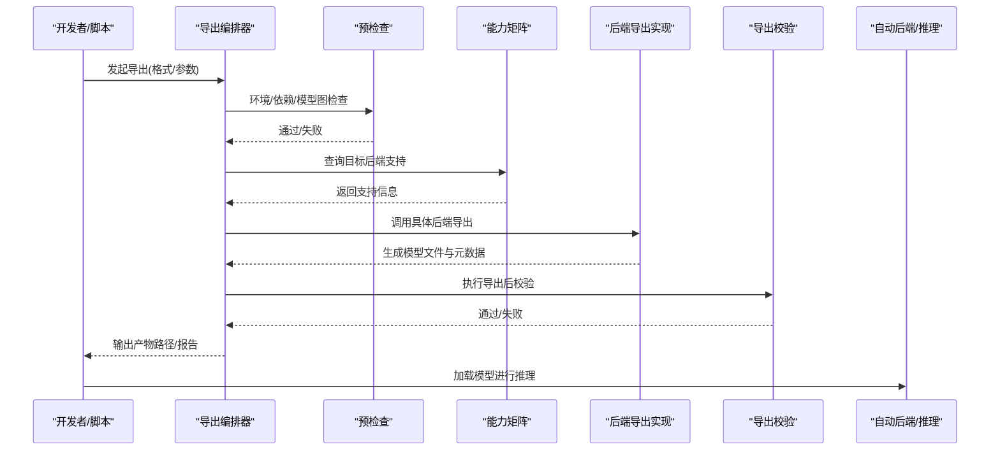

图表来源
- [engine/exporter.py](file://ultralytics/engine/exporter.py)
- [utils/export_preflight.py](file://ultralytics/utils/export_preflight.py)
- [utils/export_capabilities.py](file://ultralytics/utils/export_capabilities.py)
- [utils/export/onnx.py](file://ultralytics/utils/export/onnx.py)
- [utils/export/tensorrt.py](file://ultralytics/utils/export/tensorrt.py)
- [utils/export/openvino.py](file://ultralytics/utils/export/openvino.py)
- [utils/export/tflite.py](file://ultralytics/utils/export/tflite.py)
- [utils/export/coreml.py](file://ultralytics/utils/export/coreml.py)
- [utils/export_validation.py](file://ultralytics/utils/export_validation.py)
- [nn/autobackend.py](file://ultralytics/nn/autobackend.py)

## 详细组件分析

### 导出编排器与预检查/校验
- 职责
  - 统一导出入口，解析导出参数（如输入尺寸、动态轴、精度、优化开关）。
  - 调用预检查模块验证环境与依赖，结合能力矩阵判断是否可导出。
  - 分发至具体后端导出器，收集产物与日志。
  - 触发导出后校验（形状、数值、契约），输出报告。
- 关键流程
  - 预检查失败直接中止，避免无效导出。
  - 能力矩阵用于快速提示不支持的组合（如某任务+某后端+动态输入）。
  - 校验阶段对比 PyTorch 参考输出与后端输出，确保等价性。

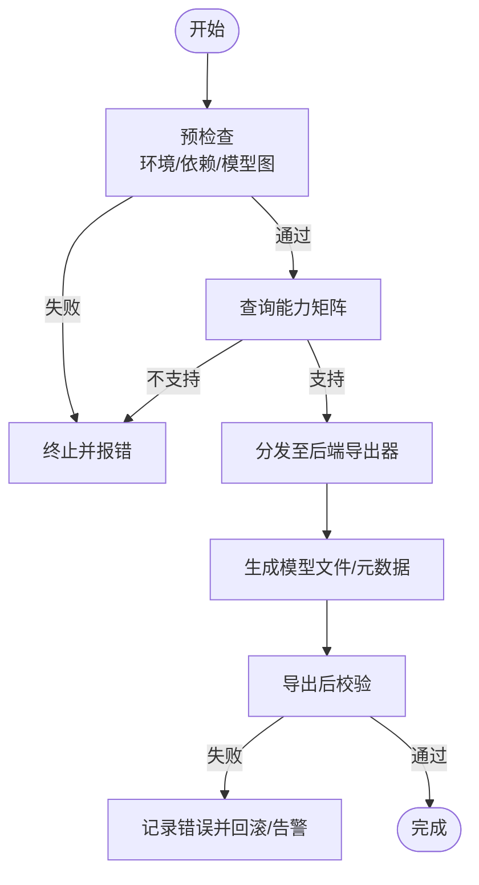

图表来源
- [engine/exporter.py](file://ultralytics/engine/exporter.py)
- [utils/export_preflight.py](file://ultralytics/utils/export_preflight.py)
- [utils/export_capabilities.py](file://ultralytics/utils/export_capabilities.py)
- [utils/export_validation.py](file://ultralytics/utils/export_validation.py)

章节来源
- [engine/exporter.py](file://ultralytics/engine/exporter.py)
- [utils/export_preflight.py](file://ultralytics/utils/export_preflight.py)
- [utils/export_capabilities.py](file://ultralytics/utils/export_capabilities.py)
- [utils/export_validation.py](file://ultralytics/utils/export_validation.py)

### ONNX 导出
- 流程要点
  - 将 PyTorch 模型导出为 ONNX，支持动态轴与静态形状配置。
  - 可选优化：算子融合、常量折叠、简化图（取决于后端与版本）。
  - 导出后可由 ONNXRuntime 直接推理，或通过其他后端二次转换。
- 典型用法
  - 指定输入形状、动态维度、opset 版本、优化级别。
  - 导出后使用自动后端加载 ONNX 模型进行推理。

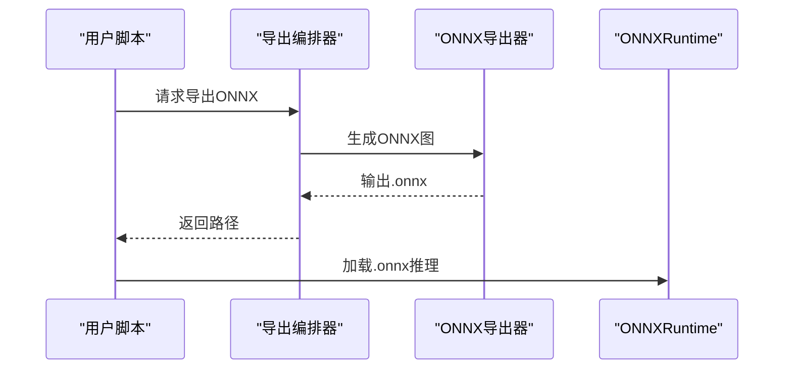

图表来源
- [utils/export/onnx.py](file://ultralytics/utils/export/onnx.py)
- [nn/autobackend.py](file://ultralytics/nn/autobackend.py)

章节来源
- [utils/export/onnx.py](file://ultralytics/utils/export/onnx.py)
- [nn/autobackend.py](file://ultralytics/nn/autobackend.py)

### TensorRT 导出
- 流程要点
  - 基于 ONNX 或原生接口构建 TensorRT 引擎，支持 FP16/INT8 量化与校准数据集。
  - 针对 GPU 架构优化内核与内存布局，显著提升吞吐与延迟。
  - 需安装对应版本的 TensorRT 与 CUDA 工具链。
- 优化选项
  - 精度模式（FP32/FP16/INT8）、最大批大小、工作空间、显存限制、校准集。
- 典型用法
  - 提供校准数据与精度设置，生成 .engine 文件，自动后端可直接加载。

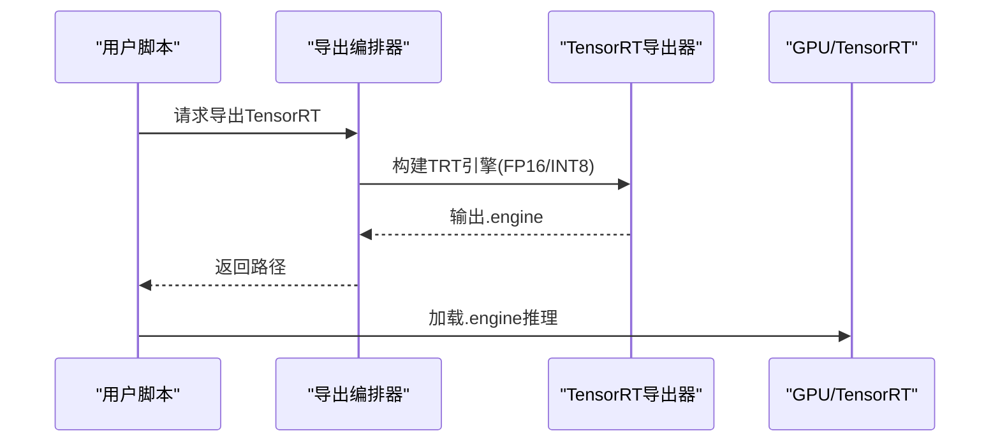

图表来源
- [utils/export/tensorrt.py](file://ultralytics/utils/export/tensorrt.py)
- [nn/autobackend.py](file://ultralytics/nn/autobackend.py)

章节来源
- [utils/export/tensorrt.py](file://ultralytics/utils/export/tensorrt.py)
- [nn/autobackend.py](file://ultralytics/nn/autobackend.py)

### OpenVINO 导出
- 流程要点
  - 将模型转换为 IR（.xml/.bin）或直接导出 OpenVINO 中间表示，支持 CPU/GPU/iGPU/VPU 等后端。
  - 可进行图优化、算子替换、量化（INT8）与模型压缩。
- 优化选项
  - 精度（FP32/FP16/INT8）、IR 优化级别、目标设备、缓存与预热。
- 典型用法
  - 导出 IR 后，使用 OpenVINO Runtime 加载推理；也可通过自动后端透明加载。

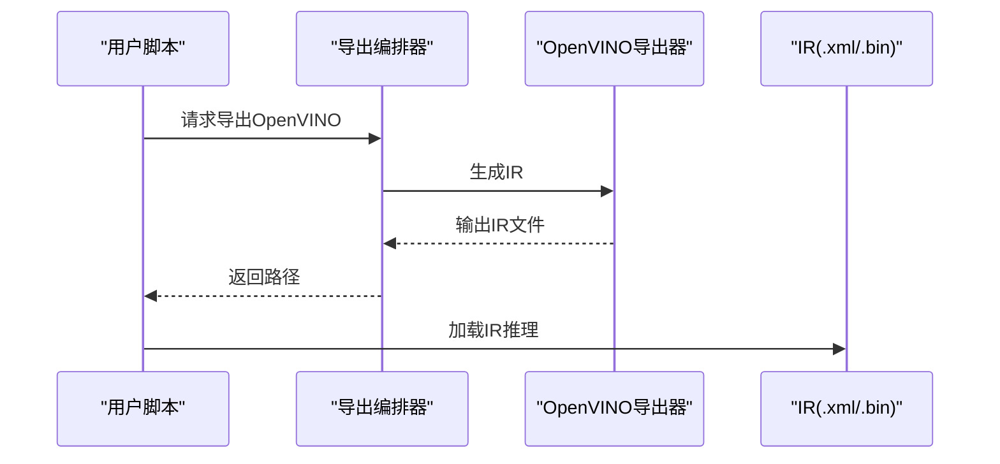

图表来源
- [utils/export/openvino.py](file://ultralytics/utils/export/openvino.py)
- [nn/autobackend.py](file://ultralytics/nn/autobackend.py)

章节来源
- [utils/export/openvino.py](file://ultralytics/utils/export/openvino.py)
- [nn/autobackend.py](file://ultralytics/nn/autobackend.py)

### TFLite 导出
- 流程要点
  - 将模型导出为 .tflite，适用于 Android/iOS 与嵌入式设备。
  - 支持 INT8 量化（含校准）、选择性算子降级与兼容处理。
- 优化选项
  - 量化（FP16/INT8）、算子白名单/黑名单、输入形状约束。
- 典型用法
  - 导出后在移动端使用 TFLite Runtime 加载推理。

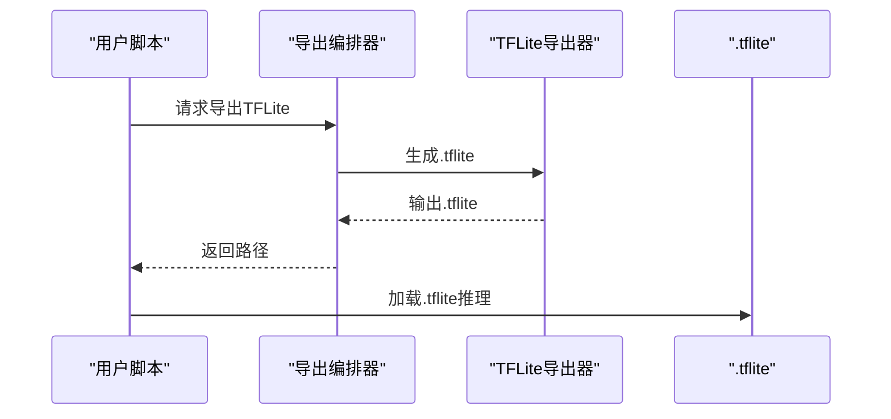

图表来源
- [utils/export/tflite.py](file://ultralytics/utils/export/tflite.py)
- [nn/autobackend.py](file://ultralytics/nn/autobackend.py)

章节来源
- [utils/export/tflite.py](file://ultralytics/utils/export/tflite.py)
- [nn/autobackend.py](file://ultralytics/nn/autobackend.py)

### CoreML 导出
- 流程要点
  - 将模型导出为 .mlmodel，适配 iOS/macOS 生态，利用 Metal Performance Shaders 加速。
  - 支持精度与计算图优化，便于在设备上高效推理。
- 优化选项
  - 精度（FP32/FP16）、Metal 后端启用、输入形状约束。
- 典型用法
  - 在 Xcode 工程中加载 .mlmodel 进行推理。

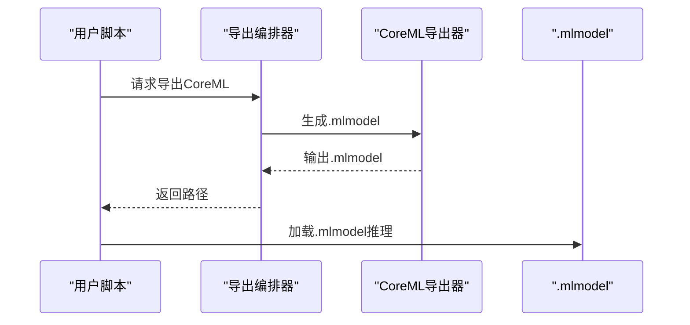

图表来源
- [utils/export/coreml.py](file://ultralytics/utils/export/coreml.py)
- [nn/autobackend.py](file://ultralytics/nn/autobackend.py)

章节来源
- [utils/export/coreml.py](file://ultralytics/utils/export/coreml.py)
- [nn/autobackend.py](file://ultralytics/nn/autobackend.py)

### 自动后端与运行时集成
- 功能
  - 根据模型后缀或配置自动选择推理后端（ONNXRuntime、TensorRT、OpenVINO、TFLite、CoreML）。
  - 统一推理接口，屏蔽后端差异，简化部署集成。
- 适用场景
  - 同一套业务代码在不同平台切换后端，无需修改上层逻辑。

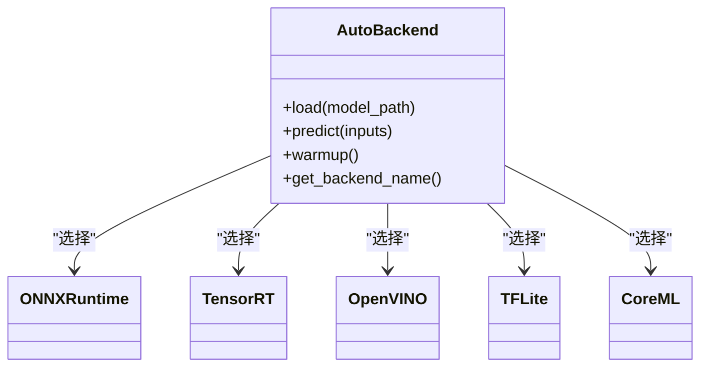

图表来源
- [nn/autobackend.py](file://ultralytics/nn/autobackend.py)

章节来源
- [nn/autobackend.py](file://ultralytics/nn/autobackend.py)

### 边缘设备 C++ 推理引擎构建与集成
- 示例工程
  - Cross-Platform Edge 示例提供 C++ 推理入口、CMake 构建脚本与平台适配（macOS/Jetson）。
  - 包含推理封装头文件与主程序，演示如何加载导出模型并进行预测。
- 构建步骤（概述）
  - 准备依赖（CMake、编译器、目标后端 SDK）。
  - 配置 CMakeLists.txt，链接推理库与模型文件。
  - 编译生成可执行程序，部署至目标设备运行。
- 集成要点
  - 输入预处理与后处理对齐导出配置。
  - 线程安全与内存池管理，提升吞吐。
  - 平台特定优化（如 Jetson 的 TensorRT、macOS 的 CoreML）。

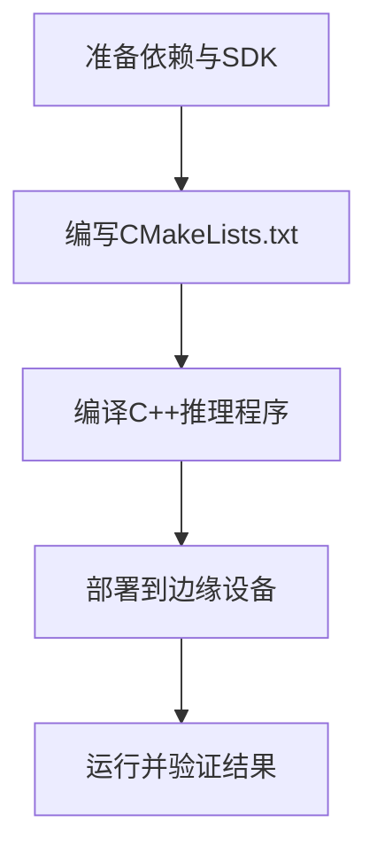

图表来源
- [examples/YOLO-Master-Cross-Platform-Edge-Deployment/cpp/main.cpp](file://examples/YOLO-Master-Cross-Platform-Edge-Deployment/cpp/main.cpp)
- [examples/YOLO-Master-Cross-Platform-Edge-Deployment/cpp/inference.h](file://examples/YOLO-Master-Cross-Platform-Edge-Deployment/cpp/inference.h)
- [examples/YOLO-Master-Cross-Platform-Edge-Deployment/cpp/CMakeLists.txt](file://examples/YOLO-Master-Cross-Platform-Edge-Deployment/cpp/CMakeLists.txt)
- [examples/YOLO-Master-Cross-Platform-Edge-Deployment/jetson/build.sh](file://examples/YOLO-Master-Cross-Platform-Edge-Deployment/jetson/build.sh)
- [examples/YOLO-Master-Cross-Platform-Edge-Deployment/mac/main.mm](file://examples/YOLO-Master-Cross-Platform-Edge-Deployment/mac/main.mm)
- [examples/YOLO-Master-Cross-Platform-Edge-Deployment/TECHNICAL_REPORT.md](file://examples/YOLO-Master-Cross-Platform-Edge-Deployment/TECHNICAL_REPORT.md)

章节来源
- [examples/YOLO-Master-Cross-Platform-Edge-Deployment/cpp/main.cpp](file://examples/YOLO-Master-Cross-Platform-Edge-Deployment/cpp/main.cpp)
- [examples/YOLO-Master-Cross-Platform-Edge-Deployment/cpp/inference.h](file://examples/YOLO-Master-Cross-Platform-Edge-Deployment/cpp/inference.h)
- [examples/YOLO-Master-Cross-Platform-Edge-Deployment/cpp/CMakeLists.txt](file://examples/YOLO-Master-Cross-Platform-Edge-Deployment/cpp/CMakeLists.txt)
- [examples/YOLO-Master-Cross-Platform-Edge-Deployment/jetson/build.sh](file://examples/YOLO-Master-Cross-Platform-Edge-Deployment/jetson/build.sh)
- [examples/YOLO-Master-Cross-Platform-Edge-Deployment/mac/main.mm](file://examples/YOLO-Master-Cross-Platform-Edge-Deployment/mac/main.mm)
- [examples/YOLO-Master-Cross-Platform-Edge-Deployment/TECHNICAL_REPORT.md](file://examples/YOLO-Master-Cross-Platform-Edge-Deployment/TECHNICAL_REPORT.md)

### 移动端部署策略（iOS/Android）
- iOS
  - 使用 CoreML 导出 .mlmodel，在 Xcode 工程中集成，利用 Metal 加速。
  - 注意输入形状与预处理一致，合理设置精度以平衡精度与速度。
- Android
  - 使用 TFLite 导出 .tflite，配合 NNAPI 或 GPU Delegate 加速。
  - 推荐 INT8 量化以降低体积与功耗，同时评估精度损失。
- 通用建议
  - 固定输入尺寸以提升性能与减少内存碎片。
  - 离线打包模型资产，避免运行时下载。
  - 使用自动后端或平台专用运行时统一接口。

章节来源
- [utils/export/coreml.py](file://ultralytics/utils/export/coreml.py)
- [utils/export/tflite.py](file://ultralytics/utils/export/tflite.py)
- [docs/en/integrations/coreml.md](file://docs/en/integrations/coreml.md)
- [docs/en/integrations/tflite.md](file://docs/en/integrations/tflite.md)

### 云服务部署最佳实践（容器化/微服务/负载均衡）
- 容器化
  - 使用 Docker 镜像封装推理环境，固化依赖与驱动版本。
  - 将模型文件作为只读卷挂载，支持热更新与灰度发布。
- 微服务
  - 将推理服务拆分为独立微服务，按任务或模型版本划分。
  - 使用消息队列或 API 网关进行请求路由与限流。
- 负载均衡
  - 在多实例间分配请求，结合健康检查与自动扩缩容。
  - 针对高吞吐场景，优先选择 TensorRT/OpenVINO 后端。

章节来源
- [docker/Dockerfile](file://docker/Dockerfile)
- [docs/en/guides/triton-inference-server.md](file://docs/en/guides/triton-inference-server.md)
- [docs/en/guides/model-deployment-options.md](file://docs/en/guides/model-deployment-options.md)

### 量化与压缩（INT8/稀疏化）
- INT8 量化
  - TensorRT/OpenVINO/TFLite 均支持 INT8 量化，需提供校准数据集。
  - 量化前后进行导出校验，确保精度达标。
- 稀疏化
  - 结合训练期稀疏正则或后训练稀疏化，降低计算量与存储。
  - 需要后端支持稀疏算子以获得实际加速收益。
- 实践建议
  - 先 FP16 再 INT8，逐步评估精度与性能。
  - 针对不同任务与输入尺寸分别调优。

章节来源
- [utils/export/tensorrt.py](file://ultralytics/utils/export/tensorrt.py)
- [utils/export/openvino.py](file://ultralytics/utils/export/openvino.py)
- [utils/export/tflite.py](file://ultralytics/utils/export/tflite.py)
- [utils/export_validation.py](file://ultralytics/utils/export_validation.py)

### 模型编译与优化（算子融合/内存优化）
- 算子融合
  - 导出阶段尽可能融合相邻算子，减少图节点与内存访问。
  - 不同后端融合策略不同，需结合能力矩阵与后端文档。
- 内存优化
  - 固定输入形状、复用缓冲区、避免频繁分配。
  - 使用批量推理与流水线并行提升吞吐。
- 预热与缓存
  - 首次推理预热内核与缓存，稳定延迟。
  - 服务端场景开启模型与引擎缓存。

章节来源
- [utils/export/onnx.py](file://ultralytics/utils/export/onnx.py)
- [utils/export/tensorrt.py](file://ultralytics/utils/export/tensorrt.py)
- [utils/export/openvino.py](file://ultralytics/utils/export/openvino.py)
- [utils/export_validation.py](file://ultralytics/utils/export_validation.py)

### 多硬件平台部署指南（GPU/NPU/FPGA）
- GPU（NVIDIA）
  - 使用 TensorRT 构建引擎，选择合适精度与工作空间。
  - 关注显存占用与并发批大小。
- NPU（Intel/OpenVINO）
  - 导出 IR 并在 iGPU/VPU 上运行，启用 INT8 与图优化。
- FPGA
  - 结合厂商工具链与 OpenVINO 适配，评估延迟与吞吐。
- 通用建议
  - 使用能力矩阵确认目标平台支持。
  - 通过基准套件对比不同后端与配置。

章节来源
- [utils/export/tensorrt.py](file://ultralytics/utils/export/tensorrt.py)
- [utils/export/openvino.py](file://ultralytics/utils/export/openvino.py)
- [utils/export_capabilities.py](file://ultralytics/utils/export_capabilities.py)
- [docs/en/guides/nvidia-jetson.md](file://docs/en/guides/nvidia-jetson.md)

### 部署后监控与维护
- 指标采集
  - 延迟、吞吐、错误率、资源利用率（CPU/GPU/内存）。
- 日志与追踪
  - 结构化日志、请求 ID 追踪、异常堆栈上报。
- 模型版本管理
  - 模型注册表、灰度发布、回滚策略。
- 自动化运维
  - 健康检查、自动扩缩容、告警阈值。

章节来源
- [docs/en/guides/model-deployment-practices.md](file://docs/en/guides/model-deployment-practices.md)
- [docs/en/guides/model-monitoring-and-maintenance.md](file://docs/en/guides/model-monitoring-and-maintenance.md)

### 性能基准测试与回归测试
- 基准测试
  - 使用 benchmarks 套件对不同后端与配置进行延迟/吞吐测量。
  - 固定随机种子与输入分布，保证可比性。
- 回归测试
  - 导出后校验对比参考输出，检测数值漂移。
  - 自动后端预热与加载测试，确保运行时稳定性。
- 持续集成
  - 在 CI 中运行基准与回归用例，阻断性能退化。

章节来源
- [benchmarks/run.py](file://benchmarks/run.py)
- [benchmarks/suite.py](file://benchmarks/suite.py)
- [tests/test_export_roundtrip.py](file://tests/test_export_roundtrip.py)
- [tests/test_exports.py](file://tests/test_exports.py)
- [tests/test_autobackend_warmup.py](file://tests/test_autobackend_warmup.py)

### 故障排除与调试工具
- 常见问题
  - 依赖缺失或版本不匹配、动态轴不支持、精度不达标、内存不足。
- 定位方法
  - 查看预检查与导出校验报告，定位失败阶段。
  - 使用最小复现用例与固定输入，隔离问题。
- 调试技巧
  - 关闭优化选项逐步排查，对比不同后端行为。
  - 增加日志级别，捕获运行时异常与堆栈。

章节来源
- [utils/export_preflight.py](file://ultralytics/utils/export_preflight.py)
- [utils/export_validation.py](file://ultralytics/utils/export_validation.py)
- [tests/test_export_preflight.py](file://tests/test_export_preflight.py)
- [tests/test_export_capability_matrix.py](file://tests/test_export_capability_matrix.py)

## 依赖关系分析
- 组件耦合
  - 导出编排器依赖预检查、能力矩阵与具体后端导出器。
  - 自动后端依赖各后端运行时库，统一推理接口。
- 外部依赖
  - ONNXRuntime、TensorRT、OpenVINO、TFLite、CoreML 等运行时。
- 潜在风险
  - 版本不兼容导致导出失败或运行时崩溃。
  - 动态轴与某些后端不兼容，需固定输入或降级。

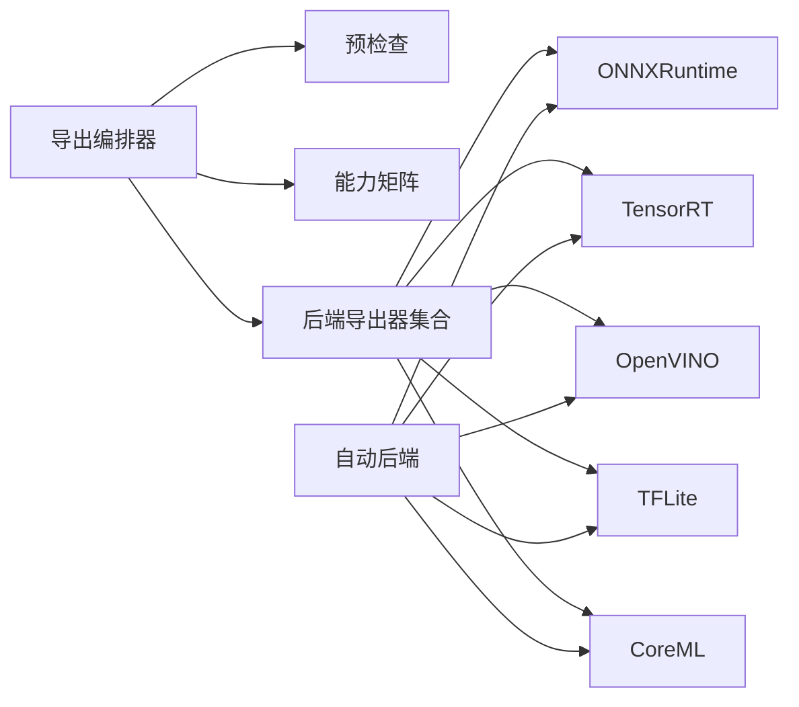

图表来源
- [engine/exporter.py](file://ultralytics/engine/exporter.py)
- [utils/export/onnx.py](file://ultralytics/utils/export/onnx.py)
- [utils/export/tensorrt.py](file://ultralytics/utils/export/tensorrt.py)
- [utils/export/openvino.py](file://ultralytics/utils/export/openvino.py)
- [utils/export/tflite.py](file://ultralytics/utils/export/tflite.py)
- [utils/export/coreml.py](file://ultralytics/utils/export/coreml.py)
- [nn/autobackend.py](file://ultralytics/nn/autobackend.py)

章节来源
- [engine/exporter.py](file://ultralytics/engine/exporter.py)
- [nn/autobackend.py](file://ultralytics/nn/autobackend.py)

## 性能考量
- 选择合适后端与精度：GPU 首选 TensorRT，CPU/iGPU 首选 OpenVINO，移动端首选 TFLite/CoreML。
- 固定输入形状与批量推理：减少内存分配与上下文切换。
- 预热与缓存：首帧预热，服务端缓存引擎与模型。
- 资源监控：关注显存/CPU/内存峰值，调整批大小与工作空间。
- 量化权衡：INT8 显著降体积与功耗，需评估精度损失。

[本节为通用指导，不直接分析具体文件]

## 故障排除指南
- 导出失败
  - 检查预检查报告与能力矩阵，确认目标组合受支持。
  - 降低优化等级或关闭动态轴，逐步定位问题。
- 运行时异常
  - 核对后端版本与驱动，确保与导出时一致。
  - 使用自动后端预热与最小输入复现，捕获堆栈。
- 精度不达标
  - 重新校准量化参数，检查预处理一致性。
  - 对比参考输出，定位数值漂移环节。

章节来源
- [utils/export_preflight.py](file://ultralytics/utils/export_preflight.py)
- [utils/export_validation.py](file://ultralytics/utils/export_validation.py)
- [tests/test_export_preflight.py](file://tests/test_export_preflight.py)
- [tests/test_export_roundtrip.py](file://tests/test_export_roundtrip.py)

## 结论
YOLO-Master 提供了完善的模型导出与部署体系：统一的导出编排、严格的预检查与导出校验、丰富的后端支持与自动后端加载、跨平台边缘与移动端示例、云服务的容器化与微服务实践，以及量化与编译优化手段。通过基准与回归测试保障质量，借助监控与维护策略确保生产稳定。建议在实际项目中依据能力矩阵与目标平台特性选择合适的后端与优化策略，并以自动化测试与监控闭环持续提升可靠性与性能。

[本节为总结，不直接分析具体文件]

## 附录
- 相关文档与集成指南
  - 部署选项与实践：docs/en/guides/model-deployment-options.md、docs/en/guides/model-deployment-practices.md
  - 推理服务器：docs/en/guides/triton-inference-server.md
  - 平台指南：docs/en/guides/nvidia-jetson.md、docs/en/guides/raspberry-pi.md
  - 后端集成：docs/en/integrations/onnx.md、docs/en/integrations/tensorrt.md、docs/en/integrations/openvino.md、docs/en/integrations/tflite.md、docs/en/integrations/coreml.md
- 示例工程
  - 边缘部署示例：examples/YOLO-Master-Cross-Platform-Edge-Deployment、examples/YOLO-Master-Edge-Deployment
  - C++ 推理示例：examples/YOLOv8-ONNXRuntime-CPP、examples/YOLOv8-OpenVINO-CPP-Inference、examples/YOLO11-Triton-CPP

[本节为索引，不直接分析具体文件]