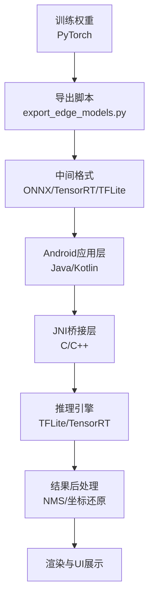
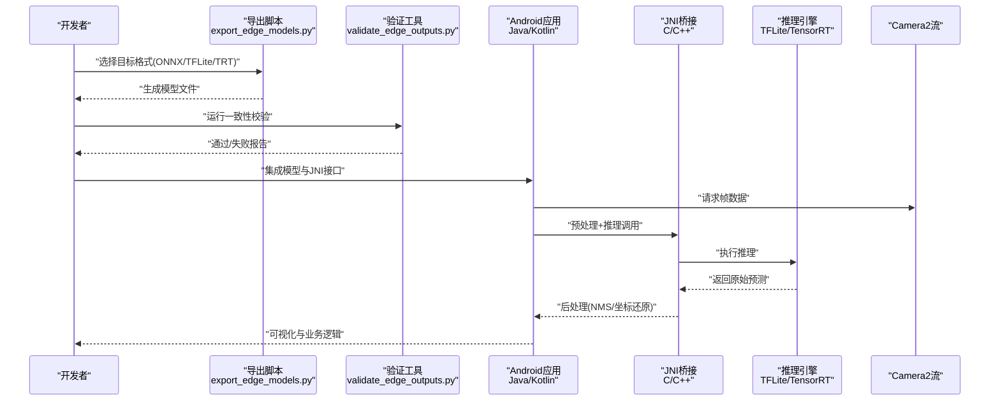
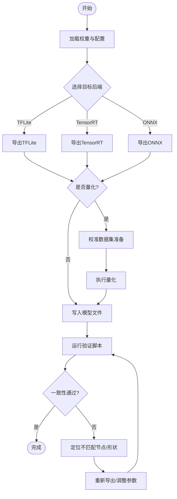
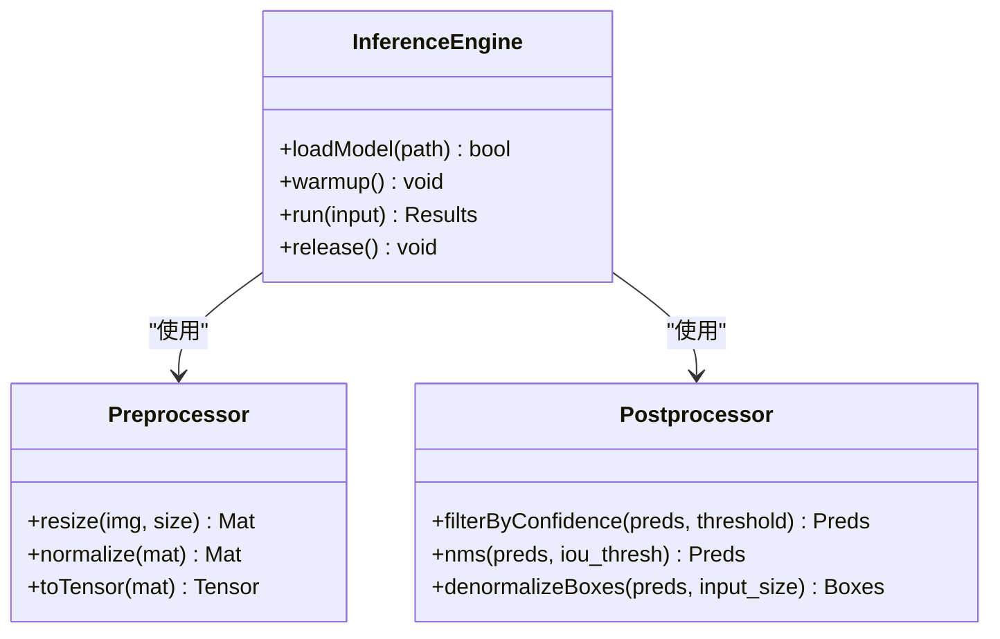
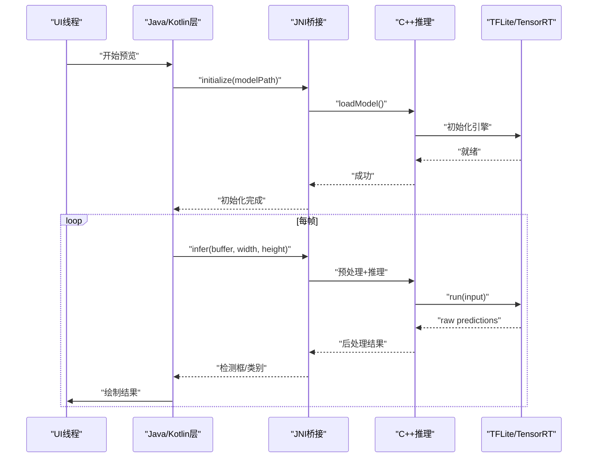
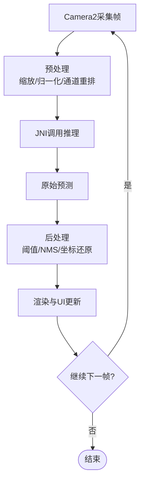
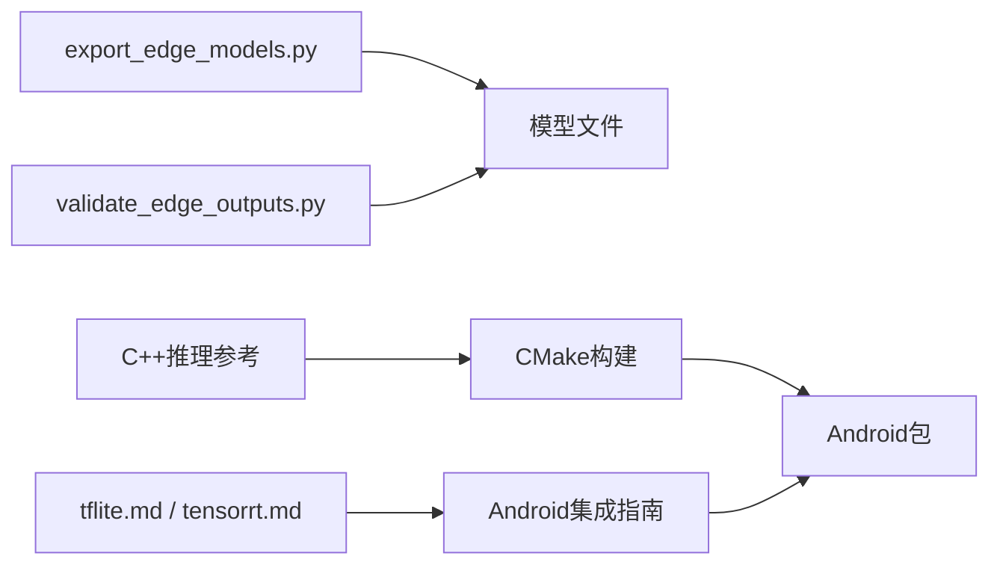

# Android平台部署

<cite>
**本文引用的文件**
- [README.md](file://README.md)
- [export_edge_models.py](file://examples/YOLO-Master-Edge-Deployment/export_edge_models.py)
- [edge_utils.py](file://examples/YOLO-Master-Edge-Deployment/edge_utils.py)
- [validate_edge_outputs.py](file://examples/YOLO-Master-Edge-Deployment/validate_edge_outputs.py)
- [CMakeLists.txt](file://examples/YOLO-Master-Edge-Deployment/CMakeLists.txt)
- [inference.cpp](file://examples/YOLOv8-CPP-Inference/inference.cpp)
- [inference.h](file://examples/YOLOv8-CPP-Inference/inference.h)
- [main.cpp](file://examples/YOLOv8-CPP-Inference/main.cpp)
- [tflite.md](file://docs/en/integrations/tflite.md)
- [tensorrt.md](file://docs/en/integrations/tensorrt.md)
- [model-deployment-options.md](file://docs/en/guides/model-deployment-options.md)
- [model-deployment-practices.md](file://docs/en/guides/model-deployment-practices.md)
</cite>

## 目录
1. [简介](#简介)
2. [项目结构](#项目结构)
3. [核心组件](#核心组件)
4. [架构总览](#架构总览)
5. [详细组件分析](#详细组件分析)
6. [依赖关系分析](#依赖关系分析)
7. [性能考量](#性能考量)
8. [故障排查指南](#故障排查指南)
9. [结论](#结论)
10. [附录](#附录)

## 简介
本文件面向在Android平台上部署YOLO-Master的工程实践，聚焦以下目标：
- 模型转换与优化：从PyTorch导出到TensorRT与TFLite，覆盖格式转换、量化加速与内存优化。
- Android原生集成：NDK开发、JNI桥接与C++推理引擎集成路径。
- 摄像头实时推理：Camera2 API接入、图像预处理与后处理优化。
- 示例与构建：提供可复用的示例工程结构与Gradle构建配置要点。
- 性能监控：使用Android Studio Profiler与Perfetto进行端到端性能分析。
- 兼容性与适配：不同Android版本与设备差异的适配策略。
- 发布准备：APK打包优化与Google Play发布检查清单。

## 项目结构
仓库中与Android部署相关的资源主要分布在以下位置：
- 边缘部署示例与脚本：examples/YOLO-Master-Edge-Deployment
- C++推理参考实现：examples/YOLOv8-CPP-Inference（可作为Android NDK集成的参考）
- 官方文档：docs/en/integrations/tflite.md、docs/en/integrations/tensorrt.md、docs/en/guides/model-deployment-options.md、docs/en/guides/model-deployment-practices.md

图表来源
- [export_edge_models.py:1-200](file://examples/YOLO-Master-Edge-Deployment/export_edge_models.py#L1-L200)
- [tflite.md:1-200](file://docs/en/integrations/tflite.md#L1-L200)
- [tensorrt.md:1-200](file://docs/en/integrations/tensorrt.md#L1-L200)

章节来源
- [README.md:1-200](file://README.md#L1-L200)
- [export_edge_models.py:1-200](file://examples/YOLO-Master-Edge-Deployment/export_edge_models.py#L1-L200)
- [tflite.md:1-200](file://docs/en/integrations/tflite.md#L1-L200)
- [tensorrt.md:1-200](file://docs/en/integrations/tensorrt.md#L1-L200)

## 核心组件
- 模型导出与验证
  - 导出脚本负责将训练好的YOLO-Master模型转换为边缘可用格式，并输出校验工具用于一致性验证。
  - 关键文件：export_edge_models.py、validate_edge_outputs.py、edge_utils.py。
- C++推理参考
  - 提供C++推理入口与封装，便于移植到Android NDK环境。
  - 关键文件：inference.cpp、inference.h、main.cpp、CMakeLists.txt。
- 官方集成文档
  - TFLite与TensorRT的集成说明、最佳实践与注意事项。
  - 关键文件：tflite.md、tensorrt.md、model-deployment-options.md、model-deployment-practices.md。

章节来源
- [export_edge_models.py:1-200](file://examples/YOLO-Master-Edge-Deployment/export_edge_models.py#L1-L200)
- [validate_edge_outputs.py:1-200](file://examples/YOLO-Master-Edge-Deployment/validate_edge_outputs.py#L1-L200)
- [edge_utils.py:1-200](file://examples/YOLO-Master-Edge-Deployment/edge_utils.py#L1-L200)
- [inference.cpp:1-200](file://examples/YOLOv8-CPP-Inference/inference.cpp#L1-L200)
- [inference.h:1-200](file://examples/YOLOv8-CPP-Inference/inference.h#L1-L200)
- [main.cpp:1-200](file://examples/YOLOv8-CPP-Inference/main.cpp#L1-L200)
- [CMakeLists.txt:1-200](file://examples/YOLO-Master-Edge-Deployment/CMakeLists.txt#L1-L200)
- [tflite.md:1-200](file://docs/en/integrations/tflite.md#L1-L200)
- [tensorrt.md:1-200](file://docs/en/integrations/tensorrt.md#L1-L200)
- [model-deployment-options.md:1-200](file://docs/en/guides/model-deployment-options.md#L1-L200)
- [model-deployment-practices.md:1-200](file://docs/en/guides/model-deployment-practices.md#L1-L200)

## 架构总览
下图展示了从训练到Android端推理的整体流程，包括导出、量化、JNI桥接与摄像头流水线。

图表来源
- [export_edge_models.py:1-200](file://examples/YOLO-Master-Edge-Deployment/export_edge_models.py#L1-L200)
- [validate_edge_outputs.py:1-200](file://examples/YOLO-Master-Edge-Deployment/validate_edge_outputs.py#L1-L200)
- [tflite.md:1-200](file://docs/en/integrations/tflite.md#L1-L200)
- [tensorrt.md:1-200](file://docs/en/integrations/tensorrt.md#L1-L200)

## 详细组件分析

### 模型导出与验证（Python侧）
- 功能概述
  - 将YOLO-Master模型导出为边缘部署所需格式（如ONNX、TFLite、TensorRT）。
  - 提供导出参数控制（输入尺寸、精度、动态形状等），以及批量导出能力。
  - 配套验证脚本用于对比导出前后输出一致性，确保转换正确性。
- 关键流程
  - 加载训练权重与配置。
  - 根据目标后端选择导出器与优化选项。
  - 写入模型文件与元数据。
  - 运行验证脚本进行数值一致性检查。
- 复杂度与优化点
  - 导出阶段的时间复杂度受模型规模与图优化影响；建议开启算子融合与常量折叠。
  - 量化阶段需校准数据集，注意校准误差对精度的影响。
- 错误处理
  - 针对不支持的算子或形状约束，应给出明确错误提示与回退方案（如禁用某些优化）。

章节来源
- [export_edge_models.py:1-200](file://examples/YOLO-Master-Edge-Deployment/export_edge_models.py#L1-L200)
- [validate_edge_outputs.py:1-200](file://examples/YOLO-Master-Edge-Deployment/validate_edge_outputs.py#L1-L200)
- [edge_utils.py:1-200](file://examples/YOLO-Master-Edge-Deployment/edge_utils.py#L1-L200)

#### 导出流程图

图表来源
- [export_edge_models.py:1-200](file://examples/YOLO-Master-Edge-Deployment/export_edge_models.py#L1-L200)
- [validate_edge_outputs.py:1-200](file://examples/YOLO-Master-Edge-Deployment/validate_edge_outputs.py#L1-L200)

### C++推理参考（Android NDK集成基础）
- 功能概述
  - 提供统一的推理接口封装，包含模型加载、输入预处理、推理执行与结果解析。
  - 作为Android NDK集成的参考实现，便于迁移至C++推理引擎（TFLite/TensorRT）。
- 关键类与方法
  - 推理封装类：负责生命周期管理（初始化、预热、推理、释放）。
  - 输入预处理：图像缩放、归一化、通道重排。
  - 后处理：置信度阈值过滤、NMS、坐标还原。
- 构建系统
  - 使用CMake组织源码与依赖，便于交叉编译到Android ABI（arm64-v8a、armeabi-v7a）。
- 性能要点
  - 避免频繁分配内存，复用缓冲区。
  - 合理设置线程数与批大小，平衡吞吐与时延。
  - 利用SIMD指令与底层库优化（OpenBLAS、ARM Compute Library等）。

章节来源
- [inference.cpp:1-200](file://examples/YOLOv8-CPP-Inference/inference.cpp#L1-L200)
- [inference.h:1-200](file://examples/YOLOv8-CPP-Inference/inference.h#L1-L200)
- [main.cpp:1-200](file://examples/YOLOv8-CPP-Inference/main.cpp#L1-L200)
- [CMakeLists.txt:1-200](file://examples/YOLO-Master-Edge-Deployment/CMakeLists.txt#L1-L200)

#### 推理类图（概念映射）

图表来源
- [inference.cpp:1-200](file://examples/YOLOv8-CPP-Inference/inference.cpp#L1-L200)
- [inference.h:1-200](file://examples/YOLOv8-CPP-Inference/inference.h#L1-L200)

### Android集成与JNI桥接
- 集成步骤
  - 在Android工程中引入预编译的Native库（.so），并通过CMake或ndk-build链接。
  - 定义JNI接口，暴露模型加载、推理与资源释放方法给Java/Kotlin层。
  - 在Java/Kotlin中调用JNI，传递Bitmap或ByteBuffer，接收检测结果。
- 关键注意事项
  - 线程安全：确保推理对象跨线程访问时的同步与状态隔离。
  - 内存管理：避免在高频回调中创建临时对象，尽量复用缓冲区。
  - 异常处理：捕获底层异常并向上抛出友好错误信息。
- 摄像头流水线
  - 使用Camera2 API获取YUV/RGB帧，进行必要的颜色空间转换与尺寸对齐。
  - 将帧送入预处理模块，再调用JNI推理，最后在后处理阶段绘制标注。

章节来源
- [tflite.md:1-200](file://docs/en/integrations/tflite.md#L1-L200)
- [tensorrt.md:1-200](file://docs/en/integrations/tensorrt.md#L1-L200)
- [model-deployment-options.md:1-200](file://docs/en/guides/model-deployment-options.md#L1-L200)
- [model-deployment-practices.md:1-200](file://docs/en/guides/model-deployment-practices.md#L1-L200)

#### JNI调用序列图

图表来源
- [inference.cpp:1-200](file://examples/YOLOv8-CPP-Inference/inference.cpp#L1-L200)
- [tflite.md:1-200](file://docs/en/integrations/tflite.md#L1-L200)
- [tensorrt.md:1-200](file://docs/en/integrations/tensorrt.md#L1-L200)

### 摄像头实时推理（Camera2 + 预处理/后处理）
- 数据流
  - Camera2提供ImageReader回调，获取帧数据。
  - 预处理：尺寸缩放、归一化、通道顺序调整。
  - 推理：通过JNI调用C++推理，得到原始预测。
  - 后处理：置信度过滤、NMS、坐标还原与边界框规范化。
- 优化建议
  - 使用DirectBuffer减少拷贝。
  - 采用异步流水线，分离采集、预处理、推理与渲染。
  - 根据设备能力动态调整分辨率与批大小。

章节来源
- [tflite.md:1-200](file://docs/en/integrations/tflite.md#L1-L200)
- [tensorrt.md:1-200](file://docs/en/integrations/tensorrt.md#L1-L200)
- [model-deployment-practices.md:1-200](file://docs/en/guides/model-deployment-practices.md#L1-L200)

#### 实时推理流程图

图表来源
- [tflite.md:1-200](file://docs/en/integrations/tflite.md#L1-L200)
- [tensorrt.md:1-200](file://docs/en/integrations/tensorrt.md#L1-L200)

## 依赖关系分析
- 导出与验证
  - export_edge_models.py依赖训练权重与配置，输出多格式模型。
  - validate_edge_outputs.py依赖导出产物，进行一致性校验。
- 推理与构建
  - C++推理参考实现通过CMake组织，便于交叉编译到Android ABI。
- 官方文档
  - tflite.md与tensorrt.md提供后端集成细节与最佳实践。

图表来源
- [export_edge_models.py:1-200](file://examples/YOLO-Master-Edge-Deployment/export_edge_models.py#L1-L200)
- [validate_edge_outputs.py:1-200](file://examples/YOLO-Master-Edge-Deployment/validate_edge_outputs.py#L1-L200)
- [CMakeLists.txt:1-200](file://examples/YOLO-Master-Edge-Deployment/CMakeLists.txt#L1-L200)
- [tflite.md:1-200](file://docs/en/integrations/tflite.md#L1-L200)
- [tensorrt.md:1-200](file://docs/en/integrations/tensorrt.md#L1-L200)

章节来源
- [export_edge_models.py:1-200](file://examples/YOLO-Master-Edge-Deployment/export_edge_models.py#L1-L200)
- [validate_edge_outputs.py:1-200](file://examples/YOLO-Master-Edge-Deployment/validate_edge_outputs.py#L1-L200)
- [CMakeLists.txt:1-200](file://examples/YOLO-Master-Edge-Deployment/CMakeLists.txt#L1-L200)
- [tflite.md:1-200](file://docs/en/integrations/tflite.md#L1-L200)
- [tensorrt.md:1-200](file://docs/en/integrations/tensorrt.md#L1-L200)

## 性能考量
- 模型层面
  - 量化：INT8/FP16权衡精度与速度，选择合适的校准集。
  - 图优化：启用算子融合、常量折叠、死代码消除。
- 运行时层面
  - 线程池与批处理：根据设备CPU/GPU能力调优并行度。
  - 内存复用：避免频繁分配，使用对象池与环形缓冲。
- 管线层面
  - 异步流水线：解耦采集、预处理、推理与渲染，降低主线程压力。
  - 动态分辨率：根据场景复杂度自适应调整输入尺寸。

[本节为通用指导，无需特定文件引用]

## 故障排查指南
- 导出不一致
  - 现象：导出后精度下降或输出不一致。
  - 排查：核对输入形状、归一化参数、NMS阈值；使用验证脚本定位差异节点。
- 推理崩溃或卡顿
  - 现象：JNI调用崩溃、ANR或帧率骤降。
  - 排查：检查线程安全、内存泄漏、缓冲区越界；使用Profiler定位热点。
- 摄像头问题
  - 现象：黑屏、画面旋转错误或延迟高。
  - 排查：确认ImageFormat与色彩空间、Surface绑定、回调频率。

章节来源
- [validate_edge_outputs.py:1-200](file://examples/YOLO-Master-Edge-Deployment/validate_edge_outputs.py#L1-L200)
- [inference.cpp:1-200](file://examples/YOLOv8-CPP-Inference/inference.cpp#L1-L200)
- [tflite.md:1-200](file://docs/en/integrations/tflite.md#L1-L200)
- [tensorrt.md:1-200](file://docs/en/integrations/tensorrt.md#L1-L200)

## 结论
通过在Python侧完成模型导出与验证，并在Android端以JNI桥接C++推理引擎，可实现YOLO-Master的高效部署。结合Camera2流水线与性能监控工具，可在不同设备上取得稳定且高效的实时检测体验。建议在发布前进行全面的兼容性测试与性能回归，确保满足用户体验与商店审核要求。

[本节为总结，无需特定文件引用]

## 附录

### Android示例项目与Gradle构建要点
- 示例参考
  - 使用C++推理参考实现作为JNI集成的基础，结合CMake构建Android ABI。
- Gradle关键点
  - 配置ndkBuild或CMake路径，指定ABI过滤器（arm64-v8a、armeabi-v7a）。
  - 将预编译.so放入jniLibs目录或通过CMake直接构建。
  - 在build.gradle中启用外部Native库与资源压缩。

章节来源
- [CMakeLists.txt:1-200](file://examples/YOLO-Master-Edge-Deployment/CMakeLists.txt#L1-L200)
- [inference.cpp:1-200](file://examples/YOLOv8-CPP-Inference/inference.cpp#L1-L200)
- [inference.h:1-200](file://examples/YOLOv8-CPP-Inference/inference.h#L1-L200)
- [main.cpp:1-200](file://examples/YOLOv8-CPP-Inference/main.cpp#L1-L200)

### Android特有性能监控工具
- Android Studio Profiler
  - CPU/内存/网络/电池视图，定位热点函数与内存泄漏。
- Perfetto
  - 系统级追踪，记录GPU/CPU调度、I/O与合成事件，适合端到端瓶颈分析。
- 使用建议
  - 在真实设备上录制长时任务，关注Jank与帧时间分布。
  - 结合日志与TraceView/Perfetto，形成闭环优化。

[本节为通用指导，无需特定文件引用]

### 兼容性与设备适配策略
- Android版本
  - 最低API级别与目标API级别需与依赖库兼容。
  - 针对旧设备降级策略（如关闭高级优化、降低分辨率）。
- 设备差异
  - CPU架构（arm64-v8a优先）、GPU驱动支持（TensorRT/OpenGL/Vulkan）。
  - 内存与存储限制，动态加载与按需卸载资源。

章节来源
- [model-deployment-options.md:1-200](file://docs/en/guides/model-deployment-options.md#L1-L200)
- [model-deployment-practices.md:1-200](file://docs/en/guides/model-deployment-practices.md#L1-L200)

### APK打包优化与Google Play发布检查清单
- 打包优化
  - 启用资源压缩与混淆（R8/ProGuard）。
  - 仅保留必要ABI与资源，减小APK体积。
- 发布检查
  - 权限最小化、隐私政策合规。
  - 性能基准回归通过，稳定性测试无崩溃。
  - 商店描述与截图符合规范。

[本节为通用指导，无需特定文件引用]