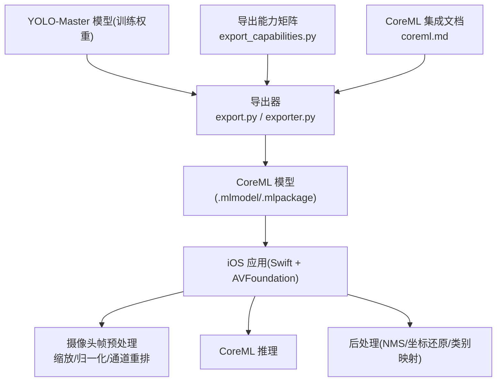
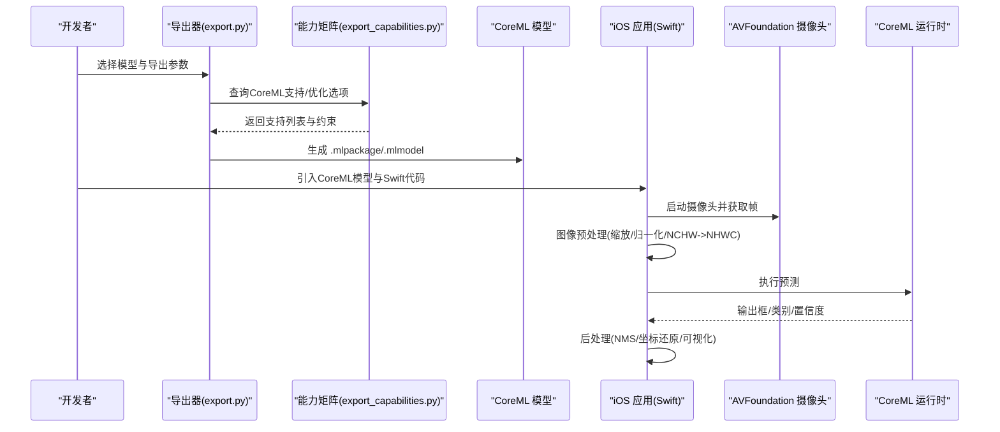
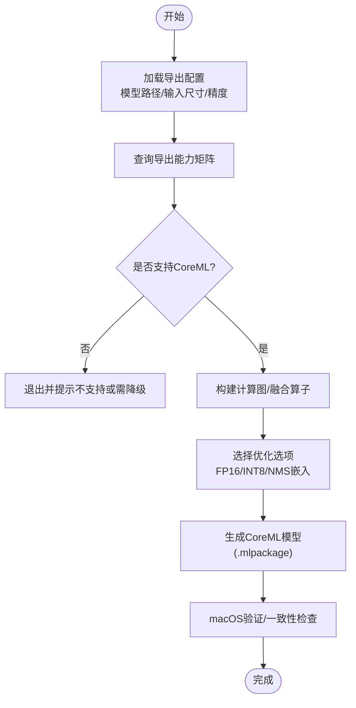
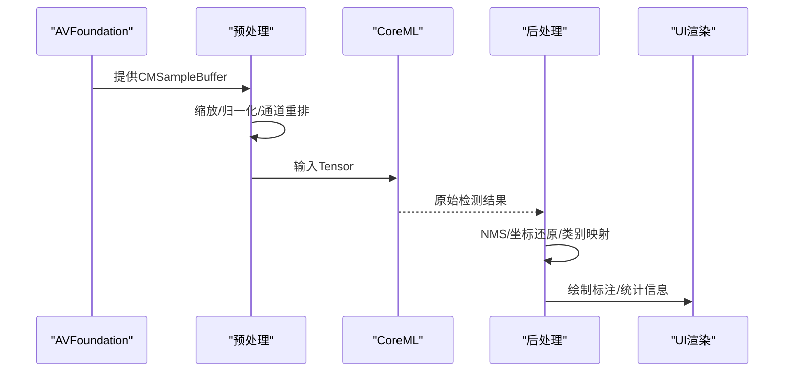
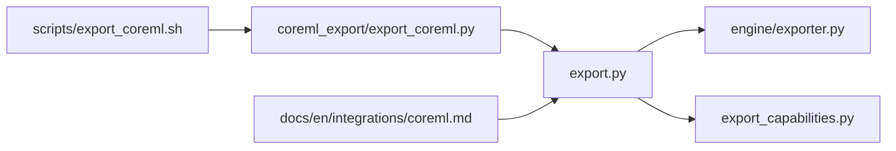

# iOS平台部署

<cite>
**本文引用的文件**
- [README.md](file://README.md)
- [examples/YOLO-Master-Cross-Platform-Edge-Deployment/README.md](file://examples/YOLO-Master-Cross-Platform-Edge-Deployment/README.md)
- [examples/YOLO-Master-Cross-Platform-Edge-Deployment/coreml_export/export_coreml.py](file://examples/YOLO-Master-Cross-Platform-Edge-Deployment/coreml_export/export_coreml.py)
- [examples/YOLO-Master-Cross-Platform-Edge-Deployment/mac/README.md](file://examples/YOLO-Master-Cross-Platform-Edge-Deployment/mac/README.md)
- [examples/YOLO-Master-Cross-Platform-Edge-Deployment/scripts/export_coreml.sh](file://examples/YOLO-Master-Cross-Platform-Edge-Deployment/scripts/export_coreml.sh)
- [ultralytics/utils/export.py](file://ultralytics/utils/export.py)
- [ultralytics/engine/exporter.py](file://ultralytics/engine/exporter.py)
- [ultralytics/utils/export_capabilities.py](file://ultralytics/utils/export_capabilities.py)
- [docs/en/integrations/coreml.md](file://docs/en/integrations/coreml.md)
</cite>

## 目录
1. [简介](#简介)
2. [项目结构](#项目结构)
3. [核心组件](#核心组件)
4. [架构总览](#架构总览)
5. [详细组件分析](#详细组件分析)
6. [依赖关系分析](#依赖关系分析)
7. [性能考量](#性能考量)
8. [故障排查指南](#故障排查指南)
9. [结论](#结论)
10. [附录](#附录)

## 简介
本文件面向在iOS平台上部署YOLO-Master的工程师与研究者，聚焦于CoreML模型的转换、量化与优化，Swift原生集成（Xcode配置、API调用、内存管理），以及基于AVFoundation的摄像头实时推理流水线。文档同时给出示例工程结构与构建脚本说明，并覆盖Instruments性能分析与内存泄漏检测、iOS版本兼容性与设备适配策略，以及App Store发布前的优化检查与打包流程。

## 项目结构
仓库中与iOS/Edge部署相关的资源主要集中在跨平台边缘部署示例与导出能力文档中：
- 跨平台边缘部署示例：包含CoreML导出脚本、macOS参考实现与使用说明
- CoreML导出能力与文档：提供导出参数、兼容性矩阵与最佳实践
- 引擎与工具层：统一的导出入口与能力探测模块

图表来源
- [ultralytics/utils/export.py](file://ultralytics/utils/export.py)
- [ultralytics/engine/exporter.py](file://ultralytics/engine/exporter.py)
- [ultralytics/utils/export_capabilities.py](file://ultralytics/utils/export_capabilities.py)
- [docs/en/integrations/coreml.md](file://docs/en/integrations/coreml.md)

章节来源
- [examples/YOLO-Master-Cross-Platform-Edge-Deployment/README.md](file://examples/YOLO-Master-Cross-Platform-Edge-Deployment/README.md)
- [docs/en/integrations/coreml.md](file://docs/en/integrations/coreml.md)

## 核心组件
- 导出管线
  - 统一导出入口与后端调度：负责将PyTorch/TorchScript等中间表示转换为目标格式（含CoreML）
  - 导出能力探测：根据模型算子与任务类型判断是否支持CoreML导出及可用优化选项
- CoreML导出脚本与示例
  - 提供一键导出脚本与Python封装，便于批量生成不同尺寸/精度的CoreML模型
  - macOS参考实现用于验证导出产物与推理一致性
- iOS集成要点
  - Xcode工程配置、CoreML模型资源引入、Swift API调用与线程/内存管理
  - 基于AVFoundation的摄像头采集、图像预处理与后处理优化

章节来源
- [ultralytics/utils/export.py](file://ultralytics/utils/export.py)
- [ultralytics/engine/exporter.py](file://ultralytics/engine/exporter.py)
- [ultralytics/utils/export_capabilities.py](file://ultralytics/utils/export_capabilities.py)
- [examples/YOLO-Master-Cross-Platform-Edge-Deployment/coreml_export/export_coreml.py](file://examples/YOLO-Master-Cross-Platform-Edge-Deployment/coreml_export/export_coreml.py)
- [examples/YOLO-Master-Cross-Platform-Edge-Deployment/scripts/export_coreml.sh](file://examples/YOLO-Master-Cross-Platform-Edge-Deployment/scripts/export_coreml.sh)
- [examples/YOLO-Master-Cross-Platform-Edge-Deployment/mac/README.md](file://examples/YOLO-Master-Cross-Platform-Edge-Deployment/mac/README.md)

## 架构总览
下图展示从训练权重到iOS端实时推理的整体数据流与控制流。

图表来源
- [ultralytics/utils/export.py](file://ultralytics/utils/export.py)
- [ultralytics/utils/export_capabilities.py](file://ultralytics/utils/export_capabilities.py)
- [examples/YOLO-Master-Cross-Platform-Edge-Deployment/coreml_export/export_coreml.py](file://examples/YOLO-Master-Cross-Platform-Edge-Deployment/coreml_export/export_coreml.py)

## 详细组件分析

### CoreML导出与优化
- 导出入口与后端调度
  - 通过统一导出接口指定目标格式为CoreML，内部会调用相应后端进行图转换与优化
  - 可配置输入形状、精度、NMS/后处理嵌入等选项（以导出能力矩阵为准）
- 导出能力探测
  - 依据模型结构、算子集与任务类型判定是否支持CoreML导出
  - 返回支持的优化开关（如FP16、INT8量化、NMS嵌入等）
- 示例脚本与批处理
  - Python封装与Shell脚本提供便捷的一键导出流程，支持多尺寸/多精度批量生成
  - macOS参考实现可用于快速验证导出结果与推理一致性

图表来源
- [ultralytics/utils/export.py](file://ultralytics/utils/export.py)
- [ultralytics/utils/export_capabilities.py](file://ultralytics/utils/export_capabilities.py)
- [examples/YOLO-Master-Cross-Platform-Edge-Deployment/coreml_export/export_coreml.py](file://examples/YOLO-Master-Cross-Platform-Edge-Deployment/coreml_export/export_coreml.py)
- [examples/YOLO-Master-Cross-Platform-Edge-Deployment/scripts/export_coreml.sh](file://examples/YOLO-Master-Cross-Platform-Edge-Deployment/scripts/export_coreml.sh)

章节来源
- [ultralytics/utils/export.py](file://ultralytics/utils/export.py)
- [ultralytics/engine/exporter.py](file://ultralytics/engine/exporter.py)
- [ultralytics/utils/export_capabilities.py](file://ultralytics/utils/export_capabilities.py)
- [examples/YOLO-Master-Cross-Platform-Edge-Deployment/coreml_export/export_coreml.py](file://examples/YOLO-Master-Cross-Platform-Edge-Deployment/coreml_export/export_coreml.py)
- [examples/YOLO-Master-Cross-Platform-Edge-Deployment/scripts/export_coreml.sh](file://examples/YOLO-Master-Cross-Platform-Edge-Deployment/scripts/export_coreml.sh)
- [docs/en/integrations/coreml.md](file://docs/en/integrations/coreml.md)

### Swift原生集成与Xcode配置
- 工程配置
  - 将CoreML模型作为资源添加到Xcode工程中，确保Build Phases正确引用
  - 在Info.plist中声明相机权限（如需）
- CoreML API调用
  - 使用Vision+CoreML或纯CoreML API进行推理；注意输入张量维度与数据类型匹配
  - 建议将模型加载与预热放在后台队列，避免阻塞主线程
- 内存管理
  - 复用模型实例，避免重复加载；及时释放不再使用的缓冲区
  - 控制并发推理数量，防止峰值内存过高导致系统回收

章节来源
- [examples/YOLO-Master-Cross-Platform-Edge-Deployment/mac/README.md](file://examples/YOLO-Master-Cross-Platform-Edge-Deployment/mac/README.md)

### 摄像头实时推理流水线（AVFoundation）
- 数据采集
  - 使用AVCaptureSession采集视频帧，回调中获取CMSampleBuffer
- 图像预处理
  - 将像素转为模型所需格式（尺寸缩放、归一化、通道顺序调整）
  - 尽量使用Metal/GPU加速以减少CPU拷贝与转换开销
- 推理与后处理
  - 调用CoreML模型得到原始检测结果
  - 执行NMS、坐标还原、类别映射与可视化绘制
- 渲染与UI
  - 在主线程更新UI，但保持推理与I/O在后台队列执行

[本节为概念性流程图，不直接映射具体源码文件]

## 依赖关系分析
- 导出层依赖
  - export.py 作为统一入口，调用engine/exporter.py进行后端调度
  - export_capabilities.py 提供能力探测与约束校验
- 示例层依赖
  - coreml_export/export_coreml.py 封装导出流程
  - scripts/export_coreml.sh 提供命令行批处理
  - mac/README.md 提供macOS侧验证与参考实现指引
- 文档层依赖
  - docs/en/integrations/coreml.md 提供CoreML集成注意事项与最佳实践

图表来源
- [ultralytics/utils/export.py](file://ultralytics/utils/export.py)
- [ultralytics/engine/exporter.py](file://ultralytics/engine/exporter.py)
- [ultralytics/utils/export_capabilities.py](file://ultralytics/utils/export_capabilities.py)
- [examples/YOLO-Master-Cross-Platform-Edge-Deployment/coreml_export/export_coreml.py](file://examples/YOLO-Master-Cross-Platform-Edge-Deployment/coreml_export/export_coreml.py)
- [examples/YOLO-Master-Cross-Platform-Edge-Deployment/scripts/export_coreml.sh](file://examples/YOLO-Master-Cross-Platform-Edge-Deployment/scripts/export_coreml.sh)
- [docs/en/integrations/coreml.md](file://docs/en/integrations/coreml.md)

章节来源
- [ultralytics/utils/export.py](file://ultralytics/utils/export.py)
- [ultralytics/engine/exporter.py](file://ultralytics/engine/exporter.py)
- [ultralytics/utils/export_capabilities.py](file://ultralytics/utils/export_capabilities.py)
- [examples/YOLO-Master-Cross-Platform-Edge-Deployment/coreml_export/export_coreml.py](file://examples/YOLO-Master-Cross-Platform-Edge-Deployment/coreml_export/export_coreml.py)
- [examples/YOLO-Master-Cross-Platform-Edge-Deployment/scripts/export_coreml.sh](file://examples/YOLO-Master-Cross-Platform-Edge-Deployment/scripts/export_coreml.sh)
- [docs/en/integrations/coreml.md](file://docs/en/integrations/coreml.md)

## 性能考量
- 模型层面
  - 优先启用FP16；在精度可接受时尝试INT8量化，结合校准集提升稳定性
  - 若任务允许，将NMS/后处理嵌入模型以降低运行时开销
- 输入与预处理
  - 合理设置输入分辨率，平衡精度与延迟；避免不必要的多次缩放
  - 使用GPU/Metal加速预处理，减少CPU-GPU拷贝
- 运行时与线程
  - 预加载并缓存模型实例；限制并发推理数，避免内存抖动
  - 将耗时操作放入后台队列，主线程仅做UI更新
- 监控与调优
  - 使用Instruments的Time Profiler定位热点；Memory Graph检查潜在泄漏
  - 关注峰值内存与热机时间，必要时拆分大帧或降低分辨率

[本节为通用指导，不直接分析具体文件]

## 故障排查指南
- 导出失败
  - 检查导出能力矩阵是否支持当前模型与任务；确认输入形状与数据类型
  - 查看导出日志中的算子不支持提示，考虑替换或禁用相关优化
- 推理异常
  - 核对预处理维度与归一化参数是否与导出一致
  - 检查CoreML模型版本与iOS系统版本兼容性
- 性能问题
  - 使用Instruments分析CPU/GPU占用与内存曲线，定位瓶颈
  - 评估是否可通过减小输入尺寸、关闭非必要后处理或切换精度模式改善

章节来源
- [docs/en/integrations/coreml.md](file://docs/en/integrations/coreml.md)
- [examples/YOLO-Master-Cross-Platform-Edge-Deployment/mac/README.md](file://examples/YOLO-Master-Cross-Platform-Edge-Deployment/mac/README.md)

## 结论
通过将YOLO-Master导出为CoreML并在iOS端进行高效集成，可实现低延迟、低功耗的实时检测。关键在于：准确的导出能力评估与优化选项选择、严格的预处理/后处理一致性、合理的线程与内存管理，以及完善的性能监控与回归测试。遵循本文档的流程与清单，可在保证精度的前提下获得稳定的移动端体验。

## 附录

### iOS示例项目结构与构建脚本
- 示例位置
  - 跨平台边缘部署示例位于 examples/YOLO-Master-Cross-Platform-Edge-Deployment
  - CoreML导出脚本位于 coreml_export 与 scripts 目录
- 构建与导出
  - 使用脚本一键导出CoreML模型，支持多尺寸/多精度批量生成
  - macOS参考实现用于快速验证导出产物与推理一致性
- 工程组织建议
  - 将CoreML模型作为资源加入Xcode工程
  - 将预处理/后处理逻辑模块化，便于在不同任务间复用

章节来源
- [examples/YOLO-Master-Cross-Platform-Edge-Deployment/README.md](file://examples/YOLO-Master-Cross-Platform-Edge-Deployment/README.md)
- [examples/YOLO-Master-Cross-Platform-Edge-Deployment/coreml_export/export_coreml.py](file://examples/YOLO-Master-Cross-Platform-Edge-Deployment/coreml_export/export_coreml.py)
- [examples/YOLO-Master-Cross-Platform-Edge-Deployment/scripts/export_coreml.sh](file://examples/YOLO-Master-Cross-Platform-Edge-Deployment/scripts/export_coreml.sh)
- [examples/YOLO-Master-Cross-Platform-Edge-Deployment/mac/README.md](file://examples/YOLO-Master-Cross-Platform-Edge-Deployment/mac/README.md)

### iOS版本兼容性与设备适配策略
- 最低系统版本
  - 建议以较新的iOS版本为目标，充分利用CoreML最新优化特性
- 设备差异
  - 针对不同芯片（A系列/神经网络引擎能力）动态选择模型精度与输入尺寸
  - 对低端机型采用更低分辨率或更轻量模型变体
- 运行时回退
  - 当检测到不支持的优化或算子时，自动降级至兼容模式

章节来源
- [docs/en/integrations/coreml.md](file://docs/en/integrations/coreml.md)

### App Store发布前优化检查与打包流程
- 优化检查清单
  - 模型体积与量化策略复核
  - 预处理/后处理性能基准回归
  - 内存峰值与泄漏扫描
  - 多设备/多系统版本兼容性验证
- 打包流程
  - 清理构建产物，确保仅包含必要资源
  - 使用Release配置与符号表剥离
  - 提交前进行真机端到端测试与压力测试

[本节为通用流程指导，不直接分析具体文件]