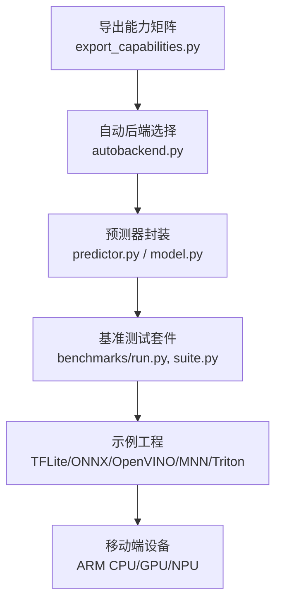
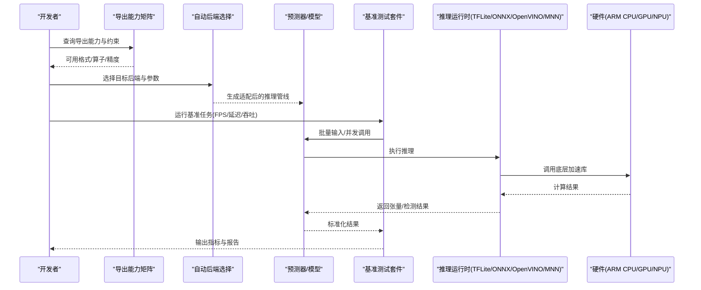
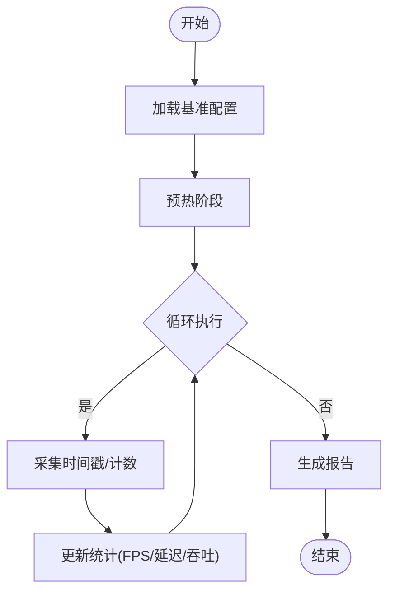
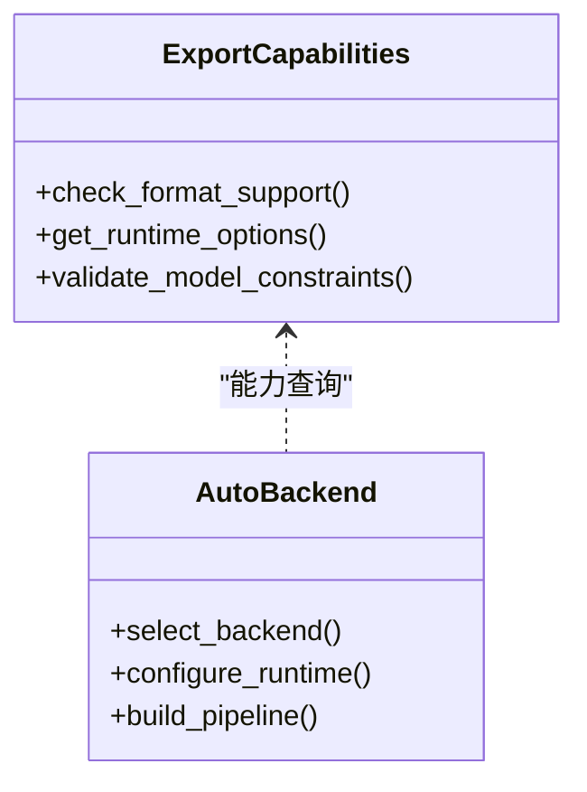
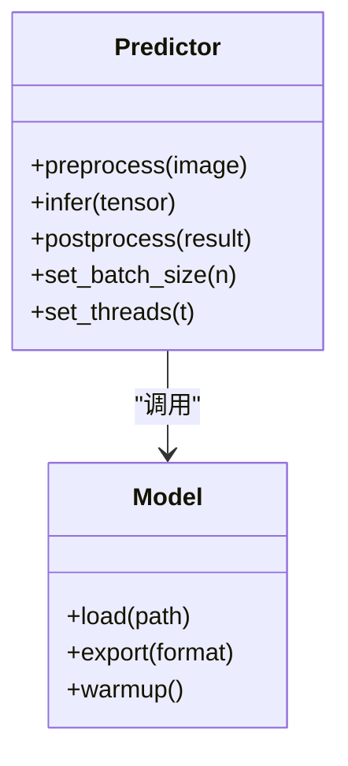

# 移动端性能调优

<cite>
**本文引用的文件**
- [benchmarks/run.py](file://benchmarks/run.py)
- [benchmarks/suite.py](file://benchmarks/suite.py)
- [benchmarks/benchmark_molora_dispatch.py](file://benchmarks/benchmark_molora_dispatch.py)
- [benchmarks/benchmark_mot_dispatch.py](file://benchmarks/benchmark_mot_dispatch.py)
- [ultralytics/utils/benchmarks.py](file://ultralytics/utils/benchmarks.py)
- [ultralytics/engine/predictor.py](file://ultralytics/engine/predictor.py)
- [ultralytics/engine/model.py](file://ultralytics/engine/model.py)
- [ultralytics/nn/autobackend.py](file://ultralytics/nn/autobackend.py)
- [ultralytics/utils/autodevice.py](file://ultralytics/utils/autodevice.py)
- [ultralytics/utils/export_capabilities.py](file://ultralytics/utils/export_capabilities.py)
- [examples/YOLO-Master-Cross-Platform-Edge-Deployment/TECHNICAL_REPORT.md](file://examples/YOLO-Master-Cross-Platform-Edge-Deployment/TECHNICAL_REPORT.md)
- [examples/YOLO-Master-Edge-Deployment/export_edge_models.py](file://examples/YOLO-Master-Edge-Deployment/export_edge_models.py)
- [examples/YOLO-Master-Edge-Deployment/edge_utils.py](file://examples/YOLO-Master-Edge-Deployment/edge_utils.py)
- [examples/YOLOv8-TFLite-Python/main.py](file://examples/YOLOv8-TFLite-Python/main.py)
- [examples/YOLOv8-ONNXRuntime-Rust/Cargo.toml](file://examples/YOLOv8-ONNXRuntime-Rust/Cargo.toml)
- [examples/YOLOv8-OpenVINO-CPP-Inference/main.cc](file://examples/YOLOv8-OpenVINO-CPP-Inference/main.cc)
- [examples/YOLOv8-OpenVINO-CPP-Inference/inference.cc](file://examples/YOLOv8-OpenVINO-CPP-Inference/inference.cc)
- [examples/YOLOv8-ONNXRuntime-CPP/inference.cpp](file://examples/YOLOv8-ONNXRuntime-CPP/inference.cpp)
- [examples/YOLOv8-ONNXRuntime-CPP/main.cpp](file://examples/YOLOv8-ONNXRuntime-CPP/main.cpp)
- [examples/YOLOv8-MNN-CPP/main.cpp](file://examples/YOLOv8-MNN-CPP/main.cpp)
- [examples/YOLO11-Triton-CPP/inference.cpp](file://examples/YOLO11-Triton-CPP/inference.cpp)
- [examples/YOLO11-Triton-CPP/main.cpp](file://examples/YOLO11-Triton-CPP/main.cpp)
- [tests/test_benchmark_suite.py](file://tests/test_benchmark_suite.py)
- [tests/test_autobackend_warmup.py](file://tests/test_autobackend_warmup.py)
</cite>

## 目录
1. [简介](#简介)
2. [项目结构](#项目结构)
3. [核心组件](#核心组件)
4. [架构总览](#架构总览)
5. [详细组件分析](#详细组件分析)
6. [依赖关系分析](#依赖关系分析)
7. [性能考量](#性能考量)
8. [故障排查指南](#故障排查指南)
9. [结论](#结论)
10. [附录](#附录)

## 简介
本文件面向YOLO-Master在移动端的性能调优，系统化阐述以下主题：
- 移动端性能分析方法：CPU/GPU利用率监控、内存使用分析与电池消耗评估
- 推理优化技术：批处理优化、线程池管理、异步推理实现
- 多平台优化策略：ARM CPU、GPU、NPU与专用AI加速器（如TFLite、ONNX Runtime、OpenVINO、MNN等）
- 基准测试套件使用方法：FPS测量、延迟分析与吞吐量测试
- 内存管理最佳实践：内存池设计、对象复用与垃圾回收优化
- 启动优化：热启动与冷启动时间减少策略
- 诊断工具与调试技巧：定位瓶颈、验证优化效果

## 项目结构
本项目围绕“模型导出—端侧推理—基准评测”的闭环构建。与移动端性能相关的关键路径包括：
- 导出能力矩阵与自动后端选择，决定目标设备可用的推理引擎与算子支持
- 端到端预测器封装，统一输入预处理、推理执行与后处理流程
- 基准测试套件，提供可复用的FPS、延迟与吞吐度量
- 示例工程覆盖主流移动端推理框架（TFLite、ONNX Runtime、OpenVINO、MNN、Triton等），便于跨平台对比

图表来源
- [ultralytics/utils/export_capabilities.py](file://ultralytics/utils/export_capabilities.py)
- [ultralytics/nn/autobackend.py](file://ultralytics/nn/autobackend.py)
- [ultralytics/engine/predictor.py](file://ultralytics/engine/predictor.py)
- [ultralytics/engine/model.py](file://ultralytics/engine/model.py)
- [benchmarks/run.py](file://benchmarks/run.py)
- [benchmarks/suite.py](file://benchmarks/suite.py)

章节来源
- [ultralytics/utils/export_capabilities.py](file://ultralytics/utils/export_capabilities.py)
- [ultralytics/nn/autobackend.py](file://ultralytics/nn/autobackend.py)
- [ultralytics/engine/predictor.py](file://ultralytics/engine/predictor.py)
- [ultralytics/engine/model.py](file://ultralytics/engine/model.py)
- [benchmarks/run.py](file://benchmarks/run.py)
- [benchmarks/suite.py](file://benchmarks/suite.py)

## 核心组件
- 导出能力矩阵与自动后端
  - 通过能力矩阵判断目标设备支持的导出格式与运行时特性，驱动自动后端选择
  - 关键文件：[ultralytics/utils/export_capabilities.py](file://ultralytics/utils/export_capabilities.py)、[ultralytics/nn/autobackend.py](file://ultralytics/nn/autobackend.py)
- 预测器与模型封装
  - 统一封装预处理、推理、后处理与结果解析，屏蔽不同后端差异
  - 关键文件：[ultralytics/engine/predictor.py](file://ultralytics/engine/predictor.py)、[ultralytics/engine/model.py](file://ultralytics/engine/model.py)
- 基准测试套件
  - 提供统一的基准入口与用例编排，支持FPS、延迟、吞吐等指标采集
  - 关键文件：[benchmarks/run.py](file://benchmarks/run.py)、[benchmarks/suite.py](file://benchmarks/suite.py)、[ultralytics/utils/benchmarks.py](file://ultralytics/utils/benchmarks.py)
- 移动端示例工程
  - TFLite、ONNX Runtime、OpenVINO、MNN、Triton等示例，覆盖Python与C++/Rust实现
  - 关键文件：见“项目结构”中的示例路径

章节来源
- [ultralytics/utils/export_capabilities.py](file://ultralytics/utils/export_capabilities.py)
- [ultralytics/nn/autobackend.py](file://ultralytics/nn/autobackend.py)
- [ultralytics/engine/predictor.py](file://ultralytics/engine/predictor.py)
- [ultralytics/engine/model.py](file://ultralytics/engine/model.py)
- [benchmarks/run.py](file://benchmarks/run.py)
- [benchmarks/suite.py](file://benchmarks/suite.py)
- [ultralytics/utils/benchmarks.py](file://ultralytics/utils/benchmarks.py)

## 架构总览
下图展示从模型导出到端侧推理与基准评测的整体流程，以及各层职责与交互。

图表来源
- [ultralytics/utils/export_capabilities.py](file://ultralytics/utils/export_capabilities.py)
- [ultralytics/nn/autobackend.py](file://ultralytics/nn/autobackend.py)
- [ultralytics/engine/predictor.py](file://ultralytics/engine/predictor.py)
- [benchmarks/run.py](file://benchmarks/run.py)
- [benchmarks/suite.py](file://benchmarks/suite.py)

## 详细组件分析

### 组件A：基准测试套件（FPS、延迟、吞吐）
- 功能要点
  - 统一入口run.py与用例编排suite.py，支持多场景、多模型、多后端对比
  - 指标采集：FPS、P50/P95/P99延迟、吞吐、内存峰值（由具体实现扩展）
  - 可扩展：新增用例只需遵循suite接口规范
- 使用建议
  - 固定输入尺寸与批次大小，确保可比性
  - 预热阶段排除冷启动影响，统计稳定区间
  - 多次重复取中位数或分位数，降低抖动

图表来源
- [benchmarks/run.py](file://benchmarks/run.py)
- [benchmarks/suite.py](file://benchmarks/suite.py)
- [ultralytics/utils/benchmarks.py](file://ultralytics/utils/benchmarks.py)

章节来源
- [benchmarks/run.py](file://benchmarks/run.py)
- [benchmarks/suite.py](file://benchmarks/suite.py)
- [ultralytics/utils/benchmarks.py](file://ultralytics/utils/benchmarks.py)
- [tests/test_benchmark_suite.py](file://tests/test_benchmark_suite.py)

### 组件B：自动后端选择与导出能力矩阵
- 功能要点
  - 根据设备能力与模型约束，选择最优导出格式与运行时（TFLite/ONNX/OpenVINO/MNN等）
  - 校验算子支持与精度模式，避免运行时失败
- 使用建议
  - 优先选择目标设备原生运行时（如Android NNAPI、iOS CoreML、RKNN等）
  - 针对移动端限制，启用量化与图优化选项

图表来源
- [ultralytics/utils/export_capabilities.py](file://ultralytics/utils/export_capabilities.py)
- [ultralytics/nn/autobackend.py](file://ultralytics/nn/autobackend.py)

章节来源
- [ultralytics/utils/export_capabilities.py](file://ultralytics/utils/export_capabilities.py)
- [ultralytics/nn/autobackend.py](file://ultralytics/nn/autobackend.py)

### 组件C：预测器与模型封装
- 功能要点
  - 统一预处理、推理、后处理与结果解析
  - 支持多后端切换与参数透传（如batch size、线程数、精度）
- 使用建议
  - 合理设置batch size与线程数，平衡吞吐与延迟
  - 对长视频流采用流水线并行，避免阻塞

图表来源
- [ultralytics/engine/predictor.py](file://ultralytics/engine/predictor.py)
- [ultralytics/engine/model.py](file://ultralytics/engine/model.py)

章节来源
- [ultralytics/engine/predictor.py](file://ultralytics/engine/predictor.py)
- [ultralytics/engine/model.py](file://ultralytics/engine/model.py)

### 组件D：移动端示例工程（TFLite/ONNX/OpenVINO/MNN/Triton）
- 功能要点
  - 提供多语言、多框架的推理示例，覆盖Python与C++/Rust
  - 演示如何在移动端设备上加载模型、执行推理与可视化结果
- 使用建议
  - 优先使用C++/Rust以获得更低开销与更好控制
  - 结合系统级工具进行性能分析（如Android Studio Profiler、Xcode Instruments）

章节来源
- [examples/YOLOv8-TFLite-Python/main.py](file://examples/YOLOv8-TFLite-Python/main.py)
- [examples/YOLOv8-ONNXRuntime-Rust/Cargo.toml](file://examples/YOLOv8-ONNXRuntime-Rust/Cargo.toml)
- [examples/YOLOv8-OpenVINO-CPP-Inference/main.cc](file://examples/YOLOv8-OpenVINO-CPP-Inference/main.cc)
- [examples/YOLOv8-OpenVINO-CPP-Inference/inference.cc](file://examples/YOLOv8-OpenVINO-CPP-Inference/inference.cc)
- [examples/YOLOv8-ONNXRuntime-CPP/inference.cpp](file://examples/YOLOv8-ONNXRuntime-CPP/inference.cpp)
- [examples/YOLOv8-ONNXRuntime-CPP/main.cpp](file://examples/YOLOv8-ONNXRuntime-CPP/main.cpp)
- [examples/YOLOv8-MNN-CPP/main.cpp](file://examples/YOLOv8-MNN-CPP/main.cpp)
- [examples/YOLO11-Triton-CPP/inference.cpp](file://examples/YOLO11-Triton-CPP/inference.cpp)
- [examples/YOLO11-Triton-CPP/main.cpp](file://examples/YOLO11-Triton-CPP/main.cpp)

## 依赖关系分析
- 模块耦合
  - 导出能力矩阵为自动后端选择提供依据，后者再驱动预测器与基准套件
  - 基准套件依赖预测器与模型封装，屏蔽后端差异
- 外部依赖
  - 推理运行时（TFLite、ONNX Runtime、OpenVINO、MNN、Triton等）
  - 系统级性能工具（CPU/GPU/NPU计数器、内存与功耗监控）

图表来源
- [ultralytics/utils/export_capabilities.py](file://ultralytics/utils/export_capabilities.py)
- [ultralytics/nn/autobackend.py](file://ultralytics/nn/autobackend.py)
- [ultralytics/engine/predictor.py](file://ultralytics/engine/predictor.py)
- [benchmarks/run.py](file://benchmarks/run.py)

章节来源
- [ultralytics/utils/export_capabilities.py](file://ultralytics/utils/export_capabilities.py)
- [ultralytics/nn/autobackend.py](file://ultralytics/nn/autobackend.py)
- [ultralytics/engine/predictor.py](file://ultralytics/engine/predictor.py)
- [benchmarks/run.py](file://benchmarks/run.py)

## 性能考量
- CPU/GPU利用率监控
  - 使用系统工具（如Android Studio Profiler、Xcode Instruments、Linux perf）观察CPU/GPU占用与热点
  - 关注线程竞争与上下文切换开销
- 内存使用分析
  - 监控峰值内存与分配频率，避免频繁分配/释放
  - 使用内存池与对象复用减少GC压力
- 电池消耗评估
  - 结合功耗计或系统功耗接口，评估高负载与空闲态功耗
  - 优化调度策略，避免长时间满载
- 批处理优化
  - 合理设置batch size，平衡吞吐与延迟
  - 使用零拷贝与内存对齐提升数据搬运效率
- 线程池管理
  - 根据设备核心数配置线程池大小，避免过度并行
  - 区分IO与计算线程，避免阻塞
- 异步推理实现
  - 使用生产者-消费者队列，流水线化预处理、推理与后处理
  - 保证线程安全与结果顺序一致性

## 故障排查指南
- 常见问题
  - 导出失败：检查算子支持与精度模式
  - 运行时崩溃：核对输入尺寸、数据类型与内存布局
  - 性能不达预期：分析热点函数、内存分配与线程竞争
- 调试技巧
  - 使用基准套件逐步缩小问题范围
  - 开启详细日志与性能事件采集
  - 对比不同后端与参数组合，定位瓶颈

章节来源
- [tests/test_benchmark_suite.py](file://tests/test_benchmark_suite.py)
- [tests/test_autobackend_warmup.py](file://tests/test_autobackend_warmup.py)

## 结论
通过系统化的性能分析方法与优化技术，结合多平台推理框架与基准测试套件，可在移动端实现YOLO-Master的高性能部署。关键在于：
- 选择合适的导出格式与运行时
- 精细调优批处理、线程与异步策略
- 持续监控CPU/GPU/内存/功耗，迭代优化

## 附录
- 跨平台部署技术报告参考
- 边缘部署导出脚本与工具集
- 移动端推理示例工程清单

章节来源
- [examples/YOLO-Master-Cross-Platform-Edge-Deployment/TECHNICAL_REPORT.md](file://examples/YOLO-Master-Cross-Platform-Edge-Deployment/TECHNICAL_REPORT.md)
- [examples/YOLO-Master-Edge-Deployment/export_edge_models.py](file://examples/YOLO-Master-Edge-Deployment/export_edge_models.py)
- [examples/YOLO-Master-Edge-Deployment/edge_utils.py](file://examples/YOLO-Master-Edge-Deployment/edge_utils.py)