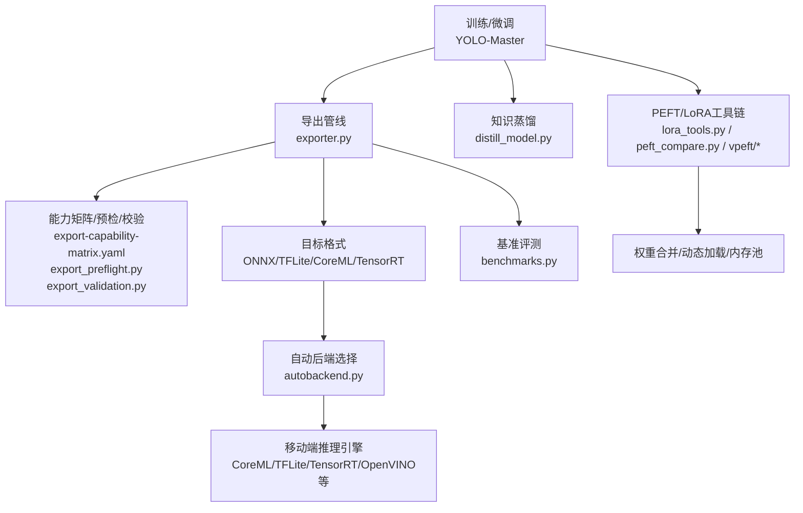
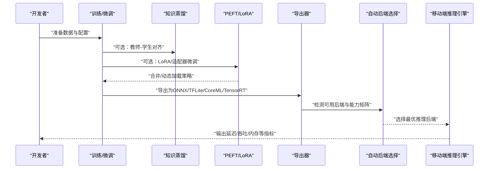
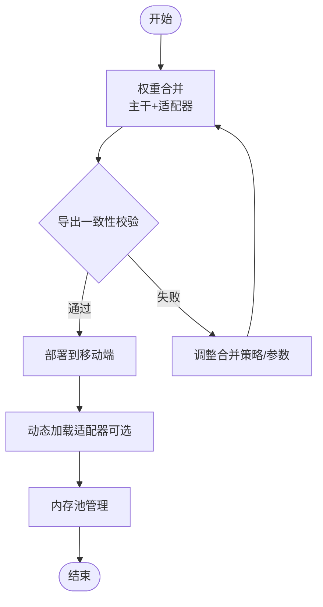
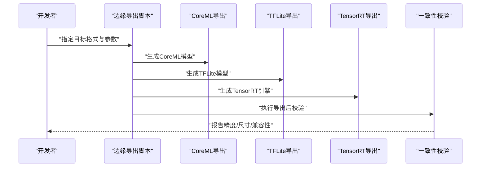
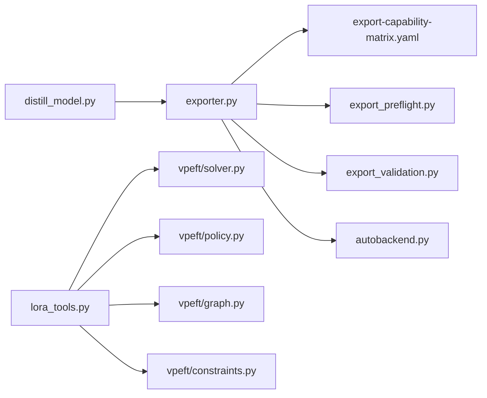

# 移动端模型优化

<cite>
**本文引用的文件**
- [README.md](file://README.md)
- [export_edge_models.py](file://examples/YOLO-Master-Edge-Deployment/export_edge_models.py)
- [edge_utils.py](file://examples/YOLO-Master-Edge-Deployment/edge_utils.py)
- [validate_edge_outputs.py](file://examples/YOLO-Master-Edge-Deployment/validate_edge_outputs.py)
- [coreml_export/main.py](file://examples/YOLO-Master-Cross-Platform-Edge-Deployment/coreml_export/main.py)
- [jetson/build.sh](file://examples/YOLO-Master-Cross-Platform-Edge-Deployment/jetson/build.sh)
- [jetson/run_infer.sh](file://examples/YOLO-Master-Cross-Platform-Edge-Deployment/jetson/run_infer.sh)
- [mac/build.sh](file://examples/YOLO-Master-Cross-Platform-Edge-Deployment/mac/build.sh)
- [mac/run_infer.sh](file://examples/YOLO-Master-Cross-Platform-Edge-Deployment/mac/run_infer.sh)
- [TECHNICAL_REPORT.md](file://examples/YOLO-Master-Cross-Platform-Edge-Deployment/TECHNICAL_REPORT.md)
- [README.md](file://examples/YOLO-Master-Cross-Platform-Edge-Deployment/README.md)
- [export-capability-matrix.yaml](file://ultralytics/cfg/export-capability-matrix.yaml)
- [exporter.py](file://ultralytics/engine/exporter.py)
- [autobackend.py](file://ultralytics/nn/autobackend.py)
- [benchmarks.py](file://ultralytics/utils/benchmarks.py)
- [export_capabilities.py](file://ultralytics/utils/export_capabilities.py)
- [export_preflight.py](file://ultralytics/utils/export_preflight.py)
- [export_validation.py](file://ultralytics/utils/export_validation.py)
- [distill_model.py](file://ultralytics/nn/distill_model.py)
- [molora_guide.md](file://docs/molora_guide.md)
- [LoRA_Quickstart.md](file://docs/LoRA_Quickstart.md)
- [lora_tools.py](file://agent/runtime/cli/lora_tools.py)
- [peft_compare.py](file://agent/runtime/cli/peft_compare.py)
- [test_molora_merge_semantics.py](file://tests/test_molora_merge_semantics.py)
- [test_molora_dtype.py](file://tests/test_molora_dtype.py)
- [test_peft_adapters.py](file://tests/test_peft_adapters.py)
- [test_vpeft.py](file://tests/test_vpeft.py)
- [vpeft/solver.py](file://ultralytics/vpeft/solver.py)
- [vpeft/policy.py](file://ultralytics/vpeft/policy.py)
- [vpeft/graph.py](file://ultralytics/vpeft/graph.py)
- [vpeft/constraints.py](file://ultralytics/vpeft/constraints.py)
</cite>

## 目录
1. [简介](#简介)
2. [项目结构](#项目结构)
3. [核心组件](#核心组件)
4. [架构总览](#架构总览)
5. [详细组件分析](#详细组件分析)
6. [依赖分析](#依赖分析)
7. [性能考量](#性能考量)
8. [故障排查指南](#故障排查指南)
9. [结论](#结论)
10. [附录](#附录)

## 简介
本技术文档聚焦于YOLO-Master在移动端的模型优化，覆盖量化（INT8、FP16与混合精度）、剪枝与压缩（结构化与非结构化剪枝、知识蒸馏）、PEFT/LoRA的移动端部署优化（权重合并、动态加载、内存池管理），以及移动端专用模型格式转换工具链（CoreML、TFLite、TensorRT）的参数调优策略。同时给出推理引擎选择策略、平台最佳实践、大小与精度的权衡分析与基准测试方法，帮助读者在资源受限设备上实现高吞吐、低延迟、低功耗的部署方案。

## 项目结构
仓库围绕“训练/导出/验证/部署”的全链路构建：
- 导出与边缘部署示例位于 examples/YOLO-Master-Edge-Deployment 与 examples/YOLO-Master-Cross-Platform-Edge-Deployment，提供跨平台脚本与参考实现。
- 核心导出能力矩阵与预检/校验逻辑位于 ultralytics/cfg 与 ultralytics/utils/export*。
- 自动后端选择与运行时适配位于 ultralytics/nn/autobackend.py。
- 基准评测工具位于 ultralytics/utils/benchmarks.py。
- 知识蒸馏模块位于 ultralytics/nn/distill_model.py。
- PEFT/LoRA相关工具与测试位于 agent/runtime/cli 与 tests 目录，以及 vpeft 子包。

图表来源
- [exporter.py](file://ultralytics/engine/exporter.py)
- [export-capability-matrix.yaml](file://ultralytics/cfg/export-capability-matrix.yaml)
- [export_preflight.py](file://ultralytics/utils/export_preflight.py)
- [export_validation.py](file://ultralytics/utils/export_validation.py)
- [autobackend.py](file://ultralytics/nn/autobackend.py)
- [benchmarks.py](file://ultralytics/utils/benchmarks.py)
- [distill_model.py](file://ultralytics/nn/distill_model.py)
- [lora_tools.py](file://agent/runtime/cli/lora_tools.py)
- [peft_compare.py](file://agent/runtime/cli/peft_compare.py)
- [vpeft/solver.py](file://ultralytics/vpeft/solver.py)
- [vpeft/policy.py](file://ultralytics/vpeft/policy.py)
- [vpeft/graph.py](file://ultralytics/vpeft/graph.py)
- [vpeft/constraints.py](file://ultralytics/vpeft/constraints.py)

章节来源
- [README.md](file://README.md)
- [export_edge_models.py](file://examples/YOLO-Master-Edge-Deployment/export_edge_models.py)
- [edge_utils.py](file://examples/YOLO-Master-Edge-Deployment/edge_utils.py)
- [validate_edge_outputs.py](file://examples/YOLO-Master-Edge-Deployment/validate_edge_outputs.py)
- [coreml_export/main.py](file://examples/YOLO-Master-Cross-Platform-Edge-Deployment/coreml_export/main.py)
- [jetson/build.sh](file://examples/YOLO-Master-Cross-Platform-Edge-Deployment/jetson/build.sh)
- [jetson/run_infer.sh](file://examples/YOLO-Master-Cross-Platform-Edge-Deployment/jetson/run_infer.sh)
- [mac/build.sh](file://examples/YOLO-Master-Cross-Platform-Edge-Deployment/mac/build.sh)
- [mac/run_infer.sh](file://examples/YOLO-Master-Cross-Platform-Edge-Deployment/mac/run_infer.sh)
- [TECHNICAL_REPORT.md](file://examples/YOLO-Master-Cross-Platform-Edge-Deployment/TECHNICAL_REPORT.md)
- [README.md](file://examples/YOLO-Master-Cross-Platform-Edge-Deployment/README.md)

## 核心组件
- 导出与能力矩阵：通过 export-capability-matrix.yaml 定义各后端/格式支持度，配合 exporter.py 统一入口进行导出；export_preflight.py 做前置检查，export_validation.py 做导出后一致性校验。
- 自动后端选择：autobackend.py 根据目标设备与可用库自动选择最优推理后端，屏蔽底层差异。
- 基准评测：benchmarks.py 提供端到端延迟、吞吐、内存占用等指标采集，便于量化/剪枝前后对比。
- 知识蒸馏：distill_model.py 提供教师-学生网络对齐与损失组合，用于移动端轻量化。
- PEFT/LoRA：lora_tools.py 与 peft_compare.py 提供LoRA微调、评估与对比；vpeft 子包提供策略、图优化与约束求解，支撑移动端权重合并与动态加载。

章节来源
- [export-capability-matrix.yaml](file://ultralytics/cfg/export-capability-matrix.yaml)
- [exporter.py](file://ultralytics/engine/exporter.py)
- [export_preflight.py](file://ultralytics/utils/export_preflight.py)
- [export_validation.py](file://ultralytics/utils/export_validation.py)
- [autobackend.py](file://ultralytics/nn/autobackend.py)
- [benchmarks.py](file://ultralytics/utils/benchmarks.py)
- [distill_model.py](file://ultralytics/nn/distill_model.py)
- [lora_tools.py](file://agent/runtime/cli/lora_tools.py)
- [peft_compare.py](file://agent/runtime/cli/peft_compare.py)
- [vpeft/solver.py](file://ultralytics/vpeft/solver.py)
- [vpeft/policy.py](file://ultralytics/vpeft/policy.py)
- [vpeft/graph.py](file://ultralytics/vpeft/graph.py)
- [vpeft/constraints.py](file://ultralytics/vpeft/constraints.py)

## 架构总览
下图展示从训练到移动端部署的关键路径，包括量化、剪枝、蒸馏、PEFT/LoRA与多后端导出。

图表来源
- [exporter.py](file://ultralytics/engine/exporter.py)
- [autobackend.py](file://ultralytics/nn/autobackend.py)
- [distill_model.py](file://ultralytics/nn/distill_model.py)
- [lora_tools.py](file://agent/runtime/cli/lora_tools.py)
- [peft_compare.py](file://agent/runtime/cli/peft_compare.py)

## 详细组件分析

### 量化与混合精度（INT8、FP16、混合精度）
- 原理要点
  - INT8量化：将权重与激活以8位整数表示，显著降低存储与带宽需求，需校准集或静态/动态校准流程保证精度。
  - FP16半精度：减少内存与带宽占用，提升部分硬件并行计算效率，注意数值稳定性与溢出处理。
  - 混合精度：关键算子保持FP32/FP16混合，平衡精度与速度。
- 实现与集成
  - 导出阶段结合能力矩阵与预检，确保目标后端支持相应量化选项。
  - 使用基准工具对量化前后进行延迟、吞吐、精度对比。
- 建议流程
  - 先以FP16导出并验证，再引入INT8量化与校准，最后评估混合精度收益。

章节来源
- [export-capability-matrix.yaml](file://ultralytics/cfg/export-capability-matrix.yaml)
- [exporter.py](file://ultralytics/engine/exporter.py)
- [export_preflight.py](file://ultralytics/utils/export_preflight.py)
- [export_validation.py](file://ultralytics/utils/export_validation.py)
- [benchmarks.py](file://ultralytics/utils/benchmarks.py)

### 剪枝与压缩（结构化/非结构化剪枝、知识蒸馏）
- 结构化剪枝：按通道/层维度移除冗余，利于硬件加速与稀疏卷积优化。
- 非结构化剪枝：细粒度权重置零，需稀疏推理支持或转换为结构化形式。
- 知识蒸馏：通过教师模型指导轻量学生模型学习，提高小模型精度。
- 工程落地
  - 在训练或后训练阶段执行剪枝，随后导出并验证一致性。
  - 蒸馏作为独立流水线，可与剪枝串联形成“蒸馏+剪枝”的组合优化。

章节来源
- [distill_model.py](file://ultralytics/nn/distill_model.py)
- [exporter.py](file://ultralytics/engine/exporter.py)
- [export_validation.py](file://ultralytics/utils/export_validation.py)

### LoRA与PEFT在移动端的部署优化
- 权重合并
  - 将LoRA/适配器权重与主干融合，减少运行时开销，适合离线部署。
  - 通过工具链完成合并与导出，确保目标后端兼容。
- 动态加载
  - 在运行时按需加载不同任务/场景的适配器，降低常驻内存。
  - 结合内存池管理，避免频繁分配释放带来的抖动。
- 策略与约束
  - vpeft 提供策略规划、图优化与约束求解，辅助生成可部署的合并/加载计划。
- 评估与对比
  - 使用对比工具对不同rank/策略进行精度与性能评估，选择最优方案。

图表来源
- [lora_tools.py](file://agent/runtime/cli/lora_tools.py)
- [peft_compare.py](file://agent/runtime/cli/peft_compare.py)
- [vpeft/solver.py](file://ultralytics/vpeft/solver.py)
- [vpeft/policy.py](file://ultralytics/vpeft/policy.py)
- [vpeft/graph.py](file://ultralytics/vpeft/graph.py)
- [vpeft/constraints.py](file://ultralytics/vpeft/constraints.py)

章节来源
- [lora_tools.py](file://agent/runtime/cli/lora_tools.py)
- [peft_compare.py](file://agent/runtime/cli/peft_compare.py)
- [test_molora_merge_semantics.py](file://tests/test_molora_merge_semantics.py)
- [test_molora_dtype.py](file://tests/test_molora_dtype.py)
- [test_peft_adapters.py](file://tests/test_peft_adapters.py)
- [test_vpeft.py](file://tests/test_vpeft.py)
- [vpeft/solver.py](file://ultralytics/vpeft/solver.py)
- [vpeft/policy.py](file://ultralytics/vpeft/policy.py)
- [vpeft/graph.py](file://ultralytics/vpeft/graph.py)
- [vpeft/constraints.py](file://ultralytics/vpeft/constraints.py)

### 移动端模型格式转换工具链（CoreML、TFLite、TensorRT）
- CoreML（iOS/macOS）
  - 使用示例脚本进行导出与验证，关注输入形状、数据类型与算子支持。
- TFLite（Android/iOS通用）
  - 结合能力矩阵与预检，选择合适的量化与优化选项，并进行一致性校验。
- TensorRT（NVIDIA Jetson/桌面GPU）
  - 针对Jetson等平台提供构建与运行脚本，优化内核与内存布局。
- 参数调优建议
  - 优先启用FP16，必要时引入INT8校准；控制动态形状范围；裁剪不必要分支；开启后端特定优化开关。

图表来源
- [coreml_export/main.py](file://examples/YOLO-Master-Cross-Platform-Edge-Deployment/coreml_export/main.py)
- [export_edge_models.py](file://examples/YOLO-Master-Edge-Deployment/export_edge_models.py)
- [jetson/build.sh](file://examples/YOLO-Master-Cross-Platform-Edge-Deployment/jetson/build.sh)
- [jetson/run_infer.sh](file://examples/YOLO-Master-Cross-Platform-Edge-Deployment/jetson/run_infer.sh)
- [mac/build.sh](file://examples/YOLO-Master-Cross-Platform-Edge-Deployment/mac/build.sh)
- [mac/run_infer.sh](file://examples/YOLO-Master-Cross-Platform-Edge-Deployment/mac/run_infer.sh)
- [validate_edge_outputs.py](file://examples/YOLO-Master-Edge-Deployment/validate_edge_outputs.py)

章节来源
- [coreml_export/main.py](file://examples/YOLO-Master-Cross-Platform-Edge-Deployment/coreml_export/main.py)
- [export_edge_models.py](file://examples/YOLO-Master-Edge-Deployment/export_edge_models.py)
- [edge_utils.py](file://examples/YOLO-Master-Edge-Deployment/edge_utils.py)
- [validate_edge_outputs.py](file://examples/YOLO-Master-Edge-Deployment/validate_edge_outputs.py)
- [jetson/build.sh](file://examples/YOLO-Master-Cross-Platform-Edge-Deployment/jetson/build.sh)
- [jetson/run_infer.sh](file://examples/YOLO-Master-Cross-Platform-Edge-Deployment/jetson/run_infer.sh)
- [mac/build.sh](file://examples/YOLO-Master-Cross-Platform-Edge-Deployment/mac/build.sh)
- [mac/run_infer.sh](file://examples/YOLO-Master-Cross-Platform-Edge-Deployment/mac/run_infer.sh)
- [TECHNICAL_REPORT.md](file://examples/YOLO-Master-Cross-Platform-Edge-Deployment/TECHNICAL_REPORT.md)
- [README.md](file://examples/YOLO-Master-Cross-Platform-Edge-Deployment/README.md)

### 推理引擎选择策略与平台最佳实践
- 选择原则
  - 基于能力矩阵与预检结果，匹配设备算力、内存与功耗预算。
  - iOS/macOS优先CoreML；Android优先TFLite；NVIDIA Jetson优先TensorRT；OpenVINO适用于Intel平台。
- 最佳实践
  - 固定输入尺寸以减少动态分支；关闭不必要的调试输出；利用批处理与缓存；合理设置线程数与内存池。
- 自动后端
  - autobackend.py 根据环境探测与能力矩阵选择最优后端，简化跨平台适配。

章节来源
- [export-capability-matrix.yaml](file://ultralytics/cfg/export-capability-matrix.yaml)
- [export_preflight.py](file://ultralytics/utils/export_preflight.py)
- [autobackend.py](file://ultralytics/nn/autobackend.py)

### 移动端模型大小与精度权衡分析
- 权衡维度
  - 模型体积 vs. 精度：量化与剪枝显著减小体积，但可能带来精度下降。
  - 延迟 vs. 吞吐：批处理与并行化提升吞吐，但增加延迟。
  - 功耗 vs. 性能：降低精度与频率可减少功耗，但影响实时性。
- 分析方法
  - 使用基准工具在不同配置下采集指标，绘制帕累托曲线，选择满足业务SLA的方案。
  - 结合导出校验报告，确保精度退化在可接受范围内。

章节来源
- [benchmarks.py](file://ultralytics/utils/benchmarks.py)
- [export_validation.py](file://ultralytics/utils/export_validation.py)

### 性能基准测试方法
- 指标
  - 端到端延迟（ms）、吞吐（FPS）、峰值内存（MB）、CPU/GPU利用率。
- 流程
  - 预热若干步，统计稳定期指标；多次采样取中位数/分位数；记录环境与随机种子。
- 对比
  - 量化前后、剪枝前后、蒸馏前后分别对比，定位瓶颈环节。

章节来源
- [benchmarks.py](file://ultralytics/utils/benchmarks.py)

## 依赖分析
- 导出与后端
  - exporter.py 依赖能力矩阵与预检/校验模块，统一封装导出流程。
  - autobackend.py 负责运行时后端选择，屏蔽平台差异。
- PEFT/LoRA
  - lora_tools.py 与 peft_compare.py 提供工具链；vpeft 子包提供策略与约束求解。
- 蒸馏
  - distill_model.py 提供教师-学生对齐与损失组合。

图表来源
- [exporter.py](file://ultralytics/engine/exporter.py)
- [export-capability-matrix.yaml](file://ultralytics/cfg/export-capability-matrix.yaml)
- [export_preflight.py](file://ultralytics/utils/export_preflight.py)
- [export_validation.py](file://ultralytics/utils/export_validation.py)
- [autobackend.py](file://ultralytics/nn/autobackend.py)
- [lora_tools.py](file://agent/runtime/cli/lora_tools.py)
- [vpeft/solver.py](file://ultralytics/vpeft/solver.py)
- [vpeft/policy.py](file://ultralytics/vpeft/policy.py)
- [vpeft/graph.py](file://ultralytics/vpeft/graph.py)
- [vpeft/constraints.py](file://ultralytics/vpeft/constraints.py)
- [distill_model.py](file://ultralytics/nn/distill_model.py)

章节来源
- [exporter.py](file://ultralytics/engine/exporter.py)
- [export-capability-matrix.yaml](file://ultralytics/cfg/export-capability-matrix.yaml)
- [export_preflight.py](file://ultralytics/utils/export_preflight.py)
- [export_validation.py](file://ultralytics/utils/export_validation.py)
- [autobackend.py](file://ultralytics/nn/autobackend.py)
- [lora_tools.py](file://agent/runtime/cli/lora_tools.py)
- [vpeft/solver.py](file://ultralytics/vpeft/solver.py)
- [vpeft/policy.py](file://ultralytics/vpeft/policy.py)
- [vpeft/graph.py](file://ultralytics/vpeft/graph.py)
- [vpeft/constraints.py](file://ultralytics/vpeft/constraints.py)
- [distill_model.py](file://ultralytics/nn/distill_model.py)

## 性能考量
- 量化优先顺序：FP16 → INT8（带校准）→ 混合精度（关键路径）。
- 剪枝策略：优先结构化剪枝以获得更好硬件加速效果；非结构化剪枝需评估稀疏推理支持。
- 蒸馏时机：可在预训练后、微调前或微调后进行，视数据量与任务复杂度而定。
- 内存与缓存：启用内存池、复用张量缓冲区、减少临时对象创建。
- 批处理与并发：根据设备特性调整批大小与线程数，避免过度竞争。

[本节为通用指导，不直接分析具体文件]

## 故障排查指南
- 导出失败
  - 检查能力矩阵是否支持目标格式与量化选项；查看预检日志定位不支持的算子或形状。
- 精度异常
  - 核对导出一致性校验报告；确认校准集分布与预处理一致；检查LoRA合并是否正确。
- 运行时崩溃
  - 确认后端版本与驱动；检查输入形状与数据类型；关闭调试输出以提升稳定性。
- 性能不达预期
  - 使用基准工具定位热点算子；尝试调整批大小、线程数与内存池；考虑替换为更高效的算子实现。

章节来源
- [export-capability-matrix.yaml](file://ultralytics/cfg/export-capability-matrix.yaml)
- [export_preflight.py](file://ultralytics/utils/export_preflight.py)
- [export_validation.py](file://ultralytics/utils/export_validation.py)
- [benchmarks.py](file://ultralytics/utils/benchmarks.py)

## 结论
通过在导出阶段整合能力矩阵与预检/校验，结合量化、剪枝、蒸馏与PEFT/LoRA的多维优化，YOLO-Master能够在移动端实现体积与精度的良好平衡。自动后端选择进一步简化了跨平台适配。建议以基准测试为依据，迭代优化量化与剪枝策略，并在不同平台上验证最终部署效果。

[本节为总结性内容，不直接分析具体文件]

## 附录
- 快速参考
  - 导出入口：exporter.py
  - 能力矩阵：export-capability-matrix.yaml
  - 预检/校验：export_preflight.py、export_validation.py
  - 自动后端：autobackend.py
  - 基准评测：benchmarks.py
  - 知识蒸馏：distill_model.py
  - LoRA/PEFT工具：lora_tools.py、peft_compare.py、vpeft/*
- 示例脚本
  - 边缘导出与验证：export_edge_models.py、edge_utils.py、validate_edge_outputs.py
  - 跨平台部署：coreml_export/main.py、jetson/*.sh、mac/*.sh、TECHNICAL_REPORT.md

章节来源
- [exporter.py](file://ultralytics/engine/exporter.py)
- [export-capability-matrix.yaml](file://ultralytics/cfg/export-capability-matrix.yaml)
- [export_preflight.py](file://ultralytics/utils/export_preflight.py)
- [export_validation.py](file://ultralytics/utils/export_validation.py)
- [autobackend.py](file://ultralytics/nn/autobackend.py)
- [benchmarks.py](file://ultralytics/utils/benchmarks.py)
- [distill_model.py](file://ultralytics/nn/distill_model.py)
- [lora_tools.py](file://agent/runtime/cli/lora_tools.py)
- [peft_compare.py](file://agent/runtime/cli/peft_compare.py)
- [vpeft/solver.py](file://ultralytics/vpeft/solver.py)
- [vpeft/policy.py](file://ultralytics/vpeft/policy.py)
- [vpeft/graph.py](file://ultralytics/vpeft/graph.py)
- [vpeft/constraints.py](file://ultralytics/vpeft/constraints.py)
- [export_edge_models.py](file://examples/YOLO-Master-Edge-Deployment/export_edge_models.py)
- [edge_utils.py](file://examples/YOLO-Master-Edge-Deployment/edge_utils.py)
- [validate_edge_outputs.py](file://examples/YOLO-Master-Edge-Deployment/validate_edge_outputs.py)
- [coreml_export/main.py](file://examples/YOLO-Master-Cross-Platform-Edge-Deployment/coreml_export/main.py)
- [jetson/build.sh](file://examples/YOLO-Master-Cross-Platform-Edge-Deployment/jetson/build.sh)
- [jetson/run_infer.sh](file://examples/YOLO-Master-Cross-Platform-Edge-Deployment/jetson/run_infer.sh)
- [mac/build.sh](file://examples/YOLO-Master-Cross-Platform-Edge-Deployment/mac/build.sh)
- [mac/run_infer.sh](file://examples/YOLO-Master-Cross-Platform-Edge-Deployment/mac/run_infer.sh)
- [TECHNICAL_REPORT.md](file://examples/YOLO-Master-Cross-Platform-Edge-Deployment/TECHNICAL_REPORT.md)