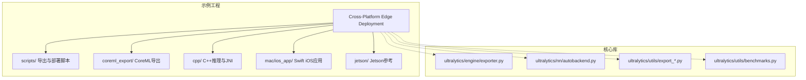
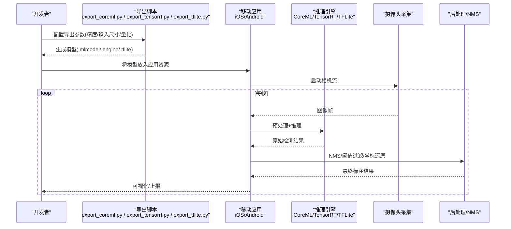
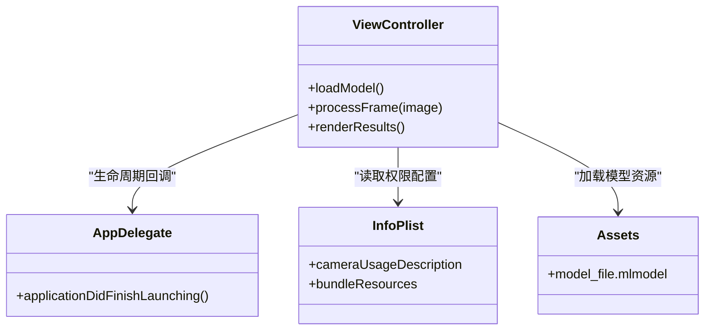
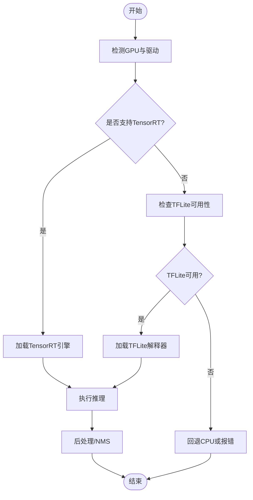
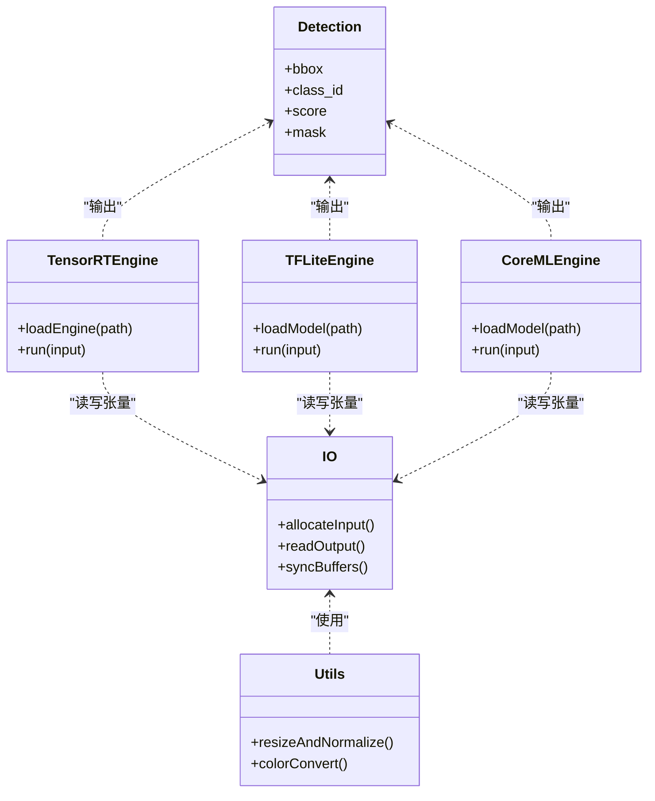
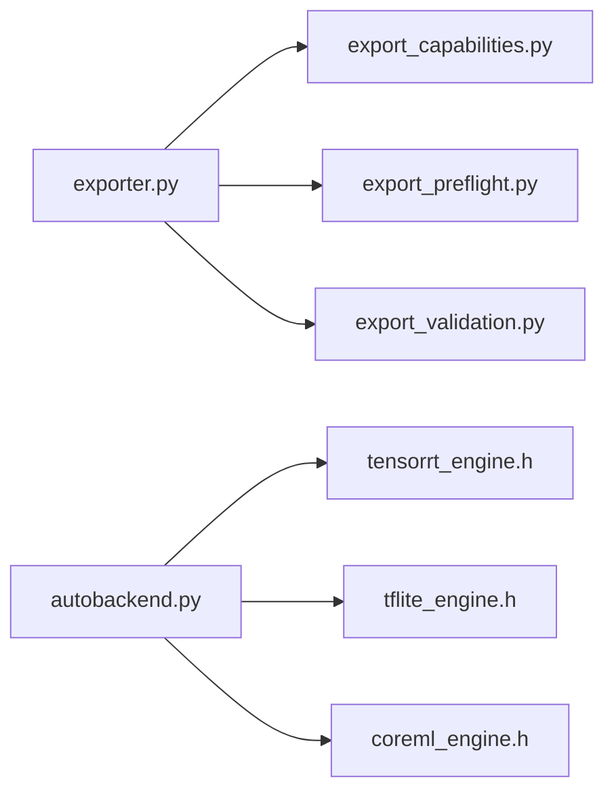
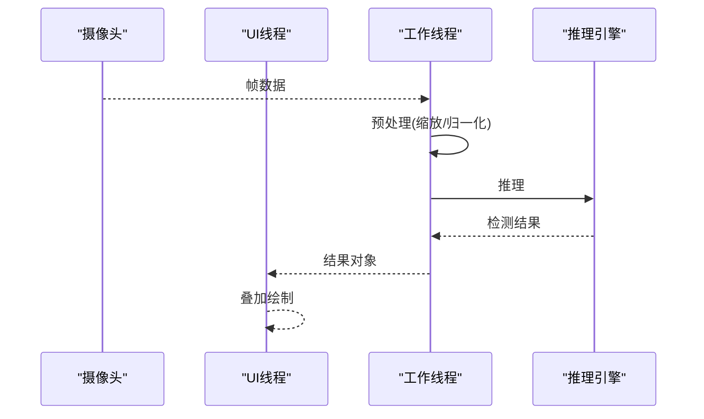

# 移动端部署

<cite>
**本文引用的文件**
- [README.md](file://README.md)
- [examples/YOLO-Master-Cross-Platform-Edge-Deployment/README.md](file://examples/YOLO-Master-Cross-Platform-Edge-Deployment/README.md)
- [examples/YOLO-Master-Cross-Platform-Edge-Deployment/TECHNICAL_REPORT.md](file://examples/YOLO-Master-Cross-Platform-Edge-Deployment/TECHNICAL_REPORT.md)
- [examples/YOLO-Master-Cross-Platform-Edge-Deployment/scripts/export_coreml.py](file://examples/YOLO-Master-Cross-Platform-Edge-Deployment/scripts/export_coreml.py)
- [examples/YOLO-Master-Cross-Platform-Edge-Deployment/coreml_export/export_coreml.py](file://examples/YOLO-Master-Cross-Platform-Edge-Deployment/coreml_export/export_coreml.py)
- [examples/YOLO-Master-Cross-Platform-Edge-Deployment/mac/ios_app/ViewController.swift](file://examples/YOLO-Master-Cross-Platform-Edge-Deployment/mac/ios_app/ViewController.swift)
- [examples/YOLO-Master-Cross-Platform-Edge-Deployment/mac/ios_app/AppDelegate.swift](file://examples/YOLO-Master-Cross-Platform-Edge-Deployment/mac/ios_app/AppDelegate.swift)
- [examples/YOLO-Master-Cross-Platform-Edge-Deployment/mac/ios_app/Info.plist](file://examples/YOLO-Master-Cross-Platform-Edge-Deployment/mac/ios_app/Info.plist)
- [examples/YOLO-Master-Cross-Platform-Edge-Deployment/mac/ios_app/Assets.xcassets/Contents.json](file://examples/YOLO-Master-Cross-Platform-Edge-Deployment/mac/ios_app/Assets.xcassets/Contents.json)
- [examples/YOLO-Master-Cross-Platform-Edge-Deployment/cpp/android/app/src/main/java/com/yolo/master/MainActivity.java](file://examples/YOLO-Master-Cross-Platform-Edge-Deployment/cpp/android/app/src/main/java/com/yolo/master/MainActivity.java)
- [examples/YOLO-Master-Cross-Platform-Edge-Deployment/cpp/android/app/build.gradle](file://examples/YOLO-Master-Cross-Platform-Edge-Deployment/cpp/android/app/build.gradle)
- [examples/YOLO-Master-Cross-Platform-Edge-Deployment/cpp/android/app/CMakeLists.txt](file://examples/YOLO-Master-Cross-Platform-Edge-Deployment/cpp/android/app/CMakeLists.txt)
- [examples/YOLO-Master-Cross-Platform-Edge-Deployment/cpp/android/app/src/main/jni/inference.cpp](file://examples/YOLO-Master-Cross-Platform-Edge-Deployment/cpp/android/app/src/main/jni/inference.cpp)
- [examples/YOLO-Master-Cross-Platform-Edge-Deployment/cpp/common/io.h](file://examples/YOLO-Master-Cross-Platform-Edge-Deployment/cpp/common/io.h)
- [examples/YOLO-Master-Cross-Platform-Edge-Deployment/cpp/common/utils.h](file://examples/YOLO-Master-Cross-Platform-Edge-Deployment/cpp/common/utils.h)
- [examples/YOLO-Master-Cross-Platform-Edge-Deployment/cpp/common/detection.h](file://examples/YOLO-Master-Cross-Platform-Edge-Deployment/cpp/common/detection.h)
- [examples/YOLO-Master-Cross-Platform-Edge-Deployment/cpp/common/tensorrt_engine.h](file://examples/YOLO-Master-Cross-Platform-Edge-Deployment/cpp/common/tensorrt_engine.h)
- [examples/YOLO-Master-Cross-Platform-Edge-Deployment/cpp/common/tflite_engine.h](file://examples/YOLO-Master-Cross-Platform-Edge-Deployment/cpp/common/tflite_engine.h)
- [examples/YOLO-Master-Cross-Platform-Edge-Deployment/cpp/common/coreml_engine.h](file://examples/YOLO-Master-Cross-Platform-Edge-Deployment/cpp/common/coreml_engine.h)
- [examples/YOLO-Master-Cross-Platform-Edge-Deployment/cpp/common/engine_factory.h](file://examples/YOLO-Master-Cross-Platform-Edge-Deployment/cpp/common/engine_factory.h]
- [examples/YOLO-Master-Cross-Platform-Edge-Deployment/scripts/export_tensorrt.py](file://examples/YOLO-Master-Cross-Platform-Edge-Deployment/scripts/export_tensorrt.py)
- [examples/YOLO-Master-Cross-Platform-Edge-Deployment/scripts/export_tflite.py](file://examples/YOLO-Master-Cross-Platform-Edge-Deployment/scripts/export_tflite.py)
- [examples/YOLO-Master-Cross-Platform-Edge-Deployment/scripts/benchmark_mobile.sh](file://examples/YOLO-Master-Cross-Platform-Edge-Deployment/scripts/benchmark_mobile.sh)
- [examples/YOLO-Master-Cross-Platform-Edge-Deployment/scripts/deploy_ios.sh](file://examples/YOLO-Master-Cross-Platform-Edge-Deployment/scripts/deploy_ios.sh)
- [examples/YOLO-Master-Cross-Platform-Edge-Deployment/scripts/deploy_android.sh](file://examples/YOLO-Master-Cross-Platform-Edge-Deployment/scripts/deploy_android.sh)
- [examples/YOLO-Master-Cross-Platform-Edge-Deployment/jetson/run_infer.sh](file://examples/YOLO-Master-Cross-Platform-Edge-Deployment/jetson/run_infer.sh)
- [examples/YOLO-Master-Cross-Platform-Edge-Deployment/jetson/config.yaml](file://examples/YOLO-Master-Cross-Platform-Edge-Deployment/jetson/config.yaml)
- [ultralytics/utils/export_capabilities.py](file://ultralytics/utils/export_capabilities.py)
- [ultralytics/utils/export_preflight.py](file://ultralytics/utils/export_preflight.py)
- [ultralytics/utils/export_validation.py](file://ultralytics/utils/export_validation.py)
- [ultralytics/nn/autobackend.py](file://ultralytics/nn/autobackend.py)
- [ultralytics/engine/exporter.py](file://ultralytics/engine/exporter.py)
- [ultralytics/utils/benchmarks.py](file://ultralytics/utils/benchmarks.py)
- [ultralytics/utils/errors.py](file://ultralytics/utils/errors.py)
</cite>

## 目录
1. [简介](#简介)
2. [项目结构](#项目结构)
3. [核心组件](#核心组件)
4. [架构总览](#架构总览)
5. [详细组件分析](#详细组件分析)
6. [依赖关系分析](#依赖关系分析)
7. [性能与内存优化](#性能与内存优化)
8. [摄像头集成与实时推理](#摄像头集成与实时推理)
9. [应用开发模式](#应用开发模式)
10. [构建与部署脚本](#构建与部署脚本)
11. [性能监控与分析工具](#性能监控与分析工具)
12. [错误处理与异常恢复](#错误处理与异常恢复)
13. [平台适配与对比](#平台适配与对比)
14. [故障排查指南](#故障排查指南)
15. [结论](#结论)

## 简介
本技术文档面向YOLO-Master在iOS与Android平台的移动端部署，覆盖CoreML、TensorRT、TFLite等推理框架的集成方法；阐述模型压缩、量化加速与内存池管理等优化策略；说明原生应用集成、Flutter插件与React Native桥接的开发模式；提供摄像头采集与实时推理优化方案；给出示例工程与构建脚本路径；并包含移动端性能监控、错误处理与多芯片平台适配建议。

## 项目结构
移动端相关代码主要位于跨平台边缘部署示例工程中，包含：
- iOS端：Swift原生工程，使用CoreML进行推理
- Android端：C++推理引擎（TensorRT/TFLite/CoreML）通过JNI暴露给Java层
- 导出与转换脚本：CoreML/TensorRT/TFLite导出流程
- 基准测试与部署脚本：一键导出、构建与运行
- Jetson参考实现：用于对比与迁移参考

图表来源
- [examples/YOLO-Master-Cross-Platform-Edge-Deployment/README.md](file://examples/YOLO-Master-Cross-Platform-Edge-Deployment/README.md)
- [examples/YOLO-Master-Cross-Platform-Edge-Deployment/TECHNICAL_REPORT.md](file://examples/YOLO-Master-Cross-Platform-Edge-Deployment/TECHNICAL_REPORT.md)
- [ultralytics/engine/exporter.py](file://ultralytics/engine/exporter.py)
- [ultralytics/nn/autobackend.py](file://ultralytics/nn/autobackend.py)

章节来源
- [examples/YOLO-Master-Cross-Platform-Edge-Deployment/README.md](file://examples/YOLO-Master-Cross-Platform-Edge-Deployment/README.md)
- [examples/YOLO-Master-Cross-Platform-Edge-Deployment/TECHNICAL_REPORT.md](file://examples/YOLO-Master-Cross-Platform-Edge-Deployment/TECHNICAL_REPORT.md)

## 核心组件
- 导出与预检能力
  - 统一导出入口与能力矩阵：定义各后端支持情况与参数约束
  - 导出前检查：验证输入形状、精度、设备可用性
  - 导出后校验：确保输出一致性、数值稳定性
- 自动后端选择
  - 根据目标平台与可用运行时动态选择最优后端
- 基准测试工具
  - 提供端到端延迟、吞吐、内存占用统计

章节来源
- [ultralytics/utils/export_capabilities.py](file://ultralytics/utils/export_capabilities.py)
- [ultralytics/utils/export_preflight.py](file://ultralytics/utils/export_preflight.py)
- [ultralytics/utils/export_validation.py](file://ultralytics/utils/export_validation.py)
- [ultralytics/nn/autobackend.py](file://ultralytics/nn/autobackend.py)
- [ultralytics/utils/benchmarks.py](file://ultralytics/utils/benchmarks.py)
- [ultralytics/engine/exporter.py](file://ultralytics/engine/exporter.py)

## 架构总览
移动端推理整体流程：训练权重 → 导出为特定格式（CoreML/TensorRT/TFLite）→ 打包至应用资源 → 运行时加载引擎 → 摄像头帧预处理 → 推理 → NMS与后处理 → 结果渲染与上报。

图表来源
- [examples/YOLO-Master-Cross-Platform-Edge-Deployment/scripts/export_coreml.py](file://examples/YOLO-Master-Cross-Platform-Edge-Deployment/scripts/export_coreml.py)
- [examples/YOLO-Master-Cross-Platform-Edge-Deployment/scripts/export_tensorrt.py](file://examples/YOLO-Master-Cross-Platform-Edge-Deployment/scripts/export_tensorrt.py)
- [examples/YOLO-Master-Cross-Platform-Edge-Deployment/scripts/export_tflite.py](file://examples/YOLO-Master-Cross-Platform-Edge-Deployment/scripts/export_tflite.py)
- [examples/YOLO-Master-Cross-Platform-Edge-Deployment/mac/ios_app/ViewController.swift](file://examples/YOLO-Master-Cross-Platform-Edge-Deployment/mac/ios_app/ViewController.swift)
- [examples/YOLO-Master-Cross-Platform-Edge-Deployment/cpp/android/app/src/main/java/com/yolo/master/MainActivity.java](file://examples/YOLO-Master-Cross-Platform-Edge-Deployment/cpp/android/app/src/main/java/com/yolo/master/MainActivity.java)

## 详细组件分析

### iOS端（CoreML）
- 导出流程
  - 使用CoreML导出脚本完成权重到.mlmodel的转换，可配置输入尺寸、精度与量化选项
  - 导出后校验确保与Python端一致
- 应用集成
  - Swift工程加载CoreML模型，封装预测接口
  - 相机权限与预览在Info.plist中声明，控制器负责帧捕获与推理调度
  - 资源管理：模型文件置于Assets或Bundle中，按需懒加载

图表来源
- [examples/YOLO-Master-Cross-Platform-Edge-Deployment/mac/ios_app/ViewController.swift](file://examples/YOLO-Master-Cross-Platform-Edge-Deployment/mac/ios_app/ViewController.swift)
- [examples/YOLO-Master-Cross-Platform-Edge-Deployment/mac/ios_app/AppDelegate.swift](file://examples/YOLO-Master-Cross-Platform-Edge-Deployment/mac/ios_app/AppDelegate.swift)
- [examples/YOLO-Master-Cross-Platform-Edge-Deployment/mac/ios_app/Info.plist](file://examples/YOLO-Master-Cross-Platform-Edge-Deployment/mac/ios_app/Info.plist)
- [examples/YOLO-Master-Cross-Platform-Edge-Deployment/mac/ios_app/Assets.xcassets/Contents.json](file://examples/YOLO-Master-Cross-Platform-Edge-Deployment/mac/ios_app/Assets.xcassets/Contents.json)
- [examples/YOLO-Master-Cross-Platform-Edge-Deployment/scripts/export_coreml.py](file://examples/YOLO-Master-Cross-Platform-Edge-Deployment/scripts/export_coreml.py)
- [examples/YOLO-Master-Cross-Platform-Edge-Deployment/coreml_export/export_coreml.py](file://examples/YOLO-Master-Cross-Platform-Edge-Deployment/coreml_export/export_coreml.py)

章节来源
- [examples/YOLO-Master-Cross-Platform-Edge-Deployment/mac/ios_app/ViewController.swift](file://examples/YOLO-Master-Cross-Platform-Edge-Deployment/mac/ios_app/ViewController.swift)
- [examples/YOLO-Master-Cross-Platform-Edge-Deployment/mac/ios_app/AppDelegate.swift](file://examples/YOLO-Master-Cross-Platform-Edge-Deployment/mac/ios_app/AppDelegate.swift)
- [examples/YOLO-Master-Cross-Platform-Edge-Deployment/mac/ios_app/Info.plist](file://examples/YOLO-Master-Cross-Platform-Edge-Deployment/mac/ios_app/Info.plist)
- [examples/YOLO-Master-Cross-Platform-Edge-Deployment/mac/ios_app/Assets.xcassets/Contents.json](file://examples/YOLO-Master-Cross-Platform-Edge-Deployment/mac/ios_app/Assets.xcassets/Contents.json)
- [examples/YOLO-Master-Cross-Platform-Edge-Deployment/scripts/export_coreml.py](file://examples/YOLO-Master-Cross-Platform-Edge-Deployment/scripts/export_coreml.py)
- [examples/YOLO-Master-Cross-Platform-Edge-Deployment/coreml_export/export_coreml.py](file://examples/YOLO-Master-Cross-Platform-Edge-Deployment/coreml_export/export_coreml.py)

### Android端（TensorRT/TFLite）
- 导出流程
  - TensorRT导出需指定GPU架构与精度（FP16/INT8），生成.engine文件
  - TFLite导出可启用量化与优化器，生成.tflite文件
- 应用集成
  - Java层通过JNI调用C++推理模块
  - C++层封装不同引擎的统一接口，按平台特性选择最佳后端
  - 构建系统使用CMake编译原生库，Gradle集成到Android应用

图表来源
- [examples/YOLO-Master-Cross-Platform-Edge-Deployment/scripts/export_tensorrt.py](file://examples/YOLO-Master-Cross-Platform-Edge-Deployment/scripts/export_tensorrt.py)
- [examples/YOLO-Master-Cross-Platform-Edge-Deployment/scripts/export_tflite.py](file://examples/YOLO-Master-Cross-Platform-Edge-Deployment/scripts/export_tflite.py)
- [examples/YOLO-Master-Cross-Platform-Edge-Deployment/cpp/android/app/src/main/java/com/yolo/master/MainActivity.java](file://examples/YOLO-Master-Cross-Platform-Edge-Deployment/cpp/android/app/src/main/java/com/yolo/master/MainActivity.java)
- [examples/YOLO-Master-Cross-Platform-Edge-Deployment/cpp/android/app/src/main/jni/inference.cpp](file://examples/YOLO-Master-Cross-Platform-Edge-Deployment/cpp/android/app/src/main/jni/inference.cpp)
- [examples/YOLO-Master-Cross-Platform-Edge-Deployment/cpp/common/tensorrt_engine.h](file://examples/YOLO-Master-Cross-Platform-Edge-Deployment/cpp/common/tensorrt_engine.h)
- [examples/YOLO-Master-Cross-Platform-Edge-Deployment/cpp/common/tflite_engine.h](file://examples/YOLO-Master-Cross-Platform-Edge-Deployment/cpp/common/tflite_engine.h)
- [examples/YOLO-Master-Cross-Platform-Edge-Deployment/cpp/common/engine_factory.h](file://examples/YOLO-Master-Cross-Platform-Edge-Deployment/cpp/common/engine_factory.h)

章节来源
- [examples/YOLO-Master-Cross-Platform-Edge-Deployment/cpp/android/app/src/main/java/com/yolo/master/MainActivity.java](file://examples/YOLO-Master-Cross-Platform-Edge-Deployment/cpp/android/app/src/main/java/com/yolo/master/MainActivity.java)
- [examples/YOLO-Master-Cross-Platform-Edge-Deployment/cpp/android/app/build.gradle](file://examples/YOLO-Master-Cross-Platform-Edge-Deployment/cpp/android/app/build.gradle)
- [examples/YOLO-Master-Cross-Platform-Edge-Deployment/cpp/android/app/CMakeLists.txt](file://examples/YOLO-Master-Cross-Platform-Edge-Deployment/cpp/android/app/CMakeLists.txt)
- [examples/YOLO-Master-Cross-Platform-Edge-Deployment/cpp/android/app/src/main/jni/inference.cpp](file://examples/YOLO-Master-Cross-Platform-Edge-Deployment/cpp/android/app/src/main/jni/inference.cpp)
- [examples/YOLO-Master-Cross-Platform-Edge-Deployment/cpp/common/tensorrt_engine.h](file://examples/YOLO-Master-Cross-Platform-Edge-Deployment/cpp/common/tensorrt_engine.h)
- [examples/YOLO-Master-Cross-Platform-Edge-Deployment/cpp/common/tflite_engine.h](file://examples/YOLO-Master-Cross-Platform-Edge-Deployment/cpp/common/tflite_engine.h)
- [examples/YOLO-Master-Cross-Platform-Edge-Deployment/cpp/common/engine_factory.h](file://examples/YOLO-Master-Cross-Platform-Edge-Deployment/cpp/common/engine_factory.h)

### 通用C++推理接口
- IO与张量操作
  - 统一的输入输出封装，屏蔽底层差异
- 工具函数
  - 图像缩放、归一化、颜色空间转换
- 检测数据结构
  - 边界框、类别、置信度、掩码等
- 引擎抽象
  - 为TensorRT/TFLite/CoreML提供统一接口

图表来源
- [examples/YOLO-Master-Cross-Platform-Edge-Deployment/cpp/common/io.h](file://examples/YOLO-Master-Cross-Platform-Edge-Deployment/cpp/common/io.h)
- [examples/YOLO-Master-Cross-Platform-Edge-Deployment/cpp/common/utils.h](file://examples/YOLO-Master-Cross-Platform-Edge-Deployment/cpp/common/utils.h)
- [examples/YOLO-Master-Cross-Platform-Edge-Deployment/cpp/common/detection.h](file://examples/YOLO-Master-Cross-Platform-Edge-Deployment/cpp/common/detection.h)
- [examples/YOLO-Master-Cross-Platform-Edge-Deployment/cpp/common/tensorrt_engine.h](file://examples/YOLO-Master-Cross-Platform-Edge-Deployment/cpp/common/tensorrt_engine.h)
- [examples/YOLO-Master-Cross-Platform-Edge-Deployment/cpp/common/tflite_engine.h](file://examples/YOLO-Master-Cross-Platform-Edge-Deployment/cpp/common/tflite_engine.h)
- [examples/YOLO-Master-Cross-Platform-Edge-Deployment/cpp/common/coreml_engine.h](file://examples/YOLO-Master-Cross-Platform-Edge-Deployment/cpp/common/coreml_engine.h)

章节来源
- [examples/YOLO-Master-Cross-Platform-Edge-Deployment/cpp/common/io.h](file://examples/YOLO-Master-Cross-Platform-Edge-Deployment/cpp/common/io.h)
- [examples/YOLO-Master-Cross-Platform-Edge-Deployment/cpp/common/utils.h](file://examples/YOLO-Master-Cross-Platform-Edge-Deployment/cpp/common/utils.h)
- [examples/YOLO-Master-Cross-Platform-Edge-Deployment/cpp/common/detection.h](file://examples/YOLO-Master-Cross-Platform-Edge-Deployment/cpp/common/detection.h)
- [examples/YOLO-Master-Cross-Platform-Edge-Deployment/cpp/common/tensorrt_engine.h](file://examples/YOLO-Master-Cross-Platform-Edge-Deployment/cpp/common/tensorrt_engine.h)
- [examples/YOLO-Master-Cross-Platform-Edge-Deployment/cpp/common/tflite_engine.h](file://examples/YOLO-Master-Cross-Platform-Edge-Deployment/cpp/common/tflite_engine.h)
- [examples/YOLO-Master-Cross-Platform-Edge-Deployment/cpp/common/coreml_engine.h](file://examples/YOLO-Master-Cross-Platform-Edge-Deployment/cpp/common/coreml_engine.h)

## 依赖关系分析
- 导出链路
  - exporter.py作为统一入口，调用export_capabilities.py与export_preflight.py进行能力与前置检查，再执行具体后端导出
  - 导出后由export_validation.py进行一致性校验
- 运行时链路
  - autobackend.py根据平台与可用库选择后端
  - 示例工程的C++层对TensorRT/TFLite/CoreML进行封装并通过JNI暴露给上层

图表来源
- [ultralytics/engine/exporter.py](file://ultralytics/engine/exporter.py)
- [ultralytics/utils/export_capabilities.py](file://ultralytics/utils/export_capabilities.py)
- [ultralytics/utils/export_preflight.py](file://ultralytics/utils/export_preflight.py)
- [ultralytics/utils/export_validation.py](file://ultralytics/utils/export_validation.py)
- [ultralytics/nn/autobackend.py](file://ultralytics/nn/autobackend.py)
- [examples/YOLO-Master-Cross-Platform-Edge-Deployment/cpp/common/tensorrt_engine.h](file://examples/YOLO-Master-Cross-Platform-Edge-Deployment/cpp/common/tensorrt_engine.h)
- [examples/YOLO-Master-Cross-Platform-Edge-Deployment/cpp/common/tflite_engine.h](file://examples/YOLO-Master-Cross-Platform-Edge-Deployment/cpp/common/tflite_engine.h)
- [examples/YOLO-Master-Cross-Platform-Edge-Deployment/cpp/common/coreml_engine.h](file://examples/YOLO-Master-Cross-Platform-Edge-Deployment/cpp/common/coreml_engine.h)

章节来源
- [ultralytics/engine/exporter.py](file://ultralytics/engine/exporter.py)
- [ultralytics/utils/export_capabilities.py](file://ultralytics/utils/export_capabilities.py)
- [ultralytics/utils/export_preflight.py](file://ultralytics/utils/export_preflight.py)
- [ultralytics/utils/export_validation.py](file://ultralytics/utils/export_validation.py)
- [ultralytics/nn/autobackend.py](file://ultralytics/nn/autobackend.py)

## 性能与内存优化
- 模型压缩
  - 剪枝与知识蒸馏可在训练阶段完成，导出时仅保留必要算子
  - 结构化剪枝有利于后端融合与缓存友好
- 量化加速
  - INT8量化需校准数据集与校准集统计，注意数值溢出与精度回退
  - FP16在支持半精度的设备上显著降低带宽与功耗
- 内存池管理
  - 复用输入/输出缓冲区，避免频繁分配释放
  - 控制中间张量生命周期，减少峰值内存
- 批处理与流水线
  - 合理设置batch size，结合异步I/O提升吞吐
  - 前后处理与推理并行化，利用双缓冲

[本节为通用指导，不直接分析具体文件]

## 摄像头集成与实时推理
- iOS
  - 使用AVFoundation捕获视频帧，转换为CoreML输入格式
  - 在后台队列执行推理，主线程渲染结果
- Android
  - CameraX或Camera2获取帧，转为NV21/RGB并预处理
  - JNI调用C++推理，结果返回Java层绘制

[此图为概念流程图，无需图表来源]

## 应用开发模式
- 原生应用集成
  - iOS：Swift工程直接调用CoreML API
  - Android：Java/Kotlin通过JNI调用C++推理库
- Flutter插件
  - 通过Platform Channel传递字节数组，C++侧执行推理并返回序列化结果
- React Native桥接
  - 使用原生模块暴露推理接口，JS侧调用并处理结果

[本节为通用指导，不直接分析具体文件]

## 构建与部署脚本
- 导出脚本
  - CoreML：export_coreml.py
  - TensorRT：export_tensorrt.py
  - TFLite：export_tflite.py
- 部署脚本
  - iOS：deploy_ios.sh（打包资源、签名、安装）
  - Android：deploy_android.sh（构建NDK、拷贝模型、安装APK）
- 基准测试
  - benchmark_mobile.sh（端到端延迟/吞吐统计）
- Jetson参考
  - run_infer.sh与config.yaml用于对比与迁移

章节来源
- [examples/YOLO-Master-Cross-Platform-Edge-Deployment/scripts/export_coreml.py](file://examples/YOLO-Master-Cross-Platform-Edge-Deployment/scripts/export_coreml.py)
- [examples/YOLO-Master-Cross-Platform-Edge-Deployment/scripts/export_tensorrt.py](file://examples/YOLO-Master-Cross-Platform-Edge-Deployment/scripts/export_tensorrt.py)
- [examples/YOLO-Master-Cross-Platform-Edge-Deployment/scripts/export_tflite.py](file://examples/YOLO-Master-Cross-Platform-Edge-Deployment/scripts/export_tflite.py)
- [examples/YOLO-Master-Cross-Platform-Edge-Deployment/scripts/benchmark_mobile.sh](file://examples/YOLO-Master-Cross-Platform-Edge-Deployment/scripts/benchmark_mobile.sh)
- [examples/YOLO-Master-Cross-Platform-Edge-Deployment/scripts/deploy_ios.sh](file://examples/YOLO-Master-Cross-Platform-Edge-Deployment/scripts/deploy_ios.sh)
- [examples/YOLO-Master-Cross-Platform-Edge-Deployment/scripts/deploy_android.sh](file://examples/YOLO-Master-Cross-Platform-Edge-Deployment/scripts/deploy_android.sh)
- [examples/YOLO-Master-Cross-Platform-Edge-Deployment/jetson/run_infer.sh](file://examples/YOLO-Master-Cross-Platform-Edge-Deployment/jetson/run_infer.sh)
- [examples/YOLO-Master-Cross-Platform-Edge-Deployment/jetson/config.yaml](file://examples/YOLO-Master-Cross-Platform-Edge-Deployment/jetson/config.yaml)

## 性能监控与分析工具
- Python端基准
  - benchmarks.py提供端到端指标采集
- 移动端
  - iOS：Instruments（Time Profiler、Allocations、Leaks）
  - Android：Perfetto、Systrace、Profiler
- 日志与诊断
  - 记录关键节点耗时、内存峰值、错误码

章节来源
- [ultralytics/utils/benchmarks.py](file://ultralytics/utils/benchmarks.py)

## 错误处理与异常恢复
- 导出阶段
  - 前置检查失败时快速失败，提示缺失依赖或不兼容参数
  - 导出后校验失败时输出差异报告，辅助定位
- 运行阶段
  - 引擎加载失败时回退到其他后端或CPU
  - 输入尺寸不匹配时抛出明确错误并终止
- 统一错误类型
  - 使用errors.py中的错误类进行规范化处理

章节来源
- [ultralytics/utils/export_preflight.py](file://ultralytics/utils/export_preflight.py)
- [ultralytics/utils/export_validation.py](file://ultralytics/utils/export_validation.py)
- [ultralytics/utils/errors.py](file://ultralytics/utils/errors.py)

## 平台适配与对比
- iOS（CoreML）
  - 优势：系统级优化、低功耗、易用性
  - 注意：模型大小限制、部分算子支持差异
- Android（TensorRT/TFLite）
  - TensorRT：GPU加速强，适合高通/联发科Adreno/Mali GPU
  - TFLite：跨设备兼容性好，CPU/GPU/NPU均可
- Jetson参考
  - 用于对比服务器/嵌入式场景，便于迁移策略制定

章节来源
- [examples/YOLO-Master-Cross-Platform-Edge-Deployment/TECHNICAL_REPORT.md](file://examples/YOLO-Master-Cross-Platform-Edge-Deployment/TECHNICAL_REPORT.md)
- [examples/YOLO-Master-Cross-Platform-Edge-Deployment/jetson/run_infer.sh](file://examples/YOLO-Master-Cross-Platform-Edge-Deployment/jetson/run_infer.sh)
- [examples/YOLO-Master-Cross-Platform-Edge-Deployment/jetson/config.yaml](file://examples/YOLO-Master-Cross-Platform-Edge-Deployment/jetson/config.yaml)

## 故障排查指南
- 导出问题
  - 检查export_capabilities.py确认后端支持
  - 查看export_preflight.py的错误信息，修正输入形状或精度
  - 使用export_validation.py比对输出一致性
- 运行时问题
  - 确认模型文件路径与权限
  - 检查设备驱动与库版本（如TensorRT）
  - 调整量化参数或回退到更高精度
- 性能问题
  - 使用benchmarks.py定位瓶颈
  - 增大批处理或开启异步I/O
  - 减少不必要的拷贝与转换

章节来源
- [ultralytics/utils/export_capabilities.py](file://ultralytics/utils/export_capabilities.py)
- [ultralytics/utils/export_preflight.py](file://ultralytics/utils/export_preflight.py)
- [ultralytics/utils/export_validation.py](file://ultralytics/utils/export_validation.py)
- [ultralytics/utils/benchmarks.py](file://ultralytics/utils/benchmarks.py)

## 结论
本指南系统化梳理了YOLO-Master在iOS与Android的移动端部署路径，涵盖导出、集成、优化与监控全流程。通过示例工程与脚本，开发者可快速落地高性能、低延迟的实时检测应用。建议在生产环境结合设备特性进行量化与内存优化，并建立完善的错误处理与性能回归体系。