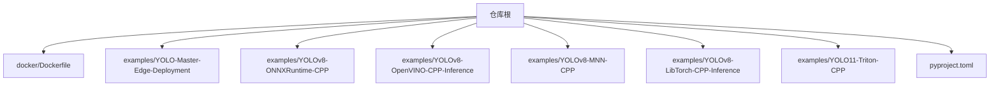
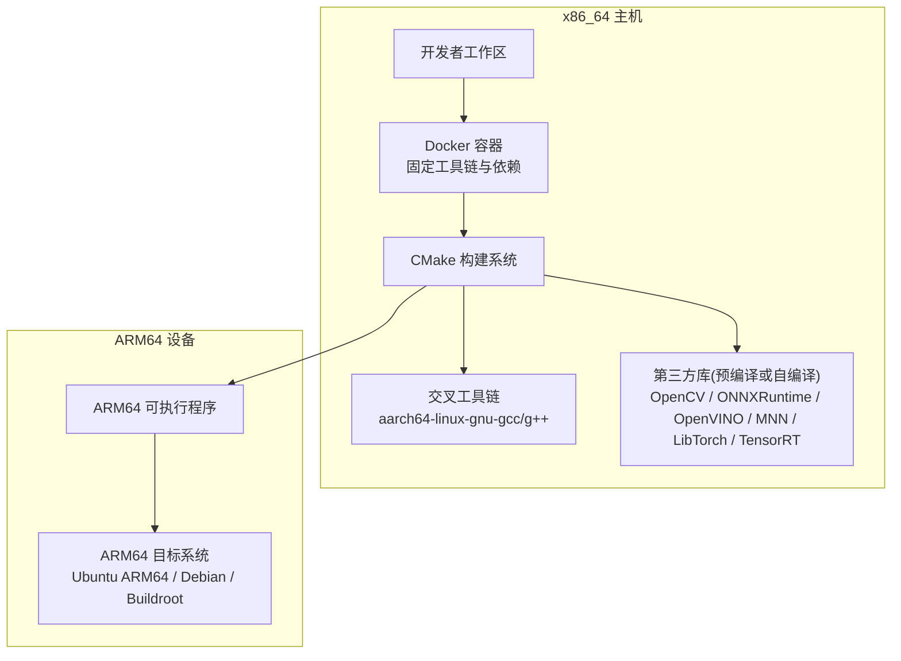
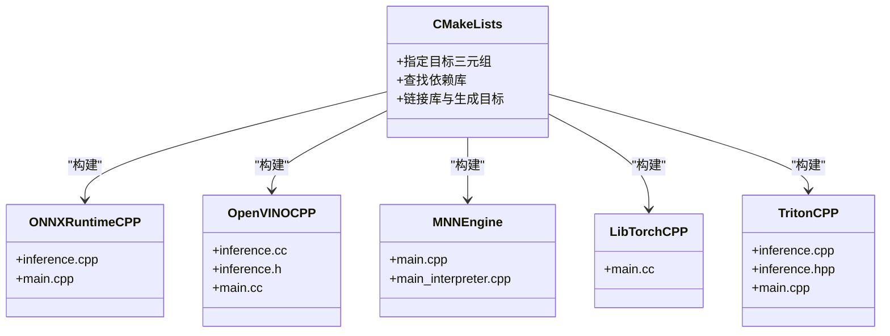
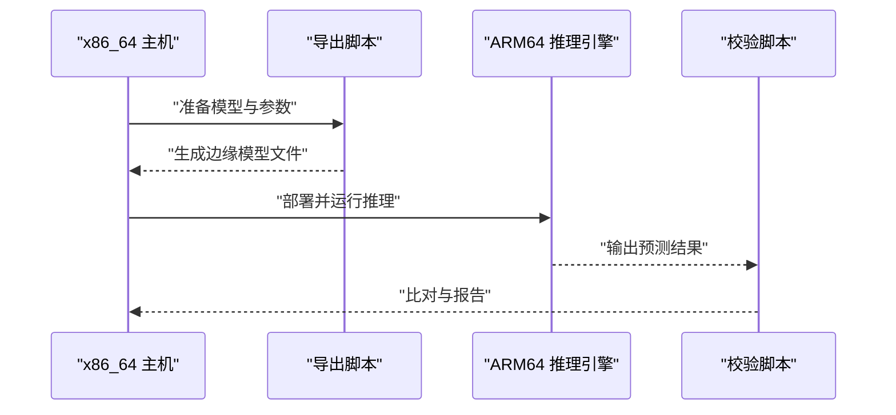
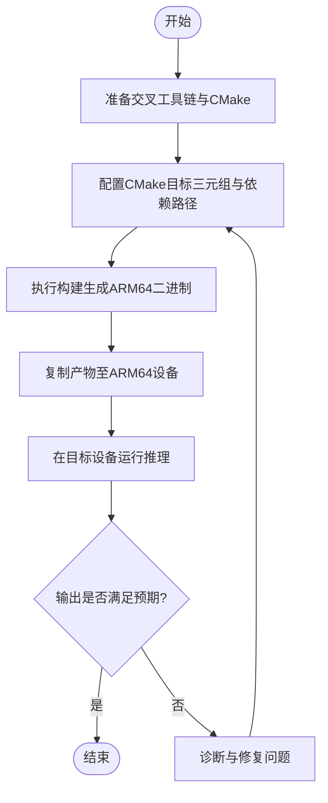
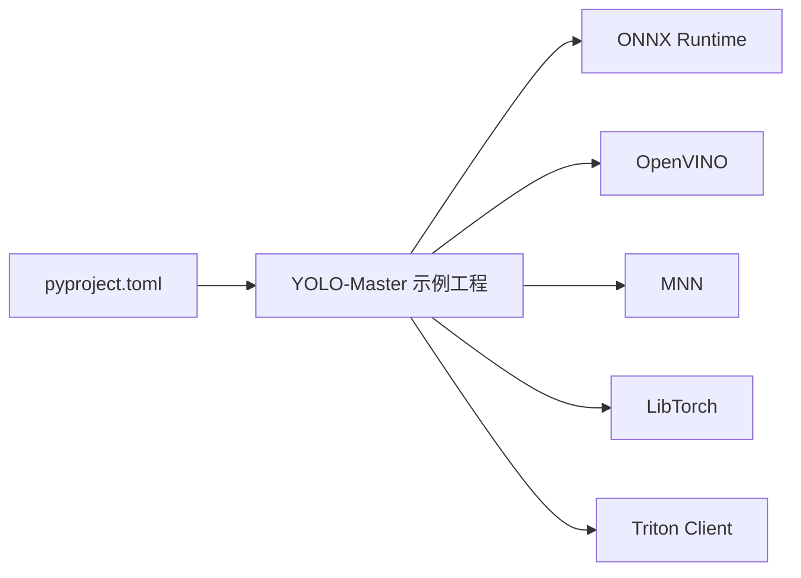

# ARM交叉编译环境

<cite>
**本文引用的文件**
- [README.md](file://README.md)
- [Dockerfile](file://docker/Dockerfile)
- [.dockerignore](file://.dockerignore)
- [CMakeLists.txt](file://examples/YOLO-Master-Edge-Deployment/CMakeLists.txt)
- [README.md](file://examples/YOLO-Master-Edge-Deployment/README.md)
- [export_edge_models.py](file://examples/YOLO-Master-Edge-Deployment/export_edge_models.py)
- [validate_edge_outputs.py](file://examples/YOLO-Master-Edge-Deployment/validate_edge_outputs.py)
- [edge_utils.py](file://examples/YOLO-Master-Edge-Deployment/edge_utils.py)
- [CMakeLists.txt](file://examples/YOLOv8-ONNXRuntime-CPP/CMakeLists.txt)
- [inference.cpp](file://examples/YOLOv8-ONNXRuntime-CPP/inference.cpp)
- [main.cpp](file://examples/YOLOv8-ONNXRuntime-CPP/main.cpp)
- [CMakeLists.txt](file://examples/YOLOv10-Master-MoA/CMakeLists.txt)
- [inference.cpp](file://examples/YOLOv10-Master-MoA/inference.cpp)
- [inference.hpp](file://examples/YOLOv10-Master-MoA/inference.hpp)
- [main.cpp](file://examples/YOLOv10-Master-MoA/main.cpp)
- [CMakeLists.txt](file://examples/YOLOv8-OpenVINO-CPP-Inference/CMakeLists.txt)
- [inference.cc](file://examples/YOLOv8-OpenVINO-CPP-Inference/inference.cc)
- [inference.h](file://examples/YOLOv8-OpenVINO-CPP-Inference/inference.h)
- [main.cc](file://examples/YOLOv8-OpenVINO-CPP-Inference/main.cc)
- [CMakeLists.txt](file://examples/YOLOv8-MNN-CPP/CMakeLists.txt)
- [main.cpp](file://examples/YOLOv8-MNN-CPP/main.cpp)
- [main_interpreter.cpp](file://examples/YOLOv8-MNN-CPP/main_interpreter.cpp)
- [CMakeLists.txt](file://examples/YOLOv8-LibTorch-CPP-Inference/CMakeLists.txt)
- [main.cc](file://examples/YOLOv8-LibTorch-CPP-Inference/main.cc)
- [CMakeLists.txt](file://examples/YOLO11-Triton-CPP/CMakeLists.txt)
- [inference.cpp](file://examples/YOLO11-Triton-CPP/inference.cpp)
- [inference.hpp](file://examples/YOLO11-Triton-CPP/inference.hpp)
- [main.cpp](file://examples/YOLO11-Triton-CPP/main.cpp)
- [pyproject.toml](file://pyproject.toml)
</cite>

## 目录
1. [简介](#简介)
2. [项目结构](#项目结构)
3. [核心组件](#核心组件)
4. [架构总览](#架构总览)
5. [详细组件分析](#详细组件分析)
6. [依赖关系分析](#依赖关系分析)
7. [性能考量](#性能考量)
8. [故障排查指南](#故障排查指南)
9. [结论](#结论)
10. [附录](#附录)

## 简介
本指南面向在x86_64主机上为ARM64目标进行交叉编译的工程师，覆盖工具链配置（GCC/G++、CMake）、构建系统设置、关键依赖库（OpenCV、ONNX Runtime、TensorRT等）的交叉编译流程，以及Ubuntu ARM64、Debian与Buildroot发行版的兼容性处理。同时提供基于Docker的容器化交叉编译方案、常见错误诊断与修复方法，以及如何验证交叉产物正确性与性能的方法论。

## 项目结构
仓库包含大量示例工程与文档，其中与交叉编译直接相关的资源主要集中在：
- docker/Dockerfile：容器镜像定义，可用于隔离并固化交叉编译环境
- examples/*：多种后端（ONNX Runtime、OpenVINO、MNN、LibTorch、Triton）的C/C++推理示例，均含CMakeLists.txt，便于演示跨平台构建
- examples/YOLO-Master-Edge-Deployment：边缘部署脚本与工具，涵盖模型导出与输出校验
- pyproject.toml：Python工程元数据，用于理解运行时依赖与版本约束

图表来源
- [Dockerfile](file://docker/Dockerfile)
- [CMakeLists.txt](file://examples/YOLO-Master-Edge-Deployment/CMakeLists.txt)
- [CMakeLists.txt](file://examples/YOLOv8-ONNXRuntime-CPP/CMakeLists.txt)
- [CMakeLists.txt](file://examples/YOLOv8-OpenVINO-CPP-Inference/CMakeLists.txt)
- [CMakeLists.txt](file://examples/YOLOv8-MNN-CPP/CMakeLists.txt)
- [CMakeLists.txt](file://examples/YOLOv8-LibTorch-CPP-Inference/CMakeLists.txt)
- [CMakeLists.txt](file://examples/YOLO11-Triton-CPP/CMakeLists.txt)
- [pyproject.toml](file://pyproject.toml)

章节来源
- [README.md](file://README.md)
- [Dockerfile](file://docker/Dockerfile)
- [pyproject.toml](file://pyproject.toml)

## 核心组件
- 容器化构建基座：通过Dockerfile定义可复现的交叉编译环境，统一工具链与依赖版本，避免“在我机器上能跑”的问题
- 多后端C++示例：各示例以CMake为中心组织，展示如何为目标平台指定编译器、查找依赖、链接库与生成可执行文件
- 边缘部署工具：提供模型导出与结果校验脚本，辅助在ARM设备上验证推理正确性

章节来源
- [Dockerfile](file://docker/Dockerfile)
- [CMakeLists.txt](file://examples/YOLO-Master-Edge-Deployment/CMakeLists.txt)
- [export_edge_models.py](file://examples/YOLO-Master-Edge-Deployment/export_edge_models.py)
- [validate_edge_outputs.py](file://examples/YOLO-Master-Edge-Deployment/validate_edge_outputs.py)
- [edge_utils.py](file://examples/YOLO-Master-Edge-Deployment/edge_utils.py)

## 架构总览
下图展示了从源码到ARM64可执行文件的端到端流程：在x86_64主机上使用交叉工具链与CMake，将C++示例与第三方库（如ONNX Runtime、OpenVINO、MNN、LibTorch、Triton客户端）交叉编译为ARM64二进制；随后在ARM64设备上运行并验证。

图表来源
- [Dockerfile](file://docker/Dockerfile)
- [CMakeLists.txt](file://examples/YOLOv8-ONNXRuntime-CPP/CMakeLists.txt)
- [CMakeLists.txt](file://examples/YOLOv8-OpenVINO-CPP-Inference/CMakeLists.txt)
- [CMakeLists.txt](file://examples/YOLOv8-MNN-CPP/CMakeLists.txt)
- [CMakeLists.txt](file://examples/YOLOv8-LibTorch-CPP-Inference/CMakeLists.txt)
- [CMakeLists.txt](file://examples/YOLO11-Triton-CPP/CMakeLists.txt)

## 详细组件分析

### 容器化交叉编译环境（Docker）
- 作用：在容器中固化交叉编译器、CMake、Python及第三方库路径，确保构建可重复
- 使用建议：
  - 在容器内挂载源码目录，按示例工程的CMakeLists.txt完成交叉构建
  - 将生成的ARM64产物复制到宿主机后拷贝至目标设备
- 注意事项：
  - 若需GPU加速（如TensorRT），需在容器内安装对应驱动与SDK，并在目标设备上匹配相同版本

章节来源
- [Dockerfile](file://docker/Dockerfile)

### CMake构建系统与多后端示例
- 通用模式：每个示例工程包含CMakeLists.txt，负责：
  - 指定目标三元组（如aarch64-linux-gnu）
  - 定位第三方库头文件与库路径
  - 链接所需库并生成ARM64可执行文件
- 典型后端示例：
  - ONNX Runtime C++：见[examples/YOLOv8-ONNXRuntime-CPP/CMakeLists.txt](file://examples/YOLOv8-ONNXRuntime-CPP/CMakeLists.txt)，入口逻辑参考[inference.cpp](file://examples/YOLOv8-ONNXRuntime-CPP/inference.cpp)、[main.cpp](file://examples/YOLOv8-ONNXRuntime-CPP/main.cpp)
  - OpenVINO C++：见[examples/YOLOv8-OpenVINO-CPP-Inference/CMakeLists.txt](file://examples/YOLOv8-OpenVINO-CPP-Inference/CMakeLists.txt)，实现参考[inference.cc](file://examples/YOLOv8-OpenVINO-CPP-Inference/inference.cc)、[inference.h](file://examples/YOLOv8-OpenVINO-CPP-Inference/inference.h)、[main.cc](file://examples/YOLOv8-OpenVINO-CPP-Inference/main.cc)
  - MNN C++：见[examples/YOLOv8-MNN-CPP/CMakeLists.txt](file://examples/YOLOv8-MNN-CPP/CMakeLists.txt)，入口参考[main.cpp](file://examples/YOLOv8-MNN-CPP/main.cpp)、[main_interpreter.cpp](file://examples/YOLOv8-MNN-CPP/main_interpreter.cpp)
  - LibTorch C++：见[examples/YOLOv8-LibTorch-CPP-Inference/CMakeLists.txt](file://examples/YOLOv8-LibTorch-CPP-Inference/CMakeLists.txt)，入口参考[main.cc](file://examples/YOLOv8-LibTorch-CPP-Inference/main.cc)
  - Triton C++：见[examples/YOLO11-Triton-CPP/CMakeLists.txt](file://examples/YOLO11-Triton-CPP/CMakeLists.txt)，实现参考[inference.cpp](file://examples/YOLO11-Triton-CPP/inference.cpp)、[inference.hpp](file://examples/YOLO11-Triton-CPP/inference.hpp)、[main.cpp](file://examples/YOLO11-Triton-CPP/main.cpp)

图表来源
- [CMakeLists.txt](file://examples/YOLOv8-ONNXRuntime-CPP/CMakeLists.txt)
- [inference.cpp](file://examples/YOLOv8-ONNXRuntime-CPP/inference.cpp)
- [main.cpp](file://examples/YOLOv8-ONNXRuntime-CPP/main.cpp)
- [CMakeLists.txt](file://examples/YOLOv8-OpenVINO-CPP-Inference/CMakeLists.txt)
- [inference.cc](file://examples/YOLOv8-OpenVINO-CPP-Inference/inference.cc)
- [inference.h](file://examples/YOLOv8-OpenVINO-CPP-Inference/inference.h)
- [main.cc](file://examples/YOLOv8-OpenVINO-CPP-Inference/main.cc)
- [CMakeLists.txt](file://examples/YOLOv8-MNN-CPP/CMakeLists.txt)
- [main.cpp](file://examples/YOLOv8-MNN-CPP/main.cpp)
- [main_interpreter.cpp](file://examples/YOLOv8-MNN-CPP/main_interpreter.cpp)
- [CMakeLists.txt](file://examples/YOLOv8-LibTorch-CPP-Inference/CMakeLists.txt)
- [main.cc](file://examples/YOLOv8-LibTorch-CPP-Inference/main.cc)
- [CMakeLists.txt](file://examples/YOLO11-Triton-CPP/CMakeLists.txt)
- [inference.cpp](file://examples/YOLO11-Triton-CPP/inference.cpp)
- [inference.hpp](file://examples/YOLO11-Triton-CPP/inference.hpp)
- [main.cpp](file://examples/YOLO11-Triton-CPP/main.cpp)

章节来源
- [CMakeLists.txt](file://examples/YOLOv8-ONNXRuntime-CPP/CMakeLists.txt)
- [inference.cpp](file://examples/YOLOv8-ONNXRuntime-CPP/inference.cpp)
- [main.cpp](file://examples/YOLOv8-ONNXRuntime-CPP/main.cpp)
- [CMakeLists.txt](file://examples/YOLOv8-OpenVINO-CPP-Inference/CMakeLists.txt)
- [inference.cc](file://examples/YOLOv8-OpenVINO-CPP-Inference/inference.cc)
- [inference.h](file://examples/YOLOv8-OpenVINO-CPP-Inference/inference.h)
- [main.cc](file://examples/YOLOv8-OpenVINO-CPP-Inference/main.cc)
- [CMakeLists.txt](file://examples/YOLOv8-MNN-CPP/CMakeLists.txt)
- [main.cpp](file://examples/YOLOv8-MNN-CPP/main.cpp)
- [main_interpreter.cpp](file://examples/YOLOv8-MNN-CPP/main_interpreter.cpp)
- [CMakeLists.txt](file://examples/YOLOv8-LibTorch-CPP-Inference/CMakeLists.txt)
- [main.cc](file://examples/YOLOv8-LibTorch-CPP-Inference/main.cc)
- [CMakeLists.txt](file://examples/YOLO11-Triton-CPP/CMakeLists.txt)
- [inference.cpp](file://examples/YOLO11-Triton-CPP/inference.cpp)
- [inference.hpp](file://examples/YOLO11-Triton-CPP/inference.hpp)
- [main.cpp](file://examples/YOLO11-Triton-CPP/main.cpp)

### 边缘部署与验证流程
- 模型导出：通过脚本将训练好的YOLO模型导出为边缘可用格式（例如ONNX），供后续推理引擎加载
- 输出校验：在ARM设备上运行推理，对比期望输出，确保数值一致性与边界条件处理正确

图表来源
- [export_edge_models.py](file://examples/YOLO-Master-Edge-Deployment/export_edge_models.py)
- [validate_edge_outputs.py](file://examples/YOLO-Master-Edge-Deployment/validate_edge_outputs.py)
- [edge_utils.py](file://examples/YOLO-Master-Edge-Deployment/edge_utils.py)

章节来源
- [export_edge_models.py](file://examples/YOLO-Master-Edge-Deployment/export_edge_models.py)
- [validate_edge_outputs.py](file://examples/YOLO-Master-Edge-Deployment/validate_edge_outputs.py)
- [edge_utils.py](file://examples/YOLO-Master-Edge-Deployment/edge_utils.py)

### 算法与构建流程（流程图）
以下流程图概括了从源码到ARM64可执行文件的典型步骤，适用于各后端示例工程：

图表来源
- [CMakeLists.txt](file://examples/YOLOv8-ONNXRuntime-CPP/CMakeLists.txt)
- [CMakeLists.txt](file://examples/YOLOv8-OpenVINO-CPP-Inference/CMakeLists.txt)
- [CMakeLists.txt](file://examples/YOLOv8-MNN-CPP/CMakeLists.txt)
- [CMakeLists.txt](file://examples/YOLOv8-LibTorch-CPP-Inference/CMakeLists.txt)
- [CMakeLists.txt](file://examples/YOLO11-Triton-CPP/CMakeLists.txt)

## 依赖关系分析
- 外部依赖与集成点：
  - ONNX Runtime：用于跨平台推理，示例工程通过CMake查找并链接其头文件与库
  - OpenVINO：Intel生态推理优化，示例工程包含完整C++接口封装
  - MNN：移动端与嵌入式推理引擎，示例工程提供解释器与主程序入口
  - LibTorch：PyTorch C++前端，示例工程演示如何在C++中加载模型并推理
  - Triton：服务端推理服务，示例工程展示C++客户端与服务端交互
- 依赖管理：
  - Python侧依赖与版本约束由pyproject.toml管理，有助于在容器内锁定版本
  - C++侧依赖通过CMakeLists.txt显式声明，便于在不同平台上定位不同版本的库

图表来源
- [CMakeLists.txt](file://examples/YOLOv8-ONNXRuntime-CPP/CMakeLists.txt)
- [CMakeLists.txt](file://examples/YOLOv8-OpenVINO-CPP-Inference/CMakeLists.txt)
- [CMakeLists.txt](file://examples/YOLOv8-MNN-CPP/CMakeLists.txt)
- [CMakeLists.txt](file://examples/YOLOv8-LibTorch-CPP-Inference/CMakeLists.txt)
- [CMakeLists.txt](file://examples/YOLO11-Triton-CPP/CMakeLists.txt)
- [pyproject.toml](file://pyproject.toml)

章节来源
- [pyproject.toml](file://pyproject.toml)
- [CMakeLists.txt](file://examples/YOLOv8-ONNXRuntime-CPP/CMakeLists.txt)
- [CMakeLists.txt](file://examples/YOLOv8-OpenVINO-CPP-Inference/CMakeLists.txt)
- [CMakeLists.txt](file://examples/YOLOv8-MNN-CPP/CMakeLists.txt)
- [CMakeLists.txt](file://examples/YOLOv8-LibTorch-CPP-Inference/CMakeLists.txt)
- [CMakeLists.txt](file://examples/YOLO11-Triton-CPP/CMakeLists.txt)

## 性能考量
- 选择合适推理后端：
  - CPU场景优先评估ONNX Runtime与OpenVINO的优化选项
  - 移动端/嵌入式优先考虑MNN
  - GPU/NPU场景结合TensorRT或厂商专用SDK（仓库未直接包含TensorRT示例，但可在CMake中引入相应库）
- 内存与线程：
  - 调整批大小与线程数，避免在ARM设备上出现内存不足或上下文切换开销过大
- 量化与精度：
  - 根据业务需求权衡INT8/FP16量化带来的延迟收益与精度损失
- 基准测试：
  - 使用仓库中的基准脚本与示例工程，在目标设备上采集吞吐与延迟指标，形成回归基线

## 故障排查指南
- 链接错误（找不到库或符号）：
  - 检查CMakeLists.txt是否正确指向第三方库的头文件与库路径
  - 确认交叉工具链与库的ABI兼容（如glibc版本、架构标志）
- 运行时崩溃或段错误：
  - 核对目标设备的动态库版本与主机构建时使用的版本一致
  - 使用arm-none-eabi-gdb或设备上的调试工具抓取堆栈
- 模型加载失败：
  - 确认导出模型格式与推理引擎要求一致（如ONNX opset版本）
  - 检查输入形状与数据类型是否与导出时一致
- 性能不达标：
  - 启用后端优化开关（如OpenVINO IR优化、ONNX Runtime执行提供者）
  - 减少不必要的I/O与预处理开销

章节来源
- [CMakeLists.txt](file://examples/YOLOv8-ONNXRuntime-CPP/CMakeLists.txt)
- [CMakeLists.txt](file://examples/YOLOv8-OpenVINO-CPP-Inference/CMakeLists.txt)
- [CMakeLists.txt](file://examples/YOLOv8-MNN-CPP/CMakeLists.txt)
- [CMakeLists.txt](file://examples/YOLOv8-LibTorch-CPP-Inference/CMakeLists.txt)
- [CMakeLists.txt](file://examples/YOLO11-Triton-CPP/CMakeLists.txt)

## 结论
通过在x86_64主机上使用容器化的交叉工具链与CMake，可以稳定地为ARM64目标构建多种推理后端的C++应用。结合边缘部署脚本与输出校验流程，能够高效验证推理正确性与性能。建议在CI中固化构建流程，持续回归不同后端与依赖版本组合，确保在Ubuntu ARM64、Debian与Buildroot等发行版上的兼容性。

## 附录
- 快速开始建议：
  - 使用仓库提供的Dockerfile作为基础镜像，挂载源码目录并按示例工程的CMakeLists.txt完成交叉构建
  - 将生成的ARM64二进制与必要动态库打包，部署到目标设备并运行校验脚本
- 参考示例路径：
  - ONNX Runtime C++：[CMakeLists.txt](file://examples/YOLOv8-ONNXRuntime-CPP/CMakeLists.txt)、[inference.cpp](file://examples/YOLOv8-ONNXRuntime-CPP/inference.cpp)、[main.cpp](file://examples/YOLOv8-ONNXRuntime-CPP/main.cpp)
  - OpenVINO C++：[CMakeLists.txt](file://examples/YOLOv8-OpenVINO-CPP-Inference/CMakeLists.txt)、[inference.cc](file://examples/YOLOv8-OpenVINO-CPP-Inference/inference.cc)、[inference.h](file://examples/YOLOv8-OpenVINO-CPP-Inference/inference.h)、[main.cc](file://examples/YOLOv8-OpenVINO-CPP-Inference/main.cc)
  - MNN C++：[CMakeLists.txt](file://examples/YOLOv8-MNN-CPP/CMakeLists.txt)、[main.cpp](file://examples/YOLOv8-MNN-CPP/main.cpp)、[main_interpreter.cpp](file://examples/YOLOv8-MNN-CPP/main_interpreter.cpp)
  - LibTorch C++：[CMakeLists.txt](file://examples/YOLOv8-LibTorch-CPP-Inference/CMakeLists.txt)、[main.cc](file://examples/YOLOv8-LibTorch-CPP-Inference/main.cc)
  - Triton C++：[CMakeLists.txt](file://examples/YOLO11-Triton-CPP/CMakeLists.txt)、[inference.cpp](file://examples/YOLO11-Triton-CPP/inference.cpp)、[inference.hpp](file://examples/YOLO11-Triton-CPP/inference.hpp)、[main.cpp](file://examples/YOLO11-Triton-CPP/main.cpp)
  - 边缘部署工具：[export_edge_models.py](file://examples/YOLO-Master-Edge-Deployment/export_edge_models.py)、[validate_edge_outputs.py](file://examples/YOLO-Master-Edge-Deployment/validate_edge_outputs.py)、[edge_utils.py](file://examples/YOLO-Master-Edge-Deployment/edge_utils.py)