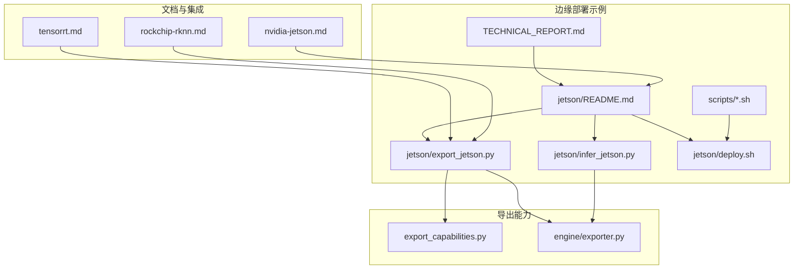
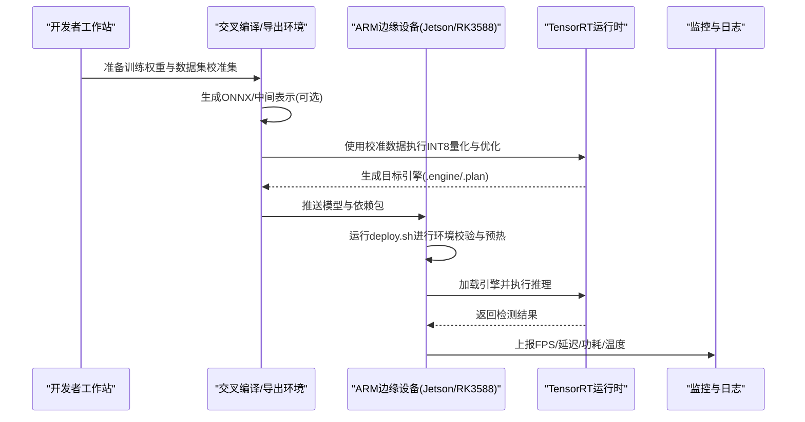
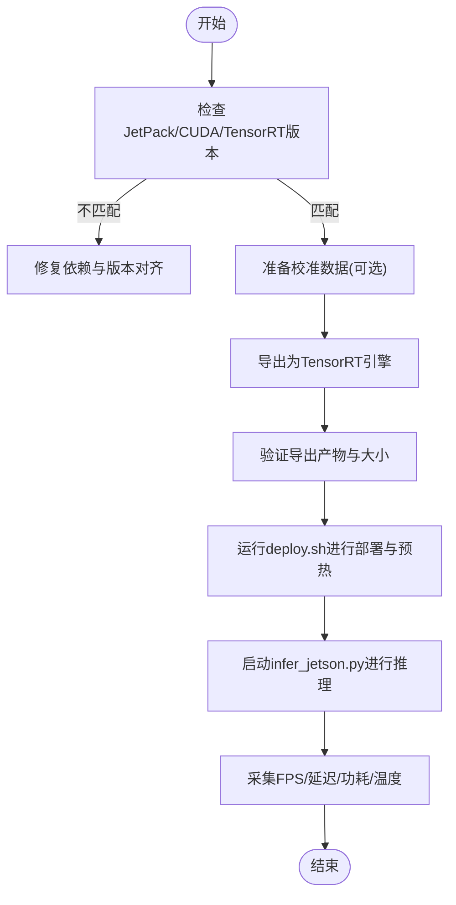
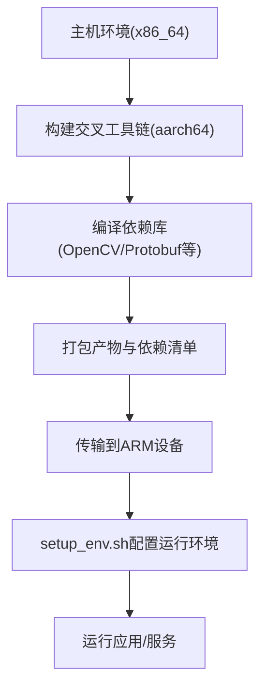
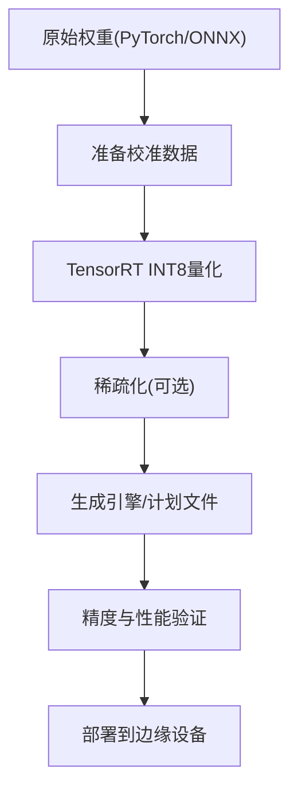
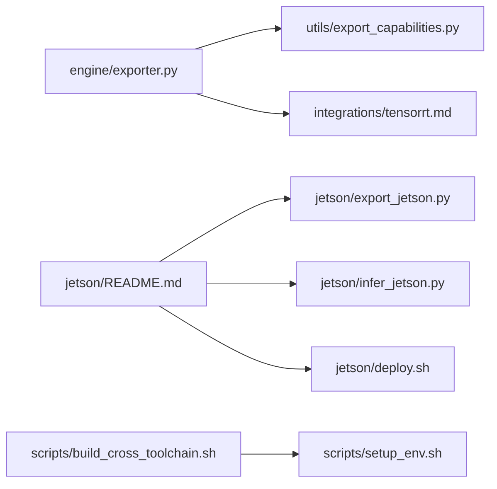

# ARM平台部署

<cite>
**本文引用的文件**
- [examples/YOLO-Master-Cross-Platform-Edge-Deployment/jetson/README.md](file://examples/YOLO-Master-Cross-Platform-Edge-Deployment/jetson/README.md)
- [examples/YOLO-Master-Cross-Platform-Edge-Deployment/jetson/export_jetson.py](file://examples/YOLO-Master-Cross-Platform-Edge-Deployment/jetson/export_jetson.py)
- [examples/YOLO-Master-Cross-Platform-Edge-Deployment/jetson/infer_jetson.py](file://examples/YOLO-Master-Cross-Platform-Edge-Deployment/jetson/infer_jetson.py)
- [examples/YOLO-Master-Cross-Platform-Edge-Deployment/jetson/deploy.sh](file://examples/YOLO-Master-Cross-Platform-Edge-Deployment/jetson/deploy.sh)
- [examples/YOLO-Master-Cross-Platform-Edge-Deployment/scripts/build_cross_toolchain.sh](file://examples/YOLO-Master-Cross-Platform-Edge-Deployment/scripts/build_cross_toolchain.sh)
- [examples/YOLO-Master-Cross-Platform-Edge-Deployment/scripts/setup_env.sh](file://examples/YOLO-Master-Cross-Platform-Edge-Deployment/scripts/setup_env.sh)
- [examples/YOLO-Master-Cross-Platform-Edge-Deployment/TECHNICAL_REPORT.md](file://examples/YOLO-Master-Cross-Platform-Edge-Deployment/TECHNICAL_REPORT.md)
- [docs/en/guides/nvidia-jetson.md](file://docs/en/guides/nvidia-jetson.md)
- [docs/en/integrations/tensorrt.md](file://docs/en/integrations/tensorrt.md)
- [docs/en/integrations/rockchip-rknn.md](file://docs/en/integrations/rockchip-rknn.md)
- [ultralytics/utils/export_capabilities.py](file://ultralytics/utils/export_capabilities.py)
- [ultralytics/engine/exporter.py](file://ultralytics/engine/exporter.py)
</cite>

## 目录
1. [简介](#简介)
2. [项目结构](#项目结构)
3. [核心组件](#核心组件)
4. [架构总览](#架构总览)
5. [详细组件分析](#详细组件分析)
6. [依赖关系分析](#依赖关系分析)
7. [性能与功耗优化](#性能与功耗优化)
8. [故障排查指南](#故障排查指南)
9. [结论](#结论)
10. [附录：自动化脚本与监控方案](#附录自动化脚本与监控方案)

## 简介
本指南面向ARM架构边缘设备，聚焦NVIDIA Jetson系列（JetPack/CUDA/cuDNN/TensorRT）的完整部署流程，并扩展至ARM64交叉编译环境搭建、模型量化与压缩（INT8/稀疏化）、不同ARM芯片（如RK3588、Hi3516）的特定优化策略、内存受限下的加载与实时推理调优、功耗与热控制最佳实践，以及自动化部署与性能监控方案。文档同时结合仓库内现有示例与文档，提供可落地的步骤与参考路径。

## 项目结构
仓库中与ARM/边缘部署相关的资源主要分布在以下位置：
- Jetson专用示例与脚本：examples/YOLO-Master-Cross-Platform-Edge-Deployment/jetson
- 交叉编译与环境准备脚本：examples/YOLO-Master-Cross-Platform-Edge-Deployment/scripts
- 跨平台部署技术报告：examples/YOLO-Master-Cross-Platform-Edge-Deployment/TECHNICAL_REPORT.md
- NVIDIA Jetson官方指南与TensorRT集成文档：docs/en/guides/nvidia-jetson.md, docs/en/integrations/tensorrt.md
- Rockchip RKNN集成文档（用于RK3588等）：docs/en/integrations/rockchip-rknn.md
- 导出能力矩阵与导出器实现：ultralytics/utils/export_capabilities.py, ultralytics/engine/exporter.py

图表来源
- [examples/YOLO-Master-Cross-Platform-Edge-Deployment/jetson/README.md](file://examples/YOLO-Master-Cross-Platform-Edge-Deployment/jetson/README.md)
- [examples/YOLO-Master-Cross-Platform-Edge-Deployment/jetson/export_jetson.py](file://examples/YOLO-Master-Cross-Platform-Edge-Deployment/jetson/export_jetson.py)
- [examples/YOLO-Master-Cross-Platform-Edge-Deployment/jetson/infer_jetson.py](file://examples/YOLO-Master-Cross-Platform-Edge-Deployment/jetson/infer_jetson.py)
- [examples/YOLO-Master-Cross-Platform-Edge-Deployment/jetson/deploy.sh](file://examples/YOLO-Master-Cross-Platform-Edge-Deployment/jetson/deploy.sh)
- [examples/YOLO-Master-Cross-Platform-Edge-Deployment/scripts/build_cross_toolchain.sh](file://examples/YOLO-Master-Cross-Platform-Edge-Deployment/scripts/build_cross_toolchain.sh)
- [examples/YOLO-Master-Cross-Platform-Edge-Deployment/scripts/setup_env.sh](file://examples/YOLO-Master-Cross-Platform-Edge-Deployment/scripts/setup_env.sh)
- [examples/YOLO-Master-Cross-Platform-Edge-Deployment/TECHNICAL_REPORT.md](file://examples/YOLO-Master-Cross-Platform-Edge-Deployment/TECHNICAL_REPORT.md)
- [docs/en/guides/nvidia-jetson.md](file://docs/en/guides/nvidia-jetson.md)
- [docs/en/integrations/tensorrt.md](file://docs/en/integrations/tensorrt.md)
- [docs/en/integrations/rockchip-rknn.md](file://docs/en/integrations/rockchip-rknn.md)
- [ultralytics/utils/export_capabilities.py](file://ultralytics/utils/export_capabilities.py)
- [ultralytics/engine/exporter.py](file://ultralytics/engine/exporter.py)

章节来源
- [examples/YOLO-Master-Cross-Platform-Edge-Deployment/jetson/README.md](file://examples/YOLO-Master-Cross-Platform-Edge-Deployment/jetson/README.md)
- [examples/YOLO-Master-Cross-Platform-Edge-Deployment/TECHNICAL_REPORT.md](file://examples/YOLO-Master-Cross-Platform-Edge-Deployment/TECHNICAL_REPORT.md)
- [docs/en/guides/nvidia-jetson.md](file://docs/en/guides/nvidia-jetson.md)
- [docs/en/integrations/tensorrt.md](file://docs/en/integrations/tensorrt.md)
- [docs/en/integrations/rockchip-rknn.md](file://docs/en/integrations/rockchip-rknn.md)
- [ultralytics/utils/export_capabilities.py](file://ultralytics/utils/export_capabilities.py)
- [ultralytics/engine/exporter.py](file://ultralytics/engine/exporter.py)

## 核心组件
- Jetson导出与推理示例
  - export_jetson.py：面向Jetson的导出流程封装，通常基于ONNX或PyTorch权重生成目标格式（如TensorRT引擎）。
  - infer_jetson.py：在Jetson上加载导出模型并进行推理，包含输入预处理、后处理与可视化输出。
  - deploy.sh：一键部署脚本，负责环境检查、依赖安装、模型导出与验证。
- 交叉编译与环境准备脚本
  - build_cross_toolchain.sh：构建ARM64交叉工具链及必要依赖库。
  - setup_env.sh：在目标设备上初始化运行环境（CUDA/cuDNN/TensorRT/系统库）。
- 文档与集成
  - nvidia-jetson.md：JetPack安装、CUDA/cuDNN配置与常见问题。
  - tensorrt.md：TensorRT导出与优化参数说明。
  - rockchip-rknn.md：RKNN工具链与RK3588部署要点。
- 导出能力与导出器
  - export_capabilities.py：定义各后端导出能力矩阵（精度、算子支持、平台兼容性）。
  - exporter.py：统一导出入口，协调不同后端（ONNX、TensorRT、RKNN等）的导出逻辑。

章节来源
- [examples/YOLO-Master-Cross-Platform-Edge-Deployment/jetson/export_jetson.py](file://examples/YOLO-Master-Cross-Platform-Edge-Deployment/jetson/export_jetson.py)
- [examples/YOLO-Master-Cross-Platform-Edge-Deployment/jetson/infer_jetson.py](file://examples/YOLO-Master-Cross-Platform-Edge-Deployment/jetson/infer_jetson.py)
- [examples/YOLO-Master-Cross-Platform-Edge-Deployment/jetson/deploy.sh](file://examples/YOLO-Master-Cross-Platform-Edge-Deployment/jetson/deploy.sh)
- [examples/YOLO-Master-Cross-Platform-Edge-Deployment/scripts/build_cross_toolchain.sh](file://examples/YOLO-Master-Cross-Platform-Edge-Deployment/scripts/build_cross_toolchain.sh)
- [examples/YOLO-Master-Cross-Platform-Edge-Deployment/scripts/setup_env.sh](file://examples/YOLO-Master-Cross-Platform-Edge-Deployment/scripts/setup_env.sh)
- [docs/en/guides/nvidia-jetson.md](file://docs/en/guides/nvidia-jetson.md)
- [docs/en/integrations/tensorrt.md](file://docs/en/integrations/tensorrt.md)
- [docs/en/integrations/rockchip-rknn.md](file://docs/en/integrations/rockchip-rknn.md)
- [ultralytics/utils/export_capabilities.py](file://ultralytics/utils/export_capabilities.py)
- [ultralytics/engine/exporter.py](file://ultralytics/engine/exporter.py)

## 架构总览
下图展示了从训练权重到边缘设备推理的整体流程，包括导出、量化、部署与监控的关键节点。

图表来源
- [examples/YOLO-Master-Cross-Platform-Edge-Deployment/jetson/export_jetson.py](file://examples/YOLO-Master-Cross-Platform-Edge-Deployment/jetson/export_jetson.py)
- [examples/YOLO-Master-Cross-Platform-Edge-Deployment/jetson/infer_jetson.py](file://examples/YOLO-Master-Cross-Platform-Edge-Deployment/jetson/infer_jetson.py)
- [examples/YOLO-Master-Cross-Platform-Edge-Deployment/jetson/deploy.sh](file://examples/YOLO-Master-Cross-Platform-Edge-Deployment/jetson/deploy.sh)
- [docs/en/integrations/tensorrt.md](file://docs/en/integrations/tensorrt.md)

## 详细组件分析

### Jetson部署流水线
- 环境准备
  - 通过setup_env.sh完成CUDA/cuDNN/TensorRT版本对齐与系统库安装。
  - 参考nvidia-jetson.md中的JetPack安装与驱动/固件注意事项。
- 模型导出与量化
  - 使用export_jetson.py将PyTorch/ONNX权重转换为TensorRT引擎；若需INT8，需提供校准数据集并设置校准缓存。
  - 参考tensorrt.md中关于精度选择（FP16/INT8）、层融合与内核自动选择的建议。
- 推理与服务
  - infer_jetson.py负责加载引擎、批量推理、结果解析与可视化。
  - deploy.sh整合上述步骤并提供一键部署与自检。

图表来源
- [examples/YOLO-Master-Cross-Platform-Edge-Deployment/jetson/deploy.sh](file://examples/YOLO-Master-Cross-Platform-Edge-Deployment/jetson/deploy.sh)
- [examples/YOLO-Master-Cross-Platform-Edge-Deployment/jetson/export_jetson.py](file://examples/YOLO-Master-Cross-Platform-Edge-Deployment/jetson/export_jetson.py)
- [examples/YOLO-Master-Cross-Platform-Edge-Deployment/jetson/infer_jetson.py](file://examples/YOLO-Master-Cross-Platform-Edge-Deployment/jetson/infer_jetson.py)
- [docs/en/guides/nvidia-jetson.md](file://docs/en/guides/nvidia-jetson.md)
- [docs/en/integrations/tensorrt.md](file://docs/en/integrations/tensorrt.md)

章节来源
- [examples/YOLO-Master-Cross-Platform-Edge-Deployment/jetson/README.md](file://examples/YOLO-Master-Cross-Platform-Edge-Deployment/jetson/README.md)
- [examples/YOLO-Master-Cross-Platform-Edge-Deployment/jetson/deploy.sh](file://examples/YOLO-Master-Cross-Platform-Edge-Deployment/jetson/deploy.sh)
- [examples/YOLO-Master-Cross-Platform-Edge-Deployment/jetson/export_jetson.py](file://examples/YOLO-Master-Cross-Platform-Edge-Deployment/jetson/export_jetson.py)
- [examples/YOLO-Master-Cross-Platform-Edge-Deployment/jetson/infer_jetson.py](file://examples/YOLO-Master-Cross-Platform-Edge-Deployment/jetson/infer_jetson.py)
- [docs/en/guides/nvidia-jetson.md](file://docs/en/guides/nvidia-jetson.md)
- [docs/en/integrations/tensorrt.md](file://docs/en/integrations/tensorrt.md)

### ARM64交叉编译环境搭建
- 工具链构建
  - 使用build_cross_toolchain.sh构建aarch64-linux-gnu工具链，并编译必要的C/C++依赖（OpenCV、protobuf、gRPC等，视具体需求而定）。
- 环境变量与路径
  - setup_env.sh在目标设备上设置LD_LIBRARY_PATH、CUDA_HOME、TensorRT路径等，确保运行时链接正确。
- 构建产物分发
  - 将交叉编译生成的二进制与共享库打包，推送到边缘设备进行部署。

图表来源
- [examples/YOLO-Master-Cross-Platform-Edge-Deployment/scripts/build_cross_toolchain.sh](file://examples/YOLO-Master-Cross-Platform-Edge-Deployment/scripts/build_cross_toolchain.sh)
- [examples/YOLO-Master-Cross-Platform-Edge-Deployment/scripts/setup_env.sh](file://examples/YOLO-Master-Cross-Platform-Edge-Deployment/scripts/setup_env.sh)

章节来源
- [examples/YOLO-Master-Cross-Platform-Edge-Deployment/scripts/build_cross_toolchain.sh](file://examples/YOLO-Master-Cross-Platform-Edge-Deployment/scripts/build_cross_toolchain.sh)
- [examples/YOLO-Master-Cross-Platform-Edge-Deployment/scripts/setup_env.sh](file://examples/YOLO-Master-Cross-Platform-Edge-Deployment/scripts/setup_env.sh)

### 模型量化与压缩（INT8/稀疏化）
- INT8量化
  - 在Jetson上使用TensorRT进行INT8量化，需要校准数据集与校准缓存；注意动态形状与批大小的限制。
  - 参考tensorrt.md中关于校准、精度容差与性能权衡的建议。
- 稀疏化优化
  - 针对某些硬件（如部分GPU/NPU），可启用稀疏卷积或稀疏权重加速；需评估算子支持与精度损失。
- 导出能力矩阵
  - 通过export_capabilities.py查看当前模型对目标后端的支持情况，避免导出失败或运行时异常。

图表来源
- [examples/YOLO-Master-Cross-Platform-Edge-Deployment/jetson/export_jetson.py](file://examples/YOLO-Master-Cross-Platform-Edge-Deployment/jetson/export_jetson.py)
- [docs/en/integrations/tensorrt.md](file://docs/en/integrations/tensorrt.md)
- [ultralytics/utils/export_capabilities.py](file://ultralytics/utils/export_capabilities.py)

章节来源
- [examples/YOLO-Master-Cross-Platform-Edge-Deployment/jetson/export_jetson.py](file://examples/YOLO-Master-Cross-Platform-Edge-Deployment/jetson/export_jetson.py)
- [docs/en/integrations/tensorrt.md](file://docs/en/integrations/tensorrt.md)
- [ultralytics/utils/export_capabilities.py](file://ultralytics/utils/export_capabilities.py)

### 不同ARM芯片的特定优化方案
- NVIDIA Jetson（JetPack/CUDA/TensorRT）
  - 优先使用FP16以获得稳定加速；在算力充足且校准数据充分时尝试INT8。
  - 调整batch size与图像分辨率以平衡吞吐与延迟。
- Rockchip RK3588（RKNN）
  - 使用RKNN工具链将模型转换为.rknpu格式；关注算子支持与量化策略。
  - 参考rockchip-rknn.md中的部署流程与常见问题。
- HiSilicon Hi3516
  - 该芯片通常采用厂商SDK（如海思MPP/AI框架）；需在对应生态中进行模型转换与部署。
  - 本项目未提供直接集成脚本，建议参考厂商文档并结合通用导出流程（ONNX→厂商格式）。

章节来源
- [docs/en/integrations/tensorrt.md](file://docs/en/integrations/tensorrt.md)
- [docs/en/integrations/rockchip-rknn.md](file://docs/en/integrations/rockchip-rknn.md)

### 内存限制下的模型加载与实时推理调优
- 分块加载与懒加载
  - 对于大模型，可采用分块加载策略，仅在需要时载入专家或模块（适用于MoE架构）。
- 动态形状与批处理
  - 合理设置最大输入尺寸与批大小，避免峰值内存溢出。
- 线程与队列
  - 使用生产者-消费者队列解耦数据采集与推理，降低抖动。
- 监控与回退
  - 当内存不足时，自动降级到更小模型或更低精度。

章节来源
- [examples/YOLO-Master-Cross-Platform-Edge-Deployment/TECHNICAL_REPORT.md](file://examples/YOLO-Master-Cross-Platform-Edge-Deployment/TECHNICAL_REPORT.md)

### 功耗管理与热控制最佳实践
- 频率与电源模式
  - 根据场景选择合适的CPU/GPU频率与电源模式，避免持续高负载导致降频。
- 散热与风道
  - 确保良好散热条件，必要时增加风扇或被动散热片。
- 自适应调度
  - 依据温度与功耗指标动态调整推理频率与批大小。

章节来源
- [examples/YOLO-Master-Cross-Platform-Edge-Deployment/TECHNICAL_REPORT.md](file://examples/YOLO-Master-Cross-Platform-Edge-Deployment/TECHNICAL_REPORT.md)

## 依赖关系分析
- 导出器与能力矩阵
  - exporter.py作为统一导出入口，调用export_capabilities.py判断后端支持，再执行具体后端导出逻辑。
- Jetson示例与文档
  - jetson示例依赖nvidia-jetson.md与tensorrt.md提供的版本与参数指导。
- 交叉编译脚本
  - build_cross_toolchain.sh与setup_env.sh共同构成构建与运行环境的基础。

图表来源
- [ultralytics/engine/exporter.py](file://ultralytics/engine/exporter.py)
- [ultralytics/utils/export_capabilities.py](file://ultralytics/utils/export_capabilities.py)
- [docs/en/integrations/tensorrt.md](file://docs/en/integrations/tensorrt.md)
- [examples/YOLO-Master-Cross-Platform-Edge-Deployment/jetson/README.md](file://examples/YOLO-Master-Cross-Platform-Edge-Deployment/jetson/README.md)
- [examples/YOLO-Master-Cross-Platform-Edge-Deployment/jetson/export_jetson.py](file://examples/YOLO-Master-Cross-Platform-Edge-Deployment/jetson/export_jetson.py)
- [examples/YOLO-Master-Cross-Platform-Edge-Deployment/jetson/infer_jetson.py](file://examples/YOLO-Master-Cross-Platform-Edge-Deployment/jetson/infer_jetson.py)
- [examples/YOLO-Master-Cross-Platform-Edge-Deployment/jetson/deploy.sh](file://examples/YOLO-Master-Cross-Platform-Edge-Deployment/jetson/deploy.sh)
- [examples/YOLO-Master-Cross-Platform-Edge-Deployment/scripts/build_cross_toolchain.sh](file://examples/YOLO-Master-Cross-Platform-Edge-Deployment/scripts/build_cross_toolchain.sh)
- [examples/YOLO-Master-Cross-Platform-Edge-Deployment/scripts/setup_env.sh](file://examples/YOLO-Master-Cross-Platform-Edge-Deployment/scripts/setup_env.sh)

章节来源
- [ultralytics/engine/exporter.py](file://ultralytics/engine/exporter.py)
- [ultralytics/utils/export_capabilities.py](file://ultralytics/utils/export_capabilities.py)
- [examples/YOLO-Master-Cross-Platform-Edge-Deployment/jetson/README.md](file://examples/YOLO-Master-Cross-Platform-Edge-Deployment/jetson/README.md)
- [examples/YOLO-Master-Cross-Platform-Edge-Deployment/scripts/build_cross_toolchain.sh](file://examples/YOLO-Master-Cross-Platform-Edge-Deployment/scripts/build_cross_toolchain.sh)
- [examples/YOLO-Master-Cross-Platform-Edge-Deployment/scripts/setup_env.sh](file://examples/YOLO-Master-Cross-Platform-Edge-Deployment/scripts/setup_env.sh)

## 性能与功耗优化
- 精度选择
  - FP16在多数Jetson平台上具备良好性价比；INT8需充分校准并注意精度下降风险。
- 输入尺寸与批大小
  - 降低分辨率与批大小可减少内存占用与延迟，提升实时性。
- 线程与并行
  - 合理设置线程数，避免与系统其他进程争抢资源。
- 监控与自适应
  - 实时监控FPS、延迟、功耗与温度，动态调整参数以保持稳定性能。

[本节为通用指导，无需列出具体文件来源]

## 故障排查指南
- 版本不匹配
  - 确认JetPack、CUDA、cuDNN、TensorRT版本一致，参考nvidia-jetson.md。
- 导出失败
  - 检查export_capabilities.py中的能力矩阵，确认目标后端支持所需算子与形状。
- 运行时崩溃
  - 检查LD_LIBRARY_PATH与CUDA/TensorRT库路径是否正确，参考setup_env.sh。
- 精度异常
  - 重新校准并检查校准数据分布；适当放宽精度容差或回退到FP16。

章节来源
- [docs/en/guides/nvidia-jetson.md](file://docs/en/guides/nvidia-jetson.md)
- [ultralytics/utils/export_capabilities.py](file://ultralytics/utils/export_capabilities.py)
- [examples/YOLO-Master-Cross-Platform-Edge-Deployment/scripts/setup_env.sh](file://examples/YOLO-Master-Cross-Platform-Edge-Deployment/scripts/setup_env.sh)

## 结论
通过Jetson专用示例、TensorRT集成文档与交叉编译脚本，可在ARM边缘设备上实现端到端的YOLO模型部署与优化。结合INT8量化、稀疏化与自适应调度，可在内存与功耗受限条件下获得稳定的实时推理性能。针对不同ARM芯片（如RK3588、Hi3516），应遵循各自生态的工具链与最佳实践。

[本节为总结，无需列出具体文件来源]

## 附录：自动化脚本与监控方案
- 自动化部署脚本
  - deploy.sh：一键完成环境检查、依赖安装、模型导出与验证。
  - build_cross_toolchain.sh与setup_env.sh：构建与配置交叉编译与运行环境。
- 性能监控方案
  - 在infer_jetson.py中集成FPS、延迟、功耗与温度采集，并通过日志或轻量API上报。
  - 结合系统工具（如nvtop、htop、iostat）进行综合监控。

章节来源
- [examples/YOLO-Master-Cross-Platform-Edge-Deployment/jetson/deploy.sh](file://examples/YOLO-Master-Cross-Platform-Edge-Deployment/jetson/deploy.sh)
- [examples/YOLO-Master-Cross-Platform-Edge-Deployment/jetson/infer_jetson.py](file://examples/YOLO-Master-Cross-Platform-Edge-Deployment/jetson/infer_jetson.py)
- [examples/YOLO-Master-Cross-Platform-Edge-Deployment/scripts/build_cross_toolchain.sh](file://examples/YOLO-Master-Cross-Platform-Edge-Deployment/scripts/build_cross_toolchain.sh)
- [examples/YOLO-Master-Cross-Platform-Edge-Deployment/scripts/setup_env.sh](file://examples/YOLO-Master-Cross-Platform-Edge-Deployment/scripts/setup_env.sh)