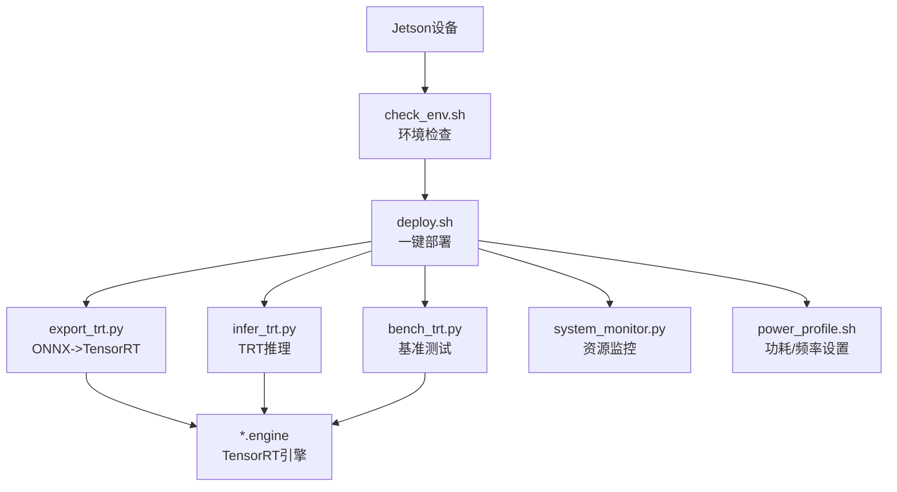
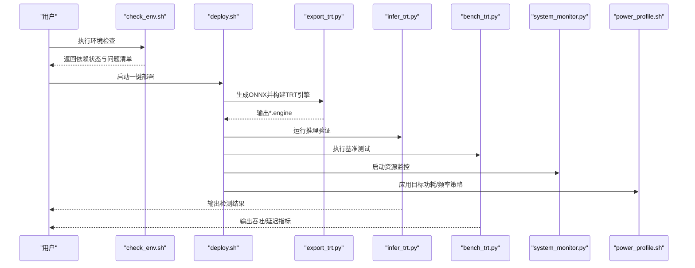
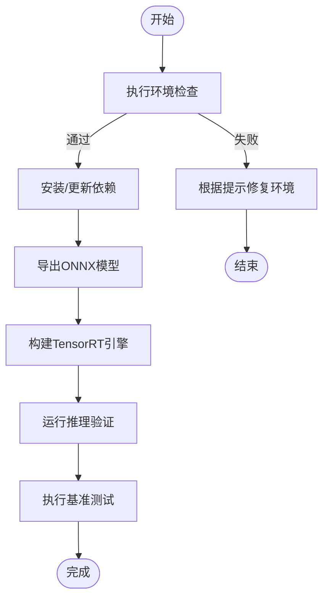
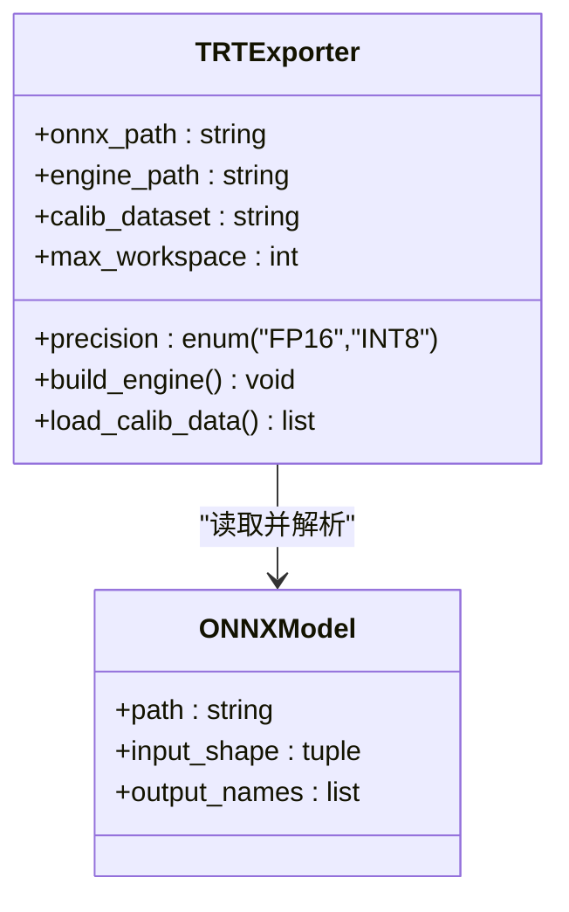
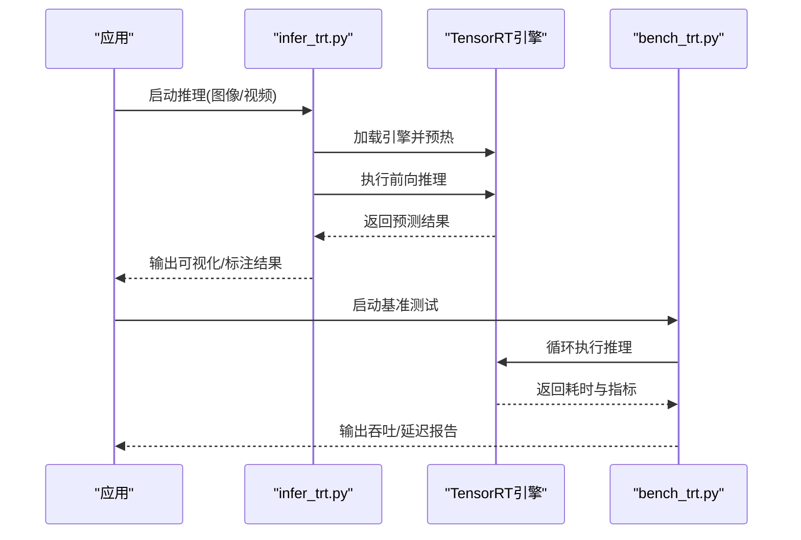
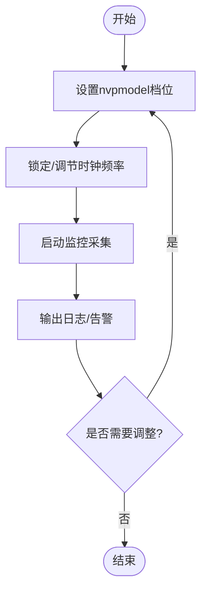
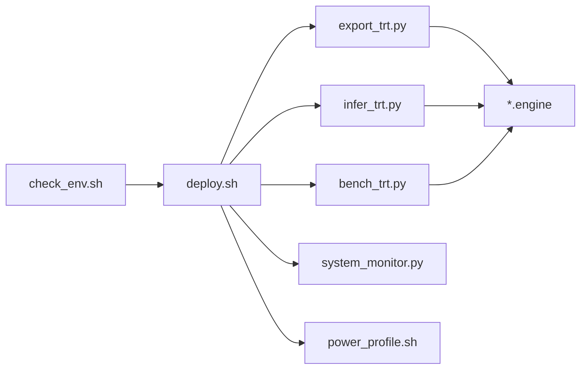

# NVIDIA Jetson部署

<cite>
**本文引用的文件**
- [examples/YOLO-Master-Cross-Platform-Edge-Deployment/jetson/README.md](file://examples/YOLO-Master-Cross-Platform-Edge-Deployment/jetson/README.md)
- [examples/YOLO-Master-Cross-Platform-Edge-Deployment/jetson/deploy.sh](file://examples/YOLO-Master-Cross-Platform-Edge-Deployment/jetson/deploy.sh)
- [examples/YOLO-Master-Cross-Platform-Edge-Deployment/jetson/export_trt.py](file://examples/YOLO-Master-Cross-Platform-Edge-Deployment/jetson/export_trt.py)
- [examples/YOLO-Master-Cross-Platform-Edge-Deployment/jetson/infer_trt.py](file://examples/YOLO-Master-Cross-Platform-Edge-Deployment/jetson/infer_trt.py)
- [examples/YOLO-Master-Cross-Platform-Edge-Deployment/jetson/bench_trt.py](file://examples/YOLO-Master-Cross-Platform-Edge-Deployment/jetson/bench_trt.py)
- [examples/YOLO-Master-Cross-Platform-Edge-Deployment/jetson/system_monitor.py](file://examples/YOLO-Master-Cross-Platform-Edge-Deployment/jetson/system_monitor.py)
- [examples/YOLO-Master-Cross-Platform-Edge-Deployment/jetson/power_profile.sh](file://examples/YOLO-Master-Cross-Platform-Edge-Deployment/jetson/power_profile.sh)
- [examples/YOLO-Master-Cross-Platform-Edge-Deployment/jetson/check_env.sh](file://examples/YOLO-Master-Cross-Platform-Edge-Deployment/jetson/check_env.sh)
- [docs/en/guides/nvidia-jetson.md](file://docs/en/guides/nvidia-jetson.md)
- [docs/en/guides/deepstream-nvidia-jetson.md](file://docs/en/guides/deepstream-nvidia-jetson.md)
- [docs/en/integrations/tensorrt.md](file://docs/en/integrations/tensorrt.md)
- [ultralytics/utils/benchmarks.py](file://ultralytics/utils/benchmarks.py)
- [ultralytics/engine/exporter.py](file://ultralytics/engine/exporter.py)
- [ultralytics/utils/export_capabilities.py](file://ultralytics/utils/export_capabilities.py)
</cite>

## 目录
1. [简介](#简介)
2. [项目结构](#项目结构)
3. [核心组件](#核心组件)
4. [架构总览](#架构总览)
5. [详细组件分析](#详细组件分析)
6. [依赖关系分析](#依赖关系分析)
7. [性能考量](#性能考量)
8. [故障排查指南](#故障排查指南)
9. [结论](#结论)
10. [附录](#附录)

## 简介
本指南面向NVIDIA Jetson系列设备（Nano、TX2、Xavier、Orin），提供从JetPack安装与CUDA/cuDNN环境配置，到TensorRT优化（模型转换、精度校准、性能调优）、内存管理与功耗控制策略的完整部署方案。文档同时给出自动化部署脚本的使用说明、实时推理基准测试与监控方法，并总结常见问题及解决方案。

## 项目结构
本项目在跨平台边缘部署示例中提供了针对Jetson的一键式工具链，包括环境检查、依赖安装、模型导出为TensorRT引擎、推理与基准测试、系统监控与功耗配置等脚本与Python模块。

图表来源
- [examples/YOLO-Master-Cross-Platform-Edge-Deployment/jetson/check_env.sh](file://examples/YOLO-Master-Cross-Platform-Edge-Deployment/jetson/check_env.sh)
- [examples/YOLO-Master-Cross-Platform-Edge-Deployment/jetson/deploy.sh](file://examples/YOLO-Master-Cross-Platform-Edge-Deployment/jetson/deploy.sh)
- [examples/YOLO-Master-Cross-Platform-Edge-Deployment/jetson/export_trt.py](file://examples/YOLO-Master-Cross-Platform-Edge-Deployment/jetson/export_trt.py)
- [examples/YOLO-Master-Cross-Platform-Edge-Deployment/jetson/infer_trt.py](file://examples/YOLO-Master-Cross-Platform-Edge-Deployment/jetson/infer_trt.py)
- [examples/YOLO-Master-Cross-Platform-Edge-Deployment/jetson/bench_trt.py](file://examples/YOLO-Master-Cross-Platform-Edge-Deployment/jetson/bench_trt.py)
- [examples/YOLO-Master-Cross-Platform-Edge-Deployment/jetson/system_monitor.py](file://examples/YOLO-Master-Cross-Platform-Edge-Deployment/jetson/system_monitor.py)
- [examples/YOLO-Master-Cross-Platform-Edge-Deployment/jetson/power_profile.sh](file://examples/YOLO-Master-Cross-Platform-Edge-Deployment/jetson/power_profile.sh)

章节来源
- [examples/YOLO-Master-Cross-Platform-Edge-Deployment/jetson/README.md](file://examples/YOLO-Master-Cross-Platform-Edge-Deployment/jetson/README.md)

## 核心组件
- 环境检查脚本：检测JetPack版本、CUDA/cuDNN、TensorRT、Python与依赖库是否就绪，输出诊断信息。
- 一键部署脚本：执行环境检查、安装依赖、生成ONNX、构建TensorRT引擎、验证推理与基准测试。
- TensorRT导出器：基于ONNX模型构建TensorRT引擎，支持FP16/INT8（含校准）与不同builder选项。
- 推理程序：加载TRT引擎进行图像/视频流推理，支持批量与动态输入尺寸。
- 基准测试：统计吞吐、延迟、GPU/CPU利用率与内存占用，输出可复现实验报告。
- 系统监控：采集CPU/GPU温度、功耗、内存、进程状态，便于在线观测。
- 功耗配置：通过nvpmodel与jetson_clocks调整性能档位与频率，平衡功耗与时延。

章节来源
- [examples/YOLO-Master-Cross-Platform-Edge-Deployment/jetson/check_env.sh](file://examples/YOLO-Master-Cross-Platform-Edge-Deployment/jetson/check_env.sh)
- [examples/YOLO-Master-Cross-Platform-Edge-Deployment/jetson/deploy.sh](file://examples/YOLO-Master-Cross-Platform-Edge-Deployment/jetson/deploy.sh)
- [examples/YOLO-Master-Cross-Platform-Edge-Deployment/jetson/export_trt.py](file://examples/YOLO-Master-Cross-Platform-Edge-Deployment/jetson/export_trt.py)
- [examples/YOLO-Master-Cross-Platform-Edge-Deployment/jetson/infer_trt.py](file://examples/YOLO-Master-Cross-Platform-Edge-Deployment/jetson/infer_trt.py)
- [examples/YOLO-Master-Cross-Platform-Edge-Deployment/jetson/bench_trt.py](file://examples/YOLO-Master-Cross-Platform-Edge-Deployment/jetson/bench_trt.py)
- [examples/YOLO-Master-Cross-Platform-Edge-Deployment/jetson/system_monitor.py](file://examples/YOLO-Master-Cross-Platform-Edge-Deployment/jetson/system_monitor.py)
- [examples/YOLO-Master-Cross-Platform-Edge-Deployment/jetson/power_profile.sh](file://examples/YOLO-Master-Cross-Platform-Edge-Deployment/jetson/power_profile.sh)

## 架构总览
下图展示从“环境准备”到“模型部署与运行”的整体流程，以及各脚本与模块之间的调用关系。

图表来源
- [examples/YOLO-Master-Cross-Platform-Edge-Deployment/jetson/check_env.sh](file://examples/YOLO-Master-Cross-Platform-Edge-Deployment/jetson/check_env.sh)
- [examples/YOLO-Master-Cross-Platform-Edge-Deployment/jetson/deploy.sh](file://examples/YOLO-Master-Cross-Platform-Edge-Deployment/jetson/deploy.sh)
- [examples/YOLO-Master-Cross-Platform-Edge-Deployment/jetson/export_trt.py](file://examples/YOLO-Master-Cross-Platform-Edge-Deployment/jetson/export_trt.py)
- [examples/YOLO-Master-Cross-Platform-Edge-Deployment/jetson/infer_trt.py](file://examples/YOLO-Master-Cross-Platform-Edge-Deployment/jetson/infer_trt.py)
- [examples/YOLO-Master-Cross-Platform-Edge-Deployment/jetson/bench_trt.py](file://examples/YOLO-Master-Cross-Platform-Edge-Deployment/jetson/bench_trt.py)
- [examples/YOLO-Master-Cross-Platform-Edge-Deployment/jetson/system_monitor.py](file://examples/YOLO-Master-Cross-Platform-Edge-Deployment/jetson/system_monitor.py)
- [examples/YOLO-Master-Cross-Platform-Edge-Deployment/jetson/power_profile.sh](file://examples/YOLO-Master-Cross-Platform-Edge-Deployment/jetson/power_profile.sh)

## 详细组件分析

### 环境检查与环境准备
- 功能要点
  - 校验JetPack版本、CUDA/cuDNN、TensorRT、Python解释器与关键库可用性。
  - 打印缺失项与建议修复命令，辅助快速定位问题。
- 使用建议
  - 在首次上电或镜像刷新后优先执行，确保后续步骤前置条件满足。
  - 若提示驱动冲突或库版本不匹配，按提示回退或升级对应组件。

章节来源
- [examples/YOLO-Master-Cross-Platform-Edge-Deployment/jetson/check_env.sh](file://examples/YOLO-Master-Cross-Platform-Edge-Deployment/jetson/check_env.sh)
- [docs/en/guides/nvidia-jetson.md](file://docs/en/guides/nvidia-jetson.md)

### 一键部署脚本
- 功能要点
  - 串联环境检查、依赖安装、ONNX导出、TRT引擎构建、推理验证与基准测试。
  - 支持参数化选择精度（FP16/INT8）、批大小、输入分辨率与校准集路径。
- 典型流程
  - 检查环境 -> 安装依赖 -> 导出ONNX -> 构建TRT引擎 -> 运行推理 -> 执行基准 -> 输出日志与产物。

图表来源
- [examples/YOLO-Master-Cross-Platform-Edge-Deployment/jetson/deploy.sh](file://examples/YOLO-Master-Cross-Platform-Edge-Deployment/jetson/deploy.sh)
- [examples/YOLO-Master-Cross-Platform-Edge-Deployment/jetson/export_trt.py](file://examples/YOLO-Master-Cross-Platform-Edge-Deployment/jetson/export_trt.py)

章节来源
- [examples/YOLO-Master-Cross-Platform-Edge-Deployment/jetson/deploy.sh](file://examples/YOLO-Master-Cross-Platform-Edge-Deployment/jetson/deploy.sh)

### TensorRT导出与优化
- 功能要点
  - 基于ONNX模型构建TensorRT引擎，支持FP16与INT8（含校准）。
  - 可选builder参数：最大工作空间、优化级别、动态形状、多精度标志等。
  - 集成校准数据读取与缓存，提升INT8稳定性。
- 优化建议
  - 对Orin/Xavier优先尝试FP16；对算力受限场景再评估INT8。
  - 合理设置最大工作空间以平衡显存占用与加速效果。
  - 固定输入尺寸可减少编译时间并提高运行时稳定性。

图表来源
- [examples/YOLO-Master-Cross-Platform-Edge-Deployment/jetson/export_trt.py](file://examples/YOLO-Master-Cross-Platform-Edge-Deployment/jetson/export_trt.py)
- [docs/en/integrations/tensorrt.md](file://docs/en/integrations/tensorrt.md)

章节来源
- [examples/YOLO-Master-Cross-Platform-Edge-Deployment/jetson/export_trt.py](file://examples/YOLO-Master-Cross-Platform-Edge-Deployment/jetson/export_trt.py)
- [docs/en/integrations/tensorrt.md](file://docs/en/integrations/tensorrt.md)

### 推理与基准测试
- 推理程序
  - 加载TRT引擎，预处理输入，执行前向推理，后处理结果并可视化/保存。
  - 支持单帧与视频流模式，可切换不同batch与分辨率。
- 基准测试
  - 统计端到端时延、吞吐、GPU/CPU利用率、内存峰值，输出CSV/JSON报告。
  - 支持多次迭代取稳定值，避免冷启动偏差。

图表来源
- [examples/YOLO-Master-Cross-Platform-Edge-Deployment/jetson/infer_trt.py](file://examples/YOLO-Master-Cross-Platform-Edge-Deployment/jetson/infer_trt.py)
- [examples/YOLO-Master-Cross-Platform-Edge-Deployment/jetson/bench_trt.py](file://examples/YOLO-Master-Cross-Platform-Edge-Deployment/jetson/bench_trt.py)

章节来源
- [examples/YOLO-Master-Cross-Platform-Edge-Deployment/jetson/infer_trt.py](file://examples/YOLO-Master-Cross-Platform-Edge-Deployment/jetson/infer_trt.py)
- [examples/YOLO-Master-Cross-Platform-Edge-Deployment/jetson/bench_trt.py](file://examples/YOLO-Master-Cross-Platform-Edge-Deployment/jetson/bench_trt.py)
- [ultralytics/utils/benchmarks.py](file://ultralytics/utils/benchmarks.py)

### 系统监控与功耗控制
- 系统监控
  - 采集CPU/GPU温度、功耗、内存、进程状态，周期性上报至文件或可视化面板。
- 功耗控制
  - 通过nvpmodel设定性能档位（如高性能/平衡/节能），配合jetson_clocks锁定频率。
  - 结合任务SLA与散热条件选择合适的profile，避免过热降频。

图表来源
- [examples/YOLO-Master-Cross-Platform-Edge-Deployment/jetson/system_monitor.py](file://examples/YOLO-Master-Cross-Platform-Edge-Deployment/jetson/system_monitor.py)
- [examples/YOLO-Master-Cross-Platform-Edge-Deployment/jetson/power_profile.sh](file://examples/YOLO-Master-Cross-Platform-Edge-Deployment/jetson/power_profile.sh)

章节来源
- [examples/YOLO-Master-Cross-Platform-Edge-Deployment/jetson/system_monitor.py](file://examples/YOLO-Master-Cross-Platform-Edge-Deployment/jetson/system_monitor.py)
- [examples/YOLO-Master-Cross-Platform-Edge-Deployment/jetson/power_profile.sh](file://examples/YOLO-Master-Cross-Platform-Edge-Deployment/jetson/power_profile.sh)

## 依赖关系分析
- 外部依赖
  - CUDA/cuDNN：由JetPack提供，需与TensorRT版本兼容。
  - TensorRT：用于模型优化与推理加速。
  - Python生态：numpy、opencv-python、pycuda/trt相关包（视实现而定）。
- 内部依赖
  - deploy.sh依赖check_env.sh与export_trt.py。
  - infer_trt.py与bench_trt.py依赖已构建的*.engine。
  - system_monitor.py与power_profile.sh为运维支撑工具。

图表来源
- [examples/YOLO-Master-Cross-Platform-Edge-Deployment/jetson/check_env.sh](file://examples/YOLO-Master-Cross-Platform-Edge-Deployment/jetson/check_env.sh)
- [examples/YOLO-Master-Cross-Platform-Edge-Deployment/jetson/deploy.sh](file://examples/YOLO-Master-Cross-Platform-Edge-Deployment/jetson/deploy.sh)
- [examples/YOLO-Master-Cross-Platform-Edge-Deployment/jetson/export_trt.py](file://examples/YOLO-Master-Cross-Platform-Edge-Deployment/jetson/export_trt.py)
- [examples/YOLO-Master-Cross-Platform-Edge-Deployment/jetson/infer_trt.py](file://examples/YOLO-Master-Cross-Platform-Edge-Deployment/jetson/infer_trt.py)
- [examples/YOLO-Master-Cross-Platform-Edge-Deployment/jetson/bench_trt.py](file://examples/YOLO-Master-Cross-Platform-Edge-Deployment/jetson/bench_trt.py)
- [examples/YOLO-Master-Cross-Platform-Edge-Deployment/jetson/system_monitor.py](file://examples/YOLO-Master-Cross-Platform-Edge-Deployment/jetson/system_monitor.py)
- [examples/YOLO-Master-Cross-Platform-Edge-Deployment/jetson/power_profile.sh](file://examples/YOLO-Master-Cross-Platform-Edge-Deployment/jetson/power_profile.sh)

章节来源
- [examples/YOLO-Master-Cross-Platform-Edge-Deployment/jetson/README.md](file://examples/YOLO-Master-Cross-Platform-Edge-Deployment/jetson/README.md)

## 性能考量
- 模型层面
  - 优先使用FP16以获得显著加速；仅在精度可接受时启用INT8并充分校准。
  - 减少不必要的动态维度，固定输入尺寸有助于缩短编译时间与提升稳定性。
- 运行时层面
  - 合理设置批大小与线程数，避免上下文切换开销过大。
  - 预热引擎与I/O通道，消除冷启动抖动。
- 系统层面
  - 使用nvpmodel与jetson_clocks将设备置于合适性能档位，避免过热降频。
  - 监控内存峰值，必要时降低分辨率或批大小。

[本节为通用指导，无需列出具体文件来源]

## 故障排查指南
- 常见环境问题
  - CUDA/cuDNN与TensorRT版本不匹配：参考官方兼容性矩阵，统一升级或降级至推荐组合。
  - 驱动冲突：卸载多余驱动，仅保留JetPack提供的版本。
  - 内存不足：降低分辨率/批大小，关闭后台高耗进程，启用swap分区。
- 调试建议
  - 先执行环境检查脚本，逐项修复后再进入部署流程。
  - 使用基准测试脚本对比不同精度/尺寸的吞吐与延迟，定位瓶颈。
  - 通过系统监控观察温度与功耗，避免热节流影响性能。

章节来源
- [examples/YOLO-Master-Cross-Platform-Edge-Deployment/jetson/check_env.sh](file://examples/YOLO-Master-Cross-Platform-Edge-Deployment/jetson/check_env.sh)
- [examples/YOLO-Master-Cross-Platform-Edge-Deployment/jetson/bench_trt.py](file://examples/YOLO-Master-Cross-Platform-Edge-Deployment/jetson/bench_trt.py)
- [examples/YOLO-Master-Cross-Platform-Edge-Deployment/jetson/system_monitor.py](file://examples/YOLO-Master-Cross-Platform-Edge-Deployment/jetson/system_monitor.py)

## 结论
借助本项目提供的Jetson专用脚本与工具链，可在Nano/TX2/Xavier/Orin等设备上快速完成环境准备、模型导出、TRT优化、推理验证与基准测试，并通过系统监控与功耗配置保障线上稳定性与性能。建议在上线前完成多精度与多尺寸的回归测试，建立基线指标与告警阈值。

[本节为总结性内容，无需列出具体文件来源]

## 附录
- 相关文档
  - Jetson平台指南与DeepStream集成说明，可作为环境与流水线参考。
  - TensorRT集成文档，涵盖导出与优化最佳实践。
  - 通用基准工具，可用于横向对比不同后端与配置。

章节来源
- [docs/en/guides/nvidia-jetson.md](file://docs/en/guides/nvidia-jetson.md)
- [docs/en/guides/deepstream-nvidia-jetson.md](file://docs/en/guides/deepstream-nvidia-jetson.md)
- [docs/en/integrations/tensorrt.md](file://docs/en/integrations/tensorrt.md)
- [ultralytics/utils/benchmarks.py](file://ultralytics/utils/benchmarks.py)
- [ultralytics/engine/exporter.py](file://ultralytics/engine/exporter.py)
- [ultralytics/utils/export_capabilities.py](file://ultralytics/utils/export_capabilities.py)