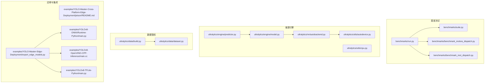
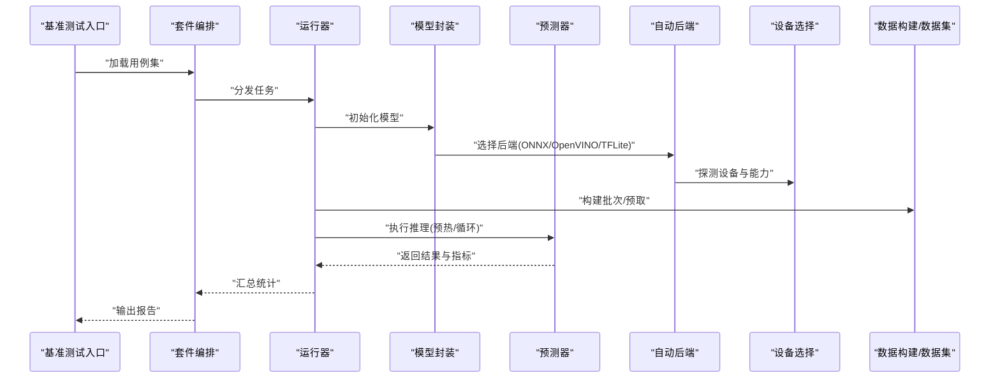
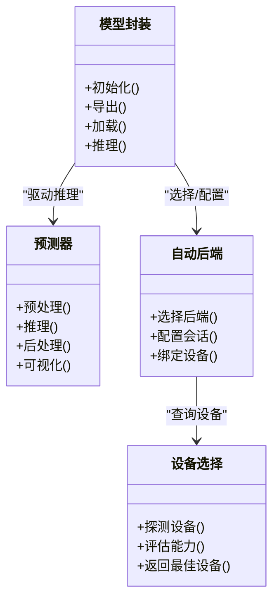
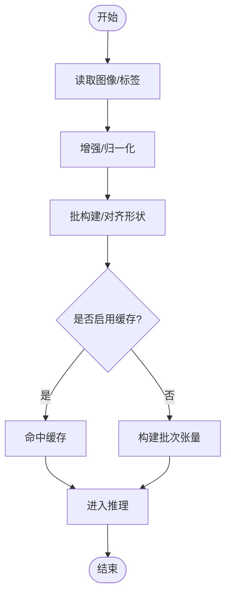
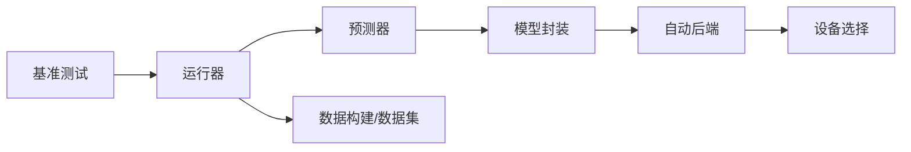

# 性能优化与调优

<cite>
**本文引用的文件**
- [benchmarks/run.py](file://benchmarks/run.py)
- [benchmarks/suite.py](file://benchmarks/suite.py)
- [benchmarks/benchmark_molora_dispatch.py](file://benchmarks/benchmark_molora_dispatch.py)
- [benchmarks/benchmark_mot_dispatch.py](file://benchmarks/benchmark_mot_dispatch.py)
- [ultralytics/utils/benchmarks.py](file://ultralytics/utils/benchmarks.py)
- [ultralytics/engine/predictor.py](file://ultralytics/engine/predictor.py)
- [ultralytics/engine/model.py](file://ultralytics/engine/model.py)
- [ultralytics/nn/autobackend.py](file://ultralytics/nn/autobackend.py)
- [ultralytics/utils/autodevice.py](file://ultralytics/utils/autodevice.py)
- [ultralytics/utils/cpu.py](file://ultralytics/utils/cpu.py)
- [ultralytics/data/build.py](file://ultralytics/data/build.py)
- [ultralytics/data/dataset.py](file://ultralytics/data/dataset.py)
- [examples/YOLO-Master-Cross-Platform-Edge-Deployment/jetson/README.md](file://examples/YOLO-Master-Cross-Platform-Edge-Deployment/jetson/README.md)
- [examples/YOLO-Master-Edge-Deployment/export_edge_models.py](file://examples/YOLO-Master-Edge-Deployment/export_edge_models.py)
- [examples/YOLOv8-ONNXRuntime-Python/main.py](file://examples/YOLOv8-ONNXRuntime-Python/main.py)
- [examples/YOLOv8-OpenVINO-CPP-Inference/main.cc](file://examples/YOLOv8-OpenVINO-CPP-Inference/main.cc)
- [examples/YOLOv8-TFLite-Python/main.py](file://examples/YOLOv8-TFLite-Python/main.py)
- [docs/en/guides/yolo-thread-safe-inference.md](file://docs/en/guides/yolo-thread-safe-inference.md)
- [docs/en/guides/nvidia-jetson.md](file://docs/en/guides/nvidia-jetson.md)
- [docs/en/guides/raspberry-pi.md](file://docs/en/guides/raspberry-pi.md)
- [docs/en/integrations/openvino.md](file://docs/en/integrations/openvino.md)
- [docs/en/integrations/tflite.md](file://docs/en/integrations/tflite.md)
- [docs/en/modes/benchmark.md](file://docs/en/modes/benchmark.md)
</cite>

## 目录
1. [简介](#简介)
2. [项目结构](#项目结构)
3. [核心组件](#核心组件)
4. [架构总览](#架构总览)
5. [详细组件分析](#详细组件分析)
6. [依赖关系分析](#依赖关系分析)
7. [性能考量](#性能考量)
8. [故障排查指南](#故障排查指南)
9. [结论](#结论)
10. [附录](#附录)

## 简介
本指南面向ARM平台（含Jetson、树莓派等）的YOLO推理与训练工作负载，聚焦以下目标：
- 内存使用优化：内存池管理、缓存友好访问、垃圾回收调优
- 多线程与并行：线程亲和性、NUMA感知调度、批处理与流水线
- CPU与功耗：频率调节、动态电压调整、热控制策略
- 实时推理瓶颈分析与调优：端到端延迟与吞吐平衡
- 不同工作负载下的特征与针对性优化
- 完整的性能监控与基准测试工具链

## 项目结构
仓库中与ARM性能优化相关的代码与文档主要分布在如下位置：
- 基准测试套件与运行器：benchmarks/*
- 运行时推理与设备选择：ultralytics/engine/*, ultralytics/utils/*
- 数据加载与预处理：ultralytics/data/*
- 边缘部署示例与集成文档：examples/*, docs/en/integrations/*, docs/en/guides/*

图表来源
- [benchmarks/run.py](file://benchmarks/run.py)
- [benchmarks/suite.py](file://benchmarks/suite.py)
- [benchmarks/benchmark_molora_dispatch.py](file://benchmarks/benchmark_molora_dispatch.py)
- [benchmarks/benchmark_mot_dispatch.py](file://benchmarks/benchmark_mot_dispatch.py)
- [ultralytics/engine/predictor.py](file://ultralytics/engine/predictor.py)
- [ultralytics/engine/model.py](file://ultralytics/engine/model.py)
- [ultralytics/nn/autobackend.py](file://ultralytics/nn/autobackend.py)
- [ultralytics/utils/autodevice.py](file://ultralytics/utils/autodedevice.py)
- [ultralytics/utils/cpu.py](file://ultralytics/utils/cpu.py)
- [ultralytics/data/build.py](file://ultralytics/data/build.py)
- [ultralytics/data/dataset.py](file://ultralytics/data/dataset.py)
- [examples/YOLO-Master-Cross-Platform-Edge-Deployment/jetson/README.md](file://examples/YOLO-Master-Cross-Platform-Edge-Deployment/jetson/README.md)
- [examples/YOLO-Master-Edge-Deployment/export_edge_models.py](file://examples/YOLO-Master-Edge-Deployment/export_edge_models.py)
- [examples/YOLOv8-ONNXRuntime-Python/main.py](file://examples/YOLOv8-ONNXRuntime-Python/main.py)
- [examples/YOLOv8-OpenVINO-CPP-Inference/main.cc](file://examples/YOLOv8-OpenVINO-CPP-Inference/main.cc)
- [examples/YOLOv8-TFLite-Python/main.py](file://examples/YOLOv8-TFLite-Python/main.py)

章节来源
- [benchmarks/run.py](file://benchmarks/run.py)
- [benchmarks/suite.py](file://benchmarks/suite.py)
- [ultralytics/engine/predictor.py](file://ultralytics/engine/predictor.py)
- [ultralytics/engine/model.py](file://ultralytics/engine/model.py)
- [ultralytics/nn/autobackend.py](file://ultralytics/nn/autobackend.py)
- [ultralytics/utils/autodevice.py](file://ultralytics/utils/autodevice.py)
- [ultralytics/utils/cpu.py](file://ultralytics/utils/cpu.py)
- [ultralytics/data/build.py](file://ultralytics/data/build.py)
- [ultralytics/data/dataset.py](file://ultralytics/data/dataset.py)
- [examples/YOLO-Master-Cross-Platform-Edge-Deployment/jetson/README.md](file://examples/YOLO-Master-Cross-Platform-Edge-Deployment/jetson/README.md)
- [examples/YOLO-Master-Edge-Deployment/export_edge_models.py](file://examples/YOLO-Master-Edge-Deployment/export_edge_models.py)
- [examples/YOLOv8-ONNXRuntime-Python/main.py](file://examples/YOLOv8-ONNXRuntime-Python/main.py)
- [examples/YOLOv8-OpenVINO-CPP-Inference/main.cc](file://examples/YOLOv8-OpenVINO-CPP-Inference/main.cc)
- [examples/YOLOv8-TFLite-Python/main.py](file://examples/YOLOv8-TFLite-Python/main.py)

## 核心组件
- 基准测试运行器与套件
  - 提供统一入口与用例编排，支持多后端与任务场景的对比评测。
- 推理预测器与模型封装
  - 负责输入预处理、推理执行、后处理与结果聚合；与自动后端和设备选择协同。
- 自动后端与设备选择
  - 根据环境自动选择最优推理后端（如ONNX Runtime、OpenVINO、TFLite等），并配置设备参数。
- 数据构建与数据集
  - 负责数据读取、增强、批构建与缓存，直接影响I/O与CPU占用。
- 边缘部署与集成示例
  - 提供Jetson、ONNX、OpenVINO、TFLite等平台的部署参考与导出脚本。

章节来源
- [benchmarks/run.py](file://benchmarks/run.py)
- [benchmarks/suite.py](file://benchmarks/suite.py)
- [ultralytics/engine/predictor.py](file://ultralytics/engine/predictor.py)
- [ultralytics/engine/model.py](file://ultralytics/engine/model.py)
- [ultralytics/nn/autobackend.py](file://ultralytics/nn/autobackend.py)
- [ultralytics/utils/autodevice.py](file://ultralytics/utils/autodevice.py)
- [ultralytics/data/build.py](file://ultralytics/data/build.py)
- [ultralytics/data/dataset.py](file://ultralytics/data/dataset.py)
- [examples/YOLO-Master-Edge-Deployment/export_edge_models.py](file://examples/YOLO-Master-Edge-Deployment/export_edge_models.py)

## 架构总览
下图展示从基准测试到推理执行的典型调用路径，以及关键优化点（设备选择、后端绑定、数据管线）。

图表来源
- [benchmarks/run.py](file://benchmarks/run.py)
- [benchmarks/suite.py](file://benchmarks/suite.py)
- [ultralytics/engine/predictor.py](file://ultralytics/engine/predictor.py)
- [ultralytics/engine/model.py](file://ultralytics/engine/model.py)
- [ultralytics/nn/autobackend.py](file://ultralytics/nn/autobackend.py)
- [ultralytics/utils/autodevice.py](file://ultralytics/utils/autodevice.py)
- [ultralytics/data/build.py](file://ultralytics/data/build.py)
- [ultralytics/data/dataset.py](file://ultralytics/data/dataset.py)

## 详细组件分析

### 基准测试与性能度量
- 功能要点
  - 统一入口与用例定义，支持多任务、多后端、多设备的组合测试。
  - 内置或扩展微基准（如MOLoRA路由、MoT调度）以定位热点。
- 优化建议
  - 固定随机种子与预热轮次，避免冷启动偏差。
  - 分离I/O与计算阶段，分别测量端到端与纯推理延迟。
  - 对高频路径进行火焰图/采样分析，结合后端日志定位瓶颈。

章节来源
- [benchmarks/run.py](file://benchmarks/run.py)
- [benchmarks/suite.py](file://benchmarks/suite.py)
- [benchmarks/benchmark_molora_dispatch.py](file://benchmarks/benchmark_molora_dispatch.py)
- [benchmarks/benchmark_mot_dispatch.py](file://benchmarks/benchmark_mot_dispatch.py)

### 推理预测器与模型封装
- 功能要点
  - 预测器负责预处理、推理调用、NMS/解码与可视化；模型封装协调生命周期与资源。
- ARM优化要点
  - 合理设置批大小与图像尺寸，避免峰值内存抖动。
  - 使用固定形状输入减少重编译与内存碎片。
  - 在ARM上优先选择低开销后端（如ONNX Runtime ARM、OpenVINO NPU/ARM CPU）。

图表来源
- [ultralytics/engine/model.py](file://ultralytics/engine/model.py)
- [ultralytics/engine/predictor.py](file://ultralytics/engine/predictor.py)
- [ultralytics/nn/autobackend.py](file://ultralytics/nn/autobackend.py)
- [ultralytics/utils/autodevice.py](file://ultralytics/utils/autodevice.py)

章节来源
- [ultralytics/engine/predictor.py](file://ultralytics/engine/predictor.py)
- [ultralytics/engine/model.py](file://ultralytics/engine/model.py)
- [ultralytics/nn/autobackend.py](file://ultralytics/nn/autobackend.py)
- [ultralytics/utils/autodevice.py](file://ultralytics/utils/autodevice.py)

### 数据构建与数据集
- 功能要点
  - 数据加载、增强、批构建、缓存与多进程读取。
- ARM优化要点
  - 使用内存映射与预取，降低磁盘I/O抖动。
  - 限制并发数以避免抢占CPU核，影响实时性。
  - 将图像解码与预处理融合为单通道，减少中间对象创建。

图表来源
- [ultralytics/data/build.py](file://ultralytics/data/build.py)
- [ultralytics/data/dataset.py](file://ultralytics/data/dataset.py)

章节来源
- [ultralytics/data/build.py](file://ultralytics/data/build.py)
- [ultralytics/data/dataset.py](file://ultralytics/data/dataset.py)

### 边缘部署与集成示例
- Jetson与ARM平台
  - 参考Jetson文档与示例，结合系统级电源管理与NPU加速。
- 导出与后端
  - 通过导出脚本生成ONNX/OpenVINO/TFLite模型，并在对应运行时中部署。
- 运行时示例
  - Python/C++示例展示如何配置线程数、内存池与设备选项。

章节来源
- [examples/YOLO-Master-Cross-Platform-Edge-Deployment/jetson/README.md](file://examples/YOLO-Master-Cross-Platform-Edge-Deployment/jetson/README.md)
- [examples/YOLO-Master-Edge-Deployment/export_edge_models.py](file://examples/YOLO-Master-Edge-Deployment/export_edge_models.py)
- [examples/YOLOv8-ONNXRuntime-Python/main.py](file://examples/YOLOv8-ONNXRuntime-Python/main.py)
- [examples/YOLOv8-OpenVINO-CPP-Inference/main.cc](file://examples/YOLOv8-OpenVINO-CPP-Inference/main.cc)
- [examples/YOLOv8-TFLite-Python/main.py](file://examples/YOLOv8-TFLite-Python/main.py)

## 依赖关系分析
- 组件耦合
  - 基准测试依赖运行器与套件；运行器依赖模型封装与预测器；预测器依赖自动后端与设备选择；数据管线独立但影响整体吞吐。
- 外部依赖
  - ONNX Runtime、OpenVINO、TFLite等后端库；系统级电源管理接口（如Jetson power mode）。
- 潜在环与风险
  - 避免在数据加载路径中引入重型同步；确保后端初始化幂等，防止重复配置导致泄漏。

图表来源
- [benchmarks/run.py](file://benchmarks/run.py)
- [benchmarks/suite.py](file://benchmarks/suite.py)
- [ultralytics/engine/predictor.py](file://ultralytics/engine/predictor.py)
- [ultralytics/engine/model.py](file://ultralytics/engine/model.py)
- [ultralytics/nn/autobackend.py](file://ultralytics/nn/autobackend.py)
- [ultralytics/utils/autodevice.py](file://ultralytics/utils/autodevice.py)
- [ultralytics/data/build.py](file://ultralytics/data/build.py)
- [ultralytics/data/dataset.py](file://ultralytics/data/dataset.py)

章节来源
- [benchmarks/run.py](file://benchmarks/run.py)
- [ultralytics/engine/predictor.py](file://ultralytics/engine/predictor.py)
- [ultralytics/nn/autobackend.py](file://ultralytics/nn/autobackend.py)
- [ultralytics/utils/autodevice.py](file://ultralytics/utils/autodevice.py)
- [ultralytics/data/build.py](file://ultralytics/data/build.py)

## 性能考量

### 内存使用优化
- 内存池管理
  - 复用批次张量与中间缓冲区，避免频繁分配/释放。
  - 在后端会话级别开启内存池（如ONNX Runtime、OpenVINO）。
- 缓存优化
  - 数据层启用缓存与预取；图像解码与预处理合并以减少拷贝。
  - 固定输入形状，避免动态形状导致的重分配。
- 垃圾回收调优
  - 在Python侧减少临时对象创建；必要时手动触发GC或在长周期任务中周期性清理。
  - 关注大对象（如批量图像、标注数组）的生命周期，及时释放引用。

章节来源
- [ultralytics/data/build.py](file://ultralytics/data/build.py)
- [ultralytics/data/dataset.py](file://ultralytics/data/dataset.py)
- [ultralytics/engine/predictor.py](file://ultralytics/engine/predictor.py)
- [ultralytics/nn/autobackend.py](file://ultralytics/nn/autobackend.py)

### 多线程与并行处理
- 线程亲和性与NUMA
  - 将推理线程绑定到特定CPU核，减少跨NUMA节点访问带来的延迟。
  - 在ARM big.LITTLE架构下，将热路径绑至高性能核。
- 批处理与流水线
  - 增大批大小提升吞吐，但需权衡延迟；采用滑动窗口或双缓冲流水线。
- 线程安全推理
  - 遵循线程安全推理指南，避免共享状态冲突；为每个请求维护独立上下文。

章节来源
- [ultralytics/utils/cpu.py](file://ultralytics/utils/cpu.py)
- [docs/en/guides/yolo-thread-safe-inference.md](file://docs/en/guides/yolo-thread-safe-inference.md)

### CPU亲和性与NUMA感知调度
- 亲和性设置
  - 使用系统API或运行时环境变量绑定线程到指定核；在多实例部署时隔离核域。
- NUMA感知
  - 将数据与计算尽量落在同一NUMA节点；避免跨节点内存访问。
- ARM特性
  - 利用big.LITTLE调度策略，将短延迟任务置于高能效核，长任务置于高性能核。

章节来源
- [ultralytics/utils/cpu.py](file://ultralytics/utils/cpu.py)
- [ultralytics/utils/autodevice.py](file://ultralytics/utils/autodevice.py)

### 功耗管理与热控制
- 频率调节与DVFS
  - 在稳定负载下锁定合适频率，避免频繁升降频带来的抖动。
  - 在温度阈值附近降频保稳态，保证实时性。
- Jetson与树莓派
  - 使用平台工具设置电源模式（如Jetson power mode），并结合风扇/散热策略。
- 监控与告警
  - 采集温度、功耗、频率曲线，建立告警阈值与回退策略。

章节来源
- [examples/YOLO-Master-Cross-Platform-Edge-Deployment/jetson/README.md](file://examples/YOLO-Master-Cross-Platform-Edge-Deployment/jetson/README.md)
- [docs/en/guides/nvidia-jetson.md](file://docs/en/guides/nvidia-jetson.md)
- [docs/en/guides/raspberry-pi.md](file://docs/en/guides/raspberry-pi.md)

### 实时推理瓶颈分析与调优
- 端到端延迟分解
  - I/O（读图/解码）、预处理、推理、后处理（NMS/解码）、可视化。
- 常见瓶颈
  - 图像解码与缩放、动态形状重编译、NMS在CPU上的开销。
- 调优方法
  - 固定形状与半精度；使用NPU/GPU加速；合并预处理；异步I/O与预取。

章节来源
- [ultralytics/engine/predictor.py](file://ultralytics/engine/predictor.py)
- [ultralytics/nn/autobackend.py](file://ultralytics/nn/autobackend.py)
- [docs/en/modes/benchmark.md](file://docs/en/modes/benchmark.md)

### 不同工作负载的特征与优化
- 小图/低分辨率
  - 侧重低延迟，减小批大小，关闭昂贵增强。
- 大图/高分辨率
  - 分块推理（SAHI）与并行解码；注意内存峰值。
- 视频流
  - 预取+双缓冲；帧丢弃策略与丢帧阈值。
- 多任务/多模型
  - 模型复用与权重共享；按场景路由专家（MoE/MoA）以降低平均算力。

章节来源
- [benchmarks/benchmark_molora_dispatch.py](file://benchmarks/benchmark_molora_dispatch.py)
- [benchmarks/benchmark_mot_dispatch.py](file://benchmarks/benchmark_mot_dispatch.py)
- [docs/en/guides/sahi-tiled-inference.md](file://docs/en/guides/sahi-tiled-inference.md)

### 性能监控与基准测试工具链
- 基准套件
  - 使用统一入口与套件定义，覆盖多后端与多设备组合。
- 指标采集
  - 记录P50/P95/P99延迟、吞吐、内存峰值、温度与功耗。
- 回归检测
  - 将关键指标纳入CI门禁，防止性能退化。

章节来源
- [benchmarks/run.py](file://benchmarks/run.py)
- [benchmarks/suite.py](file://benchmarks/suite.py)
- [docs/en/modes/benchmark.md](file://docs/en/modes/benchmark.md)

## 故障排查指南
- 常见问题
  - 后端初始化失败：检查依赖库版本与设备权限。
  - 内存泄漏：定位未释放的大对象与重复会话创建。
  - 线程竞争：确认线程安全推理实践与锁粒度。
- 诊断步骤
  - 分层计时（I/O、预处理、推理、后处理）。
  - 切换最小复现用例，逐步排除数据与模型因素。
  - 使用系统工具（perf、htop、nvidia-smi/jetson_clocks）交叉验证。

章节来源
- [ultralytics/engine/predictor.py](file://ultralytics/engine/predictor.py)
- [ultralytics/nn/autobackend.py](file://ultralytics/nn/autobackend.py)
- [docs/en/guides/yolo-thread-safe-inference.md](file://docs/en/guides/yolo-thread-safe-inference.md)

## 结论
在ARM平台上实现高性能与低功耗的平衡，需要贯穿“数据—推理—后端—系统”的全链路优化。通过合理的内存池与缓存策略、严格的线程亲和与NUMA感知、稳定的功耗与热控方案，以及完善的基准与监控体系，可以在不同工作负载下获得可预期的低延迟与高吞吐表现。

## 附录
- 快速上手
  - 使用基准套件快速评估当前环境的端到端延迟与吞吐。
  - 基于导出脚本生成目标后端模型，并在示例工程中验证。
- 参考文档
  - 线程安全推理、Jetson与树莓派指南、各后端集成说明。

章节来源
- [benchmarks/run.py](file://benchmarks/run.py)
- [examples/YOLO-Master-Edge-Deployment/export_edge_models.py](file://examples/YOLO-Master-Edge-Deployment/export_edge_models.py)
- [docs/en/guides/yolo-thread-safe-inference.md](file://docs/en/guides/yolo-thread-safe-inference.md)
- [docs/en/guides/nvidia-jetson.md](file://docs/en/guides/nvidia-jetson.md)
- [docs/en/guides/raspberry-pi.md](file://docs/en/guides/raspberry-pi.md)
- [docs/en/integrations/openvino.md](file://docs/en/integrations/openvino.md)
- [docs/en/integrations/tflite.md](file://docs/en/integrations/tflite.md)