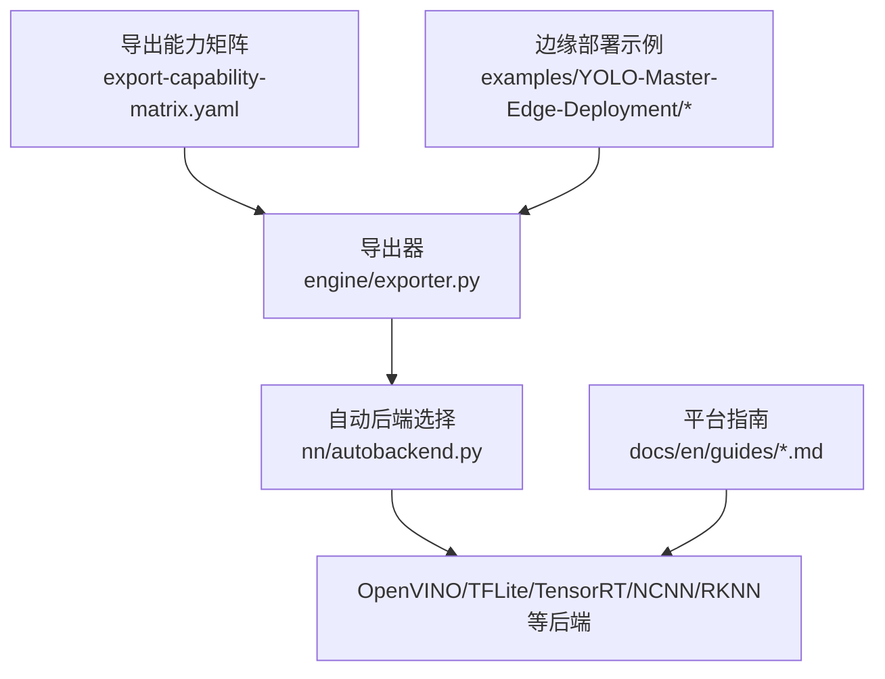
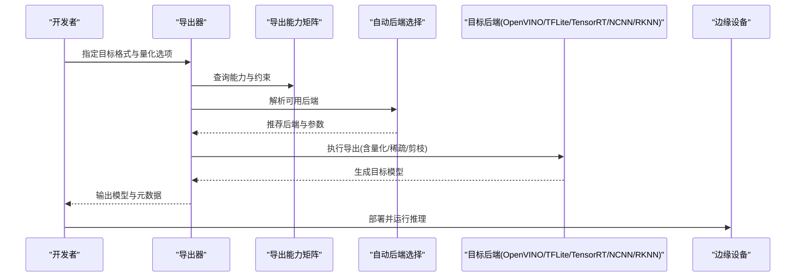
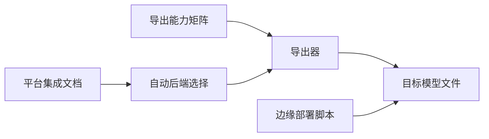

# 模型量化与压缩

<cite>
**本文引用的文件**
- [README.md](file://README.md)
- [export-capability-matrix.yaml](file://ultralytics/cfg/export-capability-matrix.yaml)
- [exporter.py](file://ultralytics/engine/exporter.py)
- [autobackend.py](file://ultralytics/nn/autobackend.py)
- [benchmark_molora_dispatch.py](file://benchmarks/benchmark_molora_dispatch.py)
- [molora_guide.md](file://docs/molora_guide.md)
- [yolo26.md](file://docs/en/models/yolo26.md)
- [raspberry-pi.md](file://docs/en/guides/raspberry-pi.md)
- [deepstream-nvidia-jetson.md](file://docs/en/guides/deepstream-nvidia-jetson.md)
- [coral-edge-tpu-on-raspberry-pi.md](file://docs/en/guides/coral-edge-tpu-on-raspberry-pi.md)
- [openvino.md](file://docs/en/integrations/openvino.md)
- [tflite.md](file://docs/en/integrations/tflite.md)
- [tensorrt.md](file://docs/en/integrations/tensorrt.md)
- [ncnn.md](file://docs/en/integrations/ncnn.md)
- [rknn.md](file://docs/en/integrations/rockchip-rknn.md)
- [edge_utils.py](file://examples/YOLO-Master-Edge-Deployment/edge_utils.py)
- [validate_edge_outputs.py](file://examples/YOLO-Master-Edge-Deployment/validate_edge_outputs.py)
- [export_edge_models.py](file://examples/YOLO-Master-Edge-Deployment/export_edge_models.py)
</cite>

## 目录
1. [简介](#简介)
2. [项目结构](#项目结构)
3. [核心组件](#核心组件)
4. [架构总览](#架构总览)
5. [详细组件分析](#详细组件分析)
6. [依赖关系分析](#依赖关系分析)
7. [性能考量](#性能考量)
8. [故障排查指南](#故障排查指南)
9. [结论](#结论)
10. [附录](#附录)

## 简介
本指南面向在ARM边缘设备上部署YOLO系列检测模型的工程师，聚焦于模型量化与压缩技术。内容涵盖：
- INT8量化的实现原理与配置方法（动态量化、静态量化）
- 稀疏化与权重剪枝在ARM平台的应用策略
- 混合精度量化的最佳实践与精度-性能权衡
- 针对YOLO骨干网络与检测头的量化策略
- 量化后模型的验证与精度评估方法
- 不同硬件后端（CPU、NPU、GPU）的量化效果差异与优化建议

## 项目结构
仓库围绕YOLO训练、导出与部署形成完整链路。与量化和压缩相关的核心位置包括：
- 导出能力矩阵与导出器：定义各后端支持的量化与格式能力，并驱动导出流程
- 自动后端选择：根据目标设备自动匹配最优推理后端
- 文档与示例：提供多平台集成说明与边缘端导出/验证脚本

图表来源
- [export-capability-matrix.yaml](file://ultralytics/cfg/export-capability-matrix.yaml)
- [exporter.py](file://ultralytics/engine/exporter.py)
- [autobackend.py](file://ultralytics/nn/autobackend.py)

章节来源
- [README.md](file://README.md)
- [export-capability-matrix.yaml](file://ultralytics/cfg/export-capability-matrix.yaml)
- [exporter.py](file://ultralytics/engine/exporter.py)
- [autobackend.py](file://ultralytics/nn/autobackend.py)

## 核心组件
- 导出能力矩阵：集中声明各后端对INT8/FP16/稀疏/剪枝等能力的支持情况，是选择量化路径的依据
- 导出器：封装从PyTorch到目标格式的转换流程，串联量化、算子替换、图优化等步骤
- 自动后端选择：依据运行环境与可用库，自动选择最优推理引擎，影响量化落地效果
- 边缘部署示例：提供跨平台导出与输出一致性校验脚本，便于回归验证

章节来源
- [export-capability-matrix.yaml](file://ultralytics/cfg/export-capability-matrix.yaml)
- [exporter.py](file://ultralytics/engine/exporter.py)
- [autobackend.py](file://ultralytics/nn/autobackend.py)
- [edge_utils.py](file://examples/YOLO-Master-Edge-Deployment/edge_utils.py)
- [validate_edge_outputs.py](file://examples/YOLO-Master-Edge-Deployment/validate_edge_outputs.py)

## 架构总览
下图展示从训练完成模型到边缘部署的整体流程，突出量化与压缩环节在各阶段的介入点。

图表来源
- [export-capability-matrix.yaml](file://ultralytics/cfg/export-capability-matrix.yaml)
- [exporter.py](file://ultralytics/engine/exporter.py)
- [autobackend.py](file://ultralytics/nn/autobackend.py)

## 详细组件分析

### 组件A：导出能力矩阵与量化策略选择
- 作用：统一描述各后端对量化（INT8/FP16）、稀疏、剪枝、动态/静态校准等的支持状态
- 使用方式：在导出前查询矩阵，结合目标设备能力与精度要求，确定是否启用INT8、是否需要静态校准集、是否采用混合精度
- 典型决策：
  - CPU/NPU：优先INT8；若精度敏感，考虑混合精度或仅对卷积层做INT8
  - GPU：优先FP16；仅在特定TensorRT配置下尝试INT8
  - 资源受限ARM SoC：优先INT8+稀疏/剪枝组合

章节来源
- [export-capability-matrix.yaml](file://ultralytics/cfg/export-capability-matrix.yaml)

### 组件B：导出器与量化流水线
- 职责：将PyTorch模型转换为目标格式，并在转换过程中应用量化、稀疏、剪枝等优化
- 关键阶段：
  - 前置检查：基于能力矩阵与后端可用性进行预检
  - 图级优化：算子融合、常量折叠、形状推导
  - 量化：动态/静态INT8、混合精度策略
  - 稀疏/剪枝：结构化/非结构化稀疏、通道/核级剪枝
  - 导出：生成目标后端可加载的模型文件与元数据
- 建议：
  - 先以FP16基线验证导出稳定性，再引入INT8
  - 对检测头与高分辨率分支谨慎量化，必要时保留更高精度

章节来源
- [exporter.py](file://ultralytics/engine/exporter.py)

### 组件C：自动后端选择与硬件适配
- 职责：根据当前环境（库版本、驱动、设备类型）选择最优推理后端
- 影响：同一模型在不同后端上的量化收益与精度表现可能显著不同
- 建议：
  - 在目标ARM设备上实际探测可用后端，避免“桌面端可用但边缘不可用”的情况
  - 为不同后端维护独立导出产物，减少运行时兼容性问题

章节来源
- [autobackend.py](file://ultralytics/nn/autobackend.py)

### 组件D：边缘部署与一致性验证
- 作用：提供跨平台导出脚本与输出一致性校验工具，确保量化前后结果稳定
- 关键点：
  - 固定随机种子与输入预处理，保证对比公平
  - 记录关键指标（mAP、延迟、内存占用），用于回归监控
  - 针对不同后端分别验证，定位后端相关退化

章节来源
- [export_edge_models.py](file://examples/YOLO-Master-Edge-Deployment/export_edge_models.py)
- [validate_edge_outputs.py](file://examples/YOLO-Master-Edge-Deployment/validate_edge_outputs.py)
- [edge_utils.py](file://examples/YOLO-Master-Edge-Deployment/edge_utils.py)

### 组件E：MOLoRA与稀疏调度（参考）
- 背景：仓库包含MOLoRA相关基准与指南，涉及稀疏调度与路由感知合并等思路
- 借鉴价值：稀疏化与路由/专家结构的协同优化思想可迁移至YOLO的稀疏/剪枝策略设计
- 注意：该部分并非直接量化模块，但可作为稀疏化与结构化优化的参考

章节来源
- [benchmark_molora_dispatch.py](file://benchmarks/benchmark_molora_dispatch.py)
- [molora_guide.md](file://docs/molora_guide.md)

## 依赖关系分析
- 导出器依赖能力矩阵与后端选择逻辑，二者共同决定最终导出的量化与压缩方案
- 边缘部署示例依赖导出器生成的模型，并通过一致性校验脚本保障质量
- 平台指南与集成文档为不同后端的具体用法与注意事项提供参考

图表来源
- [export-capability-matrix.yaml](file://ultralytics/cfg/export-capability-matrix.yaml)
- [exporter.py](file://ultralytics/engine/exporter.py)
- [autobackend.py](file://ultralytics/nn/autobackend.py)
- [export_edge_models.py](file://examples/YOLO-Master-Edge-Deployment/export_edge_models.py)

章节来源
- [export-capability-matrix.yaml](file://ultralytics/cfg/export-capability-matrix.yaml)
- [exporter.py](file://ultralytics/engine/exporter.py)
- [autobackend.py](file://ultralytics/nn/autobackend.py)
- [export_edge_models.py](file://examples/YOLO-Master-Edge-Deployment/export_edge_models.py)

## 性能考量
- 量化收益与代价
  - INT8通常带来显著吞吐提升与内存带宽降低，但需关注小目标与细粒度特征退化
  - 混合精度可在关键层保持较高精度，兼顾整体性能
- 稀疏与剪枝
  - 结构化稀疏/剪枝更易被后端加速，非结构化稀疏需要专用内核
  - 剪枝比例需通过验证集逐步搜索，避免破坏检测头判别性
- 端到端时延与吞吐
  - 在ARM设备上，I/O与预处理常成为瓶颈，需与模型优化同步进行
  - 批大小、分辨率、NMS阈值等推理参数会影响最终时延

[本节为通用指导，不直接分析具体文件]

## 故障排查指南
- 导出失败或运行时崩溃
  - 检查能力矩阵中对应后端是否支持所选量化/稀疏选项
  - 确认目标设备已安装所需运行时与驱动
- 精度下降明显
  - 优先回退到FP16基线，逐步引入INT8
  - 对检测头与高分辨率分支单独评估，必要时提高其精度位宽
  - 增加静态校准集规模与代表性，覆盖难例与小目标
- 输出不一致
  - 使用一致性校验脚本对比量化前后输出分布
  - 固定随机性与输入预处理，隔离数值误差来源
- 平台差异
  - 针对OpenVINO、TFLite、TensorRT、NCNN、RKNN分别验证，定位后端特有退化

章节来源
- [export-capability-matrix.yaml](file://ultralytics/cfg/export-capability-matrix.yaml)
- [exporter.py](file://ultralytics/engine/exporter.py)
- [autobackend.py](file://ultralytics/nn/autobackend.py)
- [validate_edge_outputs.py](file://examples/YOLO-Master-Edge-Deployment/validate_edge_outputs.py)

## 结论
在ARM边缘设备上实现YOLO的高效部署，应以能力矩阵为依据，选择合适的量化与压缩组合；以导出器为核心，构建稳定的量化流水线；以自动后端选择与边缘验证为保障，确保跨平台一致性与可复现性。实践中建议遵循“FP16基线→INT8→稀疏/剪枝→混合精度微调”的渐进式优化路径，并结合目标后端特性进行针对性调优。

[本节为总结性内容，不直接分析具体文件]

## 附录

### INT8量化：动态与静态的选择策略
- 动态量化
  - 优点：无需校准集，快速迭代
  - 适用：原型验证、数据难以收集、对精度容忍度较高
- 静态量化
  - 优点：更准确的激活统计，通常精度更好
  - 适用：生产部署、有代表性校准集、对精度敏感
- 建议
  - 先用动态量化建立基线，再用静态量化提升精度
  - 校准集应覆盖不同光照、尺度、遮挡场景，包含小目标

章节来源
- [export-capability-matrix.yaml](file://ultralytics/cfg/export-capability-matrix.yaml)
- [exporter.py](file://ultralytics/engine/exporter.py)

### 稀疏化与权重剪枝在ARM平台的应用
- 稀疏化
  - 结构化稀疏更易被后端加速，非结构化稀疏需专用内核
  - 可结合训练后稀疏或训练期稀疏，平衡精度与压缩比
- 剪枝
  - 通道/核级剪枝适合卷积主干，检测头需谨慎
  - 剪枝后建议进行轻量微调以恢复精度
- ARM建议
  - 优先选择结构化稀疏/剪枝，配合INT8获得更大收益
  - 利用后端提供的稀疏/剪枝优化开关（如OpenVINO、NCNN、RKNN）

章节来源
- [export-capability-matrix.yaml](file://ultralytics/cfg/export-capability-matrix.yaml)
- [exporter.py](file://ultralytics/engine/exporter.py)

### 混合精度量化的最佳实践
- 分层策略
  - 主干早期层与检测头可保留更高精度，中间层与大量卷积采用INT8
- 关键层识别
  - 对小目标敏感层、注意力/归一化附近层保持高精度
- 验证方法
  - 逐层替换并观察mAP变化，定位退化层
  - 结合混淆矩阵与IoU分布分析退化原因

章节来源
- [export-capability-matrix.yaml](file://ultralytics/cfg/export-capability-matrix.yaml)
- [exporter.py](file://ultralytics/engine/exporter.py)

### YOLO特定优化方案（骨干与检测头）
- 骨干网络
  - 优先对卷积密集区域进行INT8量化
  - 可适度引入稀疏/剪枝以降低计算量
- 检测头
  - 对分类与回归分支分别评估量化影响
  - 若退化明显，可提升其精度位宽或采用混合精度
- 输入与NMS
  - 固定输入尺寸与预处理，避免量化放大数值误差
  - NMS阈值与置信度阈值联合调参，补偿精度损失

章节来源
- [yolo26.md](file://docs/en/models/yolo26.md)
- [export-capability-matrix.yaml](file://ultralytics/cfg/export-capability-matrix.yaml)
- [exporter.py](file://ultralytics/engine/exporter.py)

### 量化后模型验证与精度评估方法
- 基线对比
  - 以FP16/FP32为基线，记录mAP、mAP@0.5、mAP@0.5:0.95
- 一致性校验
  - 使用边缘验证脚本对比量化前后输出分布与边界框差异
- 数据集覆盖
  - 校准/验证集需包含小目标、遮挡、低光等难例
- 指标追踪
  - 同时记录时延、吞吐、内存占用，综合评估

章节来源
- [validate_edge_outputs.py](file://examples/YOLO-Master-Edge-Deployment/validate_edge_outputs.py)
- [export_edge_models.py](file://examples/YOLO-Master-Edge-Deployment/export_edge_models.py)

### 不同硬件后端的效果差异与优化建议
- OpenVINO（CPU/NPU）
  - 优势：INT8优化成熟，支持稀疏/剪枝
  - 建议：开启INT8与稀疏优化，调整线程数与缓存策略
- TFLite（CPU/NPU）
  - 优势：移动端广泛支持，INT8生态完善
  - 建议：使用官方解释器与NNAPI/Delegate，合理设置线程
- TensorRT（GPU）
  - 优势：高吞吐，FP16/INT8均可
  - 建议：优先FP16，必要时再尝试INT8；关注校准集质量
- NCNN（ARM CPU）
  - 优势：轻量高效，适合手机/嵌入式
  - 建议：启用SIMD与多线程，结合INT8
- RKNN（Rockchip NPU）
  - 优势：SoC内NPU加速
  - 建议：按厂商工具链要求准备校准集与量化参数

章节来源
- [openvino.md](file://docs/en/integrations/openvino.md)
- [tflite.md](file://docs/en/integrations/tflite.md)
- [tensorrt.md](file://docs/en/integrations/tensorrt.md)
- [ncnn.md](file://docs/en/integrations/ncnn.md)
- [rknn.md](file://docs/en/integrations/rockchip-rknn.md)

### 平台与部署参考
- Raspberry Pi与Coral Edge TPU
  - 适合低功耗场景，优先考虑TFLite INT8与Edge TPU Delegate
- Jetson与DeepStream
  - 适合中等算力边缘，优先TensorRT FP16/INT8与DeepStream管线优化
- 通用ARM设备
  - 结合OpenVINO/NCNN/TFLite，按设备能力选择最优后端

章节来源
- [raspberry-pi.md](file://docs/en/guides/raspberry-pi.md)
- [coral-edge-tpu-on-raspberry-pi.md](file://docs/en/guides/coral-edge-tpu-on-raspberry-pi.md)
- [deepstream-nvidia-jetson.md](file://docs/en/guides/deepstream-nvidia-jetson.md)