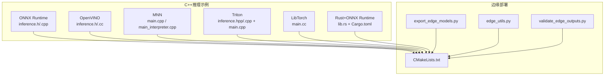
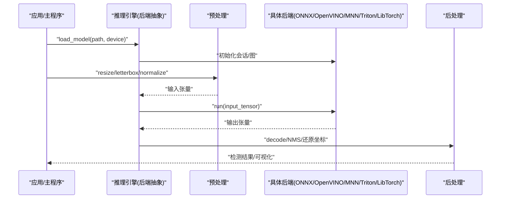
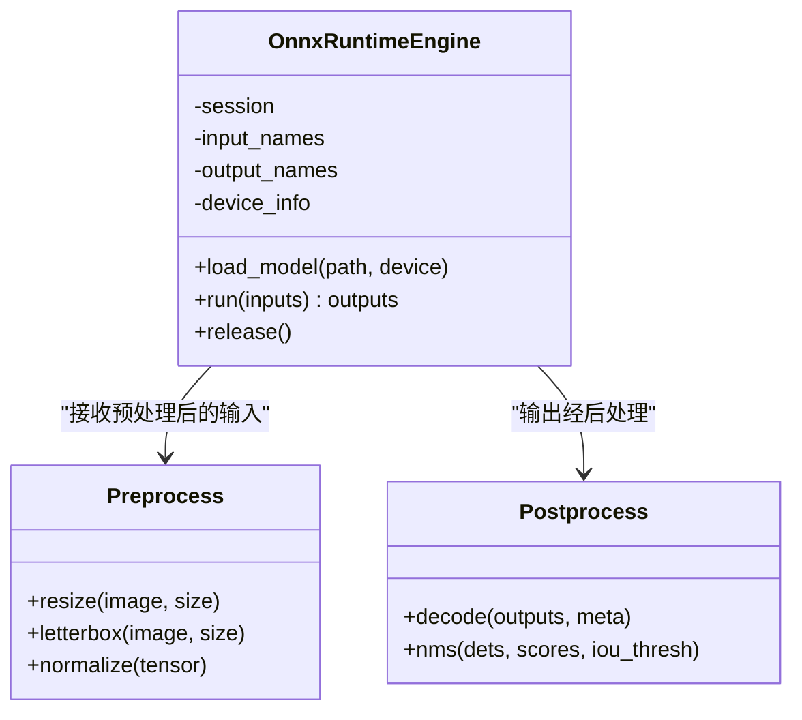
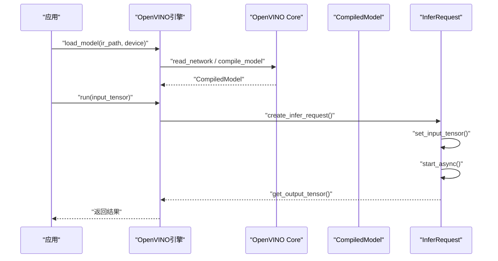
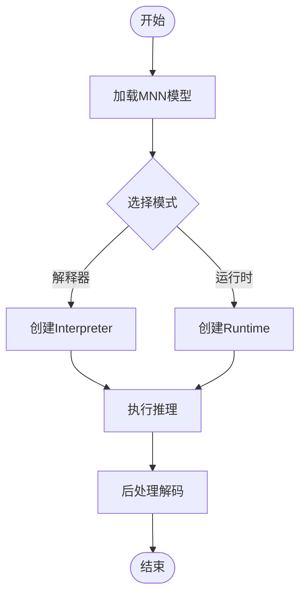
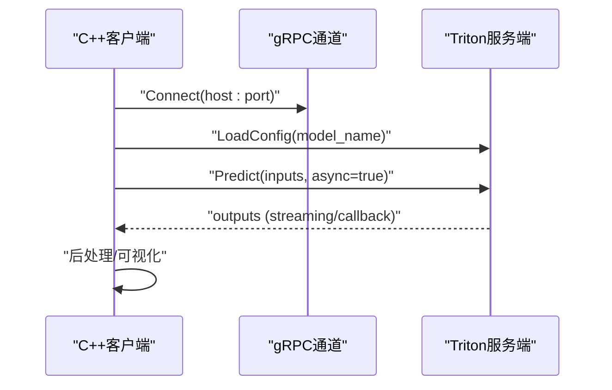
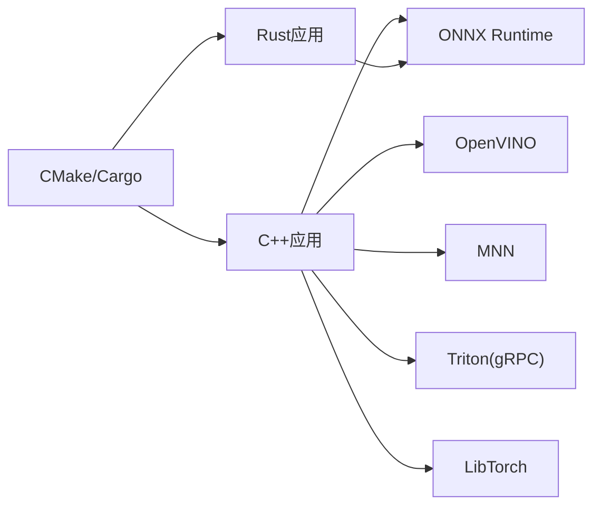

# C++推理引擎

<cite>
**本文引用的文件**
- [examples/cpp/README.md](file://examples/cpp/README.md)
- [examples/YOLOv8-ONNXRuntime-CPP/inference.h](file://examples/YOLOv8-ONNXRuntime-CPP/inference.h)
- [examples/YOLOv8-ONNXRuntime-CPP/inference.cpp](file://examples/YOLOv8-ONNXRuntime-CPP/inference.cpp)
- [examples/YOLOv8-ONNXRuntime-CPP/main.cpp](file://examples/YOLOv8-ONNXRuntime-CPP/main.cpp)
- [examples/YOLOv8-OpenVINO-CPP-Inference/inference.h](file://examples/YOLOv8-OpenVINO-CPP-Inference/inference.h)
- [examples/YOLOv8-OpenVINO-CPP-Inference/inference.cc](file://examples/YOLOv8-OpenVINO-CPP-Inference/inference.cc)
- [examples/YOLOv8-OpenVINO-CPP-Inference/main.cc](file://examples/YOLOv8-OpenVINO-CPP-Inference/main.cc)
- [examples/YOLOv8-MNN-CPP/main.cpp](file://examples/YOLOv8-MNN-CPP/main.cpp)
- [examples/YOLOv8-MNN-CPP/main_interpreter.cpp](file://examples/YOLOv8-MNN-CPP/main_interpreter.cpp)
- [examples/YOLO11-Triton-CPP/inference.hpp](file://examples/YOLO11-Triton-CPP/inference.hpp)
- [examples/YOLO11-Triton-CPP/inference.cpp](file://examples/YOLO11-Triton-CPP/inference.cpp)
- [examples/YOLO11-Triton-CPP/main.cpp](file://examples/YOLO11-Triton-CPP/main.cpp)
- [examples/YOLOv8-CPP-Inference/inference.h](file://examples/YOLOv8-CPP-Inference/inference.h)
- [examples/YOLOv8-CPP-Inference/inference.cpp](file://examples/YOLOv8-CPP-Inference/inference.cpp)
- [examples/YOLOv8-CPP-Inference/main.cpp](file://examples/YOLOv8-CPP-Inference/main.cpp)
- [examples/YOLOv8-LibTorch-CPP-Inference/main.cc](file://examples/YOLOv8-LibTorch-CPP-Inference/main.cc)
- [examples/YOLO-Series-ONNXRuntime-Rust/src/lib.rs](file://examples/YOLO-Series-ONNXRuntime-Rust/src/lib.rs)
- [examples/YOLO-Series-ONNXRuntime-Rust/Cargo.toml](file://examples/YOLO-Series-ONNXRuntime-Rust/Cargo.toml)
- [examples/YOLO-Master-Cross-Platform-Edge-Deployment/TECHNICAL_REPORT.md](file://examples/YOLO-Master-Cross-Platform-Edge-Deployment/TECHNICAL_REPORT.md)
- [examples/YOLO-Master-Cross-Platform-Edge-Deployment/README.md](file://examples/YOLO-Master-Cross-Platform-Edge-Deployment/README.md)
- [examples/YOLO-Master-Edge-Deployment/CMakeLists.txt](file://examples/YOLO-Master-Edge-Deployment/CMakeLists.txt)
- [examples/YOLO-Master-Edge-Deployment/edge_utils.py](file://examples/YOLO-Master-Edge-Deployment/edge_utils.py)
- [examples/YOLO-Master-Edge-Deployment/export_edge_models.py](file://examples/YOLO-Master-Edge-Deployment/export_edge_models.py)
- [examples/YOLO-Master-Edge-Deployment/validate_edge_outputs.py](file://examples/YOLO-Master-Edge-Deployment/validate_edge_outputs.py)
- [ultralytics/engine/predictor.py](file://ultralytics/engine/predictor.py)
- [ultralytics/utils/export.py](file://ultralytics/utils/export.py)
- [ultralytics/utils/checks.py](file://ultralytics/utils/checks.py)
- [ultralytics/utils/benchmarks.py](file://ultralytics/utils/benchmarks.py)
</cite>

## 目录
1. [简介](#简介)
2. [项目结构](#项目结构)
3. [核心组件](#核心组件)
4. [架构总览](#架构总览)
5. [详细组件分析](#详细组件分析)
6. [依赖分析](#依赖分析)
7. [性能考虑](#性能考虑)
8. [故障排查指南](#故障排查指南)
9. [结论](#结论)
10. [附录](#附录)

## 简介
本技术文档聚焦于YOLO-Master的C++推理引擎，围绕后端抽象层、模型加载机制与内存管理策略展开，系统梳理ONNX Runtime、TensorRT、OpenVINO、NCNN、MNN等后端的集成方式与性能特点。同时覆盖预处理/后处理（图像缩放、归一化、结果解码）、批处理与异步推理的实现要点，并提供构建系统说明（CMake配置、依赖管理与跨平台编译选项）以及性能优化与内存使用最佳实践。

## 项目结构
仓库中C++推理相关代码主要分布在examples目录下，按后端或任务组织：
- ONNX Runtime C++示例：包含推理封装与主程序入口
- OpenVINO C++示例：包含推理封装与主程序入口
- MNN C++示例：提供解释器与运行时两种模式
- Triton C++示例：基于gRPC客户端调用远程服务
- LibTorch C++示例：直接加载PyTorch导出模型
- Rust绑定示例：通过FFI调用ONNX Runtime
- 边缘部署示例：包含CMake构建脚本与Python辅助工具链

图表来源
- [examples/YOLOv8-ONNXRuntime-CPP/inference.h](file://examples/YOLOv8-ONNXRuntime-CPP/inference.h)
- [examples/YOLOv8-ONNXRuntime-CPP/inference.cpp](file://examples/YOLOv8-ONNXRuntime-CPP/inference.cpp)
- [examples/YOLOv8-OpenVINO-CPP-Inference/inference.h](file://examples/YOLOv8-OpenVINO-CPP-Inference/inference.h)
- [examples/YOLOv8-OpenVINO-CPP-Inference/inference.cc](file://examples/YOLOv8-OpenVINO-CPP-Inference/inference.cc)
- [examples/YOLOv8-MNN-CPP/main.cpp](file://examples/YOLOv8-MNN-CPP/main.cpp)
- [examples/YOLOv8-MNN-CPP/main_interpreter.cpp](file://examples/YOLOv8-MNN-CPP/main_interpreter.cpp)
- [examples/YOLO11-Triton-CPP/inference.hpp](file://examples/YOLO11-Triton-CPP/inference.hpp)
- [examples/YOLO11-Triton-CPP/inference.cpp](file://examples/YOLO11-Triton-CPP/inference.cpp)
- [examples/YOLO11-Triton-CPP/main.cpp](file://examples/YOLO11-Triton-CPP/main.cpp)
- [examples/YOLOv8-LibTorch-CPP-Inference/main.cc](file://examples/YOLOv8-LibTorch-CPP-Inference/main.cc)
- [examples/YOLO-Series-ONNXRuntime-Rust/src/lib.rs](file://examples/YOLO-Series-ONNXRuntime-Rust/src/lib.rs)
- [examples/YOLO-Series-ONNXRuntime-Rust/Cargo.toml](file://examples/YOLO-Series-ONNXRuntime-Rust/Cargo.toml)
- [examples/YOLO-Master-Edge-Deployment/CMakeLists.txt](file://examples/YOLO-Master-Edge-Deployment/CMakeLists.txt)
- [examples/YOLO-Master-Edge-Deployment/export_edge_models.py](file://examples/YOLO-Master-Edge-Deployment/export_edge_models.py)
- [examples/YOLO-Master-Edge-Deployment/edge_utils.py](file://examples/YOLO-Master-Edge-Deployment/edge_utils.py)
- [examples/YOLO-Master-Edge-Deployment/validate_edge_outputs.py](file://examples/YOLO-Master-Edge-Deployment/validate_edge_outputs.py)

章节来源
- [examples/cpp/README.md](file://examples/cpp/README.md)
- [examples/YOLO-Master-Cross-Platform-Edge-Deployment/TECHNICAL_REPORT.md](file://examples/YOLO-Master-Cross-Platform-Edge-Deployment/TECHNICAL_REPORT.md)
- [examples/YOLO-Master-Cross-Platform-Edge-Deployment/README.md](file://examples/YOLO-Master-Cross-Platform-Edge-Deployment/README.md)

## 核心组件
- 后端抽象层
  - 目标：统一不同推理引擎的接口，屏蔽ONNX Runtime、OpenVINO、MNN、Triton、LibTorch等差异，提供一致的加载、预热、推理、释放API。
  - 关键职责：模型路径解析、输入张量分配、输出张量收集、设备选择、线程/并发控制、错误码映射。
- 模型加载机制
  - 支持多格式：ONNX、OpenVINO IR、MNN、Triton模型仓库、LibTorch脚本模块。
  - 生命周期：初始化会话/图、分配工作区、可选权重/缓存加载、资源清理。
- 内存管理策略
  - 输入/输出缓冲区复用、避免频繁分配；必要时使用对象池或预分配固定大小缓冲。
  - 设备一致性：确保CPU/GPU间数据拷贝最小化，必要时使用零拷贝或共享内存。
- 预处理与后处理
  - 预处理：Resize、Letterbox填充、归一化（如除以255或标准化均值方差）、通道顺序转换（HWC->CHW）。
  - 后处理：置信度阈值过滤、类别映射、坐标还原（反缩放/去填充）、NMS/Soft-NMS、掩码/关键点解码（若为分割/姿态任务）。
- 批处理与异步推理
  - 批处理：将多帧合并为batch维度，减少内核启动开销；注意动态shape与静态shape的差异。
  - 异步：利用各后端提供的异步API（如ONNX Runtime Session.run异步、OpenVINO AsyncInferQueue、Triton gRPC异步），结合回调或Future/Promise进行结果聚合。

章节来源
- [examples/YOLOv8-ONNXRuntime-CPP/inference.h](file://examples/YOLOv8-ONNXRuntime-CPP/inference.h)
- [examples/YOLOv8-ONNXRuntime-CPP/inference.cpp](file://examples/YOLOv8-ONNXRuntime-CPP/inference.cpp)
- [examples/YOLOv8-OpenVINO-CPP-Inference/inference.h](file://examples/YOLOv8-OpenVINO-CPP-Inference/inference.h)
- [examples/YOLOv8-OpenVINO-CPP-Inference/inference.cc](file://examples/YOLOv8-OpenVINO-CPP-Inference/inference.cc)
- [examples/YOLOv8-MNN-CPP/main.cpp](file://examples/YOLOv8-MNN-CPP/main.cpp)
- [examples/YOLOv8-MNN-CPP/main_interpreter.cpp](file://examples/YOLOv8-MNN-CPP/main_interpreter.cpp)
- [examples/YOLO11-Triton-CPP/inference.hpp](file://examples/YOLO11-Triton-CPP/inference.hpp)
- [examples/YOLO11-Triton-CPP/inference.cpp](file://examples/YOLO11-Triton-CPP/inference.cpp)
- [examples/YOLOv8-LibTorch-CPP-Inference/main.cc](file://examples/YOLOv8-LibTorch-CPP-Inference/main.cc)

## 架构总览
下图展示从应用到具体后端的典型调用链路，涵盖预处理、推理、后处理与可视化/保存流程。

图表来源
- [examples/YOLOv8-ONNXRuntime-CPP/main.cpp](file://examples/YOLOv8-ONNXRuntime-CPP/main.cpp)
- [examples/YOLOv8-ONNXRuntime-CPP/inference.cpp](file://examples/YOLOv8-ONNXRuntime-CPP/inference.cpp)
- [examples/YOLOv8-OpenVINO-CPP-Inference/main.cc](file://examples/YOLOv8-OpenVINO-CPP-Inference/main.cc)
- [examples/YOLOv8-OpenVINO-CPP-Inference/inference.cc](file://examples/YOLOv8-OpenVINO-CPP-Inference/inference.cc)
- [examples/YOLO11-Triton-CPP/main.cpp](file://examples/YOLO11-Triton-CPP/main.cpp)
- [examples/YOLO11-Triton-CPP/inference.cpp](file://examples/YOLO11-Triton-CPP/inference.cpp)
- [examples/YOLOv8-LibTorch-CPP-Inference/main.cc](file://examples/YOLOv8-LibTorch-CPP-Inference/main.cc)

## 详细组件分析

### ONNX Runtime C++后端
- 接口设计
  - 提供统一的加载、推理、释放方法；内部维护Session、输入/输出名称映射、设备信息。
- 模型加载
  - 解析ONNX路径，创建执行环境，设置运行选项（如线程数、内存池、GPU设备）。
- 预处理/后处理
  - 预处理通常在应用侧完成，将图像转为NHWC或NCHW格式并归一化；后处理负责阈值过滤、NMS与坐标还原。
- 批处理与异步
  - 支持批量输入；可结合ONNX Runtime的异步API提升吞吐。

图表来源
- [examples/YOLOv8-ONNXRuntime-CPP/inference.h](file://examples/YOLOv8-ONNXRuntime-CPP/inference.h)
- [examples/YOLOv8-ONNXRuntime-CPP/inference.cpp](file://examples/YOLOv8-ONNXRuntime-CPP/inference.cpp)
- [examples/YOLOv8-ONNXRuntime-CPP/main.cpp](file://examples/YOLOv8-ONNXRuntime-CPP/main.cpp)

章节来源
- [examples/YOLOv8-ONNXRuntime-CPP/inference.h](file://examples/YOLOv8-ONNXRuntime-CPP/inference.h)
- [examples/YOLOv8-ONNXRuntime-CPP/inference.cpp](file://examples/YOLOv8-ONNXRuntime-CPP/inference.cpp)
- [examples/YOLOv8-ONNXRuntime-CPP/main.cpp](file://examples/YOLOv8-ONNXRuntime-CPP/main.cpp)

### OpenVINO C++后端
- 接口设计
  - 封装Core、CompiledModel、InferRequest；提供与ONNX类似的统一API。
- 模型加载
  - 支持IR模型或直接从ONNX转换；可指定设备（CPU/GPU/iGPU/VPU）。
- 预处理/后处理
  - 与ONNX类似，但需注意OpenVINO的数据布局与精度要求。
- 批处理与异步
  - 使用AsyncInferQueue实现高并发；适合流水线场景。

图表来源
- [examples/YOLOv8-OpenVINO-CPP-Inference/inference.h](file://examples/YOLOv8-OpenVINO-CPP-Inference/inference.h)
- [examples/YOLOv8-OpenVINO-CPP-Inference/inference.cc](file://examples/YOLOv8-OpenVINO-CPP-Inference/inference.cc)
- [examples/YOLOv8-OpenVINO-CPP-Inference/main.cc](file://examples/YOLOv8-OpenVINO-CPP-Inference/main.cc)

章节来源
- [examples/YOLOv8-OpenVINO-CPP-Inference/inference.h](file://examples/YOLOv8-OpenVINO-CPP-Inference/inference.h)
- [examples/YOLOv8-OpenVINO-CPP-Inference/inference.cc](file://examples/YOLOv8-OpenVINO-CPP-Inference/inference.cc)
- [examples/YOLOv8-OpenVINO-CPP-Inference/main.cc](file://examples/YOLOv8-OpenVINO-CPP-Inference/main.cc)

### MNN C++后端
- 接口设计
  - 提供解释器与运行时两种模式；解释器便于调试，运行时更高效。
- 模型加载
  - 支持MNN模型文件；需指定输入/输出名与形状。
- 预处理/后处理
  - 与通用流程一致，注意MNN的数据类型与布局。
- 批处理与异步
  - 可通过多线程或多进程并行；MNN本身对移动端友好。

图表来源
- [examples/YOLOv8-MNN-CPP/main.cpp](file://examples/YOLOv8-MNN-CPP/main.cpp)
- [examples/YOLOv8-MNN-CPP/main_interpreter.cpp](file://examples/YOLOv8-MNN-CPP/main_interpreter.cpp)

章节来源
- [examples/YOLOv8-MNN-CPP/main.cpp](file://examples/YOLOv8-MNN-CPP/main.cpp)
- [examples/YOLOv8-MNN-CPP/main_interpreter.cpp](file://examples/YOLOv8-MNN-CPP/main_interpreter.cpp)

### Triton C++后端
- 接口设计
  - 基于gRPC客户端，与服务端模型仓库交互；无需本地加载模型。
- 模型加载
  - 由服务端管理；客户端仅需知道模型名、版本与输入输出签名。
- 预处理/后处理
  - 客户端负责序列化输入（如JSON/Protobuf），服务端可能内置预处理；后处理在客户端完成。
- 批处理与异步
  - 天然支持批处理；gRPC异步调用提升吞吐。

图表来源
- [examples/YOLO11-Triton-CPP/inference.hpp](file://examples/YOLO11-Triton-CPP/inference.hpp)
- [examples/YOLO11-Triton-CPP/inference.cpp](file://examples/YOLO11-Triton-CPP/inference.cpp)
- [examples/YOLO11-Triton-CPP/main.cpp](file://examples/YOLO11-Triton-CPP/main.cpp)

章节来源
- [examples/YOLO11-Triton-CPP/inference.hpp](file://examples/YOLO11-Triton-CPP/inference.hpp)
- [examples/YOLO11-Triton-CPP/inference.cpp](file://examples/YOLO11-Triton-CPP/inference.cpp)
- [examples/YOLO11-Triton-CPP/main.cpp](file://examples/YOLO11-Triton-CPP/main.cpp)

### LibTorch C++后端
- 接口设计
  - 直接加载PyTorch脚本模块；适用于需要保留PyTorch生态特性的场景。
- 模型加载
  - 使用torch::jit::load；注意设备与数据类型匹配。
- 预处理/后处理
  - 可在C++中使用torchvision或自定义算子；后处理通常用原生C++实现。
- 批处理与异步
  - 批处理通过扩展batch维度；异步可用std::async或线程池。

章节来源
- [examples/YOLOv8-LibTorch-CPP-Inference/main.cc](file://examples/YOLOv8-LibTorch-CPP-Inference/main.cc)

### Rust+ONNX Runtime绑定
- 接口设计
  - 通过FFI暴露C API供Rust调用；保持与C++一致的推理流程。
- 模型加载
  - 在Rust侧封装ONNX Runtime C API；简化内存管理。
- 构建与依赖
  - 使用Cargo管理依赖；链接ONNX Runtime库。

章节来源
- [examples/YOLO-Series-ONNXRuntime-Rust/src/lib.rs](file://examples/YOLO-Series-ONNXRuntime-Rust/src/lib.rs)
- [examples/YOLO-Series-ONNXRuntime-Rust/Cargo.toml](file://examples/YOLO-Series-ONNXRuntime-Rust/Cargo.toml)

### NCNN后端（概念性说明）
- 集成方式
  - 参考现有ONNX/MNN示例的结构，封装NCNN的Net、Extractor接口；提供统一加载与推理API。
- 性能特点
  - 针对移动端优化，低延迟、小内存占用；适合ARM平台。
- 注意事项
  - 需确保模型算子兼容；预处理与后处理逻辑与其他后端保持一致。

[本节为概念性说明，不直接分析具体文件]

### TensorRT后端（概念性说明）
- 集成方式
  - 封装Builder/Engine/Context；支持FP16/INT8量化与插件扩展。
- 性能特点
  - GPU上极高吞吐；需离线构建engine文件。
- 注意事项
  - 动态shape与输入尺寸限制；需严格对齐预处理布局。

[本节为概念性说明，不直接分析具体文件]

## 依赖分析
- 外部依赖
  - ONNX Runtime：跨平台推理引擎，支持CPU/GPU。
  - OpenVINO：Intel生态优化，支持多种设备。
  - MNN：阿里开源，面向移动端与嵌入式。
  - Triton：NVIDIA推理服务，适合服务端部署。
  - LibTorch：PyTorch C++前端，便于迁移训练模型。
  - Rust+ONNX Runtime：通过FFI桥接，便于Rust生态集成。
- 构建系统
  - CMake用于C++工程构建；Python脚本用于模型导出与验证。
  - Cargo用于Rust工程构建与依赖管理。

图表来源
- [examples/YOLO-Master-Edge-Deployment/CMakeLists.txt](file://examples/YOLO-Master-Edge-Deployment/CMakeLists.txt)
- [examples/YOLO-Series-ONNXRuntime-Rust/Cargo.toml](file://examples/YOLO-Series-ONNXRuntime-Rust/Cargo.toml)

章节来源
- [examples/YOLO-Master-Edge-Deployment/CMakeLists.txt](file://examples/YOLO-Master-Edge-Deployment/CMakeLists.txt)
- [examples/YOLO-Series-ONNXRuntime-Rust/Cargo.toml](file://examples/YOLO-Series-ONNXRuntime-Rust/Cargo.toml)

## 性能考虑
- 预处理优化
  - 尽量在GPU上进行Resize与归一化，减少CPU-GPU拷贝；使用SIMD指令加速图像处理。
- 批处理策略
  - 根据设备能力调整batch size；动态shape模型需权衡灵活性与时延。
- 异步流水线
  - 采用生产者-消费者模型，预处理、推理、后处理并行；OpenVINO AsyncInferQueue与Triton异步调用尤为适用。
- 内存复用
  - 预分配输入/输出缓冲；避免在热路径中进行new/delete。
- 量化与精度
  - 在TensorRT/MNN中启用FP16/INT8；注意校准数据集质量与精度回退策略。
- 线程与并发
  - 合理设置线程数；避免过度并发导致上下文切换开销。

[本节提供一般性指导，不直接分析具体文件]

## 故障排查指南
- 模型加载失败
  - 检查路径权限与格式；确认后端是否支持该模型。
- 输入形状不匹配
  - 核对预处理输出的尺寸与模型期望；动态shape需传入正确元数据。
- 设备不可用
  - 确认驱动与运行时版本；检查CUDA/OpenVINO设备枚举。
- 性能不达预期
  - 使用基准工具评估各阶段耗时；调整batch size与线程数。
- 内存泄漏
  - 确保释放会话与缓冲；使用工具检测未释放资源。

章节来源
- [ultralytics/utils/checks.py](file://ultralytics/utils/checks.py)
- [ultralytics/utils/benchmarks.py](file://ultralytics/utils/benchmarks.py)

## 结论
YOLO-Master的C++推理引擎通过统一抽象层整合多后端，提供一致的加载、推理与资源管理接口。结合高效的预处理/后处理、批处理与异步机制，可在不同平台上实现高性能推理。建议在生产环境中优先选择与硬件最匹配的后端，并通过量化与流水线优化进一步提升吞吐与降低时延。

## 附录
- 构建系统说明
  - CMakeLists.txt定义目标、依赖与编译选项；Python脚本用于模型导出与验证。
  - Rust工程通过Cargo管理依赖，链接ONNX Runtime库。
- 边缘部署流程
  - 使用Python工具导出边缘模型，C++工程加载并推理，验证脚本保证输出一致性。

章节来源
- [examples/YOLO-Master-Edge-Deployment/CMakeLists.txt](file://examples/YOLO-Master-Edge-Deployment/CMakeLists.txt)
- [examples/YOLO-Master-Edge-Deployment/export_edge_models.py](file://examples/YOLO-Master-Edge-Deployment/export_edge_models.py)
- [examples/YOLO-Master-Edge-Deployment/edge_utils.py](file://examples/YOLO-Master-Edge-Deployment/edge_utils.py)
- [examples/YOLO-Master-Edge-Deployment/validate_edge_outputs.py](file://examples/YOLO-Master-Edge-Deployment/validate_edge_outputs.py)
- [examples/YOLO-Master-Cross-Platform-Edge-Deployment/TECHNICAL_REPORT.md](file://examples/YOLO-Master-Cross-Platform-Edge-Deployment/TECHNICAL_REPORT.md)
- [examples/YOLO-Master-Cross-Platform-Edge-Deployment/README.md](file://examples/YOLO-Master-Cross-Platform-Edge-Deployment/README.md)