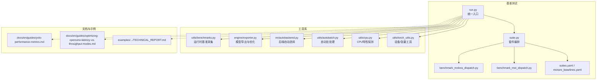
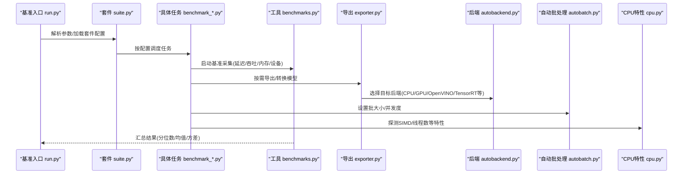
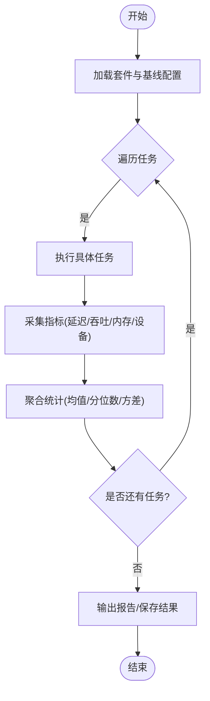
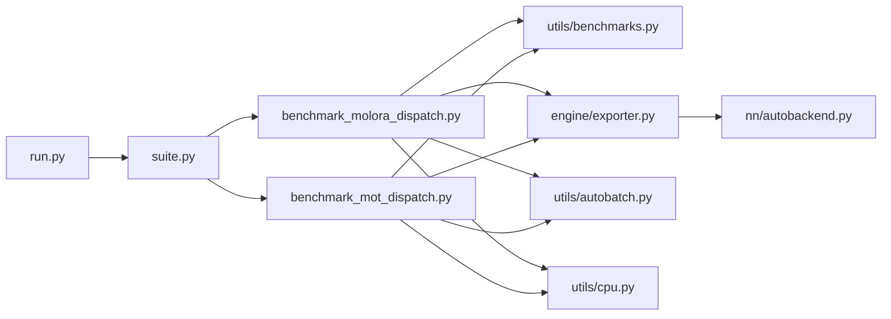

# 性能优化与基准测试

<cite>
**本文引用的文件**
- [benchmarks/run.py](file://benchmarks/run.py)
- [benchmarks/suite.py](file://benchmarks/suite.py)
- [benchmarks/benchmark_molora_dispatch.py](file://benchmarks/benchmark_molora_dispatch.py)
- [benchmarks/benchmark_mot_dispatch.py](file://benchmarks/benchmark_mot_dispatch.py)
- [benchmarks/suites.yaml](file://benchmarks/suites.yaml)
- [benchmarks/mixture_baselines.yaml](file://benchmarks/mixture_baselines.yaml)
- [ultralytics/utils/benchmarks.py](file://ultralytics/utils/benchmarks.py)
- [ultralytics/engine/exporter.py](file://ultralytics/engine/exporter.py)
- [ultralytics/nn/autobackend.py](file://ultralytics/nn/autobackend.py)
- [ultralytics/utils/autobatch.py](file://ultralytics/utils/autobatch.py)
- [ultralytics/utils/cpu.py](file://ultralytics/utils/cpu.py)
- [ultralytics/utils/torch_utils.py](file://ultralytics/utils/torch_utils.py)
- [examples/YOLO-Master-Cross-Platform-Edge-Deployment/TECHNICAL_REPORT.md](file://examples/YOLO-Master-Cross-Platform-Edge-Deployment/TECHNICAL_REPORT.md)
- [docs/en/guides/yolo-performance-metrics.md](file://docs/en/guides/yolo-performance-metrics.md)
- [docs/en/guides/optimizing-openvino-latency-vs-throughput-modes.md](file://docs/en/guides/optimizing-openvino-latency-vs-throughput-modes.md)
- [tests/test_benchmark_suite.py](file://tests/test_benchmark_suite.py)
</cite>

## 目录
1. [简介](#简介)
2. [项目结构](#项目结构)
3. [核心组件](#核心组件)
4. [架构总览](#架构总览)
5. [详细组件分析](#详细组件分析)
6. [依赖关系分析](#依赖关系分析)
7. [性能考量](#性能考量)
8. [故障排查指南](#故障排查指南)
9. [结论](#结论)
10. [附录](#附录)

## 简介
本技术文档面向边缘设备上的推理性能优化，围绕以下目标展开：
- 提供可操作的推理性能分析方法，覆盖CPU利用率、内存占用与GPU加速效果测量。
- 解释模型量化、算子融合、内存池化与线程池优化的实现原理与应用场景。
- 给出针对特定硬件平台的优化策略（SIMD指令集利用、缓存优化、并行计算）。
- 文档化基准测试套件的使用方法与结果解读。
- 阐述延迟与吞吐量的平衡策略。
- 提供实时监控与性能回归检测方案。
- 通过实践案例指导瓶颈定位与调优。

## 项目结构
本项目在“基准测试”和“工具库”两个层面提供了完整的性能分析与优化能力：
- 基准测试层：统一入口、套件编排、任务定义与结果汇总。
- 工具库层：运行时基准采集、导出与后端选择、自动批处理、CPU/设备相关优化。
- 文档与示例：平台级优化指南、OpenVINO延迟/吞吐模式说明、跨平台部署技术报告。

图表来源
- [benchmarks/run.py](file://benchmarks/run.py)
- [benchmarks/suite.py](file://benchmarks/suite.py)
- [benchmarks/benchmark_molora_dispatch.py](file://benchmarks/benchmark_molora_dispatch.py)
- [benchmarks/benchmark_mot_dispatch.py](file://benchmarks/benchmark_mot_dispatch.py)
- [benchmarks/suites.yaml](file://benchmarks/suites.yaml)
- [benchmarks/mixture_baselines.yaml](file://benchmarks/mixture_baselines.yaml)
- [ultralytics/utils/benchmarks.py](file://ultralytics/utils/benchmarks.py)
- [ultralytics/engine/exporter.py](file://ultralytics/engine/exporter.py)
- [ultralytics/nn/autobackend.py](file://ultralytics/nn/autobackend.py)
- [ultralytics/utils/autobatch.py](file://ultralytics/utils/autobatch.py)
- [ultralytics/utils/cpu.py](file://ultralytics/utils/cpu.py)
- [ultralytics/utils/torch_utils.py](file://ultralytics/utils/torch_utils.py)
- [docs/en/guides/yolo-performance-metrics.md](file://docs/en/guides/yolo-performance-metrics.md)
- [docs/en/guides/optimizing-openvino-latency-vs-throughput-modes.md](file://docs/en/guides/optimizing-openvino-latency-vs-throughput-modes.md)
- [examples/YOLO-Master-Cross-Platform-Edge-Deployment/TECHNICAL_REPORT.md](file://examples/YOLO-Master-Cross-Platform-Edge-Deployment/TECHNICAL_REPORT.md)

章节来源
- [benchmarks/run.py](file://benchmarks/run.py)
- [benchmarks/suite.py](file://benchmarks/suite.py)
- [benchmarks/benchmark_molora_dispatch.py](file://benchmarks/benchmark_molora_dispatch.py)
- [benchmarks/benchmark_mot_dispatch.py](file://benchmarks/benchmark_mot_dispatch.py)
- [benchmarks/suites.yaml](file://benchmarks/suites.yaml)
- [benchmarks/mixture_baselines.yaml](file://benchmarks/mixture_baselines.yaml)
- [ultralytics/utils/benchmarks.py](file://ultralytics/utils/benchmarks.py)
- [ultralytics/engine/exporter.py](file://ultralytics/engine/exporter.py)
- [ultralytics/nn/autobackend.py](file://ultralytics/nn/autobackend.py)
- [ultralytics/utils/autobatch.py](file://ultralytics/utils/autobatch.py)
- [ultralytics/utils/cpu.py](file://ultralytics/utils/cpu.py)
- [ultralytics/utils/torch_utils.py](file://ultralytics/utils/torch_utils.py)
- [docs/en/guides/yolo-performance-metrics.md](file://docs/en/guides/yolo-performance-metrics.md)
- [docs/en/guides/optimizing-openvino-latency-vs-throughput-modes.md](file://docs/en/guides/optimizing-openvino-latency-vs-throughput-modes.md)
- [examples/YOLO-Master-Cross-Platform-Edge-Deployment/TECHNICAL_REPORT.md](file://examples/YOLO-Master-Cross-Platform-Edge-Deployment/TECHNICAL_REPORT.md)

## 核心组件
- 基准测试统一入口与套件编排
  - 统一入口负责解析参数、加载套件配置、调度具体基准任务并汇总输出。
  - 套件编排根据配置文件动态注册与执行不同任务（如Molora路由分发、多目标跟踪分发等）。
- 运行时基准采集
  - 提供延迟、吞吐、内存与设备使用率等指标的采集与统计方法，支持多次运行以稳定估计。
- 模型导出与后端选择
  - 导出流程集成多种优化（如量化、图融合），并根据目标设备自动选择最优后端。
- 自动批处理与CPU特性探测
  - 自动批处理根据设备能力与内存约束选择合适批次；CPU特性探测用于启用SIMD等指令集优化。
- 文档与示例
  - 性能指标说明、OpenVINO延迟/吞吐模式对比、跨平台部署技术报告为实战提供参考。

章节来源
- [benchmarks/run.py](file://benchmarks/run.py)
- [benchmarks/suite.py](file://benchmarks/suite.py)
- [ultralytics/utils/benchmarks.py](file://ultralytics/utils/benchmarks.py)
- [ultralytics/engine/exporter.py](file://ultralytics/engine/exporter.py)
- [ultralytics/nn/autobackend.py](file://ultralytics/nn/autobackend.py)
- [ultralytics/utils/autobatch.py](file://ultralytics/utils/autobatch.py)
- [ultralytics/utils/cpu.py](file://ultralytics/utils/cpu.py)
- [docs/en/guides/yolo-performance-metrics.md](file://docs/en/guides/yolo-performance-metrics.md)
- [docs/en/guides/optimizing-openvino-latency-vs-throughput-modes.md](file://docs/en/guides/optimizing-openvino-latency-vs-throughput-modes.md)
- [examples/YOLO-Master-Cross-Platform-Edge-Deployment/TECHNICAL_REPORT.md](file://examples/YOLO-Master-Cross-Platform-Edge-Deployment/TECHNICAL_REPORT.md)

## 架构总览
下图展示了从基准入口到具体任务执行的调用链，以及工具库的支撑作用。

图表来源
- [benchmarks/run.py](file://benchmarks/run.py)
- [benchmarks/suite.py](file://benchmarks/suite.py)
- [benchmarks/benchmark_molora_dispatch.py](file://benchmarks/benchmark_molora_dispatch.py)
- [benchmarks/benchmark_mot_dispatch.py](file://benchmarks/benchmark_mot_dispatch.py)
- [ultralytics/utils/benchmarks.py](file://ultralytics/utils/benchmarks.py)
- [ultralytics/engine/exporter.py](file://ultralytics/engine/exporter.py)
- [ultralytics/nn/autobackend.py](file://ultralytics/nn/autobackend.py)
- [ultralytics/utils/autobatch.py](file://ultralytics/utils/autobatch.py)
- [ultralytics/utils/cpu.py](file://ultralytics/utils/cpu.py)

## 详细组件分析

### 基准测试套件与任务
- 套件定义与基线
  - suites.yaml 与 mixture_baselines.yaml 定义了基准任务集合与基线配置，便于在不同模型/数据集/后端上复现实验。
- 任务实现
  - Molora分发基准：评估路由/专家选择路径对延迟与吞吐的影响。
  - MOT分发基准：评估多目标跟踪管线中各阶段的性能特征。
- 执行流程
  - 入口解析参数后，由套件管理器加载任务并依次执行，期间调用工具库进行指标采集与结果汇总。

图表来源
- [benchmarks/suite.py](file://benchmarks/suite.py)
- [benchmarks/benchmark_molora_dispatch.py](file://benchmarks/benchmark_molora_dispatch.py)
- [benchmarks/benchmark_mot_dispatch.py](file://benchmarks/benchmark_mot_dispatch.py)
- [benchmarks/suites.yaml](file://benchmarks/suites.yaml)
- [benchmarks/mixture_baselines.yaml](file://benchmarks/mixture_baselines.yaml)

章节来源
- [benchmarks/suite.py](file://benchmarks/suite.py)
- [benchmarks/benchmark_molora_dispatch.py](file://benchmarks/benchmark_molora_dispatch.py)
- [benchmarks/benchmark_mot_dispatch.py](file://benchmarks/benchmark_mot_dispatch.py)
- [benchmarks/suites.yaml](file://benchmarks/suites.yaml)
- [benchmarks/mixture_baselines.yaml](file://benchmarks/mixture_baselines.yaml)

### 运行时基准采集与指标
- 指标维度
  - 延迟：端到端时延分布（P50/P90/P99）、每步耗时。
  - 吞吐：每秒处理样本数或帧数。
  - 资源：CPU利用率、内存峰值/常驻、GPU显存占用与利用率。
- 采集方式
  - 预热阶段消除冷启动影响；多次运行取稳健统计；必要时隔离进程/容器以减少噪声。
- 结果解读
  - 关注长尾延迟与吞吐稳定性；结合设备利用率判断是否存在I/O或调度瓶颈。

章节来源
- [ultralytics/utils/benchmarks.py](file://ultralytics/utils/benchmarks.py)
- [tests/test_benchmark_suite.py](file://tests/test_benchmark_suite.py)

### 模型导出与后端选择
- 导出优化
  - 支持量化（INT8/FP16）、算子融合、图优化等，减少运行时开销。
- 后端选择
  - 根据目标设备与可用库自动选择最优后端（如OpenVINO、TensorRT、ONNX Runtime等）。
- 适用场景
  - 边缘设备优先选择轻量后端与低精度量化；服务器侧可启用更高精度与更强优化。

章节来源
- [ultralytics/engine/exporter.py](file://ultralytics/engine/exporter.py)
- [ultralytics/nn/autobackend.py](file://ultralytics/nn/autobackend.py)

### 自动批处理与CPU特性探测
- 自动批处理
  - 依据设备内存与延迟目标自适应调整批大小，避免OOM并提升吞吐。
- CPU特性探测
  - 探测SIMD指令集、NUMA拓扑与线程亲和性，合理设置线程数与数据布局以提升缓存命中。

章节来源
- [ultralytics/utils/autobatch.py](file://ultralytics/utils/autobatch.py)
- [ultralytics/utils/cpu.py](file://ultralytics/utils/cpu.py)
- [ultralytics/utils/torch_utils.py](file://ultralytics/utils/torch_utils.py)

### 文档与示例参考
- 性能指标说明
  - 提供指标定义、采集方法与解读建议。
- OpenVINO延迟/吞吐模式
  - 对比不同优化模式对延迟与吞吐的影响，指导生产环境选择。
- 跨平台部署技术报告
  - 总结ARM/CPU/GPU等多平台部署经验与优化要点。

章节来源
- [docs/en/guides/yolo-performance-metrics.md](file://docs/en/guides/yolo-performance-metrics.md)
- [docs/en/guides/optimizing-openvino-latency-vs-throughput-modes.md](file://docs/en/guides/optimizing-openvino-latency-vs-throughput-modes.md)
- [examples/YOLO-Master-Cross-Platform-Edge-Deployment/TECHNICAL_REPORT.md](file://examples/YOLO-Master-Cross-Platform-Edge-Deployment/TECHNICAL_REPORT.md)

## 依赖关系分析
- 组件耦合
  - 基准入口与套件管理松耦合，通过配置驱动任务注册与执行。
  - 任务层依赖工具库进行指标采集与设备交互，降低重复实现。
- 外部依赖
  - 导出与后端选择依赖第三方推理引擎与运行时库。
- 潜在循环依赖
  - 当前结构清晰，未见明显循环依赖风险。

图表来源
- [benchmarks/run.py](file://benchmarks/run.py)
- [benchmarks/suite.py](file://benchmarks/suite.py)
- [benchmarks/benchmark_molora_dispatch.py](file://benchmarks/benchmark_molora_dispatch.py)
- [benchmarks/benchmark_mot_dispatch.py](file://benchmarks/benchmark_mot_dispatch.py)
- [ultralytics/utils/benchmarks.py](file://ultralytics/utils/benchmarks.py)
- [ultralytics/engine/exporter.py](file://ultralytics/engine/exporter.py)
- [ultralytics/nn/autobackend.py](file://ultralytics/nn/autobackend.py)
- [ultralytics/utils/autobatch.py](file://ultralytics/utils/autobatch.py)
- [ultralytics/utils/cpu.py](file://ultralytics/utils/cpu.py)

章节来源
- [benchmarks/run.py](file://benchmarks/run.py)
- [benchmarks/suite.py](file://benchmarks/suite.py)
- [benchmarks/benchmark_molora_dispatch.py](file://benchmarks/benchmark_molora_dispatch.py)
- [benchmarks/benchmark_mot_dispatch.py](file://benchmarks/benchmark_mot_dispatch.py)
- [ultralytics/utils/benchmarks.py](file://ultralytics/utils/benchmarks.py)
- [ultralytics/engine/exporter.py](file://ultralytics/engine/exporter.py)
- [ultralytics/nn/autobackend.py](file://ultralytics/nn/autobackend.py)
- [ultralytics/utils/autobatch.py](file://ultralytics/utils/autobatch.py)
- [ultralytics/utils/cpu.py](file://ultralytics/utils/cpu.py)

## 性能考量
- 延迟与吞吐的平衡
  - 低延迟场景：减小批大小、关闭过度融合、采用更低精度但可控误差的量化。
  - 高吞吐场景：增大批大小、启用更多融合与并行、选择适合的后端优化模式。
- 量化与融合
  - INT8量化显著降低内存带宽压力，需配合校准集保证精度；算子融合减少内核启动与中间内存分配。
- 内存池化与线程池
  - 复用内存块与线程，降低频繁分配/释放与上下文切换开销。
- 硬件平台优化
  - SIMD指令集：对齐数据布局、向量化关键路径。
  - 缓存优化：提高局部性、减少跨NUMA访问。
  - 并行计算：合理划分任务粒度，避免同步热点。

[本节为通用指导，不直接分析具体文件]

## 故障排查指南
- 常见问题
  - 指标波动大：检查系统负载、电源模式、后台进程；增加预热与重复次数。
  - 内存不足：降低批大小、启用更激进的量化或图压缩。
  - GPU未充分利用：确认后端选择正确、输入形状与批大小匹配、避免频繁主机-设备拷贝。
- 回归检测
  - 将关键指标纳入CI，设定阈值门控；当延迟/吞吐退化超过阈值时触发告警。
- 定位步骤
  - 分层测量：预处理、推理、后处理分别计时。
  - 设备画像：CPU/GPU利用率曲线、内存峰值、I/O等待时间。
  - 对比实验：不同后端/量化/批大小组合，快速收敛瓶颈。

章节来源
- [tests/test_benchmark_suite.py](file://tests/test_benchmark_suite.py)
- [docs/en/guides/yolo-performance-metrics.md](file://docs/en/guides/yolo-performance-metrics.md)
- [docs/en/guides/optimizing-openvino-latency-vs-throughput-modes.md](file://docs/en/guides/optimizing-openvino-latency-vs-throughput-modes.md)

## 结论
通过统一的基准测试套件与完善的工具库，本项目为边缘设备推理性能优化提供了系统化方法。结合量化、融合、内存与线程优化，以及针对不同硬件平台的策略，可在延迟与吞吐之间取得良好平衡。建议在持续集成中引入性能门控与回归检测，确保优化成果在生产环境中稳定落地。

[本节为总结性内容，不直接分析具体文件]

## 附录
- 使用建议
  - 先跑基线再尝试优化，记录每次变更的配置与结果。
  - 关注长尾延迟与稳定性，而非仅看平均值。
  - 结合文档与示例，选择合适的后端与优化模式。

[本节为补充信息，不直接分析具体文件]