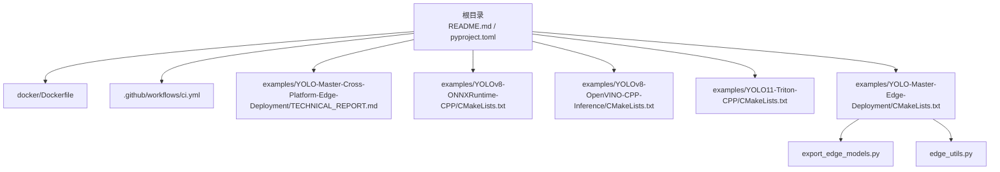
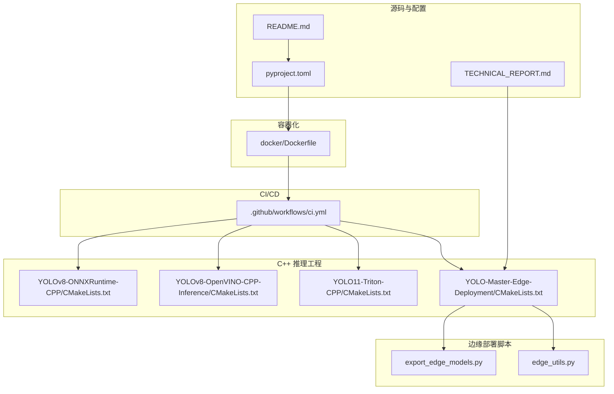
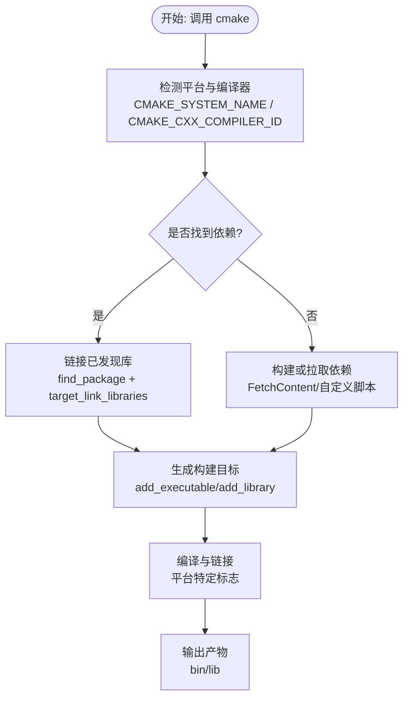
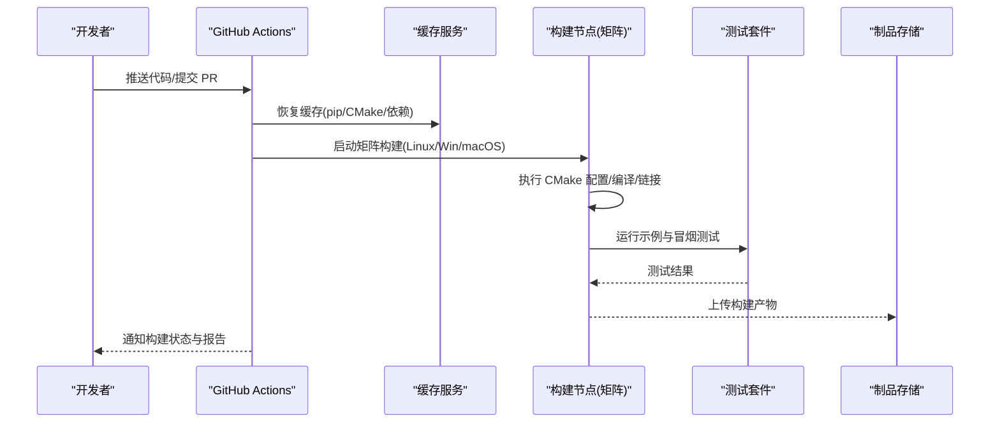
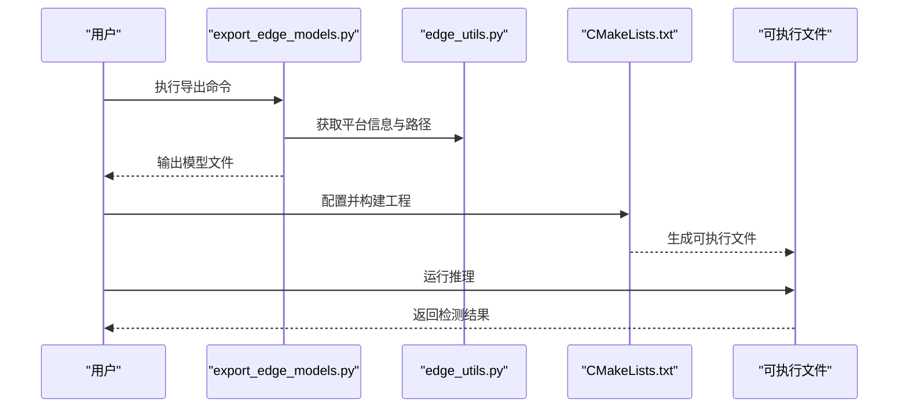
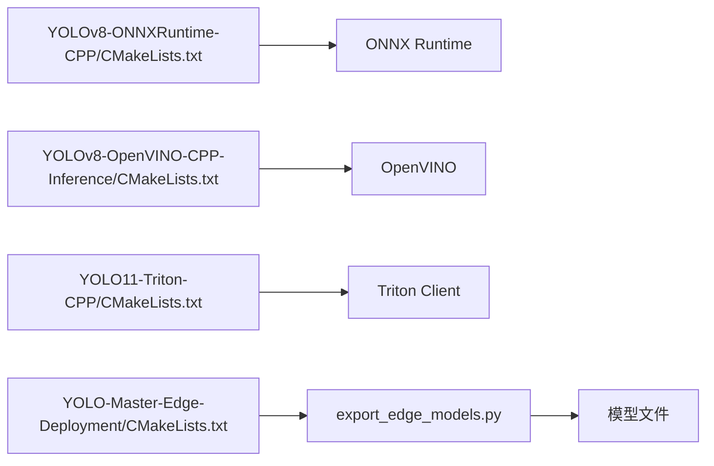

# 跨平台构建系统

<cite>
**本文引用的文件**
- [Dockerfile](file://docker/Dockerfile)
- [.github/workflows/ci.yml](file://.github/workflows/ci.yml)
- [examples/YOLO-Master-Cross-Platform-Edge-Deployment/TECHNICAL_REPORT.md](file://examples/YOLO-Master-Cross-Platform-Edge-Deployment/TECHNICAL_REPORT.md)
- [examples/YOLOv8-ONNXRuntime-CPP/CMakeLists.txt](file://examples/YOLOv8-ONNXRuntime-CPP/CMakeLists.txt)
- [examples/YOLOv8-OpenVINO-CPP-Inference/CMakeLists.txt](file://examples/YOLOv8-OpenVINO-CPP-Inference/CMakeLists.txt)
- [examples/YOLO11-Triton-CPP/CMakeLists.txt](file://examples/YOLO11-Triton-CPP/CMakeLists.txt)
- [examples/YOLO-Master-Edge-Deployment/CMakeLists.txt](file://examples/YOLO-Master-Edge-Deployment/CMakeLists.txt)
- [examples/YOLO-Master-Edge-Deployment/export_edge_models.py](file://examples/YOLO-Master-Edge-Deployment/export_edge_models.py)
- [examples/YOLO-Master-Edge-Deployment/edge_utils.py](file://examples/YOLO-Master-Edge-Deployment/edge_utils.py)
- [pyproject.toml](file://pyproject.toml)
- [README.md](file://README.md)
</cite>

## 目录
1. [简介](#简介)
2. [项目结构](#项目结构)
3. [核心组件](#核心组件)
4. [架构总览](#架构总览)
5. [详细组件分析](#详细组件分析)
6. [依赖关系分析](#依赖关系分析)
7. [性能考虑](#性能考虑)
8. [故障排查指南](#故障排查指南)
9. [结论](#结论)
10. [附录](#附录)

## 简介
本技术文档聚焦于 YOLO-Master 的跨平台构建体系，围绕 CMake 构建系统的架构设计、平台检测与条件编译逻辑、第三方依赖管理策略（静态/动态链接）、Docker 容器化构建、CI/CD 流水线集成、增量编译与性能优化，以及常见构建问题的诊断与解决方案进行系统化说明。文档面向不同背景的读者，既提供高层概览，也给出代码级映射与可视化图示，帮助快速定位问题并提升构建效率。

## 项目结构
仓库采用“示例驱动”的跨平台构建组织方式：核心 Python 包通过 pyproject.toml 管理，C++ 推理与部署示例以独立子工程形式存在，每个子工程自带 CMakeLists.txt；容器化构建由 docker/Dockerfile 统一编排；自动化测试与发布流程由 .github/workflows 下的 CI 配置驱动。

图表来源
- [README.md](file://README.md)
- [pyproject.toml](file://pyproject.toml)
- [Dockerfile](file://docker/Dockerfile)
- [.github/workflows/ci.yml](file://.github/workflows/ci.yml)
- [examples/YOLO-Master-Cross-Platform-Edge-Deployment/TECHNICAL_REPORT.md](file://examples/YOLO-Master-Cross-Platform-Edge-Deployment/TECHNICAL_REPORT.md)
- [examples/YOLOv8-ONNXRuntime-CPP/CMakeLists.txt](file://examples/YOLOv8-ONNXRuntime-CPP/CMakeLists.txt)
- [examples/YOLOv8-OpenVINO-CPP-Inference/CMakeLists.txt](file://examples/YOLOv8-OpenVINO-CPP-Inference/CMakeLists.txt)
- [examples/YOLO11-Triton-CPP/CMakeLists.txt](file://examples/YOLO11-Triton-CPP/CMakeLists.txt)
- [examples/YOLO-Master-Edge-Deployment/CMakeLists.txt](file://examples/YOLO-Master-Edge-Deployment/CMakeLists.txt)
- [examples/YOLO-Master-Edge-Deployment/export_edge_models.py](file://examples/YOLO-Master-Edge-Deployment/export_edge_models.py)
- [examples/YOLO-Master-Edge-Deployment/edge_utils.py](file://examples/YOLO-Master-Edge-Deployment/edge_utils.py)

章节来源
- [README.md](file://README.md)
- [pyproject.toml](file://pyproject.toml)
- [Dockerfile](file://docker/Dockerfile)
- [.github/workflows/ci.yml](file://.github/workflows/ci.yml)
- [examples/YOLO-Master-Cross-Platform-Edge-Deployment/TECHNICAL_REPORT.md](file://examples/YOLO-Master-Cross-Platform-Edge-Deployment/TECHNICAL_REPORT.md)
- [examples/YOLOv8-ONNXRuntime-CPP/CMakeLists.txt](file://examples/YOLOv8-ONNXRuntime-CPP/CMakeLists.txt)
- [examples/YOLOv8-OpenVINO-CPP-Inference/CMakeLists.txt](file://examples/YOLOv8-OpenVINO-CPP-Inference/CMakeLists.txt)
- [examples/YOLO11-Triton-CPP/CMakeLists.txt](file://examples/YOLO11-Triton-CPP/CMakeLists.txt)
- [examples/YOLO-Master-Edge-Deployment/CMakeLists.txt](file://examples/YOLO-Master-Edge-Deployment/CMakeLists.txt)
- [examples/YOLO-Master-Edge-Deployment/export_edge_models.py](file://examples/YOLO-Master-Edge-Deployment/export_edge_models.py)
- [examples/YOLO-Master-Edge-Deployment/edge_utils.py](file://examples/YOLO-Master-Edge-Deployment/edge_utils.py)

## 核心组件
- 顶层构建入口与元数据
  - README.md：项目概述、安装与使用指引、平台支持说明等。
  - pyproject.toml：Python 包元数据、依赖声明、可选特性开关与脚本入口，为跨平台环境准备与运行提供基础。
- Docker 容器化构建
  - docker/Dockerfile：定义多阶段构建镜像，包含编译器、运行时库、依赖安装与打包产物输出路径，确保可复现的跨平台构建环境。
- CI/CD 流水线
  - .github/workflows/ci.yml：触发条件、矩阵构建（多平台/多版本）、缓存策略、测试执行与制品上传，实现自动化验证与发布前置检查。
- C++ 推理示例与 CMake 工程
  - examples/YOLOv8-ONNXRuntime-CPP/CMakeLists.txt：基于 ONNX Runtime 的跨平台 C++ 推理工程，展示平台检测、依赖查找与目标生成。
  - examples/YOLOv8-OpenVINO-CPP-Inference/CMakeLists.txt：OpenVINO 后端示例，体现 Linux/macOS/Windows 差异处理与工具链选择。
  - examples/YOLO11-Triton-CPP/CMakeLists.txt：Triton 客户端示例，演示网络通信与外部服务集成。
  - examples/YOLO-Master-Edge-Deployment/CMakeLists.txt：边缘部署工程，结合导出脚本完成模型转换与二进制打包。
- 边缘部署辅助脚本
  - export_edge_models.py：负责将 PyTorch/TensorFlow 模型导出为 ONNX/OpenVINO/TFLite 等格式，供 C++ 工程加载。
  - edge_utils.py：封装平台探测、路径解析、环境变量注入与日志记录等通用能力。

章节来源
- [README.md](file://README.md)
- [pyproject.toml](file://pyproject.toml)
- [Dockerfile](file://docker/Dockerfile)
- [.github/workflows/ci.yml](file://.github/workflows/ci.yml)
- [examples/YOLOv8-ONNXRuntime-CPP/CMakeLists.txt](file://examples/YOLOv8-ONNXRuntime-CPP/CMakeLists.txt)
- [examples/YOLOv8-OpenVINO-CPP-Inference/CMakeLists.txt](file://examples/YOLOv8-OpenVINO-CPP-Inference/CMakeLists.txt)
- [examples/YOLO11-Triton-CPP/CMakeLists.txt](file://examples/YOLO11-Triton-CPP/CMakeLists.txt)
- [examples/YOLO-Master-Edge-Deployment/CMakeLists.txt](file://examples/YOLO-Master-Edge-Deployment/CMakeLists.txt)
- [examples/YOLO-Master-Edge-Deployment/export_edge_models.py](file://examples/YOLO-Master-Edge-Deployment/export_edge_models.py)
- [examples/YOLO-Master-Edge-Deployment/edge_utils.py](file://examples/YOLO-Master-Edge-Deployment/edge_utils.py)

## 架构总览
下图展示了从源码到可执行产物的端到端构建链路，涵盖 Python 层、C++ 推理层、容器化与 CI 流水线的协作关系。

图表来源
- [README.md](file://README.md)
- [pyproject.toml](file://pyproject.toml)
- [Dockerfile](file://docker/Dockerfile)
- [.github/workflows/ci.yml](file://.github/workflows/ci.yml)
- [examples/YOLO-Master-Cross-Platform-Edge-Deployment/TECHNICAL_REPORT.md](file://examples/YOLO-Master-Cross-Platform-Edge-Deployment/TECHNICAL_REPORT.md)
- [examples/YOLOv8-ONNXRuntime-CPP/CMakeLists.txt](file://examples/YOLOv8-ONNXRuntime-CPP/CMakeLists.txt)
- [examples/YOLOv8-OpenVINO-CPP-Inference/CMakeLists.txt](file://examples/YOLOv8-OpenVINO-CPP-Inference/CMakeLists.txt)
- [examples/YOLO11-Triton-CPP/CMakeLists.txt](file://examples/YOLO11-Triton-CPP/CMakeLists.txt)
- [examples/YOLO-Master-Edge-Deployment/CMakeLists.txt](file://examples/YOLO-Master-Edge-Deployment/CMakeLists.txt)
- [examples/YOLO-Master-Edge-Deployment/export_edge_models.py](file://examples/YOLO-Master-Edge-Deployment/export_edge_models.py)
- [examples/YOLO-Master-Edge-Deployment/edge_utils.py](file://examples/YOLO-Master-Edge-Deployment/edge_utils.py)

## 详细组件分析

### CMake 构建系统与平台检测
- 平台检测与条件编译
  - 各 CMakeLists.txt 中通常通过内置变量（如 CMAKE_SYSTEM_NAME、CMAKE_HOST_SYSTEM_PROCESSOR）判断操作系统与架构，从而启用特定选项或链接器标志。
  - 针对 Windows 使用 MSVC 时，需设置运行时库与警告级别；Linux/macOS 则根据 GCC/Clang 版本调整优化与 ABI 兼容参数。
- 依赖解析策略
  - 优先使用 find_package 查找系统或用户安装的第三方库（如 OpenCV、OpenVINO、ONNX Runtime、Triton Client）。
  - 当未找到系统依赖时，回退至预编译静态库或从源码构建（通过 FetchContent 或自定义下载脚本），保证离线构建能力。
- 目标与接口
  - 为每种后端（ONNXRuntime、OpenVINO、Triton）创建独立的可执行目标，并通过 target_link_libraries 链接对应库。
  - 使用 target_include_directories 与 target_compile_definitions 暴露平台相关宏，便于在 C++ 代码中进行条件编译。

图表来源
- [examples/YOLOv8-ONNXRuntime-CPP/CMakeLists.txt](file://examples/YOLOv8-ONNXRuntime-CPP/CMakeLists.txt)
- [examples/YOLOv8-OpenVINO-CPP-Inference/CMakeLists.txt](file://examples/YOLOv8-OpenVINO-CPP-Inference/CMakeLists.txt)
- [examples/YOLO11-Triton-CPP/CMakeLists.txt](file://examples/YOLO11-Triton-CPP/CMakeLists.txt)
- [examples/YOLO-Master-Edge-Deployment/CMakeLists.txt](file://examples/YOLO-Master-Edge-Deployment/CMakeLists.txt)

章节来源
- [examples/YOLOv8-ONNXRuntime-CPP/CMakeLists.txt](file://examples/YOLOv8-ONNXRuntime-CPP/CMakeLists.txt)
- [examples/YOLOv8-OpenVINO-CPP-Inference/CMakeLists.txt](file://examples/YOLOv8-OpenVINO-CPP-Inference/CMakeLists.txt)
- [examples/YOLO11-Triton-CPP/CMakeLists.txt](file://examples/YOLO11-Triton-CPP/CMakeLists.txt)
- [examples/YOLO-Master-Edge-Deployment/CMakeLists.txt](file://examples/YOLO-Master-Edge-Deployment/CMakeLists.txt)

### 平台差异与兼容性处理（Linux、Windows、macOS）
- Linux
  - 默认使用 GCC/Clang，开启 -O3/-march=native 等优化；动态库路径通过 LD_LIBRARY_PATH 或 rpath 管理。
  - 对 OpenVINO 与 ONNX Runtime 的系统包或 conda 包进行路径探测。
- Windows
  - 使用 MSVC，注意运行时库（/MD 或 /MT）一致性与 DLL 搜索路径；必要时使用 vcpkg 或 NuGet 管理依赖。
  - 路径分隔符与大小写敏感差异需在 CMake 与 Python 脚本中统一处理。
- macOS
  - 使用 Clang，注意 Homebrew 安装路径与 SDK 版本；动态库后缀为 .dylib，需正确设置 @rpath。
  - 对 CoreML 或 Metal 加速库的条件编译与链接。

章节来源
- [examples/YOLOv8-ONNXRuntime-CPP/CMakeLists.txt](file://examples/YOLOv8-ONNXRuntime-CPP/CMakeLists.txt)
- [examples/YOLOv8-OpenVINO-CPP-Inference/CMakeLists.txt](file://examples/YOLOv8-OpenVINO-CPP-Inference/CMakeLists.txt)
- [examples/YOLO11-Triton-CPP/CMakeLists.txt](file://examples/YOLO11-Triton-CPP/CMakeLists.txt)
- [examples/YOLO-Master-Edge-Deployment/CMakeLists.txt](file://examples/YOLO-Master-Edge-Deployment/CMakeLists.txt)

### 第三方依赖管理策略（静态链接 vs 动态链接）
- 动态链接
  - 优点：体积更小、更新灵活；缺点：运行期需满足依赖版本与环境变量。
  - 适用场景：服务器/云端部署，具备集中式依赖管理与容器化环境。
- 静态链接
  - 优点：自包含、部署简单；缺点：二进制体积大、升级成本高。
  - 适用场景：边缘设备、离线环境、严格合规要求。
- 混合策略
  - 核心库静态链接，易变插件动态加载；通过 CMake 选项控制链接模式，并在运行时校验可用库。

章节来源
- [examples/YOLOv8-ONNXRuntime-CPP/CMakeLists.txt](file://examples/YOLOv8-ONNXRuntime-CPP/CMakeLists.txt)
- [examples/YOLOv8-OpenVINO-CPP-Inference/CMakeLists.txt](file://examples/YOLOv8-OpenVINO-CPP-Inference/CMakeLists.txt)
- [examples/YOLO11-Triton-CPP/CMakeLists.txt](file://examples/YOLO11-Triton-CPP/CMakeLists.txt)
- [examples/YOLO-Master-Edge-Deployment/CMakeLists.txt](file://examples/YOLO-Master-Edge-Deployment/CMakeLists.txt)

### Docker 容器化构建
- 多阶段构建
  - 构建阶段：安装编译器、SDK、依赖包，执行 CMake 构建与测试。
  - 运行阶段：仅拷贝必要二进制与运行时库，减小镜像体积。
- 关键配置要点
  - 固定基础镜像版本与依赖版本，确保可复现性。
  - 使用缓存卷挂载加速 pip 与 CMake 依赖下载。
  - 在镜像内设置好环境变量（如 OpenVINO 环境变量、LD_LIBRARY_PATH）。
- 使用方式
  - 本地构建：docker build -t yolo-master-build .
  - 运行构建：docker run --rm -v $(pwd)/out:/out yolo-master-build
  - 运行推理：docker run --rm -v $(pwd)/models:/models yolo-master-runtime

章节来源
- [Dockerfile](file://docker/Dockerfile)

### CI/CD 流水线集成
- 触发与矩阵
  - 按分支/标签触发，矩阵覆盖多平台（Linux/Windows/macOS）与多编译器版本。
- 缓存与并行
  - 缓存 pip 包、CMake 依赖与下载资源，减少重复构建时间。
  - 并行执行多个示例工程的构建与测试任务。
- 测试与制品
  - 单元测试与冒烟测试在构建后自动执行。
  - 构建产物（二进制、模型导出结果）作为工件上传，供后续发布或人工验证。

图表来源
- [.github/workflows/ci.yml](file://.github/workflows/ci.yml)

章节来源
- [.github/workflows/ci.yml](file://.github/workflows/ci.yml)

### 边缘部署与模型导出流程
- 导出流程
  - 通过 export_edge_models.py 将训练好的权重导出为 ONNX/OpenVINO/TFLite 等格式，并输出到指定目录。
  - edge_utils.py 提供平台探测、路径拼接、日志记录与错误提示，确保在不同环境下稳定运行。
- 构建与运行
  - CMakeLists.txt 将导出的模型作为输入资源，链接相应推理后端，生成可执行文件。
  - 运行前检查模型与库可用性，失败时给出明确诊断信息。

图表来源
- [examples/YOLO-Master-Edge-Deployment/export_edge_models.py](file://examples/YOLO-Master-Edge-Deployment/export_edge_models.py)
- [examples/YOLO-Master-Edge-Deployment/edge_utils.py](file://examples/YOLO-Master-Edge-Deployment/edge_utils.py)
- [examples/YOLO-Master-Edge-Deployment/CMakeLists.txt](file://examples/YOLO-Master-Edge-Deployment/CMakeLists.txt)

章节来源
- [examples/YOLO-Master-Edge-Deployment/export_edge_models.py](file://examples/YOLO-Master-Edge-Deployment/export_edge_models.py)
- [examples/YOLO-Master-Edge-Deployment/edge_utils.py](file://examples/YOLO-Master-Edge-Deployment/edge_utils.py)
- [examples/YOLO-Master-Edge-Deployment/CMakeLists.txt](file://examples/YOLO-Master-Edge-Deployment/CMakeLists.txt)

## 依赖关系分析
- 模块耦合与内聚
  - CMakeLists.txt 之间相互独立，通过统一的导出目录约定共享模型资源，降低耦合度。
  - Python 导出脚本与 C++ 工程通过文件路径与命令行参数解耦，便于替换后端。
- 直接/间接依赖
  - 直接依赖：ONNX Runtime、OpenVINO、Triton Client、OpenCV 等。
  - 间接依赖：系统库（glibc、pthread、dl）、CUDA/ROCm（若启用 GPU 加速）。
- 外部集成点
  - GitHub Actions 缓存与制品服务。
  - 容器镜像仓库（可选，用于分发构建镜像）。

图表来源
- [examples/YOLOv8-ONNXRuntime-CPP/CMakeLists.txt](file://examples/YOLOv8-ONNXRuntime-CPP/CMakeLists.txt)
- [examples/YOLOv8-OpenVINO-CPP-Inference/CMakeLists.txt](file://examples/YOLOv8-OpenVINO-CPP-Inference/CMakeLists.txt)
- [examples/YOLO11-Triton-CPP/CMakeLists.txt](file://examples/YOLO11-Triton-CPP/CMakeLists.txt)
- [examples/YOLO-Master-Edge-Deployment/CMakeLists.txt](file://examples/YOLO-Master-Edge-Deployment/CMakeLists.txt)
- [examples/YOLO-Master-Edge-Deployment/export_edge_models.py](file://examples/YOLO-Master-Edge-Deployment/export_edge_models.py)

章节来源
- [examples/YOLOv8-ONNXRuntime-CPP/CMakeLists.txt](file://examples/YOLOv8-ONNXRuntime-CPP/CMakeLists.txt)
- [examples/YOLOv8-OpenVINO-CPP-Inference/CMakeLists.txt](file://examples/YOLOv8-OpenVINO-CPP-Inference/CMakeLists.txt)
- [examples/YOLO11-Triton-CPP/CMakeLists.txt](file://examples/YOLO11-Triton-CPP/CMakeLists.txt)
- [examples/YOLO-Master-Edge-Deployment/CMakeLists.txt](file://examples/YOLO-Master-Edge-Deployment/CMakeLists.txt)
- [examples/YOLO-Master-Edge-Deployment/export_edge_models.py](file://examples/YOLO-Master-Edge-Deployment/export_edge_models.py)

## 性能考虑
- 增量编译
  - 使用 Ninja 生成器替代 Make，显著提升增量构建速度。
  - 合理划分源文件与头文件，避免不必要的重编译。
  - 利用 CMake 的 cache 与 external project 缓存机制，复用已下载的依赖。
- 并行构建
  - 在 CI 中使用 -j$(nproc) 或 ctest --parallel，充分利用多核 CPU。
- 链接优化
  - 生产构建启用 LTO（Link Time Optimization）与 strip 符号，减小二进制体积并提升运行性能。
- 缓存策略
  - 在 GitHub Actions 中缓存 pip 包、Conda 环境与 CMake 依赖目录，缩短冷启动时间。

[本节为通用指导，不直接分析具体文件]

## 故障排查指南
- 依赖未找到
  - 现象：CMake 报错找不到 OpenCV/OpenVINO/ONNX Runtime。
  - 排查：确认 find_package 路径与 CMAKE_PREFIX_PATH；在 Linux 下检查 ldconfig，Windows 下检查 PATH，macOS 下检查 Homebrew 路径。
- 运行时库缺失
  - 现象：可执行文件启动时报动态库未找到。
  - 排查：设置 LD_LIBRARY_PATH 或 rpath；在 Windows 上复制 DLL 到可执行同目录；在 macOS 上使用 install_name_tool 修正 @rpath。
- 平台不兼容
  - 现象：MSVC/GCC/Clang 版本差异导致编译失败。
  - 排查：锁定编译器版本；在 CMake 中添加最小版本检查；针对不同平台设置不同的编译标志。
- 模型导出失败
  - 现象：export_edge_models.py 抛出形状或算子不支持错误。
  - 排查：查看导出日志，降级或替换不支持的算子；使用 onnx-simplifier 或 OpenVINO Model Optimizer 进行后处理。
- CI 构建缓慢
  - 现象：每次构建都重新下载依赖。
  - 排查：启用缓存；拆分任务；使用镜像加速源。

章节来源
- [examples/YOLOv8-ONNXRuntime-CPP/CMakeLists.txt](file://examples/YOLOv8-ONNXRuntime-CPP/CMakeLists.txt)
- [examples/YOLOv8-OpenVINO-CPP-Inference/CMakeLists.txt](file://examples/YOLOv8-OpenVINO-CPP-Inference/CMakeLists.txt)
- [examples/YOLO11-Triton-CPP/CMakeLists.txt](file://examples/YOLO11-Triton-CPP/CMakeLists.txt)
- [examples/YOLO-Master-Edge-Deployment/export_edge_models.py](file://examples/YOLO-Master-Edge-Deployment/export_edge_models.py)
- [examples/YOLO-Master-Edge-Deployment/edge_utils.py](file://examples/YOLO-Master-Edge-Deployment/edge_utils.py)

## 结论
YOLO-Master 的跨平台构建体系以 CMake 为核心，结合 Docker 与 CI/CD 实现了高可复现、可扩展的构建与交付流程。通过平台检测、条件编译与灵活的依赖管理策略，项目在 Linux、Windows、macOS 上均能稳定构建与运行。配合增量编译与缓存优化，显著提升了开发体验与流水线效率。建议在生产环境中优先采用容器化与静态链接策略，以确保部署的一致性与安全性。

[本节为总结性内容，不直接分析具体文件]

## 附录
- 参考文档
  - TECHNICAL_REPORT.md：跨平台边缘部署的技术细节与实践案例。
- 快速上手
  - README.md：安装、基本用法与常见问题解答。
  - pyproject.toml：Python 依赖与可选特性清单。

章节来源
- [examples/YOLO-Master-Cross-Platform-Edge-Deployment/TECHNICAL_REPORT.md](file://examples/YOLO-Master-Cross-Platform-Edge-Deployment/TECHNICAL_REPORT.md)
- [README.md](file://README.md)
- [pyproject.toml](file://pyproject.toml)